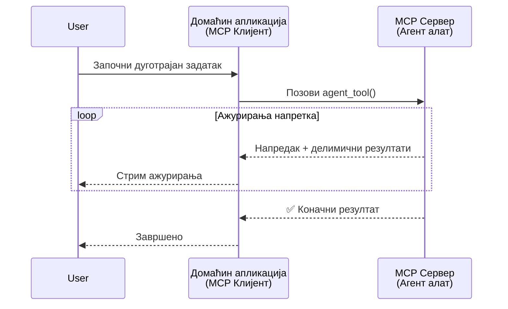
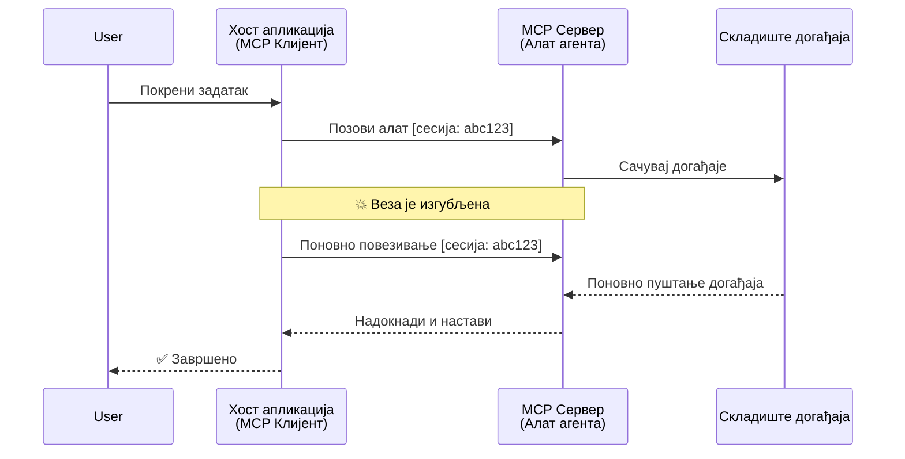
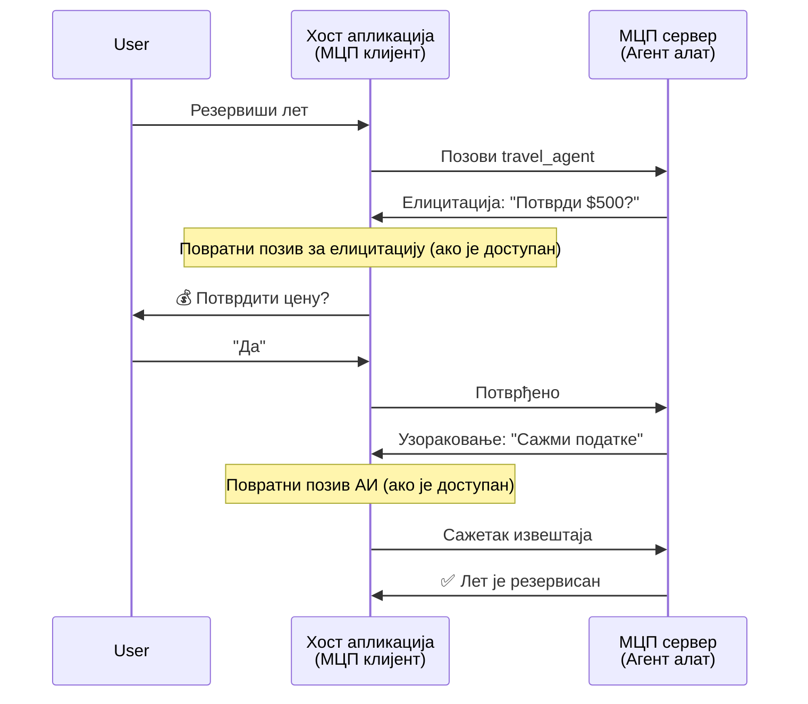

# Изградња система комуникације агент-агент помоћу MCP

> Кратко и јасно - Можете ли изградити комуникацију између агената на MCP? Можете!

MCP се значајно развио од свог почетног циља "обезбеђења контекста за LLM-ове". Са недавним побољшањима која укључују [можност наставка стримовања](https://modelcontextprotocol.io/docs/concepts/transports#resumability-and-redelivery), [елицитацију](https://modelcontextprotocol.io/specification/2025-06-18/client/elicitation), [узорковање](https://modelcontextprotocol.io/specification/2025-06-18/client/sampling) и нотификације ([прогрес](https://modelcontextprotocol.io/specification/2025-06-18/basic/utilities/progress) и [ресурси](https://modelcontextprotocol.io/specification/2025-06-18/schema#resourceupdatednotification)), MCP сада пружа робусну основу за изградњу сложених система комуникације агент-агент.

## Заблуда о агенту/алату

Како све више програмера истражује алате са агентним понашањем (ради дуго времена, може тражити додатни унос током извршења итд.), честа заблуда је да MCP није погодан, углавном зато што су рани примери његових примитивних алата били фокусирани на једноставне образце захтева и одговора.

Ова перцепција је застарела. Спецификација MCP-а је значајно унапређена у последњих неколико месеци са могућностима које смањују јаз у изградњи понашања агената који раде дуго време:

- **Стриминг & Делимични резултати**: Ажурирања у реалном времену током извршења
- **Наставак**: Клијенти могу да се поново повежу и наставе након прекида
- **Издржљивост**: Резултати преживљавају рестарте сервера (нпр. преко веза до ресурса)
- **Више корака**: Интерактивни унос током извршења преко елицитације и узорковања

Ове функције могу се комбиновати за омогућавање сложених агенцијских и вишенаменских апликација, све примењено на MCP протоколу.

За референту вредност, агента ћемо називати "алатом" који је доступан на MCP серверу. Ово подразумева постојање хост апликације која имплементира MCP клијент који успоставља сесију са MCP сервером и може позивати агента.

## Шта чини MCP алат "агентичним"?

Пре него што пређемо на имплементацију, хајде да утврдимо које инфраструктурне могућности су потребне за подршку агената који раде дуго времена.

> Дефинисаћемо агента као ентитет који може аутономно деловати током продужених периода, способан да обавља сложене задатке који могу захтевати више интеракција или прилагођавања на основу повратних информација у реалном времену.

### 1. Стриминг и делимични резултати

Традиционални обрасци захтева и одговора не функционишу за дуготрајне задатке. Агенти треба да обезбеде:

- Ажурирања напредка у реалном времену
- Прелиминарне резултате

**Подршка MCP**: Нотификације о ажурирању ресурса омогућавају стримовање делимичних резултата, мада је потребан пажљив дизајн да се избегну конфликти са 1:1 моделом захтева/одговора JSON-RPC-а.

| Карактеристика             | Примена                                                                                                                                          | Подршка MCP-а                                                                              |
| -------------------------- | ----------------------------------------------------------------------------------------------------------------------------------------------- | ------------------------------------------------------------------------------------------ |
| Ажурирања напретка у реалном времену | Корисник захтева миграцију кодне базе. Агенат дигитално преноси напредак: "10% - Анализа зависности... 25% - Конверзија TypeScript датотека... 50% - Ажурирање увоза..." | ✅ Нотификације о напредку                                                                |
| Делимични резултати        | Задатак "Направи књигу" струји делимичне резултате, нпр. 1) Нацрт радње, 2) Листа поглавља, 3) Сва поглавља како се завршавају. Домаћин може прегледати, отказати или преусмерити у било ком тренутку. | ✅ Нотификације могу бити "проширене" да укључују делимичне резултате, види предлоге на PR 383, 776 |

<div align="center" style="font-style: italic; font-size: 0.95em; margin-bottom: 0.5em;">
<strong>Слика 1:</strong> Овај дијаграм илуструје како MCP агент струји ажурирања напретка у реалном времену и делимичне резултате према хост апликацији током дуготрајног задатка, омогућавајући кориснику да прати извршење у реалном времену.
</div>


```mermaid
sequenceDiagram
    participant User
    participant Host as Домаћин апликација<br/>(MCP Клијент)
    participant Server as MCP Сервер<br/>(Агент алат)

    User->>Host: Започни дуготрајан задатак
    Host->>Server: Позови agent_tool()

    loop Ажурирања напретка
        Server-->>Host: Напредак + делимични резултати
        Host-->>User: Стрим ажурирања
    end

    Server-->>Host: ✅ Коначни резултат
    Host-->>User: Завршено
```

### 2. Наставак

Агенти морају лепо руковати са прекидима у мрежи:

- Поново се повезати након (клијентског) прекида
- Наставити од места на коме су стали (поновна испорука порука)

**Подршка MCP**: MCP StreamableHTTP транспорт данас подржава наставак сесије и поновну испоруку порука са ID-јевима сесије и последњег догађаја. Важно је напоменути да сервер мора имплементирати EventStore који омогућава репродукцију догађаја при поновном повезивању клијента.
Обратите пажњу да постоји предлог заједнице (PR #975) који истражује апстрактне стримове независне од транспорта.

| Карактеристика | Примена                                                                                                                                                  | Подршка MCP-а                                                              |
| -------------- | ------------------------------------------------------------------------------------------------------------------------------------------------------- | -------------------------------------------------------------------------- |
| Наставак       | Клијент се искључује током дуготрајног задатка. По повезивању, сесија се наставља са репродукцијом пропуштених догађаја, настављајући без прекида од претходног места. | ✅ StreamableHTTP транспорт са ID-јевима сесије, репродукцијом догађаја и EventStore |

<div align="center" style="font-style: italic; font-size: 0.95em; margin-bottom: 0.5em;">
<strong>Слика 2:</strong> Овај дијаграм показује како MCP-ов StreamableHTTP транспорт и EventStore омогућавају непрекидан наставак сесије: ако се клијент искључи, он се може поново повезати и репродуковати пропуштене догађаје, настављајући задатак без губитка напретка.
</div>


```mermaid
sequenceDiagram
    participant User
    participant Host as Хост апликација<br/>(MCP Клијент)
    participant Server as MCP Сервер<br/>(Алат агента)
    participant Store as Складиште догађаја

    User->>Host: Покрени задатак
    Host->>Server: Позови алат [сесија: abc123]
    Server->>Store: Сачувај догађаје

    Note over Host,Server: 💥 Веза је изгубљена

    Host->>Server: Поновно повезивање [сесија: abc123]
    Store-->>Server: Поновно пуштање догађаја
    Server-->>Host: Надокнади и настави
    Host-->>User: ✅ Завршено
```

### 3. Издржљивост

Дуготрајни агенти требају трајно стање:

- Резултати преживљавају рестарте сервера
- Статус може бити преузет ван линије
- Праћење напретка кроз сесије

**Подршка MCP**: MCP сада подржава тип повратне вредности Resource линк за позиве алата. Данас је могући образац да се дизајнира алат који креира ресурс и одмах враћа Resource линк. Алат може наставити да ради на задатку у позадини и ажурира ресурс. Клијент може да прати стање тог ресурса ради добијања делимичних или потпуних резултата (на основу онога шта сервер доставља у ажурирањима ресурса) или да се претплати на ресурс за нотификације о ажурирањима.

Једно ограничење овде је да праћење ресурса или претплата на ажурирања може трошити ресурсе што има импликације на скалирање. Постоји отворени предлог заједнице (укључујући #992) који истражује могућност укључивања вебхукова или тригера које сервер може позивати да обавести клијента/хост апликацију о ажурирањима.

| Карактеристика | Примена                                                                                                                                        | Подршка MCP-а                                                    |
| -------------- | ---------------------------------------------------------------------------------------------------------------------------------------------- | ---------------------------------------------------------------- |
| Издржљивост    | Сервер пада током задатка миграције података. Резултати и напредак преживљавају рестарт, клијент може проверити статус и наставити са трајним ресурсом. | ✅ Везе ка ресурсима са трајном меморијом и нотификацијама статуса |

Данас је уобичајен образац дизајнирати алат који креира ресурс и одмах враћа везу ка ресурсу. Алат може у позадини решавати задатак, слати нотификације ресурса које служе као ажурирања напретка или укључују делимичне резултате, и ажурирати садржај у ресурсу по потреби.

<div align="center" style="font-style: italic; font-size: 0.95em; margin-bottom: 0.5em;">
<strong>Слика 3:</strong> Овај дијаграм показује како MCP агенти користе трајне ресурсе и нотификације статуса како би обезбедили да дуготрајни задаци преживе рестарте сервера, омогућавајући клијентима да провере напретка и преузму резултате чак и након кварова.
</div>


```mermaid
sequenceDiagram
    participant User
    participant Host as Хост апликација<br/>(MCP клијент)
    participant Server as MCP сервер<br/>(Агент алат)
    participant DB as Перзистентно складиште

    User->>Host: Покрени задатак
    Host->>Server: Позови алат
    Server->>DB: Креирај ресурс + ажурирања
    Server-->>Host: 🔗 Линк ка ресурсу

    Note over Server: 💥 Поновно покретање сервера

    User->>Host: Провери статус
    Host->>Server: Узми ресурс
    Server->>DB: Учитај стање
    Server-->>Host: Тренутни напредак
    Server->>DB: Заврши + обавести
    Host-->>User: ✅ Завршено
```

### 4. Вишеслојне интеракције

Агенти често требају додатни унос током извршења:

- Људско појашњење или одобрење
- AI помоћ за сложене одлуке
- Динамичко подешавање параметара

**Подршка MCP**: Потпуно подржано кроз узорковање (за AI унос) и елицитацију (за људски унос).

| Карактеристика           | Примена                                                                                                                                       | Подршка MCP-а                                          |
| ----------------------- | ---------------------------------------------------------------------------------------------------------------------------------------------- | ------------------------------------------------------ |
| Вишеслојне интеракције | Агенат за резервисање путовања тражи потврду цене од корисника, затим тражи од AI да сумира податке о путовању пре него што заврши трансакцију резервације. | ✅ Елицитација за људски унос, узорковање за AI унос     |

<div align="center" style="font-style: italic; font-size: 0.95em; margin-bottom: 0.5em;">
<strong>Слика 4:</strong> Овај дијаграм приказује како MCP агенти интерактивно могу добијати људски унос или тражити помоћ AI током извршења, подржавајући сложене, вишеслојне радне токове као што су потврде и динамичко доношење одлука.
</div>


```mermaid
sequenceDiagram
    participant User
    participant Host as Хост апликација<br/>(МЦП клијент)
    participant Server as МЦП сервер<br/>(Агент алат)

    User->>Host: Резервиши лет
    Host->>Server: Позови travel_agent

    Server->>Host: Елицитација: "Потврди $500?"
    Note over Host: Повратни позив за елицитацију (ако је доступан)
    Host->>User: 💰 Потврдити цену?
    User->>Host: "Да"
    Host->>Server: Потврђено

    Server->>Host: Узораковање: "Сажми податке"
    Note over Host: Повратни позив АИ (ако је доступан)
    Host->>Server: Сажетак извештаја

    Server->>Host: ✅ Лет је резервисан
```

## Имплементација дуготрајних агената на MCP - преглед кода

Као део овог чланка, пружамо [репозиторијум кода](https://github.com/victordibia/ai-tutorials/tree/main/MCP%20Agents) који садржи потпуну имплементацију дуготрајних агената користећи MCP Python SDK са StreamableHTTP транспортом за наставак сесије и поновну испоруку порука. Имплементација показује како се могу комбиновати MCP могућности за омогућавање софистицираних понашања сличних агентима.

Посебно, имплементирамо сервер са два главна агента-алата:

- **Травел агенат** - Симулира услугу резервације путовања са потврдама цена преко елицитације
- **Истраживачки агент** - Обавља истраживачке задатке са AI-ом за помоћ у сумаризацији путем узорковања

Оба агента демонстрирају ажурирања напретка у реалном времену, интерактивне потврде и потпуну способност наставка сесије.

### Кључни концепти имплементације

Следећи одељци приказују серверску имплементацију агената и руковање домаћина на клијентској страни за сваку могућност:

#### Стриминг и ажурирања напретка - статус задатка у реалном времену

Стриминг омогућава агентима да пружају ажурирања напретка у реалном времену током дуготрајних задатака, држећи кориснике информисанима о статусу и привременим резултатима.

**Имплементација на серверу (агент шаље нотификације напретка):**

```python
# Са server/server.py - Туристички агент шаље ажурирања напретка
for i, step in enumerate(steps):
    await ctx.session.send_progress_notification(
        progress_token=ctx.request_id,
        progress=i * 25,
        total=100,
        message=step,
        related_request_id=str(ctx.request_id)
    )
    await anyio.sleep(2)  # Симулирај рад

# Алтернатива: Логовање порука за детаљна ажурирања корак по корак
await ctx.session.send_log_message(
    level="info",
    data=f"Processing step {current_step}/{steps} ({progress_percent}%)",
    logger="long_running_agent",
    related_request_id=ctx.request_id,
)
```

**Имплементација на клијенту (домаћин прима ажурирања напретка):**

```python
# Из client/client.py - Клијент који обрађује обавештења у реалном времену
async def message_handler(message) -> None:
    if isinstance(message, types.ServerNotification):
        if isinstance(message.root, types.LoggingMessageNotification):
            console.print(f"📡 [dim]{message.root.params.data}[/dim]")
        elif isinstance(message.root, types.ProgressNotification):
            progress = message.root.params
            console.print(f"🔄 [yellow]{progress.message} ({progress.progress}/{progress.total})[/yellow]")

# Региструј обрађивач порука приликом креирања сесије
async with ClientSession(
    read_stream, write_stream,
    message_handler=message_handler
) as session:
```

#### Елицитација - захтев за кориснички унос

Елицитација омогућава агентима да током извршења затраже унос од корисника. Ово је кључно за потврде, појашњења или одобрења током дуготрајних задатака.

**Имплементација на серверу (агент тражи потврду):**

```python
# Из server/server.py - Путнички агент тражи потврду цене
elicit_result = await ctx.session.elicit(
    message=f"Please confirm the estimated price of $1200 for your trip to {destination}",
    requestedSchema=PriceConfirmationSchema.model_json_schema(),
    related_request_id=ctx.request_id,
)

if elicit_result and elicit_result.action == "accept":
    # Наставите са резервацијом
    logger.info(f"User confirmed price: {elicit_result.content}")
elif elicit_result and elicit_result.action == "decline":
    # Откажите резервацију
    booking_cancelled = True
```

**Имплементација на клијенту (домаћин пружа позив елицитације):**

```python
# Из client/client.py - Управљање клијентским захтевима за елабораторним информацијама
async def elicitation_callback(context, params):
    console.print(f"💬 Server is asking for confirmation:")
    console.print(f"   {params.message}")

    response = console.input("Do you accept? (y/n): ").strip().lower()

    if response in ['y', 'yes']:
        return types.ElicitResult(
            action="accept",
            content={"confirm": True, "notes": "Confirmed by user"}
        )
    else:
        return types.ElicitResult(
            action="decline",
            content={"confirm": False, "notes": "Declined by user"}
        )

# Региструјте повратни позив приликом креирања сесије
async with ClientSession(
    read_stream, write_stream,
    elicitation_callback=elicitation_callback
) as session:
```

#### Узорковање - захтев за помоћ AI

Узорковање омогућава агентима да затраже LLM помоћ за сложене одлуке или генерисање садржаја током извршења. Ово омогућава хибридне људско-AI радне токове.

**Имплементација на серверу (агент тражи помоћ AI):**

```python
# Из server/server.py - Истраживачки агент тражи AI резиме
sampling_result = await ctx.session.create_message(
    messages=[
        SamplingMessage(
            role="user",
            content=TextContent(type="text", text=f"Please summarize the key findings for research on: {topic}")
        )
    ],
    max_tokens=100,
    related_request_id=ctx.request_id,
)

if sampling_result and sampling_result.content:
    if sampling_result.content.type == "text":
        sampling_summary = sampling_result.content.text
        logger.info(f"Received sampling summary: {sampling_summary}")
```

**Имплементација на клијенту (домаћин пружа узорковање):**

```python
# Из клиент/client.py - Обрада корисничких захтева за узорковање
async def sampling_callback(context, params):
    message_text = params.messages[0].content.text if params.messages else 'No message'
    console.print(f"🧠 Server requested sampling: {message_text}")

    # У стварној апликацији, ово би могло да позове LLM API
    # За демонстрационе сврхе, пружамо лажни одговор
    mock_response = "Based on current research, MCP has evolved significantly..."

    return types.CreateMessageResult(
        role="assistant",
        content=types.TextContent(type="text", text=mock_response),
        model="interactive-client",
        stopReason="endTurn"
    )

# Региструјте повратни позив при креирању сесије
async with ClientSession(
    read_stream, write_stream,
    sampling_callback=sampling_callback,
    elicitation_callback=elicitation_callback
) as session:
```

#### Наставак - континуитет сесије преко прекида

Наставак обезбеђује да дуготрјани задаци агената могу да преживе прекиде клијента и наставе беспрекорно по поновном повезивању. Ово се имплементира кроз Event store и токене за наставак.

**Имплементација Event Store (сервер држи стање сесије):**

```python
# Из server/event_store.py - Једноставни меморијски складиште догађаја
class SimpleEventStore(EventStore):
    def __init__(self):
        self._events: list[tuple[StreamId, EventId, JSONRPCMessage]] = []
        self._event_id_counter = 0

    async def store_event(self, stream_id: StreamId, message: JSONRPCMessage) -> EventId:
        """Store an event and return its ID."""
        self._event_id_counter += 1
        event_id = str(self._event_id_counter)
        self._events.append((stream_id, event_id, message))
        return event_id

    async def replay_events_after(self, last_event_id: EventId, send_callback: EventCallback) -> StreamId | None:
        """Replay events after the specified ID for resumption."""
        # Пронађи догађаје након последњег познатог догађаја и репродукуј их
        for _, event_id, message in self._events[start_index:]:
            await send_callback(EventMessage(message, event_id))

# Из server/server.py - Прослеђивање складишта догађаја управнику сесија
def create_server_app(event_store: Optional[EventStore] = None) -> Starlette:
    server = ResumableServer()

    # Креирање управника сесија са складиштем догађаја за наставак
    session_manager = StreamableHTTPSessionManager(
        app=server,
        event_store=event_store,  # Складиште догађаја омогућава наставак сесије
        json_response=False,
        security_settings=security_settings,
    )

    return Starlette(routes=[Mount("/mcp", app=session_manager.handle_request)])

# Употреба: Иницијализација са складиштем догађаја
event_store = SimpleEventStore()
app = create_server_app(event_store)
```

**Мета подаци клијента са токеном за наставак (клијент се поново повезује користећи сачувано стање):**

```python
# Из client/client.py - Наставак клијента са метаподацима
if existing_tokens and existing_tokens.get("resumption_token"):
    # Користите постојећи токен за наставак да бисте наставили где сте стали
    metadata = ClientMessageMetadata(
        resumption_token=existing_tokens["resumption_token"],
    )
else:
    # Креирајте повратни позив да бисте сачували токен за наставак када буде примљен
    def enhanced_callback(token: str):
        protocol_version = getattr(session, 'protocol_version', None)
        token_manager.save_tokens(session_id, token, protocol_version, command, args)

    metadata = ClientMessageMetadata(
        on_resumption_token_update=enhanced_callback,
    )

# Пошаљите захтев са метаподацима за наставак
result = await session.send_request(
    types.ClientRequest(
        types.CallToolRequest(
            method="tools/call",
            params=types.CallToolRequestParams(name=command, arguments=args)
        )
    ),
    types.CallToolResult,
    metadata=metadata,
)
```

Хост апликација локално чува session ID-јеве и токене за наставак, омогућавајући поновно повезивање на постојеће сесије без губитка напретка или стања.

### Организација кода

<div align="center" style="font-style: italic; font-size: 0.95em; margin-bottom: 0.5em;">
<strong>Слика 5:</strong> Архитектура агенцијског система заснованог на MCP-у
</div>


```mermaid
graph LR
    User([Корисник]) -->|"Задатак"| Host["Домаћин<br/>(MCP Клијент)"]
    Host -->|листа алата| Server[MCP Сервер]
    Server -->|Излаже| AgentsTools[Агенте као Алате]
    AgentsTools -->|Задатак| AgentA[Туристички агент]
    AgentsTools -->|Задатак| AgentB[Истраживачки агент]

    Host -->|Прати| StateUpdates[Напредак и ажурирања стања]
    Server -->|Објављује| StateUpdates

    class User user;
    class AgentA,AgentB agent;
    class Host,Server,StateUpdates core;
```

**Кључне датотеке:**

- **`server/server.py`** - MCP сервер са могућношћу наставка рада са агенатима за путовања и истраживање који демонстрирају елицитацију, узорковање и ажурирања напретка
- **`client/client.py`** - Интерактивна хост апликација са подршком за наставак, хендлерима позива и управљањем токенима
- **`server/event_store.py`** - Имплементација Event store-а који омогућава наставак сесије и поновну испоруку порука

## Проширење на комуникацију више агената помоћу MCP-а

Горња имплементација може се проширити на вишенационалне системе унапређењем интелигенције и опсега хост апликације:

- **Интелигентна декомпозиција задатака**: Хост анализира сложене корисничке захтеве и разлаже их на подсегменте за различите специјализоване агенте
- **Координација више сервера**: Хост одржава везе са више MCP сервера, од којих сваки изложује различите могућности агената
- **Управљање стањем задатка**: Хост прати напредак кроз више истовремених задатака агената, управља зависностима и секвенцом
- **Отпорност и поновни покушаји**: Хост управља кваровима, спроводи логику поновног покушаја и преусмерава задатке када агенти постану недоступни
- **Синтеза резултата**: Хост комбинује излазе више агената у кохерентне крајње резултате

Хост се развија од једноставног клијента до интелигентног оркестратора, координишући дистрибуиране агенцијске капацитете уз одржавање исте MCP протоколне основе.

## Закључак

Унапређене могућности MCP-а - нотификације ресурса, елицитација/узорковање, могућност наставка стримова и трајни ресурси - омогућавају сложене интеракције агент-агент уз одржавање једноставности протокола.

## Почетак рада

Спремни сте да изградите свој агент2агент систем? Следите ове кораке:

### 1. Покрените демонстрацију

```bash
# Покрените сервер са складиштем догађаја за наставак
python -m server.server --port 8006

# У другом терминалу покрените интерактивни клијент
python -m client.client --url http://127.0.0.1:8006/mcp
```

**Доступне команде у интерактивном режиму:**

- `travel_agent` - Резервишите путовање са потврдом цене преко елицитације
- `research_agent` - Истражите теме са AI-асистираним сажецима путем узорковања
- `list` - Прикажи све доступне алате
- `clean-tokens` - Обриши токене за наставак
- `help` - Прикажи детаљну помоћ за команде
- `quit` - Излаз из клијента

### 2. Тестирајте могућности наставка рада

- Покрените дуготрајног агента (нпр. `travel_agent`)
- Прекинути клијента током извршења (Ctrl+C)
- Поново покрените клијента - он ће аутоматски наставити од места где је стао

### 3. Истражите и проширите

- **Истражите примере**: Погледајте овај [mcp-agents](https://github.com/victordibia/ai-tutorials/tree/main/MCP%20Agents)
- **Придружите се заједници**: Учестујте у MCP дискусијама на GitHub-у
- **Експериментишите**: Почните са једноставним дуготрајним задатком и постепено додајте стриминг, наставак рада и координацију више агената

Ово демонстрира како MCP омогућава интелигентна понашања агената уз одржавање једноставности алата.

Укупно, MCP протокол се брзо развија; читаоци се охрабрују да прегледају званични сајт документације за најновија ажурирања - https://modelcontextprotocol.io/introduction

---

<!-- CO-OP TRANSLATOR DISCLAIMER START -->
**Изјава о одрицању одговорности**:
Овај документ је преведен коришћењем услуге за аутоматски превод [Co-op Translator](https://github.com/Azure/co-op-translator). Иако тежимо тачности, имајте у виду да аутоматски преводи могу садржати грешке или нетачности. Оригинални документ на његовом изворном језику треба сматрати ауторитативним извором. За критичне информације препоручује се професионални људски превод. Нисмо одговорни за било каква неспоразума или погрешна тумачења која произилазе из коришћења овог превода.
<!-- CO-OP TRANSLATOR DISCLAIMER END -->