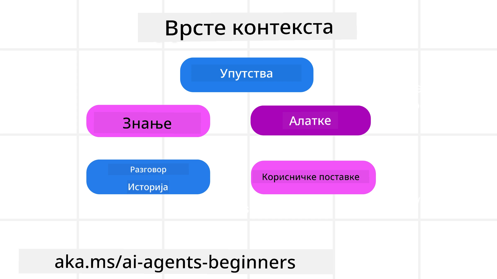
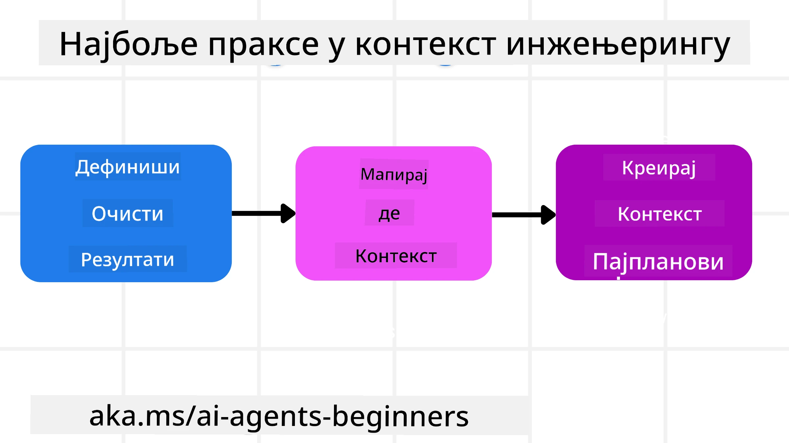

# Контекст инжењеринг за AI агенте

> _(Кликните на слику изнад да бисте погледали видео о овој лекцији)_

Разумевање сложености апликације за коју правите AI агента је важно за израду поузданог агента. Потребно је правити AI агенте који ефикасно управљају информацијама како би одговорили на комплексне потребе које превазилазе само инжењеринг упита.

У овој лекцији ћемо погледати шта је контекст инжењеринг и његову улогу у изградњи AI агената.

## Увод

Ова лекција ће обухватити:

• **Шта је Контекст Инжењеринг** и зашто је другачији од инжењеринга упита.

• **Стратегије за ефикасан Контекст Инжењеринг**, укључујући како писати, бирати, компримовати и изоловати информације.

• **Уобичајене грешке у контексту** које могу узроковати проблеме вашем AI агенту и како их поправити.

## Циљеви учења

Након завршетка ове лекције, бићете у стању да разумете како:

• **Дефинишете контекст инжењеринг** и разликујете га од инжењеринга упита.

• **Препознате кључне компоненте контекста** у апликацијама великог језичког модела (LLM).

• **Примeњујете стратегије за писање, одабир, компресију и изолацију контекста** за побољшање перформанси агента.

• **Препознате уобичајене грешке у контексту** као што су тровање, одвраћање пажње, конфузија и сукоб, и примените технике ублажавања.

## Шта је контекст инжењеринг?

За AI агенте, контекст је оно што покреће планирање да агент предузме одређене радње. Контекст инжењеринг је пракса обезбеђивања да AI агент има исправне информације да заврши следећи корак задатка. Величина прозора контекста је ограничена, па као творци агената морамо правити системе и процесе за управљање додавањем, уклањањем и кондензацијом информација у прозору контекста.

### Инжењеринг упита vs Контекст инжењеринг

Инжењеринг упита се фокусира на један скуп статичних упутстава којима се ефикасно води AI агент скупом правила. Контекст инжењеринг је управљање динамичким скупом информација, укључујући почетни упит, како би се осигурало да AI агент има оно што му треба током времена. Главна идеја контекст инжењеринга јесте да овај процес буде понављив и поуздан.

### Типови контекста

Важнo је запамтити да контекст није само једна ствар. Информације које AI агент треба могу доћи из различитих извора и нама је на располагању да осигурамо приступ агента тим изворима:

Типови контекста које AI агент може морати да управља укључују:

• **Упутства:** Ово су као "правила" агента – упити, системске поруке, примери са неколико налога (који показују AI како нешто да уради) и описи алата које може користити. Ово је место где се фокус инжењеринга упита спаја са контекст инжењерингом.

• **Знање:** Обухвата чињенице, информације преузете из база података или дугорочна сећања која је агент акумулирао. Ово укључује интеграцију система за генерацију уз препоруку извлачења (RAG) ако агент треба приступ различитим базама знања и података.

• **Алатке:** Ово су дефиниције екстерних функција, API-ја и MCP сервера које агент може позивати, заједно са повратним информацијама (резултатима) које добија њиховом употребом.

• **Историја разговора:** Текућа комуникација са корисником. Како време пролази, ови разговори постају дужи и комплекснији, што заузима простор у прозору контекста.

• **Корисничке преференције:** Информације које се сазнају о корисниковим свиђањима или неускидањима током времена. Оне могу бити сачуване и позиване при доношењу важних одлука да би се помогло кориснику.

## Стратегије за ефикасан контекст инжењеринг

### Стратегије планирања

Добар контекст инжењеринг почиње добрим планирањем. Ево приступа који ће вам помоћи да почнете да размишљате о примени концепта контекст инжењеринга:

1. **Дефинишите јасне резултате** – Резултати задатака AI агената треба да буду јасно дефинисани. Одговорите на питање - "Како ће свет изгледати када AI агент заврши свој задатак?" Другим речима, која промена, информација или одговор корисник треба да има након интеракције са AI агентом.
2. **Мапирајте контекст** – Када дефинишете резултате AI агента, потребно је одговорити на питање "Које информације AI агенту требају да заврши овај задатак?". На овај начин можете почети мапирање контекста и где се те информације могу налазити.
3. **Креирајте контекстуалне токове** – Сада када знате где су информације, треба одговорити на питање "Како ће агент добити те информације?". Ово може бити реализовано на разне начине, укључујући RAG, коришћење MCP сервера и других алата.

### Практичне стратегије

Планирање је важно, али када информације почну да улазе у прозор контекста агента, потребне су практичне стратегије за управљање тим информацијама:

#### Управљање контекстом

Док ће неке информације бити аутоматски додате у прозор контекста, контекст инжењеринг се односи на активну улогу у управљању тим информацијама која може бити реализована кроз неколико стратегија:

 1. **Бележница агента (Agent Scratchpad)**  
 Ово омогућава AI агенту да бележи релевантне информације о тренутним задацима и интеракцијама са корисником током једне сесије. Ово треба да постоји ван прозора контекста, у датотеци или објекту током извршавања, коју агент може касније вратити током те сесије ако је потребно.

 2. **Сећања**  
 Бележнице су добре за управљање информацијама ван прозора контекста појединачне сесије. Сећања омогућавају агентима да чувају и враћају релевантне информације кроз више сесија. Ово може укључивати сажетке, корисничке преференције и повратне информације у циљу побољшања у будућности.

 3. **Компресија контекста**  
 Када прозор контекста расте и приближава се своме лимиту, могу се применити технике као што су сажимање и скраћивање. Ово укључује или задржавање само најрелевантнијих информација или уклањање старих порука.

 4. **Системи са више агената**  
 Развојање система са више агената је облик контекст инжењеринга јер сваки агент има свој прозор контекста. Начин на који се тај контекст дели и преноси различитим агентима је још једна ствар коју треба планирати приликом изградње ових система.

 5. **Сандбокс окружења**  
 Ако агент треба да изврши неки код или процесуира велике количине информација у документу, ово може захтевати велики број токена за обраду резултата. Уместо чувања свега у прозору контекста, агент може користити сандбокс окружење које може покренути тај код и само прочитати резултате и друге релевантне информације.

 6. **Објекти стања током извршавања (Runtime State Objects)**  
 Ово се ради креирањем контејнера информација за управљање ситуацијама када агент треба приступ одређеним информацијама. За сложене задатке, ово омогућава агенту да чува резултате сваког подзадатка корак по корак, дозвољавајући да контекст остане повезан само са тим специфичним подзадатком.

#### Испитивање контекста

Након примене неке од ових стратегија, вреди проверити шта је следећи позив модела заправо добио. Корисно питање за дебаговање је:

> Да ли је агент учитао превише контекста, погрешан контекст или је пропустио контекст који му је био потребан?

Не морате бележити сирове упите, излазе алата или садржај сећања да бисте одговорили на то питање. У продукцији више волите мале записе инспекције контекста који хватају бројеве, ид-еве, хешеве и ознаке политика:

- **Одабир:** Пратите колико је кандидатских делова, алата или сећања разматрано, колико је одабрано, и која је правила или резултат условио филтрирање осталих.
- **Компресија:** Евидентирајте опсег извора или ид трага, ид сажетка, процењени број токена пре и после компресије, и да ли је сирови садржај искључен из следећег позива.
- **Изолација:** Запишите који је подзадатак извршен у посебном агенту, сесији или сандбоксу, који је сажетак враћен и да ли је велики излаз алата остао изван контекста матичног агента.
- **Сећање и RAG:** Сачувајте ид документа за преузимање, ид сећања, резултате, одабране ид-еве и статус редакције уместо целог преузетог текста.
- **Безбедност и приватност:** Преферирајте хешеве, ид-еве, канте токена и ознаке политика уместо осетљивог текста упита, аргумената алата, резултата алата или тела корисничких сећања.

Циљ није да се чува више контекста. Циљ је оставити довољно доказа да програмер може да идентификује која је стратегија контекста покренута и да ли је она промене следећи позив модела на предвиђени начин.

### Пример контекст инжењеринга

Рецимо да желимо да AI агент **"Резервише путовање за Париз."**

• Једноставан агент који користи само инжењеринг упита могао би једноставно одговорити: **"У реду, када желите да кренете за Париз?"** Он је обрадио само ваше директно питање у тренутку када сте га поставили.

• Агент који користи стратегије контекст инжењеринга описане горе урадио би много више. Пре одговора, његов систем би могао:

  ◦ **Проверити ваш календар** за расположиве датуме (преузимајући податке у реалном времену).

 ◦ **Подсетити се претходних преференција путовања** (из дугорочне меморије), као што су ваша омиљена авио-компанија, буџет или да ли више волите директне летове.

 ◦ **Идентификовати доступне алатке** за резервацију лета и хотела.

- Потом, пример одговора могао би бити: "Здраво [Ваше име]! Видим да сте слободни прве недеље октобра. Желите да тражим директне летове за Париз на [оомиљена авиокомпанија] у оквиру вашег уобичајеног буџета од [буџет]?" Ова богатија, контекстно свесна реакција показује снагу контекст инжењеринга.

## Уобичајене грешке у контексту

### Тровање контекста

**Шта је:** Када халуцинација (лажна информација генерисана LLM-ом) или грешка уђе у контекст и све чешће се помиње, што узрокује да агент тежи немогућим циљевима или развија бесмислене стратегије.

**Шта учинити:** Имплементирати **валидирање контекста** и **кварентин**. Потврдити информације пре него што се додају у дугорочно сећање. Ако се открије потенцијално тровање, започети нове нитеве контекста да се спречи ширење лоше информације.

**Пример резервисања путовања:** Ваш агент халуцинира **директни лет са малог локалног аеродрома до удаљеног међународног града** који заправо не нуди међународне летове. Та неекстистентна информација о лету се сачува у контексту. Касније, када затражите резервацију, он упорно покушава да пронађе карте за ову немогућу руту, што доводи до понављаних грешака.

**Решење:** Имплементирати корак који **валидацију постојања лета и рута преко API-ја у реалном времену** _пре_ додавања детаља лета у радни контекст агента. Ако валидација не успе, погрешна информација се ставља у "кварентин" и даље се не користи.

### Одвраћање пажње контекста

**Шта је:** Када контекст постане толико велик да модел превише фокусира на акумулирану историју уместо да користи оно што је научио током тренинга, што води до понављајућих или непотребних акција. Модели могу почети да праве грешке чак и пре него што прозор контекста буде пун.

**Шта учинити:** Користити **сажимање контекста**. Повремено компримовати акумулиране информације у краће сажетке, задржавајући важне детаље док уклањате сувишну историју. Ово помаже да се фокус "ресетује".

**Пример резервисања путовања:** Дуго сте расправљали о разним дестинацијама за путовање из снова, укључујући детаљан опис вашег путовања с ранацем пре две године. Када коначно затражите **"нађи ми јефтин лет за следећи месец",** агент се заглави у старим, небитним детаљима и стално пита о вашој опреми за ранац или прошлогодишњим плановима, занемарујући ваш тренутни захтев.

**Решење:** После одређеног броја корака или када контекст постане превелик, агент треба да **сажме најновије и најрелевантније делове разговора** – фокусирајући се на ваше тренутне датуме путовања и одредиште – и користи тај кондензовани сажетак за следећи LLM позив, одбацујући мање релевантни историјски разговор.

### Конфузија контекста

**Шта је:** Када непотребан контекст, често у виду превише доступних алата, узрокује да модел генерише лоше одговоре или позива неприкладне алате. Мањи модели су посебно подложни овоме.

**Шта учинити:** Имплементирати **управљање избором алата** користећи RAG технике. Сачувати описи алата у векторској бази и изабрати _само_ најрелевантније алате за сваки специфични задатак. Истраживања показују да треба ограничити избор алата на мање од 30.

**Пример резервисања путовања:** Ваш агент има приступ десетинама алата: `book_flight`, `book_hotel`, `rent_car`, `find_tours`, `currency_converter`, `weather_forecast`, `restaurant_reservations` и др. Питате, **"Који је најбољи начин за кретање по Паризу?"** Због превеликог броја алата, агент се збуњује и покушава да позове `book_flight` _унутар_ Париза, или `rent_car` иако више волите јавни превоз, јер описи алата могу бити преклапајући или једноставно не може да разликује најбољи.

**Решење:** Користите **RAG над описима алата**. Када питате о кретању по Паризу, систем динамички преузима _само_ најрелевантније алате као што су `rent_car` или `public_transport_info` на основу упита, представљајући фокусиран "набор" алата за LLM.

### Суктоб контекста

**Шта је:** Када у контексту постоје супротстављене информације, што доводи до неконзистентног расуђивања или лоших коначних одговора. Често се дешава када информације стижу у фазама, а рани, нетачни претпоставке остају у контексту.

**Шта учинити:** Користити **чишћење контекста** и **пренос ван контекста**. Чишћење значи уклањање застарелих или супротстављених информација како пристижу нови детаљи. Пренос омогућава моделу посебан "радни простор" за обраду информација без гомилања главног конекста.
**Пример резервације путовања:** У почетку кажете вашем агенту, **"Желим да путујем у економској класи."** Касније током разговора промените мишљење и кажете, **"Заправо, за ово путовање хајде да идемо у пословној класи."** Ако обе инструкције остану у контексту, агент може добити контрадикторне резултате претраге или се збунити која преференција треба да се приоритизује.

**Решење:** Имплементирати **исецање контекста**. Када нова инструкција супротставља старој, старија инструкција се уклања или експлицитно поништава у контексту. Алтернативно, агент може користити **сцратцхпад** да усклади контрадикторне преференције пре доношења одлуке, осигуравајући да само коначна и доследна инструкција усмерава његове акције.

## Имате још питања о инжењерингу контекста?

Придружите се [Microsoft Foundry Discord](https://aka.ms/ai-agents/discord) да бисте упознали друге полазнике, присуствовали радним сатима и добили одговоре на ваша питања о AI агенатима.

---

<!-- CO-OP TRANSLATOR DISCLAIMER START -->
**Изјава о одрицању одговорности**:
Овај документ је преведен коришћењем услуге за аутоматски превод [Co-op Translator](https://github.com/Azure/co-op-translator). Иако тежимо тачности, имајте у виду да аутоматски преводи могу садржати грешке или нетачности. Оригинални документ на његовом изворном језику треба сматрати ауторитативним извором. За критичне информације препоручује се професионални људски превод. Нисмо одговорни за било каква неспоразума или погрешна тумачења која произилазе из коришћења овог превода.
<!-- CO-OP TRANSLATOR DISCLAIMER END -->