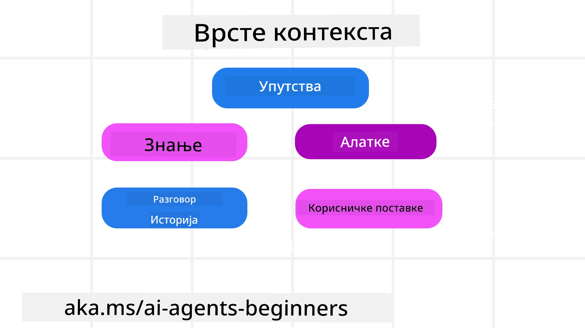
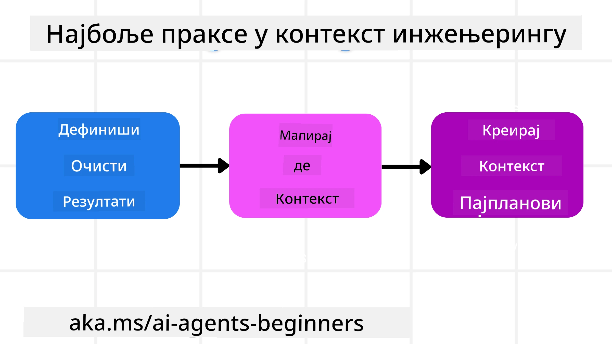

# Инжењеринг контекста за AI агенте

> _(Кликните на слику изнад да бисте погледали видео овог часа)_

Разумевање сложености апликације за коју градите AI агента је важно за прављење поузданог. Потребно је изградити AI агенте који ефикасно управљају информацијама како би одговорили на комплексне потребе изван инжењеринга упита.

У овом часу ћемо погледати шта је инжењеринг контекста и његову улогу у изградњи AI агената.

## Увод

Овај час ће обухватити:

• **Шта је инжењеринг контекста** и зашто се разликује од инжењеринга упита.

• **Стратегије за ефикасан инжењеринг контекста**, укључујући како писати, бирати, компримовати и изоловати информације.

• **Чести пропусти у контексту** који могу измаћи контроли вашег AI агента и како их поправити.

## Циљеви учења

Након завршетка овог часа, знаћете и разумети како:

• **Дефинисати инжењеринг контекста** и разликовати га од инжењеринга упита.

• **Идентификовати кључне компоненте контекста** у апликацијама са великим језичким моделима (LLM).

• **Применити стратегије за писање, бирање, компримовање и изолацију контекста** ради побољшања перформанси агента.

• **Препознати честе пропусте у контексту** као што су тровање, одвлачење пажње, конфузија и сукоб, и применити технике ублажавања.

## Шта је инжењеринг контекста?

За AI агенте, контекст је оно што покреће планирање AI агента да предузме одређене радње. Инжењеринг контекста је пракса осигуравања да AI агент има праве информације да заврши следећи корак задатка. Величина контекстног прозора је ограничена, па као градитељи агената морамо направити системе и процесе за управљање додавањем, уклањањем и кондензацијом информација у контекстном прозору.

### Инжењеринг упита против инжењеринга контекста

Инжењеринг упита фокусира се на један скуп статичних инструкција за ефикасно вођење AI агената скупом правила. Инжењеринг контекста је управљање динамичким скупом информација, укључујући почетни упит, како би се осигурало да AI агент има шта му треба током времена. Главна идеја инжењеринга контекста је да овај процес буде понављив и поуздан.

### Врсте контекста

Важно је запамтити да контекст није само једна ствар. Информације које AI агенту требају могу доћи из различитих извора, а на нама је да осигурамо да агент има приступ тим изворима:

Врсте контекста које AI агент може требати да управља укључују:

• **Инструкције:** Ово су као "правила" агента – упити, системске поруке, примери са неколико случајева (показајући AI-ју како да нешто уради) и описи алата које може користити. Овде се фокус инжењеринга упита спаја са инжењерингом контекста.

• **Знање:** Обухвата чињенице, информације преузете из база података или дугорочна сећања која је агент акумулирао. Ово укључује интеграцију Retrieval Augmented Generation (RAG) система ако агенту треба приступ различитим складиштима знања и базама података.

• **Алатке:** Ово су дефиниције екстерних функција, API-ја и MCP сервера које агент може позивати, заједно са повратним информацијама (резултатима) које добије користећи их.

• **Историја разговора:** Текућа комуникација са корисником. Како време пролази, ти разговори постају дужи и сложенији, што заузима простор у контекстном прозору.

• **Корисничке преференције:** Информације научене о корисниковим свиђањима или невољама током времена. Оне могу бити сачуване и позиване приликом доношења кључних одлука да помогну кориснику.

## Стратегије за ефикасан инжењеринг контекста

### Стратегије планирања

Добар инжењеринг контекста почиње добрим планирањем. Ево приступа који ће вам помоћи да почнете размишљати како применити концепт инжењеринга контекста:

1. **Дефинишите јасне резултате** - резултати задатака којима ће AI агенти бити додељени треба да буду јасно дефинисани. Одговорите на питање - "Како ће свет изгледати када AI агент заврши свој задатак?" Другим речима, каква промена, информација или одговор корисник треба да има након интеракције са AI агентом.
2. **Картографисање контекста** - Када сте дефинисали резултате AI агента, морате одговорити на питање "Које информације AI агент треба да заврши овај задатак?". Овим можете започети мапирање контекста о томе где се те информације могу налазити.
3. **Креирајте контекстуалне траке** - Сада када знате где су информације, морате одговорити на питање "Како ће агент добити те информације?". Ово се може урадити на различите начине укључујући RAG, коришћење MCP сервера и других алата.

### Практичне стратегије

Планирање је важно, али када информације почну да улазе у контекстни прозор нашег агента, потребни су нам практични начини за управљање:

#### Управљање контекстом

Иако ће неке информације бити аутоматски додате у контекстни прозор, инжењеринг контекста подразумева активнију улогу ове информације која се може обавити неколико стратегија:

 1. **Бележница агента (Agent Scratchpad)**  
 Ово омогућава AI агенту да бележи релевантне информације о тренутним задацима и интеракцијама са корисником током једне сесије. Ово треба да постоји ван контекстног прозора у фајлу или објекту током рада који агент може касније враћати у овој сесији ако је потребно.

 2. **Сећања**  
 Бележнице су добре за управљање информацијама изван контекстног прозора једне сесије. Сећања омогућавају агентима да чувају и враћају релевантне информације преко више сесија. Ово може укључивати резиме, корисничке преференције и повратне информације за будућа побољшања.

 3. **Компримовање контекста**  
 Када контекстни прозор расте и приближава се граници, могу се користити технике као што су резимирање и скраћивање. То укључује чување само најрелевантнијих информација или уклањање старијих порука.
  
 4. **Системи са више агената**  
 Развој система са више агената је облик инжењеринга контекста јер сваки агент има свој контекстни прозор. Како се тај контекст деле и преноси различитим агентима је још једна ствар коју треба планирати при градњи ових система.
  
 5. **Песковничка окружења (Sandbox Environments)**  
 Ако агент треба да изврши неки код или обради велики обим информација у документу, то може захтевати велики број токена за обраду резултата. Уместо да се све чува у контекстном прозору, агент може користити песковничко окружење које може извршити тај код и само прочитати резултате и друге релевантне информације.
  
 6. **Објекти стања током рада (Runtime State Objects)**  
 Ово се ради креирањем контејнера информација да би се управљало ситуацијама када агент треба да има приступ одређеним информацијама. За сложен задатак, ово би омогућило агенту да чува резултате сваког подзадатка корак по корак, дозвољавајући да контекст остане повезан само са тим конкретним подзадатком.

#### Инспекција контекста

Након примене једне од ових стратегија, вреди проверити шта је следећи позив модела заправо примио. Корисно питање за отклањање грешака је:

> Да ли је агент учитао превише контекста, погрешан контекст или му је недостајао контекст који му је требао?

Није потребно бележити сирове упите, излазе алата или садржај сећања да бисте одговорили на то питање. У продукцији преферирајте мале записе инспекције контекста који бележе бројеве, ид-ове, хашеве и ознаке политике:

- **Селекција:** Пратите колико је кандидата, алата или сећања разматрано, колико је изабрано, и који је правилник или бодовање узроковало филтрирање осталих.
- **Компресија:** Запишите опсег извора или ид траће, ид резимеа, процењени број токена пре и после компресије, и да ли је сирови садржај искључен из следећег позива.
- **Изолација:** Запишите који је подзадатак извршен у посебном агенту, сесији или песковничком окружењу, који је резиме везан враћен и да ли је велики излаз алата остао ван контекста главног агента.
- **Сећање и RAG:** Чувајте ид-ове докумената за претрагу, ид-ове сећања, бодове, изабране ид-ове и статус цензуре уместо потпуног текста који је преузет.
- **Безбедност и приватност:** Дајте предност хашевима, ид-овима, токен кофама и ознакама политике над осетљивим текстом упита, аргументима алата, резултатима алата или телима корисничког сећања.

Циљ није да се задржи више контекста. Циљ је оставити довољно доказа да програмер може препознати која стратегија контекста је извршена и да ли је на намеравани начин променила следећи позив модела.

### Пример инжењеринга контекста

Рецимо да желимо да AI агент **"Резервишем путовање за Париз."**

• Једноставан агент који користи само инжењеринг упита могао би само одговорити: **"У реду, када желите да идете у Париз?"**. Обрадио је само ваше директно питање у тренутку када сте га поставили.

• Агент који користи покривене стратегије инжењеринга контекста ради много више. Пре него што и одговори, његов систем може:

  ◦ **Проверити ваш календар** за расположиве датуме (преузимање података у реалном времену).

 ◦ **Сетити се претходних туристичких преференција** (из дугорочне меморије) као што су омиљена авио-компанија, буџет или да ли више волите директне летове.

 ◦ **Идентификовати расположиве алате** за резервацију лета и хотела.

- Тада би пример одговора могао бити: "Здраво [Ваше име]! Видим да сте слободни прве недеље октобра. Да ли да тражим директне летове за Париз са [омиљеном авио-компанијом] унутар вашег уобичајеног буџета од [буџет]?" Овај богатији одговор свестан контекста показује снагу инжењеринга контекста.

## Чести пропусти у контексту

### Тровање контекста

**Шта је:** Када халуцинација (неистинита информација генерисана од стране LLM) или грешка уђу у контекст и непрестано се позивају, узрокујући да агент следи немогуће циљеве или развија бесмислене стратегије.

**Шта урадити:** Успоставити **валидацију контекста** и **кврантинисање**. Верификовати информације пре него што се додају у дугорочно памћење. Ако се открије потенцијално тровање, покренути нове контекстуалне везе да се спречи ширење лоших информација.

**Пример из резервације путовања:** Ваш агент халуцинира постојање **директног лета са малог локалног аеродрома до далеког међународног града** који заправо не нуди међународне летове. Та неистинита информација се сачувава у контексту. Касније, када ви затражите да агент резервише, он наставља да тражи карте за ту немогућу руту, што доводи до понављајућих грешака.

**Решење:** Успоставити корак који **проверава постојање лета и руте помоћу API-ја у реалном времену** _пре_ додавања детаља лета у радни контекст агента. Ако провера не успе, погрешне информације се "кварантинишу" и даље се не користе.

### Одвлачење пажње у контексту

**Шта је:** Када контекст постане толико велик да модел превише фокусира пажњу на накупљену историју уместо да користи оно што је научио током тренинга, што доводи до понављајућих или неупотребљивих радњи. Модели могу почети да праве грешке чак и пре него што контекстни прозор буде потпуно попуњен.

**Шта урадити:** Користити **резимирање контекста**. Периодично компримовати накупљене информације у краће резимеје, задржавајући важне детаље док се уклања сувишна историја. Ово помаже да се "ресетује" фокус.

**Пример из резервације путовања:** Дуго сте разговарали о разним дестинацијама из снова, укључујући детаљан наратив о вашој вандрају две године раније. Када коначно затражите да **"пронађем јефтин лет за следећи месец,"** агент се заглави у старим, непотребним детаљима и наставља да пита о вашој опреми за вандрање или претходним итинерерима, занемарујући ваш тренутни захтев.

**Решење:** Након одређеног броја кругова или када контекст постане превелик, агент треба да **резимира најновије и релевантне делове разговора** – фокусирајући се на ваше тренутне датуме путовања и дестинацију – и користи тај кондензовани резиме за следећи LLM позив, одбацујући мање релевантни историјски разговор.

### Конфузија контекста

**Шта је:** Када непотребан контекст, често у виду превише расположивих алата, узрокује да модел генерише погрешне одговоре или позове ирелевантне алате. Мањи модели су посебно подложни овоме.

**Шта урадити:** Успоставити **управљање оптерећењем алата** користећи RAG технике. Чувати описе алата у векторској бази и бирати _само_ најрелевантније алате за сваки конкретан задатак. Истраживања показују да је боље ограничити избор алата на мање од 30.

**Пример из резервације путовања:** Ваш агент има приступ десетинама алата: `book_flight`, `book_hotel`, `rent_car`, `find_tours`, `currency_converter`, `weather_forecast`, `restaurant_reservations` итд. Питате, **"Који је најбољи начин за кретање по Паризу?"** Због великог броја алата, агент се збуни и покушава да позове `book_flight` _унутар_ Париза или `rent_car` иако ви више волите јавни превоз, јер описи алата могу да се преклапају или једноставно не може да разлучи најбољи.

**Решење:** Користити **RAG преко описа алата**. Када питате о кретању по Паризу, систем динамички преузима _само_ најрелевантније алате као што су `rent_car` или `public_transport_info` на основу вашег упита, пружајући фокусирани "сет алата" LLM-у.

### Сукоб контекста

**Шта је:** Када у контексту постоје супротстављене информације, што доводи до неусклађеног резоновања или лоших финалних одговора. Ово често се дешава када информације стижу у фазама, а ране, нетачне претпоставке остају у контексту.

**Шта урадити:** Користити **орезивање контекста** и **преношење ван контекста (offloading)**. Орезивање значи уклањање застарелих или супротних информација када стижу нови детаљи. Преношење омогућава моделу посебан "радни простор" за обраду информација без затрпавања главног контекста.
**Пример резервације путовања:** Првобитно кажете свом агенту, **"Желим да летим економском класом."** Касније у разговору промените мишљење и кажете, **"Заиста, за ово путовање идемо пословном класом."** Ако оба упутства остану у контексту, агент може добити конфротиране резултате претраге или се збуњивати око тога који преференцијални избор треба да има приоритет.

**Решење:** Имплементирајте **оређивање контекста**. Када ново упутство противречи старом, старије упутство се уклања или експлицитно налаже као неважеће у контексту. Алтернативно, агент може користити **радни простор (scratchpad)** да реши конфликтне преференције пре доношења одлуке, осигуравајући да само коначна, конзистентна упутства усмеравју његове радње.

## Имате ли још питања о контекст инжењерингу?

Придружите се [Microsoft Foundry Discord](https://discord.com/invite/ATgtXmAS5D) да упознате друге учеснике, посетите канцеларијско време и добијете одговоре на ваша питања о AI агентима.

---

<!-- CO-OP TRANSLATOR DISCLAIMER START -->
**Изјава о одрицању одговорности**:
Овај документ је преведен коришћењем услуге за аутоматски превод [Co-op Translator](https://github.com/Azure/co-op-translator). Иако тежимо тачности, имајте у виду да аутоматски преводи могу садржати грешке или нетачности. Оригинални документ на његовом изворном језику треба сматрати ауторитативним извором. За критичне информације препоручује се професионални људски превод. Нисмо одговорни за било каква неспоразума или погрешна тумачења која произилазе из коришћења овог превода.
<!-- CO-OP TRANSLATOR DISCLAIMER END -->