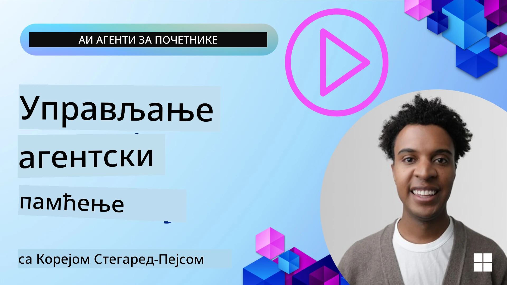

# Меморија за AI агенте 

Када се разматрају јединствене предности креирања AI агената, главно се истичу две ствари: могућност позива алата за завршетак задатака и способност побољшавања током времена. Меморија је у основи креирања агента који се сам побољшава и који може да створи боља искуства за наше кориснике.

У овој лекцији погледаћемо шта је меморија за AI агенте и како можемо да је управљамо и користимо у корист наших апликација.

## Увод

Ова лекција ће обухватити:

• **Разумевање меморије AI агената**: Шта је меморија и зашто је битна за агенте.

• **Спровођење и чување меморије**: Практичне методе за додавање могућности меморије вашим AI агентима, са фокусом на краткорочну и дугорочну меморију.

• **Учење AI агената да се сами побољшавају**: Како меморија омогућава агентима да уче из прошлих интеракција и временом напредују.

## Доступне имплементације

Ова лекција садржи два свеобухватна ноутбук туторијала:

• **[13-agent-memory.ipynb](./13-agent-memory.ipynb)**: Имплементира меморију користећи Mem0 и Azure AI Search у оквиру Microsoft Agent Framework-а

• **[13-agent-memory-cognee.ipynb](./13-agent-memory-cognee.ipynb)**: Имплементира структурисану меморију користећи Cognee, аутоматски гради граф знања подржан ембеддингима, визуализује граф и омогућава интелигентно извлачење

## Циљеви учења

Након завршетка ове лекције, знаћете како да:

• **Разликујете између различитих типова меморије AI агената**, укључујући радну, краткорочну и дугорочну меморију, као и специјализоване облике као што су меморија персоне и епизодна меморија.

• **Имплементирате и управљате краткорочном и дугорочном меморијом за AI агенте** користећи Microsoft Agent Framework, искоришћавајући алате као што су Mem0, Cognee, Whiteboard memory, и интеграцијом са Azure AI Search.

• **Разумете принципе иза самопобољшавајућих AI агената** и како робусни системи за управљање меморијом доприносе континуираном учењу и адаптацији.

## Разумевање меморије AI агената

У својој сржи, **меморија за AI агенте односи се на механизме који им омогућавају да задрже и присете се информација**. Ове информације могу бити специфични детаљи о разговору, преференцијама корисника, прошлостим радњама или чак наученим шаблонима.

Без меморије, AI апликације су често бездржавне (stateless), што значи да свака интеракција почиње из почетка. То доводи до понављајућег и фрустрирајућег корисничког искуства у ком агент „заборавља“ претходни контекст или преференције.

### Зашто је меморија важна?

Интелигенција агента је дубоко повезана са његовом способношћу да се присети и искористи претходне информације. Меморија омогућава агентима да буду:

• **Рефлективни**: Учење из прошлих акција и исхода.

• **Интерактивни**: Одржавање контекста током текућег разговора.

• **Проактивни и реактивни**: Предвиђање потреба или адекватно реаговање на основу историјских података.

• **Аутономни**: Самосталнији у раду ослањајући се на сачувано знање.

Циљ имплементације меморије је да агенти буду **поузданији и способнији**.

### Врсте меморије

#### Радна меморија

Замислите ово као лист папира на ком агент ради током једног, текућег задатка или процеса размишљања. Она држи тренутне информације потребне за израчунавање следећег корака.

За AI агенте, радна меморија често бележи најрелевантније информације из разговора, чак и ако је цела историја чет-а дуга или скраћена. Фокусира се на екстраховање кључних елемената као што су захтеви, предлози, одлуке и акције.

**Пример радне меморије**

У агента за резервисање путовања, радна меморија може да забележи тренутни захтев корисника, као што је „Желим да резервишем пут за Париз“. Тај специфични захтев се држи у непосредном контексту агента како би водио тренутну интеракцију.

#### Краткорочна меморија

Ова врста меморије задржава информације током трајања једног разговора или сесије. То је контекст тренутног чет-а, који омогућава агенту да се позива на претходне кругове дијалога.

**Пример краткорочне меморије**

Ако корисник пита „Колико би коштао лет за Париз?“ а потом настави са „А шта је са смештајем тамо?“, краткорочна меморија осигурава да агент зна да се „тамо“ односи на „Париз“ у оквиру истог разговора.

#### Дугорочна меморија

Ово су информације које опстају кроз више разговора или сесија. Омогућава агентима да памте преференције корисника, историјске интеракције или опште знање током дугих периода. Ово је важно за персонализацију.

**Пример дугорочне меморије**

Дугорочна меморија може да сачува да „Ben воли скијање и активности на отвореном, воли кафу са погледом на планину и жели да избегне напредне ски стазе због прошлe повреде“. Ова информација, научена из претходних интеракција, утиче на препоруке у будућим сесијама планирања путовања, чинећи их високо персонализованим.

#### Меморија персоне

Ова специјализована врста меморије помаже агенту да развије конзистентну „личност“ или „персону“. Омогућава агенту да памти детаље о себи или својој улози, чинећи интеракције течнијим и фокусиранијим.

**Пример меморије персоне**
Ако је агент за путовања дизајниран да буде „стручњак за ски планове“, меморија персоне може појачати ту улогу, утичући на његове одговоре да буду у складу са тоналитетом и знањем експерта.

#### Радна/епизодна меморија

Ова меморија чува низ корака које агент предузима током сложеног задатка, укључујући успехе и неуспехе. То је као памћење специфичних „епизода“ или прошлих искустава како би се из њих учило.

**Пример епизодне меморије**

Ако је агент покушао да резервише одређени лет али је то пропало због недоступности, епизодна меморија може забележити тај неуспех, омогућавајући агенту да покуша алтернативне летове или да у информисанијем виду обавести корисника о проблему у наредном покушају.

#### Меморија ентитета

Ово укључује екстракцију и памћење специфичних ентитета (као људи, места или ствари) и догађаја из разговора. Омогућава агенту да изгради структурирану представу кључних елемената о којима се говорило.

**Пример меморије ентитета**

Из разговора о прошлом путовању, агент може издвојити „Париз“, „Ајфелова кула“ и „вечера у ресторану Le Chat Noir“ као ентитете. У будућој интеракцији агент би могао да се сети „Le Chat Noir“ и понуди да направи нову резервацију тамо.

#### Структурисани RAG (Retrieval Augmented Generation)

Док је RAG шири приступ, „Структурисани RAG“ је истакнут као моћна технологија меморије. Он извлачи густе, структуруисане информације из различитих извора (разговори, имејлови, слике) и користи их за побољшање прецизности, покривености и брзине одговора. За разлику од класичног RAG-а који се ослања искључиво на семантичку сличност, Структурисани RAG ради са урођеном структуром информација.

**Пример структурисаног RAG-а**

Уместо само подударања кључних речи, Структурисани RAG може парсирати детаље лета (дестинација, датум, време, авио-компанија) из имејла и сачувати их на структурисан начин. Ово омогућава прецизне упите као што је „Који сам лет резервисао за Париз у уторак?“

## Имплементација и чување меморије

Имплементација меморије за AI агенте подразумева систематски процес **управљања меморијом**, који обухвата генерисање, чување, преузимање, интегрисање, ажурирање и чак „заборављање“ (или брисање) информација. Преузимање је посебно кључан аспект.

### Специјализовани алати за меморију

#### Mem0

Један од начина за чување и управљање меморијом агената је коришћење специјализованих алата као што је Mem0. Mem0 ради као перзистентни слој меморије, омогућавајући агентима да се присете релевантних интеракција, чувају корисничке преференције и фактички контекст, и уче из успеха и неуспеха током времена. Идеја је да бездржавни агенти постану државни.

Он функционише кроз **двофазни меморијски пипелaјн: екстракцију и ажурирање**. Прво, поруке додате у нит агента се шаљу сервису Mem0, који користи LLM да сумира историју разговора и извуче нове успомене. Након тога, фаза ажурирања коју покреће LLM одређује да ли треба додати, изменити или обрисати те успомене, чувајући их у хибридном складишту података које може да укључује векторске, граф и key-value базе. Овај систем такође подржава различите типове меморије и може да укључи графску меморију за управљање односима између ентитета.

#### Cognee

Други снажан приступ је коришћење **Cognee**, open-source семантичке меморије за AI агенте која трансформише структуиране и неструктуиране податке у упитне графове знања подржане ембеддингима. Cognee пружа **двоструку (dual-store) архитектуру** која комбинује претрагу по векторској сличности са графским везама, омогућавајући агентима да разумеју не само шта је информацијски слично, већ и како се појмови међусобно односе.

Изузетан је у области **хибридног преузимања** који спаја векторску сличност, графску структуру и LLM резоновање — од прегледа сирових сегмената до графски свесног одговарања на питања. Систем одржава **живу меморију** која се развија и расте, а истовремено остаје упитна као један повезани граф, подржавајући и краткорочни контекст сесије и дугорочну перзистентну меморију.

Ноутбук туторијал Cognee-а ([13-agent-memory-cognee.ipynb](./13-agent-memory-cognee.ipynb)) демонстрира изградњу овог уједињеног слоја меморије, са практичним примерима уноса различитих извора података, визуализације графа знања и упита са различитим стратегијама претраге прилагођеним специфичним потребама агената.

### Чување меморије помоћу RAG

Поред специјализованих алата за меморију као што је mem0, можете искористити робусне сервисе претраге као што је **Azure AI Search као бекенд за чување и преузимање успомена**, посебно за структурисани RAG.

Ово вам омогућава да утемељите одговоре вашег агента у вашим сопственим подацима, обезбеђујући релевантније и прецизније одговоре. Azure AI Search се може користити за чување кориснички специфичних меморија о путовањима, каталога производа или било ког другог доменском знању.

Azure AI Search подржава могућности као што је **Структурисани RAG**, који је изузетан у екстракцији и преузимању густих, структуираних информација из великих скупова података као што су историје разговора, имејлови или чак слике. Ово пружа „надчовечанску прецизност и покривеност“ у односу на традиционалне приступе резања текста и ембеддингова.

## Како учинити AI агенте да се сами побољшавају

Чест образац за самопобољшавајуће агенте укључује увођење једног посебног агента — **„агента знања“**. Овај одвојени агент посматра главни разговор између корисника и примарног агента. Његова улога је да:

1. **Идентификује вредне информације**: Одреди да ли је неки део разговора вредан чувања као опште знање или специфична корисничка преференција.

2. **Екстрахује и сумира**: Стилизује суштинско сазнање или преференцију из разговора.

3. **Сачува у базу знања**: Перзистира ове екстраховане информације, често у векторској бази података, тако да се могу касније преузети.

4. **Обогаћује будуће упите**: Када корисник покрене нови упит, агент знања преузима релевантне сачуване информације и додаје их у упит корисника, пружајући кључни контекст примарном агенту (слично RAG-у).

### Оптимизације за меморију

• **Управљање латенцијом**: Да би се избегло успоравање корисничких интеракција, у почетку се може користити јефтинији, бржи модел који брзо проверава да ли је информација вредна за чување или преузимање, позивајући сложенији процес екстракције/преузимања само када је то потребно.

• **Одржавање базе знања**: За растућу базу знања, ређе коришћене информације могу бити премештене у „хладно складиште“ ради управљања трошковима.

## Имате још питања о меморији агената?

Придружите се [Microsoft Foundry Discord](https://aka.ms/ai-agents/discord) да упознате друге ученике, присуствујете консултацијама и добијете одговоре на ваша питања о AI агентима.

---

<!-- CO-OP TRANSLATOR DISCLAIMER START -->
Изјава о одрицању одговорности:
Овај документ је преведен уз помоћ сервиса за аутоматско превођење заснованог на вештачкој интелигенцији (AI) [Co-op Translator](https://github.com/Azure/co-op-translator). Иако се трудимо да преводи буду тачни, имајте у виду да аутоматски преводи могу садржати грешке или нетачности. Оригинални документ на његовом изворном (матичном) језику треба сматрати коначним и веродостојним извором. За критичне информације препоручује се професионални превод који ће извршити људски преводилац. Не сносимо одговорност за било какве неспоразуме или погрешна тумачења која проистекну из коришћења овог превода.
<!-- CO-OP TRANSLATOR DISCLAIMER END -->