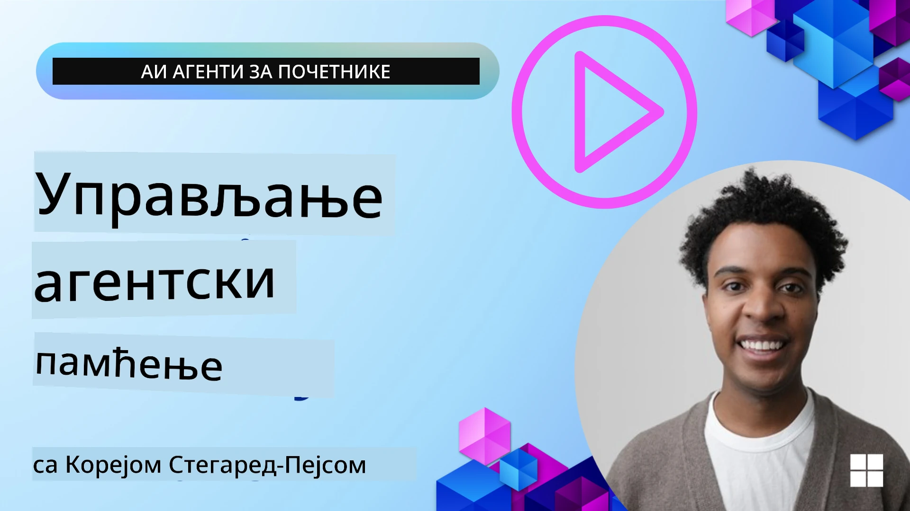

# Меморија за АИ агенте 

Када се говори о јединственим предностима креирања АИ агената, главно се расправља о две ствари: могућност позива алата за обављање задатака и способност напредовања током времена. Меморија је у основи стварања самопобољшавајућег агента који може креирати боља искуства за наше кориснике.

У овој лекцији ћемо погледати шта је меморија за АИ агенте и како је можемо управљати и користити у корист наших апликација.

## Увод

Ова лекција ће обухватити:

• **Разумевање меморије АИ агената**: Шта је меморија и зашто је битна за агенте.

• **Имплементација и чување меморије**: Практичне методе за додавање меморијских способности вашим АИ агентима, са фокусом на краткорочну и дугорочну меморију.

• **Прављење самопобољшавајућих АИ агената**: Како меморија омогућава агентима да уче из претходних интеракција и напредују током времена.

## Доступне имплементације

Ова лекција садржи два обимна водича у облику тетратке:

• **[13-agent-memory.ipynb](./13-agent-memory.ipynb)**: Имплементира меморију користећи Mem0 и Azure AI Search са Microsoft Agent Framework-ом

• **[13-agent-memory-cognee.ipynb](./13-agent-memory-cognee.ipynb)**: Имплементира структурирани меморију користећи Cognee, аутоматски градећи граф знања заснован на уграђивањима, визуелизујући граф и интелигентну претрагу

## Циљеви учења

Након завршетка ове лекције, знаћете како да:

• **Разликујете између различитих типова меморије АИ агената**, укључујући радну, краткорочну и дугорочну меморију, као и специјализоване форме попут персоне и епизодне меморије.

• **Имплементирате и управљате краткорочном и дугорочном меморијом за АИ агенте** користећи Microsoft Agent Framework, користећи алате као што су Mem0, Cognee, Whiteboard memory и интеграцију са Azure AI Search.

• **Разумете принципе иза самопобољшавајућих АИ агената** и како робусни системи за управљање меморијом доприносе континуираном учењу и адаптацији.

## Разумевање меморије АИ агената

У својој основи, **меморија за АИ агенте односи се на механизме који им омогућавају да задрже и присете се информација**. Ове информације могу бити специфични детаљи о разговору, преференције корисника, претходне радње или чак научени обрасци.

Без меморије, АИ апликације су често бездржавне, што значи да свака интеракција почиње изнова. Ово води ка понављајућем и фрустрирајућем корисничком искуству у којем агент "заборавља" претходни контекст или преференције.

### Зашто је меморија важна?

интелигенција агента је дубоко повезана са његовом способношћу да се присети и користи претходне информације. Меморија омогућава агентима да буду:

• **Рефлективни**: Учење из претходних радњи и резултата.

• **Интерактивни**: Одржавање контекста током текућег разговора.

• **Проактивни и реактивни**: Предвиђање потреба или адекватно реаговање на основу историјских података.

• **Аутономни**: Деловање слободније ослањајући се на сачувано знање.

Циљ имплементације меморије је да агенти буду **пoузданији и способнији**.

### Типови меморије

#### Радна меморија

Замислите ово као комад бележнице који агент користи током једног, текућег задатка или размислјања. Садржи непосредне информације потребне за израчунавање следећег корака.

За АИ агенте, радна меморија често хвата најрелевантније информације из разговора, чак и ако је цела историја ћаскања дуга или скраћена. Фокусира се на издвајање кључних елемената као што су захтеви, предлози, одлуке и акције.

**Пример радне меморије**

У агента за резервацију путовања, радна меморија може да ухвати тренутни кориснички захтев, као што је "Желим да резервишем путовање за Париз". Овај конкретан захтев је задржан у непосредном контексту агента да усмери тренутну интеракцију.

#### Краткорочна меморија

Овај тип меморије задржава информације током трајања једног разговора или сесије. То је контекст текућег ћаскања, који омогућава агенту да се позове на претходне реакције у дијалогу.

У примерима Python SDK-а [Microsoft Agent Framework](https://github.com/microsoft/agent-framework), ова меморија одговара објекту `AgentSession`, креираном са `agent.create_session()`. Сесија је уграђена краткорочна меморија оквира: она држи контекст разговора доступним све док се та сесија користи, али тај контекст се не чува када сесија заврши или апликација буде поново покренута. За чињенице и преференције које треба да опстану кроз више сесија користите дугорочну меморију, обично преко базе података, индекса вектора или неког другог упорног складишта.

**Пример краткорочне меморије**

Ако корисник пита "Колико кошта лет за Париз?" а затим настави са "А шта је са смештајем тамо?", краткорочна меморија обезбеђује да агент зна да "тамо" означава "Париз" у оквиру истог разговора.

#### Дугорочна меморија

Ово су информације које опстају кроз више разговора или сесија. Омогућава агентима да памте корисничке преференције, историјске интеракције или општа знања током дужих периода. Ово је важно за персонализацију.

**Пример дугорочне меморије**

Дугорочна меморија може чувати да "Бен воли скијање и активности на отвореном, воли кафу са погледом на планине и жели да избегава напредне ски стазе због претходне повреде". Ова информација, научена из претходних интеракција, утиче на препоруке у будућим сесијама планирања путовања, чинећи их врло персонализованим.

#### Персона меморија

Ова специјализована врста меморије помаже агенту да развије доследан "лични стил" или "персону". Омогућава агенту да памти детаље о себи или својој намењеној улози, чинећи интеракције флуиднијим и фокусиранијим.

**Пример персоне меморије**

Ако је агента за путовања дизајниран као "стручњак за ски планерење", персона меморија може ојачати ту улогу, утичући на његове одговоре да буду у складу са тоном и знањем стручњака.

#### Радни ток / Епизодна меморија

Ова меморија чува низ корака које агент предузима током сложеног задатка, укључујући успехе и неуспехе. То је као памћење одређених "епизода" или претходних искустава како би се из њих учило.

**Пример епизодне меморије**

Ако је агент покушао да резервише одређени лет али није успео због недоступности, епизодна меморија може да евидентира тај неуспех, омогућавајући агенту да покуша алтернативне летове или да обавести корисника о проблему на информисанији начин у наредном покушају.

#### Меморија ентитета

Ово укључује издвајање и памћење специфичних ентитета (као што су људи, места или ствари) и догађаја из разговора. Омогућава агенту да изгради структурирано разумевање кључних елемената који су предмет дискусије.

**Пример меморије ентитета**

Из разговора о претходном путовању, агент може издвојити "Париз", "Ајфелов торањ" и "вечера у ресторану Le Chat Noir" као ентитете. У будућој интеракцији, агент би могао да се присети "Le Chat Noir" и понуди нову резервацију тамо.

#### Структурирани RAG (допринеће претраживању у генерисању)

Иако је RAG широка техника, "Структурирани RAG" се истиче као моћна меморијска технологија. Она извлачи густе, структуриране информације из различитих извора (разговора, мејлова, слика) и користи их за побољшање прецизности, присећања и брзине одговора. За разлику од класичног RAG-а који се ослања само на семантичку сличност, Структурирани RAG ради са урођеном структуром информација.

**Пример структуриране RAG**

Уместо да само упоређује кључне речи, Структурирани RAG може извући детаље лета (одредиште, датум, време, авио-компанију) из мејла и сачувати их на структуриран начин. То омогућава прецизне упите као што је "Који лет сам резервисао за Париз у уторак?"

## Имплементирање и чување меморије

Имплементирање меморије за АИ агенте обухвата систематски процес **управљања меморијом**, који укључује генерисање, чување, враћање, интегрисање, ажурирање и чак "заборављање" (или брисање) информација. Враћање (retrieval) је посебно кључни аспект.

### Специјализовани алати за меморију

#### Mem0

Један од начина за чување и управљање меморијом агената је коришћење специјализованих алата као што је Mem0. Mem0 функционише као упорни слој меморије, омогућавајући агентима да се присете релевантних интеракција, чувају корисничке преференције и чињенични контекст, и уче из успеха и неуспеха током времена. Идеја је да бездржавни агенти постану државни.

Ради кроз **двофазну меморијску цевовод: екстракцију и ажурирање**. Прво, поруке додате у нит агента шаљу се на сервис Mem0, који користи велики језички модел (LLM) да сажме историју разговора и извади нове успомене. Након тога, фаза ажурирања коју покреће LLM одређује да ли ће се те успомене додати, модификовати или избрисати, чувајући их у хибридној бази података која може укључивати векторску, графску и кључ-врредност базу. Овај систем такође подржава различите типове меморије и може да укључи граф меморију за управљање односима између ентитета.

#### Cognee

Још један моћан приступ је коришћење **Cognee**, отвореног кода семантичке меморије за АИ агенте која претвара структуриране и неструктуриране податке у зналачке графове подржане уграђивањима. Cognee пружа **двоструку архитектуру складишта** која комбинује претрагу по векторској сличности са графским односима, омогућавајући агентима да разумеју не само шта је слично, већ и како концепти међусобно функционишу.

Одличан је у **хибридном враћању података** које спаја векторску сличност, графску структуру и LLM резоновање - од проналаска сирових делова до одговарања на питања са свешћу о графу. Систем одржава **живу меморију** која се развија и расте док остаје доступна као један повезани граф, подржавајући и краткорочни контекст сесије и дуготрајну упорну меморију.

Тетратка водича Cognee ([13-agent-memory-cognee.ipynb](./13-agent-memory-cognee.ipynb)) демонстрира изградњу овог јединственог меморијског слоја, са практичним примерима уноса различитих извора података, визуелизације графа знања и упита са различитим стратегијама претраге прилагођеним потребама одређених агената.

### Чување меморије са RAG

Поред специјализованих алата за меморију као што је Mem0, можете користити робусне претраживачке сервисе као што је **Azure AI Search као позадину за чување и враћање меморија**, нарочито за структурирани RAG.

Ово омогућава да поткрепите одговоре својих агената са сопственим подацима, обезбеђујући релевантније и прецизније одговоре. Azure AI Search се може користити за чување корисничких сећања везаних за путовања, каталоге производа или било које друге домен-специфичне информације.

Azure AI Search подржава могућности као што је **Структурирани RAG**, који одлично извлачи и враћа густе, структуриране информације из великих скупова података као што су историје разговора, мејлови или чак слике. Ово пружа "суперљудску прецизност и присећање" у поређењу са традиционалним приступима разлагања и уграђивања текста.

## Прављење самопобољшавајућих АИ агената

Чест образац за самопобољшавајуће агенте укључује увођење **"агента знања"**. Овај посебан агент посматра главни разговор између корисника и примарног агента. Његова улога је да:

1. **Идентификује вредне информације**: Одређује да ли неки део разговора вреди сачувати као опште знање или специфичну корисничку преференцију.

2. **Издваја и сажима**: Сажима суштинско учење или преференцију из разговора.

3. **Чува у бази знања**: Стави ове извађене информације у базу знања, често у векторску базу, тако да се касније могу вратити.

4. **Побољшава будуће упите**: Када корисник покрене нови упит, агент знања враћа релевантне сачуване информације и додаје их у кориснички упит, пружајући кључни контекст примарном агенту (слично RAG).

### Оптимизације за меморију

• **Управљање латенцијом**: Да не би успоравали интеракције корисника, може се користити јефтинији, бржи модел за брзу проверу да ли је информација вредна чувања или враћања, и тада покренути комплекснији процес екстракције/враћања само када је неопходно.

• **Одржавање базе знања**: За растућу базу знања мање коришћене информације се могу преместити у "хладно складиште" ради управљања трошковима.

## Имате више питања о меморији агената?

Придружите се [Microsoft Foundry Discord](https://discord.com/invite/ATgtXmAS5D) да се упознате са другим ученицима, присуствујете радним часовима и добијете одговоре на ваша питања о АИ агентима.

---

<!-- CO-OP TRANSLATOR DISCLAIMER START -->
**Изјава о одрицању одговорности**:
Овај документ је преведен коришћењем услуге за аутоматски превод [Co-op Translator](https://github.com/Azure/co-op-translator). Иако тежимо тачности, имајте у виду да аутоматски преводи могу садржати грешке или нетачности. Оригинални документ на његовом изворном језику треба сматрати ауторитативним извором. За критичне информације препоручује се професионални људски превод. Нисмо одговорни за било каква неспоразума или погрешна тумачења која произилазе из коришћења овог превода.
<!-- CO-OP TRANSLATOR DISCLAIMER END -->