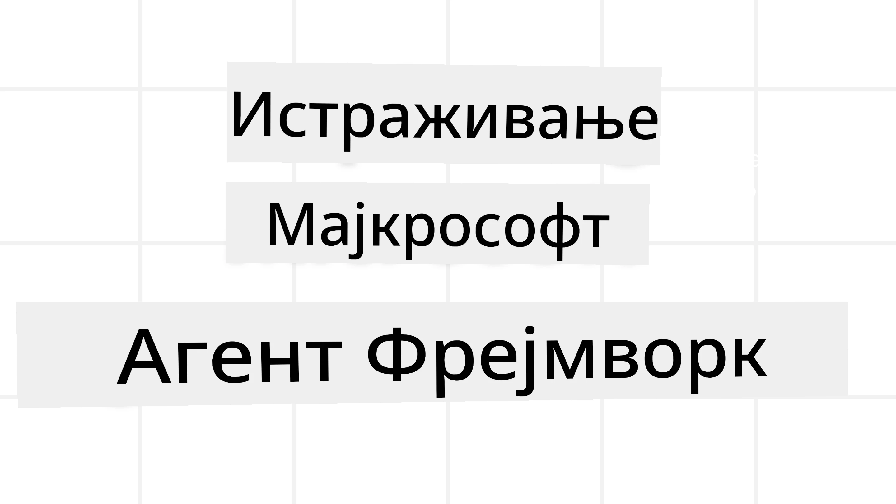
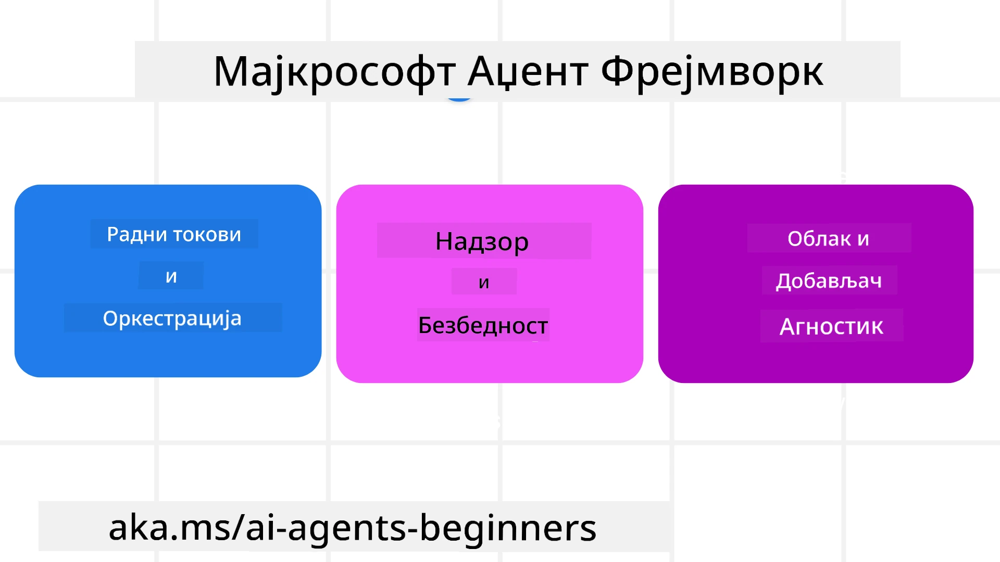

# Истраживање Microsoft Agent Framework-а



### Увод

Овај час ће покрити:

- Разумевање Microsoft Agent Framework-а: Кључне карактеристике и вредности  
- Истраживање кључних концепата Microsoft Agent Framework-а
- Напредни MAF обрасци: Радни токови, посредни софтвер и меморија

## Циљеви учења

Након завршетка овог часа, знаћете како да:

- Креирате производно спремне AI агенте користећи Microsoft Agent Framework
- Примените основне карактеристике Microsoft Agent Framework-а на своје агентске случајеве коришћења
- Користите напредне обрасце укључујући радне токове, посредни софтвер и посматрање

## Примери кода

Примере кода за [Microsoft Agent Framework (MAF)](https://aka.ms/ai-agents-beginners/agent-framewrok) можете пронаћи у овом репозиторијуму под фајловима `xx-python-agent-framework` и `xx-dotnet-agent-framework`.

## Разумевање Microsoft Agent Framework-а



[Microsoft Agent Framework (MAF)](https://aka.ms/ai-agents-beginners/agent-framewrok) је Microsoft-ов уједињени оквир за изградњу AI агената. Пружа флексибилност да се реше разне агентске примене виђене како у производњи, тако и у истраживачким окружењима, укључујући:

- **Секвенцијална оркестрација агената** у сценаријима где су потребни корак по корак радни токови.
- **Паралелна оркестрација** у сценаријима где агенти требају истовремено да извршавају задатке.
- **Оркестрација групног четовања** у сценаријима где агенти могу сарађивати на једном задатку.
- **Оркестрација предаје** у сценаријима где агенти предају задатак један другом како се подзадатци завршавају.
- **Магнетна оркестрација** у сценаријима где агент-менаџер креира и мења листу задатака и координише подагенте да заврше задатак.

За испоруку AI агената у производњи, MAF такође укључује функције за:

- **Посматрање (Observability)** кроз коришћење OpenTelemetry-а где свака акција AI агента укључујући позив алата, кораке оркестрације, токове расуђивања и праћење перформанси кроз Microsoft Foundry контролне табле.
- **Безбедност** хостовањем агената нативно на Microsoft Foundry-у који укључује контролу приступа засновану на ролама, руковање приватним подацима и уграђену сигурност садржаја.
- **Трајност** јер могућности агената и радни токови могу да паузирају, наставе и опораве се од грешака што омогућава дуже покретање процеса.
- **Контрола** јер су подржани радни токови са људским надзором где су задаци означени као захтевајући људско одобрење.

Microsoft Agent Framework је такође фокусиран на интероперабилност кроз:

- **Бити независан од облака** - Агенти могу да раде у контејнерима, на локалним серверима и у више различитих облака.
- **Бити независан од провајдера** - Агенти могу бити креирани преко вашег омиљеног SDK-а укључујући Azure OpenAI и OpenAI.
- **Интеграцију отворених стандарда** - Агенти могу користити протоколе као што су Agent-to-Agent (A2A) и Model Context Protocol (MCP) да открију и користе друге агенте и алате.
- **Плугинe и конекторе** - Везе могу бити направљене ка сервисима за податке и меморију као што су Microsoft Fabric, SharePoint, Pinecone и Qdrant.

Погледајмо како се ове функције примењују на неке од основних концепата Microsoft Agent Framework-а.

## Кључни концепти Microsoft Agent Framework-а

### Агенти


**Креирање агената**

Креирање агената се врши дефинисањем сервиса за инференцију (LLM провајдер), сета инструкција које AI агент мора да следи, и додељеног `name`:

```python
agent = AzureOpenAIChatClient(credential=AzureCliCredential()).create_agent( instructions="You are good at recommending trips to customers based on their preferences.", name="TripRecommender" )
```
  
Горњи пример користи `Azure OpenAI` али агенти могу бити креирани коришћењем разних сервиса укључујући `Microsoft Foundry Agent Service`:

```python
AzureAIAgentClient(async_credential=credential).create_agent( name="HelperAgent", instructions="You are a helpful assistant." ) as agent
```
  
OpenAI `Responses`, `ChatCompletion` API-ји

```python
agent = OpenAIResponsesClient().create_agent( name="WeatherBot", instructions="You are a helpful weather assistant.", )
```
  
```python
agent = OpenAIChatClient().create_agent( name="HelpfulAssistant", instructions="You are a helpful assistant.", )
```
  
или ремуне агенте користећи A2A протокол:

```python
agent = A2AAgent( name=agent_card.name, description=agent_card.description, agent_card=agent_card, url="https://your-a2a-agent-host" )
```
  
**Покретање агената**

Агенти се покрећу коришћењем `.run` или `.run_stream` метода за одговарајуће непотска или стриминг одговоре.

```python
result = await agent.run("What are good places to visit in Amsterdam?")
print(result.text)
```
  
```python
async for update in agent.run_stream("What are the good places to visit in Amsterdam?"):
    if update.text:
        print(update.text, end="", flush=True)

```
  
Сваки агентски покрет такође може имати опције за прилагођавање параметара као што су `max_tokens` које агент користи, `tools` које агент може да позове, и чак и `model` који се користи за агента.

Ово је корисно у случајевима када су специфични модели или алати потребни за завршетак корисничког задатка.

**Алати**

Алати могу бити дефинисани и приликом дефинисања агента:

```python
def get_attractions( location: Annotated[str, Field(description="The location to get the top tourist attractions for")], ) -> str: """Get the top tourist attractions for a given location.""" return f"The top attractions for {location} are." 


# Када директно креирате ChatAgent

agent = ChatAgent( chat_client=OpenAIChatClient(), instructions="You are a helpful assistant", tools=[get_attractions]

```
  
и такође при покретању агента:

```python

result1 = await agent.run( "What's the best place to visit in Seattle?", tools=[get_attractions] # Алат обезбеђен само за ово покретање )
```
  
**Агентски нитови**

Агентски нитови се користе за руковање конверзацијама у више корака. Нитови могу бити креирани на два начина:

- Коришћењем `get_new_thread()` који омогућава да се нит сачува током времена
- Аутоматским креирањем нити приликом покретања агента и трајањем нити само током тренутног покретања.

За креирање нити код изгледа овако:

```python
# Креирајте нови нит.
thread = agent.get_new_thread() # Покрените агента са тим нитом.
response = await agent.run("Hello, I am here to help you book travel. Where would you like to go?", thread=thread)

```
  
Након тога нит можете серијализовати за каснију употребу:

```python
# Направите нови нити.
thread = agent.get_new_thread() 

# Покрените агента са нити.

response = await agent.run("Hello, how are you?", thread=thread) 

# Сериализујте нит за чување.

serialized_thread = await thread.serialize() 

# Десериализујте стање нити након учитавања из меморије.

resumed_thread = await agent.deserialize_thread(serialized_thread)
```
  
**Агентски посредни софтвер (Middleware)**

Агенти интерагују са алатима и LLM-овима да би завршили корисничке задатке. У одређеним сценаријима, желимо да извршимо или пратимо рад између тих интеракција. Агентски посредни софтвер нам омогућава да то урадимо на следећи начин:

*Функцијски посредни софтвер*  

Овај посредни софтвер нам омогућава да извршимо акцију између агента и функције/алата који ће агент позивати. Пример када се ово користи је када желите да забележите позив функције.

У коду испод `next` дефинише да ли треба позвати следећи посредни софтвер или стварну функцију.

```python
async def logging_function_middleware(
    context: FunctionInvocationContext,
    next: Callable[[FunctionInvocationContext], Awaitable[None]],
) -> None:
    """Function middleware that logs function execution."""
    # Предобрада: Логовање пре извршења функције
    print(f"[Function] Calling {context.function.name}")

    # Настави на следећи међуслој или извршење функције
    await next(context)

    # Посудобрада: Логовање након извршења функције
    print(f"[Function] {context.function.name} completed")
```
  
*Чет посредни софтвер*  

Овај посредни софтвер нам омогућава да извршимо или забележимо акцију између агента и захтева између LLM-а.

Ово садржи важне информације као што су `messages` који се шаљу AI сервису.

```python
async def logging_chat_middleware(
    context: ChatContext,
    next: Callable[[ChatContext], Awaitable[None]],
) -> None:
    """Chat middleware that logs AI interactions."""
    # Предобрада: Логовање пре позива вештачке интелигенције
    print(f"[Chat] Sending {len(context.messages)} messages to AI")

    # Настави на следећи посреднички софтвер или АИ услугу
    await next(context)

    # Потоњо обрађивање: Логовање након одговора вештачке интелигенције
    print("[Chat] AI response received")

```
  
**Агентска меморија**

Као што је обрађено у часу `Agentic Memory`, меморија је важан елемент који омогућава агенту да ради у различитим контекстима. MAF нуди неколико различитих типова меморија:

*У-Сећање Меморија*  

Ово је меморија која се чува у нитима током времена рада апликације.

```python
# Креирај нови нити.
thread = agent.get_new_thread() # Покрени агента са нити.
response = await agent.run("Hello, I am here to help you book travel. Where would you like to go?", thread=thread)
```
  
*Перзистентне поруке*  

Ова меморија се користи за чување историје разговора у различитим сесијама. Дефинише се коришћењем `chat_message_store_factory`:

```python
from agent_framework import ChatMessageStore

# Креирај прилагођену продавницу порука
def create_message_store():
    return ChatMessageStore()

agent = ChatAgent(
    chat_client=OpenAIChatClient(),
    instructions="You are a Travel assistant.",
    chat_message_store_factory=create_message_store
)

```
  
*Динамичка меморија*  

Ова меморија се додаје у контекст пре него што се агенти покрену. Ове меморије могу бити сачуване у спољним сервисима као што је mem0:

```python
from agent_framework.mem0 import Mem0Provider

# Користећи Mem0 за напредне могућности меморије
memory_provider = Mem0Provider(
    api_key="your-mem0-api-key",
    user_id="user_123",
    application_id="my_app"
)

agent = ChatAgent(
    chat_client=OpenAIChatClient(),
    instructions="You are a helpful assistant with memory.",
    context_providers=memory_provider
)

```
  
**Агентска посматрања (Observability)**

Посматрање је важно за изградњу поузданих и одрживих агентских система. MAF се интегрише са OpenTelemetry-ом да обезбеди праћење и мере за боље посматрање.

```python
from agent_framework.observability import get_tracer, get_meter

tracer = get_tracer()
meter = get_meter()
with tracer.start_as_current_span("my_custom_span"):
    # уради нешто
    pass
counter = meter.create_counter("my_custom_counter")
counter.add(1, {"key": "value"})
```
  
### Радни токови

MAF нуди радне токове који су унапред дефинисани кораци за завршетак задатка и укључују AI агенте као компоненте тих корака.

Радни токови се састоје из различитих компоненти које омогућавају бољу контролу тока. Радни токови такође омогућавају **мулти-агентску оркестрацију** и **чување стања (checkpointing)** да би се сачувао статус радног тока.

Основне компоненте радног тока су:

**Извршиоци**

Извршиоци примају улазне поруке, извршавају додељене задатке, а затим производе излазну поруку. Ово помера радни ток напред ка завршетку већег задатка. Извршиоци могу бити AI агенти или прилагођена логика.

**Везе (Edges)**

Везе се користе за дефинисање тока порука у радном току. Оне могу бити:

*Директне везе* - Једноставне везе један-на-један између извршилаца:

```python
from agent_framework import WorkflowBuilder

builder = WorkflowBuilder()
builder.add_edge(source_executor, target_executor)
builder.set_start_executor(source_executor)
workflow = builder.build()
```
  
*Условне везе* - Активирају се када је испуњен одређени услов. На пример, када су хотелске собе недоступне, извршилац може предложити друге опције.

*Везе типа Switch-case* - Усмеравње порука ка различитим извршиоцима на основу дефинисаних услова. На пример, ако путнички корисник има приоритетан приступ и њихови задаци ће бити обрађени преко другог радног тока.

*Везе типа Fan-out* - Шаљу једну поруку ка више одредишта.

*Везе типа Fan-in* - Прикупљају више порука од различитих извршилаца и шаљу их ка једном одредишту.

**Догађаји**

Да би обезбедили боље посматрање радних токова, MAF нуди уграђене догађаје за извршење укључујући:

- `WorkflowStartedEvent`  - Започиње се извршење радног тока
- `WorkflowOutputEvent` - Радни ток производи излаз
- `WorkflowErrorEvent` - Радни ток наилази на грешку
- `ExecutorInvokeEvent`  - Извршилац почиње обраду
- `ExecutorCompleteEvent`  -  Извршилац завршава обраду
- `RequestInfoEvent` - Издат је захтев

## Напредни MAF Обрасци

Горње секције покривају кључне концепте Microsoft Agent Framework-а. Како градите сложеније агенте, ево неких напредних образаца које треба размотрити:

- **Композиција посредног софтвера**: Ланчано повезивање више посредника (логовање, аутентификација, ограничење брзине) користећи функцијски и чет посредни софтвер за прецизну контролу понашања агента.
- **Чување стања радног тока (Checkpointing)**: Користите догађаје радног тока и серијализацију да сачувате и наставите дугорочне процеса агената.
- **Динамички избор алата**: Комбинујте RAG преко описа алата са регистровањем алата у MAF-у да приказујете само релевантне алате по упиту.
- **Мулти-агенска предаја (handoff)**: Користите везе радног тока и условно усмеравње да оркестрирате предају између специјализованих агената.

## Примери кода

Примере кода за Microsoft Agent Framework можете пронаћи у овом репозиторијуму под фајловима `xx-python-agent-framework` и `xx-dotnet-agent-framework`.

## Имаш још питања о Microsoft Agent Framework-у?

Придружи се [Microsoft Foundry Discord](https://aka.ms/ai-agents/discord) да упознаш друге ученике, посетиш радне сате и добијеш одговоре на питања о AI агентима.

---

<!-- CO-OP TRANSLATOR DISCLAIMER START -->
**Ограничење одговорности**:
Овај документ је преведен коришћењем AI преводилачке услуге [Co-op Translator](https://github.com/Azure/co-op-translator). Иако тежимо тачности, молимо вас да имате у виду да аутоматски преводи могу садржати грешке или нетачности. Оригинални документ на његовом изворном језику сматра се ауторитетним извором. За критичне информације препоручује се професионални људски превод. Нисмо одговорни за било каква неспоразума или погрешна тумачења настала коришћењем овог превода.
<!-- CO-OP TRANSLATOR DISCLAIMER END -->