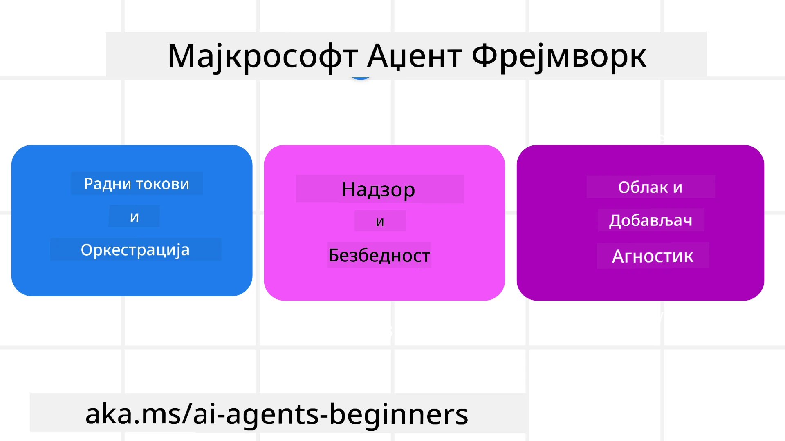
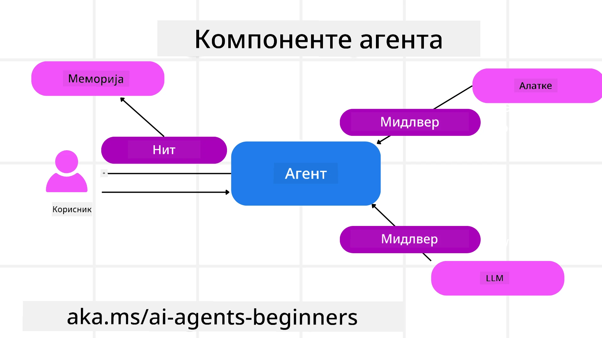

# Истраживање Microsoft Agent Framework-а


### Увод

Овај час ће обухватити:

- Разумевање Microsoft Agent Framework-а: Кључне карактеристике и вредност  
- Истраживање кључних концепата Microsoft Agent Framework-а
- Напредни MAF обрасци: Радни токови, посредници и меморија

## Циљеви учења

Након завршетка овог часа, знаћете како да:

- Креирате производно спремне AI агенте користећи Microsoft Agent Framework
- Примените основне функције Microsoft Agent Framework-а на ваше агентске случајеве коришћења
- Користите напредне обрасце укључујући радне токове, посреднике и посматрање

## Примери кода 

Примери кода за [Microsoft Agent Framework (MAF)](https://aka.ms/ai-agents-beginners/agent-framework) могу се пронаћи у овом репозиторијуму у датотекама `xx-python-agent-framework` и `xx-dotnet-agent-framework`.

## Разумевање Microsoft Agent Framework-а



[Microsoft Agent Framework (MAF)](https://aka.ms/ai-agents-beginners/agent-framework) је Мицрософтов једноставан оквир за креирање AI агената. Пружа флексибилност за решавање широког спектра агентских случајева коришћења који се виде у производним и истраживачким окружењима, укључујући:

- **Секвенцијално оркестрирање агената** у сценаријима где су потребни корак по корак радни токови.
- **Паралелно оркестрирање** у сценаријима где агенти морају истовремено да завршавају задатке.
- **Оркестрирање групног чата** у сценаријима где агенти могу заједно да сарађују на једном задатку.
- **Оркестрирање преноса** у сценаријима где агенти предају задатак један другоме како се подзадаци завршавају.
- **Магнетно оркестрирање** у сценаријима где агент менаџер креира и мења списак задатака и управља координацијом подагената ради завршетка задатка.

Да би испоручио AI Агенте у производњи, MAF такође укључује функције за:

- **Посматрање** кроз коришћење OpenTelemetry-а где свака радња AI агента укључујући позив алата, кораке оркестрације, токове размишљања и праћење изведбе путем Microsoft Foundry контролних табли
- **Безбедност** хостујући агенте нативно на Microsoft Foundry-ју који укључује безбедносне контроле као што су приступ заснован на улогама, руковање приватним подацима и уграђена сигурност садржаја.
- **Издржљивост** јер агентски нитови и радни токови могу да паузирају, наставе и опораве се од грешака омогућавајући дуже трајање процеса.
- **Контрола** јер су подржани радни токови са људима у петљи где се задаци означавају као захтевајуће људско одобрење.

Microsoft Agent Framework је такође фокусиран на интероперабилност кроз:

- **Бити облачно непристрасан** - Агенти могу да раде у контејнерима, на локалним серверима и на више различитих облака.
- **Бити провајдерски непристрасан** - Агенти могу бити креирани преко вашег омиљеног SDK-а укључујући Azure OpenAI и OpenAI
- **Интеграцију отворених стандарда** - Агенти могу користити протоколе као што су Agent-to-Agent (A2A) и Model Context Protocol (MCP) да открију и користе друге агенте и алате.
- **Плугинс и конектори** - Везе се могу успоставити са службама за податке и меморију као што су Microsoft Fabric, SharePoint, Pinecone и Qdrant.

Хајде да погледамо како се ове функције примењују на неке од основних концепата Microsoft Agent Framework-а.

## Кључни концепти Microsoft Agent Framework-а

### Агенти



**Креирање агената**

Креирање агента се обавља дефинисањем услуге инференције (LLM Провајдер),  
скупа инструкција које AI агент треба да следи и додељеног `имена`:


```python
agent = AzureOpenAIChatClient(credential=AzureCliCredential()).create_agent( instructions="You are good at recommending trips to customers based on their preferences.", name="TripRecommender" )
```

Горе користи `Azure OpenAI`, али агенти могу бити креирани користећи разне сервисе укључујући `Microsoft Foundry Agent Service`:

```python
AzureAIAgentClient(async_credential=credential).create_agent( name="HelperAgent", instructions="You are a helpful assistant." ) as agent
```

OpenAI `Responses`, `ChatCompletion` API-ји

```python
agent = OpenAIResponsesClient().create_agent( name="WeatherBot", instructions="You are a helpful weather assistant.", )
```

```python
agent = OpenAIChatClient().create_agent( name="HelpfulAssistant", instructions="You are a helpful assistant.", )
```

или [MiniMax](https://platform.minimaxi.com/), који пружа OpenAI-компатибилан API са великим контекстуалним прозорима (до 204К токена):

```python
agent = OpenAIChatClient(base_url="https://api.minimax.io/v1", api_key=os.environ["MINIMAX_API_KEY"], model_id="MiniMax-M3").create_agent( name="HelpfulAssistant", instructions="You are a helpful assistant.", )
```

или даљински агенти који користе A2A протокол:

```python
agent = A2AAgent( name=agent_card.name, description=agent_card.description, agent_card=agent_card, url="https://your-a2a-agent-host" )
```

**Покретање агената**

Агенти се покрећу помоћу метода `.run` или `.run_stream` за одговарајуће не-стриминг или стриминг одговоре.

```python
result = await agent.run("What are good places to visit in Amsterdam?")
print(result.text)
```

```python
async for update in agent.run_stream("What are the good places to visit in Amsterdam?"):
    if update.text:
        print(update.text, end="", flush=True)

```

Сваки покретач агента такође може имати опције за прилагођавање параметара као што су `max_tokens` које агент користи, `tools` које агент може да позове, и чак сам `model` који агент користи.

Ово је корисно у случајевима када су одређени модели или алати потребни за обављање задатка корисника.

**Алатке**

Алатке могу бити дефинисане и при дефинисању агента:

```python
def get_attractions( location: Annotated[str, Field(description="The location to get the top tourist attractions for")], ) -> str: """Get the top tourist attractions for a given location.""" return f"The top attractions for {location} are." 


# При директном креирању ChatAgent-а

agent = ChatAgent( chat_client=OpenAIChatClient(), instructions="You are a helpful assistant", tools=[get_attractions]

```

а такође и приликом покретања агента:

```python

result1 = await agent.run( "What's the best place to visit in Seattle?", tools=[get_attractions] # Алат обезбеђен само за ово покретање )
```

**Теме агената**

Теме агената се користе за руковање вишекратним разговорима. Теме могу бити креиране или:

- Користећи `get_new_thread()`, што омогућава да тема буде сачувана током времена
- Аутоматским креирањем теме приликом покретања агента и текст траје само током тренутног покретања.

Да бисте креирали тему, код изгледа овако:

```python
# Креирајте нови нит.
thread = agent.get_new_thread() # Покрените агента са том нитју.
response = await agent.run("Hello, I am here to help you book travel. Where would you like to go?", thread=thread)

```

Потом можете серијализовати тему да бисте је сачували за каснију употребу:

```python
# Креирајте нови нит.
thread = agent.get_new_thread() 

# Покрените агента са нит.

response = await agent.run("Hello, how are you?", thread=thread) 

# Сериализујте нит за чување.

serialized_thread = await thread.serialize() 

# Десериализујте стање нити након учитавања из складишта.

resumed_thread = await agent.deserialize_thread(serialized_thread)
```

**Мидлвер за агенте**

Агенти интерагују са алаткама и LLM-овима да би завршили задатке корисника. У одређеним сценаријима, желимо да извршимо или пратимо радње између ових интеракција. Мидлвер агента нам то омогућава кроз:

*Функцијски мидлвер*

Овај мидлвер нам дозвољава да извршимо акцију између агента и функције/алата који ће бити позван. Пример када би се ово користило је када желите да направите запис о позиву функције.

У коду испод `next` дефинише да ли треба да се позове следећи мидлвер или стварна функција.

```python
async def logging_function_middleware(
    context: FunctionInvocationContext,
    next: Callable[[FunctionInvocationContext], Awaitable[None]],
) -> None:
    """Function middleware that logs function execution."""
    # Предобрада: Логовање пре извршења функције
    print(f"[Function] Calling {context.function.name}")

    # Настави на следећи middleware или извршење функције
    await next(context)

    # Постобрада: Логовање након извршења функције
    print(f"[Function] {context.function.name} completed")
```

*Чет мидлвер*

Овај мидлвер нам дозвољава да извршимо или забележимо акцију између агента и захтева између LLM-а.

Ово садржи важне информације као што су `messages` које се шаљу AI сервису.

```python
async def logging_chat_middleware(
    context: ChatContext,
    next: Callable[[ChatContext], Awaitable[None]],
) -> None:
    """Chat middleware that logs AI interactions."""
    # Предобрада: Логовање пре позива AI
    print(f"[Chat] Sending {len(context.messages)} messages to AI")

    # Настави на следећи middleware или AI сервис
    await next(context)

    # Поспроцесирање: Логовање након AI одговора
    print("[Chat] AI response received")

```

**Меморија агента**

Као што је покривено у лекцији `Agentic Memory`, меморија је важан елемент који омогућава агенту да ради кроз различите контексте. MAF нуди неколико различитих типова меморије:

*Складиштења у меморији*

Ово је меморија која се чува у темама током рада апликације.

```python
# Креирајте нови нити.
thread = agent.get_new_thread() # Покрените агента са нити.
response = await agent.run("Hello, I am here to help you book travel. Where would you like to go?", thread=thread)
```

*Перзистентне поруке*

Ова меморија се користи када се чува историја разговора преко различитих сесија. Дефинише се користећи `chat_message_store_factory` :

```python
from agent_framework import ChatMessageStore

# Креирајте прилагођени продавницу порука
def create_message_store():
    return ChatMessageStore()

agent = ChatAgent(
    chat_client=OpenAIChatClient(),
    instructions="You are a Travel assistant.",
    chat_message_store_factory=create_message_store
)

```

*Динамичка меморија*

Ова меморија се додаје у контекст пре него што се агенти покрену. Ове меморије могу бити чуване у спољним сервисима као што је mem0:

```python
from agent_framework.mem0 import Mem0Provider

# Користећи Mem0 за напредне могућности меморије
memory_provider = Mem0Provider(
    api_key="your-mem0-api-key",
    user_id="user_123",
    application_id="my_app"
)

agent = ChatAgent(
    chat_client=OpenAIChatClient(),
    instructions="You are a helpful assistant with memory.",
    context_providers=memory_provider
)

```

**Посматрање агента**


Посматрање је важно за изградњу поузданих и одрживих агенцијских система. MAF се интегрише са OpenTelemetry-ом како би пружио праћење и мере за боље посматрање.

```python
from agent_framework.observability import get_tracer, get_meter

tracer = get_tracer()
meter = get_meter()
with tracer.start_as_current_span("my_custom_span"):
    # уради нешто
    pass
counter = meter.create_counter("my_custom_counter")
counter.add(1, {"key": "value"})
```

### Радни токови

MAF нуди радне токове који су унапред дефинисани кораци за завршетак задатка и укључују AI агенте као компоненте у тим корацима.

Радни токови се састоје од различитих компоненти које омогућавају бољу контролу тока. Радни токови такође омогућавају **мулти-агентску оркестрацију** и **чување стања** како би се сачували стања радног тока.

Основне компоненте радног тока су:

**Извршиоци**

Извршиоци примају улазне поруке, обављају своје додељене задатке и затим производе излазну поруку. Ово помера радни ток напред ка завршетку већег задатка. Извршиоци могу бити или AI агенти или прилагођена логика.

**Ивице**

Ивице се користе за дефинисање тока порука у радном току. Оне могу бити:

*Директне ивице* - Једноставне везе један-на-један између извршилаца:

```python
from agent_framework import WorkflowBuilder

builder = WorkflowBuilder()
builder.add_edge(source_executor, target_executor)
builder.set_start_executor(source_executor)
workflow = builder.build()
```

*Условне ивице* - Активирају се када је испуњен одређени услов. На пример, када собе у хотелу нису доступне, извршилац може предложити друге опције.

*Switch-case ивице* - Упрегну поруке различитим извршиоцима на основу дефинисаних услова. На пример, ако путнички корисник има приоритетни приступ, њихови задаци ће бити обрађени кроз други радни ток.

*Fan-out ивице* - Слање једне поруке више циљева.

*Fan-in ивице* - Прикупљање више порука од различитих извршилаца и слање једном циљу.

**Догађаји**

Да би пружио боље посматрање радних токова, MAF нуди уграђене догађаје за извршење укључујући:

- `WorkflowStartedEvent`  - Започиње извршење радног тока
- `WorkflowOutputEvent` - Радни ток производи излаз
- `WorkflowErrorEvent` - Радни ток наилази на грешку
- `ExecutorInvokeEvent`  - Извршилац почиње обраду
- `ExecutorCompleteEvent`  -  Извршилац завршава обраду
- `RequestInfoEvent` - Захтев је издат

## Напредни MAF Обрасци

Горње секције покривају кључне појмове Microsoft Agent Framework-а. Док градите сложеније агенте, ево неких напредних образаца које треба размотрити:

- **Састав посредничког слоја**: Повежите више посредничких руковаоца (логовање, аутентификација, ограничење брзине) користећи функције и ћаскање посредничког слоја за прецизну контролу понашања агента.
- **Чување стања радног тока**: Користите догађаје радног тока и серијализацију за чување и наставак дуготрајних процеса агената.
- **Динамички избор алата**: Комбинујте RAG преко описа алата са MAF-овом регистрацијом алата да бисте приказали само релевантне алате по упиту.
- **Пренос између више агената**: Користите ивице радног тока и условно усмеравање за оркестрацију преноса између специјализованих агената.

## Хостирање LangChain / LangGraph агената на Microsoft Foundry

Microsoft Agent Framework је **интероперабилан оквир** — нисте ограничени на агенте написане са MAF-ом. Ако већ имате агента направљеног са **LangChain** или **LangGraph**, можете га покренути као **настављеног агента на Microsoft Foundry-у** тако да Foundry управља време извршавања, сесијама, скалирањем, идентитетом и крајњим тачкама протокола, док ваша логика агента остаје у LangGraph-у.

Ово се постиже помоћу `langchain_azure_ai.agents.hosting` пакета, који излаже компајлирани LangGraph граф преко истих протокола које користе агенти хостирани на Foundry-у.

**1. Инсталирајте додатак за хостирање:**

```bash
pip install -U "langchain-azure-ai[hosting]>=1.2.4" azure-identity
```

Додатак `hosting` инсталира библиотеке протокола Foundry: `azure-ai-agentserver-responses` (OpenAI-компатибилни `/responses` крајња тачка) и `azure-ai-agentserver-invocations` (генеричка `/invocations` крајња тачка).

**2. Изаберите протокол за хостирање:**

| Протокол | Класа хоста | Крајња тачка | Користити када |
|----------|-----------|----------|----------|
| **Responses** | `ResponsesHostServer` | `/responses` | Желите OpenAI-компатибилни ћаскање, стриминг, историју одговора и нити разговора — препоручени подразумевани избор за конверзационе агенте. |
| **Invocations** | `InvocationsHostServer` | `/invocations` | Потребан вам је прилагођени JSON формат, вебхук стил крајње тачке, или не-конверзациона обрада. |

Пошто је **Responses API примарни API за развој агената у Foundry-у**, започните са `ResponsesHostServer` за већину агената.

**3. Конфигуришите променљиве окружења** (`az login` прво како би `DefaultAzureCredential` могао да се аутентификује):

```bash
export FOUNDRY_PROJECT_ENDPOINT="https://<resource>.services.ai.azure.com/api/projects/<project>"
export FOUNDRY_MODEL_NAME="gpt-4.1"
```

Када агент касније ради као гостујући агент у Foundry-у, платформа аутоматски убацује `FOUNDRY_PROJECT_ENDPOINT`.

**4. Изложите LangGraph агента преко Responses протокола:**

```python
import os

from azure.ai.projects import AIProjectClient
from azure.identity import DefaultAzureCredential, get_bearer_token_provider
from langchain.agents import create_agent
from langchain_openai import ChatOpenAI
from langchain_azure_ai.agents.hosting import ResponsesHostServer

_AZURE_AI_SCOPE = "https://ai.azure.com/.default"


def build_chat_model() -> ChatOpenAI:
    project_endpoint = os.environ["FOUNDRY_PROJECT_ENDPOINT"].rstrip("/")
    deployment = os.environ.get("FOUNDRY_MODEL_NAME", "gpt-4.1")
    credential = DefaultAzureCredential()
    project = AIProjectClient(endpoint=project_endpoint, credential=credential)
    openai_client = project.get_openai_client()
    token_provider = get_bearer_token_provider(credential, _AZURE_AI_SCOPE)

    # ChatOpenAI овде циља на OpenAI-компатибилни (Responses) endpoints Foundry пројекта.
    return ChatOpenAI(
        model=deployment,
        base_url=str(openai_client.base_url),
        api_key=token_provider,
    )


def main() -> None:
    graph = create_agent(build_chat_model(), tools=[])
    port = int(os.environ.get("PORT", "8088"))
    ResponsesHostServer(graph).run(port=port)


if __name__ == "__main__":
    main()
```

Покрените га локално са `python main.py`, затим пошаљите Responses захтев на `http://localhost:8088/responses`.

**Кључна понашања:**

- **Разговори**: Клијенти настављају разговор прослеђивањем `previous_response_id` или `conversation` ИД-а. Ако је ваш граф компајлиран са LangGraph чекпоинтером, Foundry повезује стање разговора са чекпоинтом (користите издржљив чекпоинтер у продукцији; `MemorySaver` је довољан за локално тестирање).
- **Човек у петљи**: Ако ваш граф користи LangGraph `interrupt()`, `ResponsesHostServer` приказује чекајућу прекид као Responses `function_call` / `mcp_approval_request` ставку, а клијенти настављају са одговарајућим `function_call_output` / `mcp_approval_response`.
- **Деплој на Foundry**: Користите Azure Developer CLI — `azd ext install azure.ai.agents`, `azd ai agent init -m <manifest>`, `azd ai agent run` (локално, захтева Docker), затим `azd provision` и `azd deploy`. Деплој гостујућег агента захтева улогу **Foundry Project Manager**.

Извршна верзија овог примера налази се у [code-samples/14-langchain-hosted-agent.py](../../../14-microsoft-agent-framework/code-samples/14-langchain-hosted-agent.py). За комплетан водич (Invocations протокол, прилагођени обрасци захтева и решавање проблема), видети [Host LangGraph agents as Foundry hosted agents](https://learn.microsoft.com/azure/foundry/how-to/develop/langchain-hosted-agents).

## Примери кода

Примери кода за Microsoft Agent Framework можете пронаћи у овом репозиторијуму у датотекама `xx-python-agent-framework` и `xx-dotnet-agent-framework`.

## Имаш још питања о Microsoft Agent Framework?

Придружите се [Microsoft Foundry Discord](https://discord.com/invite/ATgtXmAS5D) да упознате друге учеснике, похађате канцеларијска сати и добијете одговоре на питања о AI агентима.

---

<!-- CO-OP TRANSLATOR DISCLAIMER START -->
**Изјава о одрицању одговорности**:
Овај документ је преведен коришћењем услуге за аутоматски превод [Co-op Translator](https://github.com/Azure/co-op-translator). Иако тежимо тачности, имајте у виду да аутоматски преводи могу садржати грешке или нетачности. Оригинални документ на његовом изворном језику треба сматрати ауторитативним извором. За критичне информације препоручује се професионални људски превод. Нисмо одговорни за било каква неспоразума или погрешна тумачења која произилазе из коришћења овог превода.
<!-- CO-OP TRANSLATOR DISCLAIMER END -->