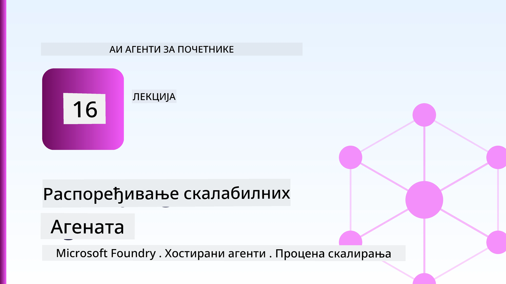
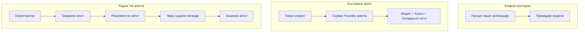
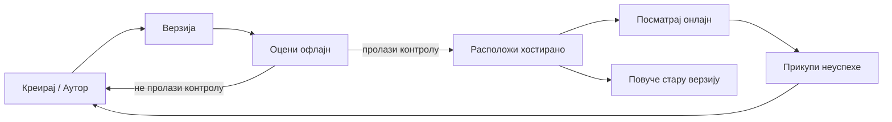
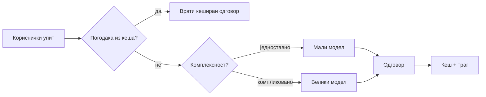
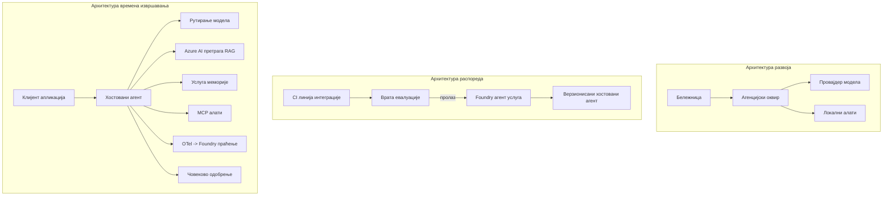

# Распоређивање скалабилних агената са Microsoft Foundry



До сада на курсу направили сте агенте који раде на вашем лаптопу, унутар бележнице, покретани преко `az login` и неког броја варијабли окружења. То је управо прави начин да се учи. То није прави начин да се покрене агент на којем хиљаде корисника зависи у 3 ујутру.

Овај час је о јазу између „ради на мом рачунару“ и „ради поуздано и приступачно у продукцији.“ Тај јаз затварамо коришћењем **Microsoft Foundry** и **Microsoft Foundry Agent Service**, правећи правог агента корисничке подршке који има алате, претрагу, меморију, процену и надзор.

## Увод

Овај час ће обухватити:

- Разлику између **прототип агента** и **распоређеног агента**, и зашто је транзиција углавном све *око* модела.
- **Обрасце распоређивања** за агенте: клијент-хостирани, сервис-хостирани (Hosted Agents) и оркестрирани радним током.
- **Животни циклус агента** на Microsoft Foundry — креирање, верзионисање, распоређивање, процена, праћење, повлачење.
- **Стратегије скалирања**: рутирање модела, кеширање, конкурентност и стателес дизајн.
- **Опсервабилност** са OpenTelemetry и Foundry праћењем.
- **Оптимизацију трошкова** кроз избор модела, рутирање и капије процене.
- **Разматрања за предузећа**: управљање, људско одобрење и безбедно покретање MCP сервера у продукцији.

## Циљеви учења

Након завршетка овог часа, знаћете како да:

- Изаберете прави образац распоређивања за задати радни оптерећење агента.
- Распоредите агента у Microsoft Foundry Agent Service тако да је верзионисан, управљан и опсервабилан.
- Инструментирате агента за праћење и повезујете цевовод процене који се покреће пре сваког издања.
- Примeните рутирање модела и кеширање да бисте задржали кашњење и трошкове под контролом на скали.
- Додате капију људског одобрења за акције високог ризика и интегришете MCP сервер на безбедан начин у продукцији.

## Претпоставке

Овај час претпоставља да сте завршили претходне часове и да сте упознати са:

- Прављење агената са [Microsoft Agent Framework](../14-microsoft-agent-framework/README.md) (Час 14).
- [Коришћење алата](../04-tool-use/README.md) (Час 4) и [Agentic RAG](../05-agentic-rag/README.md) (Час 5).
- [Меморија агента](../13-agent-memory/README.md) (Час 13) и [Agentic Protocols / MCP](../11-agentic-protocols/README.md) (Час 11).
- [Опсервабилност и процена](../10-ai-agents-production/README.md) (Час 10) — овaј час директно надограђује на то.

Такође ће вам требати:

- **Azure претплата** и **Microsoft Foundry пројекат** са најмање једним распоређеним чат моделом.
- Аутентификовани **Azure CLI** (`az login`).
- Python 3.12+ и пакетима из репозиторијума [`requirements.txt`](../../../requirements.txt).

## Од прототипа до продукције: шта се заправо мења

Прототип агент и агент у продукцији деле исти основни циклус — размишљање, позив алата, одговор. Оно што се мења је све што је упаковано око тог циклуса. Модел је можда 20% продукционог агента; осталих 80% је оперативни костур.

| Бринутост | Прототип | Продукција |
| --- | --- | --- |
| **Хостинг** | Ради у вашој бележници | Ради као хостирана услуга, верзионирана и пласирана |
| **Идентиитет** | Ваш `az login` токен | Управљани идентитет са ограниченим RBAC-ом |
| **Стање** | У меморији, губи се при рестарту | Спољашњи (складиште нити, меморијски сервис) |
| **Неуспех** | Видите траг грешке | Поновни покушаји, резерве, непроцесиране поруке, аларми |
| **Трошкови** | "Само неколико центи" | Праћено по захтеву, рутирано, кеширано, буџетирано |
| **Квалитет** | Погледате излаз | Аутоматски оцењен пре сваког издања |
| **Поверење** | Одобрите сваку акцију | Политика + човек у петљи за ризичне акције |

Имајте ову табелу на уму. Сваки од следећих одељака се односи на један од ових редова.

## Обрасци распоређивања агената

Постоје три обрасца које ћете често користити, често у комбинацији.

### 1. Клијент-хостирани агенти

Објекат агента живи унутар *вашег* апликационог процеса. Ваш код директно позива провајдера модела; циклус размишљања ради у вашој услузи. Ово је оно што су претходни часови радили.

- **Користите га када** вам треба пуна контрола над циклусом, прилагођени middleware или уграђујете агента у постојећи бекенд.
- **Компромис**: сами поседујете скалирање, стање и отпорност.

### 2. Хостирани агенти (Foundry Agent Service)

Агент је *регистрован као ресурс* у Microsoft Foundry. Foundry хостира циклус размишљања, чува нити, спроводи сигурност садржаја и RBAC, и чини агента видљивим у Foundry порталу. Ваша апликација постаје танак клијент који креира нити и чита одговоре.

- **Користите га када** желите издржљивост, уграђену опсервабилност, управљање и мањи оперативни опсег.
- **Компромис**: мање дубоке контроле у замену за управљано окружење.

### 3. Радни токови агената

Више агената (и алата) се саставља у граф са експлицитним контролним током — секвенцијални кораци, разгранци, чворови људског одобрења и трајне контролне тачке које могу паузирати и наставити. Ово је Microsoft Agent Framework **Workflows** функција применјена на нивоу скалирања.

- **Користите га када** један задатак обухвата неколико специјализованих агената или захтева корак одобрења на средини.
- **Компромис**: више покретних делова; потребна је опсервабилност на нивоу оркестрације.



## Животни циклус агента на Microsoft Foundry

Распоређивање агента није једнократни `push`. То је циклус и изгледа много као циклус софтверског издања јер је управо то.



Кључна идеја, преузета из [Часа 10](../10-ai-agents-production/README.md): **офлајн процена је капија, а не накнадна мисao.** Нова верзија агента неће бити испоручена ако не испуни ваше прагове процене. Онлајн опсервабилност затим враћа стварне грешке из производње у вашу офлајн тестну сету. То је цео циклус.

## Стратегије скалирања

Скалирање агента разликује се од скалирања стателес веб API-ја, јер сваки захтев може покренути више скупих позива модела и алата. Четири технике носе већину оптерећења.

**Стателес руковање захтевима.** Немојте чувати појединачно корисничко стање у меморији процеса. Перзистирајте нитне разговоре у Foundry thread store или меморијском сервису тако да било која инстанца може обрадити било који захтев. Ово вам омогућава хоризонтално скалирање — додајте инстанце, без лепљивих сесија.

**Рутирање модела.** Ниједан захтев не мора да иде на ваш најспособнији (и најскупљи) модел. Рутирујте једноставне захтеве — класификација намере, кратки фактички одговори — на мали, брзи модел и резервишите велики модел за право размишљање. Foundry **Model Router** може то учинити за вас, или можете имплементирати лагани класификатор сами. Направићете дIY верзију у лабораторији.

**Кеширање одговора.** Много упита подршке су скоро дупликати („како да ресетујем лозинку?“). Кеширајте одговоре на уобичајена питања и послужите их без позива модела. Чак и умерена стопа сличности кеша значајно смањује трошкове и кашњење.

**Конкурентност и притисак назад.** Провајдери модела имају ограничења брзине. Ограничавајте конкурентност, користите поновне покушаје са експоненцијалним назадњим одлагањем и неуспехе обрадите пристојно (одговор „радимо на томе“ у реду уместо грешке 500).



## Опсервабилност у продукцији

Не можете управљати оним што не видите. Као што је покривено у Часу 10, Microsoft Agent Framework нативно емитује **OpenTelemetry** трагове — сваки позив модела, позив алата и корак оркестрације постаје span. У продукцији те spans извозите у Microsoft Foundry (или било који OTel-компатибилан backend) да бисте могли:

- Пратити једну корисничку жалбу од почетка до краја кроз сваки позив модела и алата.
- Пратити латенцију п50/п95 и трошкове по захтеву током времена.
- Упозоравати на нагле скокове грешака и аномалије у трошковима пре него што корисници (или ваш финансијски тим) примете.

```python
from agent_framework.observability import get_tracer

tracer = get_tracer()

with tracer.start_as_current_span("support_request") as span:
    span.set_attribute("customer.tier", "enterprise")
    span.set_attribute("routed.model", "gpt-5-nano")
    # извршење агента се аутоматски прати унутар ове области
```

Атрибути као `customer.tier` и `routed.model` претварају гомилу трагова у одговорена питања („да ли предузећа превише често добијају рутирање у мали модел?“).

## Оптимизација трошкова

Трошкови у продукцијским агентима доминирају над токенима. Три ручице, по реду утицаја:

1. **Изаберите праву величину модела.** Мали модел који пролази вашу капију процене је готово увек јефтинији од великог који такође пролази. Користите процену да *докаже* да је мали модел довољан уместо да из страха подразумевано изаберете највећи модел.
2. **Рутирујте по сложености.** Као горе — плаћајте цене великог модела само за захтеве који траже сложено размишљање великог модела.
3. **Кеширајте агресивно.** Најјефтинији позив модела је онај који никада не направите.

Капије процене и контрола трошкова су иста дисциплина посматрана из два угла: процена вам говори *минимални квалитет*, а рутирање и кеширање вас држе што ближе том нивоу *трошкова*.

## Разматрања при распоређивању за предузећа

**Управљање.** Hosted Agents наследјују Foundry-јев RBAC, сигурност садржаја и ревизијско бележење. Дајте сваком агенту управљани идентитет са најмањим привилегијама које су му потребне — приступ само за читање бази знања, ограничен приступ API-ју тикета, ништа више.

**Човек у петљи.** Неке акције су превише значајне да би се аутоматизовале — издавање повраћаја новца, брисање налога, ескалација ка правном тиму. Microsoft Agent Framework подржава алате који **захтевају одобрење**: агент предлаже акцију, извршење се паузира, човек одобрава или одбија, а радни ток наставља. Видели сте примитив у [Часу 6](../06-building-trustworthy-agents/README.md); овде га распоређујете.

**MCP у продукцији.** [MCP](../11-agentic-protocols/README.md) омогућава вашем агенту да користи спољне алате преко уобичајеног интерфејса. У продукцији третирајте сваки MCP сервер као непоуздани границу: закључајте верзију сервера, покретајте га са ограниченим идентитетом, валидирајте његове излазне податке и никада му не откривајте тајне. MCP сервер је зависност, а зависности се пропихују, ревидирају и ограничавају по брзини.



Та три дијаграма — развој, распоређивање, радно време — представљају истог агента у три фазе његовог живота. Лабораторија која следи води вас кроз његову изградњу.

## Практична лабораторија: Агенс корисничке подршке спреман за продукцију

Отворите [`code_samples/16-python-agent-framework.ipynb`](./code_samples/16-python-agent-framework.ipynb) и радите га од почетка до краја. Склопићете **Contoso агента корисничке подршке** са свим производним бригама у жицама:

1. **Позив алата** — провера статуса поруџбине и отварање тикета за подршку.
2. **RAG** — одговарање на питања о политикama из базе знања (Azure AI Search, са меморијским приклоном тако да бележница ради без ресурса Search).
3. **Меморија** — памћење корисника током кретања разговора.
4. **Рутирање модела** — класификатор сложености рутира сваки захтев ка малом или великом моделу.
5. **Кеширање одговора** — понављана питања се сервирају из кеша.
6. **Људско одобрење** — повраћаји изнад прага се паузирају ради људског потписа.
7. **Цевовод процене** — мала офлајн тестна сет садењује агента и служи као капија издања.
8. **Опсервабилност** — OpenTelemetry тражење око сваког захтева.

### Преглед корака

Бележница је организована тако да је свака производна брига самосталан, извршавани одељак. Срж је руковање захтевима рутирањем-плус-кеширањем:

```python
async def handle_support_request(query: str, customer_id: str) -> str:
    # 1. Служити из кеша кад год је могуће.
    cached = response_cache.get(normalize(query))
    if cached:
        return cached

    # 2. Усмеравати по сложености ради контроле трошкова.
    model = "gpt-5-nano" if is_simple(query) else "gpt-5-mini"

    # 3. Покренути агент унутар трага за посматрање.
    with tracer.start_as_current_span("support_request") as span:
        span.set_attribute("routed.model", model)
        span.set_attribute("customer.id", customer_id)
        response = await support_agent.run(query, model=model)

    # 4. Кеширати и вратити.
    response_cache.set(normalize(query), response.text)
    return response.text
```

Капија процене која чува издање изгледа овако:

```python
async def evaluation_gate(agent, test_cases, threshold: float = 0.8) -> bool:
    passed = 0
    for case in test_cases:
        result = await agent.run(case["input"])
        if score_response(result.text, case["expected"]) >= 0.8:
            passed += 1
    pass_rate = passed / len(test_cases)
    print(f"Evaluation pass rate: {pass_rate:.0%} (gate: {threshold:.0%})")
    return pass_rate >= threshold  # разврсти само ако пролаз врата успе
```

Прочитајте сваки ред — бележница држи примитиве намерно малим да ништа није сакривено иза позива у оквиру.

## Валидација распоређеног агента са smoke тестовима

Горња капија процене ради *офлајн* против вашег агента. Кад је агент распоређен као Hosted Agent, потребна вам је још једна, још јефтинија провера: **да ли распоређена тачка заправо одговара?**

Распоређивање „успешно“ само доказује да је контролна равнина прихватила дефиницију — не доказује да агент одговара. Недостајућа зависност, лоше рутирање модела или истекла веза могу оставити зелено распоређивање које ништа не враћа. **Smoke тест** то ухвати за секунде, на сваком распоређивању, без трошкова целокупне процене.

Овај репозиторијум испоручује готов цевовод smoke тестова изграђен на основу [AI Smoke Test](https://github.com/marketplace/actions/ai-smoke-test) GitHub акције:

- **Каталог** — [`tests/lesson-16-smoke-tests.json`](../../../tests/lesson-16-smoke-tests.json) садржи упите и тврдње за Contoso агента подршке (одговори утемељени на политици, претрага поруџбина, останак на теми, континуитет нити у више токова). Каталози за агенте других часова су поред њега — видети [`tests/README.md`](../tests/README.md).
- **Радни ток** — [`.github/workflows/smoke-test.yml`](../../../.github/workflows/smoke-test.yml) се пријављује помоћу Azure OIDC и шаље сваки упит POST захтевом ка Responses endpoint-у агента, са неуспехом посла при било којем пропусту тврдње.

```yaml
- name: Smoke-test hosted agent
  uses: JFolberth/ai-smoketest@v1
  with:
    project_endpoint: ${{ inputs.project_endpoint }}
    agent_name: ContosoSupportAgent
    tests_file: tests/lesson-16-smoke-tests.json
```


Покрените га са картице **Actions** када ваш агент буде размештен, достављајући крајњу тачку вашег Foundry пројекта и име агента. Федеративни идентитет треба да има улогу **Azure AI User** у оквиру Foundry пројекта. Замислите слојеве као пирамиду: smoke тестови (да ли је доступан и одговара?) се покрећу при сваком развоју, офлајн евалуација (дали је довољно добра за пласирање?) се покреће пре промоције, а онлајн евалуација (како ради у стварном окружењу?) се покреће непрекидно.

## Провера знања

Тестирајте своје разумевање пре него што пређете на задатак.

**1. Приближно, колики део агента у продукцији чини „модел“, а шта је остало?**

<details>
<summary>Одговор</summary>

Модел је мањина система — често се наводи око 20%. Остатак је операционa костур: хостинг и верзионисање, идентитет и RBAC, екстернализовано стање, руковање отказима, праћење трошкова, евалуација и контроле са учешћем човека у петљи. Прелазак у продукцију је углавном око изградње свега *око* петље резоновања.
</details>

**2. Када бисте изабрали Hosted Agent уместо агента хостованог на клијенту?**

<details>
<summary>Одговор</summary>

Када желите управљано извршно окружење са уграђеном отпорношћу (тредови који се задржавају и могу наставити), посматрањем, безбедношћу садржаја и RBAC, а спремни сте да жртвујете неку ниско-ниво контролу петље резоновања за мањи оперативни простор. Клијент-хостован је пожељан када вам треба пуна контрола над петљом или када уграђујете агента у постојећи бекенд.
</details>

**3. Зашто скалабилни агент мора бити безстајан у својој процесној меморији?**

<details>
<summary>Одговор</summary>

Да било која инстанца може обрадити било који захтев, што омогућава хоризонтално скалирање без „стики“ сесија. Стање по корисничком разговору се екстернализује у продавницу тредова или сервис меморије. Ако би стање било у процесној меморији, изгубили бисте га при поновном покретању и не бисте могли слободно да распоређујете оптерећење.
</details>

**4. Који проблем решава рутирање модела и како је повезано са евалуацијом?**

<details>
<summary>Одговор</summary>

Рутација шаље једноставне захтеве малом, јефтинијем и бржем моделу и задржава велики модел за праву резоновање, контролишући и латенцију и цену. Повезано је са евалуацијом јер евалуација доказује да је мали модел довољно добар за класу захтева — рутирање без евалуације је нагађање.
</details>

**5. Шта је „evaluation gate“ и где се налази у животном циклусу?**

<details>
<summary>Одговор</summary>

Evaluation gate покреће офлајн тестни сет против нове верзије агента и блокира развој ако стопа проласка не премаши праг. Слаже се између „верзије“ и „развоза“ у животном циклусу, чинећи квалитет предусловом за издавање, а не нечем што се проверава након пуштања.
</details>

**6. Зашто треба сматрати MCP сервер ненадежном границом у продукцији?**

<details>
<summary>Одговор</summary>

Јер је спољна зависност ка којој ваш агент позива. Треба да закључате његову верзију, трчите га са скопираним идентитетом, валидацијујете излазе, ограничавате му број позива и никада му не излажете тајне — иста дисциплина која се примењује на било коју трећу страну. Његови резултати улазе у резоновање вашег агента, па незаштићено поверење представља безбедносни ризик.
</details>

**7. Која појединачна промена обично има највећи утицај на трошкове агента у продукцији и зашто?**

<details>
<summary>Одговор</summary>

Постављање адекватне величине модела — коришћење најмањег модела који и даље пролази ваш evaluation gate. Трошкове доминирају токени, а мањи модел који испуњава критеријум квалитета готово увек је јефтинији од већег. Кеширање и рутирање тада још више смањују трошкове, али избор правог базног модела има највећи утицај првог реда.
</details>

**8. Коју улогу играју span атрибути као што су `customer.tier` и `routed.model` у посматрању?**

<details>
<summary>Одговор</summary>

Претварају сирове трагве у пословна питања на која се може одговорити. Без атрибута имате зид span-ова; са њима можете питати „да ли се велике корпорације пребрзо рутирају на мали модел?“ или „који модел обрађује наше најспорије захтеве?“ Атрибути су начин да телеметрију режете по димензијама које су важне за вашу операцију.
</details>

## Задатак

Узмите агента корисничке подршке из лабораторије и учврстите га за одређени сценарио: **агент за подршку у наплати претплате за SaaS компанију.**

Ваш поднесак треба да:

1. **Замењите алате** оним релевантним за наплату: `get_subscription_status`, `get_invoice` и `issue_credit` (кредити изнад 50 долара захтевају људско одобрење).
2. **Додајте три RAG документа** који покривају политику повраћаја новца компаније, наплатни циклус и политику отказивања.
3. **Проширите евалуациони сет** на најмање осам случајева, укључујући најмање два која *треба* да покрену пут одобрења од стране човека, и потврдите да ваш evaluation gate исправно пролази или не пролази.
4. **Додајте један извештај о трошковима**: након покретања десет мешовитих упита кроз агента, испечатe колико је отишло на мали модел, колико на велики модел, и колико је послужено из кеша.

Напишите кратак параграф (у markdown ћелији) објашњавајући које правило рутирања модела сте изабрали и како бисте га валидирали са правим саобраћајем. Не постоји један тачан одговор — процењује се да ли су продукционе бриге повезане на кохерентан начин.

## Резиме

У овој лекцији померили сте агента из прототипа у продукцију помоћу Microsoft Foundry:

- Прелазак у продукцију је углавном око **оперативног оквира** око модела — хостинг, идентитет, стање, руковање отказима, трошкови, квалитет и поверење.
- Научили сте три **образца распоређивања** — клијент-хостован, Hosted Agents и Agent Workflows — и када који одговара.
- Прошли сте кроз **жизни циклус агента**, где офлајн **евалуација делује као капија издавања**, а онлајн посматрање враћа отказе у тестни сет.
- Примeнили сте **стратегије скалирања** — дизајн без стања, рутирање модела, кеширање и ограничену паралелност — и повезали их са **оптимизацијом трошкова**.
- Повезали сте **ентерпрајс контроле**: RBAC, одобрење са људским учешћем и продукционо сигурну MCP интеграцију.
- Изградили сте **агента за корисничку подршку спремног за продукцију** који повезује сваку од ових брига у извршни код.

Следећа лекција иде у супротном смеру: уместо да се агенти скалирају у облак, ви ћете их спустити *доље* на једну рачунарску машину програмера и покретати их потпуно локално.

## Додатни ресурси

- <a href="https://learn.microsoft.com/azure/ai-foundry/what-is-azure-ai-foundry" target="_blank">Microsoft Foundry документација</a>
- <a href="https://learn.microsoft.com/azure/ai-foundry/agents/overview" target="_blank">Преглед Microsoft Foundry Agent сервиса</a>
- <a href="https://learn.microsoft.com/en-us/agent-framework/overview/?wt.mc_id=youtube_26688_organicsocial_reactor&pivots=programming-language-python" target="_blank">Microsoft Agent Framework</a>
- <a href="https://learn.microsoft.com/azure/ai-foundry/concepts/model-router" target="_blank">Model Router у Microsoft Foundry</a>
- <a href="https://learn.microsoft.com/azure/search/search-what-is-azure-search" target="_blank">Azure AI Search</a>
- <a href="https://opentelemetry.io/" target="_blank">OpenTelemetry</a>
- <a href="https://github.com/marketplace/actions/ai-smoke-test" target="_blank">AI Smoke Test GitHub акција</a>
- <a href="https://modelcontextprotocol.io/" target="_blank">Model Context Protocol (MCP)</a>

## Претходна лекција

[Прављење агената за коришћење рачунара (CUA)](../15-browser-use/README.md)

## Следећа лекција

[Креирање локалних AI агената](../17-creating-local-ai-agents/README.md)

---

<!-- CO-OP TRANSLATOR DISCLAIMER START -->
**Изјава о одрицању одговорности**:
Овај документ је преведен коришћењем услуге за аутоматски превод [Co-op Translator](https://github.com/Azure/co-op-translator). Иако тежимо тачности, имајте у виду да аутоматски преводи могу садржати грешке или нетачности. Оригинални документ на његовом изворном језику треба сматрати ауторитативним извором. За критичне информације препоручује се професионални људски превод. Нисмо одговорни за било каква неспоразума или погрешна тумачења која произилазе из коришћења овог превода.
<!-- CO-OP TRANSLATOR DISCLAIMER END -->