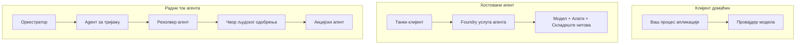
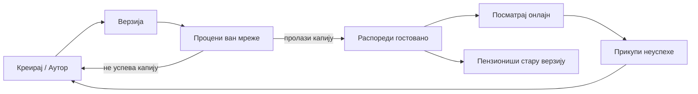
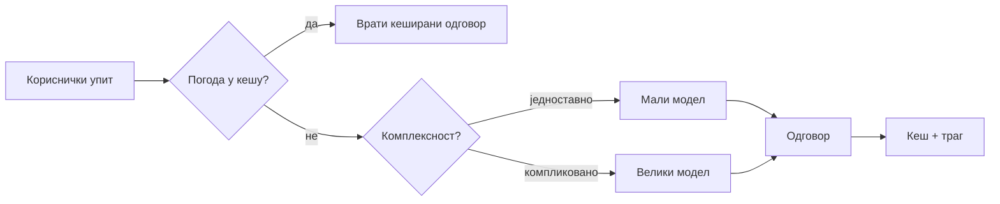
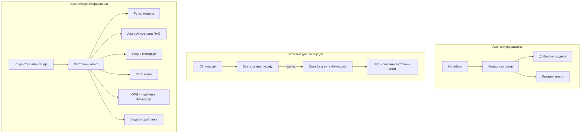

# Деплојирање скалабилних агената са Microsoft Foundry


До овог тренутка у курсу направили сте агенте који раде на вашем лаптопу, унутар нотебоок-а, покретани `az login` и неколико променљивих окружења. То је управо прави начин за учење. Међутим, није прави начин да покрећете агента на којем хиљаде корисника рачуна у 3 ујутро.

Ова лекција говори о јазу између „ради на мојој машини“ и „ради поуздано и приступачно, у продукцији.“ Тај јаз затварамо коришћењем **Microsoft Foundry** и **Microsoft Foundry Agent Service**, и радимо то прављењем правог агента за корисничку подршку који има алате, преузимање, меморију, евалуацију и праћење.

## Увод

Ова лекција ће обухватити:

- Разлику између **прототип агента** и **деплојираног агента**, и зашто је прелазак углавном у вези са свим *око* модела.
- **Обрасце деплоја** за агенте: хостоване код клијента, хостоване услуге (Hosted Agents), и оркестриране токове рада.
- **Животни циклус агента** на Microsoft Foundry — креирање, верзионисање, деплој, евалуација, посматрање, повлачење.
- **Стратегије скалирања**: рутирање модела, кеширање, паралелност и бездржавност.
- **Посматрање** са OpenTelemetry и Foundry праћењем.
- **Оптимизацију трошкова** кроз избор модела, рутирање и евалуационе капије.
- **Корпоративне аспекте**: управљање, људска сагласност и безбедно покретање MCP сервера у продукцији.

## Циљеви учења

Након завршетка ове лекције, знаћете како да:

- Изаберете прави образац деплоја за дати радни оптерећење агента.
- Деплојујете агента на Microsoft Foundry Agent Service тако да буде верзионисан, управљан и посматран.
- Инструментујете агента за праћење и повежете евалуациони пропусни пут који се покреће пре сваког издања.
- Примeните рутирање и кеширање модела како бисте контролисали латенцију и трошкове на скали.
- Додате људску капију одобрења за акције високог ризика и интегришете MCP сервер на безбедан начин у продукцији.

## Предуслови

Ова лекција претпоставља да сте завршили претходне лекције и да сте упознати са:

- Прављење агената са [Microsoft Agent Framework](../14-microsoft-agent-framework/README.md) (Лекција 14).
- [Коришћењем алата](../04-tool-use/README.md) (Лекција 4) и [Agentic RAG](../05-agentic-rag/README.md) (Лекција 5).
- [Меморијом агента](../13-agent-memory/README.md) (Лекција 13) и [Agentic протоколима / MCP](../11-agentic-protocols/README.md) (Лекција 11).
- [Посматрањем и евалуацијом](../10-ai-agents-production/README.md) (Лекција 10) — ова лекција директно надограђује ту.

Такође ће вам требати:

- **Azure претплата** и **Microsoft Foundry пројекат** са најмање једним деплојираним чат моделом.
- Аутентификован **Azure CLI** (`az login`).
- Python 3.12+ и пакети из репозиторијума [`requirements.txt`](../../../requirements.txt).

## Од Прототипа до Продукције: Шта Заправо Промене

Прототип агент и продукцијски агент деле исту основну петљу — размишљање, позив алатки, одговор. Оно што се мења је све што је увијено око те петље. Модел је можда 20% продукцијског агента; осталих 80% је оперативни костур.

| Област     | Прототип | Продукција |
| ---        | ---      | ---        |
| **Хостовање** | Ради у вашем нотебоок-у | Ради као хостована услуга, верзионирана и распоређена |
| **Идентификација** | Ваш `az login` токен | Управљани идентитет са ограниченим RBAC-ом |
| **Стање**       | У меморији, губи се при рестарту | Екстернализовано (продавница нитова, меморијска служба) |
| **Неуспех**     | Видећете traceback | Поновни покушаји, алтернативе, dead-letter, упозорења |
| **Трошак**      | "То је неколико центи" | Прати се по запросу, маршрутира, кешира, буџетира |
| **Квалитет**    | Погледате резултат | Аутоматски се процењује пре сваког издања |
| **Поверење**    | Одобрите сваку акцију | Политика + људско укључивање за ризичне акције |

Имајте ову табелу на уму. Сваки наставак доле се односи на један од ових редова.

## Обрасци Деплоја Агента

Постоје три образаца које ћете користити, често у комбинацији.

### 1. Клијентски хостовани агенти

Објекат агента живи унутар *вашег* процеса апликације. Ваш код директно позива провајдера модела; петља размишљања ради у вашој услузи. Ово је оно што је свака претходна лекција радила.

- **Користите када** вам треба потпуна контрола над петљом, прилагођени посредник, или убацујете агента у постојећи backend.
- **Компромис**: сами водите рачуна о скалирању, стању и отпорности.

### 2. Хостовани агенти (Foundry Agent Service)

Агент је *регистрован као ресурс* у Microsoft Foundry. Foundry хостује петљу размишљања, чува нитове, спроводи безбедност садржаја и RBAC, и чини агента видљивим у Foundry порталу. Ваша апликација постаје танак клијент који креира нити и чита одговоре.

- **Користите када** желите издржљивост, уграђено посматрање, управу и мању оперативну површину.
- **Компромис**: мање ниско-нивоске контроле у замену за управљано окружење.

### 3. Токови рада агената

Више агената (и алата) се саставља у граф са експлицитним протоком контроле — секвенцијални кораци, разгранатање, чворови људског одобрења и издржљиве контролне тачке које могу паузирати и наставити. Ово је могућност Microsoft Agent Framework **Workflows** примењена у скали деплоја.

- **Користите када** један задатак обухвата неколико специјализованих агената или захтева корак одобрења усред.
- **Компромис**: више покретних делова; потребно посматрање на нивоу оркестрације.



## Животни циклус агента на Microsoft Foundry

Деплој агента није једнократни `push`. То је петља и много личи на софтверски циклус издања јер у основи и јесте то.



Кључна идеја, преузета из [Лекција 10](../10-ai-agents-production/README.md): **офлајн евалуација је капија, а не накнадна мисao.** Нова верзија агента се не испоручује ако не прође ваше евалуационе праг. Онлајн посматрање онда враћа стварне неуспехе у ваш скуп офлајн тестова. То је цео циклус.

## Стратегије Склалирања

Склалирање агента разликује се од скалирања веб API без стања, јер сваки захтев може активирати више скупих позива модела и алата. Четири технике носе највећи терет.

**Обрада захтева без стања.** Немојте чувати стање по кориснику у меморији процеса. Сачувајте нитове разговора у продавници нитова Foundry или меморијској служби тако да било који инстанца може обрадити било који захтев. Ово вам омогућава хоризонтално скалирање — додајете инстанце, без „лепљивих сесија“.

**Рутирање модела.** Ни сваки захтев не треба ваш најснажнији (и најскупљи) модел. Усмерите једноставне захтеве — класификацију намера, кратке фактичке одговоре — ка малом, брзом моделу, и резервишите велики модел за право закључивање. Foundry-јев **Model Router** може то за вас учинити, или можете реализовати лагани класификатор сами. У лабораторији ћете направити DIY верзију.

**Кеширање одговора.** Много упита корисничке подршке су скоро дупликати („како да ресетујем лозинку?“). Кеширајте одговоре на уобичајена питања и сервирајте их без уопште позива модела. Чак и умерена стопа гађања кеша значајно смањује трошкове и латенцију.

**Паралелност и повратни притисак.** Провајдери модела имају лимите пропусности. Ограничите своју паралелност, користите поновне покушаје са експоненцијалним одлагањем, и падните грациозно (одговор у реду чекања „радимо на томе“ је бољи од 500 грешке).



## Посматрање у продукцији

Не можете управљати оним што не можете видети. Као што је обрађено у Лекцији 10, Microsoft Agent Framework нативно емитује **OpenTelemetry** траговање — сваки позив модела, позив алатке и корак оркестрације постаје опсег. У продукцији те опсеге извезете у Microsoft Foundry (или било који OTel-компатибилан backend) да можете:

- Проследити један кориснички захтев од почетка до краја кроз сваки позив модела и алатке.
- Пратити латенцију и цену по запиту у времену (p50/p95).
- Упозоравати на скокове у стопи грешака и аномалије трошкова пре него што корисници (или тим за финансије) то уоче.

```python
from agent_framework.observability import get_tracer

tracer = get_tracer()

with tracer.start_as_current_span("support_request") as span:
    span.set_attribute("customer.tier", "enterprise")
    span.set_attribute("routed.model", "gpt-5-nano")
    # извршавање агента се аутоматски прати унутар овог периода
```

Атрибути као што су `customer.tier` и `routed.model` претварају зид трагова у одговарајућа питања („да ли корпоративни корисници пречесто бивају рутирани на мали модел?“).

## Оптимизација Трошкова

Трошкови у продукцијским агентима доминирају количином токена. Три левера, по утицају:

1. **Правилна величина модела.** Мали модел који прође вашу евалуациону капију је готово увек јефтинији од великог који такође прође. Користите евалуацију да *докажете* да је мали модел довољно добар уместо да из предострожности увек изаберете највећи.
2. **Рутирање по сложености.** Као горе — платите цену великог модела само за захтеве који захтевају размишљање великог модела.
3. **Кеширање агресивно.** Најјефтинији позив модела је онај који никада не направите.

Евалуационе капије и контроле трошкова су иста дисциплина виђена из два угла: евалуација вам каже *подну* границу квалитета, рутирање и кеширање вас држе што ближе тој *цени*.

## Разматрања Корпоративног Деплоја

**Управа.** Hosted Agents наслеђују Foundry-јев RBAC, безбедност садржаја и записивање задатака. Дайте сваком агенту управљани идентитет са најмање привилегија које треба — приступ само за читање базе знања, ограничен приступ тикет API-ју, ништа више.

**Људски фактор у петљи.** Неке акције су пречувене да би се аутоматизовале — издавање повраћаја новца, брисање налога, ескалација ка правном тиму. Microsoft Agent Framework подржава **алате којима је потребно одобрење**: агент предлаже акцију, извршење се паузира, човек одобрава или одбија, и ток рада се наставља. То сте видели у примитиву у [Лекција 6](../06-building-trustworthy-agents/README.md); овде га деплојујете.

**MCP у продукцији.** [MCP](../11-agentic-protocols/README.md) омогућава вашем агенту да користи екстерне алатке кроз стандардни интерфејс. У продукцији третирајте сваки MCP сервер као непоуздану границу: региструјте верзију сервера, покрећите га са ограниченим идентитетом, проверавајте његове излазе и никада му не откривајте тајне. MCP сервер представља зависност, а зависности се патчују, ревидирају и имају ограничења пропусности.



Та три дијаграма — развој, деплој, извршење — представљају истог агента у три фазе живота. Лабораторијски рад који следи води вас кроз његову изградњу.

## Практична Лабораторија: Агент за Корисничку Подршку Спреман за Продукцију

Отворите [`code_samples/16-python-agent-framework.ipynb`](./code_samples/16-python-agent-framework.ipynb) и прођите кроз њега цело. Саставићете **Contoso агента за корисничку подршку** са свим производним забринутостима уграђеним:

1. **Позив алатки** — провера статуса наруџбине и отварање тикета за подршку.
2. **RAG** — одговарање на питања о политици из базе знања (Azure AI Search, са резервном меморијом у случају да нотебоок ради без ресурса за претрагу).
3. **Меморија** — памћење корисника кроз разговор.
4. **Рутирање модела** — класификатор сложености рутира сваки захтев ка малом или великом моделу.
5. **Кеширање одговора** — поновљена питања се сервирају из кеша.
6. **Људско одобрење** — повраћаји изнад прага чекају људски потпис.
7. **Евалуациони пропусни пут** — мали офлајн скуп тестова бодерује агента и служи као капија издања.
8. **Посматрање** — OpenTelemetry траговање око сваког захтева.

### Преглед

Нотебоок је организован тако да свака производна забринутост буде самостална, извршна секција. Срж је руковање захтевима са рутирањем и кеширањем:

```python
async def handle_support_request(query: str, customer_id: str) -> str:
    # 1. Служи из кеша када је могуће.
    cached = response_cache.get(normalize(query))
    if cached:
        return cached

    # 2. Рутирaj по комплексности ради контроле трошкова.
    model = "gpt-5-nano" if is_simple(query) else "gpt-5-mini"

    # 3. Покрени агента унутар траце спана за посматрање.
    with tracer.start_as_current_span("support_request") as span:
        span.set_attribute("routed.model", model)
        span.set_attribute("customer.id", customer_id)
        response = await support_agent.run(query, model=model)

    # 4. Кеширај и врати.
    response_cache.set(normalize(query), response.text)
    return response.text
```

Капија евалуације која штити издање изгледа овако:

```python
async def evaluation_gate(agent, test_cases, threshold: float = 0.8) -> bool:
    passed = 0
    for case in test_cases:
        result = await agent.run(case["input"])
        if score_response(result.text, case["expected"]) >= 0.8:
            passed += 1
    pass_rate = passed / len(test_cases)
    print(f"Evaluation pass rate: {pass_rate:.0%} (gate: {threshold:.0%})")
    return pass_rate >= threshold  # истовремено објављуј само ако капија прође
```

Прочитајте сваки ред — нотебоок држи примитиве намерно малим тако да ништа није скривено иза позива оквира.

## Валидација Деплојированог Агента са Смоук Тестовима

Горња капија евалуације се покреће *офлајн* против вашег објекта агента. Када се агент деплојује као Hosted Agent, потребна вам је још једна, још јефтинија провера: **да ли деплојирана тачка заиста одговара?**

Успешан деплој доказује само да је контролна равнина прихватила дефиницију — не доказује да агент одговара. Недостајућа зависност, лоше рутирање модела или истекла веза могу оставити зелену деплој која не враћа ништа. **Смоук тест** то ухвати за секунде, при сваком деплоју, без трошкова пуног тестирања.

Овај репозиторијум садржи спреман за употребу смоук-тест пропусни пут базиран на [AI Smoke Test](https://github.com/marketplace/actions/ai-smoke-test) GitHub акцији:

- **Каталог** — [`tests/lesson-16-smoke-tests.json`](../../../tests/lesson-16-smoke-tests.json) садржи подстицаје и тврдње за Contoso агента подршке (одговори засновани на политици, претраживање наруџбина, задржавање теме, и континуитет више окрета разговора). Каталози других лекција стоје поред њега — види [`tests/README.md`](../tests/README.md).
- **Ток рада** — [`.github/workflows/smoke-test.yml`](../../../.github/workflows/smoke-test.yml) се пријављује помоћу Azure OIDC и шаље сваки подстицај на endpoint одговора агента, неуспех посла у случају мањка тврдње.

```yaml
- name: Smoke-test hosted agent
  uses: JFolberth/ai-smoketest@v1
  with:
    project_endpoint: ${{ inputs.project_endpoint }}
    agent_name: ContosoSupportAgent
    tests_file: tests/lesson-16-smoke-tests.json
```


Покрените из картице **Actions** када се ваш агент распореди, достављајући крајњу тачку вашег Foundry пројекта и име агента. Федерацијски идентитет треба да има улогу **Azure AI User** у опсегу Foundry пројекта. Размотрите слојеве као пирамиду: smoke тестови (провера да ли је доступан и одговара?) се извршавају при сваком распоређивању, офлајн евалуација (да ли је довољно добра за пуштање?) се изводи пре промоције, а онлајн евалуација (како функционише у пракси?) ради континуирано.

## Провера знања

Тестирајте своје разумевање пре него што пређете на задатак.

**1. Колико отприлике део продукционог агента чини „модел“, а шта је остало?**

<details>
<summary>Одговор</summary>

Модел је мањина система — обично се наводи око 20%. Останак је оперативни костур: хостинг и верзионисање, идентитет и RBAC, екстернализовано стање, руковање грешкама, праћење трошкова, евалуација и контроле са човеком у петљи. Прелазак у продукцију углавном значи изградњу свега *око* петље резоновања.
</details>

**2. Када бисте изабрали Hosted Agent уместо клијент-хостованог агента?**

<details>
<summary>Одговор</summary>

Када желите управљани runtime са уграђеном издржљивошћу (тредови који опстају и могу се наставити), посматрањем, безбедношћу садржаја и RBAC, и спремни сте да жртвујете део ниско-нивоу контроле над петљом резоновања за мањи оперативни опсег. Клијент-хостован је пожељан када вам је потребна пуна контрола петље или када уграђујете агента у постојећи backend.
</details>

**3. Зашто скалабилни агент мора да буде бездржаван у својој меморији процеса?**

<details>
<summary>Одговор</summary>

Да би свака инстанца могла да обради било који захтев, што омогућава хоризонтално скалирање без сидрења сесија (sticky sessions). Стање по корисничком разговору екстернализовано је у thread store или memory service. Ако би стање било у меморији процеса, изгубили бисте га при рестарту и не бисте могли слободно распоређивати оптерећење.
</details>

**4. Koји проблем решава рутирање модела и како се односи на евалуацију?**

<details>
<summary>Одговор</summary>

Рутација шаље једноставне захтеве малом, јефтином и брзом моделу и резервише велики модел за стварно резоновање, контролишући како латенцију тако и трошкове. Односи се на евалуацију јер евалуација доказује да је мали модел довољно добар за одређену класу захтева — рутирање без евалуације је погађање.
</details>

**5. Шта је „evaluation gate“ и где се налази у животном циклусу?**

<details>
<summary>Одговор</summary>

Evaluation gate извршава офлајн тестни скуп на новој верзији агента и блокира распоређивање ако ниво пролаза не пређе праг. Налази се између „верзија“ и „распоређивања“ у животном циклусу, чинећи квалитет предусловом за издање, а не нечем што се проверава након пуштања.
</details>

**6. Зашто MCP сервер у продукцији треба третирати као непоуздану границу?**

<details>
<summary>Одговор</summary>

Јер је то спољна зависност на коју ваш агент позива. Треба закључати његову верзију, покретати га са регистрованим идентитетом, валидавати његове излазе, ограничити учесталост позива и никада му не давати приступ тајнама — истом дисциплином као са сваком трећом страном. Његови излази утичу на резоновање вашег агента, тако да непроверено поверење представља безбедносни ризик.
</details>

**7. Која једна промена обично има највећи утицај на трошкове продукционог агента и зашто?**

<details>
<summary>Одговор</summary>

Правилан избор величине модела — коришћење најмањег модела који још увек пролази вашу evaluation gate. Трошкови су доминирани бројем токена, а мањи модел који испуњава захтеве квалитета готово увек је јефтинији од већег. Кеширање и рутирање онда даље смањују трошкове, али избор правог базног модела има највећи ефекат првог реда.
</details>

**8. Коју улогу играју атрибути span-а као што су `customer.tier` и `routed.model` у посматрању (observability)?**

<details>
<summary>Одговор</summary>

Они претварају необрађене трагове у пословна питања која се могу поставити и добити одговоре. Без атрибута имате зид span-ова; са њима можете питати „да ли се корпоративни корисници превише често рутирају на мали модел?“ или „који модел обрађује наше најспорије захтеве?“ Атрибути су начин да телеметрију пресечете по димензијама које су битне за ваше пословање.
</details>

## Задатак

Узмите агента за корисничку подршку из лабораторије и ојачајте га за специфичан сценарио: **агент подршке за претплату на SaaS компанију.**

Ваш задатак треба да садржи:

1. **Замените алатке** са оним релевантним за наплату: `get_subscription_status`, `get_invoice`, и `issue_credit` (кредити изнад $50 захтевају људску одобрење).
2. **Додајте три RAG документа** који покривају политику повраћаја новца, циклус наплате и политику отказивања компаније.
3. **Проширите сет евалуације** на најмање осам случајева, укључујући најмање два која *треба* да покрену пут одобрења од људи, и потврдите да ваша evaluation gate правилно пролази или не пролази.
4. **Додајте једно извештавање о трошковима**: након што покренете десет мешовитих упита кроз агента, испишите колико је отишло на мали модел, колико на велики модел, и колико је служено из кеша.

Напишите кратак пасус (у markdown ћелији) у којем објашњавате које правило рутирања модела сте изабрали и како бисте га валидирали са стварним саобраћајем. Не постоји један прави одговор — оцењује се да ли су продукционе бриге повезане на доследан начин.

## Резиме

У овој лекцији прешли сте агента од прототипа до продукције са Microsoft Foundry:

- Прелазак у продукцију углавном је око **оперативног костиура** око модела — хостинг, идентитет, стање, руковање грешкама, трошкови, квалитет и поверење.
- Научили сте три **образца распореда** — клијент-хостовани, Hosted Agents и Agent Workflows — и када који одговара.
- Прошли сте кроз **животни циклус агента**, где офлајн **евалуација делује као капија за издање**, а онлајн посматрање враћа повратне информације о грешкама у тест сет.
- Применили сте **стратегије скалирања** — бездржавни дизајн, рутирање модела, кеширање и ограничену паралелност — и повезали их са **оптимизацијом трошкова**.
- Уградили сте **корпоративне контроле**: RBAC, одобрење са човеком у петљи и продукционо безбедну MCP интеграцију.
- Изградили сте **агента за корисничку подршку спремног за продукцију** који све ове бриге повезује у покретачки код.

Следећа лекција иде у супротном смеру: уместо повећања агената у облак, спустићете их *на* један девелоперски рачунар и покренути потпуно локално.

## Додатни ресурси

- <a href="https://learn.microsoft.com/azure/ai-foundry/what-is-azure-ai-foundry" target="_blank">Microsoft Foundry документација</a>
- <a href="https://learn.microsoft.com/azure/ai-foundry/agents/overview" target="_blank">Преглед Microsoft Foundry Agent Service</a>
- <a href="https://learn.microsoft.com/en-us/agent-framework/overview/?wt.mc_id=youtube_26688_organicsocial_reactor&pivots=programming-language-python" target="_blank">Microsoft Agent Framework</a>
- <a href="https://learn.microsoft.com/azure/ai-foundry/concepts/model-router" target="_blank">Model Router у Microsoft Foundry</a>
- <a href="https://learn.microsoft.com/azure/search/search-what-is-azure-search" target="_blank">Azure AI Search</a>
- <a href="https://opentelemetry.io/" target="_blank">OpenTelemetry</a>
- <a href="https://github.com/marketplace/actions/ai-smoke-test" target="_blank">AI Smoke Test GitHub акција</a>
- <a href="https://modelcontextprotocol.io/" target="_blank">Model Context Protocol (MCP)</a>

## Претходна лекција

[Прављење агената за коришћење рачунара (CUA)](../15-browser-use/README.md)

## Следећа лекција

[Креирање локалних AI агената](../17-creating-local-ai-agents/README.md)

---

<!-- CO-OP TRANSLATOR DISCLAIMER START -->
**Изјава о одрицању одговорности**:
Овај документ је преведен коришћењем услуге за аутоматски превод [Co-op Translator](https://github.com/Azure/co-op-translator). Иако тежимо тачности, имајте у виду да аутоматски преводи могу садржати грешке или нетачности. Оригинални документ на његовом изворном језику треба сматрати ауторитативним извором. За критичне информације препоручује се професионални људски превод. Нисмо одговорни за било каква неспоразума или погрешна тумачења која произилазе из коришћења овог превода.
<!-- CO-OP TRANSLATOR DISCLAIMER END -->