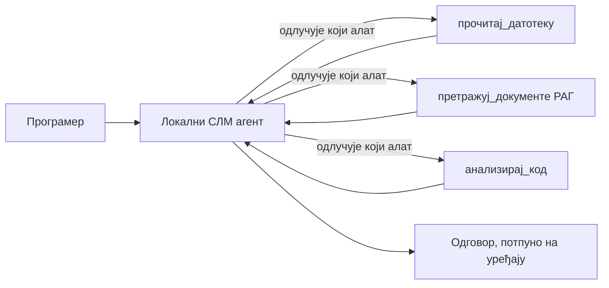
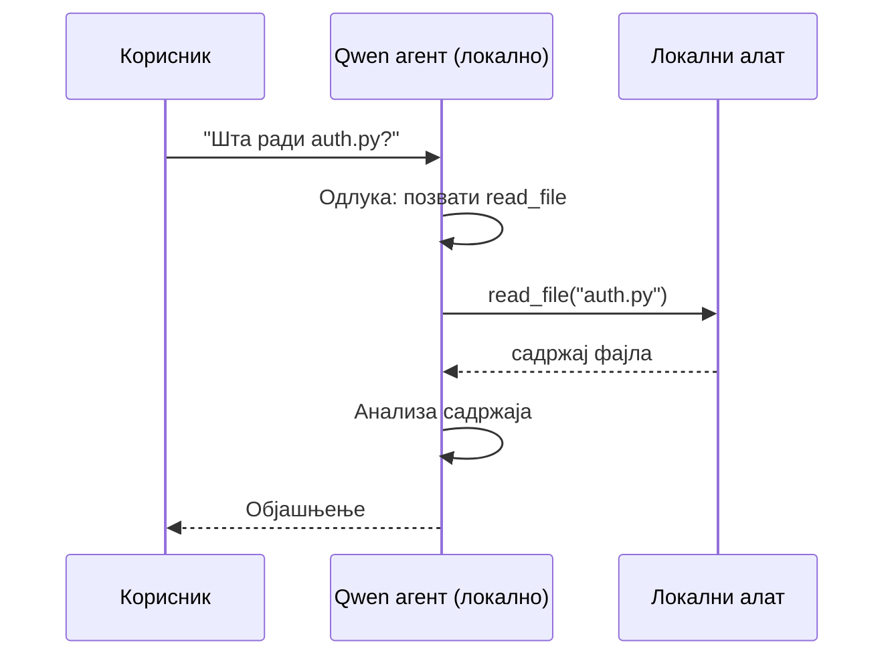
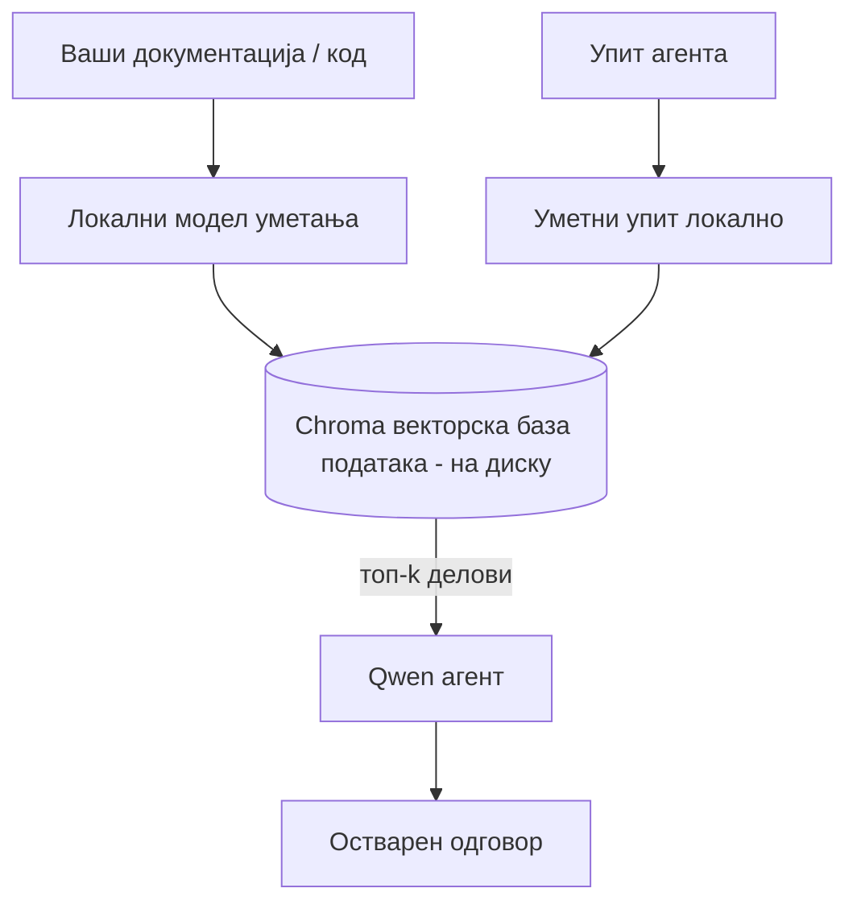

# Креирање локалних AI агената коришћењем Microsoft Foundry Local и Qwen


Претходна лекција је скалирала агенте *горе* у облак. Ова их спушта *доле* на један рачунар. До краја ћете имати радног инжењерског асистента који расуђује, позива алате, чита ваше фајлове и претражује вашу документацију — **без иједног позива за предикцију у облаку.**

Зашто бисте то желели? Три разлога која се стално јављају у стварном инжењерском раду:

- **Приватност.** Код и документи никада не напуштају машину. Ниједан упит, исечак или подаци купаца не прелазе мрежну границу.
- **Трошкови.** Локална предикција нема цену по токену. Можете да итерате целог дана за цену струје.
- **Без везе.** У авиону, у безбедном објекту или током искључења струје агент и даље ради.

Фора је у томе што уместо врхунског облачног модела користите **Мали језички модел (SLM)** који ради на вашем CPU-у, GPU-у или NPU-у. Ова лекција је о прављењу агената који су *добри* у оквиру тог ограничења, а не о претварању да ограничење не постоји.

## Увод

Ова лекција ће обухватити:

- **Мали језички модели (SLM-ови)** — шта су, где су најбољи, а где нису.
- **Microsoft Foundry Local** — runtime који преузима и сервира моделе на уређају преко **OpenAI-усклађеног API-ја**.
- **Qwen модели за позив функција** — SLM-ови који поуздано производе позиве алата, што омогућава локалне *агенте* (не само локални чет).
- **Локални алати, локални RAG и локални MCP** — даје агенуту могућности без употребе облака.
- **Хибридни узорци** — када задржати посао локално, а када користити облак.

## Циљеви учења

Након завршетка ове лекције, знаћете како да:

- Објасните компромисе SLM-ова и одаберете адекватне случајеве коришћења локалних агената.
- Локално сервирајте Qwen модел помоћу Foundry Local и повежите се на њега преко OpenAI-усклађене крајње тачке.
- Направите агента који позива алате и који ради у потпуности на вашим радним станицама.
- Додајте локални RAG преко ваших докумената помоћу локалне векторске базе података (Chroma).
- Повежите агента са локалним MCP сервером и размишљајте о хибридним дизајнима локално/облак.

## Предуслови

Ова лекција претпоставља да сте завршили претходне лекције и да вам је удобно:

- [Коришћење алата](../04-tool-use/README.md) (Лекција 4) и [Agentic RAG](../05-agentic-rag/README.md) (Лекција 5).
- [Agentic протоколи / MCP](../11-agentic-protocols/README.md) (Лекција 11).
- [Microsoft Agent Framework](../14-microsoft-agent-framework/README.md) (Лекција 14).

Такође ће вам требати:

- Радна станица за развој. **8 GB RAM је реална минимална вредност**; 16 GB+ је удобан капацитет. GPU или NPU помажу али нису неопходни.
- Инсталиран **Microsoft Foundry Local** (погледајте одељак за подешавање испод).
- Python 3.12+ и пакети из репозиторијума [`requirements.txt`](../../../requirements.txt), као и `foundry-local-sdk`, `openai` и `chromadb` за ову лекцију.

## Мали језички модели: Прави алат за локални рад

Врхунски облачни модел има стотине милијарди параметара и центар података иза себе. SLM има неколико милијарди параметара и мора да стане у RAM вашег лаптопа. Та разлика поставља јасна очекивања.

**SLM-ови су добри у:**

- Структурираним, ограниченим задацима — класификација, екстракција, резимирање познатог документа.
- **Позиви алата** — одлучивање коју функцију позвати и са којим аргументима.
- Брзе, јефтине и приватне итерације на сопственим подацима.

**SLM-ови су слабији у:**

- Отвореном, вишенивоу размишљању кроз велики контекст.
- Широком светском знању (мање су видели и више заборављају).

Стратешки успех за локалне агенте је зато: **нека SLM оркестрира, а нека алати носе главни терет.** Модел не мора да *зна* ваш код — мора да зна када да позове `read_file` и `search_docs`. То одговара јачањима SLM-а.



## Microsoft Foundry Local

**Microsoft Foundry Local** је лаган runtime који преузима, управља и сервира моделе у потпуности на вашем уређају. Његова најважнија особина за нас је што излаже **OpenAI-усклађену HTTP крајњу тачку** — што значи да OpenAI SDK и Microsoft Agent Framework-ов OpenAI клијент раде против ње само уз промену `base_url`. Све што сте научили о изради агената преноси се директно; само се крајња тачка помера из облака на `localhost`.

Foundry Local такође аутоматски бира најбољу верзију модела за ваш хардвер — CPU билд, CUDA/GPU билд или NPU билд — тако да не морате ручно оптимизовати по машини.

### Подешавање

Инсталирајте Foundry Local (погледајте [документацију](https://learn.microsoft.com/azure/ai-foundry/foundry-local/) за свој ОС), па потврдите да ради:

```bash
# Инсталирајте (пример; пратите документацију за вашу платформу)
winget install Microsoft.FoundryLocal      # Виндоус
# brew install microsoft/foundrylocal/foundrylocal   # мацОС

# Преузмите и покрените Qwen модел, затим покрените локални сервис
foundry model run qwen2.5-7b-instruct
foundry service status
```

Кад услуга ради, имате локалну OpenAI-усклађену крајњу тачку (обично `http://localhost:PORT/v1`). Билешка користи `foundry-local-sdk` да аутоматски открије крајњу тачку, тако да не морате да ручно уносите порт.

## Позив функција у Qwen-у: зашто је важан

Агенат је агент само ако може да позива алате. Много SLM-ова може да ћаска али производи непоуздане, неважеће позиве алата. **Qwen** модели су тренирани за позив функција и доследно емитују добро форматиране структуре позива алата — што управо претвара локални модел четова у локалног *агента*.

Ток је стандардна петља позива алата коју већ познајете, само што ради на уређају:



## Локални RAG

Претрага документације је место где локални агенти оправдавају своју корист. Уместо да се надате да је SLM запамтио документацију вашег фрејмворка, уметнете те документе у **локалну векторску базу података** и дозволите агенту да по потреби преузима релевантне делове.

Користимо **Chroma**, уграђену векторску продавницу која ради у процесу без сервера за управљање. Пејплајн је потпуно локални: локални модел уграђивања → локални вектори → локална претрага → локални SLM.



Ово је исти Agentic RAG образац из лекције 5 — једина разлика је што сва компонента ради на вашем рачунару.

## Локални MCP сервери

[MCP](../11-agentic-protocols/README.md) је транспорт, а не облачна услуга. MCP сервер може радити као локални процес на `stdio`, излажући алате вашем агенту преко стандарног протокола. Ово вам омогућава да поново искористите растући екосистем MCP сервера — приступ фајл системима, git операције, базе података — у потпуности офлајн.

Постављање безбедности се разликује од облака, али није одсутно: локални MCP сервер и даље ради са вашим корисничким привилегијама, па ограничите шта може да додирује (нпр. директоријум пројекта, не цео ваш кућни фолдер) и третирајте његове излазе као улазе који се требају валидационо проверити.

## Хибридни модели облака и локала

Локални приступ не значи само локално. Зрели системи усмеравају по осетљивости и тежини:

| Ситуација | Где ради |
| --- | --- |
| Осетљив ј код / подаци или ван мреже | **Локални SLM** |
| Једноставан, ограничен задатак | **Локални SLM** (јефтин, брз) |
| Тешко много-степено расуђивање на неосетљивим подацима | **Облачни модел** |
| Свега, током искључења | **Локални SLM** (глатка деградација) |

Ово одражава идеју **рутирања модела** из лекције 16 — осим што је један од „модела“ сада ваш уређај. Робустан дизајн се ослања на локално кад облак није доступан, тако да агент деградира у квалитету уместо да потпуно не успе.


## Практична вежба: Локални инжењерски асистент

Отворите [`code_samples/17-local-agent-foundry-local.ipynb`](./code_samples/17-local-agent-foundry-local.ipynb) и прођите кроз њега. Направићете **локалног инжењерског асистента** који ради у потпуности на вашој радној станици и може:

1. **Позивати алате** — преко Qwen позива функција кроз Foundry Local.
2. **Обављати локалне датотечне операције** — листање и читање датотека у директоријуму пројекта.
3. **Анализирати код** — извештавање основних метрика о изворној датотеци.
4. **Претраживати документацију** — локални RAG преко фасцикле са документацијом помоћу Chrome.
5. **Користити MCP** — повезати се са локалним MCP сервером (са глатким прескакањем ако није конфигурисан).

Није коришћена ниједна облачна предикција у било ком тренутку.

### Преглед корака

Асистент се повезује са Foundry Local преко OpenAI-усклађене крајње тачке, тако да код агента изгледа скоро идентично као у облачним лекцијама — само се клијент мења:

```python
from foundry_local import FoundryLocalManager
from openai import OpenAI

# Foundry Local открива/преузима модел и даје нам локални крајњи тачку.
manager = FoundryLocalManager(\"qwen2.5-7b-instruct\")
client = OpenAI(base_url=manager.endpoint, api_key=manager.api_key)  # api_key је локални плейсхолдер
```

Алати су обичне Python функције ограничене на директоријум пројекта:

```python
def read_file(path: str) -> str:
    \"\"\"Read a file, but only inside the sandboxed project directory.\"\"\"
    full = (PROJECT_ROOT / path).resolve()
    if PROJECT_ROOT not in full.parents and full != PROJECT_ROOT:
        return \"Access denied: path is outside the project directory.\"
    return full.read_text(encoding=\"utf-8\")
```

Обратите пажњу на проверу песковника — чак и локално, алат који чита произвољне путеве представља ризик. Билешка држи сваки алат ограниченим на један корен пројекта.

## Провера знања

Тестирајте своје разумевање пре него што пређете на задатак.

**1. Наведите два конкретна разлога за покретање агента локално, а не у облаку.**

<details>
<summary>Одговор</summary>

Било која два од: **приватност** (код и подаци никада не напуштају машину), **трошкови** (нема наплате по токену), и **могућност рада без мреже** (ради у авиону, у безбедном објекту или током искључења). Регулаторни/комплајнс захтеви који забрањују слanje података ван уређаја су чест разлог за приватност.
</details>

**2. Која је препоручена подела рада између SLM-а и његових алата у локалном агенту и зашто?**

<details>
<summary>Одговор</summary>

Нека SLM **оркестрира** (одлучује који алат позвати и са којим аргументима), а нека **алати обављају тежак посао** (читање датотека, преузимање докумената, израчунавање резултата). SLM-ови су добри у ограниченим одлукама као избор алата, али су слабији у широком знању и дугом вишестепеном расуђивању, па ослањање на алате игра њихове снаге.
</details>

**3. Шта омогућава поновну употребу кода облачних агената са Foundry Local?**

<details>
<summary>Одговор</summary>

Foundry Local експонира **OpenAI-усклађену HTTP крајњу тачку**. OpenAI SDK и Agent Framework-ов OpenAI клијент раде против ње само променом `base_url` (и коришћењем локалног API кључа као плейсхолдера). Све остало у коду агента остаје исто.
</details>

**4. Зашто користимо Qwen модел за позив функција посебно, а не било који SLM?**

<details>
<summary>Одговор</summary>

Јер агент мора да производи поуздане, добро форматиране **позиве алата**. Многи SLM-ови могу да ћаскају али емитују неисправне или неконзистентне структуре позива алата. Qwen модели су тренирани за позив функција и доследно производе позиве алата, што претвара локални чат модел у радног локалног агента.
</details>

**5. Које компоненте у локалном RAG пејплајну раде на машини?**

<details>
<summary>Одговор</summary>

Све: модел уграђивања, векторска база података (Chroma, на диску), корак преузимања и SLM. Документи се локално уграђују, чувају локално, преузимају локално и разматрају од стране локалног модела — ниједна компонента не додирује облак.
</details>

**6. Локални MCP сервер ради на вашој машини. Да ли то аутоматски значи да је безбедан? Које мере предострожности и даље треба предузети?**

<details>
<summary>Одговор</summary>

Не. Локални MCP сервер ради са вашим корисничким привилегијама, па може да приступи свему што ви можете. Ограничите га на оно што му треба (нпр. један директоријум пројекта, а не цео ваш кућни фолдер) и третирајте његове излазе као улазе које треба проверити пре коришћења.
</details>

**7. Опишите смислену хибридну правилину руту која укључује локални модел.**

<details>
<summary>Одговор</summary>

Рутирајте осетљиве или офлајн захтеве ка локалном SLM-у; једноставне ограничене задатке ка локалном SLM-у због брзине и цене; тешко вишестепено расуђивање на неосетљивим подацима ка облачном моделу; и враћајте се на локални SLM ако облак није доступан да агент благо деградира уместо да потпуно не успе. Ово је рутирање модела (лекција 16) са локалном машином као једним од модела.
</details>

**8. Која је реална минимална количина RAM-а за покретање локалног агента у овој лекцији и шта вам више RAM-а доноси?**

<details>
<summary>Одговор</summary>

Око **8 GB** је реална минимална вредност; 16 GB+ је удобан капацитет. Више RAM-а вам омогућава покретање већих и способнијих модела и чување више контекста у меморији. GPU или NPU убрзавају предикцију али нису неопходни — Foundry Local одабира CPU билд када нема доступног акцелератора.
</details>

## Задатак

Проширите локалног инжењерског асистента у **локалног рецензента документације** за мали пројекат по свом избору (користите неки од фолдера са лекцијама из овог репозиторијума ако желите).

Ваш рад треба да:

1. **Индексира стварни фолдер са документацијом/кодом** у Chroma (најмање пет фајлова).
2. **Дода алат `find_todos`** који скенира пројекат за коментаре `TODO`/`FIXME` и враћа их са именом фајла и бројем линије — уз исту проверу песковника као код `read_file`.

3. **Постаните агенту три питања** која га приморавају да комбинује алате: једно чисто РАГ питање, једно које захтева читање одређеног фајла и једно које захтева проналажење TODO ставки.
4. **Измерите то**: измерите време сва три одговора и забележите их у markdown ћелију. Коментаришите да ли је латенција прихватљива за ваш намерени радни ток.

Затим напишите кратак пасус о томе **шта бисте померили у облак а шта задржали локално** за овог рецензента, и зашто. Оцењујете се по томе да ли су локалне компоненте правилно повезане и да ли је ваша хибридна логика исправна — а не по квалитету модела.

## Резиме

У овој лекцији сте саставили агента који ради потпуно на вашем рачунару:

- **СЛМ-ови** мењају ширину знања за приватност, трошкове и рад ван мреже — и сјајни су када **оркестрирају алате** уместо да носе цело знање сами.
- **Foundry Local** служи моделе на уређају иза **OpenAI-компатибилног ендпоинта**, тако да се ваш cloud агентски код преноси са једном линијом промене.
- **Qwen модели са функцијским позивима** омогућавају поуздано локално позивање алата — и стога и локалних *агената*.
- **Локални РАГ** (Chroma) и **локални MCP** дају агенту могућности без напуштања машине.
- **Хибридни шаблони** вам дозвољавају да усмеравате по осетљивости и тежини, са локалним као пристојним резервним решењем.

Овиме се завршава лук дејства: Лекција 16 је скалирала агенте у Microsoft Foundry, а ова лекција их је свела на један радни сто. Следећа лекција се бави безбедношћу распоређених агената.

## Додатни ресурси

- <a href="https://learn.microsoft.com/azure/ai-foundry/foundry-local/" target="_blank">Microsoft Foundry Local документација</a>
- <a href="https://learn.microsoft.com/azure/ai-foundry/what-is-azure-ai-foundry" target="_blank">Microsoft Foundry документација</a>
- <a href="https://learn.microsoft.com/en-us/agent-framework/overview/?wt.mc_id=youtube_26688_organicsocial_reactor&pivots=programming-language-python" target="_blank">Microsoft Agent Framework</a>
- <a href="https://qwen.readthedocs.io/en/latest/framework/function_call.html" target="_blank">Qwen документација о функцијским позивима</a>
- <a href="https://modelcontextprotocol.io/" target="_blank">Model Context Protocol (MCP)</a>
- <a href="https://docs.trychroma.com/" target="_blank">Chroma векторска база података</a>

## Претходна лекција

[Deploying Scalable Agents](../16-deploying-scalable-agents/README.md)

## Следећа лекција

[Securing AI Agents](../18-securing-ai-agents/README.md)

---

<!-- CO-OP TRANSLATOR DISCLAIMER START -->
**Изјава о одрицању одговорности**:
Овај документ је преведен коришћењем услуге за аутоматски превод [Co-op Translator](https://github.com/Azure/co-op-translator). Иако тежимо тачности, имајте у виду да аутоматски преводи могу садржати грешке или нетачности. Оригинални документ на његовом изворном језику треба сматрати ауторитативним извором. За критичне информације препоручује се професионални људски превод. Нисмо одговорни за било каква неспоразума или погрешна тумачења која произилазе из коришћења овог превода.
<!-- CO-OP TRANSLATOR DISCLAIMER END -->