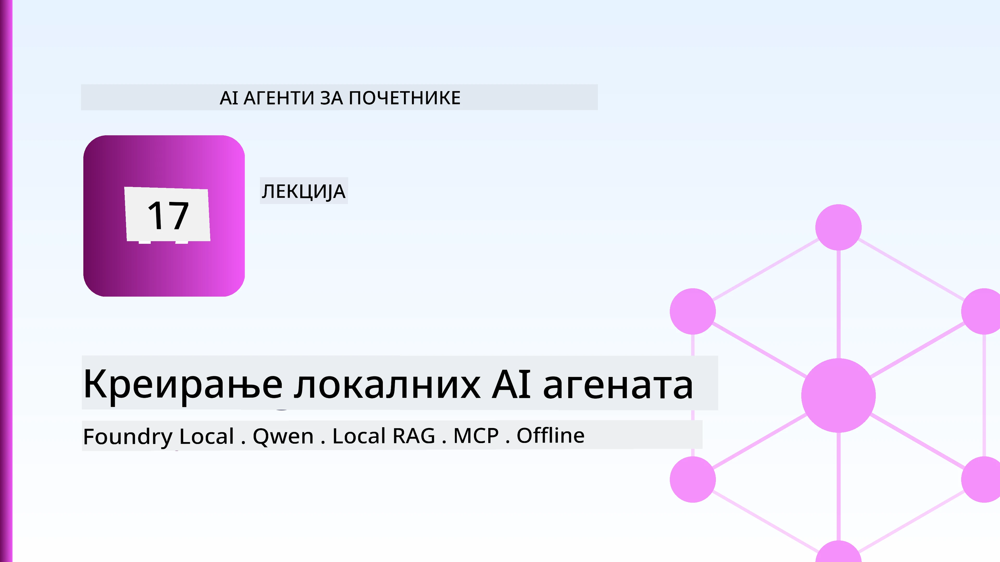
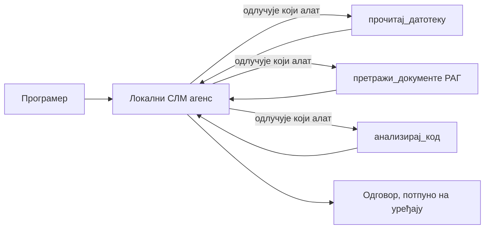
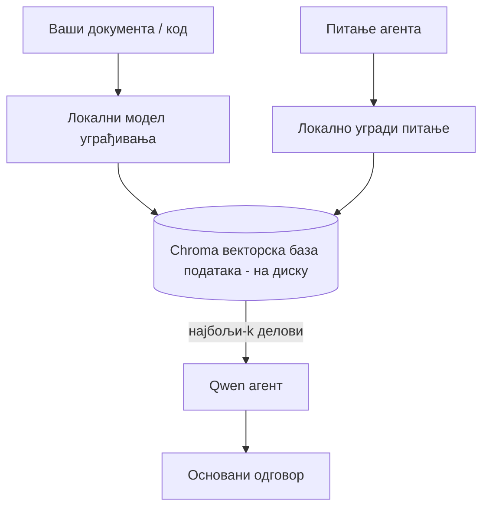
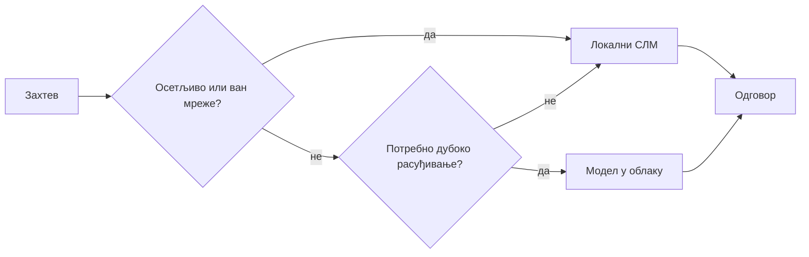

# Креирање Локалних AI Агената Користећи Microsoft Foundry Local и Qwen



Претходна лекција је повећала агенте *у облак*. Ова их спушта *на један рачунар*. На крају ћете имати радног инжењерског асистента који размишља, позива алате, чита ваше фајлове и претражује вашу документацију — **без иједног позива облачног инференса.**

Зашто бисте то желели? Три разлога који се често појављују у правом инжењерском раду:

- **Приватност.** Код и документи никада не напуштају рачунар. Ниједан упит, ниједан исечак, ниједни подаци са клијентом не прелазе мрежну границу.
- **Трошкови.** Локални инференс нема рачун по току. Можете итеративно радити целог дана за цену струје.
- **Офлајн.** У авиону, у безбедном објекту или током пада система, агент и даље ради.

Ухват је у томе што тргујете моделом граница облака за **Мали Језички Модел (SLM)** који ради на вашем CPU-у, GPU-у или NPU-у. Ова лекција говори о прављењу агената који су *добри* у оквиру тог ограничења, а не о претварању да ограничења нема.

## Увод

Ова лекција ће обухватити:

- **Мали Језички Модели (SLMs)** — шта су, где су добри, и где нису.
- **Microsoft Foundry Local** — окружење које преузима и сервира моделе на уређају преко **OpenAI-компатибилног API-ја**.
- **Qwen модели за позивање функција** — SLM-ови који поуздано производе позиве алата, што омогућава локалне *агенте* (не само локални ћаскање).
- **Локални алати, локални RAG и локални MCP** — дају агенуту способност без облака.
- **Хибридни обрасци** — када задржати ствари локално, а када користити облак.

## Циљеви учења

Након завршетка ове лекције, знаћете како да:

- Објасните компромисе SLM-ова и одаберете одговарајуће локалне случајеве употребе агената.
- Послужите Qwen модел локално преко Foundry Local и повежете га путем OpenAI-компатибилне тачке приступа.
- Направите агента за позивање алата који ради у потпуности на вашем рачунару.
- Додајте локални RAG преко ваших докумената користећи локалну векторску базу података (Chroma).
- Повежите агента са локалним MCP сервером и разумете хибридне дизајне локалног/облачног.

## Претходни услови

Ова лекција претпоставља да сте завршили раније лекције и удобно користите:

- [Коришћење алата](../04-tool-use/README.md) (Лекција 4) и [Agentic RAG](../05-agentic-rag/README.md) (Лекција 5).
- [Agentic протоколи / MCP](../11-agentic-protocols/README.md) (Лекција 11).
- [Microsoft Agent Framework](../14-microsoft-agent-framework/README.md) (Лекција 14).

Такође ће вам требати:

- Радна станица за програмере. **8 ГБ РАМ-а је реалистична минимална количина**; 16 ГБ+ је угодно. GPU или NPU помаже али није потребан.
- **Инсталиран Microsoft Foundry Local** (погледајте одељак за подешавање испод).
- Python 3.12+ и пакети у репозиторијуму [`requirements.txt`](../../../requirements.txt), плус `foundry-local-sdk`, `openai`, и `chromadb` за ову лекцију.

## Мали Језички Модели: Прави Аллат за Локални Рад

Модел из облака са врха има стотине милијарди параметара и централу података иза себе. SLM има неколико милијарди параметара и мора стати у RAM вашег лаптопа. Та разлика поставља јасна очекивања.

**SLM-ови су добри у:**

- Структурираним, ограниченим задацима — класификација, извлачење, резимирање познатог документа.
- **Позивање алата** — одлучивање коју функцију позвати и са којим аргументима.
- Брзо, јефтино, приватно итеративно развијање на властитим подацима.

**SLM-ови су слабији у:**

- Отворено, вишеструко размишљање кроз велики контекст.
- Широко знање о свету (видели су мање, и брже заборављају).

Победничка стратегија за локалне агенте је зато: **нека SLM оркестрира, а нека алати раде тешки посао.** Модел не мора *познавати* ваш код — мора знати кад да позове `read_file` и `search_docs`. То иде прямосрдачно ка јачинама SLM-а.



## Microsoft Foundry Local

**Microsoft Foundry Local** је лагано окружење које преузима, управља и сервира моделе у потпуности на вашем рачунару. Најважнија функција за нас је што пружа **OpenAI-компатибилну HTTP тачку приступа** — што значи да OpenAI SDK и Microsoft Agent Framework OpenAI клијент раде са њом само променом `base_url`. Све што сте научили о прављењу агената директно се преноси; само се тачка приступа помера из облака на `localhost`.

Foundry Local такође аутоматски бира најбољу верзију модела за ваш хардвер — CPU, CUDA/GPU, или NPU верзију — тако да не ручно оптимизујете по машине.

### Подешавање

Инсталирајте Foundry Local (погледајте [документацију](https://learn.microsoft.com/azure/ai-foundry/foundry-local/) за ваш ОС), па потврдите да ради:

```bash
# Инсталирајте (на пример; пратите документацију за вашу платформу)
winget install Microsoft.FoundryLocal      # Виндоус
# brew install microsoft/foundrylocal/foundrylocal   # macOS

# Преузмите и покрените Qwen модел, затим покрените локални сервис
foundry model run qwen2.5-7b-instruct
foundry service status
```

Када сервис ради, имате локалну, OpenAI-компатибилну тачку приступа (обично `http://localhost:PORT/v1`). Бележница користи `foundry-local-sdk` да аутоматски лоцира тачку приступа, тако да не морате ручно да дефинишете порт.

## Qwen Позивање Функција: Зашто је Важно

Агент је агент само ако може позивати алате. Многи SLM-ови могу ћаскати али производе непоуздане, неупућене позиве алата. **Qwen** модели су обучени за позивање функција и непрекидно емитују правилно формиране структуре позива алата — што тачно претвара локални ћаскање модел у локалног *агента*.

Ток је стандардна петља позива алата коју већ знате, само се изводи на уређају:


## Локални RAG

Претрага документације је место где локални агенти заработе. Уместо да се надају да је SLM запамтио документацију вашег фрејмворка, убацујете те документе у **локалну векторску базу података** и дозволите агенту да по захтеву преузима релевантне делове.

Користимо **Chromu**, уграђену векторску продавницу која ради у процесу без сервера за управљање. Петаља је потпуно локална: локални модел уграђивања → локални вектори → локално преузимање → локални SLM.



Ово је исти Agentic RAG образац из Лекције 5 — једина разлика је што сваки део ради на вашем рачунару.

## Локални MCP Сервери

[MCP](../11-agentic-protocols/README.md) је транспорт, а не облачна услуга. MCP сервер може радити као локални процес на `stdio`, изложивши алате вашем агенту преко стандардног протокола. Ово вам омогућава да поново користите растући екосистем MCP сервера — приступ фајл системе, git операције, базе података — потпуно офлајн.

Постављање безбедности је другачије од облака, али није изостајуће: локални MCP сервер и даље ради са дозволама вашег корисника, тако да ограничите шта може да додирне (директоријум пројекта, не цео ваш кућни фолдер) и третирајте његове излазне податке као улазне за проверу.

## Хибридни Обрасци Облака и Локала

Прво локално не значи само локално. Зрели системи усмеравају по осетљивости и сложености:

| Ситуација | Где ради |
| --- | --- |
| Осетљив код / подаци, или офлајн | **Локални SLM** |
| Једноставан, ограничен задатак | **Локални SLM** (јефтино, брзо) |
| Тешко вишеструко размишљање на неосетљивим подацима | **Облачни модел** |
| Све, током пада система | **Локални SLM** (поступно смањење квалитета) |

Ово одговара идеји **усмеравања модела** из Лекције 16 — с тим да је један од "модела" сада ваш властити рачунар. Робусни дизајн се ослања на локално када облак није доступан, тако да се агент квалитетно деградира уместо да потпуно застане.



## Практична Лабораторија: Локални Инжењерски Асистент

Отворите [`code_samples/17-local-agent-foundry-local.ipynb`](./code_samples/17-local-agent-foundry-local.ipynb) и прођите кроз њега. Направићете **локалног инжењерског асистента** који ради у потпуности на вашем радном столацу и може:

1. **Позивати алате** — преко Qwen позивања функција кроз Foundry Local.
2. **Обављати локалне операције са фајловима** — набрајати и читати фајлове у директоријуму пројекта.
3. **Анализирати код** — извештавати основне метрике о изворном фајлу.
4. **Претраживати документацију** — локални RAG преко фасцикле докумената са Chromom.
5. **Користити MCP** — повезати се са локалним MCP сервером (са грациозним прескоком ако није конфигурисан).

Ниједан облачни инференс се не користи у било ком тренутку.

### Обилазак

Асистент се повезује са Foundry Local преко OpenAI-компатибилне тачке приступа, тако да код агента изгледа скоро идентично као у лекцијама за облак — само клијент се мења:

```python
from foundry_local import FoundryLocalManager
from openai import OpenAI

# Foundry Local открива/преузима модел и даје нам локалну крајњу тачку.
manager = FoundryLocalManager(\"qwen2.5-7b-instruct\")
client = OpenAI(base_url=manager.endpoint, api_key=manager.api_key)  # api_key је локални плейсхолдер
```

Алати су обичне Python функције ограничене на директоријум пројекта:

```python
def read_file(path: str) -> str:
    \"\"\"Read a file, but only inside the sandboxed project directory.\"\"\"
    full = (PROJECT_ROOT / path).resolve()
    if PROJECT_ROOT not in full.parents and full != PROJECT_ROOT:
        return \"Access denied: path is outside the project directory.\"
    return full.read_text(encoding=\"utf-8\")
```

Обратите пажњу на проверу песка — чак и локално, алат који читa произвољне путеве представља ризик. Бележница држи сваки алат ограничен на један корен пројекта.

## Провера Знања

Тестирајте своје разумевање пре него што пређете на задатак.

**1. Дајте два конкретна разлога за покретање агента локално уместо у облаку.**

<details>
<summary>Одговор</summary>

Била која два од: **приватност** (код и подаци никад не напуштају рачунар), **трошкови** (без рачуна за инференс по току), и **офлајн способност** (ради без мреже — у авиону, у безбедном објекту или током пада система). Регулаторна/комплајнс ограничења која забрањују слање података ван уређаја су чест покретач приватности.
</details>

**2. Која је препоручена подела рада између SLM-а и његових алата у локалном агенту, и зашто?**

<details>
<summary>Одговор</summary>

Нека SLM **оркестрира** (одлучује који алат да позове и са којим аргументима) и нека **алати обављају тешки посао** (читање фајлова, преузимање докумената, израчунавање резултата). SLM-ови су јаки у ограниченим одлукама попут избора алата али слабији у опћем знању и дугом вишеструком размишљању, па ослањање на алате иде у прилог њиховим снагама.
</details>

**3. Шта омогућава поновну употребу кода агената из облака са Foundry Local?**

<details>
<summary>Одговор</summary>

Foundry Local пружа **OpenAI-компатибилну HTTP тачку приступа**. OpenAI SDK и Agent Framework OpenAI клијент раде са њом само променом `base_url` (и коришћењем локалног API кључа за пример). Све остало у коду агента остаје исто.
</details>

**4. Зашто конкретно користимо Qwen модел за позивање функција уместо било ког SLM-а?**

<details>
<summary>Одговор</summary>

Јер агент мора производити поуздане, правилно формиране **позиве алата**. Многи SLM-ови могу ћаскати али емитују неупућене или неконзистентне структуре позива алата. Qwen модели су обучени за позивање функција и стварају конзистентне позиве алата, што претвара локални ћаскање модел у функсионалног локалног агента.
</details>

**5. Који делови у локалној RAG петиљи раде на рачунару?**

<details>
<summary>Одговор</summary>

Сви: модел уграђивања, векторска база података (Chroma, на диску), корак преузимања и SLM. Документи се локално уграђују, локално чувају, локално преузимају и разматра их локални модел — ниједан део не додирује облак.
</details>

**6. Локални MCP сервер ради на вашем рачунару. Да ли то аутоматски значи да је безбедан? Коју предострожност треба да предузмете?**

<details>
<summary>Одговор</summary>

Не. Локални MCP сервер ради са дозволама вашег корисника, тако да може приступити свему што и ви можете. Ограничите га на оно што му треба (на пример, један директоријум пројекта уместо целог кућног фолдера) и третирајте његове излазне податке као улазне за проверу пре деловања.
</details>

**7. Опишите смислено правило хибридног усмеравања које укључује локални модел.**

<details>
<summary>Одговор</summary>

Усмерите осетљиве или офлајн захтеве на локални SLM; усмерите једноставне ограничене задатке локалном SLM-у због брзине и цене; усмерите тешко вишеструко размишљање на неосетљивим подацима облачном моделу; и вратite се локалном SLM-у ако облак није доступан да се агент грациозно деградира, а не да потпуно застаде. Ово је усмеравање модела (Лекција 16) са локалним рачунаром као једним од модела.
</details>

**8. Која је реалистична минимална количина РАМ-а за покретање локалног агента у овој лекцији, и шта вам више РАМ-а доноси?**

<details>
<summary>Одговор</summary>

Око **8 ГБ** је реалистична минимална вредност; 16 ГБ+ је угодно. Више РАМ-а вам омогућава покретање већих, способнијих модела и чување више контекста у меморији. GPU или NPU убрзава инференс али није потребан — Foundry Local бира CPU верзију када није доступан убрзавач.
</details>

## Задатак

Проширите локалног инжењерског асистента у **локалног рецензента документације** за мали пројекат по вашем избору (користите неки од фолдера ових лекција у овом репозиторијуму ако желите).

Ваш рад треба да:

1. **Индексira стварни фасциклу документације/кода** у Chromu (најмање пет фајлова).
2. **Додаје алатку `find_todos`** која скенира пројекат за `TODO`/`FIXME` коментаре и враћа их са фајлом и бројем линије — задржавајући исту проверу песка као и `read_file`.

3. **Поставите агенту три питања** која од ње захтевају да комбинује алате: једно чисто РАГ питање, једно које захтева читање одређене датотеке и једно које захтева проналажење TODO ставки.
4. **Измерите време**: измерите време сва три одговора и забележите их у markdown ћелију. Коментаришите да ли је латенција прихватљива за ваш планирани радни ток.

Затим напишите кратак пасус о томе **шта бисте преместили у облак, а шта бисте задржали локално** за овог рецензента и зашто. Оцењиваће се да ли су локалне компоненте правилно повезане и да ли је ваша хибридна логика исправна — а не квалитет модела.

## Резиме

У овој лекцији сте направили агента који ради у потпуности на вашем рачунару:

- **СЛМ-ови** мењају ширину у корист приватности, цене и офлајн рада — и најбоље функционишу када **оркестрирају алате** уместо да носе сва знања сами.
- **Foundry Local** служи моделе на уређају иза **OpenAI-компатибилне тачке приступа**, тако да ваш код облачног агента прелази са једном променом у линији.
- **Qwen модели са функцијским позивима** омогућавају поуздано позивање локалних алата — а самим тим и локалних *агената*.
- **Локални РАГ** (Chroma) и **локални MCP** дају агенту могућности без напуштања уређаја.
- **Хибридни модели** вам омогућавају рутирање по осетљивости и тежини, локално као елегантан резервни план.

Овиме се завршава лук имплементације: Лекција 16 је скалирала агенте у Microsoft Foundry, а ова лекција их је скалирала на једну радну станицу. Следећа лекција се бави чувањем безбедности распоредених агената.

## Додатни ресурси

- <a href="https://learn.microsoft.com/azure/ai-foundry/foundry-local/" target="_blank">Документација Microsoft Foundry Local</a>
- <a href="https://learn.microsoft.com/azure/ai-foundry/what-is-azure-ai-foundry" target="_blank">Документација Microsoft Foundry</a>
- <a href="https://learn.microsoft.com/en-us/agent-framework/overview/?wt.mc_id=youtube_26688_organicsocial_reactor&pivots=programming-language-python" target="_blank">Microsoft Agent Framework</a>
- <a href="https://qwen.readthedocs.io/en/latest/framework/function_call.html" target="_blank">Документација за Qwen функцијске позиве</a>
- <a href="https://modelcontextprotocol.io/" target="_blank">Model Context Protocol (MCP)</a>
- <a href="https://docs.trychroma.com/" target="_blank">Chroma вектор база података</a>

## Претходна лекција

[Deploying Scalable Agents](../16-deploying-scalable-agents/README.md)

## Следећа лекција

[Securing AI Agents](../18-securing-ai-agents/README.md)

---

<!-- CO-OP TRANSLATOR DISCLAIMER START -->
**Изјава о одрицању одговорности**:
Овај документ је преведен коришћењем услуге за аутоматски превод [Co-op Translator](https://github.com/Azure/co-op-translator). Иако тежимо тачности, имајте у виду да аутоматски преводи могу садржати грешке или нетачности. Оригинални документ на његовом изворном језику треба сматрати ауторитативним извором. За критичне информације препоручује се професионални људски превод. Нисмо одговорни за било каква неспоразума или погрешна тумачења која произилазе из коришћења овог превода.
<!-- CO-OP TRANSLATOR DISCLAIMER END -->