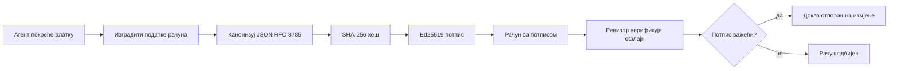
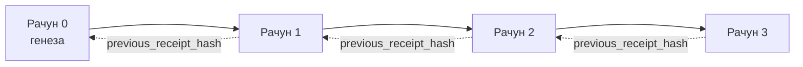

[Погледајте видео час: Осигуравање AI агената криптографским потписима](https://youtu.be/PLACEHOLDER_VIDEO_ID)

> _(Видео час и сличица ће додати Microsoft тим за садржај након спајања, у складу са шаблоном лекције 14 / 15.)_

# Осигуравање AI агената криптографским потписима

## Увод

Ова лекција ће обухватити:

- Зашто су аудиторски трагови за AI агенте важни за усаглашеност, отклањање грешака и поверење.
- Шта је криптографски потпис и како се разликује од непотписане линије логова.
- Како произвести потписани потпис за позив алата агента у обичном Python-у.
- Како проверити потпис ван мреже и открити манипулације.
- Како повезати потписе тако да уклањање или прераспоређивање једног прекида везу.
- Шта потписи доказују, а шта изричито не доказују.

## Циљеви учења

Након завршетка ове лекције знаћете како да:

- Препознате начине кварова који мотивишу криптографски доказ порекла за радње агената.
- Произведете Ed25519-потписан потпис преко канонског JSON објекта.
- Независно проверите потпис коришћењем само јавног кључа потписивача.
- Откријете манипулације поновним покретањем верификације на измењеном потпису.
- Изградите хеш-ланчану секвенцу потписа и објасните зашто ланац има значај.
- Препознате границу између онога што потписи доказују (ауторство, интегритет, редослед) и онога што не доказују (исправност радње, ваљаност политике).

## Проблем: Аудиторски траг вашег агента

Замислите да сте распоредили AI агента за Contoso Travel. Агент чита захтеве корисника, позива API за летове да прегледа опције и резервише седишта у име корисника. Прошлог квартала, агент је обрадио 50.000 резервација.

Данас стиже ревизор. Поставља једноставно питање: "Покажите ми шта је ваш агент радио."

Предате му датотеке са логовима. Ревизор их погледа и поставља тежје питање: "Како да знам да ти логови нису измењени?"

Ово је проблем аудиторског трага. Већина садашњих распореда агената се ослања на:

- **Апликацијске логове**: које написује сам агент, али их може изменити било ко са приступом фајл-систему.
- **Облачне сервисе за логовање**: видљиве су манипулације на нивоу платформе, али само ако ревизор верује оператеру платформе.
- **Логове трансакција базе података**: погодне за промене у бази али не и за произвољне позиве алата.

Ниједан од ових начина не може одговорити на питање ревизора без дага је он или она приморани да верују некоме (вама, вашем добављачу облака, добављачу базе података). За унутрашњу употребу, то је често прихватљиво. За регулисане радне задатке (финансије, здравство, све што подлеже EU AI Act-у), није.

Криптографски потписи решавају овај проблем тиме што свака радња агента може бити независно верификована. Ревизор вам не мора веровати. Потребан му је само ваш јавни кључ и сам потпис.

## Шта је криптографски потпис?

Потпис је JSON објекат који бележи шта је агент урадио, потписан дигиталним потписом.


  
Минимални потпис изгледа овако:

```json
{
  "type": "agent.tool_call.v1",
  "agent_id": "contoso-travel-bot",
  "tool_name": "lookup_flights",
  "tool_args_hash": "sha256:a3f9c1...",
  "result_hash": "sha256:7b2e1d...",
  "policy_id": "contoso-travel-policy-v3",
  "timestamp": "2026-04-25T14:30:00Z",
  "sequence": 47,
  "previous_receipt_hash": "sha256:9d4e6a...",
  "signature": {
    "alg": "EdDSA",
    "sig": "c5af83...",
    "public_key": "8f3b2c..."
  }
}
```
  
Три особине раде сав посао:

1. **Потпис**. Потпис је израдио gateway агента користећи Ed25519 приватни кључ. Свако са одговарајућим јавним кључем може ван мреже проверити потпис. Манипулација било којим пољем онемогућава потпис.

2. **Канонско кодирање**. Пре потписивања, потпис се сереалзује коришћењем JSON Canonicalization Scheme (JCS, RFC 8785). Ово осигурава да две имплементације које произведу исти логички потпис дају идентичан бајт-излаз. Без канонизације, различити JSON серијализатори давали би различите потписе за исти садржај.

3. **Хеш-ланч**. Поље `previous_receipt_hash` повезује сваки потпис са претходним. Уклањање или прераспоређивање потписа нарушава сваки следећи потпис. Манипулације постају видљиве на нивоу ланца чак и ако појединачни потписи буду заобиђени.

Заједно ове особине дају три гарантовања:

- **Ауторство**: овај кључ је потписао овај садржај.
- **Интегритет**: садржај није промењен од потписивања.
- **Редослед**: овај потпис је уследио после оног у ланцу.

## Производња потписа у Python-у

Не треба вам посебна библиотека да произведете потпис. Криптографски примитиви су широко доступни а логика је неколико десетина редова Python кода.

Практични задаци у `code_samples/18-signed-receipts.ipynb` воде кроз цео процес. Сажети приказ:

```python
import json
import hashlib
import base64
from nacl import signing
from jcs import canonicalize  # RFC 8785 канонски ЈСОН

def b64url_nopad(data: bytes) -> str:
    return base64.urlsafe_b64encode(data).decode("ascii").rstrip("=")

def sha256_canonical(obj) -> str:
    """SHA-256 of a Python object's JCS-canonical JSON form."""
    return f"sha256:{hashlib.sha256(canonicalize(obj)).hexdigest()}"

# Генериши или учитај кључ за потписивање (у производњи, чувај у складишту кључева)
signing_key = signing.SigningKey.generate()
verify_key = signing_key.verify_key

# Изгради податке рачуна (још без потписа)
tool_args = {"origin": "SYD", "destination": "LAX"}
tool_result = [{"flight": "QF11", "price": 1850, "stops": 0}]

payload = {
    "type": "agent.tool_call.v1",
    "agent_id": "contoso-travel-bot",
    "tool_name": "lookup_flights",
    "tool_args_hash": sha256_canonical(tool_args),
    "result_hash": sha256_canonical(tool_result),
    "policy_id": "contoso-travel-policy-v3",
    "timestamp": "2026-04-25T14:30:00Z",
    "sequence": 0,
    "previous_receipt_hash": None,
}

# Канонизуј, хеширај, потпиши.
canonical_bytes = canonicalize(payload)
message_hash = hashlib.sha256(canonical_bytes).digest()
signature_bytes = signing_key.sign(message_hash).signature

# Прикључи структуирани објекат потписа.
receipt = {
    **payload,
    "signature": {
        "alg": "EdDSA",
        "sig": b64url_nopad(signature_bytes),
        "public_key": b64url_nopad(bytes(verify_key)),
    },
}
```
  
То је цео потписивачки процес. Вежбе у notebook-у покривају сваки корак.

## Верификација потписа и откривање манипулација

Верификација је обрнути процес:

```python
import base64
import hashlib
from nacl import signing
from nacl.exceptions import BadSignatureError
from jcs import canonicalize

def b64url_decode(s: str) -> bytes:
    padding = "=" * ((4 - len(s) % 4) % 4)
    return base64.urlsafe_b64decode(s + padding)

def verify_receipt(receipt: dict) -> bool:
    # Потпис је структуриран објекат: {"alg", "sig", "public_key"}.
    sig_obj = receipt.get("signature")
    if not sig_obj or sig_obj.get("alg") != "EdDSA":
        return False

    # Реконструишите корисни садржај који је заправо потписан (све осим потписа).
    payload = {k: v for k, v in receipt.items() if k != "signature"}

    canonical_bytes = canonicalize(payload)
    message_hash = hashlib.sha256(canonical_bytes).digest()

    try:
        verify_key = signing.VerifyKey(b64url_decode(sig_obj["public_key"]))
        verify_key.verify(message_hash, b64url_decode(sig_obj["sig"]))
        return True
    except BadSignatureError:
        return False
```
  
Ова функција узима потпис и враћа `True` ако је потпис важећи, `False` у супротном. Без мрежних позива, без зависности од сервиса, без потребе да се верује трећој страни.

Да бисте видели како се откривају манипулације, notebook води кроз:

1. Производњу ваљаног потписа и потврду да се верификује.
2. Измену једног бајта у пољу `tool_args_hash`.
3. Поновну верификацију и посматрање пада.

Ово је практични доказ да су потписи видљиви на манипулације: било каква измена, ма колико мала, нарушава потпис.

## Ланчана веза потписа за агенте са више корака

Један потпис штити једну акцију. Ланац потписа штити низ акција.


  
Сваки потпис бележи хеш претходног потписа. Да би нападач тихо уклонио потпис 2, морао би да:

- Измени поље `previous_receipt_hash` потписа 3 (чиме се нарушава потпис потписа 3), ИЛИ
- Фалсификује нови потпис на измењеном потпису 3 (што захтева приватни кључ агента).

Ако је приватни кључ у хардверском кључном складишту а јавни кључ објављује се уз сваки потпис, ниједан од ова два напада није могућ без детекције.

Notebook пролази кроз:

1. Изградњу ланца од три потписа.
2. Верификацију да се `previous_receipt_hash` сваког потписа слаже са стварним хешом претходног потписа.
3. Манипулацију једним потписом у средини и приказ ломљења ланца управо тамо.

Ово је начин на који произведите аудиторски траг који спољни ревизор може верификовати без потребе да вама верује.

## Шта потписи доказују (а шта не доказују)

Ово је најважнији део лекције. Потписи су моћни али њихова моћ има границе.

**Потписи доказују три ствари:**

1. **Ауторство**: одређени кључ је потписао одређени садржај.
2. **Интегритет**: садржај није промењен од тренутка потписивања.
3. **Редослед**: овај потпис долази после одређеног претходног у ланцу.

**Потписи НЕ доказују:**

1. **Исправност**: да је радња агента била исправна. Потпис може бити стављен на погрешан одговор исто тако лако као и на исправан.
2. **Усаглашеност са политиком**: да је политика наведена у `policy_id` заиста процењена, или да би дозволила ову радњу ако би била проверена. Потпис бележи шта је тврдило, а не шта је спроведено.
3. **Идентификацију изван кључа**: потпис каже „овај кључ је потписао овај садржај“. Не каже „ова особа је овластио ово“. Повезивање кључа са особом или организацијом захтева посебну инфраструктуру идентификације (директоријум, регистар јавних кључева, итд.).
4. **Истинитост уноса**: ако агент добије манипулисан упит и реагује на њега, потпис верно бележи ту радњу. Потписи су после валидације уноса, нису замена за њу.

Ова граница је важна из два разлога:

- Каже вам за шта су потписи корисни: да прозирно пратите понашање агента, чак и између организација.
- Каже вам које додатне слојеве још увек треба да примените: валидацију уноса (Лекција 6), спровођење политика (покривено сажето даље) и инфраструктуру идентитета (ван обима ове лекције).

Честа грешка је претпоставка да „имамо потписе“ значи „имамо управу“. Не значи. Потписи су основа. Управа је систем који градиш преко те основе.

## Продукциони референце

Python код у овој лекцији је намерно минималан да бисте сваки ред прочитали и разумели шта се тачно дешава. У продукцији имате две опције:

1. **Радити директно са криптографским примитивима.** 50 редова које сте видели горе је довољно за многе примене. PyNaCl (Ed25519) и пакeт `jcs` (канонски JSON) су добро одржаване и ревидиране библиотеке.

2. **Користити библиотеку за потписе у продукцији.** Неколико пројеката отвореног кода имплементира исти образац са додатним функцијама (ротација кључева, пакетна верификација, дистрибуција JWK скупа, интеграција са мотором политика):
   - Формат потписа коришћен у овој лекцији прати IETF Internet-Draft (`draft-farley-acta-signed-receipts`) који је тренутно у процесу стандардизације.
   - Microsoft Agent Governance Toolkit спаја потписе са Cedar заснованим политичким одлукама; погледајте Tutorial 33 у том репозиторијуму за целокупан пример.
   - Пакети `protect-mcp` (npm) и `@veritasacta/verify` (npm) пружају Node-имплементацију потписивања потписа и верификације ван мреже, намењену за заштиту било ког MCP сервера аудиторским путем отпорним на манипулације.

Одлука између прављења сопственог решења и коришћења библиотеке је као одлука између писања сопствене JWT библиотеке и коришћења тестиранe: обе су разумне; библиотека штеди време и смањује површину за ревизију; приступ од нуле вас тера да разумете сваки примитив. Ова лекција вас учи приступу од нуле тако да имате темељ за било који избор.

## Провера знања

Тестирајте своје разумевање пре него што кренете на практични задатак.

**1. Потпис је направљен Ed25519 приватним кључем агента. Ревизор има само јавни кључ. Може ли ревизор ван мреже проверити потпис?**

<details>
<summary>Одговор</summary>

Може. Ed25519 верификација захтева само јавни кључ и потписане бајтове. Нема мрежних позива, нема зависности од сервиса. Ово је својство које чини потписе корисним у изолованим, мултиорганизационим или окружењима са ниским степеном поверења.
</details>

**2. Нападач мења поље `policy_id` у потпису да тврдњом каже да је политика била попустљивија. Потпис је направљен преко оригиналног садржаја. Шта се дешава при верификацији?**

<details>
<summary>Одговор</summary>

Верификација се не успева. Потпис је израчунат преко канонских бајтова оригиналног садржаја; измена било ког поља мења канонске бајтове, што мења SHA-256 хеш, што чини потпис неважећим. Нападач би морао имати приватни кључ да направи нови важећи потпис, што нема.
</details>

**3. Зашто потпис садржи `tool_args_hash` и `result_hash` уместо сирових аргумената и резултата?**

<details>
<summary>Одговор</summary>

Два разлога. Прво, потпис се може архивирати или преносити у окружењима где процуривање сировог садржаја (ПИИ, пословни подаци) представља проблем. Хеширање чува потпис малим и садржај приватним; ревизор потврђује да хеш одговара посебно сачуваној копији стварног садржаја. Друго, хешеви имају фиксну величину; потпис са хешевима је ограничен по величини, без обзира колико су улази и излази велики.
</details>

**4. Поље `previous_receipt_hash` повезује сваки потпис са претходним. Ако нападач тихо избрише један потпис из средине ланца, шта постаје неважеће?**

<details>
<summary>Одговор</summary>

Сваки потпис који је уследио након избрисаног. Њихова поља `previous_receipt_hash` више не одговарају стварном ланцу (јер потпис који су реферисали не постоји или ланац сада указује на другог претходника). Да би прикрио брисање, нападач би морао поново да потпише сваки каснији потпис, што захтева приватни кључ.
</details>

**5. Потпис се успешно верификује. Да ли то доказује да је радња агента била исправна, ваљана или усклађена са политиком?**

<details>
<summary>Одговор</summary>

Не. Важећи потпис доказује три ствари: ауторство (тај кључ је потписао тај садржај), интегритет (садржај није измењен) и редослед (тај потпис долази после тог у ланцу). Не доказује да је радња била исправна, да је политика из `policy_id` стварно процењена или да је агент следио сва правила. Потписи омогућавају да понашање агента буде аудиторски проверљиво, а не нужно исправно. Ово је најважнија граница лекције.
</details>

## Практични задатак

Отворите `code_samples/18-signed-receipts.ipynb` и завршите свe четири секције:

1. **Секција 1**: Потпишите свој први потпис и проверите га.
2. **Секција 2**: Организујте манипулацију потписом и посматрајте пад верификације.
3. **Секција 3**: Изградите ланац од три потписа и проверите интегритет ланца.
4. **Секција 4**: Примени образац на агента изграђеног са Microsoft Agent Framework: умотајте позив алата у потписивање потписа, а затим проверите потпис независно.

**Изазов 1:** проширите шему потписа додатним пољем по вашем избору (нпр. ID захтева за праћење), ажурирајте канонски логички потпис да га укључује и потврдите да потпис и даље пролази верификацију. Затим измените то поље после потписивања и потврдите да верификација пада. Ово вас тера да разумете како сваки бајт канонског кодирања доприноси потпису.
**Изазов за напредне (Stretch) 2:** Хеширајте два своја рачуна помоћу SHA-256 заједно (конкатенишите њихове канонске бајтове у детерминисаном редоследу) и уградите добијени дигест као ново поље на трећи рачун пре него што га потпишете. Проверите да ли се сва три рачуна и даље могу верификовати у читавом кругу. Управо сте направили једностепени доказ укључености: сваки носилац трећег рачуна може доказати да су прва два постојала у време када је рачун потписан, без потребе да открива њихов садржај. Ово је образац који рачуни са селективним откривањем користе на широком нивоу (Меркле обавезе, RFC 6962).

## Закључак

Криптографски рачуни дају AI агентима траг ревизије који је:

- **Независно верификован**: свака страна која поседује јавни кључ може верификовати, без зависности од услуге.
- **Отпоран на измену**: свака измена поништава потпис.
- **Преносив**: рачун је мали JSON фајл; може се архивирати, пренети и верификовати било где.
- **У складу са стандардима**: направљен на основу Ed25519 (RFC 8032), JCS (RFC 8785) и SHA-256, сви широко коришћени примитиви.

Они нису замена за валидацију уноса, примену политика или инфраструктуру идентитета. Они су темељ за те нивое. Када уграђујете агенте у регулаторна оптерећења, мултиорганизационе токове рада или било које окружење у којем се не може претпоставити да ће будући ревизор веровати вама, рачуни су начина да траг ревизије учините поузданим.

Најважнија порука: рачуни доказују ко је шта рекао и када. Они не доказују да је оно што је речено тачно или исправно. Чврсто држите ту разлику. То је разлика између поузданог система порекла и обмањујућег.

## Контролна листа за производњу

Када будете спремни да напустите ову лекцију и примените агенте са потписаним рачунима у стварном окружењу:

- [ ] **Преместите кључ за потписивање са портативног рачунара програмера.** Користите Azure Key Vault, AWS KMS или хардверски безбедносни модул. Приватни кључ који потписује ваше рачуне никада не сме бити у систему контроле верзија или у простом тексту на машинама апликације.
- [ ] **Објавите јавни кључ за верификацију.** Ревизори га требају за офлајн верификацију. Стандардни образац је JWK скуп на добро познатом URL-у (RFC 7517), нпр. `https://your-org.example.com/.well-known/agent-keys.json`.
- [ ] **Спољно обезбедите ланац.** Периодично уписујте последњи хеш врха ланца у транспарентни дневник (Sigstore Rekor, RFC 3161 време-овлашћење или други унутрашњи систем) тако да спољна страна може потврдити „да је овај ланац постојао у овом тренутку“.
- [ ] **Непроменљиво чувајте рачуне.** Апенд-онли (append-only) сторидж са политикама непокретљивости (Azure Storage, AWS S3 Object Lock) спречава покајника унутар организације да мења историју на нивоу складишта.
- [ ] **Одлучите о чувању података.** Многи прописи о усаглашености захтевају више година чувања. Планирајте раст броја рачуна (сваки рачун је ~500 бајтова; агент који прави 10.000 позива дневно производи ~1.8 ГБ годишње).
- [ ] **Документујте шта рачуни не покривају.** Рачуни доказују ауторство, интегритет и редослед. Ваш план рада треба јасно навести која додатна контролна средства (валидација уноса, примена политика, ограничење броја захтева, инфраструктура идентитета) постоје уз рачуне у вашем систему управљања.

### Имате још питања о обезбеђењу AI агената?

Придружите се [Microsoft Foundry Discord](https://aka.ms/ai-agents/discord) за дружење са другим учесницима, посету канцеларијских сати и добијање одговора на питања о AI агентима.

## Ван ове лекције

Ова лекција покрива потписивање појединачног рачуна и низове повезане хешевима. Исти примитиви се комбинују у неколико напреднијих образаца на које можете наићи како ваш систем управљања буде напредовао:

- **Селективно откривање.** Када се поља рачуна независно обавезују (Меркле стабло по RFC 6962), можете открити специфична поља одређеним ревизорима и доказати да су остала непромењена без откривања њихове садржине. Корисно када исти рачун мора да задовољи и свеобухватну ревизију (која жели комплетност) и прописа о минимизацији података као што је GDPR (који желе да ревизор види само неопходно).
- **Поништавање рачуна.** Ако је кључ за потписивање компромитован, потребан вам је начин да означите све рачуне потписане тим кључем као непоуздане од одређеног тренутка унапред. Стандардни образаци: краткотрајни кључеви за потпис и објављене листе поништавања или транспарентни дневник са уносима поништавања.
- **Двостране / подељене потписе рачуна.** Неки имплементације деле потписани садржај на половине пре извршења (`authorization_*`) и после извршења (`result_*`) са независним потписима, корисно када одлуку о ауторизацији и посматрани резултат производе различити актери или у различито време. Ово се додатно комбинује са форматом рачуна објашњеним у овој лекцији.
- **Композиција садржаја.** Рачун запечаћује било које бајтове које ставите у `result_hash`. Прави садржаји су често богатији од резултата једног алата: предодлучивачко расуђивање (предвиђање модела, размотрене опције, докази и њихова потпуност, ризично стање, ланац одговорности, исход провере) могу све бити унутар садржаја, запечаћени једним рачуном. Ово одржава формат рачуна минималним, док дефиниције садржаја могу еволуирати по доменима.
- **Усклађеност између имплементација.** Више независних имплементација истог формата рачуна (Python, TypeScript, Rust, Go) међусобно верификују тест векторе. Ако направите сопствену имплементацију, валидација са објављеним векторима потврђује компатибилност.
- **Постквантна миграција.** Ed25519 је данас широко распоређен али није отпоран на квантне рачунаре. Формат рачуна је флексибилан у погледу алгоритма: поље `signature.alg` може носити `ML-DSA-65` (Нист-ов стандард за постквантне потписе) када је потребно мигрирати. Планирајте период транзиције у коме су рачуни потписани дупло.

## Додатни ресурси

- <a href="https://datatracker.ietf.org/doc/draft-farley-acta-signed-receipts/" target="_blank">IETF Internet-Draft: Потписани рачуни одлука за контролу приступа машина-машини</a>
- <a href="https://learn.microsoft.com/azure/ai-studio/responsible-use-of-ai-overview" target="_blank">Преглед одговорне употребе вештачке интелигенције (Azure AI)</a>
- <a href="https://datatracker.ietf.org/doc/html/rfc8032" target="_blank">RFC 8032: Edwards-Curve дигитални потписни алгоритам (EdDSA)</a>
- <a href="https://datatracker.ietf.org/doc/html/rfc8785" target="_blank">RFC 8785: JSON Канонски шема (JCS)</a>
- <a href="https://datatracker.ietf.org/doc/html/rfc6962" target="_blank">RFC 6962: Транспарентност сертификата</a> (Меркле стабло конструкција коју користе рачуни са селективним откривањем)
- <a href="https://github.com/microsoft/agent-governance-toolkit/blob/main/docs/tutorials/33-offline-verifiable-receipts.md" target="_blank">Microsoft Agent Governance Toolkit, Туторијал 33: Офлајн верификовани рачуни одлука</a>
- <a href="https://github.com/ScopeBlind/agent-governance-testvectors" target="_blank">Тест вектори за усклађеност између имплементација</a> за формат рачуна коришћен у овој лекцији (Apache-2.0)
- <a href="https://pynacl.readthedocs.io/" target="_blank">PyNaCl документација</a> (Ed25519 у Python-у)

## Претходна лекција

[Изградња агената за коришћење рачунара (CUA)](../15-browser-use/README.md)

## Следећа лекција

_(Одлучују уредници курикулума)_

---

<!-- CO-OP TRANSLATOR DISCLAIMER START -->
**Изјава о одрицању одговорности**:
Овај документ је преведен коришћењем услуге за аутоматски превод [Co-op Translator](https://github.com/Azure/co-op-translator). Иако тежимо тачности, имајте у виду да аутоматски преводи могу садржати грешке или нетачности. Оригинални документ на његовом изворном језику треба сматрати ауторитативним извором. За критичне информације препоручује се професионални људски превод. Нисмо одговорни за било каква неспоразума или погрешна тумачења која произилазе из коришћења овог превода.
<!-- CO-OP TRANSLATOR DISCLAIMER END -->