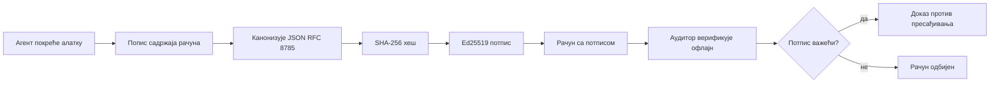

[Погледајте видео час: Осигуравање AI агената криптографским потврдама](https://youtu.be/PLACEHOLDER_VIDEO_ID)

> _(Видео час и сличица ће додати Microsoft тим за садржај након спајања, у складу са шемом часова 14 / 15.)_

# Осигуравање AI агената криптографским потврдама

## Увод

Овај час ће обухватити:

- Зашто су ревизиони записи за AI агенте важни за регулативу, дебаговање и поверење.
- Шта је криптографска потврда и како се разликује од непотписаног лог записа.
- Како произвести потписану потврду за позив алата агента у чистом Python-у.
- Како офлајн верификовати потврду и открити манипулацију.
- Како ланцати потврде тако да уклањање или променa редоследа једне потврде прекида ланац.
- Шта потврде доказују, а шта експлицитно не доказују.

## Циљеви учења

Након завршетка овог часа, знаћете како да:

- Идентификујете начине отказа који мотивишу криптографски доказ порекла за акције агента.
- Произведете Ed25519-потписану потврду над канонским JSON пуњењем.
- Независно верификујете потврду користећи само јавни кључ потписивача.
- Откријете манипулацију поновним покретањем верификације на измењеној потврди.
- Изградите низ потврда везаних хешем и објасните зашто је ланац важан.
- Препознате границу између онога што потврде доказују (атрибуција, интегритет, редослед) и онога што не доказују (тачност акције, исправност политике).

## Проблем: Ревизиони запис вашег агента

Замислите да сте развили AI агента за Contoso Travel. Агент чита захтеве корисника, позива API летова да провери опције и резервише карте у име корисника. Прошлог квартала агент је обрадио 50.000 резервација.

Данас долази ревизор. Поставља једноставно питање: "Покажите шта је ваш агент радио."

Предате му лог датотеке. Ревизор их прегледа и постави тежe питање: "Како знам да ти логови нису уређивани?"

Ово је проблем ревизијског записа. Већина данашњих примена агената ослања се на:

- **Апликацијске логове**: које пише сам агент, и које може уређивати било ко има приступ фајл систему.
- **Услуге облачног логовања**: које су отпорне на манипулацију на нивоу платформе, али само ако ревизор верује оператеру платформе.
- **Логове транзакција базе података**: погодне за промене у бази али не и за произвољне позиве алата.

Нико од ових не може одговорити на питање ревизора без да он мора некога да верује (вас, ваше провајдере облака, добављача базе података). За унутрашњу употребу, та поверења су често прихватљива. За регулисане радне задатке (финансије, здравство, све што подлеже ЕУ AI регулативи), нису.

Криптографске потврде решавају овај проблем тиме што сваку акцију агента чине независно проверљивом. Ревизор не мора вама да верује. Потребан му је само ваш јавни кључ и сама потврда.

## Шта је криптографска потврда?

Потврда је JSON објекат који бележи шта је агент урадио, потписан дигиталним потписом.


  
Минимална потврда изгледа овако:

```json
{
  "type": "agent.tool_call.v1",
  "agent_id": "contoso-travel-bot",
  "tool_name": "lookup_flights",
  "tool_args_hash": "sha256:a3f9c1...",
  "result_hash": "sha256:7b2e1d...",
  "policy_id": "contoso-travel-policy-v3",
  "timestamp": "2026-04-25T14:30:00Z",
  "sequence": 47,
  "previous_receipt_hash": "sha256:9d4e6a...",
  "signature": {
    "alg": "EdDSA",
    "sig": "c5af83...",
    "public_key": "8f3b2c..."
  }
}
```
  
Три својства изводе посао:

1. **Потпис**. Потврда је потписана од стране агентовог gateway-ја користећи Ed25519 приватни кључ. Сви који имају одговарајући јавни кључ могу верификовати потпис офлајн. Манипулација са било којим пољем поништава потпис.

2. **Канонско кодирање**. Пре потписивања, потврда се серијализује коришћењем JSON Canonicalization Scheme (JCS, RFC 8785). Ово осигурава да две имплементације које производе исти логички садржај произведу идентичан низ бајтова. Без канонске форме, различити JSON серијализатори би произвели различите потписе за исти садржај.

3. **Хеш ланац**. Поље `previous_receipt_hash` везује сваку потврду за претходну. Уклањање или мењање редоследа потврде прекида сваку потврду која следи. Манипулација постаје видљива на нивоу ланца чак и ако појединачни потписи буду заобилажени.

Заједно, ова својства пружају три гаранције:

- **Атрибуција**: овај кључ је потписао овај садржај.
- **Интегритет**: садржај није промењен од потписивања.
- **Редослед**: ова потврда је настала након оне претходне у ланцу.

## Произвођење потврде у Python-у

Не треба вам посебна библиотека да бисте произвели потврду. Криптографске примитиве су широко доступне, а логика је неколико десетина линија Python кода.

Практични примери у `code_samples/18-signed-receipts.ipynb` воде вас кроз цео ток. Сажети приказ:

```python
import json
import hashlib
import base64
from nacl import signing
from jcs import canonicalize  # RFC 8785 канонски JSON

def b64url_nopad(data: bytes) -> str:
    return base64.urlsafe_b64encode(data).decode("ascii").rstrip("=")

def sha256_canonical(obj) -> str:
    """SHA-256 of a Python object's JCS-canonical JSON form."""
    return f"sha256:{hashlib.sha256(canonicalize(obj)).hexdigest()}"

# Генериши или учитај кључ за потписивање (у продукцији, чувај у бункеру за кључеве)
signing_key = signing.SigningKey.generate()
verify_key = signing_key.verify_key

# Направи садржај потврде (још без потписа)
tool_args = {"origin": "SYD", "destination": "LAX"}
tool_result = [{"flight": "QF11", "price": 1850, "stops": 0}]

payload = {
    "type": "agent.tool_call.v1",
    "agent_id": "contoso-travel-bot",
    "tool_name": "lookup_flights",
    "tool_args_hash": sha256_canonical(tool_args),
    "result_hash": sha256_canonical(tool_result),
    "policy_id": "contoso-travel-policy-v3",
    "timestamp": "2026-04-25T14:30:00Z",
    "sequence": 0,
    "previous_receipt_hash": None,
}

# Канонизуј, хеширај, потпиши.
canonical_bytes = canonicalize(payload)
message_hash = hashlib.sha256(canonical_bytes).digest()
signature_bytes = signing_key.sign(message_hash).signature

# Приложи структурирани објекат потписа.
receipt = {
    **payload,
    "signature": {
        "alg": "EdDSA",
        "sig": b64url_nopad(signature_bytes),
        "public_key": b64url_nopad(bytes(verify_key)),
    },
}
```
  
Ово је цео процес потписивања. Вежбе у свесци корак по корак описују сваки корак.

## Верификација потврде и откривање манипулације

Верификација је обрнути процес:

```python
import base64
import hashlib
from nacl import signing
from nacl.exceptions import BadSignatureError
from jcs import canonicalize

def b64url_decode(s: str) -> bytes:
    padding = "=" * ((4 - len(s) % 4) % 4)
    return base64.urlsafe_b64decode(s + padding)

def verify_receipt(receipt: dict) -> bool:
    # Потпис је структурирани објекат: {"alg", "sig", "public_key"}.
    sig_obj = receipt.get("signature")
    if not sig_obj or sig_obj.get("alg") != "EdDSA":
        return False

    # Реконструишите податке који су заправо потписани (све осим потписа).
    payload = {k: v for k, v in receipt.items() if k != "signature"}

    canonical_bytes = canonicalize(payload)
    message_hash = hashlib.sha256(canonical_bytes).digest()

    try:
        verify_key = signing.VerifyKey(b64url_decode(sig_obj["public_key"]))
        verify_key.verify(message_hash, b64url_decode(sig_obj["sig"]))
        return True
    except BadSignatureError:
        return False
```
  
Ова функција узима потврду и враћа `True` ако је потпис валидан, иначе `False`. Без мрежних позива, без зависности од услуге, без потребе за поверењем у треће стране.

Да бисте видели откривање манипулације у пракси, свеска пролази следеће:

1. Произвођење валидне потврде и потврда да се може верификовати.
2. Измена једног бајта поља `tool_args_hash`.
3. Поновно покретање верификације и уочавање пада рада.

Ово је практичан показатељ да су потврде отпорне на манипулације: свака измена, и најмања, нарушава потпис.

## Ланчање потврда за агенте са више корака

Једна потписана потврда штити једну акцију. Ланац потврда штити низ акција.


  
Свака потврда бележи хеш претходне потврде. Да би нападач тихо уклонио другу потврду, морао би или да:

- Измени поље `previous_receipt_hash` код треће потврде (што руши потпис треће потврде), ИЛИ
- Фалсификује нови потпис на измењеној трећој потврди (што захтева приватни кључ агента).

Ако је приватни кључ усредсређен у хардверски сигурносни модул, а ви објављујете јавни кључ уз сваку потврду, ни један напад није изводљив без откривања.

Свеска показује:

1. Грађење ланца од три потврде.
2. Верификација да `previous_receipt_hash` сваке потврде одговара стварном хешу претходне.
3. Манипулација једном потврдом у средини и уочавање прекида ланца управо на том месту.

Тако производите ревизиони запис који спољни ревизор може потврдити без потребе да вам верује.

## Шта потврде доказују (и шта не доказују)

Ово је најважнији део овог часа. Потврде су моћне али је њихова моћ ограничена.

**Потврде доказују три ствари:**

1. **Атрибуција**: одређени кључ је потписао одређени садржај.
2. **Интегритет**: садржај није промењен од потписивања.
3. **Редослед**: ова потврда је дошла након те у хеш ланцу.

**Потврде НЕ доказују:**

1. **Тачност**: да је акција агента била исправна. Потврда може бити потписана и за погрешан одговор по истом принципу као и за исправан.
2. **Поштивање правила**: да је политика назначена у `policy_id` заиста процењена, или да би дозволила ову акцију ако би била проверена. Потврда бележи оно што је тврдило, а не оно што је спроведено.
3. **Идентификацију изван кључа**: потврда каже "овaj кључ је потписао овај садржај." Не каже "ова особа је одобрила ово." Повезивање кључа и особе или организације захтева посебну инфраструктуру идентитета (директоријум, регистар јавних кључева итд.).
4. **Истинитост улаза**: ако агент добије манипулисан упит и деловао је по њему, потврда верно бележи ту акцију. Потврде су каснији корак од валидације улаза, а не њена замена.

Ова граница је важна из два разлога:

- Она вам показује за шта су потврде корисне: да се понашање агента учини ревизионим и отпорним на манипулације, чак и преко организационих граница.
- Она вам показује које додатне слојеве још увек требате: валидацију улаза (Час 6), спровођење политика (крајем следећег поглавља), и инфраструктуру идентитета (ван домена овог часа).

Честа грешка је претпоставити да "имамо потврде" значи "занимамо се управљањем." Не значи. Потврде су основа. Упрaвљање је систем који се гради изнад њих.

## Референце за продукцију

Python код у овом часу је намерно минималан да бисте разумели сваки ред и тачно шта се дешава. У продукцији имате две опције:

1. **Градите директно на криптографским примитивима.** 50 линија кода видљивих горе је довољно за многе случајеве коришћења. PyNaCl (Ed25519) и `jcs` пакет (канонски JSON) су добро одржаване и ревидиране библиотеке.

2. **Користите продукцијску библиотеку за потврде.** Неколико open-source пројеката имплементира исти образац са додатним функцијама (ротација кључева, верификација пакета, дистрибуција JWK скупа, интеграција са политикама):
   - Формат потврда коришћен у овом часу прати Internet-Draft IETF-а (`draft-farley-acta-signed-receipts`) који је у процесу стандардизације.
   - Microsoft Agent Governance Toolkit комбинује потврде са одлукама политике базиране на Cedar-у; видети Туторијал 33 у том репозиторијуму за целокупан пример.
   - Пакети `protect-mcp` (npm) и `@veritasacta/verify` (npm) пружају Node.js имплементацију потписивања и офлајн верификације потврда за заштиту било ког MCP сервера ревизионим трајем.
   - **[nobulex](https://github.com/arian-gogani/nobulex)** Python SDK (`pip install nobulex`) пружа исти Ed25519 + JCS образац потписивања у Python-у са интеграцијом LangChain и CrewAI, укључујући објављене векторе за међусобну проверу и карту усаглашености доступну кроз [OWASP PR #2210](https://github.com/OWASP/CheatSheetSeries/pull/2210).

Одлука између самосталног прављења и коришћења библиотеке је као и код писања JWT библиотеке: обе су разумљиве; библиотека штеди време и смањује површину ревизије; приступ из почетка вас приморава да разумете сваки примитив. Овај час вас учи из почетка да стекнете чврсту основу за било који избор.

## Провера знања

Тестирајте своје разумевање пре него што пређете на практичне вежбе.

**1. Потврда је потписана агентским приватним Ed25519 кључем. Ревизор има само јавни кључ. Може ли ревизор офлајн верификовати потврду?**

<details>
<summary>Одговор</summary>

Може. Ed25519 верификација захтева само јавни кључ и потписане бајтове. Нема мрежних позива, нема зависности од услуге. Ово својство чини потврде корисним у ситуацијама са одвојеном мрежом, више организација, или са ниским степеном поверења.
</details>

**2. Нападач мења поље `policy_id` у потврди да би тврдио да је политика била попустљивија. Потпис је направљен над оригиналним садржајем. Шта се дешава при верификацији?**

<details>
<summary>Одговор</summary>

Верификација не успева. Потпис је рачунао над канонским бајтовима оригиналног садржаја; промена било ког поља мења канонске бајтове, што мења SHA-256 хеш, што чини потпис неважећим. Нападач би морао приватни кључ да произведе валидан потпис, што нема.
</details>

**3. Зашто потврда укључује `tool_args_hash` и `result_hash` уместо сурових аргумената и резултата?**

<details>
<summary>Одговор</summary>

Два разлога. Прво, потврда се можда чува или шаље у окружењима где цурење сировог садржаја (лични подаци, пословни подаци) представља проблем. Хеширање чува потврду малом и садржај приватним; ревизор верификује да хеш одговара посебно сачуваном копији стварног садржаја. Друго, хешеви су фиксне величине; потврда са хешевима има ограничену величину без обзира колико су улази и излази велики.
</details>

**4. Поље `previous_receipt_hash` везује потврду за претходну. Ако нападач тихо уклони једну потврду из средине ланца, шта постаје неважеће?**

<details>
<summary>Одговор</summary>

Свака потврда која је дошла након уклоњене. Њихова поља `previous_receipt_hash` више не одговарају стварном ланцу (јер потврда на коју се позива више не постоји, или ланац сада указује на другачијег претходника). Да би се прикрила ова измена, нападач би морао поново да потпише сваки каснији запис, што захтева приватни кључ.
</details>

**5. Потврда је успешно верификована. Да ли то доказује да је радња агента била исправна, ваљана и у складу са политиком?**

<details>
<summary>Одговор</summary>

Не. Валида потврда доказује три ствари: атрибуцију (овaj кључ је потписао овај садржај), интегритет (садржај није измењен) и редослед (ова потврда је након друге). Не доказује да је акција била исправна, да је политика у `policy_id` стварно процењена или да је агент пратило сва правила. Потврде чине понашање агента ревизионим, али не нужно исправним. Ово је најважнија граница часа.
</details>

## Практична вежба

Отворите `code_samples/18-signed-receipts.ipynb` и завршите сва четири одељка:

1. **Одељак 1**: Потпишите прву потврду и верификујте је.
2. **Одељак 2**: Манипулишите потврдом и приметите неуспех верификације.
3. **Одељак 3**: Изградите ланац од три потврде и проверите интегритет ланца.
4. **Одељак 4**: Примeните образац на агента изграђеног у Microsoft Agent Framework-у: обавите позив алата са потписивањем потврде, па онда верификујте потврду независно.
**Изазов за проширење 1:** проширите шему рачуна додатним пољем по вашем избору (на пример, ИД захтева за праћење), ажурирајте логику канонског потписивања да га укључује и потврдите да рачун и даље пролази кроз верификацију. Затим измените поље након потписивања и потврдите да верификација не успева. Ово вас приморава да разумете како сваки бајт канонског кодирања доприноси потпису.

**Изазов за проширење 2:** хеширајте два ваша рачуна заједно са SHA-256 (спојите њихове канонске бајтове у детерминистичком редоследу) и уградите резултујући дигест као ново поље у трећи рачун пре него што га потпишете. Потврдите да сва три рачуна и даље пролазе проверу. Управо сте направили једностепени доказ укључености: било ко ко има трећи рачун може доказати да су прва два постојала у време када је он потписан, без потребе да открива њихов садржај. Ово је образац који користе рачуни са селективним откривањем на великој скали (Меркле обавезе, RFC 6962).

## Закључак

Криптографски рачуни пружају AI агентима ревизијски траг који је:

- **Самостално проверљив:** свака страна која има јавни кључ може проверити, без зависности од сервиса.
- **Откривајуће манипулацију:** било каква измена неваже потпис.
- **Преносив:** рачун је мали JSON фајл; може се архивирати, пренети и проверити било где.
- **Усклађен са стандардима:** заснован на Ed25519 (RFC 8032), JCS (RFC 8785) и SHA-256, сви широко коришћени примитиви.

Они нису замена за валидацију улаза, примену политика или инфраструктуру идентитета. Они су основа за те слојеве. Када деплојујете агенте у регулатоване радне задатке, радне токове у више организација или било који сценарио у коме се не може претпоставити да вас будући ревизор верује, рачуни су начин да ревизијски траг буде поштено обезбеђен.

Најважнији закључак: рачуни доказују ко је шта рекао и када. Они не доказују да је оно што је речено тачно или исправно. Чврсто држите ту разлику. То је разлика између поштеног система порекла и обмањујућег.

## Контролна листа за продукцију

Када будете спремни да прелазите са ове лекције на деплојовање агената са потписаним рачунима у реалном окружењу:

- [ ] **Преместите кључ за потписивање са лаптопа програмера.** Користите Azure Key Vault, AWS KMS или хардверски безбедносни модул. Приватни кључ који потписује ваше рачуне никада не сме да постоји у систему контроле верзија или у нешифрованом облику на апликационим машинама.
- [ ] **Објавите јавни кључ за проверу.** Ревизори га треба да користе за офлајн проверу. Стандардан образац је JWK Сет на добро познатом URL-у (RFC 7517), нпр. `https://your-org.example.com/.well-known/agent-keys.json`.
- [ ] **Спољно учврстите ланац.** Периодично запишите хеш најновије главе ланца у лог транспарентности (Sigstore Rekor, RFC 3161 службеник за временске жигове или други интерни систем) како би спољна страна могла да потврди "овај ланац је постојао у овом тренутку."
- [ ] **Чувајте рачуне непроменљиво.** Складаштење са додавањем без бришућих операција (Azure Storage са политикама непроменљивости, AWS S3 Object Lock) спречава инсайдера да преиначи историју на нивоу складишта.
- [ ] **Одлучите о задржавању.** Многи прописи захтевају чување више година. Планирајте раст броја рачуна (сваки рачун је око 500 бајтова; агент који прави 10К позива дневно генерише око 1,8 ГБ годишње).
- [ ] **Документујте шта рачуни не покривају.** Рачуни доказују атрибуцију, интегритет и редослед. Ваш план рада треба да јасно наброји које додатне контроле (валидација улаза, примена политика, ограничења брзине, инфраструктура идентитета) допуњују рачуне у вашој управљачкој постави.

### Имате Још Питања о Безбедности AI Агената?

Придружите се [Microsoft Foundry Discord](https://aka.ms/ai-agents/discord) да се упознате са другим ученицима, учествујете у канцеларијским сатима и добијете одговоре на ваша питања о AI агентима.

## Даље од Ове Лекције

Ова лекција покрива потписивање по једном рачуну и хеширане ланце секвенци. Исти примитиви састављају се у неколико напредних образаца са којима ћете се сретати како ваша управљачка позиција сазрева:

- **Селективно откривање.** Када су поља у рачуну независно обавезана (Merkle стабло у стилу RFC 6962), можете открити одређена поља одређеним ревизорима и доказати да остала нису промењена без откривања њиховог садржаја. Корисно када исти рачун мора задовољити свеобухватну ревизију (која захтева потпуност) и регулативе за минимизацију података као GDPR (које захтевају да ревизор види што мање).
- **Поништење рачуна.** Ако је кључ за потписивање компромитован, потребан вам је начин да обележите све рачуне потписане тим кључем као непоуздане од одређеног тренутка. Стандардни облици: краткотрајни кључеви са објављеном листом поништења или лог транспарентности са уписима о поништењу.
- **Билатерални/раздељени потписни рачуни.** Неке имплементације деле потписани садржај на пре-извршне (`authorization_*`) и после-извршне (`result_*`) делове са независним потписима, корисно када одлуку о овлашћењу и посматрани резултат доносе различити актери или у различито време. Ово се додатно надограђује на формат рачуна представљен у овој лекцији.
- **Композиција садржаја.** Рачун запечаћује било које бајтове које ставите у `result_hash`. Реални садржаји често су богатији од једног резултата позива алата: логика пре одлуке (предвиђање модела, разматране опције, докази и њихова потпунања, ризична позиција, ланац одговорности, исход контроле) може се све налазити унутар садржаја, запечаћеног јединим рачуном. Ово држи формат рачуна минималним, омогућавајући истовремено еволуцију шема садржаја по доменима.
- **Усклађеност између имплементација.** Више независних имплементација истог формата рачуна (Python, TypeScript, Rust, Go) врши међусобну проверу на заједничким тест векторима. Ако направите своју имплементацију, валидација на објављеним векторима потврђује компатибилност.
- **Миграција након-квантне ере.** Ed25519 је данас широко коришћен али није квантно-отпоран. Формат рачуна је алгоритамски агилан: поље `signature.alg` може носити `ML-DSA-65` (постквантни стандард НИСТ-а) када је потребно мигрирати. Планирајте прелазни период где су рачуни двоструко потписани.

## Додатни Ресурси

- <a href="https://datatracker.ietf.org/doc/draft-farley-acta-signed-receipts/" target="_blank">IETF Internet-Draft: Signed Decision Receipts for Machine-to-Machine Access Control</a>
- <a href="https://learn.microsoft.com/azure/ai-studio/responsible-use-of-ai-overview" target="_blank">Преглед одговорне употребе AI (Azure AI)</a>
- <a href="https://datatracker.ietf.org/doc/html/rfc8032" target="_blank">RFC 8032: Edwards-Curve Digital Signature Algorithm (EdDSA)</a>
- <a href="https://datatracker.ietf.org/doc/html/rfc8785" target="_blank">RFC 8785: JSON Canonicalization Scheme (JCS)</a>
- <a href="https://datatracker.ietf.org/doc/html/rfc6962" target="_blank">RFC 6962: Certificate Transparency</a> (Merkle стабло коришћено код рачуна са селективним откривањем)
- <a href="https://github.com/microsoft/agent-governance-toolkit/blob/main/docs/tutorials/33-offline-verifiable-receipts.md" target="_blank">Microsoft Agent Governance Toolkit, Tutorial 33: Offline-Verifiable Decision Receipts</a>
- <a href="https://github.com/ScopeBlind/agent-governance-testvectors" target="_blank">Тест вектори за проверу усклађености између имплементација</a> за формат рачуна коришћен у овој лекцији (Apache-2.0)
- <a href="https://pynacl.readthedocs.io/" target="_blank">PyNaCl документација</a> (Ed25519 у Python-у)

## Претходна Лекција

[Изградња агената за коришћење рачунара (CUA)](../15-browser-use/README.md)

## Следећа Лекција

_(Одређују одржавачи курикулума)_

---

<!-- CO-OP TRANSLATOR DISCLAIMER START -->
**Изјава о одрицању одговорности**:
Овај документ је преведен коришћењем услуге за аутоматски превод [Co-op Translator](https://github.com/Azure/co-op-translator). Иако тежимо тачности, имајте у виду да аутоматски преводи могу садржати грешке или нетачности. Оригинални документ на његовом изворном језику треба сматрати ауторитативним извором. За критичне информације препоручује се професионални људски превод. Нисмо одговорни за било каква неспоразума или погрешна тумачења која произилазе из коришћења овог превода.
<!-- CO-OP TRANSLATOR DISCLAIMER END -->