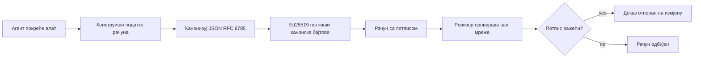
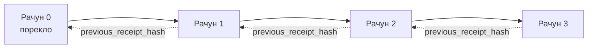

[Погледајте видео лекцију: Осигуравање AI агената помоћу криптографских потврда](https://youtu.be/PLACEHOLDER_VIDEO_ID)

> _(Видео лекција и сличица биће додати од стране Microsoft тима за садржај након спајања, у складу са обрасцем лекција 14 / 15.)_

# Осигуравање AI агената помоћу криптографских потврда

## Увод

Ова лекција ће обухватити:

- Зашто су ревизионе траке за AI агенте важне за усаглашеност, исправљање грешака и поверење.
- Шта је криптографска потврда и како се разликује од непотписане линије дневника.
- Како произвести потписану потврду за позив алата агента у обичном Python-у.
- Како проверити потврду ван мреже и детектовати измену.
- Како повезати потврде тако да уклањање или преуређивање једне прекида ланац.
- Шта потврде доказују, а шта експлицитно не доказују.

## Циљеви учења

По завршетку ове лекције ћете знати како да:

- Идентификујете начине неуспеха који подстичу криптографски доказ порекла за акције агента.
- Произведете потврду потписану Ed25519 преко канонског JSON оптерећења.
- Проверите потврду независно користећи само јавни кључ потписивача.
- Детектујете измену поновним извршавањем провере на измењеној потврди.
- Изградите секвенцу потврда повезаних хешом и објасните зашто је ланац важан.
- Препознате границу између онога што потврде доказују (атрибуција, интегритет, редослед) и онога што не доказују (исправност акције, звучност политике).

## Проблем: Ревизија Вашег Агентa

Замислите да сте поставили AI агента за Contoso Travel. Агент чита захтеве корисника, позива API за летове да прегледа опције и резервише седишта у име корисника. Прошлог квартала агент је обрадио 50.000 резервација.

Данас долази ревизор. Поставља једноставно питање: „Покаžite ми шта је ваш агент радио.“

Ви му предајете датотеке дневника. Ревизор их прегледа и поставља тежје питање: „Како знам да ти дневници нису изменјени?“

Ово је проблем ревизије. Већина данашњих агената се ослања на:

- **Дневнике апликације**: које пише сам агент, а може им се приступити једко свако ко има приступ фајл систему.
- **Услуге облачног логовања**: отворене за доказ о измени на нивоу платформе али само ако ревизор има поверење у оператора те платформе.
- **Дневнике трансакција базе података**: погодне за промене у бази али не за произвољне позиве алата.

Нити један од ових не може одговорити на питање ревизора без да ревизор мора да има поверење у некога (вас, вашег провајдера облака, добављача базе). За унутрашњу употребу, то поверење је често прихватљиво. За регулисане послове (финансије, здравство, све што пада под EU AI Act) није.

Криптографске потврде решавају овај проблем чинећи да свака акција агента буде независно проверљива. Ревизор не мора да вам верује. Потребан му је само ваш јавни кључ и сама потврда.

## Шта је Криптографска Потврда?

Потврда је JSON објекат који бележи шта је агент урадио, потписан дигиталним потписом.


```mermaid
flowchart LR
    A[Агент покреће алат] --> B[Конструиши податке рачуна]
    B --> C[Канонизуј JSON RFC 8785]
    C --> E[Ed25519 потпиши канонске бајтове]
    E --> F[Рачун са потписом]
    F --> G[Ревизор проверава ван мреже]
    G --> H{Потпис важећи?}
    H -- yes --> I[Доказ отпоран на измјену]
    H -- no --> J[Рачун одбијен]
```

Минимална потврда изгледа овако:

```json
{
  "type": "agent.tool_call.v1",
  "agent_id": "contoso-travel-bot",
  "tool_name": "lookup_flights",
  "tool_args_hash": "sha256:a3f9c1...",
  "result_hash": "sha256:7b2e1d...",
  "policy_id": "contoso-travel-policy-v3",
  "timestamp": "2026-04-25T14:30:00Z",
  "sequence": 47,
  "previous_receipt_hash": "sha256:9d4e6a...",
  "signature": {
    "alg": "EdDSA",
    "sig": "c5af83...",
    "public_key": "8f3b2c..."
  }
}
```

Три особине обављају посао:

1. **Потпис**. Потврду потписује агентски гатеwаy користећи Ed25519 приватни кључ. Сви са одговарајућим јавним кључем могу проверити потпис ван мреже. Свако мењање поља чини потпис неважећим.

2. **Канонско кодирање**. Пре потписивања, потврда се серијализује користећи JSON Канонску Шему (JCS, RFC 8785). Ово осигурава да две имплементације које произведу исту логичку потврду дају бајт идентичан излаз. Без канонизације различити JSON серијализатори би дали различите потписе за исти садржај.

3. **Повезивање хешом**. Поље `previous_receipt_hash` повезује сваку потврду са претходном. Уклањање или преуређивање потврде прекида све потврде које долазе након ње. Измена постаје видљива на нивоу ланца чак и ако се индивидуални потписи игноришу.

Заједно, ове особине пружају три гаранције:

- **Атрибуција**: овај кључ је потписао овај садржај.
- **Интегритет**: садржај није промењен од када је потписан.
- **Редослед**: ова потврда је настала након оне у ланцу.

## Произвођење Потврде у Python-у

Не треба вам посебна библиотека да направите потврду. Криптографске примитиве су широко доступне, а логика је неколико десетина линија Python кода.

Практичне вежбе у `code_samples/18-signed-receipts.ipynb` воде кроз цео процес. Сажетак:

```python
import json
import hashlib
import base64
from nacl import signing
from jcs import canonicalize  # RFC 8785 књижевни JSON

def b64url_nopad(data: bytes) -> str:
    return base64.urlsafe_b64encode(data).decode("ascii").rstrip("=")

def sha256_canonical(obj) -> str:
    """SHA-256 of a Python object's JCS-canonical JSON form."""
    return f"sha256:{hashlib.sha256(canonicalize(obj)).hexdigest()}"

# Генеришите или учитајте кључ за потписивање (у продукцији, чувајте у сигурном складишту кључева)
signing_key = signing.SigningKey.generate()
verify_key = signing_key.verify_key

# Изградите садржај рачуна (још без потписа)
tool_args = {"origin": "SYD", "destination": "LAX"}
tool_result = [{"flight": "QF11", "price": 1850, "stops": 0}]

payload = {
    "type": "agent.tool_call.v1",
    "agent_id": "contoso-travel-bot",
    "tool_name": "lookup_flights",
    "tool_args_hash": sha256_canonical(tool_args),
    "result_hash": sha256_canonical(tool_result),
    "policy_id": "contoso-travel-policy-v3",
    "timestamp": "2026-04-25T14:30:00Z",
    "sequence": 0,
    "previous_receipt_hash": None,
}

# Књижевно форматирајте и директно потпишите JCS бајтове. PureEdDSA интерно хешира.
canonical_bytes = canonicalize(payload)
signature_bytes = signing_key.sign(canonical_bytes).signature

# Прикључите структуриран објекат потписа.
receipt = {
    **payload,
    "signature": {
        "alg": "EdDSA",
        "sig": b64url_nopad(signature_bytes),
        "public_key": b64url_nopad(bytes(verify_key)),
    },
}
```

То је цео потписивачки процес. Вежбе у бележници детаљно описују сваки корак.

## Провера Потврде и Детекција Измена

Провера је обрнута операција:

```python
import base64
import hashlib
from nacl import signing
from nacl.exceptions import BadSignatureError
from jcs import canonicalize

def b64url_decode(s: str) -> bytes:
    padding = "=" * ((4 - len(s) % 4) % 4)
    return base64.urlsafe_b64decode(s + padding)

def verify_receipt(receipt: dict) -> bool:
    # Потпис је структуирани објекат: {"alg", "sig", "public_key"}.
    sig_obj = receipt.get("signature")
    if not sig_obj or sig_obj.get("alg") != "EdDSA":
        return False

    # Реконструишите садржај који је заправо потписан (све осим потписа).
    payload = {k: v for k, v in receipt.items() if k != "signature"}

    canonical_bytes = canonicalize(payload)

    try:
        verify_key = signing.VerifyKey(b64url_decode(sig_obj["public_key"]))
        verify_key.verify(canonical_bytes, b64url_decode(sig_obj["sig"]))
        return True
    except BadSignatureError:
        return False
```

Ова функција узима потврду и враћа `True` ако је потпис важећи, `False` у супротном. Није потребан позив на мрежу, ни зависност од услуге, ни поверење у треће лице.

Да бисте видели детекцију измена у пракси, бележница води кроз:

1. Произвођење важеће потврде и потврђује да се провера успешно извршава.
2. Модификацију једног бајта у пољу `tool_args_hash`.
3. Поновну проверу која сада одбија потврду.

Ово је практична демонстрација да су потврде доказ о измени: свака измена, ма колико мала, разбија потпис.

## Повезивање Потврда за Мулти-степене Агенте

Једна потписана потврда штити једну акцију. Ланац потврда штити секвенцу акција.


```mermaid
flowchart LR
    R0[Рачун 0<br/>порекло] --> R1[Рачун 1]
    R1 --> R2[Рачун 2]
    R2 --> R3[Рачун 3]
    R1 -. previous_receipt_hash .-> R0
    R2 -. previous_receipt_hash .-> R1
    R3 -. previous_receipt_hash .-> R2
```

Свака потврда бележи хеш претходне потврде. Да би нападач нечујно уклонио потврду 2, морао би или:

- Изменити поље `previous_receipt_hash` у потврди 3 (што прекида потпис потврде 3), ИЛИ
- Фалсификовати нови потпис на измењеној потврди 3 (што захтева приватни кључ агента).

Ако је приватни кључ у хардверском трезору кључева, а ви објавите јавни кључ уз сваку потврду, ниједан напад није могућ без откривања.

Бележница води кроз:

1. Изградњу ланца од три потврде.
2. Проверу да поље `previous_receipt_hash` сваке потврде одговара стварном хешу претходне потврде.
3. Измену једне потврде у средини и посматрање како ланац пуца баш на том месту.

Ово је начин да произведете ревизиону траку коју спољни ревизор може проверити без поверења у вас.

## Шта Потврде Доказују (и Шта Не Доказују)

Ово је најважнији део ове лекције. Потврде су моћне, али њихова моћ је ограничена.

**Потврде доказују три ствари:**

1. **Атрибуцију**: одређени кључ је потписао одређени садржај.
2. **Интегритет**: садржај није промењен од када је потписан.
3. **Редослед**: ова потврда долази након оне у ланцу хешева.

**Потврде НЕ доказују:**

1. **Исправност**: да је агенцки чин био прави чин. Потврда се може потписати за погрешан одговор подједнако лако као и за прави.
2. **Усклађеност са политиком**: да је политика коју означава `policy_id` заиста оцењена, или да би дозволила ову акцију ако би била проверена. Потврда бележи шта је тврђено, а не шта је спроведено.
3. **Идентификацију изван кључа**: потврда каже „ову потписао овај кључ.“ Не каже „овог човека је овластило.“ Повезивање кључа са особом или организацијом захтева посебну инфраструктуру идентитета (директоријум, регистар јавних кључева итд.).
4. **Истинитост уноса**: ако агент прими манипулисан упит и ради по њему, потврда верно бележи акцију. Потврде су улазни слој након валидације уноса, а не њена замена.

Ова граница је важна из два разлога:

- Показује вам за шта су потврде корисне: чине понашање агента ревизионом и доказом о измени, чак и преко организационих граница.
- Показује вам које додатне слојеве још треба: валидацију улаза (Лекција 6), спровођење политике (помиње се у наставку) и инфраструктуру идентитета (ван ове лекције).

Уобичајена грешка је претпоставка да „имамо потврде“ значи „управљамо.“ Не значи. Потврде су основа. Управљање је систем који градите на тој основи.

## Доказивање да је Човек Одобрио Тачну Акцију

Тачка 3 горе заслужује свој одељак: потврда акције каже „ово је потписао овај кључ,“ а никад „човек је овластило ово.“ За акције високог ризика (повраћај средстава, брисања, трансфери новца), оквири управљања све више захтевају управо ту изостављену изјаву, а она се може произвести истим примитивима које сте већ направили у овој лекцији.

Праћејћи „human-authorization-receipts.ipynb“ додаје други тип потврде, `human.approval.v1`, у истом облику коверте као и потврде из ове лекције (типизирани садржај потписан Ed25519 преко канонских JCS бајтова, са објектом `signature` ван потписаних бајтова). Именовани одобрилац потписује **целу канонску акцију и њен сажетак** пред извршење; потврда агента носи **исти сажетак акције** и `parent_approval_ref`, хеш потврде одобрења, исту конвенцију као `previous_receipt_hash` у ланцу који сте направили изнад. Један `verify_chain` проверава оба артефакта под **посебним фиксним регистрима кључева** (кључеви одобрилаца против кључева агента), тако да је код пут дељен али ауторитети никад.

Особина која се стиче, пажљиво формулисана: *човек је одобрио ову тачну акцију, а агент је извршио управо ту одобрену акцију.* Конкретно одбијање у бележници чини ову особину стварном, а не само тврдњом:

- класични скуп: измена, збуњени заменику, реплај, лажни кључеви на обе стране, неважећи унос;
- **застарели ауторитет**: потпис који још проверава али је одбијен зато што је верзија политике промењена, кључ одобриоца избрисан из фиксног регистра или је одобрење истекло пре извршења;
- **замена сажетка**: важеће потписана потврда акције која указује на *право* одобрење које веже *другу* канонску акцију.

Сваки неуспех одбија са другачијим разлогом, тако да ревизор може препознати да ли је ауторитет застарео или се извршена акција променила. Правило које бележница учи: потписано одобрење само по себи није ауторитет. Ауторитет постоји само ако обе потврде и даље везују за исту канонску акцију у тренутку извршења. Потврда о људском одобрењу је образовна композиција коју дефинише ова лекција, а не тип потврде дефинисан у `draft-farley-acta-signed-receipts`.

## Референце за Производњу

Python код у овој лекцији је намерно минималан да бисте могли прочитати сваки ред и тачно разумети шта се дешава. У производњи имате две опције:

1. **Градите директно на криптографским примитивима.** 50 линија које сте видели горе је довољно за многе случајеве употребе. PyNaCl (Ed25519) и пакет `jcs` (канонски JSON) су добро одржаване и ревидиране библиотеке.

2. **Користите производну библиотеку за потврде.** Неколико open-source пројеката имплементира исти образац са додатним карактеристикама (ротација кључева, серијска провера, JWK сет дистрибуција, интеграција са моторима политика):
   - Потписивачки процес користи JCS и конвенције за домен потписа из независног IETF Internet-Draft-а ([`draft-farley-acta-signed-receipts`](https://datatracker.ietf.org/doc/draft-farley-acta-signed-receipts/), ревизија 02). Едукативна потврда из ове лекције разликује се од нацрта у `{payload, signature}` коверти и није представљена као конформна имплементација. Нацрт објављује заједнички скуп тестова ([agent-governance-testvectors](https://github.com/ScopeBlind/agent-governance-testvectors)) за имплементације које циљају његов формат.
   - Microsoft Agent Governance Toolkit комбинује потврде са одлукама на бази Cedar политике; погледајте Туторијал 33 у том репозиторијуму за пример од почетка до краја.
   - Пакети `protect-mcp` (npm) и `@veritasacta/verify` (npm) пружају Node.js имплементацију потписивања потврда и офлајн провере, намењену да омотa било који MCP сервер са ревизионом траком отпорном на промене, укључујући ток задржања за ко-потпис у којем паузирана акција емитује потврду одобрења везану за сажетак акције (WebAuthn подржан у десктоп току), исти модел потврде одобрења као у бележници о људском овлашћењу изнад.
   - **[nobulex](https://github.com/arian-gogani/nobulex)** Python SDK (`pip install nobulex`) пружа исти Ed25519 + JCS образац потписа у Python-у са интеграцијом LangChain и CrewAI, укључујући објављене тест векторе и мапирање захтева преко [OWASP PR #2210](https://github.com/OWASP/CheatSheetSeries/pull/2210).

Одлука између прављења сопствене имплементације и коришћења библиотеке огледа се у одлуци о томе да ли ћете писати своју JWT библиотеку или користити проверену: обе опције су разумне; библиотека штеди време и смањује површину ревизије; приступ од нуле вас принуђује да разумете сваки примитив. Ова лекција вас учи приступу од нуле да имате темељ за оба избора.

## Провера Знања

Тестирајте своје разумевање пре него што пређете на практичну вежбу.

**1. Потврда је потписана приватним Ed25519 кључем агента. Ревизор има само јавни кључ. Може ли ревизор да провери потврду ван мреже?**

<details>
<summary>Одговор</summary>

Да. Ed25519 провера захтева само јавни кључ и потписане бајтове. Нема позива на мрежу, нема зависности од сервиса. Ово је својство које чини потврде корисним у ситуацијама са прекидом везе, мулти-организационим окружењима или окружењима са ниским поверењем.
</details>

**2. Нападач измењује поље `policy_id` у потврди да тврди да ју је управљала попустљивија политика. Потпис је дат преко оригиналног оптерећења. Шта се дешава током провере?**

<details>
<summary>Одговор</summary>


Верификација није успела. Потпис је израчунат преко канонских бајтова оригиналног пуњена; модификовање било ког поља мења те бајтове, што чини потпис неважећим. Нападач би морао да има приватни кључ да би произвео свеже важећи потпис, што он нема.
</details>

**3. Зашто рачун укључује `tool_args_hash` и `result_hash` уместо директних аргумената и резултата?**

<details>
<summary>Одговор</summary>

Два разлога. Прво, рачун може бити архивиран или преношен у окружењима где цурење сировог садржаја (ПИО, пословни подаци) представља проблем. Хешање одржава рачун малим и садржај приватним; ревизор проверава да ли хеш одговара посебно сачуваној копији стварног садржаја. Друго, хешеви имају фиксну величину; рачун са хешевима има ограничену величину без обзира колико су улази и излази били велики.
</details>

**4. Поље `previous_receipt_hash` повезује сваки рачун са својим претходником. Ако нападач тихо обрише један рачун из средине ланца, шта постаје неважеће?**

<details>
<summary>Одговор</summary>

Сваки рачун који долази после избрисаног. Њихова поља `previous_receipt_hash` више не одговарају стварном ланцу (зато што рачун на који су упућивали више не постоји, или ланац сада показује на другачији претходник). Да би прикрио брисање, нападач би морао поново да потпише сваки каснији рачун што захтева приватни кључ.
</details>

**5. Рачун се успешно верификује. Да ли то доказује да је агентова акција била исправна, исправна или у складу са политиком?**

<details>
<summary>Одговор</summary>

Не. Важећи рачун доказује три ствари: атрибуцију (овим кључем је потписан овај садржај), интегритет (садржај није промењен) и редослед (тај рачун је уследио после другог). Не доказује да је акција била исправна, да је политика наведена у `policy_id` заиста процењена, или да је агент поштовао сва правило. Рачуни чине агента ревизибилним, али не нужно исправним. Ово је најважнија граница у лекцији.
</details>

## Практична вежба

Отворите `code_samples/18-signed-receipts.ipynb` и урадите све четири секције:

1. **Секција 1**: Потпишите први рачун и верификујте га.
2. **Секција 2**: Манипулишите рачуном и посматрајте како верификација пропада.
3. **Секција 3**: Направите ланац од три рачуна и проверите интегритет ланца.
4. **Секција 4**: Применијте овај образац на агента изграђеног уз Microsoft Agent Framework: омотајте позив алата уз потписивање рачуна, а затим верификујте рачун независно.

**Допунски изазов 1:** проширите схему рачуна додатним пољем по вашем избору (на пример, ID захтева за праћење), ажурирајте логику канонског потписивања да га укључује и потврдите да рачун и даље пролази верификацију. Затим измените поље након потписивања и проверите да верификација није успела. Ово вас приморава да разумете како сваки бајт канонског кодирања доприноси потпису.

**Допунски изазов 2:** Хеширајте SHA-256 два рачуна заједно (конкатенишите њихове канонске бајтове у детерминистичком реду) и уградите добијени дигест као ново поље трећем рачуну пре потписивања. Проверавајте да сва три рачуна и даље пролазе круг верификације. Управо сте направили доказ укључивања у једном кораку: било ко држи трећи рачун може доказати да су прва два постојала у време потписивања, без потребе да открива њихов садржај. Ово је образац који рачуни са селективним откривањем користе у великом обиму (Merkle обавезе, RFC 6962).

## Закључак

Криптографски рачуни дају AI агентима ревизијски траг који је:

- **Независно верификативан**: свака страна са јавним кључем може верификовати, без зависности од сервиса.
- **Јасан у случају манипулације**: свака измена чини потпис неважећим.
- **Преносив**: рачун је мали JSON фајл; може се архивирати, преносити и верификовати било где.
- **У складу са стандардима**: заснован на Ed25519 (RFC 8032), JCS (RFC 8785), и SHA-256, сви широко коришћени примитиви.

Није замена за проверу уноса, спровођење политика или инфраструктуру идентитета. Она су основа за те слојеве. Када уводите агенте у регулисане радне задатке, радне токове са више организација или било које окружење у којем се не може претпоставити да ће вам будући ревизор веровати, рачуни су оно што чини ревизијски траг поштено.

Најважнија поука: рачуни доказују ко је шта рекао и када. Они не доказују да је оно што је речено било истина или исправно. Чврсто запамтите ту разлику. Она је разлика између искреног система порекла и обмањујућег.

## Контрола за производњу

Када будете спремни да пређете са ове лекције на распоређивање агената са потписаним рачунима у стварном окружењу:

- [ ] **Преместите кључ за потписивање ван лаптопа програмера.** Користите Azure Key Vault, AWS KMS или хардверски безбедносни модул. Приватни кључ који потписује ваше рачуне не сме никада бити у изворном коду или у чистом тексту на апликационим машинама.
- [ ] **Објавите јавни кључ за верификацију.** Ревизори га требају да би проверили офлајн. Стандардни образац је JWK Set на добро познатом URL-у (RFC 7517), нпр. `https://your-org.example.com/.well-known/agent-keys.json`.
- [ ] **Спољно закачите ланац.** Периодично упишите хеш последњег члана ланца у транспарентни лог (Sigstore Rekor, RFC 3161 тиместамп ауторити или други интерни систем) тако да спољна страна може потврдити „овај ланац је постојао у овом тренутку.“
- [ ] **Чувајте рачуне непромењиво.** Стореџ који се само дописује (Azure Storage са политикама непромењивости, AWS S3 Object Lock) спречава инсайдера да препише историју на нивоу складишта.
- [ ] **Одредите рок чувања.** Многи комплајенс режими захтевају више година чувања. Планирајте раст рачуна (сваки рачун је ~500 бајтова; агент који прави 10К позива дневно произведе ~1.8 ГБ годишње).
- [ ] **Документирајте шта рачуни не покривају.** Рачуни доказују атрибуцију, интегритет и редослед. Ваш приручник треба јасно да наведе која додатна контролна мерила (провера уноса, спровођење политика, ограничење брзине, инфраструктура идентитета) стоје уз рачуне у вашем моделу управљања.

### Имате више питања о обезбеђивању AI агената?

Придружите се [Microsoft Foundry Discord](https://aka.ms/ai-agents/discord) да упознате друге ученике, присуствујете канцеларијским сатима и добијете одговоре на питања о AI агентима.

## Изван ове лекције

Ова лекција покрива потпис једног рачуна и секвенце везаних хешева. Исти примитиви састављају се у неколико напреднијих образаца на које можете наићи како ваш модел управљања сазрева:

- **Селективно откривање.** Када су поља рачуна независно посвећена (Merkle стабло по RFC 6962), можете открити одређена поља одређеним ревизорима и доказати да остала нису промењена без излагања. Корисно када исти рачун мора да задовољи и свеобухватну ревизију (која захтева потпуност) и прописе о минимизацији података као ГДПР (који захтевају да ревизор види што мање).
- **Опозив рачуна.** Ако је кључ за потписивање компромитован, морате имати начин да означите све рачуне потписане тим кључем као непоуздане од одређеног времена. Стандардни образци: краткотрајни кључеви за потписивање плус објављена листа опозива, или транспарентни лог са уносима опозива.
- **Билатерални / раскинути-тaјни рачуни.** Неки имплементације раздвајају потписано пуњење на пре-извршне („authorization_*“) и пост-извршне („result_*“) делове са независним потписима, корисно када су одлука о овлашћењу и посматрани резултат произведени од стране различитих актера или у различито време. Ово се адитивно саставља на формат рачуна из ове лекције.
- **Састав пуњења.** Рачун запечаћује сваки бајт који ставите у `result_hash`. Стварни резултати често су богатији од једног резултата позива алата: пре-одлука разматрања (предвиђање модела, разматране опције, доказ и његова потпуна сна, ризични оквир, ланац одговорности, исход контроле) могу сви живети унутар пуњења, запечаћени једним рачуном. Ово одржава минималан формат рачуна док дозволјава еволуцију шема домен по домен.
- **Усклађеност између имплементација.** Више независних имплементација истог формата рачуна (Python, TypeScript, Rust, Go) међусобно верификују преко заједничких тест вектора. Ако направите своју имплементацију, провера према објављеним векторима потврђује компатибилност.
- **Пост-квантна миграција.** Ed25519 је данас широко употребљаван али није отпоран на квантне нападе. Формат рачуна је алгоритамски флексибилан: поље `signature.alg` може носити `ML-DSA-65` (NIST пост-квантни стандард потписа) када буде потребно мигрирати. Планирајте период транзиције у којем ће рачуни бити двоструко потписани.

## Додатни ресурси

- <a href="https://datatracker.ietf.org/doc/draft-farley-acta-signed-receipts/" target="_blank">IETF Internet-Draft: Signed Decision Receipts for Machine-to-Machine Access Control</a>
- <a href="https://learn.microsoft.com/azure/ai-studio/responsible-use-of-ai-overview" target="_blank">Одговорна употреба AI (Azure AI)</a>
- <a href="https://datatracker.ietf.org/doc/html/rfc8032" target="_blank">RFC 8032: Digital Signature Algorithm са Ed25519 кривама (EdDSA)</a>
- <a href="https://datatracker.ietf.org/doc/html/rfc8785" target="_blank">RFC 8785: JSON Канонски Шематизам (JCS)</a>
- <a href="https://datatracker.ietf.org/doc/html/rfc6962" target="_blank">RFC 6962: Сертификатна транспарентност</a> (Merkle стабло које користе рачуни за селективно откривање)
- <a href="https://github.com/microsoft/agent-governance-toolkit/blob/main/docs/tutorials/33-offline-verifiable-receipts.md" target="_blank">Microsoft Agent Governance Toolkit, Туторијал 33: Offline-Verifiable Decision Receipts</a>
- <a href="https://github.com/ScopeBlind/agent-governance-testvectors" target="_blank">Тест вектори усклађености између имплементација</a> за формат рачуна коришћен у овој лекцији (Apache-2.0)
- <a href="https://pynacl.readthedocs.io/" target="_blank">PyNaCl документација</a> (Ed25519 у Python-у)

## Претходна лекција

[Креирање локалних AI агената](../17-creating-local-ai-agents/README.md)

---

<!-- CO-OP TRANSLATOR DISCLAIMER START -->
**Изјава о одрицању одговорности**:
Овај документ је преведен коришћењем услуге за аутоматски превод [Co-op Translator](https://github.com/Azure/co-op-translator). Иако тежимо тачности, имајте у виду да аутоматски преводи могу садржати грешке или нетачности. Оригинални документ на његовом изворном језику треба сматрати ауторитативним извором. За критичне информације препоручује се професионални људски превод. Нисмо одговорни за било каква неспоразума или погрешна тумачења која произилазе из коришћења овог превода.
<!-- CO-OP TRANSLATOR DISCLAIMER END -->