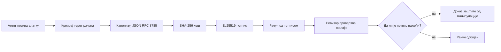
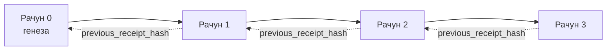

[Погледајте видео лекцију: Осигуравање AI агената криптографским потврдама](https://youtu.be/PLACEHOLDER_VIDEO_ID)

> _(Видео и сличица лекције биће додати од стране Microsoft тима за садржај након спајања, пратећи образац лекције 14 / 15.)_

# Осигуравање AI агената криптографским потврдама

## Увод

Ова лекција ће обухватити:

- Зашто су ревизијски трагови за AI агенте важни за usklađenost, дебаговање и поверење.
- Шта је криптографска потврда и како се разликује од непотписаног записа.
- Како произвести потписану потврду за позив алата агента у чистом Python-у.
- Како проверити потврду ван мреже и открити измене.
- Како ланцирати потврде тако да уклањање или прераспоређивање једне прекида ланац.
- Шта потврде доказују а шта јасно не доказују.

## Циљеви учења

Након завршетка ове лекције, знаћете како да:

- Препознате начине отказа који мотивишу криптографску афирмацију за акције агената.
- Произведете Ed25519 потписану потврду преко канонског JSON payload-а.
- Проверите потврду независно само уз јавни кључ потписника.
- Откријете измене поновним покретањем верификације на измењеној потврди.
- Изградите низ потврда везиваних хешем и објасните зашто је ланац важан.
- Препознате границу између онога што потврде доказују (атрибуција, интегритет, редослед) и онога што не доказују (тачност акције, исправност политике).

## Проблем: Ревизијски траг вашег агента

Замислите да сте распоредили AI агента за Contoso Travel. Агент чита захтеве корисника, позива API за летове да пронађе опције и резервише места у име корисника. Прошлог квартала агент је обрадио 50.000 резервација.

Данас долази ревизор. Поставља једноставно питање: "Покажите шта је ваш агент радио."

Дате сте му своје лог датотеке. Ревизор их прегледа и поставља тежа питања: "Одакле да знам да ти записи нису измењени?"

Ово је проблем ревизијског трага. Већина агената данас се ослања на:

- **Апликационе логове**: које пише сам агент, а могу их изменити сви са приступом систему фајлова.
- **Услуге облачног логовања**: доказују измене на нивоу платформе, али само ако ревизор верује оператеру платформе.
- **Логове трансакција базе података**: погодни за промене базе али не и за произвољне позиве алата.

Ниједан од ових не може одговорити на питање ревизора без да му ревизор мора веровати (вама, вашем облачном провајдеру, добављачу базе). За интерну употребу, ово веровање је често прихватљиво. За регулисане процесе (финансије, здравство, све под EU AI актом) није.

Криптографске потврде решавају овај проблем тако што свака акција агента може бити независно верификована. Ревизору није потребно да вам верује. Потребан му је само ваш јавни кључ и сама потврда.

## Шта је криптографска потврда?

Потврда је JSON објекат који бележи шта је агент урадио, потписан дигиталним потписом.


```mermaid
flowchart LR
    A[Агент позива алатку] --> B[Креирај терет рачуна]
    B --> C[Канонизуј JSON RFC 8785]
    C --> D[SHA-256 хеш]
    D --> E[Ed25519 потпис]
    E --> F[Рачун са потписом]
    F --> G[Ревизор проверява офлајн]
    G --> H{Да ли је потпис важећи?}
    H -- да --> I[Доказ заштите од манипулације]
    H -- не --> J[Рачун одбијен]
```

Минимална потврда изгледа овако:

```json
{
  "type": "agent.tool_call.v1",
  "agent_id": "contoso-travel-bot",
  "tool_name": "lookup_flights",
  "tool_args_hash": "sha256:a3f9c1...",
  "result_hash": "sha256:7b2e1d...",
  "policy_id": "contoso-travel-policy-v3",
  "timestamp": "2026-04-25T14:30:00Z",
  "sequence": 47,
  "previous_receipt_hash": "sha256:9d4e6a...",
  "signature": {
    "alg": "EdDSA",
    "sig": "c5af83...",
    "public_key": "8f3b2c..."
  }
}
```

Три својства раде посао:

1. **Потпис**. Потврду потписује агентски gateway користећи Ed25519 приватни кључ. Свако са одговарајућим јавним кључем може да провери потпис ван мреже. Измена било ког поља чини потпис неважећим.

2. **Канонско кодирање**. Пре потписивања потврда се серијализује коришћењем JSON Canonicalization Scheme (JCS, RFC 8785). Ово осигурава да две имплементације које производе исти логички садржај праве идентичан низ бајтова. Без канонског кодирања различити JSON серијализатори би дали различите потписе за исти садржај.

3. **Хеш ланац**. Поље `previous_receipt_hash` повезује сваку потврду са претходном. Уклањање или прераспоређивање потврде прекида сваки наредни ланац. Измене постају видљиве на нивоу ланца чак и ако једначина појединачног потписа буде пробијена.

Заједно ова својства пружају три гаранције:

- **Атрибуција**: овај кључ је потписао овај садржај.
- **Интегритет**: садржај није промењен од потписивања.
- **Редослед**: ова потврда је у ланцу дошла након те потврде.

## Производња потврде у Python-у

Није вам потребна посебна библиотека за производњу потврде. Криптографски примитиви су широко доступни, а логика је неколико десетина редова Python кода.

Практични задаци у `code_samples/18-signed-receipts.ipynb` воде вас кроз цео процес. Сажета верзија:

```python
import json
import hashlib
import base64
from nacl import signing
from jcs import canonicalize  # РФЦ 8785 канонски JSON

def b64url_nopad(data: bytes) -> str:
    return base64.urlsafe_b64encode(data).decode("ascii").rstrip("=")

def sha256_canonical(obj) -> str:
    """SHA-256 of a Python object's JCS-canonical JSON form."""
    return f"sha256:{hashlib.sha256(canonicalize(obj)).hexdigest()}"

# Генериши или учитај кључ за потписивање (у продукцији, сачувај у складишту кључева)
signing_key = signing.SigningKey.generate()
verify_key = signing_key.verify_key

# Конструиши тело рачуна (још без потписа)
tool_args = {"origin": "SYD", "destination": "LAX"}
tool_result = [{"flight": "QF11", "price": 1850, "stops": 0}]

payload = {
    "type": "agent.tool_call.v1",
    "agent_id": "contoso-travel-bot",
    "tool_name": "lookup_flights",
    "tool_args_hash": sha256_canonical(tool_args),
    "result_hash": sha256_canonical(tool_result),
    "policy_id": "contoso-travel-policy-v3",
    "timestamp": "2026-04-25T14:30:00Z",
    "sequence": 0,
    "previous_receipt_hash": None,
}

# Канонски форматирај, хаширај, потпиши.
canonical_bytes = canonicalize(payload)
message_hash = hashlib.sha256(canonical_bytes).digest()
signature_bytes = signing_key.sign(message_hash).signature

# Приложи структуриран објекат потписа.
receipt = {
    **payload,
    "signature": {
        "alg": "EdDSA",
        "sig": b64url_nopad(signature_bytes),
        "public_key": b64url_nopad(bytes(verify_key)),
    },
}
```

То је цео процес потписивања. Задаци у белешци су корак по корак.

## Верификација потврде и откривање измена

Верификација је обрнута операција:

```python
import base64
import hashlib
from nacl import signing
from nacl.exceptions import BadSignatureError
from jcs import canonicalize

def b64url_decode(s: str) -> bytes:
    padding = "=" * ((4 - len(s) % 4) % 4)
    return base64.urlsafe_b64decode(s + padding)

def verify_receipt(receipt: dict) -> bool:
    # Потпис је структурирани објекат: {"alg", "sig", "public_key"}.
    sig_obj = receipt.get("signature")
    if not sig_obj or sig_obj.get("alg") != "EdDSA":
        return False

    # Реконструишите садржај који је заправо потписан (све осим потписа).
    payload = {k: v for k, v in receipt.items() if k != "signature"}

    canonical_bytes = canonicalize(payload)
    message_hash = hashlib.sha256(canonical_bytes).digest()

    try:
        verify_key = signing.VerifyKey(b64url_decode(sig_obj["public_key"]))
        verify_key.verify(message_hash, b64url_decode(sig_obj["sig"]))
        return True
    except BadSignatureError:
        return False
```

Ова функција узима потврду и враћа `True` ако је потпис валидан, `False` у супротном. Без позива мреже, без зависности од сервиса, без поверења у трећа лица.

Да бисте видели како открити измене, белешка показује:

1. Произвести валидну потврду и потврдити да се верификује.
2. Изменити један бајт у пољу `tool_args_hash`.
3. Поново покренути верификацију и видети да не успева.

Ово је практична демонстрација да су потврде отпорне на измене: било која измена, колико год мала, разбија потпис.

## Ланцирање потврда за агенте са више корака

Једна потписана потврда штити једну акцију. Ланац потврда штити низ акција.


```mermaid
flowchart LR
    R0[Рачун 0<br/>генеза] --> R1[Рачун 1]
    R1 --> R2[Рачун 2]
    R2 --> R3[Рачун 3]
    R1 -. previous_receipt_hash .-> R0
    R2 -. previous_receipt_hash .-> R1
    R3 -. previous_receipt_hash .-> R2
```

Свaка потврда бележи хеш претходне. Да би нападач тихо уклонио потврду 2, морао би или:

- Изменити поље `previous_receipt_hash` потврде 3 (што разбија потпис потврде 3), ИЛИ
- Форговати нови потпис на измењеној потврди 3 (што захтева приватни кључ агента).

Ако је приватни кључ чува у hardware key vault-у, а јавни кључ објављен са сваком потврдом, ниједан напад није могућ без откривања.

Белешка показује:

1. Како изградити ланац од три потврде.
2. Како проверити да се `previous_receipt_hash` сваке потврде поклапа са стварним хешем претходне.
3. Како измењени један ланац у средини, ланац тачно тамо и прелама.

Овако производите ревизијски траг који спољашњи ревизор може проверити без поверљивости.

## Шта потврде доказују (и шта не доказују)

Ово је најважнији део лекције. Потврде су моћне, али је њихова моћ ограничена.

**Потврде доказују три ствари:**

1. **Атрибуцију**: одређени кључ је потписао одређени садржај.
2. **Интегритет**: садржај није мењан од потписивања.
3. **Редослед**: ова потврда је у ланцу након оне.

**Потврде НЕ доказују:**

1. **Тачност**: да је акција агента била исправна. Потврда може бити потписана и за погрешан резултат као и за исправан.
2. **Поштовање политике**: да је политика означена у `policy_id` стварно оцењена или да би дозволила ову акцију ако је проверена. Потврда бележи само шта је тврдњено, а не шта је спроведено.
3. **Идентификацију изван кључа**: потврда каже „овај кључ је потписао овај садржај“. Не каже „ова особа је то одобрила“. Повезивање кључа са особом или организацијом захтева посебну инфраструктуру идентитета (директоријум, регистар јавних кључева итд.).
4. **Истинитост улазних података**: ако агент добије модификован подсетник и деловање на њему, потврда верно бележи акцију. Потврде су после валидације улазних података, а не њихова замена.

Ова граница је важна из два разлога:

- Каже вам за шта су потврде корисне: чине понашање агента ревизијским и отпорним на измјену, чак и преко организационих граница.
- Каже шта вам још треба: валидација улаза (Лекција 6), спровођење политике (кратко наведено испод) и инфраструктура идентитета (изван опсега ове лекције).

Честа грешка је мислити да „имамо потврде“ значи „имамо управљање“. Не значи. Потврде су темelj. Управљање је систем који на том темељу градите.

## Производне референце

Python код у овој лекцији је намерно минималан да бисте читали сваки ред и разумели тачно шта се дешава. У продукцији имате две опције:

1. **Градите директно на криптографским примитивима.** Око 50 редова изнад је довољно за многе примене. PyNaCl (Ed25519) и пакет `jcs` (канонски JSON) су добро одржаване и ревидиране библиотеке.

2. **Користите продукцијску библиотеку за потврде.** Неколико open-source пројеката имплементира овај образац са додатним могућностима (ротација кључева, групна верификација, дистрибуција JWK сета, интеграција са policy engine-ом):
   - Формат потврде из ове лекције прати IETF Internet-Draft (`draft-farley-acta-signed-receipts`) који је у процесу стандардизације.
   - Microsoft Agent Governance Toolkit комбинује потврде са Cedar-базираним policy одлукама; видети Tutorial 33 у том репозиторијуму за комплетан пример.
   - Пакети `protect-mcp` (npm) и `@veritasacta/verify` (npm) пружају Node имплементацију потписивања и офлајн верификације, намењену да омота било који MCP сервер са отпорним ревизијским траговима.
   - **[nobulex](https://github.com/arian-gogani/nobulex)** Python SDK (`pip install nobulex`) нуди исти Ed25519 + JCS образац потписивања у Python-у са LangChain и CrewAI интеграцијама, укључујући објављене крос-валидационе тест векторе и мапирање усаглашености доприњето преко [OWASP PR #2210](https://github.com/OWASP/CheatSheetSeries/pull/2210).

Одлука између писања сопственог кода и коришћења библиотеке личи на избор између писања сопствене JWT библиотеке и коришћења тестиране: обје су разумне; библиотека штеди време и смањује ризик; приступ од нуле вас приморава да разумете сваки примитив. Ова лекција вас учи приступу од нуле да бисте имали основу за оба избора.

## Провера знања

Тестирајте разумевање пре него што пређете на практичне вежбе.

**1. Потврда је потписана приватним Ed25519 кључем агента. Ревизор има само јавни кључ. Може ли ревизор верификовати потврду ван мреже?**

<details>
<summary>Одговор</summary>

Да. Верификација Ed25519 захтева само јавни кључ и потписане бајтове. Нема позива мреже, нема зависности од сервиса. Ово је својство које чини потврде корисним у условима са изолованим мрежама, мулти-организационим окружењима или са ниским степеном поверења.
</details>

**2. Нападач мења поље `policy_id` у потврди да тврди да је подлежала либералнијој политици. Потпис је над оригиналним payload-ом. Шта се дешава током верификације?**

<details>
<summary>Одговор</summary>

Верификација не успева. Потпис је израђен над канонским бајтовима оригиналног садржаја; измена било ког поља мења бајтове, затим хеш и потпис постаје неважећи. Нападачу би био потребан приватни кључ да изради нови важећи потпис, али он га нема.
</details>

**3. Зашто потврда садржи `tool_args_hash` и `result_hash` уместо сирових аргумената и резултата?**

<details>
<summary>Одговор</summary>

Два разлога. Прво, потврда може бити архивирана или преношена у окружењима где је штетно цурити сирове податке (PII, пословни подаци). Хеширање чува потврду малом и садржај приватним; ревизор проверава да хеш одговара копији стварног садржаја. Друго, хешеви имају фиксну дужину; потврда са хешевима је ограничена по величини без обзира колико су улази и излази велики.
</details>

**4. Поље `previous_receipt_hash` повезује сваку потврду са претходном. Ако нападач тихо обрише једну потврду из средине ланца, шта постаје неважеће?**

<details>
<summary>Одговор</summary>

Свака потврда после избрисане. Њихови `previous_receipt_hash` не одговарају стварном ланцу (јер се потврда на коју се реферишу више не налази или ланац сада показује на другог претходника). Да би сакрио брисање, нападач би морао поново да потпише све касније потврде, што захтева приватни кључ.
</details>

**5. Потврда је успешно верификована. Да ли то доказује да је акција агента била исправна, робусна или усаглашена са политиком?**

<details>
<summary>Одговор</summary>

Не. Важи се да важе следећа три: атрибуција (овај кључ је потписао овај садржај), интегритет (садржај није промењен) и редослед (ова потврда је после оне друге). Не доказује да је акција исправна, да је политика у `policy_id` заиста процењена или да је агент испоштовао сва правила. Потврде чине понашање агента ревизијским, а не нужно исправним. Ово је најважнија граница у лекцији.
</details>

## Практичне вежбе

Отворите `code_samples/18-signed-receipts.ipynb` и завршите све четири секције:

1. **Секција 1**: Потпишите своју прву потврду и проверите је.
2. **Секција 2**: Измените потврду и посматрајте неуспех верификације.
3. **Секција 3**: Изградите ланац од три потврде и проверите интегритет ланца.
4. **Секција 4**: Примените образац на агента изграђеног са Microsoft Agent Framework-ом: умотајте позив алата у потписивање потврде, затим независно проверите потврду.
**Изазов продужетка 1:** проширите шему примке додатним пољем по вашем избору (на пример, ИД захтева за праћење), ажурирајте логику канонског потписивања да га укључује и потврдите да примка и даље пролази кроз верификацију. Онда измените то поље након потписивања и потврдите да верификација не успева. Ово вас приморава да разумете како сваки бајт канонског кодирања доприноси потпису.

**Изазов продужетка 2:** Хеширајте две ваше примке SHA-256 функцијом (конкатенирајући њихове канонске бајтове у детерминистичком редоследу) и убаците добијени дигест као ново поље на трећу примку пре потписивања. Потврдите да све три примке и даље успешно пролазе верификацију. Управо сте направили доказ укључивања у једном кораку: било ко ко има трећу примку може доказати да су прве две постојале у време када је трећа потписана, без потребе да открива њихов садржај. Ово је образац који се користи за примке селективног откривања у великом обиму (Merkle обавезе, RFC 6962).

## Закључак

Криптографске примке дају AI агентима аудиторски траг који је:

- **Самостално проверљив:** било која страна са јавним кључем може да верификује, без зависности од сервиса.
- **Јасан у случају измена:** свака промена поништава потпис.
- **Преносив:** примка је мала JSON датотека; може се архивирати, преносити и проверити било где.
- **Усклађен са стандардима:** изграђен на Ed25519 (RFC 8032), JCS (RFC 8785) и SHA-256, сви широко коришћени примијитиви.

Оне нису замена за валидацију улаза, спровођење политика или инфраструктуру идентитета. Оне су темељ за те слојеве. Када уводите агенте у регулисане радне токове, мултиорганизацијске процесе или било које окружење у коме се не може претпоставити да ће вас будући ревизор веровати, примке су начин да аудиторски траг буде искрен.

Најважнија поука: примке доказују ко је шта рекао и када. Оне не доказују да је оно што је речено тачно или исправно. Строго задржите ту разлику. То је разлика између искреног система предка и обмањујућег.

## Контрола листе за производњу

Када будете спремни да пређете са ове лекције на постављање агената који потписују примке у стварном окружењу:

- [ ] **Морате преместити кључ за потпис са лаптопа програмера.** Користите Azure Key Vault, AWS KMS или хардверски сигурносни модул. Приватни кључ којим потписујете примке никада не сме бити у контролном систему кода или у чистом облику на машинама апликације.
- [ ] **Објавите јавни кључ за верификацију.** Ревизори га користе за офлајн проверу. Стандардни образац је JWK скуп на добро познатом URL-у (RFC 7517), нпр. `https://your-org.example.com/.well-known/agent-keys.json`.
- [ ] **Укрепите ланац споља.** Повремено записујте хеш најновије главе ланца у транспарентан запис (Sigstore Rekor, RFC 3161 временску власт, или други интерни систем) да би спољна страна могла да потврди „овај ланац је постојао у овом тренутку“.
- [ ] **Чувајте примке непроменљиво.** Сторе са само додавањем (Azure Storage са политикама непроменљивости, AWS S3 Object Lock) спречава унутрашњу особу да препише историју на слоју складиштења.
- [ ] **Одлучите о задржавању.** Многе регулативне режиме захтевају вишегодишње чување. Планирајте раст примки (свака примка је ~500 бајтова; агент који прави 10.000 позива дневно генерише ~1,8 ГБ годишње).
- [ ] **Документујте шта примке не покривају.** Примке доказују атрибуцију, интегритет и редослед. Ваш оперативни приручник треба јасно навести које додатне контроле (валидација улаза, спроводјење политика, ограничења брзине, инфраструктура идентитета) стоје поред примки у вашој управљачкој структури.

### Имате више питања о обезбеђењу AI агената?

Придружите се [Microsoft Foundry Discord](https://aka.ms/ai-agents/discord) да бисте се срели са другим ученицима, присуствовали сатовима канцеларије и добили одговоре на ваша питања о AI агентима.

## Изван ове лекције

Ова лекција покрива потписивање појединачне примке и ланце повезане хешем. Исти примитиви се комбинују у неколико напреднијих образаца које можете срести како ваша управљачка структура сазрева:

- **Селективно откривање.** Када су поља примке независно фиксирана (Merkle стабло по RFC 6962), можете открити одређена поља одређеним ревизорима и доказати да су остала поља непромењена без откривања њих. Користи се када иста примка треба да задовољи комплетну ревизију (која жели потпуност) и регулативе о минимизацији података као GDPR (који жели да ревизор види што је мање могуће).
- **Опозив примки.** Ако је кључ за потписивање компромитован, потребан је начин да се све примке потписане тим кључем означе као непоуздане од одређеног тренутка. Стандардни образаци: краткотрајни кључеви и објављена листа опозива, или транспарентан запис са уносима опозива.
- **Двостране / подељени потпис примки.** Неке имплементације деле потписани садржај на две половине, пре-извршне (`authorization_*`) и пост-извршне (`result_*`), са независним потписима, корисно када одлука ауторизације и посматрани резултат долазе од различитих актера или у различито време. Ово се додаје на формат примке из ове лекције.
- **Композиција садржаја.** Примка запечаћује било које бајтове које убаците у `result_hash`. Реални садржаји често су богатији од једног резултата позива алата: претходни разлог одлуке (предвиђање модела, разматране опције, докази и њихова комплетност, ризична положаја, одговорност, исход контроле) може живети унутар садржаја запечаћеног једном примком. Ово задржава минимални формат примке, док омогућава еволуцију шема по доменима.
- **Примерена усаглашеност између имплементација.** Више независних имплементација истог формата примке (Python, TypeScript, Rust, Go) међусобно проверава тест векторе. Ако израдите своју имплементацију, проверавањем објављених вектора потврђујете компатибилност са жичаном формом.
- **Миграција после-квантног периода.** Ed25519 је данас широко коришћен, али није квантно отпоран. Формат примке је алгоритамски флексибилан: поље `signature.alg` може носити `ML-DSA-65` (NIST стандард пост-квантног потписа) када буде потребно мигрирати. Планирајте период транзиције када се примке потписују дупло.

## Додатни ресурси

- <a href="https://datatracker.ietf.org/doc/draft-farley-acta-signed-receipts/" target="_blank">IETF Internet-Draft: Потписане примке одлука за контролу приступа машина-машина</a>
- <a href="https://learn.microsoft.com/azure/ai-studio/responsible-use-of-ai-overview" target="_blank">Преглед одговорне употребе AI (Azure AI)</a>
- <a href="https://datatracker.ietf.org/doc/html/rfc8032" target="_blank">RFC 8032: Edwards-Curve дигитални потпис алгоритам (EdDSA)</a>
- <a href="https://datatracker.ietf.org/doc/html/rfc8785" target="_blank">RFC 8785: JSON шема канонизације (JCS)</a>
- <a href="https://datatracker.ietf.org/doc/html/rfc6962" target="_blank">RFC 6962: Транспарентност сертификата</a> (Merkle-stablo конструкција коју користе селективно откривање примке)
- <a href="https://github.com/microsoft/agent-governance-toolkit/blob/main/docs/tutorials/33-offline-verifiable-receipts.md" target="_blank">Microsoft Agent Governance Toolkit, Туторијал 33: Примке одлука проверљиве ван мреже</a>
- <a href="https://github.com/ScopeBlind/agent-governance-testvectors" target="_blank">Тест вектори за проверу међуимплементације</a> формата примки коришћених у овој лекцији (Apache-2.0)
- <a href="https://pynacl.readthedocs.io/" target="_blank">PyNaCl документација</a> (Ed25519 у Python-у)

## Претходна лекција

[Израда агената за корисничку употребу рачунара (CUA)](../15-browser-use/README.md)

---

<!-- CO-OP TRANSLATOR DISCLAIMER START -->
**Изјава о одрицању одговорности**:
Овај документ је преведен коришћењем услуге за аутоматски превод [Co-op Translator](https://github.com/Azure/co-op-translator). Иако тежимо тачности, имајте у виду да аутоматски преводи могу садржати грешке или нетачности. Оригинални документ на његовом изворном језику треба сматрати ауторитативним извором. За критичне информације препоручује се професионални људски превод. Нисмо одговорни за било каква неспоразума или погрешна тумачења која произилазе из коришћења овог превода.
<!-- CO-OP TRANSLATOR DISCLAIMER END -->