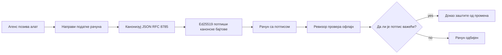
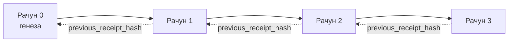

[Погледајте видео лекцију: Осигуравање AI агената криптографским рачунима](https://youtu.be/PLACEHOLDER_VIDEO_ID)

> _(Видео лекције и минијатура ће бити додати од стране Microsoft тима за садржај након спајања, у складу са узорком лекција 14 / 15.)_

# Осигуравање AI агената криптографским рачунима

## Увод

У овој лекцији ћемо покрити:

- Зашто су ревизни трагови за AI агенте важни за усаглашеност, дебаговање и поверење.
- Шта је криптографски рачун и како се разликује од несигурног записника.
- Како произвести потписани рачун за позив алата агента у чистом Python-у.
- Како проверити рачун офлајн и детектовати манипулацију.
- Како повезати рачуне у ланaц тако да уклањање или премествaње једног поремети цео ланац.
- Шта рачуни доказују, а шта експлицитно не доказују.

## Циљеви учења

Након завршетка ове лекције, знаћете како да:

- Идентификујете модове кварова који мотивишу криптографску доказивост радњи агента.
- Произведете Ed25519 потписани рачун преко канонског JSON податка.
- Проверавате рачун независно користећи само јавни кључ потписивача.
- Детектујете манипулацију поновним покретањем проверe модификованог рачуна.
- Конструишете ланац хешираних рачуна и објасните зашто је ланац значајан.
- Препознате границу између оног што рачуни доказују (атрибуција, интегритет, редослед) и оног што не доказују (исправност радње, правилност политике).

## Проблем: Ревизни траг вашег агента

Замислите да сте распоредили AI агента за Contoso Travel. Агент чита захтеве корисника, позива API за летове да потражи опције и резервише места уместо корисника. Прошлог квартала, агент је обрадио 50.000 резервација.

Данас долази ревизор. Поставља једноставно питање: "Покажи ми шта је твој агент радио."

Предате му своје лог фајлове. Ревизор их погледа и поставља теже питање: "Како знам да ови записи нису измењени?"

Ово је проблем ревизног трага. Већина распоређивања агената данас се ослања на:

- **Апликацијске записе**: које пише сам агент, а може их изменити сваки ко има приступ датотечном систему.
- **Услуге облачног логовања**: отkrivене за манипулацију на нивоу платформе али само ако ревизор верује оператеру платформе.
- **Записи транзакција базе података**: прикладни за промене у бази али не и за произвољне позиве алата.

Ниједан од ових не може одговорити на питање ревизора без да се ревизор ослони на некога (вас, провајдера облака, добavljaча базе података). За интерну употребу, тај ниво поверења је често прихватљив. За регулисане задатке (финансије, здравство, све под оквиром EU AI закона), није.

Криптографски рачуни решавају овај проблем тако што свака радња агента може бити независно проверена. Ревизор не мора да вам верује. Потребан му је само ваш јавни кључ и сам рачун.

## Шта је криптографски рачун?

Рачун је JSON објекат који записује шта је агент урадио, са потписом дигиталног потписа.


```mermaid
flowchart LR
    A[Агенс позива алат] --> B[Направи податке рачуна]
    B --> C[Канонизуј JSON RFC 8785]
    C --> E[Ed25519 потпиши канонске бајтове]
    E --> F[Рачун са потписом]
    F --> G[Ревизор проверa офлајн]
    G --> H{Да ли је потпис важећи?}
    H -- yes --> I[Доказ заштите од промена]
    H -- no --> J[Рачун одбијен]
```

Минимални рачун изгледа овако:

```json
{
  "type": "agent.tool_call.v1",
  "agent_id": "contoso-travel-bot",
  "tool_name": "lookup_flights",
  "tool_args_hash": "sha256:a3f9c1...",
  "result_hash": "sha256:7b2e1d...",
  "policy_id": "contoso-travel-policy-v3",
  "timestamp": "2026-04-25T14:30:00Z",
  "sequence": 47,
  "previous_receipt_hash": "sha256:9d4e6a...",
  "signature": {
    "alg": "EdDSA",
    "sig": "c5af83...",
    "public_key": "8f3b2c..."
  }
}
```

Три особине обављају посао:

1. **Потпис**. Рачун потписује агентова капија користећи Ed25519 приватни кључ. Било ко са одговарајућим јавним кључем може проћи проверу потписа офлајн. Манипулација било којим пољем онемогућава потпис.

2. **Канонско кодирање**. Пре потписивања рачун се серијализује користећи JSON Canonicalization Scheme (JCS, RFC 8785). Ово осигурава да две имплементације које производе исту логичку поруку уједначено производе идентичан батч излаз. Без канонализације, различити JSON серијализатори би производили различите потписе за исти садржај.

3. **Хеш ланац**. Поље `previous_receipt_hash` повезује сваки рачун са претходним. Уклањање или мењање редоследа рачуна прекида сваки рачун који долази након њега. Манипулација постаје видљива на нивоу ланца чак и ако се појединачни потписи заобиђу.

Заједно, ове особине дају три гаранције:

- **Атрибуција**: овај кључ је потписао овај садржај.
- **Интегритет**: садржај није промењен од када је потписан.
- **Редослед**: овај рачун долази након оног рачуна у ланцу.

## Произвођење рачуна у Python-у

Не треба вам посебна библиотека за производњу рачуна. Криптографске примитиве су широко доступне и логика је само неколико десетина линија Python кода.

Практични задаци у `code_samples/18-signed-receipts.ipynb` објашњавају цео ток. Сажетак:

```python
import json
import hashlib
import base64
from nacl import signing
from jcs import canonicalize  # RFC 8785 канонски JSON

def b64url_nopad(data: bytes) -> str:
    return base64.urlsafe_b64encode(data).decode("ascii").rstrip("=")

def sha256_canonical(obj) -> str:
    """SHA-256 of a Python object's JCS-canonical JSON form."""
    return f"sha256:{hashlib.sha256(canonicalize(obj)).hexdigest()}"

# Генериши или учитај кључ за потписивање (у продукцији, чувај у „кеј валту“)
signing_key = signing.SigningKey.generate()
verify_key = signing_key.verify_key

# Креирај садржај рачуна (још без потписа)
tool_args = {"origin": "SYD", "destination": "LAX"}
tool_result = [{"flight": "QF11", "price": 1850, "stops": 0}]

payload = {
    "type": "agent.tool_call.v1",
    "agent_id": "contoso-travel-bot",
    "tool_name": "lookup_flights",
    "tool_args_hash": sha256_canonical(tool_args),
    "result_hash": sha256_canonical(tool_result),
    "policy_id": "contoso-travel-policy-v3",
    "timestamp": "2026-04-25T14:30:00Z",
    "sequence": 0,
    "previous_receipt_hash": None,
}

# Канонизуј и директно потпиши JCS бајтове. PureEdDSA унутрашње хеширање.
canonical_bytes = canonicalize(payload)
signature_bytes = signing_key.sign(canonical_bytes).signature

# Додати структурисани објекат потписа.
receipt = {
    **payload,
    "signature": {
        "alg": "EdDSA",
        "sig": b64url_nopad(signature_bytes),
        "public_key": b64url_nopad(bytes(verify_key)),
    },
}
```

То је цела цевоводна линија за потписивање. Задаци у свесци воде вас кроз сваки корак.

## Верификација рачуна и детекција манипулације

Верификација је обрнути поступак:

```python
import base64
import hashlib
from nacl import signing
from nacl.exceptions import BadSignatureError
from jcs import canonicalize

def b64url_decode(s: str) -> bytes:
    padding = "=" * ((4 - len(s) % 4) % 4)
    return base64.urlsafe_b64decode(s + padding)

def verify_receipt(receipt: dict) -> bool:
    # Потпис је структурирани објекат: {"alg", "sig", "public_key"}.
    sig_obj = receipt.get("signature")
    if not sig_obj or sig_obj.get("alg") != "EdDSA":
        return False

    # Реконструишите податке који су заправо потписани (све осим потписа).
    payload = {k: v for k, v in receipt.items() if k != "signature"}

    canonical_bytes = canonicalize(payload)

    try:
        verify_key = signing.VerifyKey(b64url_decode(sig_obj["public_key"]))
        verify_key.verify(canonical_bytes, b64url_decode(sig_obj["sig"]))
        return True
    except BadSignatureError:
        return False
```

Ова функција узима рачун и враћа `True` ако је потпис валидан, у супротном `False`. Без позива на мрежу, без зависности од сервиса, без потребе за поверљивом трећом страном.

Да видите детекцију манипулације у акцији, свеска води кроз:

1. Произвођење валидног рачуна и потврђивање да је важећи.
2. Измену једног бајта у пољу `tool_args_hash`.
3. Поновно покретање провере и посматрање неуспеха.

Ово је практичан доказ да су рачуни видљиви за манипулацију: свака измена, ма колико мала, срушaва потпис.

## Повезивање рачуна за више корака агента

Један потписани рачун штити једну радњу. Ланац рачуна штити низ радњи.


```mermaid
flowchart LR
    R0[Рачун 0<br/>генеза] --> R1[Рачун 1]
    R1 --> R2[Рачун 2]
    R2 --> R3[Рачун 3]
    R1 -. previous_receipt_hash .-> R0
    R2 -. previous_receipt_hash .-> R1
    R3 -. previous_receipt_hash .-> R2
```

Сваки рачун бележи хеш претходног. Да би уклонио рачун 2 неприметно, нападач би морао или:

- Изменити поље `previous_receipt_hash` у рачуну 3 (што квари потпис рачуна 3), ИЛИ
- Фалсификовати нови потпис на модификованом рачуну 3 (потребан приватни кључ агента).

Ако је приватни кључ у хардверском сигурносном модулу и ако објављујете јавни кључ уз сваки рачун, ниједан напад није могућ без откривања.

Свеска показује:

1. Конструкцију ланца од три рачуна.
2. Потврду да поље `previous_receipt_hash` сваког рачуна одговара стварном хешу претходног.
3. Манипулацију једним рачуном у средини и посматрање прекида ланца управо тог места.

Ово је начин да направите ревизни траг који спољни ревизор може проверити без поверења у вас.

## Шта рачуни доказују (а шта не доказују)

Ово је најважнији део ове лекције. Рачуни су моћни, али је њихова моћ ограничена.

**Рачуни доказују три ствари:**

1. **Атрибуцију**: специфичан кључ је потписао специфичан садржај.
2. **Интегритет**: садржај није промењен од када је потписан.
3. **Редослед**: овај рачун долази након оног рачуна у ланцу.

**Рачуни НЕ доказују:**

1. **Тачност**: да је радња агента била исправна. Рачун може бити потписан и за погрешан, као и за исправан одговор.
2. **Поштеност политике**: да је политика из поља `policy_id` стварно процењена, или да би допустила ову радњу уколико је проверена. Рачун бележи оно што је тврдњено, не оно што је спроведено.
3. **Идентитет изван кључа**: рачун каже "овај кључ је потписао овај садржај." Не каже "ове особе су овластиле ову радњу." Повезивање кључа са особом или организацијом захтева посебну инфраструктуру идентитета (директоријум, регистар јавних кључева итд.).
4. **Истинитост уноса**: ако агент добије манипулисан захтев и деловање на њему, рачун верно записује ту радњу. Рачуни су накнадни у односу на валидацију уноса, не замена за њу.

Ова граница је важна из два разлога:

- Каже вам за шта су рачуни корисни: чине понашање агента ревизивим и видљивим за манипулацију, чак и преко организационих граница.
- Каже вам које додатне слојеве још увек треба: валидацију уноса (Лекција 6), спровођење политике (укратко покривено даље), и инфраструктуру идентитета (ван домета ове лекције).

Честа грешка је претпоставка да "ако имамо рачуне" значи "ако смо вођени." Не значи. Рачуни су основа. Управљање је систем који градите на тој основи.

## Доказ о људској сагласности са тачном радњом

Тачка 3 горе заслужује свој одељак: рачун каже "овај кључ је потписао овај садржај," никад "човек је одобрио ову радњу." За радње високе ризичности (повраћаји, брисања, трансфери новца) оквири управљања све више захтевају управо ту изостављену изјаву, која се може произвести истим примитивима које сте већ изградили у овој лекцији.

Следећа свеска `code_samples/human-authorization-receipts.ipynb` додаје другу врсту рачуна, `human.approval.v1`, у истом обиму као рачуни из ове лекције (типизовани подаци потписани Ed25519 преко њихових канонских JCS бајтова, са `signature` објектом ван потписаних бајтова). Именовани одобравач потписује **целу канонску радњу и њен дигест** пре извршења; рачун радње агента носи **исти дигест радње** и `parent_approval_ref`, `receipt_hash` одобрења, исту конвенцију као и `previous_receipt_hash` у ланцу који сте изградили горе. Једна `verify_chain` функција проверава оба артефакта под **одвојеним регистрима фиксираних кључева** (кључеви одобравача против кључева агента), тако да имамо делимичан код али не и заједничку ауторитет.

Особина која се добија, прецизно изражена: *човек је одобрио ову тачну радњу и агент је извршио управо ту одобрeну радњу.* Фиксири у свесци који одбијају су оно што ову особину чини стварном а не само тврдњом:

- класичан сет: манипулацију, збуњеног заменика, реплеј, лажне кључеве са обе стране, неисправан унос;
- **старе ауторитете**: потпис који се још верификује, али се одбија јер је верзија политике промењена, кључ одобравача rotiran из фиксираног регистра или је одобрење истекло пре извршења;
- **замена дигеста**: валидан потписани рачун радње који показује на *право* одобрење које је везано за *другачију* канонску радњу.

Свако одбијање има јасан разлог, тако да ревизор који чита одбијање може уочити да ли је власт постала застарела или је извршена радња промењена. Правило које свеска учи: потписано одобрење само по себи није ауторитет. Ауторитет постоји само ако оба рачуна и даље везују исту канонску радњу у време извршења. Рачун људске сагласности је образовни састав дефинисан овом лекцијом, а не тип рачуна дефинисан у `draft-farley-acta-signed-receipts`.

## Референце за производњу

Python код у овој лекцији је намерно минималан да бисте могли прочитати сваки ред и тачно разумети шта се дешава. У производњи, имате две опције:

1. **Радите директно на криптографским примитивима.** 50 редова које сте видели горе је довољно за многе случајеве. PyNaCl (Ed25519) и пакет `jcs` (канонски JSON) су добро одржаване и ревидиране библиотеке.

2. **Користите библиотеку за рачуне у производњи.** Неколико open-source пројеката имплементира исти образац са додатним карактеристикама (ротирање кључева, групна провера, дистрибуција JWK сета, интеграција са политичким механизмима):
   - Цевовод за потписивање користи JCS и конвенције домена потписа у независном IETF Интернет-драфту ([`draft-farley-acta-signed-receipts`](https://datatracker.ietf.org/doc/draft-farley-acta-signed-receipts/), ревизија 02). Образац за ову лекцију је равни образовни рачун који се разликује од јединственог коверта `{payload, signature}` из драфта и није представљен као конформна имплементација. Драфт објављује заједнички скуп за тестирање усаглашености ([agent-governance-testvectors](https://github.com/ScopeBlind/agent-governance-testvectors)) за имплементације које циљају његов wire формaт.
   - Microsoft Agent Governance Toolkit саставља рачуне са Cedar-базираним одлукама о политици; видети Туториал 33 у том репозиторијуму за пример од почетка до краја.
   - Пакети `protect-mcp` (npm) и `@veritasacta/verify` (npm) пружају Node-имплементацију за потписивање рачуна и офлајн верификацију, намењену за омотавање било ког MCP сервера са трајним ревизним трагом, укључујући и ток који чека потпис у којем паузирана радња емитује одобрење везано за дигест радње (WebAuthn подршка у десктоп току), исти образац одобрења као у свесци за људску ауторизацију изнад.
   - **[nobulex](https://github.com/arian-gogani/nobulex)** Python SDK (`pip install nobulex`) пружа исти Ed25519 + JCS образац потписивања у Python-у са интеграцијама за LangChain и CrewAI, укључујући објављене векторе за међусобну валидацију и мапирање за усаглашеност доприносио [OWASP PR #2210](https://github.com/OWASP/CheatSheetSeries/pull/2210).

Одлука између писања сопственог решења и коришћења библиотеке слична је одлуци између писања сопствене JWT библиотеке и коришћења тестиране: обе опције су разумне; библиотека штеди време и смањује ограничења ревизије; прилагођено решење тражи да разумете сваки примитив. Ова лекција учи вашу властиту имплементацију како бисте стекли основу за било који избор.

## Провера знања

Тестирајте своје разумевање пре него што пређете на практичну вежбу.

**1. Рачун је потписан приватним Ed25519 кључем агента. Ревизор има само јавни кључ. Може ли ревизор проверити рачун офлајн?**

<details>
<summary>Одговор</summary>

Да. Ed25519 проверa захтева само јавни кључ и бајтове који су потписани. Без мрежног позива, без зависности од сервиса. Ово је својство које чини рачуне корисним у окружењима са одвојеним мрежама, више организација или ниског нивоа поверења.
</details>

**2. Нападач мења поље `policy_id` у рачуну да би тврдио да га је регулисала блажa политика. Потпис је био над оригиналним садржајем. Шта се дешава током провере?**

<details>
<summary>Одговор</summary>


Верификација не успева. Потпис је рачунат преко канонских бајтова оригиналног садржаја; модификација било ког поља мења те бајтове, што чини потпис неважећим. Нападачу је за производњу свежег важећег потписа потребан приватни кључ, који он нема.
</details>

**3. Зашто примка садржи `tool_args_hash` и `result_hash` уместо необрађених аргумената и резултата?**

<details>
<summary>Одговор</summary>

Два разлога. Прво, примка можда треба да буде архивирана или пренета у окружењима где процуривање необрађеног садржаја (ПИИ, пословни подаци) представља проблем. Хеширање одржава примку малом и садржај приватним; ревизор проверава да ли хеш одговара посебно сачуваној копији стварног садржаја. Друго, хешеви имају фиксну величину; примка са хешевима има ограничену величину без обзира на то колико су улази и излази били велики.
</details>

**4. Поље `previous_receipt_hash` повезује сваку примку са својим претходником. Ако нападач тихо избрише једну примку из средине ланца, шта постаје неважеће?**

<details>
<summary>Одговор</summary>

Свака примка која је била после избрисане. Њихова поља `previous_receipt_hash` више не одговарају стварном ланцу (јер примка на коју су упућивали више не постоји, или ланац сада показује на другог претходника). Да би прикрио брисање, нападач би морао поново да потпише сваки каснији примку, што захтева приватни кључ.
</details>

**5. Примка се успешно верификује. Да ли то доказује да је агентова акција била исправна, звучна или у складу са политиком?**

<details>
<summary>Одговор</summary>

Не. Важеча примка доказује три ствари: атрибуцију (овим кључем је потписан овај садржај), интегритет (садржај није промењен) и редослед (ова примка долази после оне). НЕ доказује да је акција била исправна, да је политика именована у `policy_id` заиста процењена или да је агент пратио сва правило. Примке омогућавају ревизију понашања агента, али не нужно и његову исправност. Ово је најважнија граница у лекцији.
</details>

## Вежба

Отворите `code_samples/18-signed-receipts.ipynb` и завршите сва четири одељка:

1. **Одељак 1**: Потпишите своју прву примку и проверите је.
2. **Одељак 2**: Измјените примку и посматрајте неуспех верификације.
3. **Одељак 3**: Направите ланац од три примке и проверите интегритет ланца.
4. **Одељак 4**: Примените образац на агента изграђеног у Microsoft Agent Framework-у: опкружите позив алата потписивањем примке, затим независно проверите примку.

**Изазов 1:** проширите шему примке додатним пољем по свом избору (на пример, ID захтева за праћење), ажурирајте канонску логику потписивања да га укључује и потврдите да примка и даље пролази кроз верификацију. Затим измените поље након потписивања и уверите се да верификација не успева. Ово вам помаже да разумете како сваки бајт канонског кодирања доприноси потпису.

**Изазов 2:** Хеширајте две примке SHA-256 заједно (конкатенирајте њихове канонске бајтове у детерминисаном редоследу) и уградите резултујући дигест као ново поље на трећој примци пре потписивања. Проверите да све три примке и даље пролазе верификацију. Управо сте направили доказ укључености у једном кораку: било коју ко поседује трећу примку може доказати да су прве две постојале у тренутку потписа, без потребе да открива њихов садржај. Ово је образац који се користи за примке селективног откривања у великом обиму (Merkle обавезе, RFC 6962).

## Закључак

Криптографске примке пружају AI агентима ревизорски траг који је:

- **Независно проверљив**: било која страна са јавним кључем може верификовати, без зависности од сервиса.
- **Приметан на измену**: свака измена поништава потпис.
- **Преносив**: примка је мали JSON фајл; може се архивирати, преносити и проверити било где.
- **Усклађен са стандардима**: базиран на Ed25519 (RFC 8032), JCS (RFC 8785) и SHA-256, сви широко распоређени примитиви.

Нису замена за проверу улаза, примену политика или инфраструктуру идентитета. Они су основа за те слојеве. Када распоређујете агенте у регулисане радне оптерећења, мултиорганизационе токове рада или окружења у којима се не може претпоставити да ће вас будући ревизор веровати, примке су начин да ревизорски траг буде поуздан.

Најважнија порука: примке доказују ко је шта рекао и када. Не доказују да је оно што је речено тачно или исправно. Држите ту разлику чврсто. То је разлика између искреног система порекла и обмањујућег.

## Контролна листа за продукцију

Када будете спремни да пређете из ове лекције у распоређивање агената са потписаним примкама у реалном окружењу:

- [ ] **Преместите приватни кључ са лаптопа програмера.** Користите Azure Key Vault, AWS KMS или хардверски безбедносни модул. Приватни кључ који потписује ваше примке не сме се никада чувати у изворном коду или чистом тексту на апликационим машинама.
- [ ] **Објавите јавни кључ за верификацију.** Ревизорима је потребан за офлајн верификацију. Стандардни образац је JWK скуп на познатом URL-у (RFC 7517), нпр. `https://your-org.example.com/.well-known/agent-keys.json`.
- [ ] **Спољно прикачите ланац.** Периодично бележите хеш најновије главе ланца у транспарентан дневник (Sigstore Rekor, RFC 3161 временски печат овлашћења или други интерни систем) да би спољна страна могла да потврди „овaj ланац је постојао у овом времену.“
- [ ] **Складиштите примке непотписивим.** Чување у додатној меморији која дозвољава само додавање (Azure Storage са политикама непокретности, AWS S3 Object Lock) спречава унутрашње преправљање историје на нивоу складишта.
- [ ] **Одлучите о чувању.** Многи комплајенс режими захтевају вишегодишње чување. Планирајте раст примки (свака примка је око 500 бајтова; ако агент направи 10K позива дневно, произведе око 1,8 ГБ годишње).
- [ ] **Документујте шта примке не покривају.** Примке доказују атрибуцију, интегритет и редослед. Ваш радни план треба да јасно наброји која додатна контролна средства (валидација улаза, применa политика, ограничење учесталости, инфраструктура идентитета) стоје уз примке у вашој управљачкој позицији.

### Имате још питања о безбедности AI агената?

Придружите се [Microsoft Foundry Discord](https://aka.ms/ai-agents/discord) да упознате друге ученике, похађате канцеларијске сате и добијете одговоре на ваша питања о AI агенатима.

## Изван ове лекције

Ова лекција покрива потписивање једне примке и ланце са хешевима. Исте примитиве сачињавају неколико напреднијих образаца које можете срести како ваша управљачка позиција сазрева:

- **Селективно откривање.** Када су поља примке независно обавезана (Merkle стабло по узору на RFC 6962), можете открити одређена поља одређеним ревизорима и доказати да остала нису промењена без откривања њиховог садржаја. Корисно када иста примка мора да задовољи и свеобухватну ревизију (која тражи комплетност) и регулативе о минимизацији података као што је GDPR (које желе да ревизор види што мање).
- **Опозив примки.** Ако је кључ за потписивање компромитован, потребан је начин да се све примке потписане тим кључем означе као непоуздане од одређеног тренутка. Стандардни обрасци: краткотрајни кључеви и објављене листе опозива или транспарентни дневник са уносима опозива.
- **Билатералне / подељене потписне примке.** Нека имплементације деле потписани садржај у пола: пре извршења (`authorization_*`) и после извршења (`result_*`) са независним потписима; корисно када одлуку о овлашћењу и посматрани резултат доносе различити актери или у различито време. Ово додатно се саставља на образац примки из ове лекције.
- **Композиција садржаја.** Примка заптива бајтове које убаците у `result_hash`. Стварни садржаји често су богатији од резултата једног позива алата: разлози пре одлуке (предвиђање модела, разматране опције, докази и њихова потпуна скала, ризични положај, ланац одговорности, исход контролне капије) могу бити унутар садржаја, запечаћени једном примком. Ово чува формат примке минималним, а шеме садржаја еволуирају по доменима.
- **Усклађеност између имплементација.** Више независних имплементација истог формата примке (Python, TypeScript, Rust, Go) раде усклађену проверу на заједничким тест векторима. Ако правите своју имплементацију, валидација на објављеним векторима потврђује компатибилност.
- **Прелазак после квантних рачунара.** Ed25519 је широко распрострањен данас али није отпоран на квантне нападе. Формат примке је алгоритмички агилан: поље `signature.alg` може носити `ML-DSA-65` (стандард НИСТ-а за постквантни потпис) кад буде потребно миграцију. Планирајте период транзиције када ће примке бити двоструко потписане.

## Додатни ресурси

- <a href="https://datatracker.ietf.org/doc/draft-farley-acta-signed-receipts/" target="_blank">IETF Internet-Draft: Потписане примке одлука за контролу приступа машина-машина</a>
- <a href="https://learn.microsoft.com/azure/ai-studio/responsible-use-of-ai-overview" target="_blank">Преглед одговорне употребе AI (Azure AI)</a>
- <a href="https://datatracker.ietf.org/doc/html/rfc8032" target="_blank">RFC 8032: Edwards-Curve алгоритам дигиталног потписа (EdDSA)</a>
- <a href="https://datatracker.ietf.org/doc/html/rfc8785" target="_blank">RFC 8785: JSON канонски шема (JCS)</a>
- <a href="https://datatracker.ietf.org/doc/html/rfc6962" target="_blank">RFC 6962: Сертификатска транспарентност</a> (Merkle стабло коришћено код примки селективног откривања)
- <a href="https://github.com/microsoft/agent-governance-toolkit/blob/main/docs/tutorials/33-offline-verifiable-receipts.md" target="_blank">Microsoft Agent Governance Toolkit, Туторијал 33: Офлајн проверљиве примке одлука</a>
- <a href="https://github.com/ScopeBlind/agent-governance-testvectors" target="_blank">Вектори за тестирање усклађености између имплементација</a> за формат примки коришћен у овој лекцији (Apache-2.0)
- <a href="https://pynacl.readthedocs.io/" target="_blank">PyNaCl документација</a> (Ed25519 у Python-у)

## Претходна лекција

[Креирање локалних AI агената](../17-creating-local-ai-agents/README.md)

---

<!-- CO-OP TRANSLATOR DISCLAIMER START -->
**Изјава о одрицању одговорности**:
Овај документ је преведен коришћењем услуге за аутоматски превод [Co-op Translator](https://github.com/Azure/co-op-translator). Иако тежимо тачности, имајте у виду да аутоматски преводи могу садржати грешке или нетачности. Оригинални документ на његовом изворном језику треба сматрати ауторитативним извором. За критичне информације препоручује се професионални људски превод. Нисмо одговорни за било каква неспоразума или погрешна тумачења која произилазе из коришћења овог превода.
<!-- CO-OP TRANSLATOR DISCLAIMER END -->