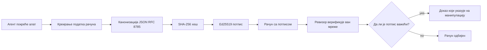
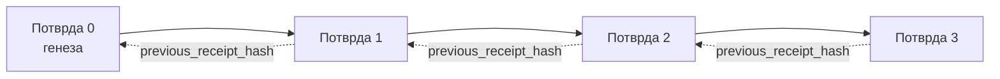

[Погледајте видео лекцију: Обезбеђивање AI агената помоћу криптографских рачуна](https://youtu.be/PLACEHOLDER_VIDEO_ID)

> _(Видео лекција и сличица биће додати од стране Microsoft тима за садржај након спајања, у складу са шаблоном лекција 14 / 15.)_

# Обезбеђивање AI агената помоћу криптографских рачуна

## Увод

Ова лекција ће обухватити:

- Зашто су аудиторски трагови за AI агенте важни за усаглашеност, дебаговање и поверење.
- Шта је криптографски рачун и како се разликује од неуписане линије дневника.
- Како произвести потписани рачун за позив алата агента у чистом Питону.
- Како проверити рачун ван мреже и открити неовлашћене измене.
- Како повезати рачуне тако да уклањање или мењање редоследа једног рачуна прекида ланац.
- Шта рачуни доказују, а шта експлицитно не доказују.

## Циљеви учења

Након завршетка ове лекције, научићете како да:

- Препознате начине неуспеха који мотивишу криптографски порекло за акције агента.
- Произвести Ed25519-потписани рачун над канонским JSON садржајем.
- Проверите рачун независно користећи само јавни кључ потписника.
- Открити неовлашћене измене поновном провером измењеног рачуна.
- Креирати ланац хешираних рачуна и објаснити зашто је ланац важан.
- Препознати границу између онога што рачуни доказују (атрибуција, интегритет, редослед) и онога што не доказују (исправност акције, озбиљност политике).

## Проблем: Аудиторски траг вашег агента

Замислите да сте распоредили AI агента за Contoso Travel. Агент чита захтеве клијената, позива API за летове да претражи опције и резервише седишта у име клијента. Прошлог квартала агент је обрадио 50.000 резервација.

Данас долази ревизор. Поставља једноставно питање: "Покажи ми шта је ваш агент радио."

Предате им своје дневничке датотеке. Ревизор их прегледа и поставља теже питање: "Како знам да ови записи нису измењени?"

Ово је проблем аудиторског трага. Већина данашњих распоређивања агената се ослања на:

- **Апликацијске записе**: које пише сам агент, а било ко са приступом фајл-систему може их изменити.
- **Услуге облачног записивања**: отпорне на измене на нивоу платформе, али само ако ревизор верује оператеру платформе.
- **Транзакционе записе базе података**: погодни за промене у бази података али не и за произвољне позиве алата.

Ништа од овог не може да одговори на питање ревизора без да он мора да некоме верује (вама, вашем добављачу облака, добављачу базе). За унутрашњу употребу, та поверења су често прихватљива. За регулаторне радне оптерећења (финансије, здравство, све под регулативом EU AI Akta), нису.

Криптографски рачуни решавају ово тако што свака акција агента постаје независно проверљива. Ревизору није потребно да вама верује. Потребан му је само јавни кључ и сам рачун.

## Шта је криптографски рачун?

Рачун је JSON објекат који бележи шта је агент урадио, потписан дигиталним потписом.


```mermaid
flowchart LR
    A[Агент покреће алат] --> B[Креирање податка рачуна]
    B --> C[Канонизација JSON RFC 8785]
    C --> D[SHA-256 хеш]
    D --> E[Ed25519 потпис]
    E --> F[Рачун са потписом]
    F --> G[Ревизор верификује ван мреже]
    G --> H{Да ли је потпис важећи?}
    H -- yes --> I[Доказ који указује на манипулацију]
    H -- no --> J[Рачун одбијен]
```

Минимални рачун изгледа овако:

```json
{
  "type": "agent.tool_call.v1",
  "agent_id": "contoso-travel-bot",
  "tool_name": "lookup_flights",
  "tool_args_hash": "sha256:a3f9c1...",
  "result_hash": "sha256:7b2e1d...",
  "policy_id": "contoso-travel-policy-v3",
  "timestamp": "2026-04-25T14:30:00Z",
  "sequence": 47,
  "previous_receipt_hash": "sha256:9d4e6a...",
  "signature": {
    "alg": "EdDSA",
    "sig": "c5af83...",
    "public_key": "8f3b2c..."
  }
}
```

Три особине су битне:

1. **Потпис**. Рачун потписује гатеwај агента користећи Ed25519 приватни кључ. Сваки ко има одговарајући јавни кључ може да провери потпис ван мреже. Измена било ког поља поништава потпис.

2. **Канонско кодирање**. Пре потписивања, рачун се серијализује помоћу JSON Canonicalization Scheme (JCS, RFC 8785). Ово осигурава да две имплементације које производе исти логички рачун имају бајт идентичан излаз. Без каноникализације, различити JSON серијализатори би дали различите потписе за исти садржај.

3. **Хеш ланац**. Поље `previous_receipt_hash` повезује сваки рачун са претходним. Уклањање или мењање редоследа рачуна поништава све рачуне који следе после њега. Неовлашћене измене постају видљиве на нивоу ланца чак и ако се појединачни потписи заобиђу.

Заједно, ове особине пружају три гаранције:

- **Атрибуција**: овај кључ је потписао овај садржај.
- **Интегритет**: садржај није промењен од потписивања.
- **Редослед**: овај рачун је дошао после тог рачуна у ланцу.

## Произвођење рачуна у Python-у

Не треба вам посебна библиотека да бисте произвели рачун. Криптографске примитиве су широко доступне, а логика је само неколико десетина линија Python кода.

Практичне вежбе у `code_samples/18-signed-receipts.ipynb` воде кроз цео ток. Сажета верзија:

```python
import json
import hashlib
import base64
from nacl import signing
from jcs import canonicalize  # RFC 8785 канонски JSON

def b64url_nopad(data: bytes) -> str:
    return base64.urlsafe_b64encode(data).decode("ascii").rstrip("=")

def sha256_canonical(obj) -> str:
    """SHA-256 of a Python object's JCS-canonical JSON form."""
    return f"sha256:{hashlib.sha256(canonicalize(obj)).hexdigest()}"

# Генериши или учитај кључ за потписивање (у производњи, чувај у криптокључарници)
signing_key = signing.SigningKey.generate()
verify_key = signing_key.verify_key

# Направи садржај рачуна (још без потписа)
tool_args = {"origin": "SYD", "destination": "LAX"}
tool_result = [{"flight": "QF11", "price": 1850, "stops": 0}]

payload = {
    "type": "agent.tool_call.v1",
    "agent_id": "contoso-travel-bot",
    "tool_name": "lookup_flights",
    "tool_args_hash": sha256_canonical(tool_args),
    "result_hash": sha256_canonical(tool_result),
    "policy_id": "contoso-travel-policy-v3",
    "timestamp": "2026-04-25T14:30:00Z",
    "sequence": 0,
    "previous_receipt_hash": None,
}

# Канонизуј, хеширај, потпиши.
canonical_bytes = canonicalize(payload)
message_hash = hashlib.sha256(canonical_bytes).digest()
signature_bytes = signing_key.sign(message_hash).signature

# Прикључи структурисани објекат потписа.
receipt = {
    **payload,
    "signature": {
        "alg": "EdDSA",
        "sig": b64url_nopad(signature_bytes),
        "public_key": b64url_nopad(bytes(verify_key)),
    },
}
```

То је цео процес потписивања. Вежбе у бележници објашњавају сваки корак.

## Провера рачуна и откривање измена

Провера је обрнути процес:

```python
import base64
import hashlib
from nacl import signing
from nacl.exceptions import BadSignatureError
from jcs import canonicalize

def b64url_decode(s: str) -> bytes:
    padding = "=" * ((4 - len(s) % 4) % 4)
    return base64.urlsafe_b64decode(s + padding)

def verify_receipt(receipt: dict) -> bool:
    # Потпис је структурирани објекат: {"alg", "sig", "public_key"}.
    sig_obj = receipt.get("signature")
    if not sig_obj or sig_obj.get("alg") != "EdDSA":
        return False

    # Реконструишите садржај који је заправо потписан (све осим потписа).
    payload = {k: v for k, v in receipt.items() if k != "signature"}

    canonical_bytes = canonicalize(payload)
    message_hash = hashlib.sha256(canonical_bytes).digest()

    try:
        verify_key = signing.VerifyKey(b64url_decode(sig_obj["public_key"]))
        verify_key.verify(message_hash, b64url_decode(sig_obj["sig"]))
        return True
    except BadSignatureError:
        return False
```

Ова функција прима рачун и враћа `True` ако је потпис валидан, `False` у супротном. Без позива мреже, без зависности од сервиса, без потребе за поверењем у трећу страну.

Да бисте видели детекцију измена у пракси, бележница прошле кроз:

1. Произвођење валиданог рачуна и потврду његове проверљивости.
2. Измену једног бајта у пољу `tool_args_hash`.
3. Поновну проверу и приметити да пропада.

Ово је практичан доказ да су рачуни отпорни на измене: било каква измена, ма колико мала, поништава потпис.

## Лањење рачуна за агенте са више корака

Један потписани рачун штити једну радњу. Ланац рачуна штити низ.


```mermaid
flowchart LR
    R0[Потврда 0<br/>генеза] --> R1[Потврда 1]
    R1 --> R2[Потврда 2]
    R2 --> R3[Потврда 3]
    R1 -. previous_receipt_hash .-> R0
    R2 -. previous_receipt_hash .-> R1
    R3 -. previous_receipt_hash .-> R2
```

Сваки рачун бележи хеш претходног рачуна. Да би нападач тихо уклонио рачун 2, морао би да:

- Измени поље `previous_receipt_hash` у рачуну 3 (погази потпис на рачуну 3), ИЛИ
- Измами нови потпис на измењеном рачуну 3 (захтева агенту приватни кључ).

Ако је приватни кључ у хардверском сигурносном модулу а ви објављујете јавни кључ уз сваки рачун, ниједан од ових напада није могућ без откривања.

Бележница води кроз:

1. Креирање ланца са три рачуна.
2. Провера да `previous_receipt_hash` сваког рачуна одговара стварном хешу претходног.
3. Измена једног рачуна у средини и посматрање рушења ланца управо у том месту.

Овако се производи аудиторски траг који спољни ревизор може проверити без потребе да вам верује.

## Шта рачуни доказују (и шта не доказују)

Ово је најважнији део ове лекције. Рачуни су моћни, али њихова моћ је ограничена.

**Рачуни доказују три ствари:**

1. **Атрибуција**: одређени кључ је потписао одређени садржај.
2. **Интегритет**: садржај није промењен од потписивања.
3. **Редослед**: овај рачун је наступио након тог у хеш ланцу.

**Рачуни НЕ доказују:**

1. **Тачност**: да је радња агента била исправна. Рачун може бити потписан за погрешан одговор подједнако као и за прави.
2. **Усаглашеност са политиком**: да ли је политика назначена у `policy_id` заиста вреднована, или да ли би дозволила ову радњу ако би била проверена. Рачун записује оно што је тврдњено, не и оно што је спроведено.
3. **Идентитет изван кључа**: рачун каже "овaj кључ је потписао овај садржај." Не каже "овaj човек је овластио ову радњу." Повезивање кључа са особом или организацијом захтева посебну инфраструктуру идентитета (каталог, регистар јавних кључева итд.).
4. **Истинитост уноса**: ако агент добије изманипулисан упит и поступи по њему, рачун верно бележи ту радњу. Рачуни су у последњој фази валидације уноса, не замена за њу.

Ова граница је важна из два разлога:

- Каже вам за шта су рачуни корисни: да се понашање агента може ревидирати и да је отпорно на измене, чак и преко организационих граница.
- Каже вам које додатне слојеве још треба да имате: валидацију уноса (Лекција 6), спровођење политике (краћe обрађено испод), и инфраструктуру идентитета (ван оквира ове лекције).

Честа грешка је претпоставка да "имање рачуна" значи "ми смо уређени." Не значи. Рачуни су основа. Управљање је систем који градите на тој основи.

## Референце за производњу

Python код у овој лекцији је намерно минималан како бисте могли прочитати сваки ред и потпуно разумети шта се дешава. У производњи имате две опције:

1. **Градите директно на криптографским примитивима.** Оних 50 линија изнад довољно је за многе случајеве. PyNaCl (Ed25519) и `jcs` пакет (канонски JSON) су добро одржаване и ревидиране библиотеке.

2. **Користите библиотеку за производне рачуне.** Неколико пројеката отвореног кода имплементира исти образац са додатним функцијама (ротација кључева, групна проверa, дистрибуција JWK скупова, интеграција са политичким механизмима):
   - Формат рачуна коришћен у овој лекцији прати IETF Internet-Draft (`draft-farley-acta-signed-receipts`) који је тренутно у процесу стандартизације.
   - Microsoft Agent Governance Toolkit комбинује рачуне са одлукама политике базираним на Cedar; погледајте Туторијал 33 у том складишту за пример од почетка до краја.
   - Пакети `protect-mcp` (npm) и `@veritasacta/verify` (npm) нуде Node-овску имплементацију потписивања и офлајн провере рачуна, намењене омотавању било ког MCP сервера са отпорним на измене аудиторским трагом.
   - **[nobulex](https://github.com/arian-gogani/nobulex)** Python SDK (`pip install nobulex`) пружа исти образац Ed25519 + JCS потписивања у Python-у са интеграцијама за LangChain и CrewAI, укључујући објављене тест векторе за међусобну проверу и мапирање за усаглашеност допринесено преко [OWASP PR #2210](https://github.com/OWASP/CheatSheetSeries/pull/2210).

Одлука да ли да сами кодирају или користе библиотеку одражава одлуку између писања сопствене JWT библиотеке и коришћења тестиране: обе су разумне; библиотека штеди време и смањује површину за ревизију; приступ од нуле вас приморава да разумете сваки примитив. Ова лекција учи приступ од нуле да бисте имали темељ са којим можете изабрати било коју опцију.

## Провера знања

Тестирајте своје разумевање пре него што пређете на практичну вежбу.

**1. Рачун се потписује приватним Ed25519 кључем агента. Ревизор има само јавни кључ. Може ли ревизор проверити рачун ванмрежно?**

<details>
<summary>Одговор</summary>

Да. Ed25519 провера захтева само јавни кључ и потписане бајтове. Није потребан мрежни позив, ни зависност од сервиса. Ово је својство које рачуне чини корисним у окружењима са изолованом мрежом, више организација или ниског поверења у ревизији.
</details>

**2. Нападач мења поље `policy_id` у рачуну да би тврдио да је рачун регулисан опуштенијом политиком. Потпис је направљен над оригиналним садржајем. Шта се дешава приликом провере?**

<details>
<summary>Одговор</summary>

Провера не успева. Потпис је израчунат над канонским бајтовима оригиналног садржаја; измена било ког поља мења канонске бајтове, што мења SHA-256 хеш, што чини потпис неважећим. Нападач би морао имати приватни кључ да произведе нови важећи потпис, што нема.
</details>

**3. Зашто рачун садржи `tool_args_hash` и `result_hash` уместо сирових аргумената и резултата?**

<details>
<summary>Одговор</summary>

Два разлога. Прво, рачун може морати да се архивира или преноси у окружењима где цурење сирових података (ПИО, пословни подаци) представља проблем. Хеширање држи рачун малим и садржај приватним; ревизор проверава да ли хеш одговара посебно сачуваној копији стварног садржаја. Друго, хешеви имају фиксну величину; рачун са хешевима има ограничену величину без обзира колико су улази и излази велики.
</details>

**4. Поље `previous_receipt_hash` повезује сваки рачун са претходним. Ако нападач тихо обрише један рачун из средине ланца, шта постаје неважеће?**

<details>
<summary>Одговор</summary>

Сваки рачун који је дошао након обрисаног. Њихова поља `previous_receipt_hash` више не одговарају стварном ланцу (јер рачун на који су указивали више не постоји, или ланац сада показује на другог претходника). Да би сакрио брисање, нападач би морао поново потписати сваки каснији рачун, што захтева приватни кључ.
</details>

**5. Рачун се успешно проверава. Да ли то доказује да је акција агента била исправна, изведена по правилу или у складу са политиком?**

<details>
<summary>Одговор</summary>

Не. Важи рачун доказује три ствари: атрибуцију (тај кључ је потписао тај садржај), интегритет (садржај није промењен), и редослед (овај рачун је уследио након тог рачуна). НЕ доказује да је акција била исправна, да је политика назначена у `policy_id` стварно процењена, или да је агент пратимао сва правила. Рачуни чине понашање агента ревидибилним, не нужно исправним. Ово је најважнија граница у лекцији.
</details>

## Практична вежба

Отворите `code_samples/18-signed-receipts.ipynb` и завршите сва четири одељка:

1. **Одељак 1**: Потпишите свој први рачун и проверите га.
2. **Одељак 2**: Измените рачун и посматрајте неуспех провере.
3. **Одељак 3**: Креирајте ланац од три рачуна и проверите интегритет ланца.
4. **Одељак 4**: Примени образац на агента изграђеног помоћу Microsoft Agent Framework-а: умотајте позив алата у процес потписивања рачуна, а затим проверите рачун независно.


**Изазов проширења 1:** проширите шему рачуна додатним пољем по вашем избору (на пример, ИД захтева за праћење), ажурирајте логику канонског потписа да га укључи и потврдите да рачун и даље успешно пролази кроз верификацију. Затим измените то поље након потписивања и потврдите да верификација не успева. Ово вас приморава да разумете како сваки бајт каноног кодирања доприноси потпису.

**Изазов проширења 2:** направите SHA-256 хеш од два ваша рачуна (конкатенишите њихове канонске бајтове у детерминистичком редоследу) и уградите добијени дигест као ново поље на трећи рачун пре његовог потписивања. Потврдите да сва три рачуна и даље успешно пролазе. Управо сте направили доказ укључености у једном кораку: било ко ко има трећи рачун може доказати да су прва два постојала у време када је трећи рачун потписан, без потребе да открива њихов садржај. Ово је образац који користе рачуни уз селективно откривање у великом обиму (Меркле обавезе, RFC 6962).

## Закључак

Криптографски рачуни дају AI агентима траг ревизије који је:

- **Независно проверљив**: свака страна са јавним кључем може верификовати, нема зависности од сервиса.
- **Отпоран на манипулацију**: свака измена поништава потпис.
- **Преносив**: рачун је мали JSON фајл; може се архивирати, преносити и верификовати било где.
- **Усклађен са стандардима**: базиран на Ed25519 (RFC 8032), JCS (RFC 8785) и SHA-256, сви широко коришћени примитиви.

Они нису замена за проверу уноса, спровођење политика или инфраструктуру идентитета. Они су темељ тих слојева. Када управљате агентима у регулисаним окружењима, вишекорисничким радним токовима или било којој ситуацији где се не може претпоставити да вас будући ревизор сме да верује, рачуни су начин да траг ревизије буде поштован.

Најважније што треба запамтити: рачуни доказују ко је рекао шта и када. Они не доказују да је оно што је речено истинито или исправно. Ту разлику држите чврсто. То је разлика између поштеног система порекла и обмањујућег.

## Листа за производњу

Када будете спремни да пређете са ове лекције на развој агената који потписују рачуне у стварном окружењу:

- [ ] **Преместите кључ за потписивање са лаптопа програмера.** Користите Azure Key Vault, AWS KMS или хардверски безбедносни модул. Приватни кључ који потписује ваше рачуне никада не сме живети у контролу извора или у обичном тексту на машинама апликације.
- [ ] **Објавите јавни кључ за верификацију.** Ревизори га требају да верификују офлајн. Стандардни образац је JWK скуп на добро познатом URL-у (RFC 7517), нпр. `https://your-org.example.com/.well-known/agent-keys.json`.
- [ ] **Спољашња укотвљеност ланца.** Повремено упишите хеш последњег врха ланца у дневник транспарентности (Sigstore Rekor, RFC 3161 овлашћење временске ознаке, или други интерни систем) како би спољна страна могла потврдити „да је овај ланац постојао у том тренутку“.
- [ ] **Чувајте рачуне непроменљиво.** Скуложа за чување која дозвољава само додавање (Azure Storage са политикама непроменљивости, AWS S3 Object Lock) спречавају унутрашње кориснике да преписују историју на нивоу складишта.
- [ ] **Одлучите о задржавању.** Многи регулативни режими захтевају вишегодишње чување. Планирајте раст броја рачуна (сваки рачун има око 500 бајтова; агент који прави 10.000 позива дневно производи око 1.8 ГБ годишње).
- [ ] **Документујте шта рачуни не покривају.** Рачуни доказују ауторство, интегритет и редослед. Ваш радни план треба јасно да наведe која додатна контролна мерења (провера уноса, спровођење политика, ограничавање брзине, инфраструктура идентитета) иду уз рачуне у вашем систему управљања.

### Имате још питања о обезбеђивању AI агената?

Придружите се [Microsoft Foundry Discord](https://aka.ms/ai-agents/discord) да се састанете са другим ученицима, посетите канцеларијско време и добијете одговоре на ваша питања о AI агентима.

## Изван ове лекције

Ова лекција покрива потписивање једног рачуна и ланцима хешираних секвенци. Исти примитиви чине основу неколико напреднијих образаца које можете срести како ваш систем управљања буде сазревао:

- **Селективно откривање.** Када су поља рачуна независно обавезана (Меркле стабло у стилу RFC 6962), можете открити одређена поља одређеним ревизорима и доказати да остала нису промењена без да их изложите. Корисно када исти рачун мора задовољити и свеобухватну ревизију (која жели потпуност) и регулативе о минимизацији података као што је GDPR (које желе да ревизор види колико је неопходно).
- **Поништавање рачуна.** Ако је кључ за потписивање компромитован, потребан је начин да се сви рачуни потписани тим кључем означе као непоуздани од одређеног тренутка. Стандардни образци: краткотрајни кључеви за потписивање уз објаву листе поништавања, или дневник транспарентности са уносима поништавања.
- **Двоструки / подељени потписни рачуни.** Неки имплементације деле потписани садржај на половине пре извршења (`authorization_*`) и после извршења (`result_*`) са независним потписима, корисно када одлуку о овлашћењу и посматрани резултат доносе различити актери или у различито време. Ово се додаје на формат рачуна представљен у овој лекцији.
- **Композиција садржаја.** Рачун запечаћује шта год ставите у `result_hash`. Подаци из стварног света су често богатији од једног резултата позива алата: разлози пре доношења одлуке (предвиђање модела, опције које се разматрају, докази и њихова потпуност, ризични положај, ланац одговорности, исход контроле) све могу бити унутар садржаја запечаћеног једним рачуном. Ово одржава формат рачуна минималним уз омогућавање развоја шема података по доменима.
- **Усклађеност између имплементација.** Више независних имплементација истог формата рачуна (Python, TypeScript, Rust, Go) међусобно верификују на основу заједничких тест вектора. Ако правите своју имплементацију, верификација на објављеним векторима потврђује компатибилност.
- **Постквантна миграција.** Ed25519 је широко распрострањен данас али није квантно отпоран. Формат рачуна је алгоритамски прилагодљив: поље `signature.alg` може садржати `ML-DSA-65` (NIST постквантни стандард за потписе) када буде потребна миграција. Планирајте прелазни период када су рачуни потписани двоструко.

## Додатни ресурси

- <a href="https://datatracker.ietf.org/doc/draft-farley-acta-signed-receipts/" target="_blank">IETF Internet-Draft: Signed Decision Receipts for Machine-to-Machine Access Control</a>
- <a href="https://learn.microsoft.com/azure/ai-studio/responsible-use-of-ai-overview" target="_blank">Преглед одговорне употребе AI (Azure AI)</a>
- <a href="https://datatracker.ietf.org/doc/html/rfc8032" target="_blank">RFC 8032: Digital Signature Algorithm на Едвардсовој кривој (EdDSA)</a>
- <a href="https://datatracker.ietf.org/doc/html/rfc8785" target="_blank">RFC 8785: JSON Канонски Шема (JCS)</a>
- <a href="https://datatracker.ietf.org/doc/html/rfc6962" target="_blank">RFC 6962: Транспарентност сертификата</a> (Меркле стабло употребљено у рачунима са селективним откривањем)
- <a href="https://github.com/microsoft/agent-governance-toolkit/blob/main/docs/tutorials/33-offline-verifiable-receipts.md" target="_blank">Microsoft Agent Governance Toolkit, Туторијал 33: Рачуни проверљиви офлајн</a>
- <a href="https://github.com/ScopeBlind/agent-governance-testvectors" target="_blank">Тест вектори за усклађеност између имплементација</a> за формат рачуна коришћен у овој лекцији (Apache-2.0)
- <a href="https://pynacl.readthedocs.io/" target="_blank">PyNaCl документација</a> (Ed25519 у Python-у)

## Претходна лекција

[Прављење агената за коришћење рачунара (CUA)](../15-browser-use/README.md)

---

<!-- CO-OP TRANSLATOR DISCLAIMER START -->
**Изјава о одрицању одговорности**:
Овај документ је преведен коришћењем услуге за аутоматски превод [Co-op Translator](https://github.com/Azure/co-op-translator). Иако тежимо тачности, имајте у виду да аутоматски преводи могу садржати грешке или нетачности. Оригинални документ на његовом изворном језику треба сматрати ауторитативним извором. За критичне информације препоручује се професионални људски превод. Нисмо одговорни за било каква неспоразума или погрешна тумачења која произилазе из коришћења овог превода.
<!-- CO-OP TRANSLATOR DISCLAIMER END -->