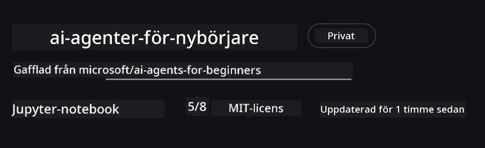
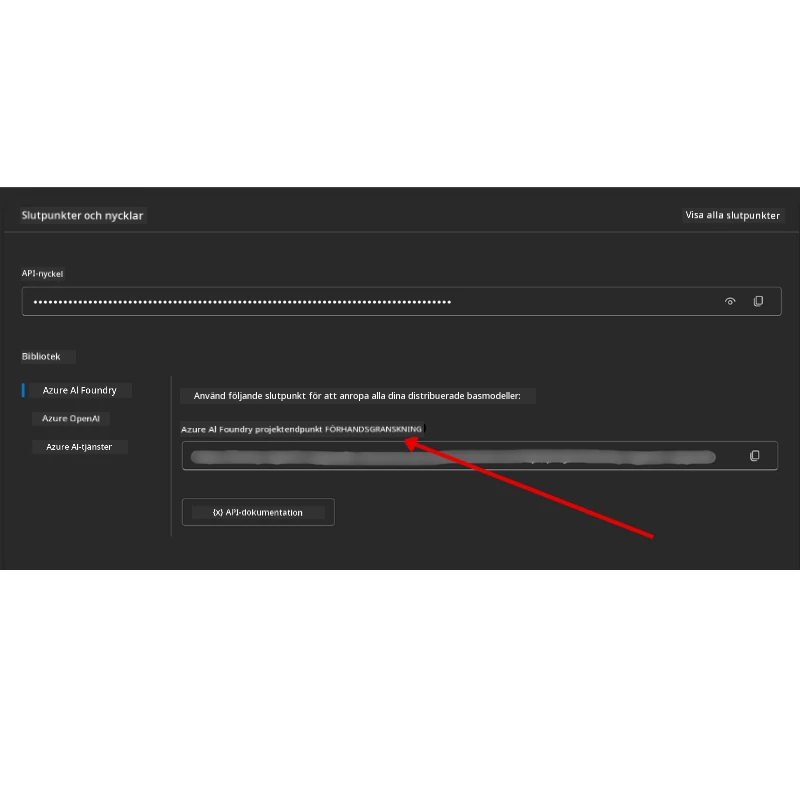

# Kursinställning

## Introduktion

Den här lektionen kommer att täcka hur man kör kodexemplen i den här kursen.

## Gå med andra lärande och få hjälp

Innan du börjar klona ditt repo, gå med i [AI Agents For Beginners Discord-kanalen](https://aka.ms/ai-agents/discord) för att få hjälp med installation, frågor om kursen eller för att koppla samman med andra som lär sig.

## Klona eller Forka detta Repo

För att börja, var god klona eller forka GitHub-repot. Detta gör så att du har din egen version av kursmaterialet för att kunna köra, testa och justera koden!

Detta kan göras genom att klicka på länken för att <a href="https://github.com/microsoft/ai-agents-for-beginners/fork" target="_blank">forka repot</a>

Du bör nu ha din egen forkade version av denna kurs på följande länk:



### Shallow Clone (rekommenderas för workshop / Codespaces)

  >Hela repot kan vara stort (~3 GB) när du laddar ner hela historiken och alla filer. Om du bara deltar i workshopen eller bara behöver några lektionsmappar, laddar en shallow clone (eller sparse clone) ner mycket mindre.

#### Snabb shallow clone — minimal historik, alla filer

Ersätt `<your-username>` i nedanstående kommandon med din fork-URL (eller upstream URL om du föredrar).

För att klona endast den senaste commit-historiken (liten nedladdning):

```bash
git clone --depth 1 https://github.com/<your-username>/ai-agents-for-beginners.git
```

För att klona en specifik branch:

```bash
git clone --depth 1 --branch <branch-name> https://github.com/<your-username>/ai-agents-for-beginners.git
```

#### Partiell (sparse) clone — minimala blobbar + endast valda mappar

Detta använder partial clone och sparse-checkout (kräver Git 2.25+ och rekommenderas med modern Git med partial clone-stöd):

```bash
git clone --depth 1 --filter=blob:none --sparse https://github.com/<your-username>/ai-agents-for-beginners.git
```

Gå in i repots mapp:

```bash
cd ai-agents-for-beginners
```

Specificera sedan vilka mappar du vill ha (exempel nedan visar två mappar):

```bash
git sparse-checkout set 00-course-setup 01-intro-to-ai-agents
```

Efter kloning och verifiering av filer, om du bara behöver filerna och vill frigöra plats (ingen git-historik), var god ta bort repots metadata (💀irreversibelt — du förlorar all Git-funktionalitet):

```bash
# zsh/bash
rm -rf .git
```

```powershell
# PowerShell
Remove-Item -Recurse -Force .git
```

#### Använda GitHub Codespaces (rekommenderas för att undvika stora lokala nedladdningar)

- Skapa en ny Codespace för detta repo via [GitHub UI](https://github.com/codespaces).  

- Kör i terminalen i den nyss skapade Codespacen ett av shallow/sparse clone-kommandona ovan för att hämta endast de lektionsmappar du behöver in i Codespace-arbetsytan.
- Valfritt: efter kloning i Codespaces, ta bort .git för att återta extra utrymme (se borttagningskommandon ovan).
- Observera: Om du föredrar att öppna repot direkt i Codespaces (utan extra kloning), var medveten om att Codespaces konstruerar devcontainer-miljön och kan fortfarande provisionera mer än du behöver.

#### Tips

- Byt alltid ut clone-URL till din fork om du vill redigera/committa.
- Om du senare behöver mer historik eller fler filer kan du hämta dem eller justera sparse-checkout för att inkludera fler mappar.

## Köra Koden

Den här kursen erbjuder en serie Jupyter Notebooks som du kan köra för att få praktisk erfarenhet av att bygga AI-agent.

Kodexemplen använder **Microsoft Agent Framework (MAF)** med `FoundryChatClient`, som kopplar till **Microsoft Foundry Agent Service V2** (Responses API) genom **Microsoft Foundry**.

Alla Python-notebooks är märkta `*-python-agent-framework.ipynb`.

## Krav

- Python 3.12+
  - **NOTERA**: Om du inte har Python 3.12 installerat, se till att installera det. Skapa sedan ditt virtuella miljö (venv) med python3.12 för att säkerställa att rätt versioner installeras från requirements.txt-filen.
  
    >Exempel

    Skapa Python venv-katalog:

    ```bash
    python -m venv venv
    ```

    Aktivera sedan venv-miljön för:

    ```bash
    # zsh/bash
    source venv/bin/activate
    ```
  
    ```dos
    # Command Prompt for Windows
    venv\Scripts\activate
    ```

- .NET 10+: För exempelkoden som använder .NET, säkerställ att du har installerat [.NET 10 SDK](https://dotnet.microsoft.com/download/dotnet/10.0) eller senare. Kontrollera sedan din installerade .NET SDK-version:

    ```bash
    dotnet --list-sdks
    ```

- **Azure CLI** — Krävs för autentisering. Installera från [aka.ms/installazurecli](https://aka.ms/installazurecli).
- **Azure-prenumeration** — För åtkomst till Microsoft Foundry och Microsoft Foundry Agent Service.
- **Microsoft Foundry-projekt** — Ett projekt med en distribuerad modell (t.ex. `gpt-5-mini`). Se [Steg 1](#steg-1-skapa-ett-microsoft-foundry-projekt) nedan.

Vi har inkluderat en `requirements.txt`-fil i root-mappen av detta repos som innehåller alla nödvändiga Python-paket för att köra kodexemplen.

Du kan installera dem genom att köra följande kommando i terminalen i repo-rooten:

```bash
pip install -r requirements.txt
```

Vi rekommenderar att skapa en Python virtuell miljö för att undvika konflikter och problem.

## Ställa in VSCode

Se till att du använder rätt Python-version i VSCode.


## Ställ in Microsoft Foundry och Microsoft Foundry Agent Service

### Steg 1: Skapa ett Microsoft Foundry-projekt

Du behöver ett Microsoft Foundry **hub** och **projekt** med en utplacerad modell för att kunna köra notebooks.

1. Gå till [ai.azure.com](https://ai.azure.com) och logga in med ditt Azure-konto.
2. Skapa en **hub** (eller använd en befintlig). Se: [Översikt över hub-resurser](https://learn.microsoft.com/azure/ai-foundry/concepts/ai-resources).
3. Skapa ett **projekt** i hubben.
4. Distribuera en modell (t.ex. `gpt-5-mini`) under **Models + Endpoints** → **Deploy model**.

### Steg 2: Hämta din projekts slutpunkt och modellutplaceringsnamn

Från ditt projekt i Microsoft Foundry-portalen:

- **Project Endpoint** — Gå till **Overview**-sidan och kopiera slutpunkts-URL:en.



- **Model Deployment Name** — Gå till **Models + Endpoints**, välj din utplacerade modell och notera **Deployment name** (t.ex. `gpt-5-mini`).

### Steg 3: Logga in på Azure med `az login`

De flesta notebooks autentiserar via din **Azure CLI-inloggning** — med `AzureCliCredential` eller `DefaultAzureCredential` (båda plockar upp din `az login`-session) från `azure-identity`-paketet — så de kräver inte API-nycklar. Några lektioner och valfria integrationer använder API-nycklar; kolla varje lektions förutsättningar för extra miljövariabler. Detta kräver att du är inloggad via Azure CLI.

1. **Installera Azure CLI** om du inte redan har det: [aka.ms/installazurecli](https://aka.ms/installazurecli)

2. **Logga in** genom att köra:

    ```bash
    az login
    ```

    Eller om du är i en fjärr-/Codespace-miljö utan webbläsare:

    ```bash
    az login --use-device-code
    ```

3. **Välj din prenumeration** om du blir tillfrågad — välj den som innehåller ditt Foundry-projekt.

4. **Verifiera** att du är inloggad:

    ```bash
    az account show
    ```

> **Varför `az login`?** Notebooks autentiserar med `AzureCliCredential` (eller `DefaultAzureCredential`, som också plockar upp din Azure CLI-inloggning) från `azure-identity`-paketet. Det innebär att din Azure CLI-session ger autentiseringsuppgifterna — inga API-nycklar eller hemligheter i din `.env`-fil. Detta är en [säkerhetsbästa praxis](https://learn.microsoft.com/azure/developer/ai/keyless-connections).

### Steg 4: Skapa din `.env`-fil

Kopiera exempel-filen:

```bash
# zsh/bash
cp .env.example .env
```

```powershell
# PowerShell
Copy-Item .env.example .env
```

Öppna `.env` och fyll i dessa två värden:

```env
AZURE_AI_PROJECT_ENDPOINT=https://<your-project>.services.ai.azure.com/api/projects/<your-project-id>
AZURE_AI_MODEL_DEPLOYMENT_NAME=gpt-5-mini
```

| Variabel | Var du hittar den |
|----------|-----------------|
| `AZURE_AI_PROJECT_ENDPOINT` | Foundry-portalen → ditt projekt → **Overview**-sidan |
| `AZURE_AI_MODEL_DEPLOYMENT_NAME` | Foundry-portalen → **Models + Endpoints** → din utplacerade modells namn |

Det är allt för de flesta lektioner! Notebooks autentiserar automatiskt genom din `az login`-session.

### Steg 5: Installera Python-beroenden

```bash
pip install -r requirements.txt
```

Vi rekommenderar att du kör detta inuti den virtuella miljö du skapade tidigare.

## Valfri installation: Azure AI Search (Lektion 5 och 16)

Lektion 5 (Agentic RAG) och Lektion 16-notebooks körs direkt med en **in-memory knowledge base** — inga extra Azure-resurser behövs. Om du vill stödja dem med en riktig **Azure AI Search**-index, notera att **Lektion 16-notebooken för närvarande använder nyckelbaserad autentisering**: den byter från in-memory sökning till Azure AI Search endast när **både** `AZURE_SEARCH_SERVICE_ENDPOINT` **och** `AZURE_SEARCH_API_KEY` är satta, annars används in-memory sökning — så för att köra mot ett riktigt index måste du också sätta admin-nyckeln. Nyckellös autentisering med Microsoft Entra ID (RBAC) är det rekommenderade tillvägagångssättet för din egen produktionskod, i linje med `az login`-flödet som används i resten av kursen.

Stegen med RBAC nedan gäller för installationsguideexemplen och din egen kod. De möjliggör inte nyckellös autentisering i Lektion 16-notebooken; Lektion 16 kräver fortfarande både slutpunkten och adminnyckeln för att använda Azure AI Search.

1. **Aktivera rollbaserad åtkomst** på din söktjänst:

    ```bash
    az search service update --name <service-name> --resource-group <resource-group> --auth-options aadOrApiKey
    ```

2. **Tilldela dig själv nödvändiga roller** (skapa/ladda index och fråga):

    ```bash
    az role assignment create --assignee <your-user-or-principal-id> --role "Search Service Contributor" --scope $(az search service show -g <resource-group> -n <service-name> --query id -o tsv)
    az role assignment create --assignee <your-user-or-principal-id> --role "Search Index Data Contributor" --scope $(az search service show -g <resource-group> -n <service-name> --query id -o tsv)
    ```

3. **Lägg till slutpunkten** i din `.env`-fil:

| Variabel | Var du hittar den |
|----------|-----------------|
| `AZURE_SEARCH_SERVICE_ENDPOINT` | Azure-portalen → din **Azure AI Search**-resurs → **Overview** → URL |
| `AZURE_SEARCH_API_KEY` | Krävs (med slutpunkten) för att aktivera Azure AI Search i Lektion 16-notebooken som använder nyckelbaserad autentisering. Azure-portalen → **Settings** → **Keys** → primär admin-nyckel |

> **Varför nyckellöst?** Admin-nycklar ger full skrivåtkomst till din söktjänst och kan läcka via `.env`-filer. Med RBAC används istället din `az login`-identitet — samma nyckellösa Entra ID-mönster som kursens notebooks använder (via `AzureCliCredential` / `DefaultAzureCredential`). Se [Anslut till Azure AI Search med roller](https://learn.microsoft.com/azure/search/search-security-rbac).

Se [Azure AI Search installationsguide](./AzureSearch.md) för fullständiga exempel på indexskapande i Python och .NET.

## Ytterligare inställning för lektioner som anropar Azure OpenAI direkt (Lektion 6 och 8)

Vissa notebooks i lektion 6 och 8 anropar **Azure OpenAI** direkt (med **Responses API**) istället för via ett Microsoft Foundry-projekt. Dessa exempel använde tidigare GitHub Models, vilket är föråldrat och inte stöder Responses API. Lägg till dessa variabler i din `.env`-fil:

| Variabel | Var du hittar den |
|----------|-----------------|
| `AZURE_OPENAI_ENDPOINT` | Azure-portalen → din **Azure OpenAI**-resurs → **Keys and Endpoint** → Endpoint (t.ex. `https://<your-resource>.openai.azure.com`) |
| `AZURE_OPENAI_DEPLOYMENT` | Namnet på din utplacerade modell (t.ex. `gpt-5-mini`) som stöder Responses API |
| `AZURE_OPENAI_API_KEY` | Valfritt — endast om du använder nyckelbaserad autentisering istället för `az login` / Entra ID |

> Responses API använder den stabila `/openai/v1/`-slutpunkten, så ingen `api-version` krävs. Logga in med `az login` för att använda nyckellös Entra ID-autentisering.

## Alternativ leverantör: MiniMax (OpenAI-kompatibel)

[MiniMax](https://platform.minimaxi.com/) tillhandahåller stora kontextmodeller (upp till 204K tokens) via ett OpenAI-kompatibelt API. Eftersom Microsoft Agent Frameworks `OpenAIChatClient` fungerar med vilken OpenAI-kompatibel slutpunkt som helst, kan du använda MiniMax som ett drop-in-alternativ för lektioner som använder `OpenAIChatClient`.

Lägg till dessa variabler i din `.env`-fil:

| Variabel | Var du hittar den |
|----------|-----------------|
| `MINIMAX_API_KEY` | [MiniMax Platform](https://platform.minimaxi.com/) → API-nycklar |
| `MINIMAX_BASE_URL` | Använd `https://api.minimax.io/v1` (standardvärde) |
| `MINIMAX_MODEL_ID` | Modellnamn att använda (t.ex. `MiniMax-M3`) |

**Exempelmodeller**: `MiniMax-M3` (rekommenderad), `MiniMax-M2.7`, `MiniMax-M2.7-highspeed` (snabbare svar). Modellnamn och tillgång kan förändras över tid, och tillgång till en viss modell kan bero på ditt konto.

Kodexemplen som använder `OpenAIChatClient` (t.ex. lektion 14:s hotellbokningsflöde) kommer automatiskt att detektera och använda din MiniMax-konfiguration när `MINIMAX_API_KEY` är satt.


## Alternativ leverantör: Foundry Local (Kör modeller på enheten)

[Foundry Local](https://foundrylocal.ai) är en lättvikts runtime som laddar ner, hanterar och serverar språkmodeller **helt på din egen maskin** genom en OpenAI-kompatibel API — ingen moln krävs.

Eftersom Microsoft Agent Frameworks `OpenAIChatClient` fungerar med vilken OpenAI-kompatibel slutpunkt som helst, är Foundry Local ett insättningsbart lokalt alternativ till Azure OpenAI.

**1. Installera Foundry Local**

```bash
# Windows
winget install Microsoft.FoundryLocal

# macOS
brew install foundrylocal
```

**2. Ladda ner och kör en modell** (detta startar också den lokala tjänsten):

```bash
foundry model list          # se tillgängliga modeller
foundry model run phi-4-mini
```

**3. Installera Python SDK** som används för att upptäcka den lokala slutpunkten:

```bash
pip install foundry-local-sdk
```

**4. Rikta Microsoft Agent Framework mot din lokala modell:**

```python
from foundry_local import FoundryLocalManager
from agent_framework.openai import OpenAIChatClient

# Laddar ner (om det behövs) och tillhandahåller modellen lokalt, sedan upptäcker endpoint/port.
manager = FoundryLocalManager("phi-4-mini")

chat_client = OpenAIChatClient(
    base_url=manager.endpoint,      # t.ex. http://localhost:<port>/v1
    api_key=manager.api_key,        # alltid "not-required" för Foundry Local
    model_id=manager.get_model_info("phi-4-mini").id,
)

agent = chat_client.as_agent(
    name="LocalAgent",
    instructions="You are a helpful assistant running fully on-device.",
)
```

> **Observera:** Foundry Local exponerar en OpenAI-kompatibel **Chat Completions**-slutpunkt. Använd den för lokal utveckling och offline-scenarier. För hela funktionaliteten i **Responses API** (tillståndsbaserade konversationer osv.), använd Azure OpenAI eller ett Microsoft Foundry-projekt.

## Ytterligare inställningar för Lektion 8 (Bing Grounding Workflow)

Det villkorade arbetsflödes-anteckningsboken i lektion 8 använder **Bing grounding** via Microsoft Foundry. Om du planerar att köra det exemplet, lägg till denna variabel i din `.env`-fil:

| Variabel | Var du hittar den |
|----------|--------------------|
| `BING_CONNECTION_ID` | Microsoft Foundry-portal → ditt projekt → **Management** → **Connected resources** → din Bing-anslutning → kopiera anslutnings-ID |

## Felsökning

### SSL-certifikatverifieringsfel på macOS

Om du är på macOS och stöter på ett fel som:

```plaintext
ssl.SSLCertVerificationError: [SSL: CERTIFICATE_VERIFY_FAILED] certificate verify failed: self-signed certificate in certificate chain
```

Detta är ett känt problem med Python på macOS där systemets SSL-certifikat inte automatiskt litas på. Prova följande lösningar i ordning:

**Alternativ 1: Kör Pythons Install Certificates-skript (rekommenderas)**

```bash
# Ersätt 3.XX med din installerade Python-version (t.ex. 3.12 eller 3.13):
/Applications/Python\ 3.XX/Install\ Certificates.command
```

**Alternativ 2: Använd `connection_verify=False` i din anteckningsbok (endast för GitHub Models-anteckningsböcker)**

I Lektion 6-anteckningsboken (`06-building-trustworthy-agents/code_samples/06-system-message-framework.ipynb`) finns en utkommenterad lösning redan inkluderad. Avkommentera `connection_verify=False` när du får certifikatfel:

```python
client = ChatCompletionsClient(
    endpoint=endpoint,
    credential=AzureKeyCredential(token),
    connection_verify=False,  # Inaktivera SSL-verifiering om du stöter på certifikatfel
)
```

> **⚠️ Varning:** Att inaktivera SSL-verifiering (`connection_verify=False`) minskar säkerheten genom att hoppa över certifikatvalidering. Använd detta endast som en tillfällig lösning i utvecklingsmiljöer. Använd det aldrig i produktion.

**Alternativ 3: Installera och använd `truststore`**

```bash
pip install truststore
```

Lägg sedan till följande högst upp i din anteckningsbok eller skript innan du gör några nätverksanrop:

```python
import truststore
truststore.inject_into_ssl()
```

## Fast någonstans?

Om du har problem med att köra denna installation, hoppa in i vår <a href="https://discord.gg/kzRShWzttr" target="_blank">Azure AI Community Discord</a> eller <a href="https://github.com/microsoft/ai-agents-for-beginners/issues?WT.mc_id=academic-105485-koreyst" target="_blank">skapa ett ärende</a>.

## Nästa lektion

Du är nu redo att köra koden för denna kurs. Lycka till med att lära dig mer om AI-agenter!

[Introduktion till AI-agenter och agentanvändningsfall](../01-intro-to-ai-agents/README.md)

---

<!-- CO-OP TRANSLATOR DISCLAIMER START -->
**Ansvarsfriskrivning**:
Detta dokument har översatts med hjälp av AI-översättningstjänsten [Co-op Translator](https://github.com/Azure/co-op-translator). Även om vi strävar efter noggrannhet, var vänlig notera att automatiska översättningar kan innehålla fel eller brister. Det ursprungliga dokumentet på dess modersmål bör betraktas som den auktoritativa källan. För kritisk information rekommenderas professionell mänsklig översättning. Vi ansvarar inte för några missförstånd eller feltolkningar som uppstår till följd av användningen av denna översättning.
<!-- CO-OP TRANSLATOR DISCLAIMER END -->