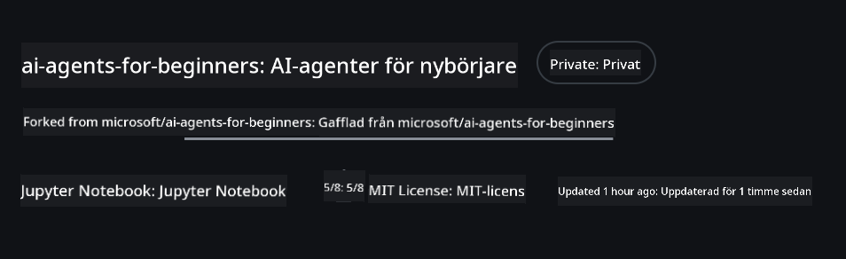
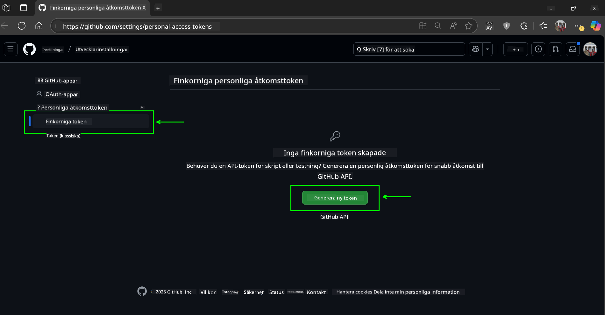
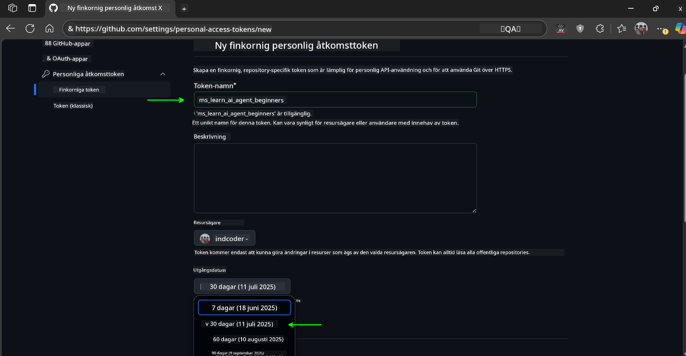
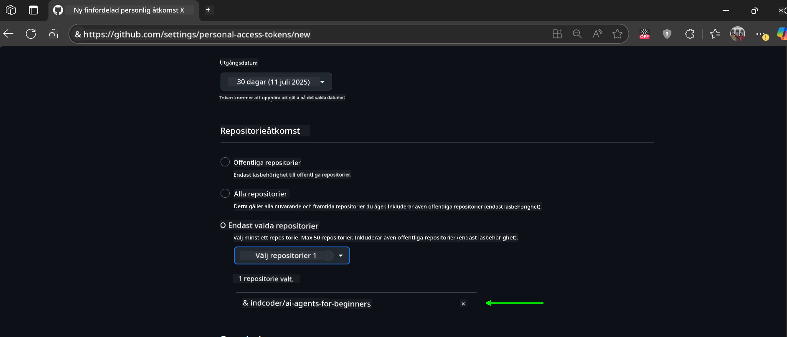
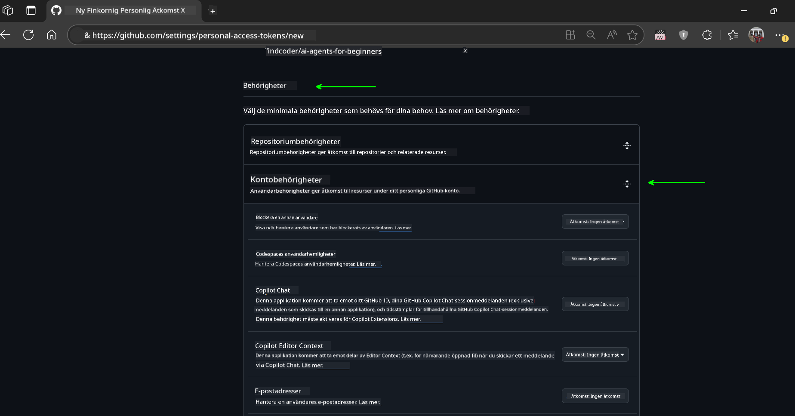
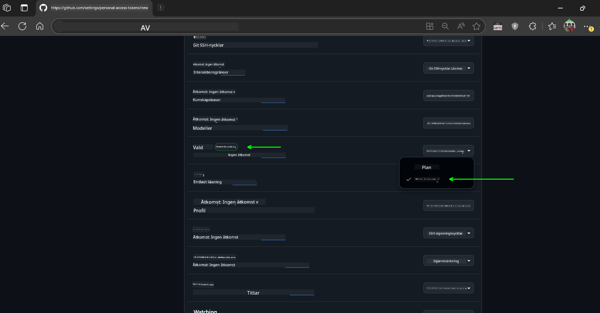
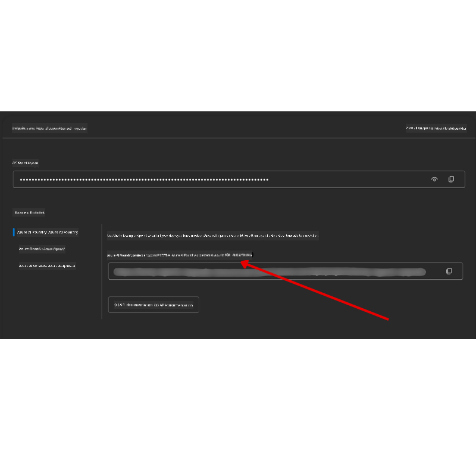

<!--
CO_OP_TRANSLATOR_METADATA:
{
  "original_hash": "c6a79c8f2b56a80370ff7e447765524f",
  "translation_date": "2025-07-24T08:28:29+00:00",
  "source_file": "00-course-setup/README.md",
  "language_code": "sv"
}
-->
# Kursinställning

## Introduktion

Den här lektionen kommer att gå igenom hur du kör kodexemplen i den här kursen.

## Klona eller Forka detta Repo

För att börja, vänligen klona eller forka GitHub-repositoriet. Detta skapar din egen version av kursmaterialet så att du kan köra, testa och anpassa koden!

Detta kan göras genom att klicka på länken till

Du bör nu ha din egen forkade version av denna kurs på följande länk:



## Köra koden

Den här kursen erbjuder en serie Jupyter Notebooks som du kan använda för att få praktisk erfarenhet av att bygga AI-agenter.

Kodexemplen använder antingen:

**Kräver GitHub-konto - Gratis**:

1) Semantic Kernel Agent Framework + GitHub Models Marketplace. Märkt som (semantic-kernel.ipynb)  
2) AutoGen Framework + GitHub Models Marketplace. Märkt som (autogen.ipynb)

**Kräver Azure-prenumeration**:  
3) Azure AI Foundry + Azure AI Agent Service. Märkt som (azureaiagent.ipynb)

Vi uppmuntrar dig att testa alla tre typer av exempel för att se vilket som fungerar bäst för dig.

Oavsett vilket alternativ du väljer kommer det att avgöra vilka installationssteg du behöver följa nedan:

## Krav

- Python 3.12+  
  - **OBS**: Om du inte har Python 3.12 installerat, se till att installera det. Skapa sedan din venv med python3.12 för att säkerställa att rätt versioner installeras från requirements.txt-filen.
- Ett GitHub-konto - För åtkomst till GitHub Models Marketplace
- Azure-prenumeration - För åtkomst till Azure AI Foundry
- Azure AI Foundry-konto - För åtkomst till Azure AI Agent Service

Vi har inkluderat en `requirements.txt`-fil i roten av detta repo som innehåller alla nödvändiga Python-paket för att köra kodexemplen.

Du kan installera dem genom att köra följande kommando i din terminal i repo-rotkatalogen:

```bash
pip install -r requirements.txt
```

Vi rekommenderar att du skapar en Python-virtuell miljö för att undvika konflikter och problem.

## Installera VSCode

Se till att du använder rätt version av Python i VSCode.


## Inställning för exempel med GitHub-modeller

### Steg 1: Hämta din GitHub Personal Access Token (PAT)

Den här kursen använder GitHub Models Marketplace, som ger gratis åtkomst till Large Language Models (LLMs) som du kommer att använda för att bygga AI-agenter.

För att använda GitHub-modellerna behöver du skapa en [GitHub Personal Access Token](https://docs.github.com/en/authentication/keeping-your-account-and-data-secure/managing-your-personal-access-tokens).

Detta kan göras genom att gå till ditt GitHub-konto.

Följ [Principen om Minsta Privilegium](https://docs.github.com/en/get-started/learning-to-code/storing-your-secrets-safely) när du skapar din token. Detta innebär att du endast ska ge token de behörigheter som krävs för att köra kodexemplen i den här kursen.

1. Välj alternativet `Fine-grained tokens` på vänster sida av skärmen.

    Klicka sedan på `Generate new token`.

    

1. Ange ett beskrivande namn för din token som återspeglar dess syfte, så att den är lätt att identifiera senare. Ställ in ett utgångsdatum (rekommenderat: 30 dagar; du kan välja en kortare period som 7 dagar om du föredrar en säkrare inställning).

    

1. Begränsa tokenens räckvidd till din fork av detta repo.

    

1. Begränsa tokenens behörigheter: Under **Permissions**, växla till **Account Permissions**, navigera till **Models** och aktivera endast den läsbehörighet som krävs för GitHub-modeller.

    

    

Kopiera din nya token som du just har skapat. Du kommer nu att lägga till denna i din `.env`-fil som ingår i denna kurs.

### Steg 2: Skapa din `.env`-fil

För att skapa din `.env`-fil, kör följande kommando i din terminal.

```bash
cp .env.example .env
```

Detta kopierar exempel-filen och skapar en `.env` i din katalog där du fyller i värdena för miljövariablerna.

Med din token kopierad, öppna `.env`-filen i din favorittextredigerare och klistra in din token i fältet `GITHUB_TOKEN`.

Du bör nu kunna köra kodexemplen i den här kursen.

## Inställning för exempel med Azure AI Foundry och Azure AI Agent Service

### Steg 1: Hämta din Azure-projektendpoint

Följ stegen för att skapa en hubb och ett projekt i Azure AI Foundry som finns här: [Hub resources overview](https://learn.microsoft.com/en-us/azure/ai-foundry/concepts/ai-resources)

När du har skapat ditt projekt behöver du hämta anslutningssträngen för ditt projekt.

Detta kan göras genom att gå till **Översikt**-sidan för ditt projekt i Azure AI Foundry-portalen.



### Steg 2: Skapa din `.env`-fil

För att skapa din `.env`-fil, kör följande kommando i din terminal.

```bash
cp .env.example .env
```

Detta kopierar exempel-filen och skapar en `.env` i din katalog där du fyller i värdena för miljövariablerna.

Med din token kopierad, öppna `.env`-filen i din favorittextredigerare och klistra in din token i fältet `PROJECT_ENDPOINT`.

### Steg 3: Logga in på Azure

Som en säkerhetsbästa praxis kommer vi att använda [nyckellös autentisering](https://learn.microsoft.com/azure/developer/ai/keyless-connections?tabs=csharp%2Cazure-cli?WT.mc_id=academic-105485-koreyst) för att autentisera till Azure OpenAI med Microsoft Entra ID.

Öppna sedan en terminal och kör `az login --use-device-code` för att logga in på ditt Azure-konto.

När du har loggat in, välj din prenumeration i terminalen.

## Ytterligare miljövariabler - Azure Search och Azure OpenAI

För lektionen Agentic RAG - Lektion 5 - finns det exempel som använder Azure Search och Azure OpenAI.

Om du vill köra dessa exempel måste du lägga till följande miljövariabler i din `.env`-fil:

### Översiktssida (Projekt)

- `AZURE_SUBSCRIPTION_ID` - Kontrollera **Projektinformation** på **Översikt**-sidan för ditt projekt.
- `AZURE_AI_PROJECT_NAME` - Titta högst upp på **Översikt**-sidan för ditt projekt.
- `AZURE_OPENAI_SERVICE` - Hitta detta under fliken **Inkluderade funktioner** för **Azure OpenAI Service** på **Översikt**-sidan.

### Hanteringscenter

- `AZURE_OPENAI_RESOURCE_GROUP` - Gå till **Projektinställningar** på **Översikt**-sidan för **Hanteringscenter**.
- `GLOBAL_LLM_SERVICE` - Under **Anslutna resurser**, hitta anslutningsnamnet för **Azure AI Services**. Om det inte listas, kontrollera **Azure-portalen** under din resursgrupp för AI-tjänstens resursnamn.

### Modeller + Endpoints-sida

- `AZURE_OPENAI_EMBEDDING_DEPLOYMENT_NAME` - Välj din inbäddningsmodell (t.ex. `text-embedding-ada-002`) och notera **Deploymentsnamnet** från modellinformationen.
- `AZURE_OPENAI_CHAT_DEPLOYMENT_NAME` - Välj din chattmodell (t.ex. `gpt-4o-mini`) och notera **Deploymentsnamnet** från modellinformationen.

### Azure Portal

- `AZURE_OPENAI_ENDPOINT` - Leta efter **Azure AI-tjänster**, klicka på det, gå sedan till **Resurshantering**, **Nycklar och Endpoint**, scrolla ner till "Azure OpenAI endpoints" och kopiera den som säger "Language APIs".
- `AZURE_OPENAI_API_KEY` - Från samma skärm, kopiera KEY 1 eller KEY 2.
- `AZURE_SEARCH_SERVICE_ENDPOINT` - Hitta din **Azure AI Search**-resurs, klicka på den och se **Översikt**.
- `AZURE_SEARCH_API_KEY` - Gå sedan till **Inställningar** och sedan **Nycklar** för att kopiera den primära eller sekundära administratörsnyckeln.

### Extern webbsida

- `AZURE_OPENAI_API_VERSION` - Besök sidan [API-versionens livscykel](https://learn.microsoft.com/en-us/azure/ai-services/openai/api-version-deprecation#latest-ga-api-release) under **Senaste GA API-versionen**.

### Ställ in nyckellös autentisering

Istället för att hårdkoda dina autentiseringsuppgifter kommer vi att använda en nyckellös anslutning med Azure OpenAI. För att göra detta kommer vi att importera `DefaultAzureCredential` och senare anropa funktionen `DefaultAzureCredential` för att få autentiseringen.

```python
from azure.identity import DefaultAzureCredential, InteractiveBrowserCredential
```

## Fastnat någonstans?

Om du stöter på problem med att köra denna installation, gå med i vår

eller

## Nästa lektion

Du är nu redo att köra koden för den här kursen. Lycka till med att lära dig mer om AI-agenter!

[Introduktion till AI-agenter och användningsfall](../01-intro-to-ai-agents/README.md)

**Ansvarsfriskrivning**:  
Detta dokument har översatts med hjälp av AI-översättningstjänsten [Co-op Translator](https://github.com/Azure/co-op-translator). Även om vi strävar efter noggrannhet, bör du vara medveten om att automatiserade översättningar kan innehålla fel eller inexaktheter. Det ursprungliga dokumentet på dess originalspråk bör betraktas som den auktoritativa källan. För kritisk information rekommenderas professionell mänsklig översättning. Vi ansvarar inte för eventuella missförstånd eller feltolkningar som uppstår vid användning av denna översättning.