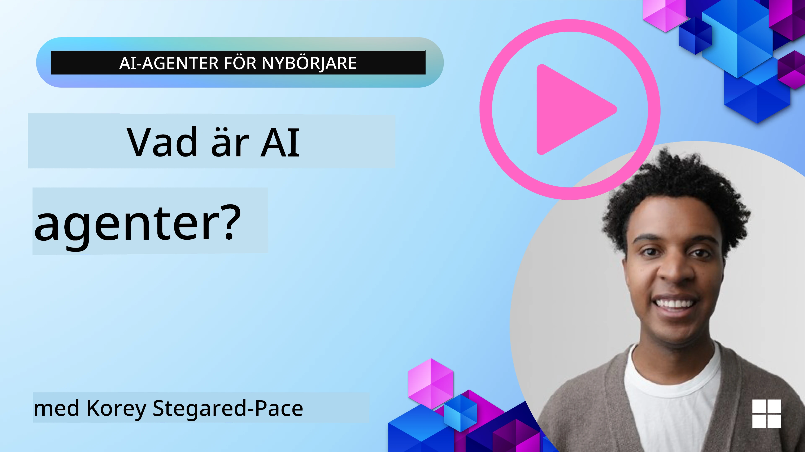
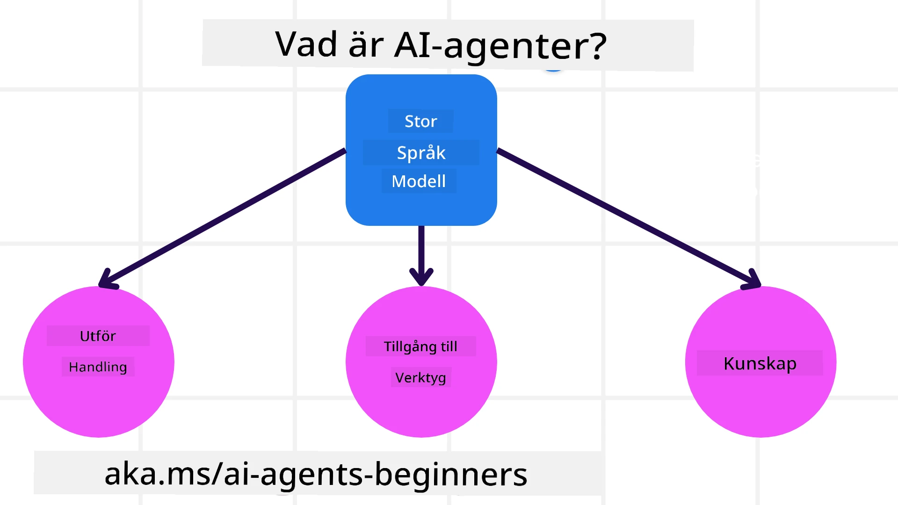
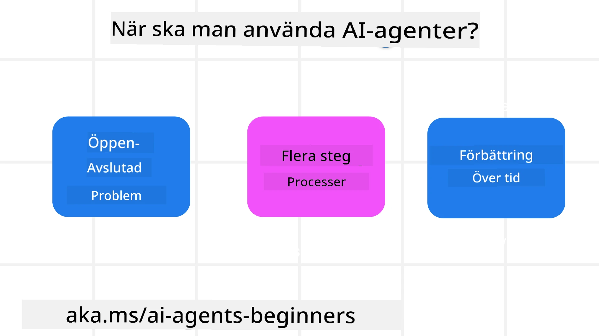

> _(Klicka på bilden ovan för att titta på videon för den här lektionen)_

# Introduktion till AI‑agenter och användningsfall för agenter

Välkommen till kursen "AI Agents for Beginners"! Denna kurs ger grundläggande kunskap och praktiska exempel för att bygga AI‑agenter.

Gå med i <a href="https://discord.gg/kzRShWzttr" target="_blank">Azure AI Discord Community</a> för att träffa andra studerande och AI‑agentbyggare och ställa frågor om kursen.

För att börja kursen börjar vi med att skapa en bättre förståelse för vad AI‑agenter är och hur vi kan använda dem i de tillämpningar och arbetsflöden vi bygger.

## Introduktion

Denna lektion täcker:

- Vad är AI‑agenter och vilka olika typer av agenter finns det?
- Vilka användningsfall lämpar sig bäst för AI‑agenter och hur kan de hjälpa oss?
- Vilka är några av de grundläggande byggstenarna vid utformning av agentiska lösningar?

## Lärandemål
Efter att ha genomfört denna lektion ska du kunna:

- Förstå begreppen kring AI‑agenter och hur de skiljer sig från andra AI‑lösningar.
- Tillämpa AI‑agenter på ett effektivt sätt.
- Designa agentiska lösningar produktivt för både användare och kunder.

## Definition av AI‑agenter och typer av AI‑agenter

### Vad är AI‑agenter?

AI‑agenter är **system** som gör det möjligt för **Stora språkmodeller(LLMs)** att **utföra åtgärder** genom att utöka deras förmågor och ge LLMs **åtkomst till verktyg** och **kunskap**.

Låt oss dela upp den här definitionen i mindre delar:

- **System** - Det är viktigt att se agenter inte som bara en enskild komponent utan som ett system av många komponenter. På en grundläggande nivå är komponenterna i en AI‑agent:
  - **Environment** - Den definierade miljön där AI‑agenten verkar. Till exempel, om vi hade en reseboknings‑AI‑agent, kunde miljön vara resebokningssystemet som AI‑agenten använder för att slutföra uppgifter.
  - **Sensors** - Miljöer innehåller information och ger återkoppling. AI‑agenter använder sensorer för att samla in och tolka denna information om det aktuella tillståndet i miljön. I resebokningsagentexemplet kan bokningssystemet tillhandahålla information som hotelltillgänglighet eller flygpriser.
  - **Actuators** - När AI‑agenten har mottagit det aktuella tillståndet i miljön bestämmer agenten, för den aktuella uppgiften, vilken åtgärd som ska utföras för att förändra miljön. För resebokningsagenten kan det vara att boka ett tillgängligt rum åt användaren.

**Stora språkmodeller** - Begreppet agenter fanns innan LLMs skapades. Fördelen med att bygga AI‑agenter med LLMs är deras förmåga att tolka människors språk och data. Denna förmåga gör det möjligt för LLMs att tolka information från miljön och utforma en plan för att förändra miljön.

**Utföra åtgärder** - Utanför AI‑agentsystem är LLMs begränsade till situationer där åtgärden är att generera innehåll eller information baserat på en användares prompt. Inom AI‑agentsystem kan LLMs utföra uppgifter genom att tolka användarens begäran och använda verktyg som finns tillgängliga i deras miljö.

**Åtkomst till verktyg** - Vilka verktyg LLM har åtkomst till definieras av 1) den miljö den verkar i och 2) utvecklaren av AI‑agenten. I vårt reseagentexempel begränsas agentens verktyg av de operationer som finns tillgängliga i bokningssystemet, och/eller kan utvecklaren begränsa agentens verktygsåtkomst till flyg.

**Minne+Kunskap** - Minne kan vara kortsiktigt i kontexten av konversationen mellan användaren och agenten. På lång sikt, utanför den information som tillhandahålls av miljön, kan AI‑agenter också hämta kunskap från andra system, tjänster, verktyg och till och med andra agenter. I reseagentexemplet kan denna kunskap vara information om användarens resepreferenser som finns i en kunddatabas.

### De olika typerna av agenter

Nu när vi har en generell definition av AI‑agenter, låt oss titta på några specifika agenttyper och hur de skulle tillämpas på en reseboknings‑AI‑agent.

| **Agenttyp**                | **Beskrivning**                                                                                                                       | **Exempel**                                                                                                                                                                                                                   |
| ----------------------------- | ------------------------------------------------------------------------------------------------------------------------------------- | ----------------------------------------------------------------------------------------------------------------------------------------------------------------------------------------------------------------------------- |
| **Enkla reflexagenter**      | Utför omedelbara åtgärder baserat på fördefinierade regler.                                                                                  | Reseagenten tolkar kontexten i e‑posten och vidarebefordrar reseklagomål till kundtjänst.                                                                                                                          |
| **Modelbaserade reflexagenter** | Utför åtgärder baserade på en modell av världen och förändringar i den modellen.                                                              | Reseagenten prioriterar rutter med betydande prisförändringar baserat på tillgång till historiska prisdata.                                                                                                             |
| **Målbaserade agenter**         | Skapar planer för att uppnå specifika mål genom att tolka målet och bestämma åtgärder för att nå det.                                  | Reseagenten bokar en resa genom att avgöra nödvändiga researrangemang (bil, kollektivtrafik, flyg) från aktuell plats till destinationen.                                                                                |
| **Nyttobaserade agenter**      | Tar hänsyn till preferenser och väger avvägningar numeriskt för att avgöra hur man uppnår mål.                                               | Reseagenten maximerar nytta genom att väga bekvämlighet mot kostnad vid bokning av resor.                                                                                                                                          |
| **Lärande agenter**           | Förbättras över tiden genom att reagera på feedback och justera åtgärder därefter.                                                        | Reseagenten förbättras genom att använda kundfeedback från enkäter efter resan för att justera framtida bokningar.                                                                                                               |
| **Hierarkiska agenter**       | Innehåller flera agenter i ett flernivås system, där agenter på högre nivå delar upp uppgifter i deluppgifter som agenter på lägre nivå fullföljer. | Reseagenten avbokar en resa genom att dela upp uppgiften i deluppgifter (till exempel avbokning av specifika bokningar) och låter agenter på lägre nivå utföra dem och rapportera tillbaka till agenten på högre nivå.                                     |
| **Fleragentsystem (MAS)** | Agenter fullföljer uppgifter oberoende, antingen i samarbete eller i konkurrens.                                                           | Samarbete: Flera agenter bokar specifika resetjänster såsom hotell, flyg och nöjen. Konkurrens: Flera agenter hanterar och konkurrerar om en gemensam hotellbokningskalender för att boka kunder till hotellet. |

## När man ska använda AI‑agenter

I föregående avsnitt använde vi användningsfallet reseagent för att förklara hur olika typer av agenter kan användas i olika situationer vid resebokning. Vi kommer att fortsätta använda denna tillämpning genom hela kursen.

Låt oss titta på vilka typer av användningsfall som AI‑agenter lämpar sig bäst för:

- **Öppna problem** - att låta LLM avgöra nödvändiga steg för att slutföra en uppgift eftersom det inte alltid kan hårdkodas i ett arbetsflöde.
- **Flerstegsprocesser** - uppgifter som kräver en komplexitet där AI‑agenten behöver använda verktyg eller information över flera omgångar istället för enstaka hämtning.  
- **Förbättring över tid** - uppgifter där agenten kan förbättras över tiden genom att ta emot feedback från antingen sin miljö eller användare för att ge bättre nytta.

Vi tar upp fler överväganden kring användningen av AI‑agenter i lektionen Bygga trovärdiga AI‑agenter.

## Grundläggande om agentiska lösningar

### Agentutveckling

Det första steget i att utforma ett AI‑agentsystem är att definiera verktyg, åtgärder och beteenden. I den här kursen fokuserar vi på att använda den **Azure AI Agent Service** för att definiera våra agenter. Den erbjuder funktioner som:

- Val av öppna modeller såsom OpenAI, Mistral och Llama
- Användning av licensierad data via leverantörer såsom Tripadvisor
- Användning av standardiserade OpenAPI 3.0‑verktyg

### Agentiska mönster

Kommunikation med LLMs sker genom prompts. Med tanke på AI‑agenternas semi‑autonoma natur är det inte alltid möjligt eller nödvändigt att manuellt om‑prompta LLM efter en förändring i miljön. Vi använder **agentiska mönster** som gör att vi kan prompta LLM över flera steg på ett mer skalbart sätt.

Denna kurs är indelad i några av de nu populära agentiska mönstren.

### Agentiska ramverk

Agentiska ramverk gör det möjligt för utvecklare att implementera agentiska mönster via kod. Dessa ramverk erbjuder mallar, plugins och verktyg för bättre samarbete mellan AI‑agenter. Dessa fördelar ger möjligheter till bättre observerbarhet och felsökning av AI‑agentsystem.

I den här kursen kommer vi att utforska Microsoft Agent Framework (MAF) för att bygga produktionsfärdiga AI‑agenter.

## Exempelkoder

- Python: [Agent Framework](./code_samples/01-python-agent-framework.ipynb)
- .NET: [Agent Framework](./code_samples/01-dotnet-agent-framework.md)

## Fler frågor om AI‑agenter?

Gå med i [Microsoft Foundry Discord](https://aka.ms/ai-agents/discord) för att träffa andra studerande, delta i drop‑in‑timmar och få dina frågor om AI‑agenter besvarade.

## Föregående lektion

[Kursupplägg](../00-course-setup/README.md)

## Nästa lektion

[Utforska agentiska ramverk](../02-explore-agentic-frameworks/README.md)

---

<!-- CO-OP TRANSLATOR DISCLAIMER START -->
Ansvarsfriskrivning:
Detta dokument har översatts med hjälp av AI-översättningstjänsten Co-op Translator (https://github.com/Azure/co-op-translator). Även om vi strävar efter noggrannhet bör du vara medveten om att automatiska översättningar kan innehålla fel eller brister. Det ursprungliga dokumentet på dess originalspråk ska betraktas som den auktoritativa källan. För kritisk information rekommenderas professionell mänsklig översättning. Vi ansvarar inte för eventuella missförstånd eller feltolkningar som uppstår vid användning av denna översättning.
<!-- CO-OP TRANSLATOR DISCLAIMER END -->