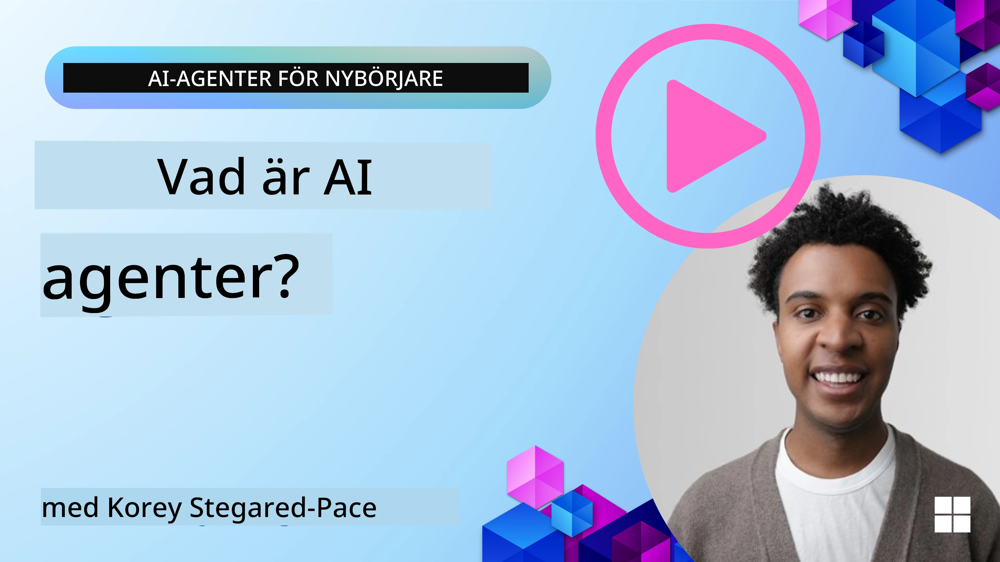
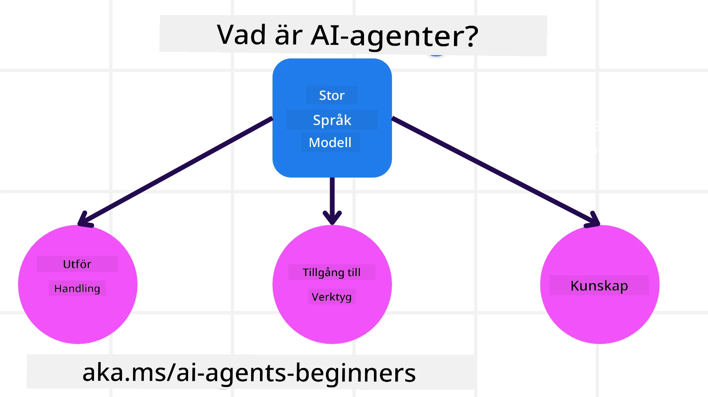
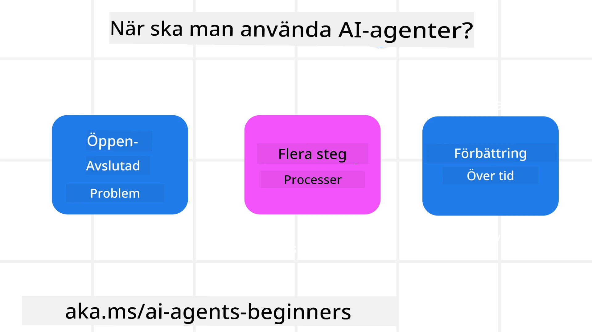

> _(Klicka på bilden ovan för att titta på videon till denna lektion)_

# Introduktion till AI-agenter och användningsfall för agenter

Välkommen till kursen **AI-agenter för nybörjare**! Den här kursen ger dig grundläggande kunskaper — och fungerande kod — för att börja bygga AI-agenter från grunden.

Häng gärna med och säg hej i <a href="https://discord.gg/kzRShWzttr" target="_blank">Azure AI Discord Community</a> — det är fullt av lärande och AI-byggherrar som gärna svarar på frågor.

Innan vi börjar bygga, låt oss först vara säkra på att vi faktiskt förstår vad en AI-agent *är* och när det är rimligt att använda en.

---

## Introduktion

Denna lektion tar upp:

- Vad AI-agenter är och vilka olika typer som finns
- Vilka typer av uppgifter AI-agenter är bäst lämpade för
- De grundläggande byggstenarna du använder när du designar en agentlösning

## Lärandemål

Efter den här lektionen bör du kunna:

- Förklara vad en AI-agent är och hur den skiljer sig från en vanlig AI-lösning
- Veta när du ska använda en AI-agent (och när du inte ska)
- Skissa en grundläggande agentlösningsdesign för ett verkligt problem

---

## Definition av AI-agenter och typer av AI-agenter

### Vad är AI-agenter?

Här är ett enkelt sätt att tänka på det:

> **AI-agenter är system som låter stora språkmodeller (LLM) faktiskt *göra saker* — genom att ge dem verktyg och kunskap för att agera i världen, inte bara svara på frågor.**

Låt oss bryta ner det lite:

- **System** — En AI-agent är inte bara en sak. Det är en samling delar som arbetar tillsammans. I grunden har varje agent tre delar:
  - **Miljö** — Den plats agenten arbetar i. För en resebokningsagent är det själva bokningsplattformen.
  - **Sensorer** — Hur agenten läser av det aktuella tillståndet i sin miljö. Vår reseagent kan kolla hotellbokningar eller flygpriser.
  - **Aktuatorer** — Hur agenten tar action. Resagenten kan boka ett rum, skicka en bekräftelse eller avboka en reservation.

- **Stora språkmodeller** — Agenter fanns innan LLM, men det är LLM som gör moderna agenter så kraftfulla. De kan förstå naturligt språk, resonera om sammanhang och omvandla en vag användarförfrågan till en konkret plan.

- **Utföra handlingar** — Utan ett agentsystem genererar en LLM bara text. Inuti ett agentsystem kan LLM faktiskt *utföra* steg — söka i en databas, anropa ett API, skicka ett meddelande.

- **Tillgång till verktyg** — Vilka verktyg agenten kan använda beror på (1) miljön den körs i och (2) vad utvecklaren valt att ge den. En reseagent kan t.ex. söka efter flyg men inte redigera kunduppgifter — allt handlar om vad du kopplar ihop.

- **Minne + Kunskap** — Agenter kan ha korttidsminne (pågående konversation) och långtidsminne (kunddatabas, tidigare interaktioner). Resagenten kan "komma ihåg" att du föredrar fönsterplats.

---

### De olika typerna av AI-agenter

Inte alla agenter är byggda likadant. Här är en översikt av de viktigaste typerna, med en resebokningsagent som exempel:

| **Agenttyp** | **Vad den gör** | **Exempel med reseagent** |
|---|---|---|
| **Enkla reflexagent** | Följer hårdkodade regler — inget minne, ingen planering. | Ser ett klagomails → vidarebefordrar det till kundtjänst. Det är allt. |
| **Modellbaserade reflexagent** | Har en intern modell av världen och uppdaterar den när saker förändras. | Spårar historiska flygpriser och flaggar rutter som plötsligt blir dyra. |
| **Målbaserade agenter** | Har ett mål och räknar ut hur det ska nås steg för steg. | Bokar en hel resa (flyg, bil, hotell) från din nuvarande plats till destination. |
| **Nytta-baserade agenter** | Hittar inte bara *en* lösning — hittar *den bästa* genom att väga för- och nackdelar. | Balancerar kostnad mot bekvämlighet för att hitta resan som bäst passar dina preferenser. |
| **Inlärningsagenter** | Blir bättre över tid genom återkoppling. | Justerar framtida bokningsrekommendationer baserat på enkätresultat efter resa. |
| **Hierarkiska agenter** | En överordnad agent delar upp arbetet i deluppgifter och delegerar till underordnade agenter. | En "avboka resa"-förfrågan delas upp i: avboka flyg, avboka hotell, avboka hyrbil — varje löses av en underagent. |
| **Multi-agent-system (MAS)** | Flera självständiga agenter som samarbetar (eller tävlar). | Kooperativt: separata agenter hanterar hotell, flyg och nöjen. Konkurrerande: flera agenter tävlar om att fylla hotellrum till bästa pris. |

---

## När ska man använda AI-agenter

Bara för att du *kan* använda en AI-agent betyder inte att du alltid *bör*. Här är situationerna där agenter verkligen är användbara:

- **Öppna problem** — När stegen för att lösa ett problem inte kan förprogrammeras. Du behöver att LLM dynamiskt listar ut vägen.
- **Flera steg-processer** — Uppgifter som kräver att verktyg används över flera interaktioner, inte bara en sökning eller generering.
- **Förbättring över tid** — När du vill att systemet ska bli smartare baserat på användarfeedback eller miljösignaler.

Vi går djupare in på när (och när *inte*) man ska använda AI-agenter i lektionen **Bygga pålitliga AI-agenter** senare i kursen.

---

## Grunderna i agentlösningar

### Agentutveckling

Det första du gör när du bygger en agent är att definiera *vad den kan göra* — dess verktyg, handlingar och beteenden.

I den här kursen använder vi **Microsoft Foundry Agent Service** som vår huvudsakliga plattform. Den stödjer:

- Modeller från leverantörer som OpenAI, Mistral och Meta (Llama)
- Licensierad data från leverantörer som Tripadvisor
- Standardiserade OpenAPI 3.0-verktygsdefinitioner

### Agentmönster

Du kommunicerar med LLM via prompts. Med agenter går det inte alltid att handskriva varje prompt manuellt — agenten behöver agera över många steg. Det är här **Agentmönster** kommer in. De är återanvändbara strategier för prompting och orkestrering av LLM på ett mer skalbart och tillförlitligt sätt.

Den här kursen är strukturerad kring de vanligaste och mest användbara agentmönstren.

### Agentramverk

Agentramverk ger utvecklare färdiga mallar, verktyg och infrastruktur för att bygga agenter. De gör det enklare att:

- Koppla samman verktyg och funktioner
- Observera vad agenten gör (och felsöka när något går fel)
- Samarbeta över flera agenter

I den här kursen fokuserar vi på **Microsoft Agent Framework (MAF)** för att bygga produktionsklara agenter.

---

## Kodexempel

Redo att se det i praktiken? Här är kodexemplen för denna lektion:

- 🐍 Python: [Agent Framework](./code_samples/01-python-agent-framework.ipynb)
- 🔷 .NET: [Agent Framework](./code_samples/01-dotnet-agent-framework.md)

---

## Har du frågor?

Gå med i [Microsoft Foundry Discord](https://discord.com/invite/ATgtXmAS5D) för att koppla upp dig med andra studerande, delta i kontorstider och få dina AI-agentfrågor besvarade av communityn.

---

## Föregående lektion

[Course Setup](../00-course-setup/README.md)

## Nästa lektion

[Exploring Agentic Frameworks](../02-explore-agentic-frameworks/README.md)

---

<!-- CO-OP TRANSLATOR DISCLAIMER START -->
**Ansvarsfriskrivning**:
Detta dokument har översatts med hjälp av AI-översättningstjänsten [Co-op Translator](https://github.com/Azure/co-op-translator). Även om vi strävar efter noggrannhet, var vänlig notera att automatiska översättningar kan innehålla fel eller brister. Det ursprungliga dokumentet på dess modersmål bör betraktas som den auktoritativa källan. För kritisk information rekommenderas professionell mänsklig översättning. Vi ansvarar inte för några missförstånd eller feltolkningar som uppstår till följd av användningen av denna översättning.
<!-- CO-OP TRANSLATOR DISCLAIMER END -->