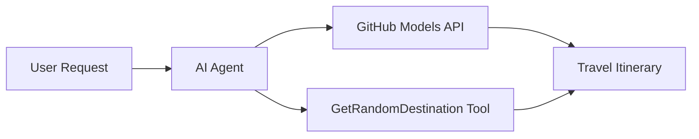

# 🌍 AI Resebyrå med Microsoft Agent Framework (.NET)

## 📋 Scenariobeskrivning

Den här notebooken visar hur man bygger en intelligent reseplaneringsagent med Microsoft Agent Framework för .NET. Agenten kan automatiskt skapa personliga dagsutflyktsplaner för slumpmässiga destinationer runt om i världen.

**Huvudfunktioner:**
- 🎲 **Slumpmässigt val av destination**: Använder ett anpassat verktyg för att välja semesterorter
- 🗺️ **Intelligent reseplanering**: Skapar detaljerade dag-för-dag resplaner
- 🔄 **Strömning i realtid**: Stödjer både omedelbara och strömmande svar
- 🛠️ **Integration av anpassade verktyg**: Visar hur man kan utöka agentens funktioner

## 🔧 Teknisk arkitektur

### Kärnteknologier
- **Microsoft Agent Framework**: Senaste .NET-implementeringen för AI-agentutveckling
- **GitHub Models Integration**: Använder GitHubs AI-modell för inferenstjänster
- **OpenAI API-kompatibilitet**: Utnyttjar OpenAI:s klientbibliotek med anpassade slutpunkter
- **Säker konfiguration**: API-nyckelhantering baserad på miljövariabler

### Viktiga komponenter
1. **AIAgent**: Huvudagenten som hanterar konversationsflödet
2. **Anpassade verktyg**: `GetRandomDestination()`-funktionen tillgänglig för agenten
3. **Chatklient**: Konversationsgränssnitt baserat på GitHub Models
4. **Strömningsstöd**: Funktioner för att generera svar i realtid

### Integrationsmönster


## 🚀 Kom igång

**Förutsättningar:**
- .NET 9.0 eller högre
- GitHub Models API åtkomsttoken
- Miljövariabler konfigurerade i `.env`-filen

**Nödvändiga miljövariabler:**
```env
GITHUB_TOKEN=your_github_token
GITHUB_ENDPOINT=https://models.inference.ai.azure.com
GITHUB_MODEL_ID=gpt-4o-mini
```

Kör cellerna nedan i ordning för att se reseagenten i aktion!

---

## .NET Single File App: AI Travel Agent Example

See `01-dotnet-agent-framework.cs` for the complete runnable code sample.

Kör kodexemplet nedan:

```bash
dotnet run 01-dotnet-agent-framework.cs
```

### Sample Code

```csharp
static string GetRandomDestination()
{
    var destinations = new List<string>
    {
        "Paris, France",
        "Tokyo, Japan",
        "New York City, USA",
        "Sydney, Australia",
        "Rome, Italy",
        "Barcelona, Spain",
        "Cape Town, South Africa",
        "Rio de Janeiro, Brazil",
        "Bangkok, Thailand",
        "Vancouver, Canada"
    };
    var random = new Random();
    int index = random.Next(destinations.Count);
    return destinations[index];
}

// Extract configuration from environment variables
var github_endpoint = Environment.GetEnvironmentVariable("GITHUB_ENDPOINT") ?? throw new InvalidOperationException("GITHUB_ENDPOINT is not set.");
var github_model_id = Environment.GetEnvironmentVariable("GITHUB_MODEL_ID") ?? "gpt-4o-mini";
var github_token = Environment.GetEnvironmentVariable("GITHUB_TOKEN") ?? throw new InvalidOperationException("GITHUB_TOKEN is not set.");

// Configure OpenAI Client Options
var openAIOptions = new OpenAIClientOptions()
{
    Endpoint = new Uri(github_endpoint)
};

// Initialize OpenAI Client with GitHub Models Configuration
var openAIClient = new OpenAIClient(new ApiKeyCredential(github_token), openAIOptions);

// Create AI Agent with Travel Planning Capabilities
AIAgent agent = openAIClient
    .GetChatClient(github_model_id)
    .CreateAIAgent(
        instructions: "You are a helpful AI Agent that can help plan vacations for customers at random destinations",
        tools: [AIFunctionFactory.Create(GetRandomDestination)]
    );

// Execute Agent: Plan a Day Trip (Non-Streaming)
Console.WriteLine(await agent.RunAsync("Plan me a day trip"));

// Execute Agent: Plan a Day Trip (Streaming Response)
await foreach (var update in agent.RunStreamingAsync("Plan me a day trip"))
{
    Console.Write(update);
}
```
