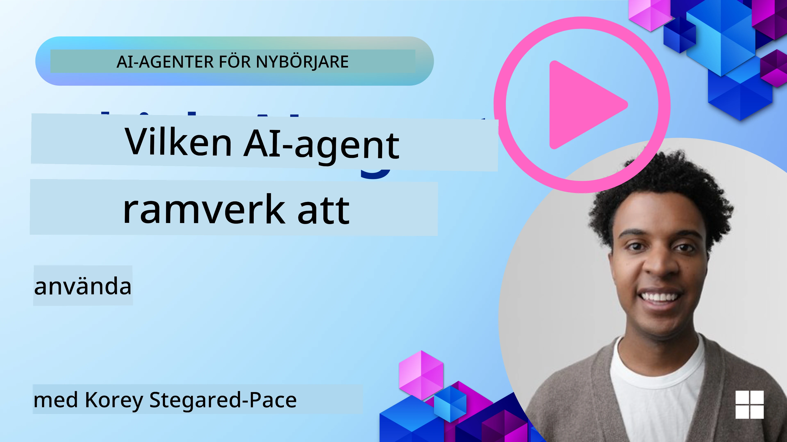

[](https://youtu.be/ODwF-EZo_O8?si=1xoy_B9RNQfrYdF7)

> _(Klicka på bilden ovan för att se videon av den här lektionen)_

# Utforska AI-agentramverk

AI-agentramverk är mjukvaruplattformar utformade för att förenkla skapandet, distributionen och hanteringen av AI-agenter. Dessa ramverk förser utvecklare med färdiga komponenter, abstraktioner och verktyg som effektiviserar utvecklingen av komplexa AI-system.

Dessa ramverk hjälper utvecklare att fokusera på de unika aspekterna av sina applikationer genom att tillhandahålla standardiserade metoder för vanliga utmaningar i utvecklingen av AI-agenter. De förbättrar skalbarhet, tillgänglighet och effektivitet vid uppbyggnaden av AI-system.

## Introduktion 

Denna lektion kommer att täcka:

- Vad är AI-agentramverk och vad gör de möjligt för utvecklare?
- Hur kan team använda dessa för att snabbt prototypa, iterera och förbättra sin agents kapabiliteter?
- Vad är skillnaderna mellan ramverken och verktygen skapade av Microsoft (<a href="https://aka.ms/ai-agents-beginners/ai-agent-service" target="_blank">Azure AI Agent Service</a> och the <a href="https://learn.microsoft.com/azure/ai-services/openai/how-to/responses" target="_blank">Microsoft Agent Framework</a>)?
- Kan jag integrera mina befintliga verktyg i Azure-ekosystemet direkt, eller behöver jag fristående lösningar?
- Vad är Azure AI Agents service och hur hjälper den mig?

## Lärandemål

Målen med denna lektion är att hjälpa dig förstå:

- Rollen för AI-agentramverk i AI-utveckling.
- Hur man utnyttjar AI-agentramverk för att bygga intelligenta agenter.
- Nyckelfunktioner som möjliggörs av AI-agentramverk.
- Skillnaderna mellan Microsoft Agent Framework och Azure AI Agent Service.

## Vad är AI-agentramverk och vad gör de möjligt för utvecklare?

Traditionella AI-ramverk kan hjälpa dig att integrera AI i dina appar och göra dessa appar bättre på följande sätt:

- **Personalisering**: AI kan analysera användarbeteende och preferenser för att ge personliga rekommendationer, innehåll och upplevelser.
Exempel: Strömningstjänster som Netflix använder AI för att föreslå filmer och serier baserat på tittarhistorik, vilket ökar användarens engagemang och nöjdhet.
- **Automatisering och effektivitet**: AI kan automatisera repetitiva uppgifter, effektivisera arbetsflöden och förbättra driftseffektiviteten.
Exempel: Kundtjänstapplikationer använder AI-drivna chatbots för att hantera vanliga förfrågningar, vilket minskar svarstider och frigör mänskliga agenter för mer komplexa ärenden.
- **Förbättrad användarupplevelse**: AI kan förbättra den övergripande användarupplevelsen genom att erbjuda intelligenta funktioner såsom röstigenkänning, naturlig språkbehandling och prediktiv text.
Exempel: Virtuella assistenter som Siri och Google Assistant använder AI för att förstå och svara på röstkommandon, vilket underlättar för användare att interagera med sina enheter.

### Det låter ju bra, så varför behöver vi AI Agent Framework?

AI-agentramverk representerar något mer än bara AI-ramverk. De är utformade för att möjliggöra skapandet av intelligenta agenter som kan interagera med användare, andra agenter och miljön för att uppnå specifika mål. Dessa agenter kan uppvisa autonomt beteende, fatta beslut och anpassa sig till förändrade förhållanden. Låt oss titta på några viktiga funktioner som möjliggörs av AI-agentramverk:

- **Agent-samarbete och koordinering**: Möjliggör skapandet av flera AI-agenter som kan arbeta tillsammans, kommunicera och samordna för att lösa komplexa uppgifter.
- **Automatisering och hantering av uppgifter**: Tillhandahåller mekanismer för att automatisera flerstegsarbetsflöden, dela uppgifter och dynamisk uppgiftshantering mellan agenter.
- **Kontextuell förståelse och anpassning**: Utrustar agenter med förmågan att förstå kontext, anpassa sig till föränderliga miljöer och fatta beslut baserat på realtidsinformation.

Sammanfattningsvis gör agenter att du kan åstadkomma mer: ta automatisering till nästa nivå och skapa mer intelligenta system som kan anpassa sig och lära sig från sin omgivning.

## Hur prototypar, itererar och förbättrar man snabbt en agents kapabiliteter?

Detta är ett snabbt föränderligt område, men det finns vissa saker som är gemensamma för de flesta AI-agentramverk som kan hjälpa dig att snabbt prototypa och iterera, nämligen modulära komponenter, samarbetsverktyg och inlärning i realtid. Låt oss fördjupa oss i dessa:

- **Använd modulära komponenter**: AI-SDK:er erbjuder färdiga komponenter såsom AI- och minnesanslutningar, funktionsanrop via naturligt språk eller kodplugins, promptmallar och mer.
- **Utnyttja samarbetsverktyg**: Designa agenter med specifika roller och uppgifter, vilket gör det möjligt att testa och förfina kollaborativa arbetsflöden.
- **Lär i realtid**: Implementera återkopplingsslingor där agenter lär sig av interaktioner och justerar sitt beteende dynamiskt.

### Använd modulära komponenter

SDK:er som Microsoft Agent Framework erbjuder färdiga komponenter såsom AI-anslutningar, verktygsdefinitioner och agenthantering.

**Hur team kan använda dessa**: Team kan snabbt sätta ihop dessa komponenter för att skapa en fungerande prototyp utan att börja från början, vilket möjliggör snabb experimentering och iteration.

**Hur det fungerar i praktiken**: Du kan använda en färdigparser för att extrahera information från användarens indata, en minnesmodul för att lagra och hämta data, och en promptgenerator för att interagera med användare, allt utan att behöva bygga dessa komponenter från grunden.

**Exempel på kod**. Låt oss titta på ett exempel på hur du kan använda Microsoft Agent Framework med `AzureAIProjectAgentProvider` för att få modellen att svara på användarinmatning med verktygsanrop:

``` python
# Microsoft Agent Framework Python Exempel

import asyncio
import os
from typing import Annotated

from agent_framework.azure import AzureAIProjectAgentProvider
from azure.identity import AzureCliCredential


# Definiera en exempel verktygsfunktion för att boka resor
def book_flight(date: str, location: str) -> str:
    """Book travel given location and date."""
    return f"Travel was booked to {location} on {date}"


async def main():
    provider = AzureAIProjectAgentProvider(credential=AzureCliCredential())
    agent = await provider.create_agent(
        name="travel_agent",
        instructions="Help the user book travel. Use the book_flight tool when ready.",
        tools=[book_flight],
    )

    response = await agent.run("I'd like to go to New York on January 1, 2025")
    print(response)
    # Exempelutdata: Din flygresa till New York den 1 januari 2025 har bokats framgångsrikt. Trevlig resa! ✈️🗽


if __name__ == "__main__":
    asyncio.run(main())
```

Vad du kan se från detta exempel är hur du kan utnyttja en färdigparser för att extrahera nyckelinformation från användarens indata, såsom ursprung, destination och datum för en flygbokningsförfrågan. Det här modulära tillvägagångssättet låter dig fokusera på den övergripande logiken.

### Utnyttja samarbetsverktyg

Ramverk som Microsoft Agent Framework underlättar skapandet av flera agenter som kan arbeta tillsammans.

**Hur team kan använda dessa**: Team kan designa agenter med specifika roller och uppgifter, vilket gör det möjligt att testa och förfina kollaborativa arbetsflöden och förbättra den övergripande systemeffektiviteten.

**Hur det fungerar i praktiken**: Du kan skapa ett team av agenter där varje agent har en specialiserad funktion, såsom datahämtning, analys eller beslutsfattande. Dessa agenter kan kommunicera och dela information för att nå ett gemensamt mål, exempelvis att svara på en användarfråga eller slutföra en uppgift.

**Exempel på kod (Microsoft Agent Framework)**:

```python
# Skapa flera agenter som arbetar tillsammans med Microsoft Agent Framework

import os
from agent_framework.azure import AzureAIProjectAgentProvider
from azure.identity import AzureCliCredential

provider = AzureAIProjectAgentProvider(credential=AzureCliCredential())

# Datahämtning Agent
agent_retrieve = await provider.create_agent(
    name="dataretrieval",
    instructions="Retrieve relevant data using available tools.",
    tools=[retrieve_tool],
)

# Dataanalys Agent
agent_analyze = await provider.create_agent(
    name="dataanalysis",
    instructions="Analyze the retrieved data and provide insights.",
    tools=[analyze_tool],
)

# Kör agenter i följd på en uppgift
retrieval_result = await agent_retrieve.run("Retrieve sales data for Q4")
analysis_result = await agent_analyze.run(f"Analyze this data: {retrieval_result}")
print(analysis_result)
```

Vad du ser i föregående kod är hur du kan skapa en uppgift som involverar flera agenter som arbetar tillsammans för att analysera data. Varje agent utför en specifik funktion, och uppgiften genomförs genom att koordinera agenterna för att uppnå önskat resultat. Genom att skapa dedikerade agenter med specialiserade roller kan du förbättra uppgiftseffektivitet och prestanda.

### Lär i realtid

Avancerade ramverk erbjuder möjligheter för kontextförståelse och anpassning i realtid.

**Hur team kan använda dessa**: Team kan implementera återkopplingsslingor där agenter lär sig av interaktioner och justerar sitt beteende dynamiskt, vilket leder till kontinuerlig förbättring och förfining av kapabiliteter.

**Hur det fungerar i praktiken**: Agenter kan analysera användarfeedback, miljödata och uppgiftsresultat för att uppdatera sin kunskapsbas, justera beslutsalgoritmer och förbättra prestanda över tid. Denna iterativa inlärningsprocess gör att agenter kan anpassa sig till förändrade förhållanden och användarpreferenser, vilket förbättrar den övergripande systemeffektiviteten.

## Vad är skillnaderna mellan Microsoft Agent Framework och Azure AI Agent Service?

Det finns många sätt att jämföra dessa angreppssätt, men låt oss titta på några viktiga skillnader vad gäller design, kapabiliteter och riktade användningsfall:

## Microsoft Agent Framework (MAF)

Microsoft Agent Framework tillhandahåller ett strömlinjeformat SDK för att bygga AI-agenter med `AzureAIProjectAgentProvider`. Det gör det möjligt för utvecklare att skapa agenter som använder Azure OpenAI-modeller med inbyggda verktygsanrop, konversationshantering och företagsklassad säkerhet via Azure-identitet.

**Användningsfall**: Bygga produktionsklara AI-agenter med verktygsanvändning, flerstegsarbetsflöden och scenarier för företagsintegration.

Här är några viktiga kärnkoncept i Microsoft Agent Framework:

- **Agenter**. En agent skapas via `AzureAIProjectAgentProvider` och konfigureras med ett namn, instruktioner och verktyg. Agenten kan:
  - **Bearbeta användarmeddelanden** och generera svar med hjälp av Azure OpenAI-modeller.
  - **Anropa verktyg** automatiskt baserat på konversationskontext.
  - **Bibehålla konversationstillstånd** över flera interaktioner.

  Här är ett kodsnutt som visar hur man skapar en agent:

    ```python
    import os
    from agent_framework.azure import AzureAIProjectAgentProvider
    from azure.identity import AzureCliCredential

    provider = AzureAIProjectAgentProvider(credential=AzureCliCredential())
    agent = await provider.create_agent(
        name="my_agent",
        instructions="You are a helpful assistant.",
    )

    response = await agent.run("Hello, World!")
    print(response)
    ```

- **Verktyg**. Ramverket stödjer att definiera verktyg som Python-funktioner som agenten kan anropa automatiskt. Verktyg registreras när agenten skapas:

    ```python
    def get_weather(location: str) -> str:
        """Get the current weather for a location."""
        return f"The weather in {location} is sunny, 72\u00b0F."

    agent = await provider.create_agent(
        name="weather_agent",
        instructions="Help users check the weather.",
        tools=[get_weather],
    )
    ```

- **Koordinering av flera agenter**. Du kan skapa flera agenter med olika specialiseringar och koordinera deras arbete:

    ```python
    planner = await provider.create_agent(
        name="planner",
        instructions="Break down complex tasks into steps.",
    )

    executor = await provider.create_agent(
        name="executor",
        instructions="Execute the planned steps using available tools.",
        tools=[execute_tool],
    )

    plan = await planner.run("Plan a trip to Paris")
    result = await executor.run(f"Execute this plan: {plan}")
    ```

- **Integration med Azure Identity**. Ramverket använder `AzureCliCredential` (eller `DefaultAzureCredential`) för säker, nyckelfri autentisering, vilket eliminerar behovet att hantera API-nycklar direkt.

## Azure AI Agent Service

Azure AI Agent Service är ett nyare tillägg, presenterat på Microsoft Ignite 2024. Det möjliggör utveckling och distribution av AI-agenter med mer flexibla modeller, såsom att direkt anropa öppen källkods-LLM:er som Llama 3, Mistral och Cohere.

Azure AI Agent Service erbjuder starkare mekanismer för företagsäkerhet och datalagringsmetoder, vilket gör det lämpligt för företagsapplikationer.

Det fungerar direkt med Microsoft Agent Framework för att bygga och distribuera agenter.

Denna tjänst är för närvarande i offentlig förhandsgranskning och stödjer Python och C# för att bygga agenter.

Med Azure AI Agent Service Python SDK kan vi skapa en agent med ett användardefinierat verktyg:

```python
import asyncio
from azure.identity import DefaultAzureCredential
from azure.ai.projects import AIProjectClient

# Definiera verktygsfunktioner
def get_specials() -> str:
    """Provides a list of specials from the menu."""
    return """
    Special Soup: Clam Chowder
    Special Salad: Cobb Salad
    Special Drink: Chai Tea
    """

def get_item_price(menu_item: str) -> str:
    """Provides the price of the requested menu item."""
    return "$9.99"


async def main() -> None:
    credential = DefaultAzureCredential()
    project_client = AIProjectClient.from_connection_string(
        credential=credential,
        conn_str="your-connection-string",
    )

    agent = project_client.agents.create_agent(
        model="gpt-4o-mini",
        name="Host",
        instructions="Answer questions about the menu.",
        tools=[get_specials, get_item_price],
    )

    thread = project_client.agents.create_thread()

    user_inputs = [
        "Hello",
        "What is the special soup?",
        "How much does that cost?",
        "Thank you",
    ]

    for user_input in user_inputs:
        print(f"# User: '{user_input}'")
        message = project_client.agents.create_message(
            thread_id=thread.id,
            role="user",
            content=user_input,
        )
        run = project_client.agents.create_and_process_run(
            thread_id=thread.id, agent_id=agent.id
        )
        messages = project_client.agents.list_messages(thread_id=thread.id)
        print(f"# Agent: {messages.data[0].content[0].text.value}")


if __name__ == "__main__":
    asyncio.run(main())
```

### Kärnkoncept

Azure AI Agent Service har följande kärnkoncept:

- **Agent**. Azure AI Agent Service integreras med Microsoft Foundry. Inom AI Foundry fungerar en AI-agent som en "smart" mikrotjänst som kan användas för att besvara frågor (RAG), utföra åtgärder eller helt automatisera arbetsflöden. Det uppnås genom att kombinera kraften hos generativa AI-modeller med verktyg som låter den få åtkomst till och interagera med verkliga datakällor. Här är ett exempel på en agent:

    ```python
    agent = project_client.agents.create_agent(
        model="gpt-4o-mini",
        name="my-agent",
        instructions="You are helpful agent",
        tools=code_interpreter.definitions,
        tool_resources=code_interpreter.resources,
    )
    ```

    I detta exempel skapas en agent med modellen `gpt-4o-mini`, ett namn `my-agent` och instruktionerna `You are helpful agent`. Agenten är utrustad med verktyg och resurser för att utföra kodinterpretationuppgifter.

- **Tråd och meddelanden**. Tråden är ett annat viktigt begrepp. Den representerar en konversation eller interaktion mellan en agent och en användare. Trådar kan användas för att spåra konversationens framsteg, lagra kontextinformation och hantera interaktionens tillstånd. Här är ett exempel på en tråd:

    ```python
    thread = project_client.agents.create_thread()
    message = project_client.agents.create_message(
        thread_id=thread.id,
        role="user",
        content="Could you please create a bar chart for the operating profit using the following data and provide the file to me? Company A: $1.2 million, Company B: $2.5 million, Company C: $3.0 million, Company D: $1.8 million",
    )
    
    # Ask the agent to perform work on the thread
    run = project_client.agents.create_and_process_run(thread_id=thread.id, agent_id=agent.id)
    
    # Fetch and log all messages to see the agent's response
    messages = project_client.agents.list_messages(thread_id=thread.id)
    print(f"Messages: {messages}")
    ```

    I föregående kod skapas en tråd. Därefter skickas ett meddelande till tråden. Genom att anropa `create_and_process_run` ombeds agenten att utföra arbete i tråden. Slutligen hämtas och loggas meddelandena för att se agentens svar. Meddelandena visar konversationens framsteg mellan användaren och agenten. Det är också viktigt att förstå att meddelanden kan vara av olika typer såsom text, bild eller fil, det vill säga att agenternas arbete har resulterat i exempelvis en bild eller ett textsvar. Som utvecklare kan du sedan använda denna information för att vidare bearbeta svaret eller presentera det för användaren.

- **Integreras med Microsoft Agent Framework**. Azure AI Agent Service fungerar sömlöst med Microsoft Agent Framework, vilket innebär att du kan bygga agenter med `AzureAIProjectAgentProvider` och distribuera dem via Agent Service för produktionsscenarier.

**Användningsfall**: Azure AI Agent Service är utformat för företagsapplikationer som kräver säker, skalbar och flexibel distribution av AI-agenter.

## Vad är skillnaden mellan dessa angreppssätt?
 
Det verkar finnas överlappningar, men det finns några nyckelskillnader vad gäller design, kapabiliteter och riktade användningsfall:
 
- **Microsoft Agent Framework (MAF)**: Är ett produktionsklart SDK för att bygga AI-agenter. Det erbjuder ett strömlinjeformat API för att skapa agenter med verktygsanrop, konversationshantering och integration med Azure-identitet.
- **Azure AI Agent Service**: Är en plattform och distributionsservice i Azure Foundry för agenter. Den erbjuder inbyggd anslutning till tjänster som Azure OpenAI, Azure AI Search, Bing Search och kodexekvering.
 
Är du fortfarande osäker på vilken du ska välja?

### Användningsfall
 
Låt oss se om vi kan hjälpa dig genom att gå igenom några vanliga användningsfall:
 
> Q: Jag bygger produktionsklara AI-agentapplikationer och vill komma igång snabbt
>

>A: Microsoft Agent Framework är ett utmärkt val. Det tillhandahåller ett enkelt, Pythoniskt API via `AzureAIProjectAgentProvider` som låter dig definiera agenter med verktyg och instruktioner med bara några rader kod.

>Q: Jag behöver företagsklassad distribution med Azure-integrationer som Search och kodexekvering
>
> A: Azure AI Agent Service är det bästa valet. Det är en plattformstjänst som erbjuder inbyggda möjligheter för flera modeller, Azure AI Search, Bing Search och Azure Functions. Det gör det enkelt att bygga dina agenter i Foundry-portalen och distribuera dem i skala.
 
> Q: Jag är fortfarande förvirrad, ge mig bara ett alternativ
>
> A: Börja med Microsoft Agent Framework för att bygga dina agenter, och använd sedan Azure AI Agent Service när du behöver distribuera och skala dem i produktion. Detta tillvägagångssätt låter dig iterera snabbt på din agentlogik samtidigt som du har en tydlig väg till företagsdistribution.
 
Låt oss sammanfatta de viktigaste skillnaderna i en tabell:

| Framework | Focus | Core Concepts | Use Cases |
| --- | --- | --- | --- |
| Microsoft Agent Framework | Strömlinjeformat agent-SDK med verktygsanrop | Agenter, Verktyg, Azure-identitet | Bygga AI-agenter, verktygsanvändning, flerstegsarbetsflöden |
| Azure AI Agent Service | Flexibla modeller, företagsäkerhet, Kodgenerering, Verktygsanrop | Modularitet, Samarbete, Processorkestrering | Säker, skalbar och flexibel distribution av AI-agenter |

## Kan jag integrera mina befintliga verktyg i Azure-ekosystemet direkt, eller behöver jag fristående lösningar?
Svaret är ja, du kan integrera dina befintliga verktyg i Azure-ekosystemet direkt med Azure AI Agent Service, särskilt eftersom den har byggts för att fungera sömlöst med andra Azure-tjänster. Du kan till exempel integrera Bing, Azure AI Search och Azure Functions. Det finns också djup integration med Microsoft Foundry.

Microsoft Agent Framework integreras också med Azure-tjänster via `AzureAIProjectAgentProvider` och Azure identity, vilket låter dig anropa Azure-tjänster direkt från dina agentverktyg.

## Exempel på kod

- Python: [Agent Framework](./code_samples/02-python-agent-framework.ipynb)
- .NET: [Agent Framework](./code_samples/02-dotnet-agent-framework.md)

## Har du fler frågor om AI Agent Frameworks?

Gå med i [Microsoft Foundry Discord](https://aka.ms/ai-agents/discord) för att träffa andra studerande, delta i kontorstider och få dina frågor om AI Agents besvarade.

## Referenser

- <a href="https://techcommunity.microsoft.com/blog/azure-ai-services-blog/introducing-azure-ai-agent-service/4298357" target="_blank">Azure Agent Service</a>
- <a href="https://learn.microsoft.com/azure/ai-services/openai/how-to/responses" target="_blank">Microsoft Agent Framework - Azure OpenAI Responses</a>
- <a href="https://learn.microsoft.com/azure/ai-services/agents/overview" target="_blank">Azure AI Agent service</a>

## Föregående lektion

[Introduktion till AI Agents och användningsfall](../01-intro-to-ai-agents/README.md)

## Nästa lektion

[Förstå agentiska designmönster](../03-agentic-design-patterns/README.md)

---

<!-- CO-OP TRANSLATOR DISCLAIMER START -->
Ansvarsfriskrivning:
Detta dokument har översatts med hjälp av AI-översättningstjänsten [Co-op Translator](https://github.com/Azure/co-op-translator). Vi strävar efter noggrannhet, men var medveten om att automatiska översättningar kan innehålla fel eller felaktigheter. Originaldokumentet på dess ursprungliga språk bör betraktas som den auktoritativa källan. För kritisk information rekommenderas professionell, mänsklig översättning. Vi ansvarar inte för eventuella missförstånd eller feltolkningar som uppstår till följd av användningen av denna översättning.
<!-- CO-OP TRANSLATOR DISCLAIMER END -->