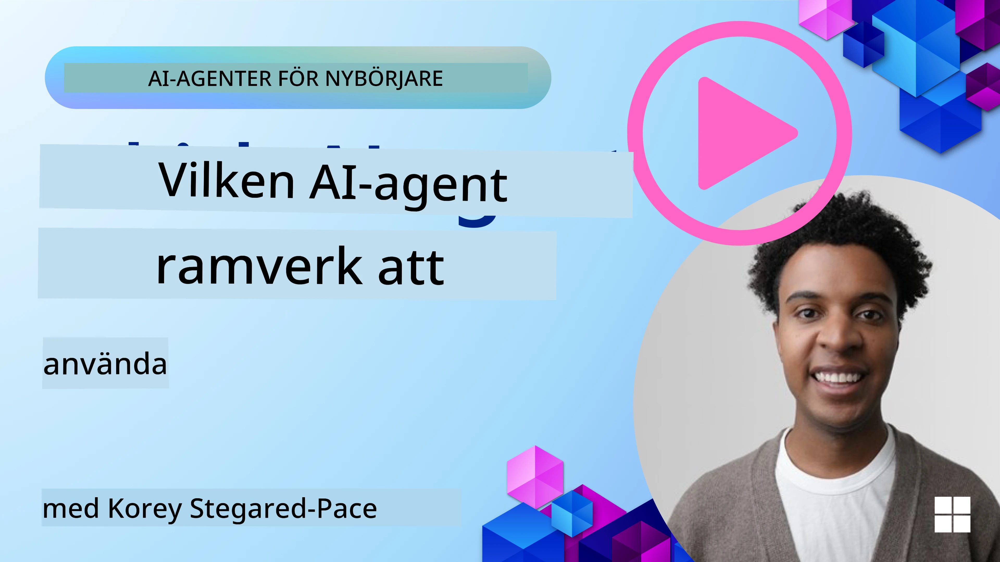

[](https://youtu.be/ODwF-EZo_O8?si=1xoy_B9RNQfrYdF7)

> _(Klicka på bilden ovan för att se videon för denna lektion)_

# Utforska AI Agentramverk

AI-agentramverk är mjukvaruplattformar utformade för att förenkla skapandet, distributionen och hanteringen av AI-agenter. Dessa ramverk ger utvecklare förbyggda komponenter, abstraktioner och verktyg som effektiviserar utvecklingen av komplexa AI-system.

Dessa ramverk hjälper utvecklare att fokusera på de unika aspekterna av deras applikationer genom att tillhandahålla standardiserade tillvägagångssätt för vanliga utmaningar i AI-agentutveckling. De förbättrar skalbarhet, tillgänglighet och effektivitet vid byggandet av AI-system.

## Introduktion

Denna lektion kommer att täcka:

- Vad är AI-agentramverk och vad möjliggör de för utvecklare att uppnå?
- Hur kan team snabbt prototypa, iterera och förbättra sin agents kapabiliteter?
- Vad är skillnaderna mellan ramverken och verktygen skapade av Microsoft (<a href="https://aka.ms/ai-agents-beginners/ai-agent-service" target="_blank">Microsoft Foundry Agent Service</a> och <a href="https://learn.microsoft.com/azure/ai-services/openai/how-to/responses" target="_blank">Microsoft Agent Framework</a>)?
- Kan jag integrera mina befintliga Azure-ekosystemverktyg direkt, eller behöver jag fristående lösningar?
- Vad är Microsoft Foundry Agent Service och hur hjälper det mig?

## Lärandemål

Målen med denna lektion är att hjälpa dig att förstå:

- AI-agentramverks roll inom AI-utveckling.
- Hur du kan använda AI-agentramverk för att bygga intelligenta agenter.
- Nyckelfunktioner som möjliggörs av AI-agentramverk.
- Skillnaderna mellan Microsoft Agent Framework och Microsoft Foundry Agent Service.

## Vad är AI-agentramverk och vad gör de möjligt för utvecklare?

Traditionella AI-ramverk kan hjälpa dig att integrera AI i dina appar och förbättra dessa appar på följande sätt:

- **Personalisering**: AI kan analysera användarbeteende och preferenser för att ge personliga rekommendationer, innehåll och upplevelser.
Exempel: Strömningstjänster som Netflix använder AI för att föreslå filmer och program baserat på visningshistorik, vilket ökar användarengagemang och tillfredsställelse.
- **Automatisering och effektivitet**: AI kan automatisera repetitiva uppgifter, effektivisera arbetsflöden och förbättra driftseffektivitet.
Exempel: Kundtjänstappar använder AI-drivna chattbotar för att hantera vanliga förfrågningar, vilket minskar svarstider och frigör mänskliga agenter för mer komplexa frågor.
- **Förbättrad användarupplevelse**: AI kan förbättra den övergripande användarupplevelsen genom att erbjuda intelligenta funktioner som röstigenkänning, naturlig språkbehandling och prediktiv text.
Exempel: Virtuella assistenter som Siri och Google Assistant använder AI för att förstå och svara på röstkommandon, vilket gör det enklare för användare att interagera med sina enheter.

### Det låter ju fantastiskt, så varför behöver vi AI Agent Framework?

AI-agentramverk representerar något mer än bara AI-ramverk. De är utformade för att möjliggöra skapandet av intelligenta agenter som kan interagera med användare, andra agenter och miljön för att uppnå specifika mål. Dessa agenter kan uppvisa autonomt beteende, fatta beslut och anpassa sig till förändrade förhållanden. Låt oss titta på några nyckelfunktioner som möjliggörs av AI Agent Frameworks:

- **Agent-samarbete och samordning**: Möjliggör skapandet av flera AI-agenter som kan arbeta tillsammans, kommunicera och samordna för att lösa komplexa uppgifter.
- **Uppgiftsautomatisering och hantering**: Tillhandahåller mekanismer för att automatisera flerstegsarbetsflöden, uppgiftsdelegering och dynamisk uppgiftshantering bland agenter.
- **Kontextuell förståelse och anpassning**: Utger agenter med förmåga att förstå kontext, anpassa sig till förändrade miljöer och fatta beslut baserat på realtidsinformation.

Sammanfattningsvis tillåter agenter dig att göra mer, ta automatiseringen till nästa nivå och skapa mer intelligenta system som kan anpassa sig och lära sig från sin omgivning.

## Hur kan man snabbt prototypa, iterera och förbättra agentens kapabiliteter?

Detta är ett snabbt föränderligt landskap, men det finns vissa gemensamma drag i de flesta AI Agent Frameworks som kan hjälpa dig att snabbt prototypa och iterera, nämligen modulära komponenter, samarbetsverktyg och lärande i realtid. Låt oss dyka in i dessa:

- **Använd modulära komponenter**: AI-SDK:er erbjuder förbyggda komponenter såsom AI- och minneskopplingar, funktionsanrop med naturligt språk eller kod-plugin, promptmallar med mera.
- **Utnyttja samarbetsverktyg**: Designa agenter med specifika roller och uppgifter för att testa och förfina samarbetsarbetsflöden.
- **Lär i realtid**: Implementera återkopplingsslingor där agenter lär sig från interaktioner och justerar sitt beteende dynamiskt.

### Använd modulära komponenter

SDK:er som Microsoft Agent Framework erbjuder förbyggda komponenter som AI-kopplingar, verktygsdefinitioner och agenthantering.

**Hur team kan använda detta**: Team kan snabbt sätta ihop dessa komponenter för att skapa en fungerande prototyp utan att börja från grunden, vilket möjliggör snabb experimentering och iteration.

**Hur det fungerar i praktiken**: Du kan använda en förbyggd parser för att extrahera information från användarinmatning, en minnesmodul för att lagra och hämta data, och en promptgenerator för att interagera med användare, allt utan att behöva bygga dessa komponenter från grunden.

**Kodexempel**. Låt oss titta på ett exempel hur du kan använda Microsoft Agent Framework med `FoundryChatClient` för att få modellen att svara på användarinmatning med verktygsanrop:

``` python
# Microsoft Agent Framework Python-exempel

import asyncio
import os

from agent_framework import tool
from agent_framework.foundry import FoundryChatClient
from azure.identity import AzureCliCredential


# Definiera en exempelverktygsfunktion för att boka resor
@tool(approval_mode="never_require")
def book_flight(date: str, location: str) -> str:
    """Book travel given location and date."""
    return f"Travel was booked to {location} on {date}"


async def main():
    provider = FoundryChatClient(
        project_endpoint=os.environ["AZURE_AI_PROJECT_ENDPOINT"],
        model=os.environ["AZURE_AI_MODEL_DEPLOYMENT_NAME"],
        credential=AzureCliCredential(),
    )
    agent = provider.as_agent(
        name="travel_agent",
        instructions="Help the user book travel. Use the book_flight tool when ready.",
        tools=[book_flight],
    )

    response = await agent.run("I'd like to go to New York on January 1, 2025")
    print(response)
    # Exempelutdata: Din flygning till New York den 1 januari 2025 har bokats framgångsrikt. Trevlig resa! ✈️🗽


if __name__ == "__main__":
    asyncio.run(main())
```

Vad du kan se från detta exempel är hur du kan utnyttja en förbyggd parser för att extrahera viktig information från användarinmatning, såsom avgångsort, destination och datum för en flygbokningsförfrågan. Detta modulära tillvägagångssätt låter dig fokusera på den övergripande logiken.

### Utnyttja samarbetsverktyg

Ramverk som Microsoft Agent Framework underlättar skapandet av flera agenter som kan arbeta tillsammans.

**Hur team kan använda detta**: Team kan designa agenter med specifika roller och uppgifter, vilket möjliggör att testa och förfina samarbetsarbetsflöden och förbättra systemets totala effektivitet.

**Hur det fungerar i praktiken**: Du kan skapa ett team av agenter där varje agent har en specialiserad funktion, såsom datainsamling, analys eller beslutsfattande. Dessa agenter kan kommunicera och dela information för att nå ett gemensamt mål, som att besvara en användarfråga eller utföra en uppgift.

**Kodexempel (Microsoft Agent Framework)**:

```python
# Skapar flera agenter som arbetar tillsammans med hjälp av Microsoft Agent Framework

import os
from agent_framework.foundry import FoundryChatClient
from azure.identity import AzureCliCredential

provider = FoundryChatClient(
    project_endpoint=os.environ["AZURE_AI_PROJECT_ENDPOINT"],
    model=os.environ["AZURE_AI_MODEL_DEPLOYMENT_NAME"],
    credential=AzureCliCredential(),
)

# Datahämtande agent
agent_retrieve = provider.as_agent(
    name="dataretrieval",
    instructions="Retrieve relevant data using available tools.",
    tools=[retrieve_tool],
)

# Dataanalysagent
agent_analyze = provider.as_agent(
    name="dataanalysis",
    instructions="Analyze the retrieved data and provide insights.",
    tools=[analyze_tool],
)

# Kör agenter i sekvens på en uppgift
retrieval_result = await agent_retrieve.run("Retrieve sales data for Q4")
analysis_result = await agent_analyze.run(f"Analyze this data: {retrieval_result}")
print(analysis_result)
```

Det du ser i föregående kod är hur du kan skapa en uppgift som involverar flera agenter som arbetar tillsammans för att analysera data. Varje agent utför en specifik funktion, och uppgiften utförs genom att samordna agenterna för att nå önskat resultat. Genom att skapa dedikerade agenter med specialiserade roller kan du förbättra uppgiftens effektivitet och prestanda.

### Lär i realtid

Avancerade ramverk erbjuder funktioner för kontextuell förståelse och anpassning i realtid.

**Hur team kan använda detta**: Team kan implementera återkopplingsslingor där agenter lär sig från interaktioner och justerar sitt beteende dynamiskt, vilket leder till kontinuerlig förbättring och förfining av kapabiliteter.

**Hur det fungerar i praktiken**: Agenter kan analysera användarfeedback, miljödata och uppgiftsresultat för att uppdatera sin kunskapsbas, anpassa beslutsfattande algoritmer och förbättra prestanda över tid. Denna iterativa lärandeprocess gör att agenter kan anpassa sig till förändrade förhållanden och användarpreferenser, vilket ökar systemets totala effektivitet.

## Vad är skillnaderna mellan Microsoft Agent Framework och Microsoft Foundry Agent Service?

Det finns många sätt att jämföra dessa tillvägagångssätt, men låt oss titta på några nyckelskillnader vad gäller design, funktioner och målade användningsfall:

## Microsoft Agent Framework (MAF)

Microsoft Agent Framework erbjuder ett strömlinjeformat SDK för att bygga AI-agenter med `FoundryChatClient`. Det möjliggör för utvecklare att skapa agenter som utnyttjar Azure OpenAI-modeller med inbyggda verktygsanrop, konversationshantering och företagsklassad säkerhet via Azure-identifiering.

**Användningsområden**: Att bygga produktionsklara AI-agenter med verktygsanvändning, flerstegsarbetsflöden och integrationsscenarier för företag.

Här är några viktiga kärnkoncept i Microsoft Agent Framework:

- **Agenter**. En agent skapas via `FoundryChatClient` och konfigureras med namn, instruktioner och verktyg. Agenten kan:
  - **Bearbeta användarmeddelanden** och generera svar med Azure OpenAI-modeller.
  - **Automatiskt anropa verktyg** baserat på konversationskontext.
  - **Bibehålla samtalsstatus** över flera interaktioner.

  Här är ett kodavsnitt som visar hur man skapar en agent:

    ```python
    import os
    from agent_framework.foundry import FoundryChatClient
    from azure.identity import AzureCliCredential

    provider = FoundryChatClient(
        project_endpoint=os.environ["AZURE_AI_PROJECT_ENDPOINT"],
        model=os.environ["AZURE_AI_MODEL_DEPLOYMENT_NAME"],
        credential=AzureCliCredential(),
    )
    agent = provider.as_agent(
        name="my_agent",
        instructions="You are a helpful assistant.",
    )

    response = await agent.run("Hello, World!")
    print(response)
    ```

- **Verktyg**. Ramverket stöder att definiera verktyg som Python-funktioner som agenten kan anropa automatiskt. Verktyg registreras när agenten skapas:

    ```python
    def get_weather(location: str) -> str:
        """Get the current weather for a location."""
        return f"The weather in {location} is sunny, 72\u00b0F."

    agent = provider.as_agent(
        name="weather_agent",
        instructions="Help users check the weather.",
        tools=[get_weather],
    )
    ```

- **Samarbete mellan flera agenter**. Du kan skapa flera agenter med olika specialiseringar och samordna deras arbete:

    ```python
    planner = provider.as_agent(
        name="planner",
        instructions="Break down complex tasks into steps.",
    )

    executor = provider.as_agent(
        name="executor",
        instructions="Execute the planned steps using available tools.",
        tools=[execute_tool],
    )

    plan = await planner.run("Plan a trip to Paris")
    result = await executor.run(f"Execute this plan: {plan}")
    ```

- **Integration med Azure-identifiering**. Ramverket använder `AzureCliCredential` (eller `DefaultAzureCredential`) för säker autentisering utan nycklar, vilket eliminerar behovet av att hantera API-nycklar direkt.

## Microsoft Foundry Agent Service

Microsoft Foundry Agent Service är ett nyare tillägg, presenterat på Microsoft Ignite 2024. Det möjliggör utveckling och distribution av AI-agenter med mer flexibla modeller, såsom att direkt anropa open source LLM:er som Llama 3, Mistral och Cohere.

Microsoft Foundry Agent Service tillhandahåller starkare säkerhetsmekanismer för företag och metoder för datalagring, vilket gör det lämpligt för företagsapplikationer.

Det fungerar direkt med Microsoft Agent Framework för byggande och distribution av agenter.

Denna tjänst är för närvarande i offentlig förhandsgranskning och stödjer Python och C# för agentutveckling.

Med Microsoft Foundry Agent Service Python SDK kan vi skapa en agent med ett användardefinierat verktyg:

```python
import asyncio
from azure.identity import DefaultAzureCredential
from azure.ai.projects import AIProjectClient

# Definiera verktygsfunktioner
def get_specials() -> str:
    """Provides a list of specials from the menu."""
    return """
    Special Soup: Clam Chowder
    Special Salad: Cobb Salad
    Special Drink: Chai Tea
    """

def get_item_price(menu_item: str) -> str:
    """Provides the price of the requested menu item."""
    return "$9.99"


async def main() -> None:
    credential = DefaultAzureCredential()
    project_client = AIProjectClient.from_connection_string(
        credential=credential,
        conn_str="your-connection-string",
    )

    agent = project_client.agents.create_agent(
        model="gpt-4o-mini",
        name="Host",
        instructions="Answer questions about the menu.",
        tools=[get_specials, get_item_price],
    )

    thread = project_client.agents.create_thread()

    user_inputs = [
        "Hello",
        "What is the special soup?",
        "How much does that cost?",
        "Thank you",
    ]

    for user_input in user_inputs:
        print(f"# User: '{user_input}'")
        message = project_client.agents.create_message(
            thread_id=thread.id,
            role="user",
            content=user_input,
        )
        run = project_client.agents.create_and_process_run(
            thread_id=thread.id, agent_id=agent.id
        )
        messages = project_client.agents.list_messages(thread_id=thread.id)
        print(f"# Agent: {messages.data[0].content[0].text.value}")


if __name__ == "__main__":
    asyncio.run(main())
```

### Kärnkoncept

Microsoft Foundry Agent Service har följande kärnkoncept:

- **Agent**. Microsoft Foundry Agent Service integreras med Microsoft Foundry. Inom Microsoft Foundry fungerar en AI-agent som en "smart" mikrotjänst som kan användas för att svara på frågor (RAG), utföra åtgärder eller helt automatisera arbetsflöden. Detta uppnås genom att kombinera kraften hos generativa AI-modeller med verktyg som ger åtkomst till och interaktion med verkliga datakällor. Här är ett exempel på en agent:

    ```python
    agent = project_client.agents.create_agent(
        model="gpt-4o-mini",
        name="my-agent",
        instructions="You are helpful agent",
        tools=code_interpreter.definitions,
        tool_resources=code_interpreter.resources,
    )
    ```

    I detta exempel skapas en agent med modellen `gpt-4o-mini`, namnet `my-agent` och instruktionen `You are helpful agent`. Agenten är utrustad med verktyg och resurser för att utföra kodtolkningsuppgifter.

- **Tråd och meddelanden**. Tråden är ett annat viktigt koncept. Den representerar en konversation eller interaktion mellan en agent och en användare. Trådar kan användas för att följa konversationens framsteg, lagra kontextinformation och hantera interaktionens tillstånd. Här är ett exempel på en tråd:

    ```python
    thread = project_client.agents.create_thread()
    message = project_client.agents.create_message(
        thread_id=thread.id,
        role="user",
        content="Could you please create a bar chart for the operating profit using the following data and provide the file to me? Company A: $1.2 million, Company B: $2.5 million, Company C: $3.0 million, Company D: $1.8 million",
    )
    
    # Be agenten att utföra arbete på tråden
    run = project_client.agents.create_and_process_run(thread_id=thread.id, agent_id=agent.id)
    
    # Hämta och logga alla meddelanden för att se agentens svar
    messages = project_client.agents.list_messages(thread_id=thread.id)
    print(f"Messages: {messages}")
    ```

    I föregående kod skapas en tråd. Därefter skickas ett meddelande till tråden. Genom att anropa `create_and_process_run` ber man agenten utföra arbete på tråden. Slutligen hämtas och loggas meddelandena för att se agentens svar. Meddelandena anger konversationens framsteg mellan användaren och agenten. Det är också viktigt att förstå att meddelandena kan ha olika typer, såsom text, bild eller fil; det vill säga agentens arbete har resulterat i exempelvis en bild eller ett textsvar. Som utvecklare kan du sedan använda denna information för vidarebearbetning eller presentation för användaren.

- **Integreras med Microsoft Agent Framework**. Microsoft Foundry Agent Service fungerar sömlöst med Microsoft Agent Framework, vilket betyder att du kan bygga agenter med `FoundryChatClient` och distribuera dem via Agent Service för produktionsscenarier.

**Användningsområden**: Microsoft Foundry Agent Service är designat för företagsapplikationer som kräver säker, skalbar och flexibel distribution av AI-agenter.

## Vad skiljer dessa tillvägagångssätt åt?

Det låter som att det finns överlappningar, men det finns några nyckelskillnader gällande design, funktioner och målade användningsfall:

- **Microsoft Agent Framework (MAF)**: Är ett produktionsklart SDK för att bygga AI-agenter. Det erbjuder en strömlinjeformad API för att skapa agenter med verktygsanrop, konversationshantering och integration med Azure-identifiering.
- **Microsoft Foundry Agent Service**: Är en plattforms- och distributionstjänst i Microsoft Foundry för agenter. Den erbjuder inbyggd anslutning till tjänster som Azure OpenAI, Azure AI Search, Bing Search och kodkörning.

Är du fortfarande osäker på vilket du ska välja?

### Användningsområden

Låt oss se om vi kan hjälpa dig genom att gå igenom några vanliga användningsfall:

> Q: Jag bygger produktionsklara AI-agentapplikationer och vill komma igång snabbt
>

> A: Microsoft Agent Framework är ett utmärkt val. Det erbjuder en enkel, Python-baserad API via `FoundryChatClient` som låter dig definiera agenter med verktyg och instruktioner på bara några kodrader.

> Q: Jag behöver företagsklassad distribution med Azure-integrationer som Search och kodkörning
>
> A: Microsoft Foundry Agent Service är bäst lämpad. Det är en plattformstjänst som tillhandahåller inbyggda funktioner för flera modeller, Azure AI Search, Bing Search och Azure Functions. Det gör det enkelt att bygga dina agenter i Foundry-portalen och distribuera dem i skala.

> Q: Jag är fortfarande förvirrad, ge mig bara ett alternativ
>
> A: Börja med Microsoft Agent Framework för att bygga dina agenter, och använd sedan Microsoft Foundry Agent Service när du behöver distribuera och skala dem i produktion. Detta upplägg låter dig iterera snabbt på agentlogiken samtidigt som du har en tydlig väg till företagsdistribution.

Låt oss sammanfatta de viktigaste skillnaderna i en tabell:

| Ramverk | Fokus | Kärnkoncept | Användningsområden |
| --- | --- | --- | --- |
| Microsoft Agent Framework | Strömlinjeformat agent-SDK med verktygsanrop | Agenter, Verktyg, Azure-identifiering | Bygga AI-agenter, verktygsanvändning, flerstegsarbetsflöden |
| Microsoft Foundry Agent Service | Flexibla modeller, företagssäkerhet, kodgenerering, verktygsanrop | Modularitet, Samarbete, Processorkestrering | Säker, skalbar och flexibel AI-agentdistribution |

## Kan jag integrera mina befintliga Azure-ekosystemverktyg direkt, eller behöver jag fristående lösningar?
Svaret är ja, du kan integrera dina befintliga Azure-ekosystemverktyg direkt med Microsoft Foundry Agent Service särskilt, eftersom det har byggts för att fungera sömlöst med andra Azure-tjänster. Du kan till exempel integrera Bing, Azure AI Search och Azure Functions. Det finns också djup integration med Microsoft Foundry.

Microsoft Agent Framework integreras också med Azure-tjänster genom `FoundryChatClient` och Azure-identity, vilket låter dig anropa Azure-tjänster direkt från dina agentverktyg.

## Sample Codes

- Python: [Agent Framework (Microsoft Foundry)](./code_samples/02-python-agent-framework.ipynb)
- Python: [Agent Framework (Azure OpenAI Responses API)](./code_samples/02-python-agent-framework-azure-openai.ipynb)
- .NET: [Agent Framework](./code_samples/02-dotnet-agent-framework.md)

## Got More Questions about AI Agent Frameworks?

Join the [Microsoft Foundry Discord](https://discord.com/invite/ATgtXmAS5D) to meet with other learners, attend office hours and get your AI Agents questions answered.

## References

- <a href="https://techcommunity.microsoft.com/blog/azure-ai-services-blog/introducing-azure-ai-agent-service/4298357" target="_blank">Azure Agent Service</a>
- <a href="https://learn.microsoft.com/azure/ai-services/openai/how-to/responses" target="_blank">Microsoft Agent Framework - Azure OpenAI Responses</a>
- <a href="https://learn.microsoft.com/azure/ai-services/agents/overview" target="_blank">Microsoft Foundry Agent Service</a>

## Previous Lesson

[Introduction to AI Agents and Agent Use Cases](../01-intro-to-ai-agents/README.md)

## Next Lesson

[Understanding Agentic Design Patterns](../03-agentic-design-patterns/README.md)

---

<!-- CO-OP TRANSLATOR DISCLAIMER START -->
**Ansvarsfriskrivning**:
Detta dokument har översatts med hjälp av AI-översättningstjänsten [Co-op Translator](https://github.com/Azure/co-op-translator). Även om vi strävar efter noggrannhet, var vänlig notera att automatiska översättningar kan innehålla fel eller brister. Det ursprungliga dokumentet på dess modersmål bör betraktas som den auktoritativa källan. För kritisk information rekommenderas professionell mänsklig översättning. Vi ansvarar inte för några missförstånd eller feltolkningar som uppstår till följd av användningen av denna översättning.
<!-- CO-OP TRANSLATOR DISCLAIMER END -->