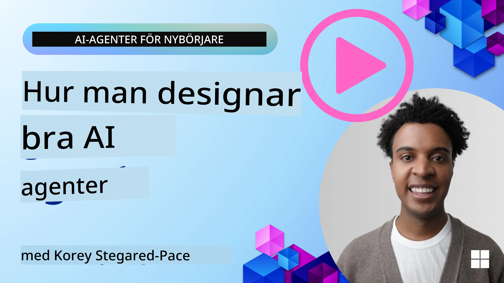
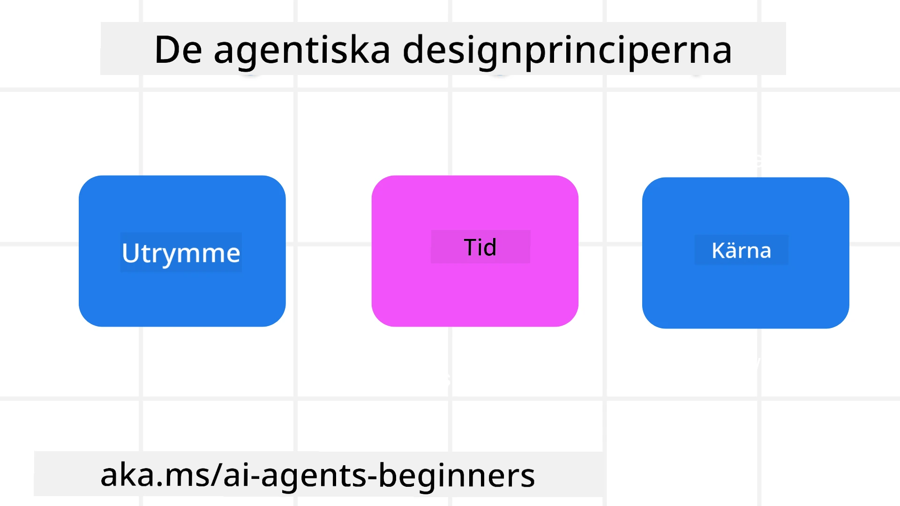

> _(Klicka på bilden ovan för att se videon av denna lektion)_
# Principer för AI-agentdesign

## Introduktion

Det finns många sätt att tänka kring att bygga AI-agentiska system. Med tanke på att tvetydighet är en funktion och inte en bugg i generativ AI-design, är det ibland svårt för ingenjörer att veta var de ens ska börja. Vi har skapat en uppsättning människocentrerade UX-designprinciper för att göra det möjligt för utvecklare att bygga kundcentrerade agentiska system för att lösa deras affärsbehov. Dessa designprinciper är inte en föreskrivande arkitektur utan snarare en utgångspunkt för team som definierar och bygger agentupplevelser.

I allmänhet bör agenter:

- Utvidga och skala mänskliga förmågor (idéer, problemlösning, automatisering, etc.)
- Fyll i kunskapsluckor (ge mig uppdaterad kunskap om kunskapsområden, översättning, etc.)
- Underlätta och stödja samarbete på de sätt vi som individer föredrar att arbeta med andra
- Göra oss till bättre versioner av oss själva (t.ex. livscoach/uppgiftsmästare, hjälpa oss att lära oss emotionell reglering och mindfulness-färdigheter, bygga resiliens, etc.)

## Denna lektion kommer att täcka

- Vad Agentiska designprinciper är
- Vissa riktlinjer att följa när man implementerar dessa designprinciper
- Exempel på att använda designprinciperna

## Lärandemål

Efter att ha genomfört denna lektion kommer du att kunna:

1. Förklara vad de Agentiska designprinciperna är
2. Förklara riktlinjerna för att använda de Agentiska designprinciperna
3. Förstå hur man bygger en agent med hjälp av de Agentiska designprinciperna

## De Agentiska designprinciperna

### Agent (Utrymme)

Detta är miljön där agenten verkar. Dessa principer informerar hur vi designar agenter för engagemang i fysiska och digitala världar.

- **Koppla samman, inte kollapsa** – hjälp till att koppla människor till andra människor, händelser och handlingsbar kunskap för att möjliggöra samarbete och kontakt.
- Agenter hjälper till att koppla samman händelser, kunskap och människor.
- Agenter för oss närmare varandra. De är inte designade för att ersätta eller förminska människor.
- **Lättillgänglig men ibland osynlig** – agenten verkar till största delen i bakgrunden och bara puffar till oss när det är relevant och lämpligt.
  - Agenten är lätt att hitta och nå för auktoriserade användare på vilken enhet eller plattform som helst.
  - Agenten stödjer multimodala in- och utmatningar (ljud, röst, text, etc.).
  - Agenten kan sömlöst växla mellan förgrund och bakgrund; mellan proaktiv och reaktiv, beroende på dess uppfattning av användarens behov.
  - Agenten kan verka i osynlig form, men dess bakgrundsprocesser och samarbete med andra agenter är transparenta för och kontrollerbara av användaren.

### Agent (Tid)

Detta är hur agenten verkar över tid. Dessa principer informerar hur vi designar agenter som interagerar över dåtid, nutid och framtid.

- **Dåtid**: Reflektera över historia som inkluderar både tillstånd och sammanhang.
  - Agenten tillhandahåller mer relevanta resultat baserat på analys av rikare historisk data bortom endast händelsen, människor eller tillstånd.
  - Agenten skapar kopplingar från tidigare händelser och reflekterar aktivt över minnet för att engagera sig i aktuella situationer.
- **Nu**: Pusha mer än att bara notifiera.
  - Agenten förkroppsligar ett heltäckande sätt att interagera med människor. När en händelse inträffar går agenten bortom statisk notifiering eller annan statisk formalitet. Agenten kan förenkla flöden eller dynamiskt generera signaler för att rikta användarens uppmärksamhet vid rätt stund.
  - Agenten levererar information baserat på kontextuell miljö, sociala och kulturella förändringar samt anpassat till användarens avsikt.
  - Agentinteraktion kan vara gradvis, utvecklas/växa i komplexitet för att stärka användare på lång sikt.
- **Framtid**: Anpassa och utvecklas.
  - Agenten anpassar sig till olika enheter, plattformar och modaliteter.
  - Agenten anpassar sig till användarbeteende, tillgänglighetsbehov och är fritt anpassningsbar.
  - Agenten formas av och utvecklas genom kontinuerlig användarinteraktion.

### Agent (Kärna)

Detta är de nyckelelement som utgör kärnan i en agents design.

- **Omfamna osäkerhet men etablera förtroende**.
  - En viss nivå av agent-osäkerhet förväntas. Osäkerhet är en nyckelkomponent i agentdesign.
  - Förtroende och transparens är grundläggande lager i agentdesign.
  - Människor kontrollerar när agenten är på/av och agentens status är alltid tydligt synlig.

## Riktlinjer för att implementera dessa principer

När du använder de tidigare designprinciperna, använd följande riktlinjer:

1. **Transparens**: Informera användaren att AI är involverat, hur det fungerar (inklusive tidigare handlingar) och hur man ger feedback samt modifierar systemet.
2. **Kontroll**: Gör det möjligt för användaren att anpassa, specificera preferenser och personifiera samt ha kontroll över systemet och dess attribut (inklusive möjligheten att glömma).
3. **Konsistens**: Sträva efter konsekventa, multimodala upplevelser över enheter och ändpunkter. Använd bekanta UI/UX-element när det är möjligt (t.ex. mikrofonikon för röstinteraktion) och minska kundens kognitiva belastning så mycket som möjligt (t.ex. sikta på koncisa svar, visuella hjälpmedel och "Läs mer"-innehåll).

## Hur man designar en reseagent med dessa principer och riktlinjer

Föreställ dig att du designar en reseagent, så här kan du tänka kring att använda designprinciperna och riktlinjerna:

1. **Transparens** – Låt användaren veta att reseagenten är en AI-aktiverad agent. Ge några grundläggande instruktioner om hur man kommer igång (t.ex. ett "Hej" -meddelande, exempel på uppmaningar). Dokumentera detta tydligt på produktsidan. Visa en lista över uppmaningar som användaren gjort tidigare. Gör det tydligt hur man ger feedback (tummen upp/ner, Skicka feedback-knapp etc.). Klargör om agenten har användnings- eller ämnesbegränsningar.
2. **Kontroll** – Se till att det är tydligt hur användaren kan modifiera agenten efter att den skapats med saker som systemuppmaningen. Gör det möjligt för användaren att välja hur ordrik agenten ska vara, dess skrivstil och eventuella reservationer om vad agenten inte ska prata om. Tillåt användaren att se och ta bort eventuella associerade filer eller data, uppmaningar och tidigare konversationer.
3. **Konsistens** – Se till att ikonerna för Dela uppmaning, lägga till en fil eller foto och tagga någon eller något är standard och lättigenkännliga. Använd gemikon för att indikera filuppladdning/delning med agenten, och en bildikon för att indikera grafikuppladdning.

## Exempelkod

- Python: [Agent Framework](./code_samples/03-python-agent-framework.ipynb)
- .NET: [Agent Framework](./code_samples/03-dotnet-agent-framework.md)

## Fler frågor om AI Agentiska designmönster?

Gå med i [Microsoft Foundry Discord](https://discord.com/invite/ATgtXmAS5D) för att träffa andra elever, delta i kontorstider och få svar på dina frågor om AI-agenter.

## Ytterligare resurser

- <a href="https://openai.com" target="_blank">Metoder för styrning av agentiska AI-system | OpenAI</a>
- <a href="https://microsoft.com" target="_blank">The HAX Toolkit Project - Microsoft Research</a>
- <a href="https://responsibleaitoolbox.ai" target="_blank">Responsible AI Toolbox</a>

## Föregående lektion

[Utforska agentiska ramverk](../02-explore-agentic-frameworks/README.md)

## Nästa lektion

[Mönster för verktygsanvändning](../04-tool-use/README.md)

---

<!-- CO-OP TRANSLATOR DISCLAIMER START -->
**Ansvarsfriskrivning**:
Detta dokument har översatts med hjälp av AI-översättningstjänsten [Co-op Translator](https://github.com/Azure/co-op-translator). Även om vi strävar efter noggrannhet, var vänlig notera att automatiska översättningar kan innehålla fel eller brister. Det ursprungliga dokumentet på dess modersmål bör betraktas som den auktoritativa källan. För kritisk information rekommenderas professionell mänsklig översättning. Vi ansvarar inte för några missförstånd eller feltolkningar som uppstår till följd av användningen av denna översättning.
<!-- CO-OP TRANSLATOR DISCLAIMER END -->