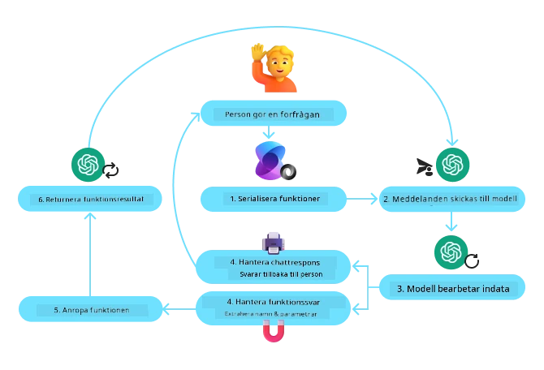
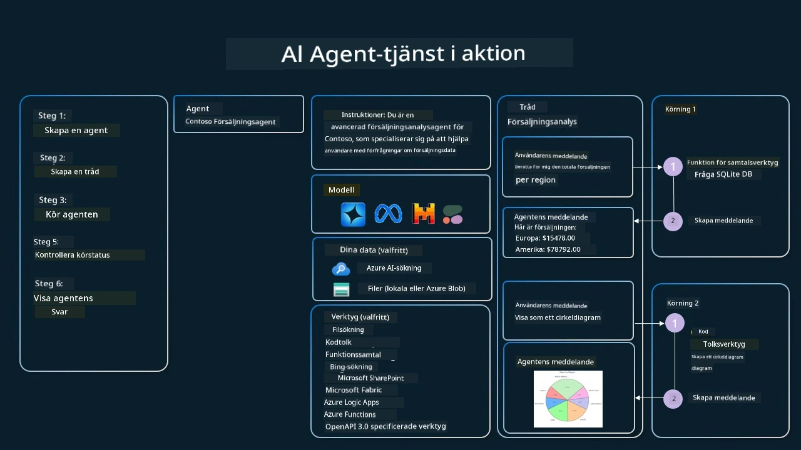

[](https://youtu.be/vieRiPRx-gI?si=cEZ8ApnT6Sus9rhn)

> _(Klicka på bilden ovan för att se videon av denna lektion)_

# Mönster för verktygsanvändning

Verktyg är intressanta eftersom de tillåter AI-agenter att ha ett bredare spektrum av förmågor. Istället för att agenten har en begränsad uppsättning åtgärder den kan utföra, kan agenten nu utföra ett brett spektrum av åtgärder genom att lägga till ett verktyg. I detta kapitel kommer vi att titta på mönstret för verktygsanvändning, som beskriver hur AI-agenter kan använda specifika verktyg för att uppnå sina mål.

## Introduktion

I denna lektion vill vi besvara följande frågor:

- Vad är mönstret för verktygsanvändning?
- Vilka användningsområden kan det tillämpas på?
- Vilka element/byggstenar behövs för att implementera mönstret?
- Vilka särskilda överväganden finns för att använda mönstret för verktygsanvändning för att bygga pålitliga AI-agenter?

## Lärandemål

Efter att ha slutfört denna lektion kommer du att kunna:

- Definiera mönstret för verktygsanvändning och dess syfte.
- Identifiera användningsfall där mönstret för verktygsanvändning är tillämpligt.
- Förstå de viktigaste elementen som behövs för att implementera mönstret.
- Känna igen överväganden för att säkerställa pålitlighet hos AI-agenter som använder detta mönster.

## Vad är mönstret för verktygsanvändning?

**Mönstret för verktygsanvändning** fokuserar på att ge stora språkmodeller (LLM) möjligheten att interagera med externa verktyg för att uppnå specifika mål. Verktyg är kod som kan köras av en agent för att utföra åtgärder. Ett verktyg kan vara en enkel funktion såsom en kalkylator, eller ett API-anrop till en tredjepartstjänst som aktiekursuppslagning eller väderprognos. I samband med AI-agenter är verktyg designade att köras av agenter som svar på **modellgenererade funktionsanrop**.

## Vilka användningsområden kan det tillämpas på?

AI-agenter kan använda verktyg för att slutföra komplexa uppgifter, hämta information eller fatta beslut. Mönstret för verktygsanvändning används ofta i scenarier som kräver dynamisk interaktion med externa system, såsom databaser, webbtjänster eller kodtolkare. Denna förmåga är användbar för flera olika användningsfall inklusive:

- **Dynamisk informationshämtning:** Agenter kan fråga externa API:er eller databaser för att hämta uppdaterad data (t.ex. fråga en SQLite-databas för dataanalys, hämta aktiekurser eller väderinformation).
- **Kodexekvering och tolkning:** Agenter kan köra kod eller skript för att lösa matematiska problem, generera rapporter eller utföra simuleringar.
- **Automatisering av arbetsflöden:** Automatisera repetitiva eller flerstegsarbetsflöden genom att integrera verktyg som schemaläggare, e-posttjänster eller datapipelines.
- **Kundsupport:** Agenter kan interagera med CRM-system, ärendehanteringsplattformar eller kunskapsbaser för att lösa användarfrågor.
- **Innehållsgenerering och redigering:** Agenter kan använda verktyg som grammatikkontroller, textsammanfattare eller bedömare av innehållssäkerhet för att assistera vid innehållsskapande uppgifter.

## Vilka element/byggstenar behövs för att implementera mönstret för verktygsanvändning?

Dessa byggstenar tillåter AI-agenten att utföra ett brett spektrum av uppgifter. Låt oss titta på de viktiga elementen som behövs för att implementera mönstret för verktygsanvändning:

- **Funktions-/Verktygsscheman**: Detaljerade definitioner av tillgängliga verktyg, inklusive funktionsnamn, syfte, nödvändiga parametrar och förväntade utdata. Dessa scheman möjliggör för LLM att förstå vilka verktyg som finns tillgängliga och hur man konstruerar giltiga förfrågningar.

- **Funktionskörningslogik**: Styr hur och när verktyg anropas baserat på användarens avsikt och samtalskontext. Detta kan inkludera planeringsmoduler, routingmekanismer eller villkorliga flöden som bestämmer verktygsanvändning dynamiskt.

- **Meddelandehanteringssystem**: Komponenter som hanterar konversationsflödet mellan användarinmatning, LLM-svar, verktygsanrop och verktygsutdata.

- **Verktygsintegrationsramverk**: Infrastruktur som kopplar agenten till olika verktyg, oavsett om det är enkla funktioner eller komplexa externa tjänster.

- **Felhantering och Validering**: Mekanismer för att hantera fel vid verktygskörning, validera parametrar och hantera oväntade svar.

- **Tillståndshantering**: Spårar samtalskontext, tidigare verktygsinteraktioner och ihållande data för att säkerställa konsekvens över flera återkopplingar.

Nästa, låt oss titta närmare på funktions-/verktygsanrop.

### Funktions-/Verktygsanrop

Funktionsanrop är huvudsättet för att göra det möjligt för stora språkmodeller (LLM) att interagera med verktyg. Du kommer ofta se 'funktion' och 'verktyg' användas omväxlande eftersom 'funktioner' (block av återanvändbar kod) är de 'verktyg' som agenter använder för att utföra uppgifter. För att en funktions kod ska kunna anropas måste LLM jämföra användarens förfrågan med funktionens beskrivning. För detta skickas ett schema som innehåller beskrivningarna av alla tillgängliga funktioner till LLM. LLM väljer sedan den mest lämpliga funktionen för uppgiften och returnerar dess namn och argument. Den valda funktionen anropas, dess svar skickas tillbaka till LLM som använder informationen för att svara på användarens förfrågan.

För att utvecklare ska kunna implementera funktionsanrop för agenter behöver ni:

1. En LLM-modell som stöder funktionsanrop
2. Ett schema med funktionsbeskrivningar
3. Koden för varje beskriven funktion

Låt oss använda exemplet att få aktuell tid i en stad för att illustrera:

1. **Initiera en LLM som stöder funktionsanrop:**

    Inte alla modeller stöder funktionsanrop, så det är viktigt att kontrollera att den LLM du använder gör det. <a href="https://learn.microsoft.com/azure/ai-services/openai/how-to/function-calling" target="_blank">Azure OpenAI</a> stöder funktionsanrop. Vi kan börja med att initiera Azure OpenAI-klienten.

    ```python
    # Initiera Azure OpenAI-klienten
    client = AzureOpenAI(
        azure_endpoint = os.getenv("AZURE_AI_PROJECT_ENDPOINT"), 
        api_key=os.getenv("AZURE_OPENAI_API_KEY"),  
        api_version="2024-05-01-preview"
    )
    ```

1. **Skapa ett funktionsschema**:

    Nästa steg är att definiera ett JSON-schema som innehåller funktionsnamn, beskrivning av vad funktionen gör, samt namn och beskrivningar av funktionsparametrarna.
    Vi tar sedan detta schema och skickar till den tidigare skapade klienten tillsammans med användarens förfrågan att hitta tiden i San Francisco. Det viktiga att notera är att ett **verktygsanrop** är vad som returneras, **inte** det slutgiltiga svaret på frågan. Som nämnts tidigare returnerar LLM namnet på den funktion som valdes för uppgiften och de argument som ska skickas till den.

    ```python
    # Funktionsbeskrivning för modellen att läsa
    tools = [
        {
            "type": "function",
            "function": {
                "name": "get_current_time",
                "description": "Get the current time in a given location",
                "parameters": {
                    "type": "object",
                    "properties": {
                        "location": {
                            "type": "string",
                            "description": "The city name, e.g. San Francisco",
                        },
                    },
                    "required": ["location"],
                },
            }
        }
    ]
    ```
   
    ```python
  
    # Initialt användarmeddelande
    messages = [{"role": "user", "content": "What's the current time in San Francisco"}] 
  
    # Första API-anropet: Be modellen använda funktionen
      response = client.chat.completions.create(
          model=deployment_name,
          messages=messages,
          tools=tools,
          tool_choice="auto",
      )
  
      # Bearbeta modellens svar
      response_message = response.choices[0].message
      messages.append(response_message)
  
      print("Model's response:")  

      print(response_message)
  
    ```

    ```bash
    Model's response:
    ChatCompletionMessage(content=None, role='assistant', function_call=None, tool_calls=[ChatCompletionMessageToolCall(id='call_pOsKdUlqvdyttYB67MOj434b', function=Function(arguments='{"location":"San Francisco"}', name='get_current_time'), type='function')])
    ```
  
1. **Funktionskoden som behövs för att utföra uppgiften:**

    Nu när LLM har valt vilken funktion som behöver köras måste koden som utför uppgiften implementeras och köras.
    Vi kan implementera koden för att få aktuell tid i Python. Vi behöver också skriva kod för att extrahera namnet och argumenten från response_message för att få slutresultatet.

    ```python
      def get_current_time(location):
        """Get the current time for a given location"""
        print(f"get_current_time called with location: {location}")  
        location_lower = location.lower()
        
        for key, timezone in TIMEZONE_DATA.items():
            if key in location_lower:
                print(f"Timezone found for {key}")  
                current_time = datetime.now(ZoneInfo(timezone)).strftime("%I:%M %p")
                return json.dumps({
                    "location": location,
                    "current_time": current_time
                })
      
        print(f"No timezone data found for {location_lower}")  
        return json.dumps({"location": location, "current_time": "unknown"})
    ```

     ```python
     # Hantera funktionsanrop
      if response_message.tool_calls:
          for tool_call in response_message.tool_calls:
              if tool_call.function.name == "get_current_time":
     
                  function_args = json.loads(tool_call.function.arguments)
     
                  time_response = get_current_time(
                      location=function_args.get("location")
                  )
     
                  messages.append({
                      "tool_call_id": tool_call.id,
                      "role": "tool",
                      "name": "get_current_time",
                      "content": time_response,
                  })
      else:
          print("No tool calls were made by the model.")  
  
      # Andra API-anropet: Hämta det slutgiltiga svaret från modellen
      final_response = client.chat.completions.create(
          model=deployment_name,
          messages=messages,
      )
  
      return final_response.choices[0].message.content
     ```

     ```bash
      get_current_time called with location: San Francisco
      Timezone found for san francisco
      The current time in San Francisco is 09:24 AM.
     ```

Funktionsanrop är kärnan i de flesta, om inte alla, agentverktygsanvändningsdesigner, men att implementera det från grunden kan ibland vara utmanande.
Som vi lärde oss i [Lektion 2](../../../02-explore-agentic-frameworks) ger agentiska ramverk oss färdiga byggstenar för att implementera verktygsanvändning.
 
## Exempel på verktygsanvändning med agentiska ramverk

Här är några exempel på hur du kan implementera mönstret för verktygsanvändning med olika agentiska ramverk:

### Microsoft Agent Framework

<a href="https://learn.microsoft.com/azure/ai-services/agents/overview" target="_blank">Microsoft Agent Framework</a> är ett open source-ramverk för AI-agenter. Det förenklar processen med funktionsanrop genom att låta dig definiera verktyg som Python-funktioner med `@tool`-dekoreraren. Ramverket hanterar kommunikationen fram och tillbaka mellan modellen och din kod. Det ger även tillgång till förbyggda verktyg som Fil-sökning och Kodinterpreterare via `AzureAIProjectAgentProvider`.

Följande diagram illustrerar processen för funktionsanrop med Microsoft Agent Framework:



I Microsoft Agent Framework definieras verktyg som dekorerade funktioner. Vi kan konvertera funktionen `get_current_time` som vi såg tidigare till ett verktyg genom att använda `@tool`-dekoreraren. Ramverket kommer automatiskt serialisera funktionen och dess parametrar, och skapa schemat som skickas till LLM.

```python
from agent_framework import tool
from agent_framework.azure import AzureAIProjectAgentProvider
from azure.identity import AzureCliCredential

@tool
def get_current_time(location: str) -> str:
    """Get the current time for a given location"""
    ...

# Skapa klienten
provider = AzureAIProjectAgentProvider(credential=AzureCliCredential())

# Skapa en agent och kör med verktyget
agent = await provider.create_agent(name="TimeAgent", instructions="Use available tools to answer questions.", tools=get_current_time)
response = await agent.run("What time is it?")
```
  
### Azure AI Agent Service

<a href="https://learn.microsoft.com/azure/ai-services/agents/overview" target="_blank">Azure AI Agent Service</a> är ett nyare agentiskt ramverk designat för att låta utvecklare säkert bygga, distribuera och skala högkvalitativa och utbyggbara AI-agenter utan att behöva hantera underliggande beräknings- och lagringsresurser. Det är särskilt användbart för företagsanvändningar eftersom det är en fullständigt hanterad tjänst med företagsklassad säkerhet.

Jämfört med att utveckla direkt mot LLM-API:et ger Azure AI Agent Service vissa fördelar, inklusive:

- Automatisk verktygsanrop – inget behov att tolka ett verktygsanrop, anropa verktyget och hantera svaret; allt detta görs nu server-side
- Säker hantering av data – istället för att hantera eget samtalstillstånd kan du förlita dig på threads för att lagra all information du behöver
- Färdiga verktyg – Verktyg som du kan använda för att interagera med dina datakällor, såsom Bing, Azure AI Search och Azure Functions.

Verktygen som finns tillgängliga i Azure AI Agent Service kan delas in i två kategorier:

1. Kunskapsverktyg:
    - <a href="https://learn.microsoft.com/azure/ai-services/agents/how-to/tools/bing-grounding?tabs=python&pivots=overview" target="_blank">Grundning med Bing Search</a>
    - <a href="https://learn.microsoft.com/azure/ai-services/agents/how-to/tools/file-search?tabs=python&pivots=overview" target="_blank">Fil-sökning</a>
    - <a href="https://learn.microsoft.com/azure/ai-services/agents/how-to/tools/azure-ai-search?tabs=azurecli%2Cpython&pivots=overview-azure-ai-search" target="_blank">Azure AI Search</a>

2. Aktionsverktyg:
    - <a href="https://learn.microsoft.com/azure/ai-services/agents/how-to/tools/function-calling?tabs=python&pivots=overview" target="_blank">Funktionsanrop</a>
    - <a href="https://learn.microsoft.com/azure/ai-services/agents/how-to/tools/code-interpreter?tabs=python&pivots=overview" target="_blank">Kodinterpreterare</a>
    - <a href="https://learn.microsoft.com/azure/ai-services/agents/how-to/tools/openapi-spec?tabs=python&pivots=overview" target="_blank">Verktyg definierade via OpenAPI</a>
    - <a href="https://learn.microsoft.com/azure/ai-services/agents/how-to/tools/azure-functions?pivots=overview" target="_blank">Azure Functions</a>

Agenttjänsten gör det möjligt för oss att använda dessa verktyg tillsammans som ett `toolset`. Den använder också `threads` som håller reda på meddelandehistoriken från en specifik konversation.

Föreställ dig att du är en säljagent på ett företag som heter Contoso. Du vill utveckla en konversationsagent som kan svara på frågor om din försäljningsdata.

Följande bild illustrerar hur du kan använda Azure AI Agent Service för att analysera din försäljningsdata:



För att använda något av dessa verktyg med tjänsten kan vi skapa en klient och definiera ett verktyg eller verktygssvit. För att praktiskt implementera detta kan vi använda följande Python-kod. LLM kan se på verktygssviten och avgöra om den ska använda den användarskapade funktionen `fetch_sales_data_using_sqlite_query` eller den förbyggda Kodinterpretern beroende på användarens förfrågan.

```python 
import os
from azure.ai.projects import AIProjectClient
from azure.identity import DefaultAzureCredential
from fetch_sales_data_functions import fetch_sales_data_using_sqlite_query # fetch_sales_data_using_sqlite_query-funktion som finns i en fil som heter fetch_sales_data_functions.py.
from azure.ai.projects.models import ToolSet, FunctionTool, CodeInterpreterTool

project_client = AIProjectClient.from_connection_string(
    credential=DefaultAzureCredential(),
    conn_str=os.environ["PROJECT_CONNECTION_STRING"],
)

# Initiera verktygssats
toolset = ToolSet()

# Initiera funktionsanropsagent med funktionen fetch_sales_data_using_sqlite_query och lägg till den i verktygssatsen
fetch_data_function = FunctionTool(fetch_sales_data_using_sqlite_query)
toolset.add(fetch_data_function)

# Initiera verktyget Kodsinterpretator och lägg till det i verktygssatsen.
code_interpreter = code_interpreter = CodeInterpreterTool()
toolset.add(code_interpreter)

agent = project_client.agents.create_agent(
    model="gpt-4o-mini", name="my-agent", instructions="You are helpful agent", 
    toolset=toolset
)
```

## Vilka särskilda överväganden finns för att använda mönstret för verktygsanvändning för att bygga pålitliga AI-agenter?

En vanlig oro gällande SQL som genereras dynamiskt av LLM är säkerhet, särskilt risken för SQL-injektion eller skadliga åtgärder, såsom att ta bort eller manipulera databasen. Även om dessa farhågor är giltiga kan de effektivt motverkas genom korrekt konfigurering av databasens åtkomstbehörigheter. För de flesta databaser innebär detta att konfigurera databasen som skrivskyddad. För databastjänster som PostgreSQL eller Azure SQL bör appen tilldelas en skrivskyddad (SELECT) roll.

Att köra appen i en säker miljö förbättrar skyddet ytterligare. I företagsfall extraheras och transformeras data vanligtvis från operativa system till en skrivskyddad databas eller datalager med ett användarvänligt schema. Denna metod säkerställer att data är säker, optimerad för prestanda och tillgänglighet, och att appen har begränsad, skrivskyddad åtkomst.

## Prova Exempelkod

- Python: [Agent Framework](./code_samples/04-python-agent-framework.ipynb)
- .NET: [Agent Framework](./code_samples/04-dotnet-agent-framework.md)

## Har du fler frågor om mönstret för verktygsanvändning?

Gå med i [Microsoft Foundry Discord](https://aka.ms/ai-agents/discord) för att träffa andra elever, delta i kontorstider och få svar på dina frågor om AI-agenter.

## Ytterligare resurser

- <a href="https://microsoft.github.io/build-your-first-agent-with-azure-ai-agent-service-workshop/" target="_blank">Azure AI Agents Service Workshop</a>
- <a href="https://github.com/Azure-Samples/contoso-creative-writer/tree/main/docs/workshop" target="_blank">Contoso Creative Writer Multi-Agent Workshop</a>
- <a href="https://learn.microsoft.com/azure/ai-services/agents/overview" target="_blank">Microsoft Agent Framework Översikt</a>

## Föregående lektion

[Förstå agentiska designmönster](../03-agentic-design-patterns/README.md)

## Nästa lektion
[Agentic RAG](../05-agentic-rag/README.md)

---

<!-- CO-OP TRANSLATOR DISCLAIMER START -->
**Ansvarsfriskrivning**:
Detta dokument har översatts med hjälp av AI-översättningstjänsten [Co-op Translator](https://github.com/Azure/co-op-translator). Även om vi strävar efter noggrannhet, var vänlig observera att automatiska översättningar kan innehålla fel eller brister. Det ursprungliga dokumentet på dess modersmål ska betraktas som den auktoritativa källan. För kritisk information rekommenderas professionell mänsklig översättning. Vi tar inget ansvar för eventuella missförstånd eller feltolkningar som uppstår vid användning av denna översättning.
<!-- CO-OP TRANSLATOR DISCLAIMER END -->