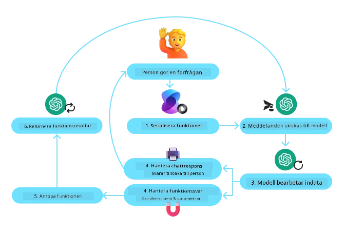
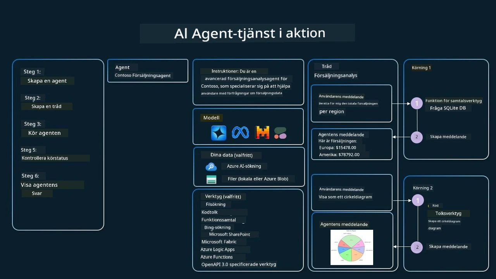

[](https://youtu.be/vieRiPRx-gI?si=cEZ8ApnT6Sus9rhn)

> _(Klicka på bilden ovan för att se videon för denna lektion)_

# Designmönstret Verktygsanvändning

Verktyg är intressanta eftersom de gör det möjligt för AI-agenter att ha ett bredare spektrum av kapaciteter. Istället för att agenten har en begränsad uppsättning åtgärder den kan utföra, kan agenten nu utföra en mängd olika åtgärder genom att lägga till ett verktyg. I detta kapitel kommer vi att titta på designmönstret Verktygsanvändning, som beskriver hur AI-agenter kan använda specifika verktyg för att uppnå sina mål.

## Introduktion

I denna lektion vill vi svara på följande frågor:

- Vad är designmönstret Verktygsanvändning?
- Vilka användningsfall kan det tillämpas på?
- Vilka är elementen/byggstenarna som behövs för att implementera designmönstret?
- Vilka särskilda överväganden finns för att använda designmönstret Verktygsanvändning för att bygga pålitliga AI-agenter?

## Lärandemål

Efter att ha genomfört denna lektion kommer du att kunna:

- Definiera designmönstret Verktygsanvändning och dess syfte.
- Identifiera användningsfall där designmönstret Verktygsanvändning är tillämpligt.
- Förstå de viktigaste elementen som behövs för att implementera designmönstret.
- Känna igen överväganden för att säkerställa trovärdighet hos AI-agenter som använder detta designmönster.

## Vad är designmönstret Verktygsanvändning?

**Designmönstret Verktygsanvändning** fokuserar på att ge LLM:er förmågan att interagera med externa verktyg för att uppnå specifika mål. Verktyg är kod som kan exekveras av en agent för att utföra åtgärder. Ett verktyg kan vara en enkel funktion som en räknare, eller ett API-anrop till en tredjepartstjänst som aktiekursuppslagning eller väderprognos. I sammanhanget med AI-agenter är verktyg designade för att exekveras av agenter som svar på **modellgenererade funktionsanrop**.

## Vilka användningsfall kan det tillämpas på?

AI-agenter kan använda verktyg för att slutföra komplexa uppgifter, hämta information eller fatta beslut. Designmönstret verktygsanvändning används ofta i scenarier som kräver dynamisk interaktion med externa system, såsom databaser, webbtjänster eller kodtolkare. Denna förmåga är användbar för flera olika användningsfall, inklusive:

- **Dynamisk informationshämtning:** Agenter kan göra förfrågningar till externa API:er eller databaser för att hämta aktuell data (t.ex. fråga en SQLite-databas för dataanalys, hämta aktiekurser eller väderinformation).
- **Kodexekvering och tolkning:** Agenter kan köra kod eller skript för att lösa matematiska problem, generera rapporter eller utföra simuleringar.
- **Automatisering av arbetsflöden:** Automatisera repetitiva eller flerstegiga arbetsflöden genom att integrera verktyg som schemaläggare, e-posttjänster eller datapipelines.
- **Kundsupport:** Agenter kan interagera med CRM-system, biljettplattformar eller kunskapsdatabaser för att lösa användarfrågor.
- **Innehållsgenerering och redigering:** Agenter kan använda verktyg som grammatikkontroller, textsammanfattare eller verktyg för innehållssäkerhet för att assistera vid innehållsskapande.

## Vilka är elementen/byggstenarna som behövs för att implementera designmönstret verktygsanvändning?

Dessa byggstenar gör det möjligt för AI-agenten att utföra en mängd olika uppgifter. Låt oss titta på de nyckelelement som behövs för att implementera designmönstret Verktygsanvändning:

- **Funktions-/Verktygsscheman**: Detaljerade definitioner av tillgängliga verktyg, inklusive funktionsnamn, syfte, nödvändiga parametrar och förväntade utdata. Dessa scheman gör det möjligt för LLM att förstå vilka verktyg som finns tillgängliga och hur man bygger giltiga förfrågningar.

- **Logik för funktions-exekvering**: Styr hur och när verktyg anropas baserat på användarens avsikt och konversationens kontext. Detta kan inkludera planeringsmoduler, routningsmekanismer eller villkorliga flöden som dynamiskt bestämmer verktygsanvändning.

- **Meddelandesystem för hantering:** Komponenter som hanterar konversationsflödet mellan användarinmatningar, LLM-svar, verktygsanrop och verktygsutdata.

- **Verktygsintegrationsramverk:** Infrastruktur som kopplar agenten till olika verktyg, vare sig de är enkla funktioner eller komplexa externa tjänster.

- **Felfångst & validering:** Mekanismer för att hantera fel vid verktygsexekvering, validera parametrar och hantera oväntade svar.

- **State Management:** Spårar konversationskontext, tidigare verktygsinteraktioner och beständig data för att säkerställa konsekvens över flera interaktioner.

Nästa steg är att titta närmare på Funktions-/Verktygsanrop.

### Funktions-/Verktygsanrop

Funktionsanrop är det primära sättet vi möjliggör för stora språkmodeller (LLM) att interagera med verktyg. Du kommer ofta att se 'Funktions' och 'Verktygs' användas omväxlande eftersom 'funktioner' (block med återanvändbar kod) är de 'verktyg' som agenter använder för att utföra uppgifter. För att en funktions kod ska anropas måste en LLM jämföra användarens förfrågan med funktionsbeskrivningen. För detta skickas ett schema som innehåller beskrivningarna av alla tillgängliga funktioner till LLM. LLM väljer sedan den mest lämpliga funktionen för uppgiften och returnerar dess namn och argument. Den valda funktionen anropas, dess svar skickas tillbaka till LLM som använder informationen för att svara på användarens förfrågan.

För utvecklare som vill implementera funktionsanrop för agenter behövs:

1. En LLM-modell som stödjer funktionsanrop
2. Ett schema som innehåller funktionsbeskrivningar
3. Koden för varje beskriven funktion

Låt oss använda exemplet med att få aktuell tid i en stad för att illustrera:

1. **Initiera en LLM som stödjer funktionsanrop:**

    Inte alla modeller stödjer funktionsanrop, så det är viktigt att kontrollera att LLM du använder gör det. <a href="https://learn.microsoft.com/azure/ai-services/openai/how-to/function-calling" target="_blank">Azure OpenAI</a> stöder funktionsanrop. Vi kan börja med att initiera OpenAI-klienten mot Azure OpenAI **Responses API** (den stabila `/openai/v1/`-endpointen — ingen `api_version` krävs). 

    ```python
    # Initiera OpenAI-klienten för Azure OpenAI (Responses API, v1-endpunkt)
    client = OpenAI(
        base_url=f"{os.environ['AZURE_OPENAI_ENDPOINT'].rstrip('/')}/openai/v1/",
        api_key=os.environ["AZURE_OPENAI_API_KEY"],
    )
    deployment_name = os.environ["AZURE_OPENAI_DEPLOYMENT"]
    ```

1. **Skapa ett Funktionsschema**:

    Nästa steg är att definiera ett JSON-schema som innehåller funktionsnamnet, beskrivning av vad funktionen gör, samt namnen och beskrivningarna av funktionsparametrarna.
    Vi skickar sedan detta schema till klienten som vi skapade tidigare, tillsammans med användarens förfrågan att hitta tiden i San Francisco. Det viktiga att notera är att ett **verktygsanrop** returneras, **inte** det slutgiltiga svaret på frågan. Som nämnts tidigare returnerar LLM namnet på den funktion den valt för uppgiften och argumenten som ska skickas till den.

    ```python
    # Funktionsbeskrivning för modellen att läsa (Responses API platt verktygsformat)
    tools = [
        {
            "type": "function",
            "name": "get_current_time",
            "description": "Get the current time in a given location",
            "parameters": {
                "type": "object",
                "properties": {
                    "location": {
                        "type": "string",
                        "description": "The city name, e.g. San Francisco",
                    },
                },
                "required": ["location"],
            },
        }
    ]
    ```
   
    ```python
  
    # Initialt användarmeddelande
    messages = [{"role": "user", "content": "What's the current time in San Francisco"}]

    # Första API-anropet: Be modellen att använda funktionen
    response = client.responses.create(
        model=deployment_name,
        input=messages,
        tools=tools,
        tool_choice="auto",
        store=False,
    )

    # Responses API returnerar verktygsanrop som function_call-objekt i response.output.
    # Lägg till dem i konversationen så att modellen har full kontext vid nästa tur.
    messages += response.output

    print("Model's response:")
    print(response.output)
  
    ```

    ```bash
    Model's response:
    [ResponseFunctionToolCall(arguments='{"location":"San Francisco"}', call_id='call_pOsKdUlqvdyttYB67MOj434b', name='get_current_time', type='function_call')]
    ```
  
1. **Funktionskoden som krävs för att utföra uppgiften:**

    När LLM har valt vilken funktion som behöver köras måste koden som utför uppgiften implementeras och köras.
    Vi kan implementera koden för att hämta aktuell tid i Python. Vi behöver också skriva kod som extraherar namnet och argumenten från response_message för att få det slutgiltiga resultatet.

    ```python
      def get_current_time(location):
        """Get the current time for a given location"""
        print(f"get_current_time called with location: {location}")  
        location_lower = location.lower()
        
        for key, timezone in TIMEZONE_DATA.items():
            if key in location_lower:
                print(f"Timezone found for {key}")  
                current_time = datetime.now(ZoneInfo(timezone)).strftime("%I:%M %p")
                return json.dumps({
                    "location": location,
                    "current_time": current_time
                })
      
        print(f"No timezone data found for {location_lower}")  
        return json.dumps({"location": location, "current_time": "unknown"})
    ```

     ```python
    # Hantera funktionsanrop
    tool_calls = [item for item in response.output if item.type == "function_call"]
    if tool_calls:
        for tool_call in tool_calls:
            if tool_call.name == "get_current_time":

                function_args = json.loads(tool_call.arguments)

                time_response = get_current_time(
                    location=function_args.get("location")
                )

                # Returnera verktygets resultat som ett function_call_output-objekt
                messages.append({
                    "type": "function_call_output",
                    "call_id": tool_call.call_id,
                    "output": time_response,
                })
    else:
        print("No tool calls were made by the model.")

    # Andra API-anropet: Hämta det slutgiltiga svaret från modellen
    final_response = client.responses.create(
        model=deployment_name,
        input=messages,
        tools=tools,
        store=False,
    )

    return final_response.output_text
     ```

     ```bash
      get_current_time called with location: San Francisco
      Timezone found for san francisco
      The current time in San Francisco is 09:24 AM.
     ```

Funktionsanrop är kärnan i de flesta, om inte alla, agenters verktygsanvändningsdesign, men det kan ibland vara utmanande att implementera det från grunden.
Som vi lärde oss i [Lektion 2](../../../02-explore-agentic-frameworks) ger agentramverk oss färdiga byggstenar för att implementera verktygsanvändning.
 
## Exempel på verktygsanvändning med agentramverk

Här är några exempel på hur du kan implementera designmönstret Verktygsanvändning med olika agentramverk:

### Microsoft Agent Framework

<a href="https://learn.microsoft.com/azure/ai-services/agents/overview" target="_blank">Microsoft Agent Framework</a> är ett open-source AI-ramverk för att bygga AI-agenter. Det förenklar processen med funktionsanrop genom att låta dig definiera verktyg som Python-funktioner med `@tool`-dekoreraren. Ramverket hanterar kommunikationen fram och tillbaka mellan modellen och din kod. Det ger även tillgång till färdiga verktyg som Filsökning och Kodtolkare via `FoundryChatClient`.

Följande diagram illustrerar processen för funktionsanrop med Microsoft Agent Framework:



I Microsoft Agent Framework definieras verktyg som dekorerade funktioner. Vi kan konvertera funktionen `get_current_time` som vi såg tidigare till ett verktyg genom att använda `@tool`-dekoreraren. Ramverket serialiserar automatiskt funktionen och dess parametrar och skapar schemat som skickas till LLM.

```python
import os
from agent_framework import tool
from agent_framework.foundry import FoundryChatClient
from azure.identity import AzureCliCredential

@tool(approval_mode="never_require")
def get_current_time(location: str) -> str:
    """Get the current time for a given location"""
    ...

# Skapa klienten
provider = FoundryChatClient(
    project_endpoint=os.environ["AZURE_AI_PROJECT_ENDPOINT"],
    model=os.environ["AZURE_AI_MODEL_DEPLOYMENT_NAME"],
    credential=AzureCliCredential(),
)

# Skapa en agent och kör med verktyget
agent = provider.as_agent(name="TimeAgent", instructions="Use available tools to answer questions.", tools=get_current_time)
response = await agent.run("What time is it?")
```
  
### Microsoft Foundry Agent Service

<a href="https://learn.microsoft.com/azure/ai-services/agents/overview" target="_blank">Microsoft Foundry Agent Service</a> är ett nyare agentramverk som är designat för att ge utvecklare möjlighet att säkert bygga, distribuera och skala högkvalitativa och extensibla AI-agenter utan att behöva hantera underliggande beräknings- och lagringsresurser. Det är särskilt användbart för företagsapplikationer eftersom det är en fullt hanterad tjänst med säkerhet på företagsnivå.

Jämfört med att utveckla direkt med LLM API erbjuder Microsoft Foundry Agent Service flera fördelar, inklusive:

- Automatisk funktionsanrop – inget behov av att tolka ett verktygsanrop, anropa verktyget och hantera svaret; allt detta hanteras nu server-side
- Säker hantering av data – istället för att hantera eget konversationsstate kan du förlita dig på trådar som lagrar all information du behöver
- Färdiga verktyg – Verktyg som du kan använda för att interagera med dina datakällor, såsom Bing, Azure AI Search och Azure Functions.

De verktyg som finns tillgängliga i Microsoft Foundry Agent Service kan delas in i två kategorier:

1. Kunskapsverktyg:
    - <a href="https://learn.microsoft.com/azure/ai-services/agents/how-to/tools/bing-grounding?tabs=python&pivots=overview" target="_blank">Grundning med Bing Search</a>
    - <a href="https://learn.microsoft.com/azure/ai-services/agents/how-to/tools/file-search?tabs=python&pivots=overview" target="_blank">Filsökning</a>
    - <a href="https://learn.microsoft.com/azure/ai-services/agents/how-to/tools/azure-ai-search?tabs=azurecli%2Cpython&pivots=overview-azure-ai-search" target="_blank">Azure AI Search</a>

2. Åtgärdsverktyg:
    - <a href="https://learn.microsoft.com/azure/ai-services/agents/how-to/tools/function-calling?tabs=python&pivots=overview" target="_blank">Funktionsanrop</a>
    - <a href="https://learn.microsoft.com/azure/ai-services/agents/how-to/tools/code-interpreter?tabs=python&pivots=overview" target="_blank">Kodtolkare</a>
    - <a href="https://learn.microsoft.com/azure/ai-services/agents/how-to/tools/openapi-spec?tabs=python&pivots=overview" target="_blank">OpenAPI-definierade verktyg</a>
    - <a href="https://learn.microsoft.com/azure/ai-services/agents/how-to/tools/azure-functions?pivots=overview" target="_blank">Azure Functions</a>

Agent Service gör det möjligt att använda dessa verktyg tillsammans som en `toolset`. Det använder även `threads` som håller reda på meddelandehistoriken från ett specifikt samtal.

Föreställ dig att du är en säljansvarig på ett företag som heter Contoso. Du vill utveckla en konversationsagent som kan svara på frågor om företagets försäljningsdata.

Följande bild illustrerar hur du kan använda Microsoft Foundry Agent Service för att analysera din försäljningsdata:



För att använda något av dessa verktyg med tjänsten kan vi skapa en klient och definiera ett verktyg eller en verktygsuppsättning. För att implementera detta praktiskt kan vi använda följande Python-kod. LLM kommer att kunna granska verktygsuppsättningen och avgöra om den ska använda den användarskapade funktionen `fetch_sales_data_using_sqlite_query` eller den förbyggda Kodtolkaren beroende på användarens förfrågan.

```python 
import os
from azure.ai.projects import AIProjectClient
from azure.identity import DefaultAzureCredential
from fetch_sales_data_functions import fetch_sales_data_using_sqlite_query # fetch_sales_data_using_sqlite_query-funktion som finns i en fil med namnet fetch_sales_data_functions.py.
from azure.ai.projects.models import ToolSet, FunctionTool, CodeInterpreterTool

project_client = AIProjectClient.from_connection_string(
    credential=DefaultAzureCredential(),
    conn_str=os.environ["PROJECT_CONNECTION_STRING"],
)

# Initiera verktygssats
toolset = ToolSet()

# Initiera funktionsanropsagent med funktionen fetch_sales_data_using_sqlite_query och lägg till den i verktygssatsen
fetch_data_function = FunctionTool(fetch_sales_data_using_sqlite_query)
toolset.add(fetch_data_function)

# Initiera Code Interpreter-verktyg och lägg till det i verktygssatsen.
code_interpreter = CodeInterpreterTool()toolset.add(code_interpreter)

agent = project_client.agents.create_agent(
    model="gpt-4o-mini", name="my-agent", instructions="You are helpful agent", 
    toolset=toolset
)
```

## Vilka särskilda överväganden finns för att använda designmönstret Verktygsanvändning för att bygga pålitliga AI-agenter?

En vanlig oro med SQL som genereras dynamiskt av LLM:er är säkerhet, särskilt risken för SQL-injektion eller illvilliga handlingar som att radera eller manipulera databasen. Även om dessa farhågor är giltiga kan de effektivt mildras genom korrekt konfiguration av databasbehörigheter. För de flesta databaser innebär detta att konfigurera databasen som skrivskyddad. För databastjänster som PostgreSQL eller Azure SQL bör appen tilldelas en läs-endo (SELECT) roll.

Att köra appen i en säker miljö förbättrar skyddet ytterligare. I företagsmiljöer extraheras och transformeras data vanligtvis från operativa system till en skrivskyddad databas eller datalager med ett användarvänligt schema. Detta tillvägagångssätt säkerställer att data är säker, optimerad för prestanda och tillgänglighet, och att appen har begränsad, läsande åtkomst.

## Exempelkoder

- Python: [Agent Framework](./code_samples/04-python-agent-framework.ipynb)
- .NET: [Agent Framework](./code_samples/04-dotnet-agent-framework.md)

## Har du fler frågor om designmönstret Verktygsanvändning?

Gå med i [Microsoft Foundry Discord](https://discord.com/invite/ATgtXmAS5D) för att träffa andra lärande, delta i kontorstider och få svar på dina frågor om AI-agenter.

## Ytterligare resurser

- <a href="https://microsoft.github.io/build-your-first-agent-with-azure-ai-agent-service-workshop/" target="_blank">Azure AI Agents Service Workshop</a>
- <a href="https://github.com/Azure-Samples/contoso-creative-writer/tree/main/docs/workshop" target="_blank">Contoso Creative Writer Multi-Agent Workshop</a>
- <a href="https://learn.microsoft.com/azure/ai-services/agents/overview" target="_blank">Microsoft Agent Framework Översikt</a>
## Föregående Lektion

[Förstå Agentiska Designmönster](../03-agentic-design-patterns/README.md)

## Nästa Lektion

[Agentic RAG](../05-agentic-rag/README.md)

---

<!-- CO-OP TRANSLATOR DISCLAIMER START -->
**Ansvarsfriskrivning**:
Detta dokument har översatts med hjälp av AI-översättningstjänsten [Co-op Translator](https://github.com/Azure/co-op-translator). Även om vi strävar efter noggrannhet, var vänlig notera att automatiska översättningar kan innehålla fel eller brister. Det ursprungliga dokumentet på dess modersmål bör betraktas som den auktoritativa källan. För kritisk information rekommenderas professionell mänsklig översättning. Vi ansvarar inte för några missförstånd eller feltolkningar som uppstår till följd av användningen av denna översättning.
<!-- CO-OP TRANSLATOR DISCLAIMER END -->