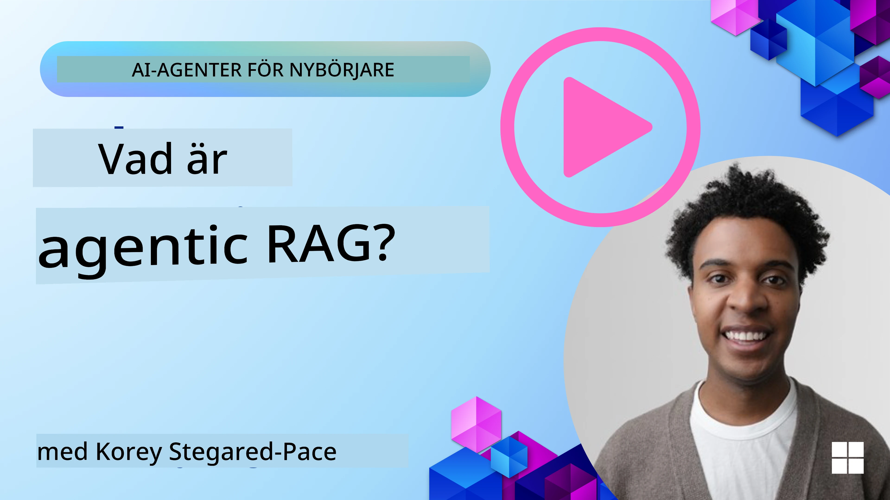
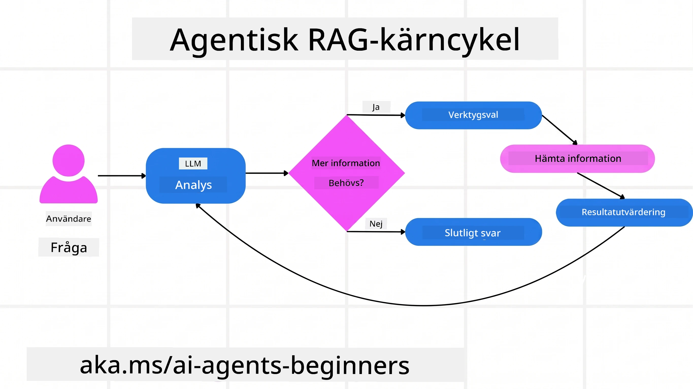
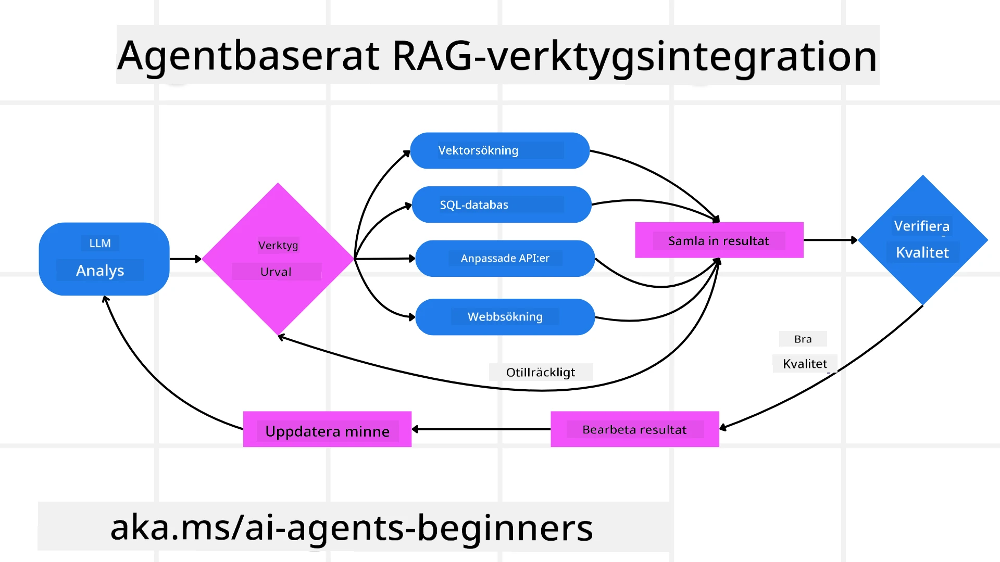
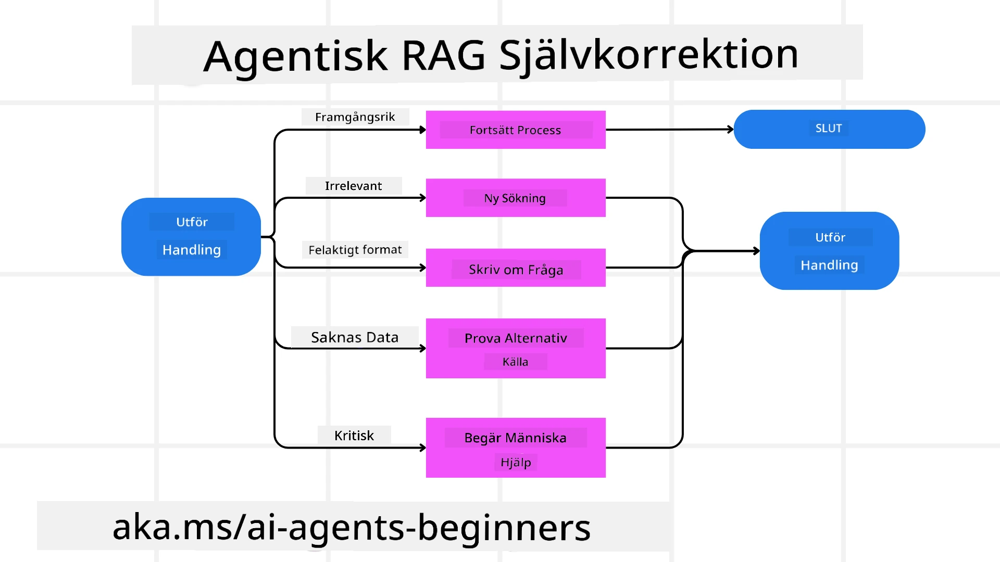
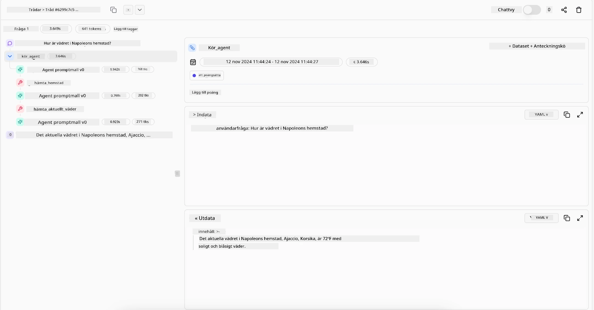

> _(Klicka på bilden ovan för att se videon för denna lektion)_

# Agentic RAG

Denna lektion ger en omfattande översikt över Agentic Retrieval-Augmented Generation (Agentic RAG), ett framväxande AI-paradigm där stora språkmodeller (LLM:er) autonomt planerar sina nästa steg samtidigt som de hämtar information från externa källor. Till skillnad från statiska mönster där man först hämtar och sedan läser, involverar Agentic RAG iterativa anrop till LLM, varvade med verktygs- eller funktionsanrop och strukturerade svar. Systemet utvärderar resultaten, förfinar förfrågningar, använder ytterligare verktyg vid behov och fortsätter denna cykel tills en tillfredsställande lösning uppnås.

## Introduktion

Denna lektion kommer att omfatta

- **Förstå Agentic RAG:**  Lär dig om det framväxande paradigmet inom AI där stora språkmodeller (LLM:er) autonomt planerar sina nästa steg samtidigt som de hämtar information från externa datakällor.
- **Greppa Iterativt Maker-Checker-stil:** Förstå loopen av iterativa anrop till LLM, varvade med verktygs- eller funktionsanrop och strukturerade svar, utformade för att förbättra korrekthet och hantera felaktiga förfrågningar.
- **Utforska Praktiska Tillämpningar:** Identifiera scenarier där Agentic RAG briljerar, såsom miljöer med krav på korrekta resultat, komplexa databasinteraktioner och utökade arbetsflöden.

## Lärandemål

Efter att ha slutfört denna lektion kommer du att kunna/förstå:

- **Förståelse för Agentic RAG:** Lär dig om det framväxande paradigmet inom AI där stora språkmodeller (LLM:er) autonomt planerar sina nästa steg samtidigt som de hämtar information från externa datakällor.
- **Iterativ Maker-Checker-stil:** Greppa konceptet med en loop av iterativa anrop till LLM, varvade med verktygs- eller funktionsanrop och strukturerade svar, utformade för att förbättra korrekthet och hantera felaktiga förfrågningar.
- **Äga resonemangsprocessen:** Förstå systemets förmåga att äga sin resonemangsprocess och fatta beslut om hur problem ska angripas utan att förlita sig på fördefinierade vägar.
- **Arbetsflöde:** Förstå hur en agentisk modell självständigt beslutar att hämta marknadstrendrapporter, identifiera konkurrentdata, korrelera interna försäljningsmått, syntetisera fynd och utvärdera strategin.
- **Iterativa loopar, verktygsintegration och minne:** Lär dig om systemets beroende av ett loopat interaktionsmönster, där det upprätthålls tillstånd och minne över steg för att undvika repetitiva loopar och fatta informerade beslut.
- **Hantering av felmönster och självkorrektion:** Utforska systemets robusta självkorrektionsmekanismer, inklusive iteration och omförfrågning, användning av diagnostiska verktyg och att falla tillbaka på mänsklig övervakning.
- **Agentgränser:** Förstå begränsningarna för Agentic RAG, med fokus på domänspecifik autonomi, beroende av infrastruktur och respekt för säkerhetsramar.
- **Praktiska användningsfall och värde:** Identifiera scenarier där Agentic RAG är särskilt användbart, såsom miljöer med krav på korrekte resultat, komplexa databasinteraktioner och längre arbetsflöden.
- **Styrning, transparens och förtroende:** Lär dig vikten av styrning och transparens, inklusive förklarbar resonemang, kontroll av partiskhet och mänsklig övervakning.

## Vad är Agentic RAG?

Agentic Retrieval-Augmented Generation (Agentic RAG) är ett framväxande AI-paradigm där stora språkmodeller (LLM:er) autonomt planerar sina nästa steg samtidigt som de hämtar information från externa källor. Till skillnad från statiska mönster med först hämtning och sedan läsning, involverar Agentic RAG iterativa anrop till LLM, varvade med verktygs- eller funktionsanrop och strukturerade svar. Systemet utvärderar resultaten, förfinar förfrågningar, använder ytterligare verktyg vid behov och fortsätter denna cykel tills en tillfredsställande lösning uppnås. Den iterativa ”maker-checker”-stilen förbättrar korrektheten, hanterar felaktiga förfrågningar och säkerställer högkvalitativa resultat.

Systemet äger aktivt sin resonemangsprocess, skriver om misslyckade förfrågningar, väljer olika hämtmetoder och integrerar flera verktyg — såsom vektorsökning i Azure AI Search, SQL-databaser eller egna API:er — innan svaret slutgiltigt fastställs. Den avgörande egenskapen hos ett agentiskt system är dess förmåga att äga sin resonemangsprocess. Traditionella RAG-implementationer förlitar sig på fördefinierade vägar, men ett agentiskt system avgör självständigt ordningsföljden för stegen baserat på kvaliteten på den information det hittar.

## Definition av Agentic Retrieval-Augmented Generation (Agentic RAG)

Agentic Retrieval-Augmented Generation (Agentic RAG) är ett framväxande paradigm inom AI-utveckling där LLM:er inte bara hämtar information från externa datakällor utan också autonomt planerar sina nästa steg. Till skillnad från statiska mönster med först hämtning och sedan läsning, eller noggrant skriptade promptsekvenser, involverar Agentic RAG en loop av iterativa anrop till LLM, varvade med verktygs- eller funktionsanrop och strukturerade svar. Vid varje steg utvärderar systemet de resultat det fått, beslutar om förfrågningarna behöver förfinas, använder ytterligare verktyg vid behov och fortsätter denna cykel tills en tillfredsställande lösning uppnås.

Denna iterativa ”maker-checker”-stil är utformad för att förbättra korrektheten, hantera felaktiga förfrågningar mot strukturerade databaser (t.ex. NL2SQL) och säkerställa balanserade, högkvalitativa resultat. Istället för att enbart förlita sig på noggrant utformade promptkedjor äger systemet aktivt sin resonemangsprocess. Det kan skriva om förfrågningar som misslyckas, välja olika hämtmetoder och integrera flera verktyg — såsom vektorsökning i Azure AI Search, SQL-databaser eller egna API:er — innan det fastställer sitt svar. Detta eliminerar behovet av överdrivet komplexa orkestreringsramverk. Istället kan en relativt enkel loop av ”LLM-anrop → verktygsanvändning → LLM-anrop → …” ge sofistikerade och välgrundade resultat.

## Äga resonemangsprocessen

Den avgörande egenskapen som gör ett system ”agentiskt” är dess förmåga att äga sin resonemangsprocess. Traditionella RAG-implementationer förlitar sig ofta på att människor fördefinierar en väg för modellen: en tankeprocess som anger vad som ska hämtas och när.
Men när ett system verkligen är agentiskt, bestämmer det internt hur problemet ska angripas. Det är inte bara en exekvering av ett skript; det bestämmer självständig sekvens för stegen baserat på kvaliteten på den information det hittar.
Till exempel, om det ombeds skapa en produktlanseringsstrategi, förlitar det sig inte enbart på en prompt som specificerar hela forsknings- och beslutsprocessen. Istället bestämmer den agentiska modellen självständigt att:

1. Hämta aktuella marknadstrendrapporter med hjälp av Bing Web Grounding
2. Identifiera relevant konkurrentdata med Azure AI Search.
3.	Korrelatera historiska interna försäljningsmått med Azure SQL Database.
4. Syntetisera resultaten till en sammanhållen strategi orkestrerad via Azure OpenAI Service.
5.	Utvärdera strategin för luckor eller inkonsekvenser, och vid behov genomföra ytterligare en runda av hämtning.
Alla dessa steg — förbättra frågorna, välja källor, iterera tills man är ”nöjd” med svaret — beslutas av modellen, inte förskrivet av en människa.

## Iterativa loopar, verktygsintegration och minne

Ett agentiskt system bygger på ett loopat interaktionsmönster:

- **Initialt anrop:** Användarens mål (d.v.s. användarprompten) presenteras för LLM.
- **Verktygsanrop:** Om modellen identifierar saknad information eller tvetydiga instruktioner väljs ett verktyg eller en hämtmetod — såsom en vektordatabassökning (t.ex. Azure AI Search Hybrid-sökning över privata data) eller ett strukturerat SQL-anrop — för att samla mer kontext.
- **Utvärdering & Förfining:** Efter att ha granskat den returnerade datan beslutar modellen om informationen är tillräcklig. Om inte, förfinar den frågan, provar ett annat verktyg eller ändrar sin angreppsvinkel.
- **Upprepa tills nöjd:** Denna cykel fortsätter tills modellen avgör att den har tillräcklig klarhet och bevis för att leverera ett slutgiltigt, välgrundat svar.
- **Minne & Tillstånd:** Eftersom systemet upprätthåller tillstånd och minne över steg kan det minnas tidigare försök och deras resultat, vilket undviker repetitiva loopar och möjliggör mer informerade beslut under processen.

Över tid skapas en känsla av utvecklande förståelse, vilket gör det möjligt för modellen att navigera komplexa, flerstegsuppgifter utan att en människa ständigt behöver ingripa eller omforma prompten.

## Hantering av felmönster och självkorrektion

Agentic RAG:s autonomi innefattar även robusta självkorrektionsmekanismer. När systemet stöter på återvändsgränder — såsom att hämta irrelevanta dokument eller möta felaktiga förfrågningar — kan det:

- **Iterera och göra om förfrågan:** Istället för att returnera lågkvalitativa svar försöker modellen nya sökstrategier, skriver om databasförfrågningar eller tittar på alternativa datasets.
- **Använda diagnostiska verktyg:** Systemet kan anropa ytterligare funktioner som hjälper det att felsöka sina resonemangssteg eller bekräfta korrektheten i hämtad data. Verktyg som Azure AI Tracing blir viktiga för att möjliggöra robust observabilitet och övervakning.
- **Falla tillbaka på mänsklig övervakning:** För känsliga eller upprepade felaktiga scenarier kan modellen flagga osäkerhet och begära mänsklig vägledning. När människan ger korrigerande feedback kan modellen inkorporera denna lärdom framöver.

Denna iterativa och dynamiska strategi gör att modellen kan förbättras kontinuerligt, vilket säkerställer att den inte bara är ett engångssystem utan lär sig från sina misstag under en given session.

## Agentgränser

Trots sin autonomi inom en uppgift är Agentic RAG inte analog med artificiell generell intelligens. Dess ”agentiska” förmågor är begränsade till de verktyg, datakällor och policyer som tillhandahålls av mänskliga utvecklare. Det kan inte uppfinna egna verktyg eller överskrida de domängränser som satts. Istället utmärker det sig i att dynamiskt orkestrera de resurser som finns tillgängliga.
Viktiga skillnader från mer avancerade AI-former inkluderar:

1. **Domänspecifik autonomi:** Agentic RAG-system fokuserar på att uppnå användardefinierade mål inom en känd domän, och använder strategier som omskrivning av frågor eller verktygsval för att förbättra resultat.
2. **Infrastrukturberoende:** Systemets förmågor är beroende av de verktyg och data som utvecklare integrerat. Det kan inte överskrida dessa gränser utan mänsklig inblandning.
3. **Respekt för skyddsåtgärder:** Etiska riktlinjer, efterlevnadsregler och affärspolicyer är mycket viktiga. Agentens frihet är alltid begränsad av säkerhetsåtgärder och övervakningsmekanismer (förhoppningsvis?)

## Praktiska användningsfall och värde

Agentic RAG utmärker sig i scenarier som kräver iterativ förfining och precision:

1. **Miljöer med krav på korrekthet:** Vid efterlevnadskontroller, regulatoriska analyser eller juridisk forskning kan den agentiska modellen upprepade gånger verifiera fakta, konsultera flera källor och skriva om frågor tills den levererar ett grundligt kontrollerat svar.
2. **Komplicerade databasinteraktioner:** Vid hantering av strukturerad data där frågor ofta kan misslyckas eller behöva justeras kan systemet autonomt förfina sina förfrågningar med Azure SQL eller Microsoft Fabric OneLake, vilket säkerställer att slutlig hämtning stämmer med användarens avsikt.
3. **Utökade arbetsflöden:** Långvariga sessioner kan utvecklas när ny information dyker upp. Agentic RAG kan kontinuerligt inkorporera ny data och justera strategier i takt med att den lär sig mer om problemet.

## Styrning, transparens och förtroende

När dessa system blir mer autonoma i sitt resonemang är styrning och transparens avgörande:

- **Förklarbart resonemang:** Modellen kan förse med en revisionsspår av frågorna den ställt, de källor den konsulterat och de resonemangsprocesser den använt för att nå sin slutsats. Verktyg som Azure AI Content Safety och Azure AI Tracing / GenAIOps hjälper till att upprätthålla transparens och minska risker.
- **Kontroll av partiskhet och balanserad hämtning:** Utvecklare kan justera hämtstrategier för att säkerställa att balanserade och representativa datakällor beaktas, samt regelbundet granska svar för att upptäcka partiskhet eller snedvridna mönster med hjälp av anpassade modeller för avancerad dataanalys för organisationer som använder Azure Machine Learning.
- **Mänsklig övervakning och efterlevnad:** För känsliga uppgifter kvarstår mänsklig granskning som väsentlig. Agentic RAG ersätter inte mänskligt omdöme i viktiga beslut – det förstärker det genom att leverera noggrannare granskade alternativ.

Att ha verktyg som tillhandahåller tydliga handlingar är viktigt. Utan dessa kan det vara mycket svårt att felsöka en flerstegsprocess. Se följande exempel från Literal AI (företaget bakom Chainlit) för en Agent-körning:

## Slutsats

Agentic RAG representerar en naturlig utveckling i hur AI-system hanterar komplexa, dataintensiva uppgifter. Genom att anta ett loopat interaktionsmönster, autonomt välja verktyg och förfina förfrågningar tills ett högkvalitativt resultat uppnås, rör sig systemet bortom statiskt följande av prompt och in i en mer adaptiv, kontextmedveten beslutsfattare. Även om det fortfarande är bundet av mänskligt definierad infrastruktur och etiska riktlinjer, möjliggör dessa agentiska förmågor rikare, mer dynamiska och i slutändan mer användbara AI-interaktioner för både företag och slutanvändare.

### Har du fler frågor om Agentic RAG?

Gå med i [Microsoft Foundry Discord](https://discord.com/invite/ATgtXmAS5D) för att träffa andra lärande, delta i kontorstider och få svar på dina frågor om AI-agenter.

## Ytterligare resurser

- <a href="https://learn.microsoft.com/training/modules/use-own-data-azure-openai" target="_blank">Implementera Retrieval Augmented Generation (RAG) med Azure OpenAI Service: Lär dig hur du använder dina egna data med Azure OpenAI Service. Denna Microsoft Learn-modul ger en omfattande guide om implementering av RAG</a>
- <a href="https://learn.microsoft.com/azure/ai-studio/concepts/evaluation-approach-gen-ai" target="_blank">Utvärdering av generativa AI-applikationer med Microsoft Foundry: Den här artikeln täcker utvärdering och jämförelse av modeller på offentligt tillgängliga datasätt, inklusive Agentic AI-applikationer och RAG-arkitekturer</a>
- <a href="https://weaviate.io/blog/what-is-agentic-rag" target="_blank">Vad är Agentic RAG | Weaviate</a>
- <a href="https://ragaboutit.com/agentic-rag-a-complete-guide-to-agent-based-retrieval-augmented-generation/" target="_blank">Agentic RAG: En komplett guide till agentbaserad Retrieval Augmented Generation – Nyheter från generation RAG</a>
- <a href="https://huggingface.co/learn/cookbook/agent_rag" target="_blank">Agentic RAG: turbo-ladda din RAG med frågeomformulering och självfråga! Hugging Face Open-Source AI Cookbook</a>
- <a href="https://youtu.be/aQ4yQXeB1Ss?si=2HUqBzHoeB5tR04U" target="_blank">Lägga till agentiska lager till RAG</a>
- <a href="https://www.youtube.com/watch?v=zeAyuLc_f3Q&t=244s" target="_blank">Kunskapassistenternas framtid: Jerry Liu</a>
- <a href="https://www.youtube.com/watch?v=AOSjiXP1jmQ" target="_blank">Hur man bygger agentiska RAG-system</a>
- <a href="https://ignite.microsoft.com/sessions/BRK102?source=sessions" target="_blank">Använda Microsoft Foundry Agent Service för att skala dina AI-agenter</a>

### Akademiska artiklar

- <a href="https://arxiv.org/abs/2303.17651" target="_blank">2303.17651 Self-Refine: Iterativ förfining med självfeedback</a>
- <a href="https://arxiv.org/abs/2303.11366" target="_blank">2303.11366 Reflexion: Språkagenter med verbal förstärkningsinlärning</a>
- <a href="https://arxiv.org/abs/2305.11738" target="_blank">2305.11738 CRITIC: Stora språkmodeller kan självkorrektas med verktygsinteraktiv kritik</a>
- <a href="https://arxiv.org/abs/2501.09136" target="_blank">2501.09136 Agentic Retrieval-Augmented Generation: En översikt över agentisk RAG</a>

## Föregående lektion

[Designmönster för verktygsanvändning](../04-tool-use/README.md)

## Nästa lektion

[Bygga pålitliga AI-agenter](../06-building-trustworthy-agents/README.md)

---

<!-- CO-OP TRANSLATOR DISCLAIMER START -->
**Ansvarsfriskrivning**:
Detta dokument har översatts med hjälp av AI-översättningstjänsten [Co-op Translator](https://github.com/Azure/co-op-translator). Även om vi strävar efter noggrannhet, var vänlig notera att automatiska översättningar kan innehålla fel eller brister. Det ursprungliga dokumentet på dess modersmål bör betraktas som den auktoritativa källan. För kritisk information rekommenderas professionell mänsklig översättning. Vi ansvarar inte för några missförstånd eller feltolkningar som uppstår till följd av användningen av denna översättning.
<!-- CO-OP TRANSLATOR DISCLAIMER END -->