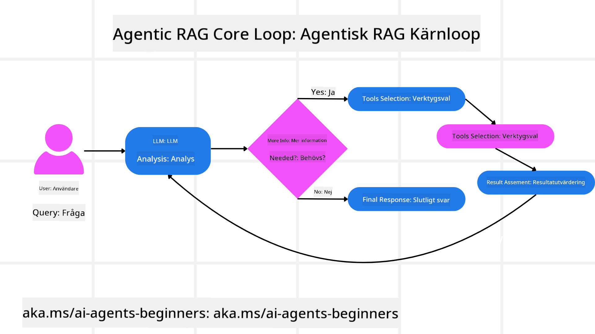
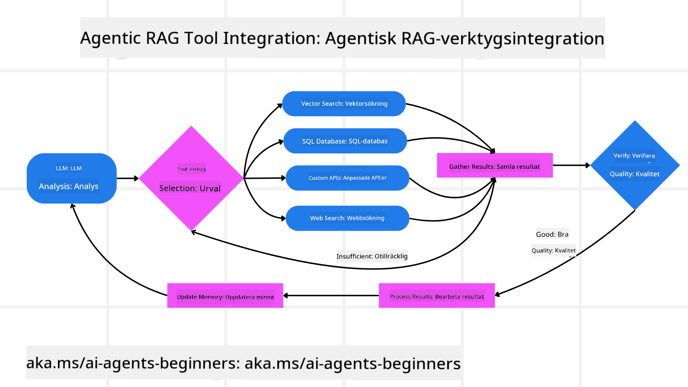
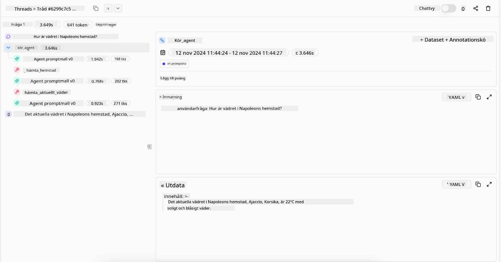

<!--
CO_OP_TRANSLATOR_METADATA:
{
  "original_hash": "0ebf6b2290db55dbf2d10cc49655523b",
  "translation_date": "2025-09-30T07:11:41+00:00",
  "source_file": "05-agentic-rag/README.md",
  "language_code": "sv"
}
-->

> _(Klicka på bilden ovan för att se videon för denna lektion)_

# Agentic RAG

Den här lektionen ger en omfattande översikt över Agentic Retrieval-Augmented Generation (Agentic RAG), ett framväxande AI-paradigm där stora språkmodeller (LLMs) självständigt planerar sina nästa steg samtidigt som de hämtar information från externa källor. Till skillnad från statiska mönster för hämtning och läsning involverar Agentic RAG iterativa anrop till LLM, varvat med verktygs- eller funktionsanrop och strukturerade utdata. Systemet utvärderar resultat, förfinar frågor, använder ytterligare verktyg vid behov och fortsätter denna cykel tills en tillfredsställande lösning uppnås.

## Introduktion

Den här lektionen kommer att täcka:

- **Förstå Agentic RAG:** Lär dig om det framväxande AI-paradigmet där stora språkmodeller (LLMs) självständigt planerar sina nästa steg samtidigt som de hämtar information från externa datakällor.
- **Förstå Iterativ Maker-Checker-stil:** Förstå loopen av iterativa anrop till LLM, varvat med verktygs- eller funktionsanrop och strukturerade utdata, utformade för att förbättra korrekthet och hantera felaktiga frågor.
- **Utforska praktiska tillämpningar:** Identifiera scenarier där Agentic RAG utmärker sig, såsom miljöer med fokus på korrekthet, komplexa databasinteraktioner och utökade arbetsflöden.

## Lärandemål

Efter att ha avslutat denna lektion kommer du att kunna:

- **Förstå Agentic RAG:** Lär dig om det framväxande AI-paradigmet där stora språkmodeller (LLMs) självständigt planerar sina nästa steg samtidigt som de hämtar information från externa datakällor.
- **Iterativ Maker-Checker-stil:** Förstå konceptet med en loop av iterativa anrop till LLM, varvat med verktygs- eller funktionsanrop och strukturerade utdata, utformade för att förbättra korrekthet och hantera felaktiga frågor.
- **Ta ansvar för resonemangsprocessen:** Förstå systemets förmåga att ta ansvar för sin resonemangsprocess, fatta beslut om hur problem ska hanteras utan att förlita sig på fördefinierade vägar.
- **Arbetsflöde:** Förstå hur en agentisk modell självständigt beslutar att hämta rapporter om marknadstrender, identifiera konkurrentdata, korrelera interna försäljningsmått, syntetisera resultat och utvärdera strategin.
- **Iterativa loopar, verktygsintegration och minne:** Lär dig om systemets beroende av ett loopat interaktionsmönster, bibehålla tillstånd och minne över steg för att undvika repetitiva loopar och fatta informerade beslut.
- **Hantera fel och självkorrigering:** Utforska systemets robusta självkorrigeringsmekanismer, inklusive iterering och omfrågning, användning av diagnostiska verktyg och att falla tillbaka på mänsklig övervakning.
- **Gränser för agentisk förmåga:** Förstå begränsningarna för Agentic RAG, med fokus på domänspecifik autonomi, infrastrukturberoende och respekt för säkerhetsåtgärder.
- **Praktiska användningsområden och värde:** Identifiera scenarier där Agentic RAG utmärker sig, såsom miljöer med fokus på korrekthet, komplexa databasinteraktioner och utökade arbetsflöden.
- **Styrning, transparens och förtroende:** Lär dig om vikten av styrning och transparens, inklusive förklarbart resonemang, kontroll av bias och mänsklig övervakning.

## Vad är Agentic RAG?

Agentic Retrieval-Augmented Generation (Agentic RAG) är ett framväxande AI-paradigm där stora språkmodeller (LLMs) självständigt planerar sina nästa steg samtidigt som de hämtar information från externa källor. Till skillnad från statiska mönster för hämtning och läsning involverar Agentic RAG iterativa anrop till LLM, varvat med verktygs- eller funktionsanrop och strukturerade utdata. Systemet utvärderar resultat, förfinar frågor, använder ytterligare verktyg vid behov och fortsätter denna cykel tills en tillfredsställande lösning uppnås. Denna iterativa "maker-checker"-stil förbättrar korrekthet, hanterar felaktiga frågor och säkerställer högkvalitativa resultat.

Systemet tar aktivt ansvar för sin resonemangsprocess, omskriver misslyckade frågor, väljer olika hämtmetoder och integrerar flera verktyg—såsom vektorsökning i Azure AI Search, SQL-databaser eller anpassade API:er—innan det slutför sitt svar. Den utmärkande egenskapen hos ett agentiskt system är dess förmåga att ta ansvar för sin resonemangsprocess. Traditionella RAG-implementeringar förlitar sig på fördefinierade vägar, men ett agentiskt system bestämmer självständigt sekvensen av steg baserat på kvaliteten på den information det hittar.

## Definition av Agentic Retrieval-Augmented Generation (Agentic RAG)

Agentic Retrieval-Augmented Generation (Agentic RAG) är ett framväxande paradigm inom AI-utveckling där LLMs inte bara hämtar information från externa datakällor utan också självständigt planerar sina nästa steg. Till skillnad från statiska mönster för hämtning och läsning eller noggrant skriptade promptsekvenser involverar Agentic RAG en loop av iterativa anrop till LLM, varvat med verktygs- eller funktionsanrop och strukturerade utdata. Vid varje steg utvärderar systemet de resultat det har fått, beslutar om det ska förfina sina frågor, använder ytterligare verktyg vid behov och fortsätter denna cykel tills det uppnår en tillfredsställande lösning.

Denna iterativa "maker-checker"-stil är utformad för att förbättra korrekthet, hantera felaktiga frågor till strukturerade databaser (t.ex. NL2SQL) och säkerställa balanserade, högkvalitativa resultat. Istället för att enbart förlita sig på noggrant konstruerade promptkedjor tar systemet aktivt ansvar för sin resonemangsprocess. Det kan omskriva frågor som misslyckas, välja olika hämtmetoder och integrera flera verktyg—såsom vektorsökning i Azure AI Search, SQL-databaser eller anpassade API:er—innan det slutför sitt svar. Detta eliminerar behovet av överdrivet komplexa orkestreringsramverk. Istället kan en relativt enkel loop av "LLM-anrop → verktygsanvändning → LLM-anrop → …" ge sofistikerade och välgrundade utdata.

## Ta ansvar för resonemangsprocessen

Den utmärkande egenskapen som gör ett system "agentiskt" är dess förmåga att ta ansvar för sin resonemangsprocess. Traditionella RAG-implementeringar förlitar sig ofta på att människor fördefinierar en väg för modellen: en kedja av tankar som beskriver vad som ska hämtas och när. Men när ett system är verkligen agentiskt beslutar det internt hur det ska närma sig problemet. Det utför inte bara ett skript; det bestämmer självständigt sekvensen av steg baserat på kvaliteten på den information det hittar.

Till exempel, om det ombeds skapa en produktlanseringsstrategi, förlitar det sig inte enbart på en prompt som beskriver hela forsknings- och beslutsprocessen. Istället beslutar den agentiska modellen självständigt att:

1. Hämta aktuella rapporter om marknadstrender med Bing Web Grounding.
2. Identifiera relevant konkurrentdata med Azure AI Search.
3. Korrelera historiska interna försäljningsmått med Azure SQL Database.
4. Syntetisera resultaten till en sammanhängande strategi orkestrerad via Azure OpenAI Service.
5. Utvärdera strategin för luckor eller inkonsekvenser, vilket kan leda till ytterligare en omgång hämtning vid behov.

Alla dessa steg—att förfina frågor, välja källor, iterera tills modellen är "nöjd" med svaret—beslutas av modellen, inte förskriptas av en människa.

## Iterativa loopar, verktygsintegration och minne

Ett agentiskt system förlitar sig på ett loopat interaktionsmönster:

- **Initialt anrop:** Användarens mål (dvs. användarens prompt) presenteras för LLM.
- **Verktygsanvändning:** Om modellen identifierar saknad information eller otydliga instruktioner väljer den ett verktyg eller en hämtmetod—som en vektordatabasfråga (t.ex. Azure AI Search Hybrid search över privat data) eller ett strukturerat SQL-anrop—för att samla mer kontext.
- **Utvärdering och förfining:** Efter att ha granskat den returnerade datan beslutar modellen om informationen är tillräcklig. Om inte, förfinar den frågan, provar ett annat verktyg eller justerar sin metod.
- **Upprepa tills nöjd:** Denna cykel fortsätter tills modellen avgör att den har tillräcklig klarhet och bevis för att leverera ett slutgiltigt, välgrundat svar.
- **Minne och tillstånd:** Eftersom systemet bibehåller tillstånd och minne över steg kan det komma ihåg tidigare försök och deras resultat, undvika repetitiva loopar och fatta mer informerade beslut när det fortskrider.

Med tiden skapar detta en känsla av utvecklande förståelse, vilket gör det möjligt för modellen att navigera komplexa, flerledade uppgifter utan att en människa ständigt behöver ingripa eller omforma prompten.

## Hantera fel och självkorrigering

Agentic RAG:s autonomi innefattar också robusta självkorrigeringsmekanismer. När systemet stöter på återvändsgränder—som att hämta irrelevanta dokument eller stöta på felaktiga frågor—kan det:

- **Iterera och omfråga:** Istället för att returnera svar med lågt värde försöker modellen nya sökstrategier, omskriver databasfrågor eller tittar på alternativa dataset.
- **Använda diagnostiska verktyg:** Systemet kan använda ytterligare funktioner utformade för att hjälpa det att felsöka sina resonemangssteg eller bekräfta korrektheten av hämtad data. Verktyg som Azure AI Tracing kommer att vara viktiga för att möjliggöra robust observabilitet och övervakning.
- **Falla tillbaka på mänsklig övervakning:** För scenarier med höga insatser eller upprepade misslyckanden kan modellen flagga osäkerhet och begära mänsklig vägledning. När människan ger korrigerande feedback kan modellen införliva den lärdomen framöver.

Denna iterativa och dynamiska metod gör det möjligt för modellen att kontinuerligt förbättras, vilket säkerställer att den inte bara är ett engångssystem utan ett som lär sig av sina misstag under en given session.

## Gränser för agentisk förmåga

Trots sin autonomi inom en uppgift är Agentic RAG inte likvärdigt med artificiell generell intelligens. Dess "agentiska" kapabiliteter är begränsade till de verktyg, datakällor och policyer som tillhandahålls av mänskliga utvecklare. Det kan inte skapa sina egna verktyg eller gå utanför de domänbegränsningar som har satts. Istället utmärker det sig genom att dynamiskt orkestrera de resurser som finns tillgängliga.

Viktiga skillnader från mer avancerade AI-former inkluderar:

1. **Domänspecifik autonomi:** Agentic RAG-system fokuserar på att uppnå användardefinierade mål inom en känd domän, och använder strategier som omskrivning av frågor eller verktygsval för att förbättra resultat.
2. **Infrastrukturbaserat:** Systemets kapabiliteter är beroende av de verktyg och data som integrerats av utvecklare. Det kan inte överskrida dessa gränser utan mänsklig intervention.
3. **Respekt för säkerhetsåtgärder:** Etiska riktlinjer, efterlevnadsregler och affärspolicyer förblir mycket viktiga. Agentens frihet är alltid begränsad av säkerhetsåtgärder och övervakningsmekanismer (förhoppningsvis?).

## Praktiska användningsområden och värde

Agentic RAG utmärker sig i scenarier som kräver iterativ förfining och precision:

1. **Miljöer med fokus på korrekthet:** Vid efterlevnadskontroller, regulatorisk analys eller juridisk forskning kan den agentiska modellen upprepade gånger verifiera fakta, konsultera flera källor och omskriva frågor tills den producerar ett noggrant granskat svar.
2. **Komplexa databasinteraktioner:** Vid arbete med strukturerad data där frågor ofta kan misslyckas eller behöva justeras kan systemet självständigt förfina sina frågor med Azure SQL eller Microsoft Fabric OneLake, vilket säkerställer att den slutliga hämtningen överensstämmer med användarens avsikt.
3. **Utökade arbetsflöden:** Längre sessioner kan utvecklas när ny information dyker upp. Agentic RAG kan kontinuerligt införliva ny data och ändra strategier när det lär sig mer om problemområdet.

## Styrning, transparens och förtroende

När dessa system blir mer autonoma i sitt resonemang är styrning och transparens avgörande:

- **Förklarbart resonemang:** Modellen kan tillhandahålla en granskningsspår av de frågor den ställde, de källor den konsulterade och de resonemangssteg den tog för att nå sin slutsats. Verktyg som Azure AI Content Safety och Azure AI Tracing / GenAIOps kan hjälpa till att upprätthålla transparens och minska risker.
- **Kontroll av bias och balanserad hämtning:** Utvecklare kan justera hämtstrategier för att säkerställa att balanserade, representativa datakällor beaktas, och regelbundet granska utdata för att upptäcka bias eller skeva mönster med hjälp av anpassade modeller för avancerade data science-organisationer som använder Azure Machine Learning.
- **Mänsklig övervakning och efterlevnad:** För känsliga uppgifter förblir mänsklig granskning avgörande. Agentic RAG ersätter inte mänskligt omdöme i beslut med höga insatser—det förstärker det genom att leverera mer noggrant granskade alternativ.

Att ha verktyg som tillhandahåller en tydlig redovisning av åtgärder är avgörande. Utan dem kan felsökning av en flerledad process vara mycket svårt. Se följande exempel från Literal AI (företaget bakom Chainlit) för en Agent-run:

## Slutsats

Agentic RAG representerar en naturlig utveckling i hur AI-system hanterar komplexa, dataintensiva uppgifter. Genom att anta ett loopat interaktionsmönster, självständigt välja verktyg och förfina frågor tills det uppnår ett högkvalitativt resultat, går systemet bortom statisk promptföljning till att bli en mer adaptiv, kontextmedveten beslutsfattare. Även om det fortfarande är begränsat av mänskligt definierade infrastrukturer och etiska riktlinjer, möjliggör dessa agentiska kapabiliteter rikare, mer dynamiska och i slutändan mer användbara AI-interaktioner för både företag och slutanvändare.

### Har du fler frågor om Agentic RAG?

Gå med i [Azure AI Foundry Discord](https://aka.ms/ai-agents/discord) för att träffa andra elever, delta i öppet hus och få svar på dina frågor om AI-agenter.

## Ytterligare resurser

- <a href="https://learn.microsoft.com/training/modules/use-own-data-azure-openai" target="_blank">Implementera Retrieval Augmented Generation (RAG) med Azure OpenAI Service: Lär dig hur du använder din egen data med Azure OpenAI Service. Denna Microsoft Learn-modul ger en omfattande guide om att implementera RAG</a>
- <a href="https://learn.microsoft.com/azure/ai-studio/concepts/evaluation-approach-gen-ai" target="_blank">Utvärdering av generativa AI-applikationer med Azure AI Foundry: Denna artikel täcker utvärdering och jämförelse av modeller på offentligt tillgängliga dataset, inklusive agentiska AI-applikationer och RAG-arkitekturer</a>
- <a href="https://weaviate.io/blog/what-is-agentic-rag" target="_blank">Vad är Agentic RAG | Weaviate</a>
- <a href="https://ragaboutit.com/agentic-rag-a-complete-guide-to-agent-based-retrieval-augmented-generation/" target="_blank">Agentic RAG: En komplett guide till agentbaserad Retrieval Augmented Generation – Nyheter från generation RAG</a>
- <a href="https://huggingface.co/learn/cookbook/agent_rag" target="_blank">Agentic RAG: ge din RAG en boost med frågeomformulering och självfrågor! Hugging Face Open-Source AI Cookbook</a>
- <a href="https://youtu.be/aQ4yQXeB1Ss?si=2HUqBzHoeB5tR04U" target="_blank">Lägga till agentiska lager till RAG</a>
- <a href="https://www.youtube.com/watch?v=zeAyuLc_f3Q&t=244s" target="_blank">Kunskapsassistenternas framtid: Jerry Liu</a>
- <a href="https://www.youtube.com/watch?v=AOSjiXP1jmQ" target="_blank">Hur man bygger agentiska RAG-system</a>
- <a href="https://ignite.microsoft.com/sessions/BRK102?source=sessions" target="_blank">Använd Azure AI Foundry Agent Service för att skala dina AI-agenter</a>

### Akademiska artiklar

- <a href="https://arxiv.org/abs/2303.17651" target="_blank">2303.17651 Self-Refine: Iterativ förfining med självfeedback</a>
- <a href="https://arxiv.org/abs/2303.11366" target="_blank">2303.11366 Reflexion: Språkagenter med verbal förstärkningsinlärning</a>
- <a href="https://arxiv.org/abs/2305.11738" target="_blank">2305.11738 CRITIC: Stora språkmodeller kan självkorrigera med verktygsinteraktiv kritik</a>
- <a href="https://arxiv.org/abs/2501.09136" target="_blank">2501.09136 Agentisk Retrieval-Augmented Generation: En översikt över agentisk RAG</a>

## Föregående lektion

[Designmönster för verktygsanvändning](../04-tool-use/README.md)

## Nästa lektion

[Bygga pålitliga AI-agenter](../06-building-trustworthy-agents/README.md)

---

**Ansvarsfriskrivning**:  
Detta dokument har översatts med hjälp av AI-översättningstjänsten [Co-op Translator](https://github.com/Azure/co-op-translator). Även om vi strävar efter noggrannhet, bör det noteras att automatiserade översättningar kan innehålla fel eller brister. Det ursprungliga dokumentet på dess originalspråk bör betraktas som den auktoritativa källan. För kritisk information rekommenderas professionell mänsklig översättning. Vi ansvarar inte för eventuella missförstånd eller feltolkningar som uppstår vid användning av denna översättning.