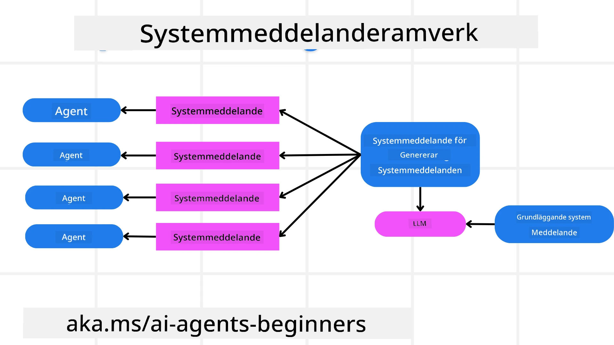
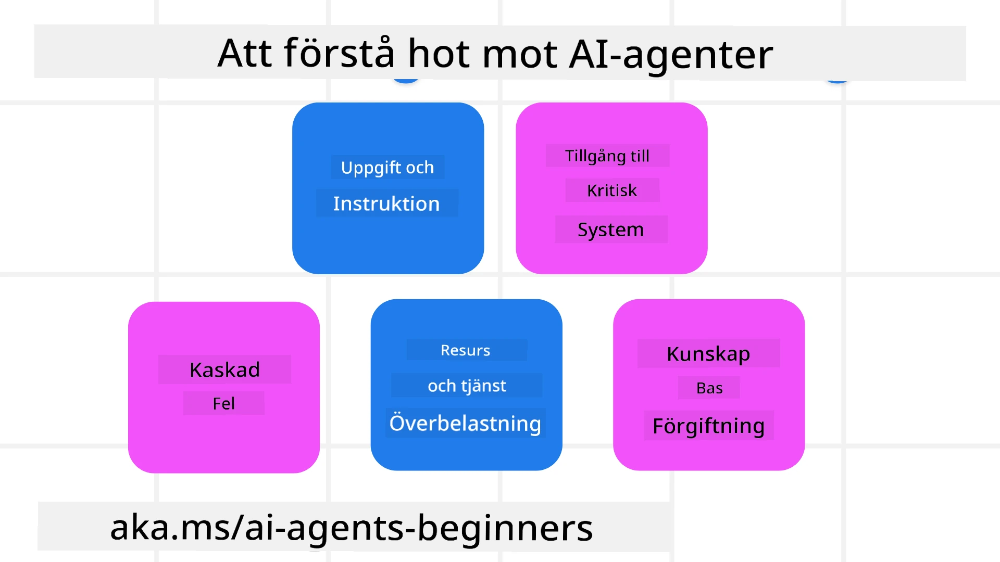
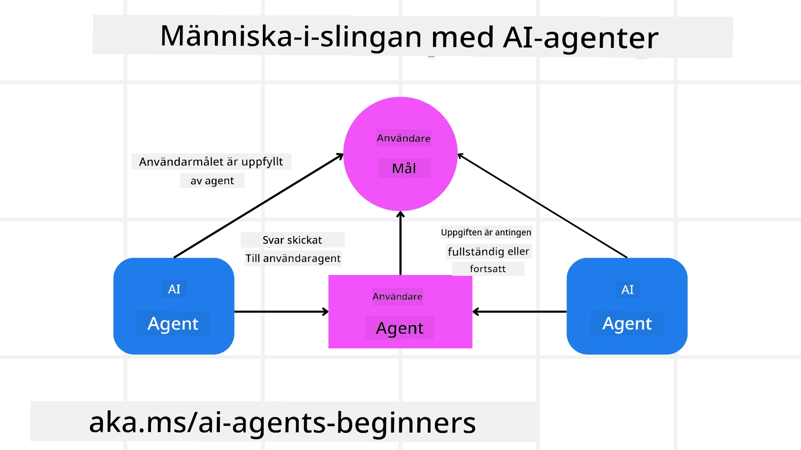

[](https://youtu.be/iZKkMEGBCUQ?si=Q-kEbcyHUMPoHp8L)

> _(Klicka på bilden ovan för att se videon av denna lektion)_

# Att bygga pålitliga AI-agenter

## Introduktion

Den här lektionen täcker:

- Hur man bygger och distribuerar säkra och effektiva AI-agenter
- Viktiga säkerhetsaspekter vid utveckling av AI-agenter.
- Hur man upprätthåller data- och användarintegritet vid utveckling av AI-agenter.

## Inlärningsmål

Efter att ha slutfört denna lektion kommer du att kunna:

- Identifiera och mildra risker vid skapande av AI-agenter.
- Implementera säkerhetsåtgärder för att säkerställa att data och åtkomst hanteras korrekt.
- Skapa AI-agenter som upprätthåller dataintegritet och ger en kvalitativ användarupplevelse.

## Säkerhet

Låt oss först titta på att bygga säkra agentbaserade applikationer. Säkerhet innebär att AI-agenten presterar som avsett. Som utvecklare av agentbaserade applikationer har vi metoder och verktyg för att maximera säkerheten:

### Att bygga en systemmeddelanderam

Om du någonsin har byggt en AI-applikation med hjälp av stora språkmodeller (LLM:er) vet du hur viktigt det är att designa en robust systemprompt eller systemmeddelande. Dessa prompts etablerar meta-regler, instruktioner och riktlinjer för hur LLM:en ska interagera med användaren och data.

För AI-agenter är systemprompten ännu viktigare eftersom AI-agenterna behöver mycket specifika instruktioner för att slutföra de uppgifter vi designat för dem.

För att skapa skalbara systempromptar kan vi använda en systemmeddelanderam för att bygga en eller flera agenter i vår applikation:



#### Steg 1: Skapa ett meta systemmeddelande

Meta-prompten kommer att användas av en LLM för att generera systempromptar för de agenter vi skapar. Vi designar den som en mall så att vi effektivt kan skapa flera agenter vid behov.

Här är ett exempel på ett meta systemmeddelande som vi skulle ge till LLM:

```plaintext
You are an expert at creating AI agent assistants. 
You will be provided a company name, role, responsibilities and other
information that you will use to provide a system prompt for.
To create the system prompt, be descriptive as possible and provide a structure that a system using an LLM can better understand the role and responsibilities of the AI assistant. 
```

#### Steg 2: Skapa en grundläggande prompt

Nästa steg är att skapa en grundläggande prompt som beskriver AI-agenten. Du bör inkludera agentens roll, de uppgifter agenten kommer att utföra och eventuella andra ansvarsområden för agenten.

Här är ett exempel:

```plaintext
You are a travel agent for Contoso Travel that is great at booking flights for customers. To help customers you can perform the following tasks: lookup available flights, book flights, ask for preferences in seating and times for flights, cancel any previously booked flights and alert customers on any delays or cancellations of flights.  
```

#### Steg 3: Ge grundläggande systemmeddelande till LLM

Nu kan vi optimera detta systemmeddelande genom att förse LLM med meta systemmeddelandet som systemmeddelande samt vårt grundläggande systemmeddelande.

Detta kommer att producera ett systemmeddelande som är bättre utformat för att vägleda våra AI-agenter:

```markdown
**Company Name:** Contoso Travel  
**Role:** Travel Agent Assistant

**Objective:**  
You are an AI-powered travel agent assistant for Contoso Travel, specializing in booking flights and providing exceptional customer service. Your main goal is to assist customers in finding, booking, and managing their flights, all while ensuring that their preferences and needs are met efficiently.

**Key Responsibilities:**

1. **Flight Lookup:**
    
    - Assist customers in searching for available flights based on their specified destination, dates, and any other relevant preferences.
    - Provide a list of options, including flight times, airlines, layovers, and pricing.
2. **Flight Booking:**
    
    - Facilitate the booking of flights for customers, ensuring that all details are correctly entered into the system.
    - Confirm bookings and provide customers with their itinerary, including confirmation numbers and any other pertinent information.
3. **Customer Preference Inquiry:**
    
    - Actively ask customers for their preferences regarding seating (e.g., aisle, window, extra legroom) and preferred times for flights (e.g., morning, afternoon, evening).
    - Record these preferences for future reference and tailor suggestions accordingly.
4. **Flight Cancellation:**
    
    - Assist customers in canceling previously booked flights if needed, following company policies and procedures.
    - Notify customers of any necessary refunds or additional steps that may be required for cancellations.
5. **Flight Monitoring:**
    
    - Monitor the status of booked flights and alert customers in real-time about any delays, cancellations, or changes to their flight schedule.
    - Provide updates through preferred communication channels (e.g., email, SMS) as needed.

**Tone and Style:**

- Maintain a friendly, professional, and approachable demeanor in all interactions with customers.
- Ensure that all communication is clear, informative, and tailored to the customer's specific needs and inquiries.

**User Interaction Instructions:**

- Respond to customer queries promptly and accurately.
- Use a conversational style while ensuring professionalism.
- Prioritize customer satisfaction by being attentive, empathetic, and proactive in all assistance provided.

**Additional Notes:**

- Stay updated on any changes to airline policies, travel restrictions, and other relevant information that could impact flight bookings and customer experience.
- Use clear and concise language to explain options and processes, avoiding jargon where possible for better customer understanding.

This AI assistant is designed to streamline the flight booking process for customers of Contoso Travel, ensuring that all their travel needs are met efficiently and effectively.

```

#### Steg 4: Iterera och förbättra

Värdet av denna systemmeddelanderam är att kunna skala skapandet av systemmeddelanden från flera agenter enklare samt förbättra dina systemmeddelanden över tid. Det är sällan du har ett systemmeddelande som fungerar första gången för ditt kompletta användningsfall. Att kunna göra små justeringar och förbättringar genom att ändra det grundläggande systemmeddelandet och köra det genom systemet gör att du kan jämföra och utvärdera resultat.

## Förstå hot

För att bygga pålitliga AI-agenter är det viktigt att förstå och mildra riskerna och hoten mot din AI-agent. Låt oss titta på några av de olika hoten mot AI-agenter och hur du kan planera och förbereda dig bättre för dem.



### Uppgift och instruktion

**Beskrivning:** Angripare försöker ändra AI-agentens instruktioner eller mål genom prompting eller manipulering av input.

**Mildring:** Utför valideringskontroller och inputfilter för att upptäcka potentiellt farliga prompts innan de bearbetas av AI-agenten. Eftersom dessa attacker vanligtvis kräver frekvent interaktion med agenten, är det ett annat sätt att förebygga dessa attacker att begränsa antalet turer i en konversation.

### Tillgång till kritiska system

**Beskrivning:** Om en AI-agent har tillgång till system och tjänster som lagrar känsliga data kan angripare kompromettera kommunikationen mellan agenten och dessa tjänster. Dessa kan vara direkta attacker eller indirekta försök att få information om systemen via agenten.

**Mildring:** AI-agenter bör ha tillgång till system endast vid behov för att förhindra dessa typer av attacker. Kommunikation mellan agent och system bör också vara säker. Implementering av autentisering och åtkomstkontroll är ett annat sätt att skydda denna information.

### Resurs- och tjänsteöverbelastning

**Beskrivning:** AI-agenter kan få tillgång till olika verktyg och tjänster för att slutföra uppgifter. Angripare kan använda denna förmåga för att attackera dessa tjänster genom att skicka en hög volym av förfrågningar via AI-agenten, vilket kan leda till systemfel eller höga kostnader.

**Mildring:** Implementera policys för att begränsa antalet förfrågningar en AI-agent kan göra till en tjänst. Att begränsa antalet samtalsturer och förfrågningar till din AI-agent är ett annat sätt att förhindra dessa typer av attacker.

### Förgiftning av kunskapsbasen

**Beskrivning:** Denna typ av attack riktar sig inte direkt mot AI-agenten utan mot kunskapsbasen och andra tjänster som AI-agenten använder. Det kan handla om att korrupta data eller information som AI-agenten använder för att lösa en uppgift, vilket leder till partiska eller oavsiktliga svar till användaren.

**Mildring:** Utför regelbunden verifiering av den data som AI-agenten kommer att använda i sina arbetsflöden. Säkerställ att åtkomsten till denna data är säker och endast ändras av betrodda individer för att undvika denna typ av attack.

### Kaskaderande fel

**Beskrivning:** AI-agenter använder olika verktyg och tjänster för att slutföra uppgifter. Fel orsakade av angripare kan leda till att andra system som AI-agenten är ansluten till drabbas, vilket gör attacken mer utbredd och svårare att felsöka.

**Mildring:** En metod för att undvika detta är att låta AI-agenten arbeta i en begränsad miljö, till exempel genom att utföra uppgifter i en Docker-container, för att förhindra direkta systemattacker. Att skapa fallback-mekanismer och omförsökningslogik när vissa system svarar med ett fel är ett annat sätt att förhindra större systemfel.

## Människa-i-banan

Ett annat effektivt sätt att bygga pålitliga AI-agentssystem är att använda en människa-i-banan. Detta skapar ett flöde där användare kan ge feedback till agenterna under körningen. Användare agerar i praktiken som agenter i ett multi-agent-system och kan ge godkännande eller avbryta körningen.



Här är ett kodexempel som använder Microsoft Agent Framework för att visa hur detta koncept implementeras:

```python
import os
from agent_framework.azure import AzureAIProjectAgentProvider
from azure.identity import AzureCliCredential

# Skapa leverantören med mänsklig godkännande i loopen
provider = AzureAIProjectAgentProvider(
    credential=AzureCliCredential(),
)

# Skapa agenten med ett steg för mänskligt godkännande
response = provider.create_response(
    input="Write a 4-line poem about the ocean.",
    instructions="You are a helpful assistant. Ask for user approval before finalizing.",
)

# Användaren kan granska och godkänna svaret
print(response.output_text)
user_input = input("Do you approve? (APPROVE/REJECT): ")
if user_input == "APPROVE":
    print("Response approved.")
else:
    print("Response rejected. Revising...")
```

## Slutsats

Att bygga pålitliga AI-agenter kräver noggrann design, robusta säkerhetsåtgärder och kontinuerlig iteration. Genom att implementera strukturerade meta-promptingsystem, förstå potentiella hot och tillämpa mildringsstrategier kan utvecklare skapa AI-agenter som är både säkra och effektiva. Dessutom säkerställer införandet av en människa-i-banan-approach att AI-agenter förblir i linje med användarnas behov samtidigt som riskerna minimeras. I takt med att AI fortsätter att utvecklas kommer en proaktiv inställning till säkerhet, integritet och etiska överväganden vara nyckeln till att främja förtroende och pålitlighet i AI-drivna system.

## Kodexempel

- [`code_samples/06-system-message-framework.ipynb`](code_samples/06-system-message-framework.ipynb): Steg-för-steg-demonstration av meta-prompt systemmeddelanderamverket.
- [`code_samples/06-human-in-the-loop.ipynb`](code_samples/06-human-in-the-loop.ipynb): Godkännandesteg före åtgärder, riskindelning och revisionslogg för pålitliga agenter.

### Har du fler frågor om att bygga pålitliga AI-agenter?

Gå med i [Microsoft Foundry Discord](https://aka.ms/ai-agents/discord) för att träffa andra elever, delta i kontorstimmar och få dina frågor om AI-agenter besvarade.

## Ytterligare resurser

- <a href="https://learn.microsoft.com/azure/ai-studio/responsible-use-of-ai-overview" target="_blank">Översikt av ansvarsfull AI</a>
- <a href="https://learn.microsoft.com/azure/ai-studio/concepts/evaluation-approach-gen-ai" target="_blank">Utvärdering av generativa AI-modeller och AI-applikationer</a>
- <a href="https://learn.microsoft.com/azure/ai-services/openai/concepts/system-message?context=%2Fazure%2Fai-studio%2Fcontext%2Fcontext&tabs=top-techniques" target="_blank">Säkerhetssystemmeddelanden</a>
- <a href="https://blogs.microsoft.com/wp-content/uploads/prod/sites/5/2022/06/Microsoft-RAI-Impact-Assessment-Template.pdf?culture=en-us&country=us" target="_blank">Mall för riskbedömning</a>

## Föregående lektion

[Agentic RAG](../05-agentic-rag/README.md)

## Nästa lektion

[Planeringsdesignmönster](../07-planning-design/README.md)

---

<!-- CO-OP TRANSLATOR DISCLAIMER START -->
**Ansvarsfriskrivning**:
Detta dokument har översatts med hjälp av AI-översättningstjänsten [Co-op Translator](https://github.com/Azure/co-op-translator). Även om vi strävar efter noggrannhet, var vänlig notera att automatiska översättningar kan innehålla fel eller brister. Det ursprungliga dokumentet på dess modersmål bör betraktas som den auktoritativa källan. För kritisk information rekommenderas professionell mänsklig översättning. Vi ansvarar inte för några missförstånd eller feltolkningar som uppstår till följd av användningen av denna översättning.
<!-- CO-OP TRANSLATOR DISCLAIMER END -->