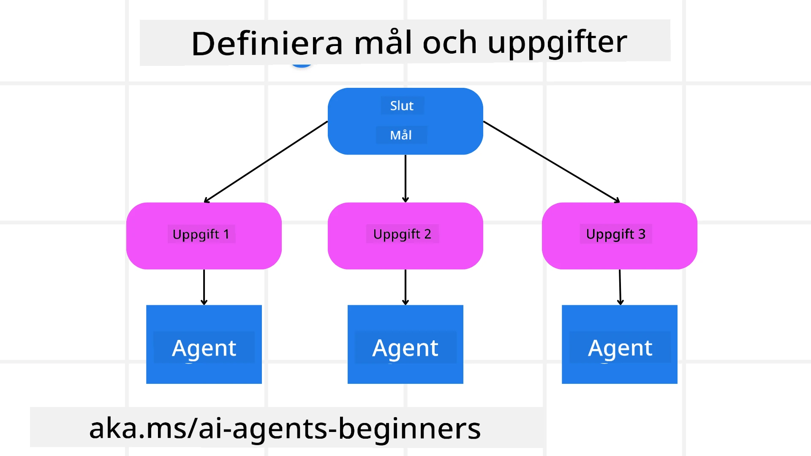

[](https://youtu.be/kPfJ2BrBCMY?si=9pYpPXp0sSbK91Dr)

> _(Klicka på bilden ovan för att se video av denna lektion)_

# Planeringsdesign

## Introduktion

Denna lektion kommer att täcka

* Att definiera ett tydligt övergripande mål och bryta ned en komplex uppgift i hanterbara deluppgifter.
* Att utnyttja strukturerad output för mer pålitliga och maskinläsbara svar.
* Att tillämpa en händelsestyrd metod för att hantera dynamiska uppgifter och oväntade indata.

## Lärandemål

Efter att ha slutfört denna lektion kommer du att ha en förståelse för:

* Identifiera och sätta ett övergripande mål för en AI-agent, och säkerställa att det klart framgår vad som ska uppnås.
* Dela upp en komplex uppgift i hanterbara deluppgifter och organisera dem i en logisk ordning.
* Utrusta agenter med rätt verktyg (t.ex. sökverktyg eller dataanalysverktyg), bestämma när och hur de används, och hantera oväntade situationer som uppstår.
* Utvärdera resultat av deluppgifter, mäta prestation och iterera åtgärder för att förbättra slutresultatet.

## Definiera det övergripande målet och bryta ned en uppgift



De flesta verkliga uppgifter är för komplexa för att hantera i ett enda steg. En AI-agent behöver ett koncist mål att styra sin planering och handlingar efter. Till exempel, överväg målet:

    "Skapa en 3-dagars resplan."

Även om det är enkelt att säga, kräver det fortfarande förfining. Ju tydligare målet är, desto bättre kan agenten (och eventuella mänskliga samarbetspartner) fokusera på att uppnå rätt resultat, såsom att skapa en omfattande resplan med flygalternativ, hotellrekommendationer och aktivitetsförslag.

### Uppgiftsuppdelning

Stora eller invecklade uppgifter blir mer hanterbara när de delas upp i mindre, målorienterade deluppgifter.  
För exemplet med resplanen kan du dela upp målet i:

* Flygbokning
* Hotellbokning
* Biluthyrning
* Personalisering

Varje deluppgift kan därefter hanteras av dedikerade agenter eller processer. En agent kan specialisera sig på att söka efter de bästa flygpriserna, en annan fokuserar på hotellbokningar, och så vidare. En koordinerande eller ”efterföljande” agent kan sedan sammanställa dessa resultat till en sammanhållen resplan för slutanvändaren.

Detta modulära tillvägagångssätt möjliggör också successiva förbättringar. Till exempel kan du lägga till specialiserade agenter för matrekommendationer eller lokala aktivitetsförslag och förfina resplanen över tid.

### Strukturerad output

Stora språkmodeller (LLMs) kan generera strukturerad output (t.ex. JSON) som är enklare för efterföljande agenter eller tjänster att tolka och bearbeta. Detta är särskilt användbart i ett multi-agent-sammanhang, där vi kan verkställa dessa uppgifter efter att planeringsoutputen tagits emot.

Följande Python-exempel demonstrerar en enkel planeringsagent som delar upp ett mål i deluppgifter och genererar en strukturerad plan:

```python
from pydantic import BaseModel
from enum import Enum
from typing import List, Optional, Union
import json
import os
from typing import Optional
from pprint import pprint
from agent_framework.azure import AzureAIProjectAgentProvider
from azure.identity import AzureCliCredential

class AgentEnum(str, Enum):
    FlightBooking = "flight_booking"
    HotelBooking = "hotel_booking"
    CarRental = "car_rental"
    ActivitiesBooking = "activities_booking"
    DestinationInfo = "destination_info"
    DefaultAgent = "default_agent"
    GroupChatManager = "group_chat_manager"

# Resa Deluppgift Modell
class TravelSubTask(BaseModel):
    task_details: str
    assigned_agent: AgentEnum  # vi vill tilldela uppgiften till agenten

class TravelPlan(BaseModel):
    main_task: str
    subtasks: List[TravelSubTask]
    is_greeting: bool

provider = AzureAIProjectAgentProvider(credential=AzureCliCredential())

# Definiera användarens meddelande
system_prompt = """You are a planner agent.
    Your job is to decide which agents to run based on the user's request.
    Provide your response in JSON format with the following structure:
{'main_task': 'Plan a family trip from Singapore to Melbourne.',
 'subtasks': [{'assigned_agent': 'flight_booking',
               'task_details': 'Book round-trip flights from Singapore to '
                               'Melbourne.'}
    Below are the available agents specialised in different tasks:
    - FlightBooking: For booking flights and providing flight information
    - HotelBooking: For booking hotels and providing hotel information
    - CarRental: For booking cars and providing car rental information
    - ActivitiesBooking: For booking activities and providing activity information
    - DestinationInfo: For providing information about destinations
    - DefaultAgent: For handling general requests"""

user_message = "Create a travel plan for a family of 2 kids from Singapore to Melbourne"

response = client.create_response(input=user_message, instructions=system_prompt)

response_content = response.output_text
pprint(json.loads(response_content))
```

### Planeringsagent med multi-agent samordning

I detta exempel tar en Semantic Router Agent emot en användarförfrågan (t.ex. "Jag behöver en hotellplan för min resa.").

Planeraren gör sedan:

* Tar emot hotellplanen: Planeraren tar användarens meddelande och, baserat på en system-prompt (inklusive tillgängliga agentdetaljer), genererar en strukturerad reseplan.
* Listar agenter och deras verktyg: Agentregistret innehåller en lista över agenter (t.ex. för flyg, hotell, biluthyrning och aktiviteter) samt vilka funktioner eller verktyg de erbjuder.
* Skickar planen till respektive agenter: Beroende på antalet deluppgifter skickar planeraren antingen meddelandet direkt till en dedikerad agent (för enkla uppgifter) eller koordinerar via en gruppchatt-ansvarig för samarbete mellan flera agenter.
* Sammanfattar resultatet: Slutligen sammanfattar planeraren den genererade planen för tydlighet.
Följande Python-exempel illustrerar dessa steg:

```python

from pydantic import BaseModel

from enum import Enum
from typing import List, Optional, Union

class AgentEnum(str, Enum):
    FlightBooking = "flight_booking"
    HotelBooking = "hotel_booking"
    CarRental = "car_rental"
    ActivitiesBooking = "activities_booking"
    DestinationInfo = "destination_info"
    DefaultAgent = "default_agent"
    GroupChatManager = "group_chat_manager"

# Resa deluppgiftsmodell

class TravelSubTask(BaseModel):
    task_details: str
    assigned_agent: AgentEnum # vi vill tilldela uppgiften till agenten

class TravelPlan(BaseModel):
    main_task: str
    subtasks: List[TravelSubTask]
    is_greeting: bool
import json
import os
from typing import Optional

from agent_framework.azure import AzureAIProjectAgentProvider
from azure.identity import AzureCliCredential

# Skapa klienten

provider = AzureAIProjectAgentProvider(credential=AzureCliCredential())

from pprint import pprint

# Definiera användarmeddelandet

system_prompt = """You are a planner agent.
    Your job is to decide which agents to run based on the user's request.
    Below are the available agents specialized in different tasks:
    - FlightBooking: For booking flights and providing flight information
    - HotelBooking: For booking hotels and providing hotel information
    - CarRental: For booking cars and providing car rental information
    - ActivitiesBooking: For booking activities and providing activity information
    - DestinationInfo: For providing information about destinations
    - DefaultAgent: For handling general requests"""

user_message = "Create a travel plan for a family of 2 kids from Singapore to Melbourne"

response = client.create_response(input=user_message, instructions=system_prompt)

response_content = response.output_text

# Skriv ut svarsinnehållet efter att ha laddat det som JSON

pprint(json.loads(response_content))
```

Nedan följer output från föregående kod och du kan sedan använda denna strukturerade output för att dirigera till `assigned_agent` och sammanfatta reseplanen för slutanvändaren.

```json
{
    "is_greeting": "False",
    "main_task": "Plan a family trip from Singapore to Melbourne.",
    "subtasks": [
        {
            "assigned_agent": "flight_booking",
            "task_details": "Book round-trip flights from Singapore to Melbourne."
        },
        {
            "assigned_agent": "hotel_booking",
            "task_details": "Find family-friendly hotels in Melbourne."
        },
        {
            "assigned_agent": "car_rental",
            "task_details": "Arrange a car rental suitable for a family of four in Melbourne."
        },
        {
            "assigned_agent": "activities_booking",
            "task_details": "List family-friendly activities in Melbourne."
        },
        {
            "assigned_agent": "destination_info",
            "task_details": "Provide information about Melbourne as a travel destination."
        }
    ]
}
```

En exempel-notebook med föregående kodexempel finns tillgänglig [här](07-python-agent-framework.ipynb).

### Iterativ planering

Vissa uppgifter kräver en fram-och-tillbaka-process eller omplanering, där resultatet av en deluppgift påverkar nästa. Till exempel, om agenten upptäcker ett oväntat dataformat vid flygbokning kan den behöva anpassa sin strategi innan den går vidare till hotellbokning.

Dessutom kan användarfeedback (t.ex. att en människa bestämmer sig för att de föredrar ett tidigare flyg) trigga en partiell omplanering. Detta dynamiska, iterativa tillvägagångssätt säkerställer att den slutgiltiga lösningen överensstämmer med verkliga begränsningar och utvecklande användarpreferenser.

t.ex. exempelkod

```python
from agent_framework.azure import AzureAIProjectAgentProvider
from azure.identity import AzureCliCredential
#.. samma som föregående kod och vidarebefordra användarhistoriken, nuvarande plan

system_prompt = """You are a planner agent to optimize the
    Your job is to decide which agents to run based on the user's request.
    Below are the available agents specialized in different tasks:
    - FlightBooking: For booking flights and providing flight information
    - HotelBooking: For booking hotels and providing hotel information
    - CarRental: For booking cars and providing car rental information
    - ActivitiesBooking: For booking activities and providing activity information
    - DestinationInfo: For providing information about destinations
    - DefaultAgent: For handling general requests"""

user_message = "Create a travel plan for a family of 2 kids from Singapore to Melbourne"

response = client.create_response(
    input=user_message,
    instructions=system_prompt,
    context=f"Previous travel plan - {TravelPlan}",
)
# .. planera om och skicka uppgifterna till respektive agenter
```
  
För mer omfattande planering, kolla in Magnetic One <a href="https://www.microsoft.com/research/articles/magentic-one-a-generalist-multi-agent-system-for-solving-complex-tasks" target="_blank">Bloggpost</a> för att lösa komplexa uppgifter.

## Sammanfattning

I denna artikel har vi tittat på ett exempel på hur vi kan skapa en planerare som dynamiskt kan välja tillgängliga agenter som definierats. Utdata från planeraren delar upp uppgifterna och tilldelar agenter så att de kan utföras. Det förutsätts att agenterna har tillgång till de funktioner/verktyg som krävs för att utföra uppgiften. Utöver agenterna kan du inkludera andra mönster som reflektion, summerare och round robin-chatt för ytterligare anpassning.

## Ytterligare resurser

Magnetic One - Ett generell multi-agent-system för att lösa komplexa uppgifter som har uppnått imponerande resultat på flera utmanande agent-benchmarks. Referens: <a href="https://www.microsoft.com/research/articles/magentic-one-a-generalist-multi-agent-system-for-solving-complex-tasks" target="_blank">Magnetic One</a>. I denna implementation skapar orkestratorn uppgiftsspecifika planer och delegerar dessa uppgifter till tillgängliga agenter. Utöver planeringen använder orkestratorn också en spårningsmekanism för att övervaka uppgiftens framsteg och omplanerar vid behov.

### Har du fler frågor om Planeringsdesignmönstret?

Gå med i [Microsoft Foundry Discord](https://aka.ms/ai-agents/discord) för att träffa andra studerande, delta i öppna kontorstider och få svar på dina frågor om AI-agenter.

## Föregående lektion

[Skapa Pålitliga AI-agenter](../06-building-trustworthy-agents/README.md)

## Nästa lektion

[Multi-agent Designmönster](../08-multi-agent/README.md)

---

<!-- CO-OP TRANSLATOR DISCLAIMER START -->
**Ansvarsfriskrivning**:
Detta dokument har översatts med hjälp av AI-översättningstjänsten [Co-op Translator](https://github.com/Azure/co-op-translator). Även om vi strävar efter noggrannhet, vänligen observera att automatiska översättningar kan innehålla fel eller brister. Det ursprungliga dokumentet på dess modersmål bör anses vara den auktoritativa källan. För viktig information rekommenderas professionell human översättning. Vi ansvarar inte för några missförstånd eller feltolkningar som uppstår till följd av användningen av denna översättning.
<!-- CO-OP TRANSLATOR DISCLAIMER END -->