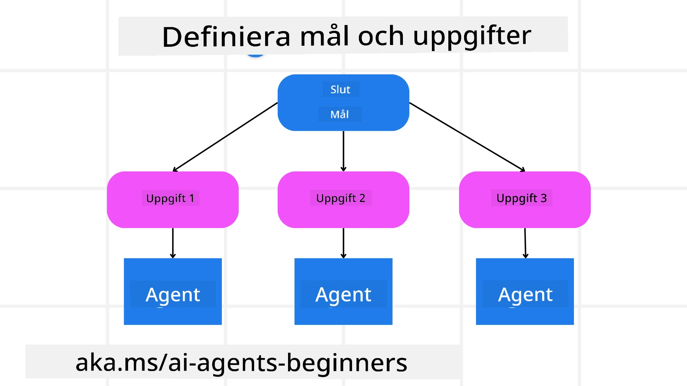

[](https://youtu.be/kPfJ2BrBCMY?si=9pYpPXp0sSbK91Dr)

> _(Klicka på bilden ovan för att se videon av denna lektion)_

# Planning Design

## Introduktion

Denna lektion kommer att täcka

* Att definiera ett tydligt övergripande mål och dela upp en komplex uppgift i hanterbara deluppgifter.
* Att använda strukturerad utdata för mer pålitliga och maskinläsbara svar.
* Att tillämpa en händelsestyrd metod för att hantera dynamiska uppgifter och oväntade indata.

## Lärandemål

Efter att ha genomfört denna lektion kommer du att ha förståelse för:

* Identifiera och sätta ett övergripande mål för en AI-agent, så att den tydligt vet vad som behöver uppnås.
* Dela upp en komplex uppgift i hanterbara deluppgifter och organisera dem i en logisk ordning.
* Utrusta agenter med rätt verktyg (t.ex. sökverktyg eller dataanalysverktyg), bestämma när och hur de ska användas, samt hantera oväntade situationer som uppstår.
* Utvärdera resultat från deluppgifter, mäta prestanda och iterera på åtgärder för att förbättra slutresultatet.

## Definiera det övergripande målet och bryt ner en uppgift



De flesta verkliga uppgifter är för komplexa för att hanteras i ett enda steg. En AI-agent behöver ett koncist mål för att vägleda sin planering och sina handlingar. Till exempel, betrakta målet:

    "Generera en 3-dagars reseplan."

Även om det är enkelt att formulera, behöver det ändå förfinas. Ju tydligare målet är, desto bättre kan agenten (och eventuella mänskliga medarbetare) fokusera på att uppnå rätt resultat, som att skapa en heltäckande resplan med flygalternativ, hotellrekommendationer och aktivitetsförslag.

### Uppgiftsnedbrytning

Stora eller invecklade uppgifter blir mer hanterbara när de delas upp i mindre, målorienterade deluppgifter.
För exemplet med reseplanen kan du dela upp målet i:

* Flygbokning
* Hotellbokning
* Biluthyrning
* Personalisering

Varje deluppgift kan sedan hanteras av dedikerade agenter eller processer. En agent kan specialisera sig på att söka efter bästa flygerbjudandena, en annan fokuserar på hotellbokningar, och så vidare. En koordinerande eller ”nedströms” agent kan sedan sammanställa dessa resultat till en sammanhängande resplan för slutanvändaren.

Detta modulära tillvägagångssätt möjliggör också gradvisa förbättringar. Till exempel kan du lägga till specialiserade agenter för Matrekommendationer eller Lokala aktivitetsförslag och förfina resplanen över tid.

### Strukturerad utdata

Stora språkmodeller (LLMs) kan generera strukturerad utdata (t.ex. JSON) som är enklare för nedströmsagenter eller tjänster att tolka och bearbeta. Detta är särskilt användbart i ett multi-agent-sammanhang, där vi kan agera på dessa uppgifter efter att planeringsutdata mottagits.

Följande Python-exempel visar en enkel planeringsagent som delar upp ett mål i deluppgifter och genererar en strukturerad plan:

```python
from pydantic import BaseModel
from enum import Enum
from typing import List, Optional, Union
import json
import os
from typing import Optional
from pprint import pprint
from agent_framework.foundry import FoundryChatClient
from azure.identity import AzureCliCredential

class AgentEnum(str, Enum):
    FlightBooking = "flight_booking"
    HotelBooking = "hotel_booking"
    CarRental = "car_rental"
    ActivitiesBooking = "activities_booking"
    DestinationInfo = "destination_info"
    DefaultAgent = "default_agent"
    GroupChatManager = "group_chat_manager"

# Resa Deluppgiftsmodell
class TravelSubTask(BaseModel):
    task_details: str
    assigned_agent: AgentEnum  # vi vill tilldela uppgiften till agenten

class TravelPlan(BaseModel):
    main_task: str
    subtasks: List[TravelSubTask]
    is_greeting: bool

provider = FoundryChatClient(
    project_endpoint=os.environ["AZURE_AI_PROJECT_ENDPOINT"],
    model=os.environ["AZURE_AI_MODEL_DEPLOYMENT_NAME"],
    credential=AzureCliCredential(),
)

# Definiera användarmeddelandet
system_prompt = """You are a planner agent.
    Your job is to decide which agents to run based on the user's request.
    Provide your response in JSON format with the following structure:
{'main_task': 'Plan a family trip from Singapore to Melbourne.',
 'subtasks': [{'assigned_agent': 'flight_booking',
               'task_details': 'Book round-trip flights from Singapore to '
                               'Melbourne.'}
    Below are the available agents specialised in different tasks:
    - FlightBooking: For booking flights and providing flight information
    - HotelBooking: For booking hotels and providing hotel information
    - CarRental: For booking cars and providing car rental information
    - ActivitiesBooking: For booking activities and providing activity information
    - DestinationInfo: For providing information about destinations
    - DefaultAgent: For handling general requests"""

user_message = "Create a travel plan for a family of 2 kids from Singapore to Melbourne"

response = client.create_response(input=user_message, instructions=system_prompt)

response_content = response.output_text
pprint(json.loads(response_content))
```

### Planeringsagent med multi-agentorkestrering

I detta exempel får en Semantic Router Agent en användarförfrågan (t.ex. "Jag behöver en hotellplan för min resa.").

Planeraren gör sedan följande:

* Tar emot hotellplanen: Planeraren tar användarens meddelande och genererar, baserat på en systemprompt (inklusive tillgängliga agentdetaljer), en strukturerad reseplan.
* Listar agenter och deras verktyg: Agentregistret håller en lista över agenter (t.ex. för flyg, hotell, biluthyrning och aktiviteter) tillsammans med funktioner eller verktyg de erbjuder.
* Rutterar planen till respektive agenter: Beroende på antalet deluppgifter skickar planeraren antingen meddelandet direkt till en dedikerad agent (för enkla uppgifter) eller koordinerar via en gruppchatthanterare för samarbete mellan flera agenter.
* Sammanfattar resultatet: Slutligen sammanfattar planeraren den genererade planen för tydlighet.
Följande Python-kodexempel illustrerar dessa steg:

```python

from pydantic import BaseModel

from enum import Enum
from typing import List, Optional, Union

class AgentEnum(str, Enum):
    FlightBooking = "flight_booking"
    HotelBooking = "hotel_booking"
    CarRental = "car_rental"
    ActivitiesBooking = "activities_booking"
    DestinationInfo = "destination_info"
    DefaultAgent = "default_agent"
    GroupChatManager = "group_chat_manager"

# Resa Underuppgiftsmodell

class TravelSubTask(BaseModel):
    task_details: str
    assigned_agent: AgentEnum # vi vill tilldela uppgiften till agenten

class TravelPlan(BaseModel):
    main_task: str
    subtasks: List[TravelSubTask]
    is_greeting: bool
import json
import os
from typing import Optional

from agent_framework.foundry import FoundryChatClient
from azure.identity import AzureCliCredential

# Skapa klienten

provider = FoundryChatClient(
    project_endpoint=os.environ["AZURE_AI_PROJECT_ENDPOINT"],
    model=os.environ["AZURE_AI_MODEL_DEPLOYMENT_NAME"],
    credential=AzureCliCredential(),
)

from pprint import pprint

# Definiera användarmeddelandet

system_prompt = """You are a planner agent.
    Your job is to decide which agents to run based on the user's request.
    Below are the available agents specialized in different tasks:
    - FlightBooking: For booking flights and providing flight information
    - HotelBooking: For booking hotels and providing hotel information
    - CarRental: For booking cars and providing car rental information
    - ActivitiesBooking: For booking activities and providing activity information
    - DestinationInfo: For providing information about destinations
    - DefaultAgent: For handling general requests"""

user_message = "Create a travel plan for a family of 2 kids from Singapore to Melbourne"

response = client.create_response(input=user_message, instructions=system_prompt)

response_content = response.output_text

# Skriv ut svarsinnehållet efter att ha laddat det som JSON

pprint(json.loads(response_content))
```

Det som följer är utdata från tidigare kod och du kan sedan använda denna strukturerade utdata för att ruttera till `assigned_agent` och sammanfatta reseplanen för slutanvändaren.

```json
{
    "is_greeting": "False",
    "main_task": "Plan a family trip from Singapore to Melbourne.",
    "subtasks": [
        {
            "assigned_agent": "flight_booking",
            "task_details": "Book round-trip flights from Singapore to Melbourne."
        },
        {
            "assigned_agent": "hotel_booking",
            "task_details": "Find family-friendly hotels in Melbourne."
        },
        {
            "assigned_agent": "car_rental",
            "task_details": "Arrange a car rental suitable for a family of four in Melbourne."
        },
        {
            "assigned_agent": "activities_booking",
            "task_details": "List family-friendly activities in Melbourne."
        },
        {
            "assigned_agent": "destination_info",
            "task_details": "Provide information about Melbourne as a travel destination."
        }
    ]
}
```

Ett exempelnotebook med ovanstående kodexempel finns tillgängligt [här](./code_samples/07-python-agent-framework.ipynb).

### Iterativ planering

Vissa uppgifter kräver fram-och-tillbaka eller omplanering, där resultatet av en deluppgift påverkar nästa. Till exempel, om agenten upptäcker ett oväntat dataformat när flygbokningar görs, kan den behöva anpassa sin strategi innan den går vidare till hotellbokningar.

Dessutom kan användarfeedback (t.ex. en människa som bestämmer att de föredrar ett tidigare flyg) trigga en partiell omplanering. Denna dynamiska, iterativa metod säkerställer att slutlösningen är anpassad efter verkliga begränsningar och föränderliga användarpreferenser.

t.ex. exempel på kod

```python
import os
from agent_framework.foundry import FoundryChatClient
from azure.identity import AzureCliCredential
#.. samma som tidigare kod och skicka vidare användarhistoriken, nuvarande plan

system_prompt = """You are a planner agent to optimize the
    Your job is to decide which agents to run based on the user's request.
    Below are the available agents specialized in different tasks:
    - FlightBooking: For booking flights and providing flight information
    - HotelBooking: For booking hotels and providing hotel information
    - CarRental: For booking cars and providing car rental information
    - ActivitiesBooking: For booking activities and providing activity information
    - DestinationInfo: For providing information about destinations
    - DefaultAgent: For handling general requests"""

user_message = "Create a travel plan for a family of 2 kids from Singapore to Melbourne"

response = client.create_response(
    input=user_message,
    instructions=system_prompt,
    context=f"Previous travel plan - {TravelPlan}",
)
# .. planera om och skicka uppgifterna till respektive agenter
```

För mer omfattande planering, kolla in Magnetic One <a href="https://www.microsoft.com/research/articles/magentic-one-a-generalist-multi-agent-system-for-solving-complex-tasks" target="_blank">Bloggpost</a> för att lösa komplexa uppgifter.

## Sammanfattning

I denna artikel har vi tittat på ett exempel på hur vi kan skapa en planerare som dynamiskt kan välja tillgängliga agenter som definierats. Utdata från Planeraren delar upp uppgifterna och tilldelar agenterna så att de kan utföras. Det antas att agenterna har tillgång till de funktioner/verktyg som krävs för att utföra uppgiften. Utöver agenter kan du inkludera andra mönster som reflektion, sammanfattare och round robin-chat för att ytterligare anpassa.

## Ytterligare resurser

Magnetic One - Ett generalistmässigt multi-agent-system för att lösa komplexa uppgifter som har uppnått imponerande resultat på flera utmanande agentbenchmarks. Referens: <a href="https://www.microsoft.com/research/articles/magentic-one-a-generalist-multi-agent-system-for-solving-complex-tasks" target="_blank">Magnetic One</a>. I denna implementation skapar orkestratorn uppgiftsspecifika planer och delegerar dessa till de tillgängliga agenterna. Utöver planering använder orkestratorn även en spårningsmekanism för att följa uppgifternas framsteg och omplanerar vid behov.

### Har du fler frågor om Planning Design Pattern?

Gå med i [Microsoft Foundry Discord](https://discord.com/invite/ATgtXmAS5D) för att träffa andra lärande, delta i kontorstid och få svar på dina frågor om AI-agenter.

## Föregående lektion

[Bygga pålitliga AI-agenter](../06-building-trustworthy-agents/README.md)

## Nästa lektion

[Multi-Agent Design Pattern](../08-multi-agent/README.md)

---

<!-- CO-OP TRANSLATOR DISCLAIMER START -->
**Ansvarsfriskrivning**:
Detta dokument har översatts med hjälp av AI-översättningstjänsten [Co-op Translator](https://github.com/Azure/co-op-translator). Även om vi strävar efter noggrannhet, var vänlig notera att automatiska översättningar kan innehålla fel eller brister. Det ursprungliga dokumentet på dess modersmål bör betraktas som den auktoritativa källan. För kritisk information rekommenderas professionell mänsklig översättning. Vi ansvarar inte för några missförstånd eller feltolkningar som uppstår till följd av användningen av denna översättning.
<!-- CO-OP TRANSLATOR DISCLAIMER END -->