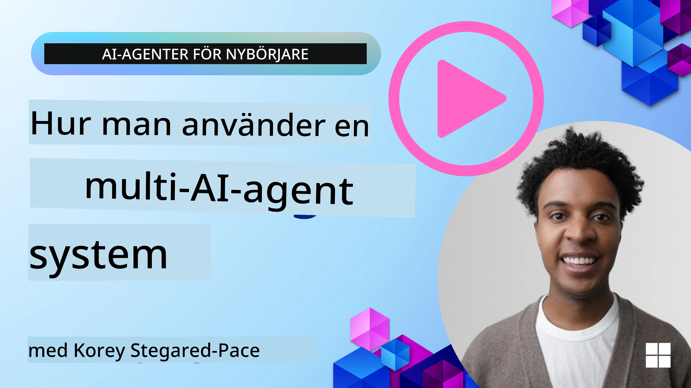
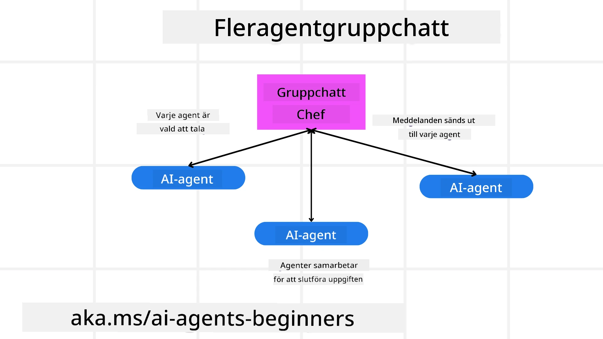
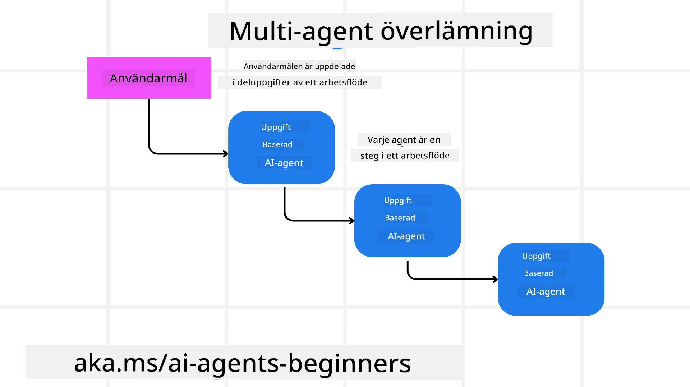
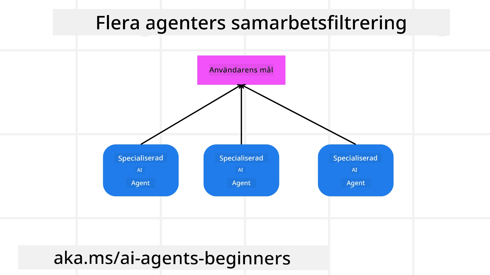

> _(Klicka på bilden ovan för att se videon av denna lektion)_

# Multi-agent designmönster

Så snart du börjar arbeta på ett projekt som involverar flera agenter behöver du överväga multi-agent designmönstret. Det är dock inte alltid omedelbart tydligt när man ska byta till multi-agenter och vilka fördelarna är.

## Introduktion

I denna lektion försöker vi besvara följande frågor:

- Vilka scenarier är tillämpliga för multi-agenter?
- Vilka är fördelarna med att använda multi-agenter jämfört med en enda agent som utför flera uppgifter?
- Vilka är byggstenarna för att implementera multi-agent designmönstret?
- Hur får vi insyn i hur flera agenter interagerar med varandra?

## Lärandemål

Efter denna lektion bör du kunna:

- Identifiera scenarier där multi-agenter är tillämpliga
- Känna igen fördelarna med att använda multi-agenter istället för en enda agent.
- Förstå byggstenarna för att implementera multi-agent designmönstret.

Vad är den större bilden?

*Multi-agenter är ett designmönster som tillåter flera agenter att arbeta tillsammans för att uppnå ett gemensamt mål*.

Detta mönster används flitigt inom olika områden, inklusive robotik, autonoma system och distribuerad databehandling.

## Scenarier där multi-agenter är tillämpliga

Så vilka scenarier är en bra användning för att använda multi-agenter? Svaret är att det finns många scenarier där att använda flera agenter är fördelaktigt särskilt i följande fall:

- **Stora arbetsbelastningar:** Stora arbetsbelastningar kan delas upp i mindre uppgifter och tilldelas olika agenter, vilket möjliggör parallell bearbetning och snabbare slutförande. Ett exempel på detta är vid en stor databehandlingsuppgift.
- **Komplexa uppgifter:** Komplexa uppgifter, likt stora arbetsbelastningar, kan brytas ned i mindre deluppgifter och tilldelas olika agenter, där varje agent specialiserar sig på en specifik del av uppgiften. Ett bra exempel är autonoma fordon där olika agenter hanterar navigering, hinderupptäckt och kommunikation med andra fordon.
- **Olika expertis:** Olika agenter kan ha skiftande expertis, vilket gör att de kan hantera olika aspekter av en uppgift mer effektivt än en enda agent. I detta fall är ett bra exempel inom vården där agenter kan hantera diagnostik, behandlingsplaner och patientövervakning.

## Fördelar med att använda multi-agenter istället för en enda agent

Ett enda agentsystem kan fungera bra för enkla uppgifter, men för mer komplexa uppgifter kan användning av flera agenter ge flera fördelar:

- **Specialisering:** Varje agent kan specialisera sig för en specifik uppgift. Brist på specialisering i en enda agent innebär att du har en agent som kan göra allt men som kan bli förvirrad över vad som ska göras när den möter en komplex uppgift. Den kan till exempel hamna att göra en uppgift som den inte är bäst lämpad för.
- **Skalbarhet:** Det är enklare att skala system genom att lägga till fler agenter snarare än att överbelasta en enda agent.
- **Felförmåga:** Om en agent misslyckas kan andra fortsätta fungera, vilket säkerställer systemets tillförlitlighet.

Låt oss ta ett exempel, låt oss boka en resa för en användare. Ett enda agentsystem skulle behöva hantera alla aspekter av bokningsprocessen, från att hitta flyg till att boka hotell och hyrbilar. För att uppnå detta med en enda agent skulle agenten behöva verktyg för att hantera alla dessa uppgifter. Detta kan leda till ett komplext och monolitiskt system som är svårt att underhålla och skala. Ett multi-agent system, å andra sidan, kan ha olika agenter som är specialiserade på att hitta flyg, boka hotell och hyrbilar. Detta gör systemet mer modulärt, lättare att underhålla och skalbart.

Jämför detta med en resebyrå som drivs som en småföretagsbutik kontra en resebyrå som drivs som en franchise. Småföretagsbutiken skulle ha en enda agent som hanterar alla aspekter av bokningsprocessen, medan franchisen skulle ha olika agenter som hanterar olika delar av bokningsprocessen.

## Byggstenar för att implementera multi-agent designmönstret

Innan du kan implementera multi-agent designmönstret måste du förstå byggstenarna som utgör mönstret.

Låt oss göra detta mer konkret genom att återigen titta på exemplet med att boka en resa för en användare. I detta fall skulle byggstenarna inkludera:

- **Agentkommunikation:** Agenter för att hitta flyg, boka hotell och hyrbilar behöver kommunicera och dela information om användarens preferenser och begränsningar. Du behöver besluta om protokoll och metoder för denna kommunikation. Vad detta betyder konkret är att agenten som hittar flyg behöver kommunicera med agenten som bokar hotell för att säkerställa att hotellet är bokat för samma datum som flyget. Det innebär att agenterna behöver dela information om användarens resdatum, vilket betyder att du behöver bestämma *vilka agenter som delar information och hur de delar information*.
- **Koordineringsmekanismer:** Agenter behöver samordna sina handlingar för att säkerställa att användarens preferenser och begränsningar uppfylls. En användarpreferens kan vara att de vill ha ett hotell nära flygplatsen medan en begränsning kan vara att hyrbilar bara finns tillgängliga på flygplatsen. Detta betyder att agenten som bokar hotell behöver koordinera med agenten som bokar hyrbilar för att se till att användarens preferenser och begränsningar uppfylls. Det betyder att du behöver bestämma *hur agenterna koordinerar sina handlingar*.
- **Agentarkitektur:** Agenter behöver ha intern struktur för att fatta beslut och lära sig från sina interaktioner med användaren. Detta betyder att agenten som hittar flyg behöver ha intern struktur för att fatta beslut om vilka flyg som ska rekommenderas till användaren. Det innebär att du behöver bestämma *hur agenterna fattar beslut och lär sig från sina interaktioner med användaren*. Exempel på hur en agent lär sig och förbättras kan vara att agenten som hittar flyg kan använda en maskininlärningsmodell för att rekommendera flyg till användaren baserat på deras tidigare preferenser.
- **Insyn i multi-agent interaktioner:** Du behöver ha insyn i hur flera agenter interagerar med varandra. Detta innebär att du behöver ha verktyg och tekniker för att spåra agentaktiviteter och interaktioner. Detta kan vara i form av loggnings- och övervakningsverktyg, visualiseringsverktyg och prestandamått.
- **Multi-agent mönster:** Det finns olika mönster för att implementera multi-agent system, såsom centraliserade, decentraliserade och hybrida arkitekturer. Du behöver bestämma vilket mönster som passar bäst för din användning.
- **Människa i loopen:** I de flesta fall kommer du ha en människa i loopen och du behöver instruera agenter när de ska be om mänsklig intervention. Detta kan vara i form av en användare som önskar ett specifikt hotell eller flyg som agenterna inte har rekommenderat eller som ber om bekräftelse innan en bokning av flyg eller hotell görs.

## Insyn i multi-agent interaktioner

Det är viktigt att du har insyn i hur de flera agenterna interagerar med varandra. Denna insyn är avgörande för felsökning, optimering och för att säkerställa hela systemets effektivitet. För att uppnå detta behöver du ha verktyg och tekniker för att spåra agentaktiviteter och interaktioner. Detta kan ske i form av loggnings- och övervakningsverktyg, visualiseringsverktyg och prestandamått.

Till exempel, i fallet med att boka en resa för en användare, kan du ha en instrumentpanel som visar statusen för varje agent, användarens preferenser och begränsningar, samt interaktionerna mellan agenter. Denna instrumentpanel kan visa användarens resdatum, flygen som rekommenderas av flygagenten, hotellen som rekommenderas av hotellagenten och hyrbilarna som rekommenderas av hyrbilsagenten. Detta ger dig en tydlig bild av hur agenterna interagerar med varandra och om användarens preferenser och begränsningar uppfylls.

Låt oss titta närmare på vardera av dessa aspekter.

- **Loggnings- och övervakningsverktyg:** Du vill göra loggning för varje åtgärd som tas av en agent. En loggpost kan lagra information om agenten som utförde åtgärden, åtgärden som togs, tidpunkten för åtgärden, och resultatet av åtgärden. Denna information kan sedan användas för felsökning, optimering med mera.

- **Visualiseringsverktyg:** Visualiseringsverktyg kan hjälpa dig att se interaktioner mellan agenter på ett mer intuitivt sätt. Till exempel kan du ha en graf som visar informationsflödet mellan agenterna. Detta kan hjälpa dig att identifiera flaskhalsar, ineffektiviteter och andra problem i systemet.

- **Prestandamått:** Prestandamått kan hjälpa dig att följa effektiviteten av multi-agent systemet. Till exempel kan du spåra tiden som krävs för att slutföra en uppgift, antalet uppgifter som slutförs per tidsenhet, och noggrannheten i rekommendationerna gjorda av agenterna. Denna information kan hjälpa dig att identifiera förbättringsområden och optimera systemet.

## Multi-agent mönster

Låt oss dyka ner i några konkreta mönster vi kan använda för att skapa multi-agent appar. Här är några intressanta mönster värda att överväga:

### Gruppchatt

Detta mönster är användbart när du vill skapa en gruppchattapplikation där flera agenter kan kommunicera med varandra. Typiska användningsområden för detta mönster inkluderar teamsamarbete, kundsupport och sociala nätverk.

I detta mönster representerar varje agent en användare i gruppchatten, och meddelanden utbyts mellan agenter med hjälp av ett meddelandeprotokoll. Agenterna kan skicka meddelanden till gruppchatten, ta emot meddelanden från gruppchatten och svara på meddelanden från andra agenter.

Detta mönster kan implementeras med en centraliserad arkitektur där alla meddelanden går via en central server, eller en decentraliserad arkitektur där meddelanden utbyts direkt.

### Överlämning

Detta mönster är användbart när du vill skapa en applikation där flera agenter kan överlämna uppgifter till varandra.

Typiska användningsområden för detta mönster inkluderar kundsupport, uppgiftshantering och automatisering av arbetsflöden.

I detta mönster representerar varje agent en uppgift eller ett steg i ett arbetsflöde, och agenter kan överlämna uppgifter till andra agenter baserat på fördefinierade regler.

### Kollaborativ filtrering

Detta mönster är användbart när du vill skapa en applikation där flera agenter kan samarbeta för att ge rekommendationer till användare.

Varför du skulle vilja att flera agenter samarbetar är för att varje agent kan ha olika expertis och kan bidra till rekommendationsprocessen på olika sätt.

Låt oss ta ett exempel där en användare önskar en rekommendation om den bästa aktien att köpa på börsen.

- **Branchexpert:** En agent kan vara expert inom en specifik bransch.
- **Teknisk analys:** En annan agent kan vara expert på teknisk analys.
- **Fundamental analys:** och en annan agent kan vara expert på fundamental analys. Genom att samarbeta kan dessa agenter ge en mer heltäckande rekommendation till användaren.

## Scenario: Återbetalningsprocess

Tänk dig ett scenario där en kund försöker få en återbetalning för en produkt, det kan finnas ganska många agenter involverade i denna process men låt oss dela upp det mellan agenter som är specifika för denna process och generella agenter som kan användas i andra processer.

**Agenter specifika för återbetalningsprocessen**:

Följande är några agenter som kan vara involverade i återbetalningsprocessen:

- **Kundagent:** Denna agent representerar kunden och ansvarar för att initiera återbetalningsprocessen.
- **Säljagent:** Denna agent representerar säljaren och ansvarar för att genomföra återbetalningen.
- **Betalningsagent:** Denna agent representerar betalningsprocessen och ansvarar för att återbetala kundens betalning.
- **Lösningsagent:** Denna agent representerar lösningsprocessen och ansvarar för att lösa eventuella problem som uppstår under återbetalningsprocessen.
- **Efterlevnadsagent:** Denna agent representerar efterlevnadsprocessen och ansvarar för att säkerställa att återbetalningsprocessen följer regler och policys.

**Generella agenter**:

Dessa agenter kan användas av andra delar av din verksamhet.

- **Fraktagent:** Denna agent representerar fraktprocessen och ansvarar för att skicka produkten tillbaka till säljaren. Denna agent kan användas både för återbetalningsprocessen och för generell frakt av en produkt via en inköp till exempel.
- **Feedbackagent:** Denna agent representerar feedbackprocessen och ansvarar för att samla in feedback från kunden. Feedback kan tas när som helst, inte bara under återbetalningsprocessen.
- **Eskalationsagent:** Denna agent representerar eskaleringsprocessen och ansvarar för att eskalera problem till en högre supportnivå. Du kan använda denna typ av agent för vilken process som helst där du behöver eskalera ett problem.
- **Notifieringsagent:** Denna agent representerar notifieringsprocessen och ansvarar för att skicka notifieringar till kunden i olika steg av återbetalningsprocessen.
- **Analysagent:** Denna agent representerar analysprocessen och ansvarar för att analysera data relaterad till återbetalningsprocessen.
- **Revisionsagent:** Denna agent representerar revisionsprocessen och ansvarar för att granska återbetalningsprocessen för att säkerställa att den genomförs korrekt.
- **Rapporteringsagent:** Denna agent representerar rapporteringsprocessen och ansvarar för att generera rapporter om återbetalningsprocessen.
- **Kunskapsagent:** Denna agent representerar kunskapsprocessen och ansvarar för att underhålla en kunskapsbas med information relaterad till återbetalningsprocessen. Denna agent kan ha kunskap både om återbetalningar och andra delar av din verksamhet.
- **Säkerhetsagent:** Denna agent representerar säkerhetsprocessen och ansvarar för att säkerställa säkerheten i återbetalningsprocessen.
- **Kvalitetsagent:** Denna agent representerar kvalitetsprocessen och ansvarar för att säkerställa kvaliteten i återbetalningsprocessen.

Det finns en hel del agenter listade ovan, både för den specifika återbetalningsprocessen men också för de generella agenter som kan användas i andra delar av din verksamhet. Förhoppningsvis ger detta dig en idé om hur du kan välja vilka agenter att använda i ditt multi-agent system.

## Uppgift

Designa ett multi-agent system för en kundsupportprocess. Identifiera agenterna som är involverade i processen, deras roller och ansvar, samt hur de interagerar med varandra. Tänk på både agenter specifika för kundsupportprocessen och generella agenter som kan användas i andra delar av din verksamhet.
> Tänk efter innan du läser följande lösning, du kan behöva fler agenter än du tror.

> TIP: Tänk på de olika stegen i kundsupportprocessen och överväg även agenter som behövs för något system.

## Solution

[Solution](./solution/solution.md)

## Knowledge checks

Question: When should you consider using multi-agents?

- [ ] A1: När du har en liten arbetsbelastning och en enkel uppgift.
- [ ] A2: När du har en stor arbetsbelastning
- [ ] A3: När du har en enkel uppgift.

[Solution quiz](./solution/solution-quiz.md)

## Summary

I denna lektion har vi tittat på multi-agent designmönstret, inklusive de scenarier där multi-agenter är tillämpliga, fördelarna med att använda multi-agenter istället för en enskild agent, byggstenarna för att implementera multi-agent designmönstret, och hur man får insyn i hur flera agenter interagerar med varandra.

### Har du fler frågor om Multi-Agent Designmönstret?

Gå med i [Microsoft Foundry Discord](https://aka.ms/ai-agents/discord) för att träffa andra elever, delta i kontorstimmar och få svar på dina frågor om AI-agenter.

## Additional resources

- <a href="https://learn.microsoft.com/azure/ai-services/agents/overview" target="_blank">Microsoft Agent Framework documentation</a>
- <a href="https://www.analyticsvidhya.com/blog/2024/10/agentic-design-patterns/" target="_blank">Agentic design patterns</a>

## Previous Lesson

[Planning Design](../07-planning-design/README.md)

## Next Lesson

[Metacognition in AI Agents](../09-metacognition/README.md)

---

<!-- CO-OP TRANSLATOR DISCLAIMER START -->
**Ansvarsfriskrivning**:
Detta dokument har översatts med hjälp av AI-översättningstjänsten [Co-op Translator](https://github.com/Azure/co-op-translator). Även om vi strävar efter noggrannhet, vänligen var medveten om att automatiska översättningar kan innehålla fel eller brister. Det ursprungliga dokumentet på sitt modersmål bör anses vara den auktoritativa källan. För kritisk information rekommenderas professionell mänsklig översättning. Vi ansvarar inte för några missförstånd eller feltolkningar som uppstår till följd av användningen av denna översättning.
<!-- CO-OP TRANSLATOR DISCLAIMER END -->