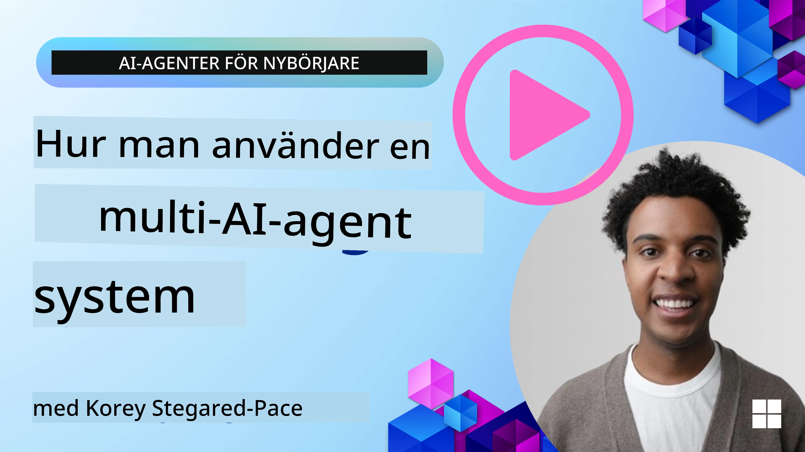
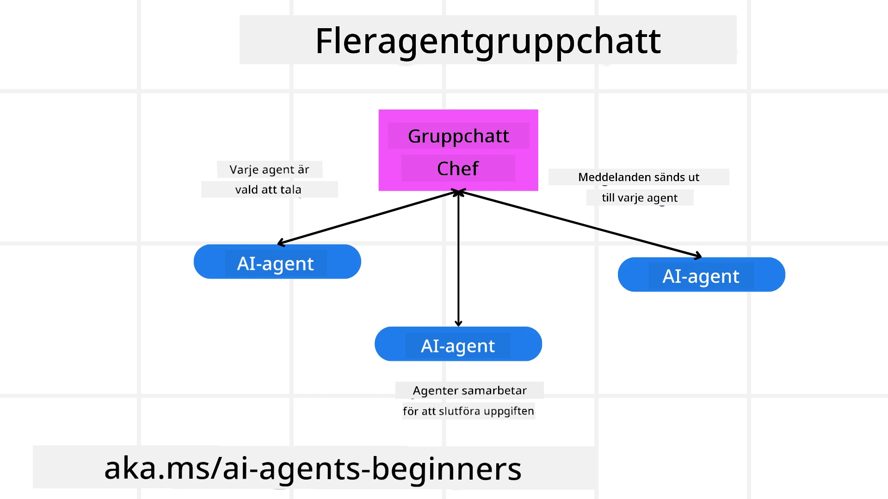
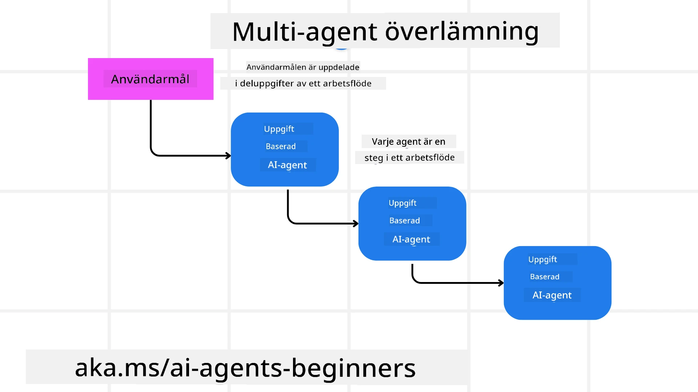
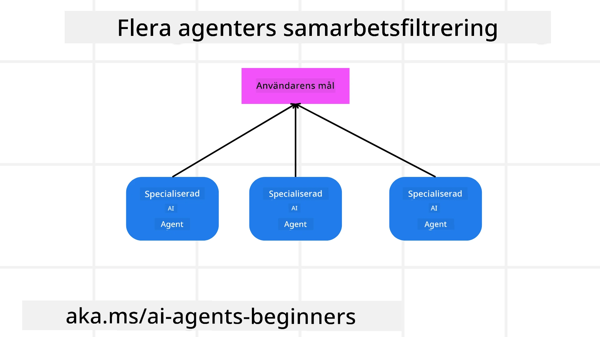

> _(Klicka på bilden ovan för att se video för denna lektion)_

# Multi-agent designmönster

Så fort du börjar arbeta på ett projekt som involverar flera agenter, behöver du överväga multi-agent designmönstret. Det kanske dock inte är omedelbart tydligt när man ska byta till multi-agenter och vilka fördelarna är.

## Introduktion

I denna lektion vill vi besvara följande frågor:

- Vilka scenarier är multi-agenter tillämpliga på?
- Vilka är fördelarna med att använda multi-agenter jämfört med en enda agent som gör flera uppgifter?
- Vilka är byggstenarna för att implementera multi-agent designmönstret?
- Hur får vi insyn i hur de flera agenterna interagerar med varandra?

## Inlärningsmål

Efter denna lektion ska du kunna:

- Identifiera scenarier där multi-agenter är tillämpliga
- Känna igen fördelarna med att använda multi-agenter jämfört med en enda agent.
- Förstå byggstenarna för att implementera multi-agent designmönstret.

Vad är den större bilden?

*Multi-agenter är ett designmönster som tillåter flera agenter att samarbeta för att uppnå ett gemensamt mål*.

Detta mönster används i stor utsträckning inom olika områden, inklusive robotik, autonoma system och distribuerad databehandling.

## Scenarier där multi-agenter är tillämpliga

Så vilka scenarier är ett bra användningsfall för att använda multi-agenter? Svaret är att det finns många scenarier där det är fördelaktigt att använda flera agenter, särskilt i följande fall:

- **Stora arbetsbelastningar**: Stora arbetsbelastningar kan delas upp i mindre uppgifter och tilldelas olika agenter, vilket möjliggör parallell bearbetning och snabbare slutförande. Ett exempel på detta är vid en stor databehandlingsuppgift.
- **Komplexa uppgifter**: Komplexa uppgifter, som stora arbetsbelastningar, kan delas upp i mindre deluppgifter och tilldelas olika agenter, där varje är specialiserad på en specifik aspekt av uppgiften. Ett bra exempel på detta är i fallet med autonoma fordon där olika agenter hanterar navigation, hinderupptäckt och kommunikation med andra fordon.
- **Olika expertisområden**: Olika agenter kan ha olika expertis, vilket gör att de kan hantera olika aspekter av en uppgift mer effektivt än en enda agent. I detta fall är ett bra exempel inom sjukvård där agenter kan hantera diagnostik, behandlingsplaner och patientövervakning.

## Fördelar med att använda multi-agenter jämfört med en enda agent

Ett system med en enda agent kan fungera bra för enkla uppgifter, men för mer komplexa uppgifter kan användning av flera agenter ge flera fördelar:

- **Specialisering**: Varje agent kan specialisera sig på en viss uppgift. Brist på specialisering i en enda agent innebär att du har en agent som kan göra allt men som kanske blir förvirrad över vad den ska göra vid komplexa uppgifter. Den kan till exempel sluta med att göra en uppgift som den inte är bäst lämpad för.
- **Skalbarhet**: Det är enklare att skala system genom att lägga till fler agenter istället för att överbelasta en enda agent.
- **Felförlåtande**: Om en agent misslyckas kan andra fortsätta fungera, vilket säkerställer systemets tillförlitlighet.

Låt oss ta ett exempel, låt oss boka en resa för en användare. Ett system med en enda agent skulle behöva hantera alla aspekter av resebokningsprocessen, från att hitta flyg till att boka hotell och hyrbilar. För att klara detta med en enda agent skulle agenten behöva ha verktyg för att hantera alla dessa uppgifter. Detta kan leda till ett komplext och monolitiskt system som är svårt att underhålla och skala. Ett multi-agent system skulle däremot kunna ha olika agenter specialiserade på att hitta flyg, boka hotell och hyrbilar. Detta skulle göra systemet mer modulärt, lättare att underhålla och skalbart.

Jämför detta med en resebyrå som drivs som en familjeägd butik jämfört med en resebyrå som drivs som en franchise. Den familjeägda butiken skulle ha en enda agent som hanterar alla aspekter av resebokningsprocessen, medan franchisen skulle ha olika agenter som hanterar olika aspekter av resebokningsprocessen.

## Byggstenar för att implementera multi-agent designmönstret

Innan du kan implementera multi-agent designmönstret behöver du förstå byggstenarna som utgör mönstret.

Låt oss göra detta mer konkret genom att återigen titta på exemplet med att boka en resa för en användare. I detta fall skulle byggstenarna inkludera:

- **Agentkommunikation**: Agenter för att hitta flyg, boka hotell och hyrbilar behöver kommunicera och dela information om användarens preferenser och begränsningar. Du behöver bestämma protokoll och metoder för denna kommunikation. Vad detta konkret betyder är att agenten för att hitta flyg behöver kommunicera med agenten för att boka hotell för att säkerställa att hotellet bokas för samma datum som flyget. Det innebär att agenterna behöver dela information om användarens resedatum, vilket innebär att du behöver bestämma *vilka agenter som delar information och hur de delar information*.
- **Koordineringsmekanismer**: Agenter behöver koordinera sina handlingar för att säkerställa att användarens preferenser och begränsningar uppfylls. En användares preferens kan vara att de vill ha ett hotell nära flygplatsen medan en begränsning kan vara att hyrbilar endast är tillgängliga på flygplatsen. Detta innebär att agenten för att boka hotell behöver koordinera med agenten för att boka hyrbilar för att säkerställa att användarens preferenser och begränsningar uppfylls. Detta innebär att du behöver bestämma *hur agenterna koordinerar sina handlingar*.
- **Agentarkitektur**: Agenter behöver ha intern struktur för att fatta beslut och lära sig från sina interaktioner med användaren. Detta betyder att agenten för att hitta flyg behöver ha den interna strukturen för att fatta beslut om vilka flyg som ska rekommenderas till användaren. Det innebär att du behöver bestämma *hur agenterna fattar beslut och lär sig från sina interaktioner med användaren*. Exempel på hur en agent lär sig och förbättras kan vara att agenten för att hitta flyg kan använda en maskininlärningsmodell för att rekommendera flyg baserat på användarens tidigare preferenser.
- **Insyn i multi-agent-interaktioner**: Du behöver ha insyn i hur de flera agenterna interagerar med varandra. Detta innebär att du behöver ha verktyg och tekniker för att spåra agentaktiviteter och interaktioner. Detta kan vara i form av loggning och övervakningsverktyg, visualiseringsverktyg och prestandamått.
- **Multi-agent mönster**: Det finns olika mönster för att implementera multi-agent system, såsom centraliserade, decentraliserade och hybrida arkitekturer. Du behöver bestämma vilket mönster som passar bäst för ditt användningsfall.
- **Människa i loopen**: I de flesta fall kommer du ha en människa i loopen och behöver instruera agenterna när de ska be om mänsklig ingripande. Detta kan vara i form av att en användare begär ett specifikt hotell eller flyg som agenterna inte rekommenderat, eller begär bekräftelse innan flyg eller hotell bokas.

## Insyn i multi-agent interaktioner

Det är viktigt att du har insyn i hur de flera agenterna interagerar med varandra. Denna insyn är avgörande för felsökning, optimering och säkerställande av systemets totala effektivitet. För att uppnå detta behöver du ha verktyg och tekniker för att spåra agentaktiviteter och interaktioner. Detta kan vara i form av loggnings- och övervakningsverktyg, visualiseringsverktyg och prestandamått.

Till exempel, vid en bokning av en resa för en användare, kan du ha en instrumentpanel som visar statusen för varje agent, användarens preferenser och begränsningar samt interaktioner mellan agenter. Denna instrumentpanel kan visa användarens resedatum, de flyg som flygagenten rekommenderat, hotellen som hotelagenten rekommenderat och hyrbilarna som hyrbilsagenten rekommenderat. Detta skulle ge dig en tydlig bild av hur agenterna interagerar med varandra och om användarens preferenser och begränsningar uppfylls.

Låt oss titta närmare på dessa aspekter.

- **Loggnings- och övervakningsverktyg**: Du vill att loggning görs för varje åtgärd som en agent utför. En loggpost kan lagra information om vilken agent som utförde åtgärden, vilken åtgärd som utfördes, tidpunkten för åtgärden och resultatet av åtgärden. Denna information kan sedan användas för felsökning, optimering med mera.

- **Visualiseringsverktyg**: Visualiseringsverktyg kan hjälpa dig att se interaktionerna mellan agenter på ett mer intuitivt sätt. Till exempel kan du ha en graf som visar informationsflödet mellan agenter. Detta kan hjälpa dig att identifiera flaskhalsar, ineffektivitet och andra problem i systemet.

- **Prestandamått**: Prestandamått kan hjälpa dig att följa systemets effektivitet. Till exempel kan du mäta tiden det tar att slutföra en uppgift, antalet uppgifter som slutförts per tidsenhet och noggrannheten i rekommendationerna som agenterna gör. Denna information kan hjälpa dig att identifiera förbättringsområden och optimera systemet.

## Multi-agent mönster

Låt oss dyka ner i några konkreta mönster vi kan använda för att skapa multi-agent-appar. Här är några intressanta mönster att överväga:

### Gruppchatt

Detta mönster är användbart när du vill skapa en gruppchat-applikation där flera agenter kan kommunicera med varandra. Typiska användningsfall för detta mönster inkluderar teamarbete, kundsupport och sociala nätverk.

I detta mönster representerar varje agent en användare i gruppchatten, och meddelanden utbyts mellan agenter med hjälp av ett meddelandeprotokoll. Agenterna kan skicka meddelanden till gruppchatten, ta emot meddelanden från gruppchatten och svara på meddelanden från andra agenter.

Detta mönster kan implementeras med en centraliserad arkitektur där alla meddelanden går via en central server, eller en decentraliserad arkitektur där meddelanden utbyts direkt.

### Överlämning

Detta mönster är användbart när du vill skapa en applikation där flera agenter kan lämna över uppgifter till varandra.

Typiska användningsfall för detta mönster inkluderar kundsupport, uppgiftshantering och arbetsflödesautomation.

I detta mönster representerar varje agent en uppgift eller ett steg i ett arbetsflöde, och agenter kan lämna över uppgifter till andra agenter baserat på fördefinierade regler.

### Samarbetsfiltrering

Detta mönster är användbart när du vill skapa en applikation där flera agenter kan samarbeta för att ge rekommendationer till användare.

Varför man skulle vilja att flera agenter samarbetar är för att varje agent kan ha olika expertis och kan bidra på olika sätt till rekommendationsprocessen.

Låt oss ta ett exempel där en användare vill ha en rekommendation på den bästa aktien att köpa på aktiemarknaden.

- **Branchexpert**: En agent kan vara expert inom en specifik bransch.
- **Teknisk analys**: En annan agent kan vara expert på teknisk analys.
- **Fundamental analys**: Och en annan agent kan vara expert på fundamental analys. Genom att samarbeta kan dessa agenter ge en mer heltäckande rekommendation till användaren.

## Scenario: Återbetalningsprocess

Tänk på ett scenario där en kund försöker få en återbetalning för en produkt, det kan finnas ganska många agenter involverade i denna process men låt oss dela upp det mellan agenter specifika för denna process och generella agenter som kan användas i andra processer.

**Agenter specifika för återbetalningsprocessen**:

Följande är några agenter som kan vara involverade i återbetalningsprocessen:

- **Kundagent**: Denna agent representerar kunden och ansvarar för att inleda återbetalningsprocessen.
- **Säljaragent**: Denna agent representerar säljaren och ansvarar för att hantera återbetalningen.
- **Betalningsagent**: Denna agent representerar betalningsprocessen och ansvarar för att återbetala kundens betalning.
- **Lösningsagent**: Denna agent representerar lösningsprocessen och ansvarar för att lösa eventuella problem som uppstår under återbetalningsprocessen.
- **Efterlevnadsagent**: Denna agent representerar efterlevnadsprocessen och ansvarar för att säkerställa att återbetalningsprocessen följer regler och policyer.

**Generella agenter**:

Dessa agenter kan användas i andra delar av din verksamhet.

- **Fraktagent**: Denna agent representerar fraktprocessen och ansvarar för att skicka produkten tillbaka till säljaren. Denna agent kan användas både för återbetalningsprocessen och för generell frakt av en produkt via ett köp till exempel.
- **Feedbackagent**: Denna agent representerar feedbackprocessen och ansvarar för att samla in feedback från kunden. Feedback kan samlas in när som helst och inte bara under återbetalningsprocessen.
- **Eskaleringsagent**: Denna agent representerar eskaleringsprocessen och ansvarar för att eskalera problem till en högre supportnivå. Du kan använda denna typ av agent för vilken process som helst där du behöver eskalera ett problem.
- **Notifieringsagent**: Denna agent representerar notifieringsprocessen och ansvarar för att skicka meddelanden till kunden vid olika stadier av återbetalningsprocessen.
- **Analysagent**: Denna agent representerar analysprocessen och ansvarar för att analysera data relaterad till återbetalningsprocessen.
- **Revisionagent**: Denna agent representerar revisionsprocessen och ansvarar för att granska återbetalningsprocessen för att säkerställa att den genomförs korrekt.
- **Rapporteringsagent**: Denna agent representerar rapporteringsprocessen och ansvarar för att generera rapporter om återbetalningsprocessen.
- **Kunskapsagent**: Denna agent representerar kunskapsprocessen och ansvarar för att upprätthålla en kunskapsbas med information relaterad till återbetalningsprocessen. Denna agent kan vara kunnig både om återbetalningar och andra delar av din verksamhet.
- **Säkerhetsagent**: Denna agent representerar säkerhetsprocessen och ansvarar för att säkerställa säkerheten i återbetalningsprocessen.
- **Kvalitetsagent**: Denna agent representerar kvalitetsprocessen och ansvarar för att säkerställa kvaliteten i återbetalningsprocessen.

Det finns ganska många agenter listade tidigare både för den specifika återbetalningsprocessen men också för generella agenter som kan användas i andra delar av din verksamhet. Förhoppningsvis ger detta dig en uppfattning om hur du kan bestämma vilka agenter du ska använda i ditt multi-agent system.

## Uppgift

Designa ett multi-agent system för en kundsupportprocess. Identifiera agenterna som är involverade i processen, deras roller och ansvar, samt hur de interagerar med varandra. Överväg både agenter specifika för kundsupportprocessen och generella agenter som kan användas i andra delar av din verksamhet.
> Fundera en stund innan du läser följande lösning, du kan behöva fler agenter än du tror.

> TIP: Tänk på de olika stegen i kundsupportprocessen och överväg även agenter som behövs för alla system.

## Lösning

[Lösning](./solution/solution.md)

## Kunskapskontroller

### Fråga 1

Vilket scenario passar bäst för ett system med flera agenter?

- [ ] A1: En supportbot svarar på vanliga frågor med en kunskapsbas och en liten uppsättning verktyg.
- [ ] A2: Ett returflöde kräver separata roller för bedrägeri, betalning och efterlevnad, var och en med sina egna verktyg, och deras resultat måste samordnas.
- [ ] A3: Samma enkla klassificeringsförfrågan kommer tusentals gånger per timme.

### Fråga 2

När är en ensam agent vanligtvis det bättre valet?

- [ ] A1: Uppgiften kan hanteras med en uppsättning instruktioner och verktyg, utan specialistöverföringar.
- [ ] A2: Agenten har tillgång till mer än ett verktyg.
- [ ] A3: Arbetsflödet kräver separata roller med olika behörigheter och oberoende granskningsspår.

[Lösningsquiz](./solution/solution-quiz.md)

## Sammanfattning

I denna lektion har vi tittat på designmönstret för flera agenter, inklusive scenarier där flera agenter är tillämpliga, fördelarna med att använda flera agenter jämfört med en enda agent, byggstenarna för att implementera designmönstret för flera agenter och hur man får insyn i hur de flera agenterna interagerar med varandra.

### Har du fler frågor om designmönstret för flera agenter?

Gå med i [Microsoft Foundry Discord](https://discord.com/invite/ATgtXmAS5D) för att träffa andra elever, delta i kontorstid och få svar på dina frågor om AI-agenter.

## Ytterligare resurser

- <a href="https://learn.microsoft.com/azure/ai-services/agents/overview" target="_blank">Microsoft Agent Framework-dokumentation</a>
- <a href="https://www.analyticsvidhya.com/blog/2024/10/agentic-design-patterns/" target="_blank">Agentiska designmönster</a>

## Föregående lektion

[Planeringsdesign](../07-planning-design/README.md)

## Nästa lektion

[Metakognition i AI-agenter](../09-metacognition/README.md)

---

<!-- CO-OP TRANSLATOR DISCLAIMER START -->
**Ansvarsfriskrivning**:
Detta dokument har översatts med hjälp av AI-översättningstjänsten [Co-op Translator](https://github.com/Azure/co-op-translator). Även om vi strävar efter noggrannhet, var vänlig notera att automatiska översättningar kan innehålla fel eller brister. Det ursprungliga dokumentet på dess modersmål bör betraktas som den auktoritativa källan. För kritisk information rekommenderas professionell mänsklig översättning. Vi ansvarar inte för några missförstånd eller feltolkningar som uppstår till följd av användningen av denna översättning.
<!-- CO-OP TRANSLATOR DISCLAIMER END -->