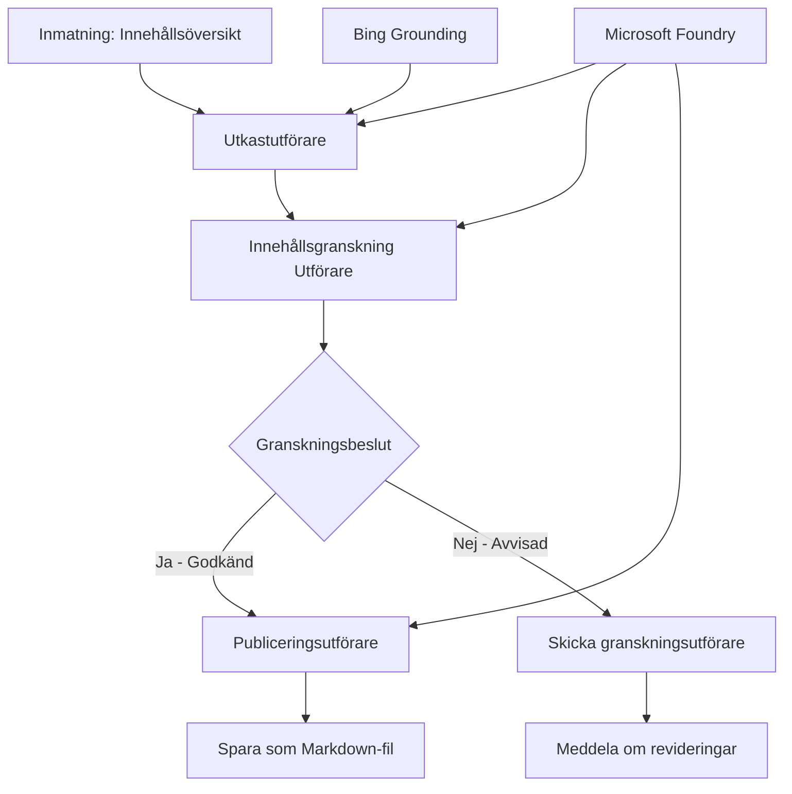

# 🔀 Villkorliga agentarbetsflöden med Microsoft Foundry (.NET)

## 📋 Tutorial för intelligent beslutsbaserat arbetsflöde

Denna notebook demonstrerar **villkorliga arbetsflödesmönster** med Microsoft Foundry och Microsoft Agent Framework för .NET. Du kommer att lära dig hur man bygger sofistikerade, beslutstyrda arbetsflöden som intelligent styr bearbetningen baserat på AI-analys, affärsregler och dynamiska villkor för automatisering i företagsklass.

## 🎯 Lärandemål

### 🧠 **Intelligent beslutsarkitektur**
- **Implementering av villkorlig logik**: Bygg komplexa beslutsträd med flera förgreningar
- **AI-driven styrning**: Använd Microsoft Foundry-modeller för att fatta intelligenta styrningsbeslut
- **Dynamisk anpassning av arbetsflöden**: Modifiera arbetsflödesbeteende baserat på analys och villkor vid körning
- **Integration av företagsregler**: Inkorporera affärslogik och efterlevnadskrav i arbetsflöden

### 🔀 **Avancerade villkorliga mönster**
- **Beslutsfattande med flera kriterier**: Utvärdera flera faktorer för styrningsbeslut
- **Kontextmedveten bearbetning**: Fatta beslut baserat på ackumulerad arbetsflödeskontext och historik
- **Adaptiv ändring av arbetsflöde**: Dynamiskt justera bearbetningsvägar baserat på realtidsvillkor
- **Integration av regelmotor**: Implementera sofistikerade affärsregelmotorer inom arbetsflöden

### 🏢 **Villkorliga företagsapplikationer**
- **Dokumentklassificering & styrning**: Automatiskt klassificera och styra dokument till lämpliga arbetsflöden
- **Kundservice-triage**: Intelligent styrning av kundförfrågningar till specialiserade hanteringsteam
- **Efterlevnad & riskbearbetning**: Tillämpa olika validerings- och granskningsprocesser baserat på riskbedömning
- **Kvalitetssäkringsarbetsflöden**: Styra innehåll genom lämpliga granskningsprocesser baserat på kvalitetsmått

## ⚙️ Förutsättningar & installation

### 📦 **Nödvändiga NuGet-paket**

Avancerade paket för villkorlig arbetsflödesbearbetning:

```xml
<!-- Core AI Framework -->
<PackageReference Include="Microsoft.Extensions.AI" Version="9.9.0" />

<!-- Azure AI Agents with Persistent State -->
<PackageReference Include="Azure.AI.Agents.Persistent" Version="1.2.0-beta.5" />

<!-- Azure Identity and Utilities -->
<PackageReference Include="Azure.Identity" Version="1.15.0" />
<PackageReference Include="System.Linq.Async" Version="6.0.3" />
<PackageReference Include="DotNetEnv" Version="3.1.1" />

<!-- Local Workflow Framework References -->
<!-- Microsoft.Agents.Workflows.dll - Advanced workflow orchestration -->
<!-- Microsoft.Agents.AI.AzureAI.dll - Microsoft Foundry integration -->
<!-- Microsoft.Agents.AI.dll - Core agent abstractions -->
```

### 🔑 **Microsoft Foundry-konfiguration**

**Nödvändiga Azure-resurser:**
- Microsoft Foundry-arbetsyta med villkorliga bearbetningsmodeller
- Azure-prenumeration med rätt beräkningskvoter och behörigheter
- Distribuerade AI-modeller för beslutsfattande och innehållsanalys
- (Valfritt) Bing Search API-anslutning för förankringsmöjligheter

**Miljökonfiguration (.env-fil):**
```env
# Microsoft Foundry Configuration
AZURE_AI_PROJECT_ENDPOINT=https://your-project.cognitiveservices.azure.com/
BING_CONNECTION_ID=your-bing-connection-id
```

**Autentiseringsinställning:**
```csharp
// Azure CLI or Managed Identity authentication
using Azure.Identity;
var credential = new AzureCliCredential();

// Load environment configuration
DotNetEnv.Env.Load("../../../.env");
```

### 🏗️ **Villkorlig arbetsflödesarkitektur**



**Nyckelkomponenter:**
- **Draft Executor**: AI-agent som skapar initiala innehållsutkast från dispositioner
- **Content Review Executor**: AI-agent som utvärderar utkastets kvalitet och efterlevnad
- **Villkorlig styrning**: Beslutslogik som styr baserat på granskningsresultat
- **Publicerings-/granskningsvägar**: Separata bearbetningsvägar för godkänt respektive avvisat innehåll
- **Tillståndshantering**: Bibehåller innehålls- och granskningskontext genom arbetsflödet

## 🎨 **Designmönster för villkorliga arbetsflöden**

### 📋 **Innehållsproduktion med kvalitetssäkringsgrindar**
```
Outline → Draft Creation → Quality Review → {Approve: Publish | Reject: Revise}
```

### 🎯 **Riskbaserad dokumentbearbetning**
```
Document → Risk Assessment → {Low: Standard | High: Enhanced Review}
```

### 🔍 **Intelligent kundservicestyrning**
```
Customer Query → Analysis → {Simple: FAQ Bot | Complex: Human Agent}
```

### 💼 **Efterlevnadsdrivna arbetsflöden**
```
Content → Compliance Check → {Pass: Publish | Fail: Legal Review}
```

## 🏢 **Företagsfördelar med villkorlighet**

### 🎯 **Intelligent automatisering**
- **Smarta beslut**: AI-drivna styrningsbeslut baserat på innehållsanalys och kontext
- **Adaptiv bearbetning**: Arbetsflöden som automatiskt anpassar sig efter förändrade villkor
- **Tillämpning av affärsregler**: Automatisk tillämpning av komplex företagslogik och policyer
- **Kontextmedveten styrning**: Beslut baserade på full arbetsflödeshistorik och ackumulerad kontext

### 📈 **Operativ excellens**
- **Optimerad resursallokering**: Styr arbete till mest lämpliga specialister och processer
- **Minskad manuell hantering**: Automatiserat beslutsfattande minimerar behov av manuell styrning
- **Snabbare lösningstid**: Direkt styrning till relevant expertis och bearbetningskapacitet
- **Konsekvent tillämpning**: Enhetlig tillämpning av affärsregler och beslutsprinciper

### 🛡️ **Riskhantering & efterlevnad**
- **Automatiserad riskbedömning**: AI-drivna utvärderingar av innehålls- och situationsrisknivåer
- **Efterlevnadstillämpning**: Automatisk styrning genom nödvändiga regulatoriska processer
- **Tillämpning av säkerhetsprotokoll**: Förstärkta säkerhetsåtgärder baserade på riskbedömning
- **Säkerställande av revisionsspår**: Komplett dokumentation av styrningsbeslut och underliggande motiv

### 📊 **Analys & kontinuerlig förbättring**
- **Beslutsanalys**: Spåra effektivitet och noggrannhet i styrningsbeslut
- **Mönsterigenkänning**: Identifiera trender och mönster i styrningsbeslut över tid
- **Prestandaoptimering**: Kontinuerlig förbättring av beslutskriterier och styrningseffektivitet
- **Business Intelligence**: Insikter om innehållsegenskaper och bearbetningsbehov

### 🔧 **Teknisk excellens**
- **Beständig tillståndshantering**: Hantera komplext tillstånd över arbetsflödets körning
- **Skalbar arkitektur**: Hantera högvolyms krav på villkorlig bearbetning
- **Integrationsmöjligheter**: Sömlös integration med befintliga affärssystem och processer
- **Övervakning & observabilitet**: Omfattande spårning av arbetsflödets prestanda och beslut

Låt oss bygga intelligenta, beslutstyrda företagsarbetsflöden med .NET! 🚀

## 💻 Köra koden

Den fullständiga implementeringen finns i `04.dotnet-agent-framework-workflow-aifoundry-condition.cs`. Den demonstrerar ett **arbetsflöde för innehållsproduktion med kvalitetssäkringsgrindar**:

### 🏗️ **Arbetsflödesarkitektur**

```
Content Outline → Draft Creation → Quality Review → Conditional Routing:
                                                      ├─ Approved (>200 words) → Publish
                                                      └─ Rejected (<200 words) → Review Notification
```

**Agenter i arbetsflödet:**
1. **Evangelist Agent**: Skapar tutorialsutkast från dispositioner med Bing-förankring
2. **Content Reviewer Agent**: Utvärderar utkastets kvalitet (ordantal, fullständighet)
3. **Publisher Agent**: Sparar godkänt innehåll som tidsstämplade Markdown-filer

**Anpassade exekutorer:**
1. **DraftExecutor**: Organiserar skapandet av utkast
2. **ContentReviewExecutor**: Utför kvalitetsbedömning
3. **PublishExecutor**: Hanterar publicering av godkänt innehåll
4. **SendReviewExecutor**: Hanterar aviseringar om avvisat innehåll

### 🚀 Köra exemplet

**Förutsättningar:**
- Microsoft Foundry-arbetsyta konfigurerad
- Azure CLI-autentisering (`az login`)
- (Valfritt) Bing Search-anslutning för förankring

```bash
# Gör skriptet körbart (Unix/Linux/macOS)
chmod +x 04.dotnet-agent-framework-workflow-aifoundry-condition.cs

# Kör det villkorliga arbetsflödet
./04.dotnet-agent-framework-workflow-aifoundry-condition.cs
```

Eller på Windows:
```powershell
dotnet run 04.dotnet-agent-framework-workflow-aifoundry-condition.cs
```

### 📝 Förväntad utdata

Arbetsflödet kommer:
1. **Skapa agenter**: Initiera tre specialiserade Microsoft Foundry-agenter
2. **Generera utkast**: Evangelist-agenten skapar tutorialutkast från disposition
3. **Granska innehåll**: Content Reviewer utvärderar utkastets kvalitet
4. **Villkorlig styrning**:
   - **Om godkänt (>200 ord)**: PublishExecutor sparar som Markdown-fil
   - **Om avvisat (<200 ord)**: Skicka granskningsavisering
5. **Visa resultat**: Presentera slutgiltigt arbetsflödesresultat

### 🔧 Anpassningsalternativ

**Modifiera granskningskriterier:**
```csharp
const string ContentReviewerInstructions = @"
You are a content reviewer...
1. Check if content is more than 500 words (instead of 200)
2. Verify technical accuracy
3. Ensure proper formatting
...";
```

**Lägg till fler villkorliga vägar:**
```csharp
var workflow = new WorkflowBuilder(draftExecutor)
    .AddEdge(draftExecutor, contentReviewerExecutor)
    .AddEdge(contentReviewerExecutor, publishExecutor, condition: GetCondition("Excellent"))
    .AddEdge(contentReviewerExecutor, editExecutor, condition: GetCondition("Good"))
    .AddEdge(contentReviewerExecutor, sendReviewerExecutor, condition: GetCondition("Poor"))
    .Build();
```

**Ändra innehållskrav:**
```csharp
string OUTLINE_Content = @"
# Your Custom Topic
## Section 1
https://your-reference-url
## Section 2
...
";
```

### 🎯 Realtidsapplikationer

Detta villkorliga arbetsflödesmönster är idealiskt för:
- **Innehållshanteringssystem**: Automatiserade redaktionella arbetsflöden med kvalitetssäkringsgrindar
- **Dokumentbearbetning**: Styra dokument baserat på klassificering och efterlevnad
- **Kundsupport**: Intelligent biljettstyrning baserat på komplexitet och brådska
- **Juridisk granskning**: Styra kontrakt baserat på riskbedömning och värde
- **HR-processer**: Styra ansökningar genom lämpliga screeningsarbetsflöden

### 🔍 Förstå villkorlig logik

**Villkorsfunktion:**
```csharp
public Func<object?, bool> GetCondition(string expectedResult) =>
    reviewResult => reviewResult is ReviewResult review && review.Result == expectedResult;
```

Denna funktion skapar en predikat som:
1. Kontrollerar om resultatet är av typen `ReviewResult`
2. Jämför egenskapen `Result` med förväntat värde
3. Returnerar true/false för att bestämma styrning

**Arbetsflödeskanter med villkor:**
```csharp
.AddEdge(contentReviewerExecutor, publishExecutor, condition: GetCondition("Yes"))
.AddEdge(contentReviewerExecutor, sendReviewerExecutor, condition: GetCondition("No"))
```

### 📊 Avancerade funktioner

**JSON-schemavalidering:**
Arbetsflödet använder JSON-scheman för att säkerställa strukturerade svar:

```csharp
// Define response structure
public class ReviewResult
{
    [JsonPropertyName("review_result")]
    public string Result { get; set; } = string.Empty;
    
    [JsonPropertyName("reason")]
    public string Reason { get; set; } = string.Empty;
    
    [JsonPropertyName("draft_content")]
    public string DraftContent { get; set; } = string.Empty;
}

// Apply to agent
ResponseFormat = ChatResponseFormat.ForJsonSchema(
    AIJsonUtilities.CreateJsonSchema(typeof(ReviewResult)), 
    "ReviewResult", 
    "Review Result From DraftContent"
)
```

**Bing-förankringsintegration:**
Evangelist-agenten använder Bing-förankring för att få tillgång till information i realtid:

```csharp
var bingGroundingConfig = new BingGroundingSearchConfiguration(bing_conn_id);
BingGroundingToolDefinition bingGroundingTool = new(
    new BingGroundingSearchToolParameters([bingGroundingConfig])
);
```

Detta gör att agenten kan följa URL:er i dispositionen och extrahera aktuell information.

### 🛡️ Felhantering

Arbetsflödet innehåller robust felhantering för avvisat innehåll:
- Granskningsfel leder till alternativ väg
- Aviseringar ger tydliga orsaker till avvisning
- Innehåll bevaras för revidering

### 🔄 Utöka arbetsflödet

**Lägg till en revideringsloop:**
Skapa en feedbackloop som automatiskt gör om utkast:

```csharp
.AddEdge(contentReviewerExecutor, publishExecutor, condition: GetCondition("Yes"))
.AddEdge(contentReviewerExecutor, draftExecutor, condition: GetCondition("No")) // Loop back
```

**Implementera flernivågranskning:**
Lägg till flera granskningssteg med olika kriterier:

```csharp
.AddEdge(draftExecutor, technicalReviewer)
.AddEdge(technicalReviewer, editorialReviewer, condition: GetCondition("TechPass"))
.AddEdge(editorialReviewer, publishExecutor, condition: GetCondition("EditPass"))
```

Detta villkorliga arbetsflödesmönster utgör grunden för att bygga sofistikerade, intelligenta automationssystem i företagsmiljö! 🚀

---

<!-- CO-OP TRANSLATOR DISCLAIMER START -->
**Ansvarsfriskrivning**:
Detta dokument har översatts med hjälp av AI-översättningstjänsten [Co-op Translator](https://github.com/Azure/co-op-translator). Även om vi strävar efter noggrannhet, var vänlig notera att automatiska översättningar kan innehålla fel eller brister. Det ursprungliga dokumentet på dess modersmål bör betraktas som den auktoritativa källan. För kritisk information rekommenderas professionell mänsklig översättning. Vi ansvarar inte för några missförstånd eller feltolkningar som uppstår till följd av användningen av denna översättning.
<!-- CO-OP TRANSLATOR DISCLAIMER END -->