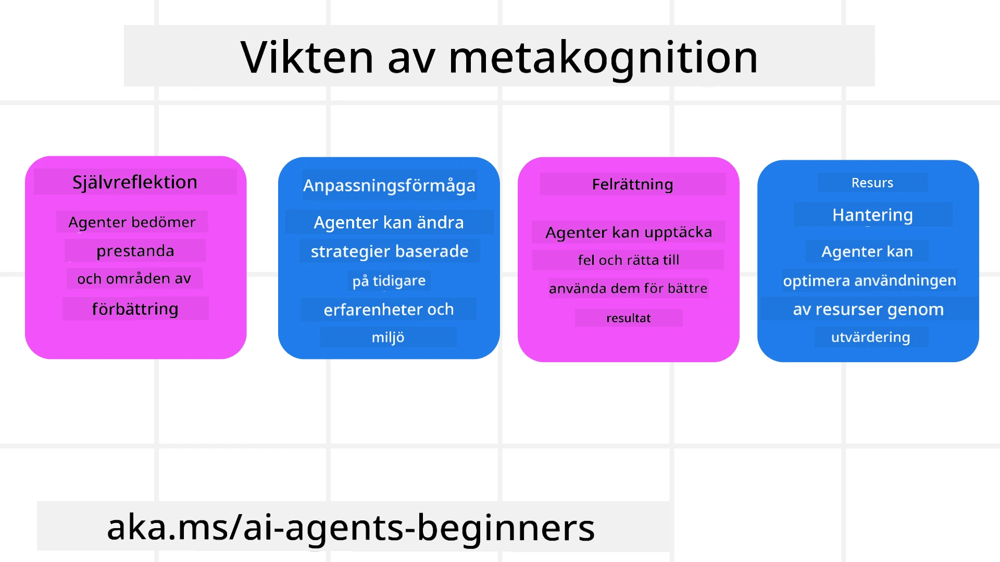
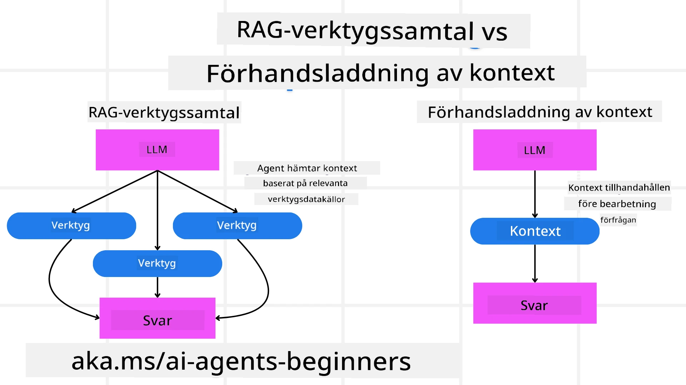

[](https://youtu.be/His9R6gw6Ec?si=3_RMb8VprNvdLRhX)

> _(Klicka på bilden ovan för att se videon av denna lektion)_
# Metakognition i AI-agenter

## Introduktion

Välkommen till lektionen om metakognition i AI-agenter! Detta kapitel är utformat för nybörjare som är nyfikna på hur AI-agenter kan reflektera över sina egna tankegångar. I slutet av denna lektion kommer du att förstå viktiga koncept och vara utrustad med praktiska exempel för att tillämpa metakognition i AI-agentdesign.

## Lärandemål

Efter att ha genomgått denna lektion kommer du att kunna:

1. Förstå konsekvenserna av resonemangsloopar i agentdefinitioner.
2. Använda planerings- och utvärderingstekniker för att hjälpa själv-korrigerande agenter.
3. Skapa dina egna agenter som kan manipulera kod för att utföra uppgifter.

## Introduktion till Metakognition

Metakognition avser de högre kognitiva processerna som innebär att tänka på sitt eget tänkande. För AI-agenter innebär detta att kunna utvärdera och justera sina handlingar baserat på självmedvetenhet och tidigare erfarenheter. Metakognition, eller "att tänka på tänkande," är ett viktigt koncept inom utvecklingen av agentbaserade AI-system. Det handlar om att AI-system är medvetna om sina egna interna processer och kan övervaka, reglera och anpassa sitt beteende därefter. Precis som vi gör när vi läser av en situation eller betraktar ett problem. Denna självmedvetenhet kan hjälpa AI-system att fatta bättre beslut, identifiera fel och förbättra sin prestation över tid – vilket knyter tillbaka till Turingtestet och debatten om huruvida AI kommer att ta över.

I kontexten av agentbaserade AI-system kan metakognition hjälpa till att hantera flera utmaningar, såsom:
- Transparens: Säkerställa att AI-system kan förklara sina resonemang och beslut.
- Resonerande: Förbättra AI-systemens förmåga att syntetisera information och fatta välgrundade beslut.
- Anpassning: Tillåta AI-system att anpassa sig till nya miljöer och förändrade förhållanden.
- Perception: Förbättra AI-systemens noggrannhet i att känna igen och tolka data från sin omgivning.

### Vad är Metakognition?

Metakognition, eller "att tänka på tänkande," är en högre ordningens kognitiv process som innebär självmedvetenhet och självreglering av sina kognitiva processer. Inom AI ger metakognition agenter möjlighet att utvärdera och anpassa sina strategier och handlingar, vilket leder till förbättrad problemlösning och beslutsfattande. Genom att förstå metakognition kan du designa AI-agenter som inte bara är intelligenta utan också mer anpassningsbara och effektiva. Vid äkta metakognition skulle AI tydligt resonera om sitt eget resonemang.

Exempel: ”Jag prioriterade billigare flyg eftersom… Jag kanske missar direktflyg, så låt mig kontrollera igen.”
Att hålla koll på hur eller varför den valde en viss rutt.
- Observera att den gjorde misstag eftersom den förlitade sig för mycket på användarens preferenser från förra gången, så den modifierar sin beslutsstrategi, inte bara den slutliga rekommendationen.
- Diagnostisera mönster som, ”När jag ser att användaren nämner ‘för trångt’, bör jag inte bara ta bort vissa attraktioner utan också reflektera över att min metod för att välja ‘topattraktioner’ är felaktig om jag alltid rankar efter popularitet.”

### Vikten av Metakognition i AI-agenter

Metakognition spelar en avgörande roll i designen av AI-agenter av flera skäl:



- Självreflektion: Agenter kan utvärdera sin egen prestation och identifiera förbättringsområden.
- Anpassningsförmåga: Agenter kan ändra sina strategier baserat på tidigare erfarenheter och föränderliga miljöer.
- Felkorrigering: Agenter kan upptäcka och rätta fel autonomt, vilket leder till mer exakta resultat.
- Resurshantering: Agenter kan optimera användningen av resurser, såsom tid och beräkningskraft, genom att planera och utvärdera sina handlingar.

## Komponenter i en AI-Agent

Innan vi dyker in i metakognitiva processer är det viktigt att förstå de grundläggande komponenterna i en AI-agent. En AI-agent består vanligtvis av:

- Persona: Agentens personlighet och egenskaper, som definierar hur den interagerar med användare.
- Verktyg: De kapaciteter och funktioner som agenten kan utföra.
- Färdigheter: Den kunskap och expertis som agenten besitter.

Dessa komponenter arbetar tillsammans för att skapa en "expertisenhet" som kan utföra specifika uppgifter.

**Exempel**:
Tänk på en reseagent, en agenttjänst som inte bara planerar din semester utan också justerar sin väg baserat på realtidsdata och tidigare kunders resupplevelser.

### Exempel: Metakognition i en Reseagenttjänst

Föreställ dig att du designar en AI-driven reseagenttjänst. Denna agent, "Reseagent," hjälper användare att planera sina semestrar. För att inkludera metakognition behöver Reseagenten utvärdera och anpassa sina handlingar baserat på självmedvetenhet och tidigare erfarenheter. Så här kan metakognition spela en roll:

#### Nuvarande Uppgift

Den nuvarande uppgiften är att hjälpa en användare planera en resa till Paris.

#### Steg för att Slutföra Uppgiften

1. **Samla in Användarpreferenser**: Fråga användaren om deras resedatum, budget, intressen (t.ex. museer, kök, shopping) och eventuella specifika krav.
2. **Hämta Information**: Sök efter flygalternativ, boenden, attraktioner och restauranger som matchar användarens preferenser.
3. **Generera Rekommendationer**: Ge en personlig resplan med flyguppgifter, hotellbokningar och föreslagna aktiviteter.
4. **Justera Baserat på Feedback**: Be användaren om återkoppling på rekommendationerna och gör nödvändiga justeringar.

#### Nödvändiga Resurser

- Tillgång till databaser för flyg- och hotellbokningar.
- Information om parisiska attraktioner och restauranger.
- Användarfeedback från tidigare interaktioner.

#### Erfarenhet och Självreflektion

Reseagenten använder metakognition för att utvärdera sin prestation och lära sig av tidigare erfarenheter. Till exempel:

1. **Analysera Användarfeedback**: Reseagenten granskar användarfeedback för att avgöra vilka rekommendationer som togs emot väl och vilka som inte gjorde det. Agenten justerar sina framtida förslag därefter.
2. **Anpassningsförmåga**: Om en användare tidigare har nämnt att den ogillar trånga platser, kommer Reseagenten att undvika att rekommendera populära turistmål under rusningstid i framtiden.
3. **Felkorrigering**: Om Reseagenten gjorde ett misstag i en tidigare bokning, såsom att föreslå ett hotell som var fullbokat, lär den sig att noggrannare kontrollera tillgänglighet innan rekommendationer görs.

#### Praktiskt Utvecklarexempel

Här är ett förenklat exempel på hur Reseagentens kod kan se ut när den inkluderar metakognition:

```python
class Travel_Agent:
    def __init__(self):
        self.user_preferences = {}
        self.experience_data = []

    def gather_preferences(self, preferences):
        self.user_preferences = preferences

    def retrieve_information(self):
        # Sök efter flyg, hotell och sevärdheter baserat på preferenser
        flights = search_flights(self.user_preferences)
        hotels = search_hotels(self.user_preferences)
        attractions = search_attractions(self.user_preferences)
        return flights, hotels, attractions

    def generate_recommendations(self):
        flights, hotels, attractions = self.retrieve_information()
        itinerary = create_itinerary(flights, hotels, attractions)
        return itinerary

    def adjust_based_on_feedback(self, feedback):
        self.experience_data.append(feedback)
        # Analysera feedback och justera framtida rekommendationer
        self.user_preferences = adjust_preferences(self.user_preferences, feedback)

# Exempel på användning
travel_agent = Travel_Agent()
preferences = {
    "destination": "Paris",
    "dates": "2025-04-01 to 2025-04-10",
    "budget": "moderate",
    "interests": ["museums", "cuisine"]
}
travel_agent.gather_preferences(preferences)
itinerary = travel_agent.generate_recommendations()
print("Suggested Itinerary:", itinerary)
feedback = {"liked": ["Louvre Museum"], "disliked": ["Eiffel Tower (too crowded)"]}
travel_agent.adjust_based_on_feedback(feedback)
```

#### Varför Metakognition Är Viktigt

- **Självreflektion**: Agenter kan analysera sin prestation och identifiera förbättringsområden.
- **Anpassningsförmåga**: Agenter kan ändra strategier baserat på återkoppling och förändrade förhållanden.
- **Felkorrigering**: Agenter kan autonomt upptäcka och rätta misstag.
- **Resurshantering**: Agenter kan optimera resursanvändning, såsom tid och beräkningskraft.

Genom att inkludera metakognition kan Reseagenten ge mer personliga och exakta reseförslag, vilket förbättrar den övergripande användarupplevelsen.

---

## 2. Planering i Agenter

Planering är en kritisk komponent i AI-agenters beteende. Det innebär att lägga upp de steg som behövs för att uppnå ett mål, med hänsyn till aktuell status, resurser och möjliga hinder.

### Planeringens Element

- **Nuvarande Uppgift**: Definiera uppgiften tydligt.
- **Steg för att Slutföra Uppgiften**: Bryt ner uppgiften i hanterbara steg.
- **Nödvändiga Resurser**: Identifiera nödvändiga resurser.
- **Erfarenhet**: Använd tidigare erfarenheter för att informera planeringen.

**Exempel**:
Här är de steg som Reseagenten behöver ta för att effektivt hjälpa en användare att planera sin resa:

### Steg för Reseagent

1. **Samla in Användarpreferenser**
   - Fråga användaren om detaljer kring resedatum, budget, intressen och eventuella specifika krav.
   - Exempel: "När planerar du att resa?" "Vad är din budget?" "Vilka aktiviteter tycker du om på semestern?"

2. **Hämta Information**
   - Sök efter relevanta resealternativ baserat på användarens preferenser.
   - **Flyg**: Leta efter tillgängliga flyg inom användarens budget och önskade datum.
   - **Boende**: Hitta hotell eller uthyrningsalternativ som matchar användarens preferenser gällande läge, pris och bekvämligheter.
   - **Attraktioner och Restauranger**: Identifiera populära attraktioner, aktiviteter och matställen som passar användarens intressen.

3. **Generera Rekommendationer**
   - Sammanställ den hämtade informationen till en personlig resplan.
   - Ge detaljer såsom flygalternativ, hotellbokningar och föreslagna aktiviteter, anpassade till användarens preferenser.

4. **Presentera Resplan för Användaren**
   - Dela den föreslagna resplanen med användaren för granskning.
   - Exempel: "Här är ett förslag på resplan för din resa till Paris. Den inkluderar flygdetaljer, hotellbokningar och en lista över rekommenderade aktiviteter och restauranger. Vad tycker du?"

5. **Samla in Feedback**
   - Be användaren om återkoppling på den föreslagna resplanen.
   - Exempel: "Tycker du om flygalternativen?" "Passar hotellet dina behov?" "Finns det några aktiviteter du vill lägga till eller ta bort?"

6. **Justera Baserat på Feedback**
   - Ändra resplanen baserat på användarens återkoppling.
   - Gör nödvändiga ändringar i flyg-, boende- och aktivitetsrekommendationerna för att bättre passa användarens preferenser.

7. **Slutgiltig Bekräftelse**
   - Presentera den uppdaterade resplanen för användaren för slutgiltig bekräftelse.
   - Exempel: "Jag har gjort justeringarna baserade på din feedback. Här är den uppdaterade resplanen. Ser allt bra ut för dig?"

8. **Boka och Bekräfta Reservationer**
   - När användaren godkänner resplanen, fortsätt med bokning av flyg, boenden och eventuella planerade aktiviteter.
   - Skicka bekräftelsedetaljer till användaren.

9. **Ge Fortlöpande Support**
   - Var tillgänglig för att hjälpa användaren med ändringar eller ytterligare önskemål före och under resan.
   - Exempel: "Om du behöver ytterligare hjälp under din resa, tveka inte att kontakta mig när som helst!"

### Exempel på Interaktion

```python
class Travel_Agent:
    def __init__(self):
        self.user_preferences = {}
        self.experience_data = []

    def gather_preferences(self, preferences):
        self.user_preferences = preferences

    def retrieve_information(self):
        flights = search_flights(self.user_preferences)
        hotels = search_hotels(self.user_preferences)
        attractions = search_attractions(self.user_preferences)
        return flights, hotels, attractions

    def generate_recommendations(self):
        flights, hotels, attractions = self.retrieve_information()
        itinerary = create_itinerary(flights, hotels, attractions)
        return itinerary

    def adjust_based_on_feedback(self, feedback):
        self.experience_data.append(feedback)
        self.user_preferences = adjust_preferences(self.user_preferences, feedback)

# Exempel på användning inom en bokningsförfrågan
travel_agent = Travel_Agent()
preferences = {
    "destination": "Paris",
    "dates": "2025-04-01 to 2025-04-10",
    "budget": "moderate",
    "interests": ["museums", "cuisine"]
}
travel_agent.gather_preferences(preferences)
itinerary = travel_agent.generate_recommendations()
print("Suggested Itinerary:", itinerary)
feedback = {"liked": ["Louvre Museum"], "disliked": ["Eiffel Tower (too crowded)"]}
travel_agent.adjust_based_on_feedback(feedback)
```

## 3. Korrigerande RAG-system

Låt oss börja med att förstå skillnaden mellan RAG-verktyget och Förhandsinladdning av Kontexter



### Retrieval-Augmented Generation (RAG)

RAG kombinerar ett återvinningssystem med en generativ modell. När en fråga ställs hämtar återvinningssystemet relevanta dokument eller data från en extern källa, och denna hämtade information används för att förstärka ingången till den generativa modellen. Detta hjälper modellen att generera mer exakta och kontextuellt relevanta svar.

I ett RAG-system hämtar agenten relevant information från en kunskapsbas och använder den för att generera passande svar eller handlingar.

### Korrigerande RAG-tillvägagångssätt

Det korrigerande RAG-tillvägagångssättet fokuserar på att använda RAG-tekniker för att rätta misstag och förbättra noggrannheten hos AI-agenter. Detta involverar:

1. **Promptteknik**: Använda specifika uppmaningar för att styra agenten i att hämta relevant information.
2. **Verktyg**: Implementera algoritmer och mekanismer som gör det möjligt för agenten att utvärdera relevansen av den hämtade informationen och generera korrekta svar.
3. **Utvärdering**: Kontinuerligt bedöma agentens prestation och göra justeringar för att förbättra dess noggrannhet och effektivitet.

#### Exempel: Korrigerande RAG i en Sökagent

Tänk på en sökagent som hämtar information från webben för att besvara användarfrågor. Det korrigerande RAG-tillvägagångssättet kan innefatta:

1. **Promptteknik**: Formulera sökfrågor baserat på användarens input.
2. **Verktyg**: Använda naturlig språkbehandling och maskininlärningsalgoritmer för att ranka och filtrera sökresultat.
3. **Utvärdering**: Analysera användarfeedback för att identifiera och rätta felaktigheter i den hämtade informationen.

### Korrigerande RAG i Reseagent

Korrigerande RAG (Retrieval-Augmented Generation) förbättrar en AI:s förmåga att hämta och generera information samtidigt som eventuella felaktigheter korrigeras. Låt oss se hur Reseagenten kan använda det korrigerande RAG-tillvägagångssättet för att leverera mer precisa och relevanta rese-rekommendationer.

Detta innebär:

- **Promptteknik:** Använda specifika uppmaningar för att styra agenten i att hämta relevant information.
- **Verktyg:** Implementera algoritmer och mekanismer som möjliggör för agenten att utvärdera relevansen av den hämtade informationen och generera korrekta svar.
- **Utvärdering:** Kontinuerligt bedöma agentens prestation och göra justeringar för att förbättra dess noggrannhet och effektivitet.

#### Steg för att Implementera Korrigerande RAG i Reseagent

1. **Inledande Användarinteraktion**
   - Reseagenten samlar in initiala preferenser från användaren, såsom destination, resdatum, budget och intressen.
   - Exempel:

     ```python
     preferences = {
         "destination": "Paris",
         "dates": "2025-04-01 to 2025-04-10",
         "budget": "moderate",
         "interests": ["museums", "cuisine"]
     }
     ```

2. **Informationshämtning**
   - Reseagenten hämtar information om flyg, boenden, attraktioner och restauranger baserat på användarens preferenser.
   - Exempel:

     ```python
     flights = search_flights(preferences)
     hotels = search_hotels(preferences)
     attractions = search_attractions(preferences)
     ```

3. **Generera Inledande Rekommendationer**
   - Reseagenten använder den hämtade informationen för att skapa en personlig resplan.
   - Exempel:

     ```python
     itinerary = create_itinerary(flights, hotels, attractions)
     print("Suggested Itinerary:", itinerary)
     ```

4. **Samla in Användarfeedback**
   - Reseagenten ber användaren om återkoppling på de inledande rekommendationerna.
   - Exempel:

     ```python
     feedback = {
         "liked": ["Louvre Museum"],
         "disliked": ["Eiffel Tower (too crowded)"]
     }
     ```

5. **Korrigerande RAG-process**
   - **Promptteknik**: Reseagenten formulerar nya sökfrågor baserat på användarens feedback.
     - Exempel:

       ```python
       if "disliked" in feedback:
           preferences["avoid"] = feedback["disliked"]
       ```

   - **Verktyg**: Reseagenten använder algoritmer för att rangordna och filtrera nya sökresultat med fokus på relevans baserat på användarfeedback.
     - Exempel:

       ```python
       new_attractions = search_attractions(preferences)
       new_itinerary = create_itinerary(flights, hotels, new_attractions)
       print("Updated Itinerary:", new_itinerary)
       ```

   - **Utvärdering**: Reseagenten bedömer kontinuerligt relevansen och noggrannheten i sina rekommendationer genom att analysera användarfeedback och göra nödvändiga justeringar.
     - Exempel:

       ```python
       def adjust_preferences(preferences, feedback):
           if "liked" in feedback:
               preferences["favorites"] = feedback["liked"]
           if "disliked" in feedback:
               preferences["avoid"] = feedback["disliked"]
           return preferences

       preferences = adjust_preferences(preferences, feedback)
       ```

#### Praktiskt Exempel

Här är ett förenklat Python-kodexempel som integrerar det korrigerande RAG-tillvägagångssättet i Reseagenten:

```python
class Travel_Agent:
    def __init__(self):
        self.user_preferences = {}
        self.experience_data = []

    def gather_preferences(self, preferences):
        self.user_preferences = preferences

    def retrieve_information(self):
        flights = search_flights(self.user_preferences)
        hotels = search_hotels(self.user_preferences)
        attractions = search_attractions(self.user_preferences)
        return flights, hotels, attractions

    def generate_recommendations(self):
        flights, hotels, attractions = self.retrieve_information()
        itinerary = create_itinerary(flights, hotels, attractions)
        return itinerary

    def adjust_based_on_feedback(self, feedback):
        self.experience_data.append(feedback)
        self.user_preferences = adjust_preferences(self.user_preferences, feedback)
        new_itinerary = self.generate_recommendations()
        return new_itinerary

# Exempel på användning
travel_agent = Travel_Agent()
preferences = {
    "destination": "Paris",
    "dates": "2025-04-01 to 2025-04-10",
    "budget": "moderate",
    "interests": ["museums", "cuisine"]
}
travel_agent.gather_preferences(preferences)
itinerary = travel_agent.generate_recommendations()
print("Suggested Itinerary:", itinerary)
feedback = {"liked": ["Louvre Museum"], "disliked": ["Eiffel Tower (too crowded)"]}
new_itinerary = travel_agent.adjust_based_on_feedback(feedback)
print("Updated Itinerary:", new_itinerary)
```

### Förhandsinladdning av Kontexter
Pre-emptive Context Load innebär att relevant kontext eller bakgrundsinformation laddas in i modellen innan en fråga bearbetas. Detta betyder att modellen har tillgång till denna information från början, vilket kan hjälpa den att generera mer informerade svar utan att behöva hämta ytterligare data under processen.

Här är ett förenklat exempel på hur en pre-emptive context load kan se ut för en reseagentapplikation i Python:

```python
class TravelAgent:
    def __init__(self):
        # Förladda populära destinationer och deras information
        self.context = {
            "Paris": {"country": "France", "currency": "Euro", "language": "French", "attractions": ["Eiffel Tower", "Louvre Museum"]},
            "Tokyo": {"country": "Japan", "currency": "Yen", "language": "Japanese", "attractions": ["Tokyo Tower", "Shibuya Crossing"]},
            "New York": {"country": "USA", "currency": "Dollar", "language": "English", "attractions": ["Statue of Liberty", "Times Square"]},
            "Sydney": {"country": "Australia", "currency": "Dollar", "language": "English", "attractions": ["Sydney Opera House", "Bondi Beach"]}
        }

    def get_destination_info(self, destination):
        # Hämta destinationsinformation från förladdad kontext
        info = self.context.get(destination)
        if info:
            return f"{destination}:\nCountry: {info['country']}\nCurrency: {info['currency']}\nLanguage: {info['language']}\nAttractions: {', '.join(info['attractions'])}"
        else:
            return f"Sorry, we don't have information on {destination}."

# Exempel på användning
travel_agent = TravelAgent()
print(travel_agent.get_destination_info("Paris"))
print(travel_agent.get_destination_info("Tokyo"))
```

#### Förklaring

1. **Initiering (`__init__`-metoden)**: `TravelAgent`-klassen förladdar en ordbok innehållande information om populära resmål såsom Paris, Tokyo, New York och Sydney. Denna ordbok inkluderar detaljer som land, valuta, språk och stora sevärdheter för varje resmål.

2. **Hämta Information (`get_destination_info`-metoden)**: När en användare frågar om ett specifikt resmål hämtar `get_destination_info`-metoden relevant information från den förladdade kontextordboken.

Genom att förladda kontexten kan reseagentapplikationen snabbt svara på användarfrågor utan att behöva hämta denna information från en extern källa i realtid. Detta gör applikationen mer effektiv och responsiv.

### Bootstrapping av Planen med ett Mål innan Iteration

Att bootstrap en plan med ett mål innebär att man börjar med ett tydligt syfte eller önskat resultat i åtanke. Genom att definiera detta mål från början kan modellen använda det som en vägledande princip under hela den iterativa processen. Detta hjälper till att säkerställa att varje iteration för modellen närmare det önskade resultatet, vilket gör processen mer effektiv och fokuserad.

Här är ett exempel på hur du kan bootstrap en reseplan med ett mål innan du itererar för en reseagent i Python:

### Scenario

En reseagent vill planera en skräddarsydd semester för en kund. Målet är att skapa en resplan som maximerar kundens tillfredsställelse baserat på deras preferenser och budget.

### Steg

1. Definiera kundens preferenser och budget.
2. Bootstrap den initiala planen baserat på dessa preferenser.
3. Iterera för att förfina planen och optimera för kundens tillfredsställelse.

#### Python-kod

```python
class TravelAgent:
    def __init__(self, destinations):
        self.destinations = destinations

    def bootstrap_plan(self, preferences, budget):
        plan = []
        total_cost = 0

        for destination in self.destinations:
            if total_cost + destination['cost'] <= budget and self.match_preferences(destination, preferences):
                plan.append(destination)
                total_cost += destination['cost']

        return plan

    def match_preferences(self, destination, preferences):
        for key, value in preferences.items():
            if destination.get(key) != value:
                return False
        return True

    def iterate_plan(self, plan, preferences, budget):
        for i in range(len(plan)):
            for destination in self.destinations:
                if destination not in plan and self.match_preferences(destination, preferences) and self.calculate_cost(plan, destination) <= budget:
                    plan[i] = destination
                    break
        return plan

    def calculate_cost(self, plan, new_destination):
        return sum(destination['cost'] for destination in plan) + new_destination['cost']

# Exempel på användning
destinations = [
    {"name": "Paris", "cost": 1000, "activity": "sightseeing"},
    {"name": "Tokyo", "cost": 1200, "activity": "shopping"},
    {"name": "New York", "cost": 900, "activity": "sightseeing"},
    {"name": "Sydney", "cost": 1100, "activity": "beach"},
]

preferences = {"activity": "sightseeing"}
budget = 2000

travel_agent = TravelAgent(destinations)
initial_plan = travel_agent.bootstrap_plan(preferences, budget)
print("Initial Plan:", initial_plan)

refined_plan = travel_agent.iterate_plan(initial_plan, preferences, budget)
print("Refined Plan:", refined_plan)
```

#### Kodförklaring

1. **Initiering (`__init__`-metoden)**: `TravelAgent`-klassen initieras med en lista av potentiella resmål, där varje har attribut som namn, kostnad och aktivitetstyp.

2. **Bootstrapping av Planen (`bootstrap_plan`-metoden)**: Denna metod skapar en initial reseplan baserat på kundens preferenser och budget. Den itererar genom listan av resmål och lägger till dem i planen om de matchar kundens preferenser och ryms inom budgeten.

3. **Matcha Preferenser (`match_preferences`-metoden)**: Denna metod kontrollerar om ett resmål matchar kundens preferenser.

4. **Iterera Planen (`iterate_plan`-metoden)**: Denna metod förfinar den initiala planen genom att försöka ersätta varje resmål i planen med en bättre matchning, med beaktande av kundens preferenser och budgetbegränsningar.

5. **Beräkna Kostnad (`calculate_cost`-metoden)**: Denna metod beräknar den totala kostnaden för den aktuella planen, inklusive ett potentiellt nytt resmål.

#### Exempel på användning

- **Initial Plan**: Reseagenten skapar en initial plan baserat på kundens preferenser för sightseeing och en budget på 2000 dollar.
- **Förfinad Plan**: Reseagenten itererar planen och optimerar för kundens preferenser och budget.

Genom att bootstrapa planen med ett tydligt mål (t.ex. att maximera kundtillfredsställelse) och iterera för att förfina planen kan reseagenten skapa en skräddarsydd och optimerad resrutt för kunden. Denna metod säkerställer att reseplanen överensstämmer med kundens preferenser och budget från början och förbättras med varje iteration.

### Utnyttja LLM för Omrankning och Poängsättning

Stora språkmodeller (LLM) kan användas för omrankning och poängsättning genom att utvärdera relevans och kvalitet hos hämtade dokument eller genererade svar. Så här fungerar det:

**Hämtning:** Det initiala hämtningsteget tar fram en uppsättning kandidatdokument eller svar baserat på frågan.

**Omrankning:** LLM utvärderar dessa kandidater och omrankar dem baserat på deras relevans och kvalitet. Detta steg säkerställer att den mest relevanta och högkvalitativa informationen presenteras först.

**Poängsättning:** LLM tilldelar poäng till varje kandidat som speglar dess relevans och kvalitet. Detta hjälper till att välja det bästa svaret eller dokumentet för användaren.

Genom att använda LLM för omrankning och poängsättning kan systemet leverera mer exakta och kontextuellt relevanta svar, vilket förbättrar användarupplevelsen.

Här är ett exempel på hur en reseagent kan använda en stor språkmodell (LLM) för omrankning och poängsättning av resmål baserat på användarpreferenser i Python:

#### Scenario – Resa baserad på preferenser

En reseagent vill rekommendera de bästa resmålen till en klient baserat på dennes preferenser. LLM hjälper till att omrankar och poängsätta resmålen så att de mest relevanta alternativen presenteras.

#### Steg:

1. Samla användarpreferenser.
2. Hämta en lista över potentiella resmål.
3. Använd LLM för att omrankar och poängsätta resmålen baserat på användarpreferenser.

Så här kan du uppdatera det tidigare exemplet för att använda Azure OpenAI-tjänster:

#### Krav

1. Du behöver ett Azure-abonnemang.
2. Skapa en Azure OpenAI-resurs och skaffa din API-nyckel.

#### Exempel på Python-kod

```python
import requests
import json

class TravelAgent:
    def __init__(self, destinations):
        self.destinations = destinations

    def get_recommendations(self, preferences, api_key, endpoint):
        # Generera en prompt för Azure OpenAI
        prompt = self.generate_prompt(preferences)
        
        # Definiera headers och payload för förfrågan
        headers = {
            'Content-Type': 'application/json',
            'Authorization': f'Bearer {api_key}'
        }
        payload = {
            "prompt": prompt,
            "max_tokens": 150,
            "temperature": 0.7
        }
        
        # Anropa Azure OpenAI API för att få omvärderade och poängsatta destinationer
        response = requests.post(endpoint, headers=headers, json=payload)
        response_data = response.json()
        
        # Extrahera och returnera rekommendationerna
        recommendations = response_data['choices'][0]['text'].strip().split('\n')
        return recommendations

    def generate_prompt(self, preferences):
        prompt = "Here are the travel destinations ranked and scored based on the following user preferences:\n"
        for key, value in preferences.items():
            prompt += f"{key}: {value}\n"
        prompt += "\nDestinations:\n"
        for destination in self.destinations:
            prompt += f"- {destination['name']}: {destination['description']}\n"
        return prompt

# Exempel på användning
destinations = [
    {"name": "Paris", "description": "City of lights, known for its art, fashion, and culture."},
    {"name": "Tokyo", "description": "Vibrant city, famous for its modernity and traditional temples."},
    {"name": "New York", "description": "The city that never sleeps, with iconic landmarks and diverse culture."},
    {"name": "Sydney", "description": "Beautiful harbour city, known for its opera house and stunning beaches."},
]

preferences = {"activity": "sightseeing", "culture": "diverse"}
api_key = 'your_azure_openai_api_key'
endpoint = 'https://your-endpoint.com/openai/deployments/your-deployment-name/completions?api-version=2022-12-01'

travel_agent = TravelAgent(destinations)
recommendations = travel_agent.get_recommendations(preferences, api_key, endpoint)
print("Recommended Destinations:")
for rec in recommendations:
    print(rec)
```

#### Kodförklaring – Preference Booker

1. **Initiering**: `TravelAgent`-klassen initieras med en lista av potentiella resmål, där varje har attribut som namn och beskrivning.

2. **Hämta Rekommendationer (`get_recommendations`-metoden)**: Denna metod genererar en prompt för Azure OpenAI-tjänsten baserat på användarens preferenser och gör ett HTTP POST-anrop till Azure OpenAI API för att få omrankade och poängsatta destinationer.

3. **Generera Prompt (`generate_prompt`-metoden)**: Denna metod konstruerar en prompt för Azure OpenAI, inklusive användarens preferenser och listan på resmål. Prompten styr modellen att omrankar och poängsätta resmålen baserat på de angivna preferenserna.

4. **API-anrop**: `requests`-biblioteket används för att göra ett HTTP POST-anrop till Azure OpenAI API-endpointen. Svaret innehåller de omrankade och poängsatta resmålen.

5. **Exempel på användning**: Reseagenten samlar användarpreferenser (t.ex. intresse för sightseeing och mångkultur) och använder Azure OpenAI-tjänsten för att få omrankade och poängsatta rekommendationer för resmål.

Se till att ersätta `your_azure_openai_api_key` med din faktiska API-nyckel för Azure OpenAI och `https://your-endpoint.com/...` med den verkliga endpoint-URL:en för din Azure OpenAI-distribution.

Genom att utnyttja LLM för omrankning och poängsättning kan reseagenten erbjuda mer personliga och relevanta reseförslag till kunder, vilket förbättrar deras totala upplevelse.

### RAG: Prompting-teknik vs Verktyg

Retrieval-Augmented Generation (RAG) kan vara både en prompting-teknik och ett verktyg i utvecklingen av AI-agenter. Att förstå skillnaden mellan dessa två kan hjälpa dig att utnyttja RAG mer effektivt i dina projekt.

#### RAG som en Prompting-teknik

**Vad är det?**

- Som en prompting-teknik innebär RAG att man formulerar specifika frågor eller prompts för att vägleda hämtning av relevant information från en stor korpus eller databas. Denna information används sedan för att generera svar eller åtgärder.

**Hur fungerar det:**

1. **Formulera Prompts**: Skapa välstrukturerade prompts eller frågor baserat på uppgiften eller användarens input.
2. **Hämta Information**: Använd prompten för att söka efter relevant data från en befintlig kunskapsbas eller dataset.
3. **Generera Svar**: Kombinera den hämtade informationen med generativa AI-modeller för att producera ett omfattande och sammanhängande svar.

**Exempel i reseagenten**:

- Användarinput: "Jag vill besöka museer i Paris."
- Prompt: "Hitta toppmuseer i Paris."
- Hämtad Information: Detaljer om Louvren, Musée d'Orsay med flera.
- Genererat Svar: "Här är några toppmuseer i Paris: Louvren, Musée d'Orsay och Centre Pompidou."

#### RAG som ett Verktyg

**Vad är det?**

- Som ett verktyg är RAG ett integrerat system som automatiserar hämtning och generering, vilket gör det enklare för utvecklare att implementera komplexa AI-funktioner utan att manuellt skapa prompts för varje fråga.

**Hur fungerar det:**

1. **Integration**: Bädda in RAG i AI-agentens arkitektur, så att den automatiskt hanterar hämtning och generering.
2. **Automatisering**: Verktyget hanterar hela processen från att ta emot användarinput till att generera slutligt svar, utan krav på explicita prompts för varje steg.
3. **Effektivitet**: Förbättrar agentens prestanda genom att effektivisera hämtning och genereringsprocesser, vilket möjliggör snabbare och mer exakta svar.

**Exempel i reseagenten**:

- Användarinput: "Jag vill besöka museer i Paris."
- RAG-verktyg: Hämtar automatiskt information om museer och genererar ett svar.
- Genererat Svar: "Här är några toppmuseer i Paris: Louvren, Musée d'Orsay och Centre Pompidou."

### Jämförelse

| Aspekt                 | Prompting-teknik                                       | Verktyg                                              |
|------------------------|-------------------------------------------------------|------------------------------------------------------|
| **Manuellt vs Automatiskt** | Manuell formulering av prompts för varje fråga.       | Automatiserad process för hämtning och generering.   |
| **Kontroll**            | Ger mer kontroll över hämtningprocessen.              | Strömlinjeformar och automatiserar hämtning och generering. |
| **Flexibilitet**        | Möjliggör anpassade prompts baserat på specifika behov.| Mer effektivt för storskalig implementering.          |
| **Komplexitet**         | Kräver utformning och finjustering av prompts.         | Lättare att integrera i AI-agentens arkitektur.       |

### Praktiska exempel

**Exempel på prompting-teknik:**

```python
def search_museums_in_paris():
    prompt = "Find top museums in Paris"
    search_results = search_web(prompt)
    return search_results

museums = search_museums_in_paris()
print("Top Museums in Paris:", museums)
```

**Exempel på verktyg:**

```python
class Travel_Agent:
    def __init__(self):
        self.rag_tool = RAGTool()

    def get_museums_in_paris(self):
        user_input = "I want to visit museums in Paris."
        response = self.rag_tool.retrieve_and_generate(user_input)
        return response

travel_agent = Travel_Agent()
museums = travel_agent.get_museums_in_paris()
print("Top Museums in Paris:", museums)
```

### Utvärdera Relevans

Att utvärdera relevans är en avgörande aspekt av AI-agenters prestanda. Det säkerställer att informationen som hämtas och genereras av agenten är lämplig, korrekt och användbar för användaren. Låt oss utforska hur man kan utvärdera relevans i AI-agenter, inklusive praktiska exempel och tekniker.

#### Nyckelkoncept i utvärdering av relevans

1. **Kontextmedvetenhet**:
   - Agenten måste förstå kontexten för användarens fråga för att kunna hämta och generera relevant information.
   - Exempel: Om en användare frågar efter "bästa restaurangerna i Paris" bör agenten ta hänsyn till användarens preferenser som typ av kök och budget.

2. **Noggrannhet**:
   - Informationen som agenten förmedlar ska vara faktamässigt korrekt och uppdaterad.
   - Exempel: Rekommendera restauranger som är öppna just nu och har bra recensioner snarare än föråldrade eller stängda alternativ.

3. **Användarens syfte**:
   - Agenten bör tolka användarens intention bakom frågan för att ge mest relevant information.
   - Exempel: Om en användare frågar efter "budgetvänliga hotell" bör agenten prioritera prisvärda alternativ.

4. **Feedbackloop**:
   - Kontinuerlig insamling och analys av användarfeedback hjälper agenten att förbättra sin utvärdering av relevans.
   - Exempel: Inkludera användarbetyg och feedback på tidigare rekommendationer för att förbättra framtida svar.

#### Praktiska tekniker för att utvärdera relevans

1. **Relevanspoängsättning**:
   - Tilldela en relevanspoäng till varje hämtat objekt baserat på hur väl det matchar användarens fråga och preferenser.
   - Exempel:

     ```python
     def relevance_score(item, query):
         score = 0
         if item['category'] in query['interests']:
             score += 1
         if item['price'] <= query['budget']:
             score += 1
         if item['location'] == query['destination']:
             score += 1
         return score
     ```

2. **Filtrering och Rangordning**:
   - Filtrera bort irrelevanta objekt och rangordna de återstående baserat på deras relevanspoäng.
   - Exempel:

     ```python
     def filter_and_rank(items, query):
         ranked_items = sorted(items, key=lambda item: relevance_score(item, query), reverse=True)
         return ranked_items[:10]  # Returnera de 10 mest relevanta objekten
     ```

3. **Naturlig Språkbehandling (NLP)**:
   - Använd NLP-tekniker för att förstå användarens fråga och hämta relevant information.
   - Exempel:

     ```python
     def process_query(query):
         # Använd NLP för att extrahera nyckelinformation från användarens fråga
         processed_query = nlp(query)
         return processed_query
     ```

4. **Integration av användarfeedback**:
   - Samla in användarfeedback på de givna rekommendationerna och använd den för att justera framtida relevansutvärderingar.
   - Exempel:

     ```python
     def adjust_based_on_feedback(feedback, items):
         for item in items:
             if item['name'] in feedback['liked']:
                 item['relevance'] += 1
             if item['name'] in feedback['disliked']:
                 item['relevance'] -= 1
         return items
     ```

#### Exempel: Utvärdera relevans i reseagent

Här är ett praktiskt exempel på hur en reseagent kan utvärdera relevansen av rese-rekommendationer:

```python
class Travel_Agent:
    def __init__(self):
        self.user_preferences = {}
        self.experience_data = []

    def gather_preferences(self, preferences):
        self.user_preferences = preferences

    def retrieve_information(self):
        flights = search_flights(self.user_preferences)
        hotels = search_hotels(self.user_preferences)
        attractions = search_attractions(self.user_preferences)
        return flights, hotels, attractions

    def generate_recommendations(self):
        flights, hotels, attractions = self.retrieve_information()
        ranked_hotels = self.filter_and_rank(hotels, self.user_preferences)
        itinerary = create_itinerary(flights, ranked_hotels, attractions)
        return itinerary

    def filter_and_rank(self, items, query):
        ranked_items = sorted(items, key=lambda item: self.relevance_score(item, query), reverse=True)
        return ranked_items[:10]  # Returnera de 10 mest relevanta objekten

    def relevance_score(self, item, query):
        score = 0
        if item['category'] in query['interests']:
            score += 1
        if item['price'] <= query['budget']:
            score += 1
        if item['location'] == query['destination']:
            score += 1
        return score

    def adjust_based_on_feedback(self, feedback, items):
        for item in items:
            if item['name'] in feedback['liked']:
                item['relevance'] += 1
            if item['name'] in feedback['disliked']:
                item['relevance'] -= 1
        return items

# Exempel på användning
travel_agent = Travel_Agent()
preferences = {
    "destination": "Paris",
    "dates": "2025-04-01 to 2025-04-10",
    "budget": "moderate",
    "interests": ["museums", "cuisine"]
}
travel_agent.gather_preferences(preferences)
itinerary = travel_agent.generate_recommendations()
print("Suggested Itinerary:", itinerary)
feedback = {"liked": ["Louvre Museum"], "disliked": ["Eiffel Tower (too crowded)"]}
updated_items = travel_agent.adjust_based_on_feedback(feedback, itinerary['hotels'])
print("Updated Itinerary with Feedback:", updated_items)
```

### Söka med Intention

Att söka med intention innebär att förstå och tolka det underliggande syftet eller målet bakom en användares fråga för att hämta och generera den mest relevanta och användbara informationen. Detta tillvägagångssätt går bortom att bara matcha nyckelord och fokuserar på att förstå användarens faktiska behov och kontext.

#### Nyckelkoncept i att söka med intention

1. **Förstå användarens intention**:
   - Användarens intention kan delas in i tre huvudtyper: informativ, navigerande och transaktionell.
     - **Informativ intention**: Användaren söker information om ett ämne (t.ex. "Vilka är de bästa museerna i Paris?").
     - **Navigerande intention**: Användaren vill navigera till en specifik webbplats eller sida (t.ex. "Louvre-museets officiella webbplats").
     - **Transaktionell intention**: Användaren avser utföra en handling, som att boka en flygning eller göra ett köp (t.ex. "Boka en flygning till Paris").

2. **Kontextmedvetenhet**:
   - Att analysera kontexten i användarens fråga hjälper till att exakt identifiera deras intention. Detta inkluderar att beakta tidigare interaktioner, användarpreferenser och detaljerna i den aktuella frågan.

3. **Naturlig Språkbehandling (NLP)**:
   - NLP-tekniker används för att förstå och tolka de naturliga språkfrågorna från användare. Detta inkluderar uppgifter som entity recognition, sentimentanalys och frågeparsering.

4. **Personalisering**:
   - Att personalisera sökresultaten baserat på användarens historik, preferenser och feedback förbättrar relevansen i den hämtade informationen.

#### Praktiskt exempel: Söka med intention i reseagent

Låt oss ta reseagent som ett exempel för att se hur sökning med intention kan implementeras.

1. **Samla användarpreferenser**

   ```python
   class Travel_Agent:
       def __init__(self):
           self.user_preferences = {}

       def gather_preferences(self, preferences):
           self.user_preferences = preferences
   ```

2. **Förstå användarens intention**

   ```python
   def identify_intent(query):
       if "book" in query or "purchase" in query:
           return "transactional"
       elif "website" in query or "official" in query:
           return "navigational"
       else:
           return "informational"
   ```

3. **Kontextmedvetenhet**
   ```python
   def analyze_context(query, user_history):
       # Kombinera nuvarande fråga med användarhistorik för att förstå sammanhanget
       context = {
           "current_query": query,
           "user_history": user_history
       }
       return context
   ```

4. **Sök och Anpassa Resultat**

   ```python
   def search_with_intent(query, preferences, user_history):
       intent = identify_intent(query)
       context = analyze_context(query, user_history)
       if intent == "informational":
           search_results = search_information(query, preferences)
       elif intent == "navigational":
           search_results = search_navigation(query)
       elif intent == "transactional":
           search_results = search_transaction(query, preferences)
       personalized_results = personalize_results(search_results, user_history)
       return personalized_results

   def search_information(query, preferences):
       # Exempel på söklogik för informationssökande avsikt
       results = search_web(f"best {preferences['interests']} in {preferences['destination']}")
       return results

   def search_navigation(query):
       # Exempel på söklogik för navigationsavsikt
       results = search_web(query)
       return results

   def search_transaction(query, preferences):
       # Exempel på söklogik för transaktionsavsikt
       results = search_web(f"book {query} to {preferences['destination']}")
       return results

   def personalize_results(results, user_history):
       # Exempel på personaliseringslogik
       personalized = [result for result in results if result not in user_history]
       return personalized[:10]  # Returnera topp 10 personliga resultat
   ```

5. **Exempel på Användning**

   ```python
   travel_agent = Travel_Agent()
   preferences = {
       "destination": "Paris",
       "interests": ["museums", "cuisine"]
   }
   travel_agent.gather_preferences(preferences)
   user_history = ["Louvre Museum website", "Book flight to Paris"]
   query = "best museums in Paris"
   results = search_with_intent(query, preferences, user_history)
   print("Search Results:", results)
   ```

---

## 4. Generera Kod som ett Verktyg

Kodgenererande agenter använder AI-modeller för att skriva och köra kod, lösa komplexa problem och automatisera uppgifter.

### Kodgenererande Agenter

Kodgenererande agenter använder generativa AI-modeller för att skriva och köra kod. Dessa agenter kan lösa komplexa problem, automatisera uppgifter och ge värdefulla insikter genom att generera och köra kod i olika programmeringsspråk.

#### Praktiska Tillämpningar

1. **Automatisk Kodgenerering**: Generera kodsnuttar för specifika uppgifter, som dataanalys, webbsökning eller maskininlärning.
2. **SQL som en RAG**: Använd SQL-frågor för att hämta och manipulera data från databaser.
3. **Problemlösning**: Skapa och kör kod för att lösa specifika problem, såsom att optimera algoritmer eller analysera data.

#### Exempel: Kodgenererande Agent för Dataanalys

Föreställ dig att du designar en kodgenererande agent. Så här kan den fungera:

1. **Uppgift**: Analysera en datamängd för att identifiera trender och mönster.
2. **Steg**:
   - Ladda datamängden i ett dataanalysverktyg.
   - Generera SQL-frågor för att filtrera och sammanfatta data.
   - Kör frågorna och hämta resultaten.
   - Använd resultaten för att skapa visualiseringar och insikter.
3. **Nödvändiga Resurser**: Tillgång till datamängden, dataanalysverktyg och SQL-kapacitet.
4. **Erfarenhet**: Använd tidigare analysresultat för att förbättra noggrannhet och relevans för framtida analyser.

### Exempel: Kodgenererande Agent för Resebyrå

I detta exempel designar vi en kodgenererande agent, Resebyrå, för att hjälpa användare att planera sin resa genom att generera och köra kod. Denna agent kan hantera uppgifter som att hämta resealternativ, filtrera resultat och sammanställa en resplan med generativ AI.

#### Översikt av den Kodgenererande Agenten

1. **Samla Användarpreferenser**: Samlar in användarens input som destination, resedatum, budget och intressen.
2. **Generera Kod för Datainsamling**: Genererar kodsnuttar för att hämta data om flyg, hotell och sevärdheter.
3. **Köra Genererad Kod**: Kör den genererade koden för att hämta realtidsinformation.
4. **Generera Resplan**: Sammanställer den hämtade datan till en personlig reseplan.
5. **Justera Baserat på Feedback**: Tar emot användarfeedback och genererar om koden vid behov för att förbättra resultaten.

#### Steg-för-Steg Implementering

1. **Samla Användarpreferenser**

   ```python
   class Travel_Agent:
       def __init__(self):
           self.user_preferences = {}

       def gather_preferences(self, preferences):
           self.user_preferences = preferences
   ```

2. **Generera Kod för Datainsamling**

   ```python
   def generate_code_to_fetch_data(preferences):
       # Exempel: Generera kod för att söka efter flyg baserat på användarens preferenser
       code = f"""
       def search_flights():
           import requests
           response = requests.get('https://api.example.com/flights', params={preferences})
           return response.json()
       """
       return code

   def generate_code_to_fetch_hotels(preferences):
       # Exempel: Generera kod för att söka efter hotell
       code = f"""
       def search_hotels():
           import requests
           response = requests.get('https://api.example.com/hotels', params={preferences})
           return response.json()
       """
       return code
   ```

3. **Köra Genererad Kod**

   ```python
   def execute_code(code):
       # Kör den genererade koden med exec
       exec(code)
       result = locals()
       return result

   travel_agent = Travel_Agent()
   preferences = {
       "destination": "Paris",
       "dates": "2025-04-01 to 2025-04-10",
       "budget": "moderate",
       "interests": ["museums", "cuisine"]
   }
   travel_agent.gather_preferences(preferences)
   
   flight_code = generate_code_to_fetch_data(preferences)
   hotel_code = generate_code_to_fetch_hotels(preferences)
   
   flights = execute_code(flight_code)
   hotels = execute_code(hotel_code)

   print("Flight Options:", flights)
   print("Hotel Options:", hotels)
   ```

4. **Generera Resplan**

   ```python
   def generate_itinerary(flights, hotels, attractions):
       itinerary = {
           "flights": flights,
           "hotels": hotels,
           "attractions": attractions
       }
       return itinerary

   attractions = search_attractions(preferences)
   itinerary = generate_itinerary(flights, hotels, attractions)
   print("Suggested Itinerary:", itinerary)
   ```

5. **Justera Baserat på Feedback**

   ```python
   def adjust_based_on_feedback(feedback, preferences):
       # Justera inställningar baserat på användarfeedback
       if "liked" in feedback:
           preferences["favorites"] = feedback["liked"]
       if "disliked" in feedback:
           preferences["avoid"] = feedback["disliked"]
       return preferences

   feedback = {"liked": ["Louvre Museum"], "disliked": ["Eiffel Tower (too crowded)"]}
   updated_preferences = adjust_based_on_feedback(feedback, preferences)
   
   # Generera om och kör kod med uppdaterade inställningar
   updated_flight_code = generate_code_to_fetch_data(updated_preferences)
   updated_hotel_code = generate_code_to_fetch_hotels(updated_preferences)
   
   updated_flights = execute_code(updated_flight_code)
   updated_hotels = execute_code(updated_hotel_code)
   
   updated_itinerary = generate_itinerary(updated_flights, updated_hotels, attractions)
   print("Updated Itinerary:", updated_itinerary)
   ```

### Utnyttja miljömedvetenhet och resonemang

Baserat på schemat för tabellen kan man förbättra processen för frågegenerering genom att utnyttja miljömedvetenhet och resonemang.

Här är ett exempel på hur detta kan göras:

1. **Förstå Schemat**: Systemet förstår tabellens schema och använder denna information för att förankra frågegenereringen.
2. **Justera Baserat på Feedback**: Systemet anpassar användarpreferenser baserat på feedback och resonerar om vilka fält i schemat som behöver uppdateras.
3. **Generera och Köra Frågor**: Systemet genererar och kör frågor för att hämta uppdaterad flyg- och hotellsdata baserat på de nya preferenserna.

Här är ett uppdaterat exempel i Python som inkorporerar dessa koncept:

```python
def adjust_based_on_feedback(feedback, preferences, schema):
    # Justera inställningar baserat på användarfeedback
    if "liked" in feedback:
        preferences["favorites"] = feedback["liked"]
    if "disliked" in feedback:
        preferences["avoid"] = feedback["disliked"]
    # Resonemang baserat på schema för att justera andra relaterade inställningar
    for field in schema:
        if field in preferences:
            preferences[field] = adjust_based_on_environment(feedback, field, schema)
    return preferences

def adjust_based_on_environment(feedback, field, schema):
    # Anpassad logik för att justera inställningar baserat på schema och feedback
    if field in feedback["liked"]:
        return schema[field]["positive_adjustment"]
    elif field in feedback["disliked"]:
        return schema[field]["negative_adjustment"]
    return schema[field]["default"]

def generate_code_to_fetch_data(preferences):
    # Generera kod för att hämta flygdata baserat på uppdaterade inställningar
    return f"fetch_flights(preferences={preferences})"

def generate_code_to_fetch_hotels(preferences):
    # Generera kod för att hämta hotelldata baserat på uppdaterade inställningar
    return f"fetch_hotels(preferences={preferences})"

def execute_code(code):
    # Simulera körning av kod och returnera exempeldata
    return {"data": f"Executed: {code}"}

def generate_itinerary(flights, hotels, attractions):
    # Generera resplan baserat på flyg, hotell och sevärdheter
    return {"flights": flights, "hotels": hotels, "attractions": attractions}

# Exempelschema
schema = {
    "favorites": {"positive_adjustment": "increase", "negative_adjustment": "decrease", "default": "neutral"},
    "avoid": {"positive_adjustment": "decrease", "negative_adjustment": "increase", "default": "neutral"}
}

# Exempel på användning
preferences = {"favorites": "sightseeing", "avoid": "crowded places"}
feedback = {"liked": ["Louvre Museum"], "disliked": ["Eiffel Tower (too crowded)"]}
updated_preferences = adjust_based_on_feedback(feedback, preferences, schema)

# Regenerera och kör kod med uppdaterade inställningar
updated_flight_code = generate_code_to_fetch_data(updated_preferences)
updated_hotel_code = generate_code_to_fetch_hotels(updated_preferences)

updated_flights = execute_code(updated_flight_code)
updated_hotels = execute_code(updated_hotel_code)

updated_itinerary = generate_itinerary(updated_flights, updated_hotels, feedback["liked"])
print("Updated Itinerary:", updated_itinerary)
```

#### Förklaring - Bokning baserat på feedback

1. **Schema-medvetenhet**: `schema`-ordboken definierar hur preferenser ska justeras baserat på feedback. Den inkluderar fält som `favorites` och `avoid`, med motsvarande justeringar.
2. **Justera Preferenser (`adjust_based_on_feedback`-metoden)**: Denna metod justerar preferenser baserat på användarens feedback och schemat.
3. **Miljöbaserade Justeringar (`adjust_based_on_environment`-metoden)**: Denna metod anpassar justeringarna baserat på schema och feedback.
4. **Generera och Köra Frågor**: Systemet genererar kod för att hämta uppdaterad flyg- och hotellsdata baserat på de justerade preferenserna och simulerar körning av dessa frågor.
5. **Generera Resplan**: Systemet skapar en uppdaterad resplan baserat på den nya flyg-, hotell- och sevärdhetsdatan.

Genom att göra systemet miljömedvetet och resonerande baserat på schemat kan det generera mer precisa och relevanta frågor, vilket leder till bättre reseförslag och en mer personlig användarupplevelse.

### Använda SQL som en Retrieval-Augmented Generation (RAG) Teknik

SQL (Structured Query Language) är ett kraftfullt verktyg för att interagera med databaser. När det används som en del av en Retrieval-Augmented Generation (RAG) metod kan SQL hämta relevant data från databaser för att informera och generera svar eller åtgärder i AI-agenter. Låt oss utforska hur SQL kan användas som en RAG-teknik i kontexten Resebyrå.

#### Nyckelkoncept

1. **Databasinteraktion**:
   - SQL används för att fråga databaser, hämta relevant information och manipulera data.
   - Exempel: Hämta flyguppgifter, hotellinformation och sevärdheter från en rese-databas.

2. **Integration med RAG**:
   - SQL-frågor genereras baserat på användarinput och preferenser.
   - Den hämtade datan används sedan för att generera personliga rekommendationer eller åtgärder.

3. **Dynamisk Frågegeneration**:
   - AI-agenten genererar dynamiska SQL-frågor baserat på kontext och användarbehov.
   - Exempel: Anpassa SQL-frågor för att filtrera resultat baserat på budget, datum och intressen.

#### Tillämpningar

- **Automatisk Kodgenerering**: Generera kodsnuttar för specifika uppgifter.
- **SQL som en RAG**: Använd SQL-frågor för att manipulera data.
- **Problemlösning**: Skapa och kör kod för att lösa problem.

**Exempel**:
En dataanalysagent:

1. **Uppgift**: Analysera en datamängd för att hitta trender.
2. **Steg**:
   - Ladda datamängden.
   - Generera SQL-frågor för att filtrera data.
   - Kör frågorna och hämta resultat.
   - Generera visualiseringar och insikter.
3. **Resurser**: Tillgång till datamängd, SQL-kapacitet.
4. **Erfarenhet**: Använd tidigare resultat för att förbättra framtida analyser.

#### Praktiskt Exempel: Använda SQL i Resebyrå

1. **Samla Användarpreferenser**

   ```python
   class Travel_Agent:
       def __init__(self):
           self.user_preferences = {}

       def gather_preferences(self, preferences):
           self.user_preferences = preferences
   ```

2. **Generera SQL-Frågor**

   ```python
   def generate_sql_query(table, preferences):
       query = f"SELECT * FROM {table} WHERE "
       conditions = []
       for key, value in preferences.items():
           conditions.append(f"{key}='{value}'")
       query += " AND ".join(conditions)
       return query
   ```

3. **Köra SQL-Frågor**

   ```python
   import sqlite3

   def execute_sql_query(query, database="travel.db"):
       connection = sqlite3.connect(database)
       cursor = connection.cursor()
       cursor.execute(query)
       results = cursor.fetchall()
       connection.close()
       return results
   ```

4. **Generera Rekommendationer**

   ```python
   def generate_recommendations(preferences):
       flight_query = generate_sql_query("flights", preferences)
       hotel_query = generate_sql_query("hotels", preferences)
       attraction_query = generate_sql_query("attractions", preferences)
       
       flights = execute_sql_query(flight_query)
       hotels = execute_sql_query(hotel_query)
       attractions = execute_sql_query(attraction_query)
       
       itinerary = {
           "flights": flights,
           "hotels": hotels,
           "attractions": attractions
       }
       return itinerary

   travel_agent = Travel_Agent()
   preferences = {
       "destination": "Paris",
       "dates": "2025-04-01 to 2025-04-10",
       "budget": "moderate",
       "interests": ["museums", "cuisine"]
   }
   travel_agent.gather_preferences(preferences)
   itinerary = generate_recommendations(preferences)
   print("Suggested Itinerary:", itinerary)
   ```

#### Exempel på SQL-Frågor

1. **Flygfråga**

   ```sql
   SELECT * FROM flights WHERE destination='Paris' AND dates='2025-04-01 to 2025-04-10' AND budget='moderate';
   ```

2. **Hotellfråga**

   ```sql
   SELECT * FROM hotels WHERE destination='Paris' AND budget='moderate';
   ```

3. **Sevärdhetsfråga**

   ```sql
   SELECT * FROM attractions WHERE destination='Paris' AND interests='museums, cuisine';
   ```

Genom att använda SQL som en del av Retrieval-Augmented Generation (RAG) tekniken kan AI-agenter som Resebyrå dynamiskt hämta och använda relevant data för att ge exakta och personliga rekommendationer.

### Exempel på Metakognition

För att demonstrera en implementering av metakognition, låt oss skapa en enkel agent som *reflekterar över sin beslutsprocess* när den löser ett problem. I detta exempel bygger vi ett system där en agent försöker optimera valet av ett hotell, men sedan utvärderar sitt eget resonemang och justerar sin strategi när den gör misstag eller suboptimala val.

Vi simulerar detta med ett grundläggande exempel där agenten väljer hotell baserat på en kombination av pris och kvalitet, men den ska "reflektera" över sina beslut och justera sig därefter.

#### Hur detta illustrerar metakognition:

1. **Initialt Val**: Agenten väljer det billigaste hotellet utan att förstå kvalitetsaspekten.
2. **Reflektion och Utvärdering**: Efter det initiala valet kontrollerar agenten om hotellet var ett "dåligt" val med hjälp av användarfeedback. Om den upptäcker att kvaliteten var för låg reflekterar den över sitt resonemang.
3. **Justera Strategi**: Agenten ändrar strategin baserat på sin reflektion, från "billigast" till "högsta kvalitet", vilket förbättrar beslutsprocessen i framtida iterationer.

Här är ett exempel:

```python
class HotelRecommendationAgent:
    def __init__(self):
        self.previous_choices = []  # Sparar de hotell som valts tidigare
        self.corrected_choices = []  # Sparar de korrigerade valen
        self.recommendation_strategies = ['cheapest', 'highest_quality']  # Tillgängliga strategier

    def recommend_hotel(self, hotels, strategy):
        """
        Recommend a hotel based on the chosen strategy.
        The strategy can either be 'cheapest' or 'highest_quality'.
        """
        if strategy == 'cheapest':
            recommended = min(hotels, key=lambda x: x['price'])
        elif strategy == 'highest_quality':
            recommended = max(hotels, key=lambda x: x['quality'])
        else:
            recommended = None
        self.previous_choices.append((strategy, recommended))
        return recommended

    def reflect_on_choice(self):
        """
        Reflect on the last choice made and decide if the agent should adjust its strategy.
        The agent considers if the previous choice led to a poor outcome.
        """
        if not self.previous_choices:
            return "No choices made yet."

        last_choice_strategy, last_choice = self.previous_choices[-1]
        # Anta att vi har användarfeedback som berättar om det senaste valet var bra eller inte
        user_feedback = self.get_user_feedback(last_choice)

        if user_feedback == "bad":
            # Justera strategi om det föregående valet var otillfredsställande
            new_strategy = 'highest_quality' if last_choice_strategy == 'cheapest' else 'cheapest'
            self.corrected_choices.append((new_strategy, last_choice))
            return f"Reflecting on choice. Adjusting strategy to {new_strategy}."
        else:
            return "The choice was good. No need to adjust."

    def get_user_feedback(self, hotel):
        """
        Simulate user feedback based on hotel attributes.
        For simplicity, assume if the hotel is too cheap, the feedback is "bad".
        If the hotel has quality less than 7, feedback is "bad".
        """
        if hotel['price'] < 100 or hotel['quality'] < 7:
            return "bad"
        return "good"

# Simulera en lista över hotell (pris och kvalitet)
hotels = [
    {'name': 'Budget Inn', 'price': 80, 'quality': 6},
    {'name': 'Comfort Suites', 'price': 120, 'quality': 8},
    {'name': 'Luxury Stay', 'price': 200, 'quality': 9}
]

# Skapa en agent
agent = HotelRecommendationAgent()

# Steg 1: Agenten rekommenderar ett hotell med hjälp av strategin "billigast"
recommended_hotel = agent.recommend_hotel(hotels, 'cheapest')
print(f"Recommended hotel (cheapest): {recommended_hotel['name']}")

# Steg 2: Agenten reflekterar över valet och justerar strategin vid behov
reflection_result = agent.reflect_on_choice()
print(reflection_result)

# Steg 3: Agenten rekommenderar igen, denna gång med den justerade strategin
adjusted_recommendation = agent.recommend_hotel(hotels, 'highest_quality')
print(f"Adjusted hotel recommendation (highest_quality): {adjusted_recommendation['name']}")
```

#### Agenters Metakognitiva Förmågor

Det viktiga här är agentens förmåga att:
- Utvärdera sina tidigare val och sin beslutsprocess.
- Justera sin strategi baserat på denna reflektion, dvs. metakognition i praktiken.

Detta är en enkel form av metakognition där systemet kan anpassa sitt resonemang baserat på intern feedback.

### Slutsats

Metakognition är ett kraftfullt verktyg som kan avsevärt förbättra AI-agenters förmågor. Genom att integrera metakognitiva processer kan du designa agenter som är mer intelligenta, anpassningsbara och effektiva. Använd de extra resurserna för att utforska den fascinerande världen av metakognition i AI-agenter ytterligare.

### Fler Frågor om Metakognitionsdesignmönstret?

Gå med i [Microsoft Foundry Discord](https://discord.com/invite/ATgtXmAS5D) för att träffa andra lärande, delta i kontorstid och få svar på dina frågor om AI-agenter.

## Föregående Lektion

[Multi-Agent Design Pattern](../08-multi-agent/README.md)

## Nästa Lektion

[AI Agents in Production](../10-ai-agents-production/README.md)

---

<!-- CO-OP TRANSLATOR DISCLAIMER START -->
**Ansvarsfriskrivning**:
Detta dokument har översatts med hjälp av AI-översättningstjänsten [Co-op Translator](https://github.com/Azure/co-op-translator). Även om vi strävar efter noggrannhet, var vänlig notera att automatiska översättningar kan innehålla fel eller brister. Det ursprungliga dokumentet på dess modersmål bör betraktas som den auktoritativa källan. För kritisk information rekommenderas professionell mänsklig översättning. Vi ansvarar inte för några missförstånd eller feltolkningar som uppstår till följd av användningen av denna översättning.
<!-- CO-OP TRANSLATOR DISCLAIMER END -->