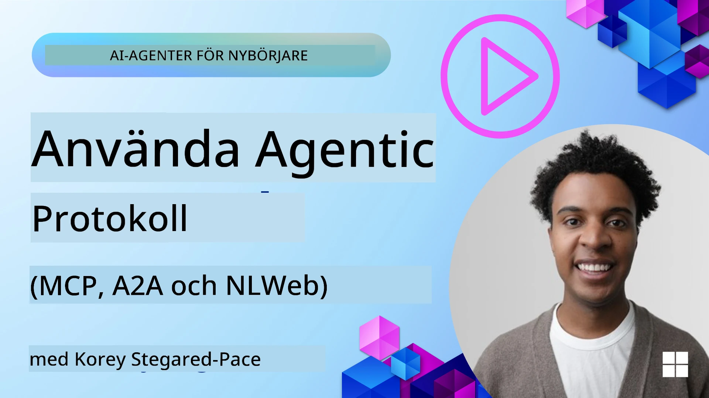
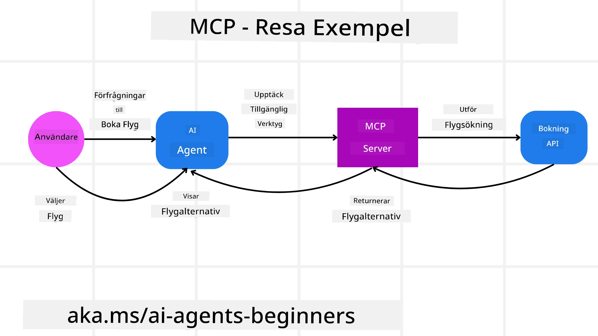
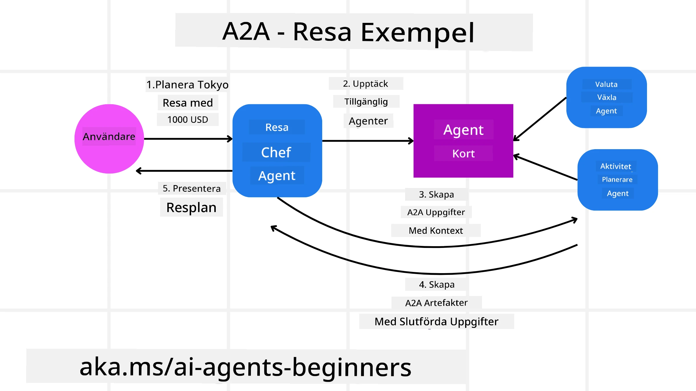
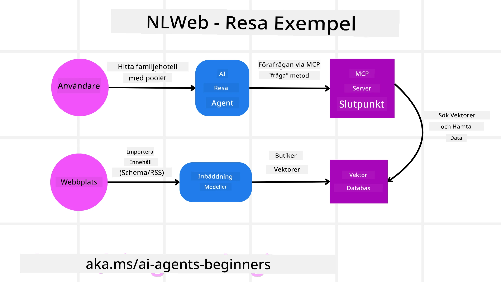

# Använda agentprotokoll (MCP, A2A och NLWeb)

> _(Klicka på bilden ovan för att se videon till den här lektionen)_

När användningen av AI-agenter växer, ökar även behovet av protokoll som säkerställer standardisering, säkerhet och stödjer öppen innovation. I den här lektionen kommer vi att gå igenom 3 protokoll som försöker möta detta behov - Model Context Protocol (MCP), Agent to Agent (A2A) och Natural Language Web (NLWeb).

## Introduktion

I den här lektionen går vi igenom:

• Hur **MCP** tillåter AI-agenter att få åtkomst till externa verktyg och data för att slutföra användarens uppgifter.

• Hur **A2A** möjliggör kommunikation och samarbete mellan olika AI-agenter.

• Hur **NLWeb** tar naturliga språkgränssnitt till vilken webbplats som helst och gör det möjligt för AI-agenter att upptäcka och interagera med innehållet.

## Lärandemål

• **Identifiera** det huvudsakliga syftet och fördelarna med MCP, A2A och NLWeb i sammanhanget av AI-agenter.

• **Förklara** hur varje protokoll underlättar kommunikation och interaktion mellan LLM:er, verktyg och andra agenter.

• **Känna igen** de särskilda roller som varje protokoll spelar vid uppbyggnaden av komplexa agentbaserade system.

## Model Context Protocol

The **Model Context Protocol (MCP)** är en öppen standard som tillhandahåller ett standardiserat sätt för applikationer att förse LLM:er med kontext och verktyg. Detta möjliggör en "universell adaptor" till olika datakällor och verktyg som AI-agenter kan ansluta till på ett konsekvent sätt.

Låt oss titta på komponenterna i MCP, fördelarna jämfört med direkt API-användning, och ett exempel på hur AI-agenter kan använda en MCP-server.

### MCP Core Components

MCP bygger på en **klient-serverarkitektur** och kärnkomponenterna är:

• **Hosts** är LLM-applikationer (till exempel en kodredigerare som VSCode) som initierar anslutningarna till en MCP-server.

• **Clients** är komponenter inom hostapplikationen som upprätthåller en-till-en-anslutningar med servrar.

• **Servers** är lättviktiga program som exponerar specifika kapabiliteter.

I protokollet ingår tre kärnprimitiver som är kapabiliteter hos en MCP-server:

• **Tools**: Dessa är diskreta åtgärder eller funktioner som en AI-agent kan anropa för att utföra en handling. Till exempel kan en vädertjänst exponera ett verktyg "get weather", eller en e-handelsserver kan exponera ett verktyg "purchase product". MCP-servrar annonserar varje verktygs namn, beskrivning och in-/utmatningsschema i sin lista över kapabiliteter.

• **Resources**: Detta är skrivskyddade dataobjekt eller dokument som en MCP-server kan tillhandahålla, och klienter kan hämta dem vid behov. Exempel inkluderar filinnehåll, databasposter eller loggfiler. Resources kan vara text (som kod eller JSON) eller binärt (som bilder eller PDF:er).

• **Prompts**: Detta är fördefinierade mallar som ger föreslagna uppmaningar och möjliggör mer komplexa arbetsflöden.

### Fördelar med MCP

MCP erbjuder betydande fördelar för AI-agenter:

• **Dynamisk verktygsupptäckt**: Agenter kan dynamiskt få en lista över tillgängliga verktyg från en server tillsammans med beskrivningar av vad de gör. Detta står i kontrast till traditionella API:er, som ofta kräver statisk kodning för integrationer, vilket innebär att varje API-ändring kräver koduppdateringar. MCP erbjuder en "integrera en gång"-metod, vilket leder till större anpassningsförmåga.

• **Interoperabilitet över LLM:er**: MCP fungerar över olika LLM:er, vilket ger flexibilitet att byta kärnmodeller för att utvärdera bättre prestanda.

• **Standardiserad säkerhet**: MCP inkluderar en standardiserad autentiseringsmetod, vilket förbättrar skalbarheten när man lägger till åtkomst till ytterligare MCP-servrar. Detta är enklare än att hantera olika nycklar och autentiseringstyper för olika traditionella API:er.

### MCP Example

Föreställ dig att en användare vill boka en flygresa med hjälp av en AI-assistent som drivs av MCP.

1. **Anslutning**: AI-assistenten (MCP-klienten) ansluter till en MCP-server som tillhandahålls av ett flygbolag.

2. **Verktygsupptäckt**: Klienten frågar flygbolagets MCP-server: "Vilka verktyg har ni tillgängliga?" Servern svarar med verktyg som "search flights" och "book flights".

3. **Verktygsanrop**: Du ber sedan AI-assistenten: "Sök efter ett flyg från Portland till Honolulu." AI-assistenten, med hjälp av sin LLM, identifierar att den behöver anropa verktyget "search flights" och skickar relevanta parametrar (avgångsort, destination) till MCP-servern.

4. **Utförande och svar**: MCP-servern, som fungerar som ett omslag, gör det faktiska anropet till flygbolagets interna boknings-API. Den tar sedan emot flyginformationen (t.ex. JSON-data) och skickar den tillbaka till AI-assistenten.

5. **Vidare interaktion**: AI-assistenten presenterar flygalternativen. När du väljer ett flyg kan assistenten anropa verktyget "book flight" på samma MCP-server för att slutföra bokningen.

## Agent-to-Agent Protocol (A2A)

Medan MCP fokuserar på att koppla LLM:er till verktyg, tar **Agent-to-Agent (A2A) protocol** det ett steg längre genom att möjliggöra kommunikation och samarbete mellan olika AI-agenter. A2A kopplar ihop AI-agenter över olika organisationer, miljöer och tekniska stackar för att slutföra en gemensam uppgift.

Vi kommer att granska komponenterna och fördelarna med A2A, tillsammans med ett exempel på hur det kan tillämpas i vår reseapplikation.

### A2A Core Components

A2A fokuserar på att möjliggöra kommunikation mellan agenter och att få dem att samarbeta för att slutföra en deluppgift åt användaren. Varje komponent i protokollet bidrar till detta:

#### Agent Card

Liknande hur en MCP-server delar en lista över verktyg, har ett Agent Card:
- Agentens namn.
- En **beskrivning av de allmänna uppgifter** den utför.
- En **lista över specifika färdigheter** med beskrivningar för att hjälpa andra agenter (eller till och med mänskliga användare) att förstå när och varför de skulle vilja anropa den agenten.
- Den **aktuella Endpoint URL:en** för agenten
- **versionen** och **kapabiliteterna** hos agenten, såsom strömmande svar och push-notiser.

#### Agent Executor

Agentutföraren ansvarar för **att vidarebefordra kontexten från användarchatten till den externa agenten**, den externa agenten behöver detta för att förstå vilken uppgift som ska slutföras. I en A2A-server använder en agent sin egen Large Language Model (LLM) för att tolka inkommande förfrågningar och utföra uppgifter med sina egna interna verktyg.

#### Artifact

När en extern agent har slutfört den begärda uppgiften skapas dess arbetsprodukt som en artefakt. En artefakt **innehåller resultatet av agentens arbete**, en **beskrivning av vad som slutfördes**, och den **textkontext** som skickas genom protokollet. Efter att artefakten skickats stängs anslutningen med den externa agenten tills den behövs igen.

#### Event Queue

Denna komponent används för **hantering av uppdateringar och vidarebefordran av meddelanden**. Den är särskilt viktig i produktionsmiljö för agentiska system för att förhindra att anslutningen mellan agenter stängs innan en uppgift är slutförd, särskilt när uppgiftstider kan vara längre.

### Fördelar med A2A

• **Förbättrat samarbete**: Det gör det möjligt för agenter från olika leverantörer och plattformar att interagera, dela kontext och arbeta tillsammans, vilket underlättar sömlös automatisering över traditionellt frånkopplade system.

• **Flexibilitet vid modellval**: Varje A2A-agent kan välja vilken LLM den använder för att hantera sina förfrågningar, vilket möjliggör optimerade eller finjusterade modeller per agent, till skillnad från en enda LLM-anslutning i vissa MCP-scenarier.

• **Inbyggd autentisering**: Autentisering är integrerad direkt i A2A-protokollet, vilket ger en robust säkerhetsram för agentinteraktioner.

### A2A Example

Låt oss utöka vårt resebokningsscenario, men den här gången använder vi A2A.

1. **Användarförfrågan till multi-agent**: En användare interagerar med en "Reseagent" A2A-klient/agent, kanske genom att säga: "Boka en hel resa till Honolulu nästa vecka, inklusive flyg, hotell och hyrbil".

2. **Orkestrering av reseagenten**: Reseagenten tar emot denna komplexa förfrågan. Den använder sin LLM för att resonnemang kring uppgiften och avgöra att den behöver interagera med andra specialiserade agenter.

3. **Kommunikation mellan agenter**: Reseagenten använder sedan A2A-protokollet för att ansluta till nedströmsagenter, såsom en "Flygbolagsagent", en "Hotellagent" och en "Biluthyrningsagent" som skapats av olika företag.

4. **Delegat utförande av uppgifter**: Reseagenten skickar specifika uppgifter till dessa specialiserade agenter (t.ex. "Hitta flyg till Honolulu", "Boka ett hotell", "Hyra en bil"). Var och en av dessa specialiserade agenter, som kör sina egna LLM:er och använder sina egna verktyg (som i vissa fall kan vara MCP-servrar själva), utför sin specifika del av bokningen.

5. **Konsoliderat svar**: När alla nedströmsagenter har slutfört sina uppgifter sammanställer Reseagenten resultaten (flyguppgifter, hotellbekräftelse, biluthyrningsbokning) och skickar ett omfattande, chattliknande svar tillbaka till användaren.

## Natural Language Web (NLWeb)

Webbplatser har länge varit det primära sättet för användare att komma åt information och data över internet.

Låt oss titta på de olika komponenterna i NLWeb, fördelarna med NLWeb och ett exempel på hur vår NLWeb fungerar genom att titta på vår reseapplikation.

### Komponenter i NLWeb

- **NLWeb Application (Core Service Code)**: Systemet som bearbetar naturliga språkfrågor. Det kopplar ihop de olika delarna av plattformen för att skapa svar. Du kan tänka på det som motorn som driver webbplatsens funktioner för naturligt språk.

- **NLWeb Protocol**: Detta är en **grundläggande uppsättning regler för interaktion med naturligt språk** med en webbplats. Det skickar tillbaka svar i JSON-format (ofta med Schema.org). Dess syfte är att skapa en enkel grund för "AI-webben", på samma sätt som HTML gjorde det möjligt att dela dokument online.

- **MCP Server (Model Context Protocol Endpoint)**: Varje NLWeb-installation fungerar också som en **MCP-server**. Det betyder att den kan **dela verktyg (som en “ask”-metod) och data** med andra AI-system. I praktiken gör detta webbplatsens innehåll och förmågor användbara för AI-agenter, vilket tillåter sajten att bli en del av det bredare "agentekosystemet".

- **Embedding Models**: Dessa modeller används för att **omvandla webbplatsinnehåll till numeriska representationer kallade vektorer** (embeddings). Dessa vektorer fångar betydelse på ett sätt som datorer kan jämföra och söka i. De lagras i en särskild databas, och användare kan välja vilken embeddingmodell de vill använda.

- **Vector Database (Retrieval Mechanism)**: Denna databas **lagrar embeddings av webbplatsinnehållet**. När någon ställer en fråga söker NLWeb i vektordatabasen för att snabbt hitta den mest relevanta informationen. Den ger en snabb lista över möjliga svar, rankade efter likhet. NLWeb fungerar med olika vektorlagringssystem såsom Qdrant, Snowflake, Milvus, Azure AI Search och Elasticsearch.

### NLWeb by Example

Tänk på vår resebokningswebbplats igen, men den här gången drivs den av NLWeb.

1. **Dataingestion**: Webbplatsens befintliga produktkataloger (t.ex. flyglistor, hotellbeskrivningar, paketresor) formateras med Schema.org eller laddas via RSS-flöden. NLWebs verktyg importerar dessa strukturerade data, skapar embeddings och lagrar dem i en lokal eller fjärrbaserad vektordatabas.

2. **Fråga på naturligt språk (människa)**: En användare besöker webbplatsen och, istället för att navigera i menyer, skriver i ett chattgränssnitt: "Hitta ett familjevänligt hotell i Honolulu med pool nästa vecka".

3. **NLWeb-bearbetning**: NLWeb-applikationen tar emot denna fråga. Den skickar frågan till en LLM för tolkning och söker samtidigt i sin vektordatabas efter relevanta hotelllistningar.

4. **Exakta resultat**: LLM hjälper till att tolka sökresultaten från databasen, identifiera de bästa matchningarna baserat på kriterierna "familjevänligt", "pool" och "Honolulu", och formaterar sedan ett svar i naturligt språk. Avgörande är att svaret hänvisar till faktiska hotell från webbplatsens katalog, vilket undviker påhittad information.

5. **AI-agentinteraktion**: Eftersom NLWeb fungerar som en MCP-server kan en extern AI-reseagent också ansluta till webbplatsens NLWeb-instans. AI-agenten kan då använda `ask("Are there any vegan-friendly restaurants in the Honolulu area recommended by the hotel?")`. NLWeb-instansen skulle bearbeta detta, utnyttja sin databas med restauranginformation (om den är inladdad) och returnera ett strukturerat JSON-svar.

### Har du fler frågor om MCP/A2A/NLWeb?

Gå med i [Microsoft Foundry Discord](https://aka.ms/ai-agents/discord) för att träffa andra elever, delta i kontorstider och få dina frågor om AI-agenter besvarade.

## Resurser

- [MCP för nybörjare](https://aka.ms/mcp-for-beginners)  
- [MCP-dokumentation](https://learn.microsoft.com/python/api/overview/azure/ai-projects-readme)
- [NLWeb Repo](https://github.com/nlweb-ai/NLWeb)
- [Microsoft Agent Framework](https://aka.ms/ai-agents-beginners/agent-framewrok)

---

<!-- CO-OP TRANSLATOR DISCLAIMER START -->
Ansvarsfriskrivning:
Detta dokument har översatts med hjälp av AI-översättningstjänsten Co-op Translator (https://github.com/Azure/co-op-translator). Vi strävar efter noggrannhet, men var medveten om att automatiska översättningar kan innehålla fel eller brister. Originaldokumentet på dess ursprungliga språk bör betraktas som den auktoritativa källan. För kritisk information rekommenderas professionell mänsklig översättning. Vi ansvarar inte för några missförstånd eller feltolkningar som uppstår till följd av användning av denna översättning.
<!-- CO-OP TRANSLATOR DISCLAIMER END -->