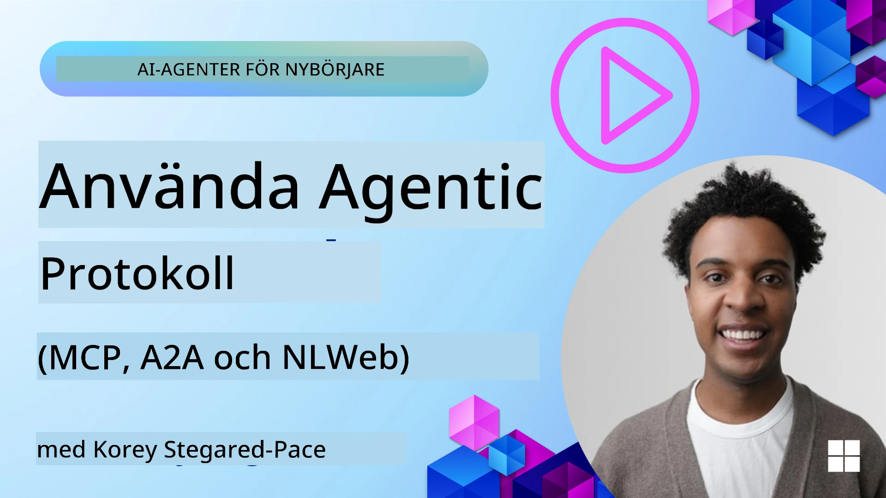
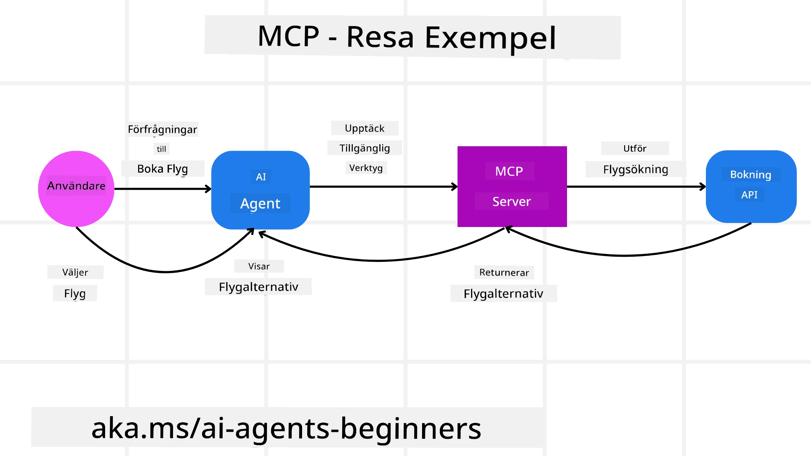
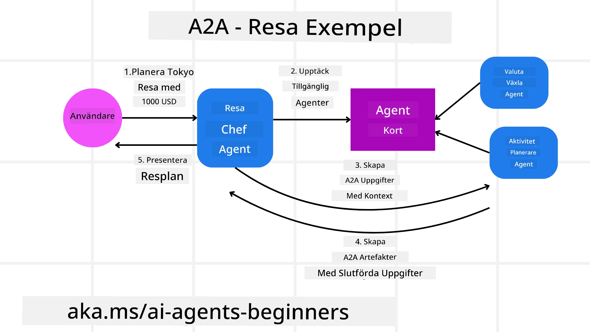
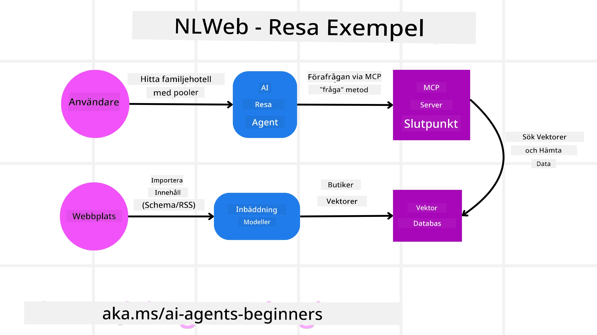

# Använda Agentprotokoll (MCP, A2A och NLWeb)

> _(Klicka på bilden ovan för att se videon av denna lektion)_

När användningen av AI-agenter ökar, ökar också behovet av protokoll som säkerställer standardisering, säkerhet och stödjer öppen innovation. I denna lektion kommer vi att gå igenom 3 protokoll som syftar till att möta detta behov - Model Context Protocol (MCP), Agent to Agent (A2A) och Natural Language Web (NLWeb).

## Introduktion

I denna lektion kommer vi att täcka:

• Hur **MCP** tillåter AI-agenter att få tillgång till externa verktyg och data för att slutföra användaruppgifter.

• Hur **A2A** möjliggör kommunikation och samarbete mellan olika AI-agenter.

• Hur **NLWeb** ger naturliga språkgränssnitt till vilken webbplats som helst och gör det möjligt för AI-agenter att upptäcka och interagera med innehållet.

## Lärandemål

• **Identifiera** det centrala syftet och fördelarna med MCP, A2A och NLWeb i kontexten av AI-agenter.

• **Förklara** hur varje protokoll möjliggör kommunikation och interaktion mellan LLMs, verktyg och andra agenter.

• **Känna igen** de distinkta roller som varje protokoll spelar i att bygga komplexa agentbaserade system.

## Model Context Protocol

**Model Context Protocol (MCP)** är en öppen standard som tillhandahåller ett standardiserat sätt för applikationer att ge kontext och verktyg till LLMs. Detta möjliggör en "universell adapter" till olika datakällor och verktyg som AI-agenter kan ansluta till på ett konsekvent sätt.

Låt oss titta på komponenterna i MCP, fördelarna jämfört med direkt API-användning, och ett exempel på hur AI-agenter kan använda en MCP-server.

### MCP Kärnkomponenter

MCP fungerar på en **klient-server arkitektur** och kärnkomponenterna är:

• **Hosts** är LLM-applikationer (till exempel en kodredigerare som VSCode) som startar anslutningarna till en MCP-server.

• **Clients** är komponenter inom host-applikationen som upprätthåller en-till-en-anslutningar med servrar.

• **Servers** är lättviktiga program som exponerar specifika kapabiliteter.

Inkluderat i protokollet finns tre kärnprimitiver som är kapabiliteterna hos en MCP-server:

• **Verktyg**: Dessa är diskreta åtgärder eller funktioner som en AI-agent kan kalla för att utföra en handling. Till exempel kan en vädertjänst exponera ett "hämta väder"-verktyg, eller en e-handelsserver kan exponera ett "köp produkt"-verktyg. MCP-servrar annonserar varje verks namn, beskrivning och in-/utmatningsschema i sin kapabilitetslista.

• **Resurser**: Dessa är läsbara dataobjekt eller dokument som en MCP-server kan tillhandahålla och klienter kan hämta dem på begäran. Exempel inkluderar filinnehåll, databasposter eller loggfiler. Resurser kan vara text (som kod eller JSON) eller binära (som bilder eller PDF-filer).

• **Prompter**: Detta är fördefinierade mallar som tillhandahåller föreslagna prompts, vilket möjliggör mer komplexa arbetsflöden.

### Fördelar med MCP

MCP erbjuder betydande fördelar för AI-agenter:

• **Dynamisk verktygsupptäckt**: Agenter kan dynamiskt få en lista över tillgängliga verktyg från en server tillsammans med beskrivningar av vad de gör. Detta står i kontrast till traditionella API:er, som ofta kräver statisk kodning för integrationer, vilket innebär att varje API-ändring kräver koduppdateringar. MCP erbjuder en "integrera en gång"-metod, vilket leder till större anpassningsbarhet.

• **Interoperabilitet över LLMs**: MCP fungerar över olika LLMs, vilket ger flexibilitet att byta kärnmodeller för att utvärdera bättre prestanda.

• **Standardiserad säkerhet**: MCP innehåller en standardiserad autentiseringsmetod, vilket förbättrar skalbarheten när tillgång till ytterligare MCP-servrar läggs till. Detta är enklare än att hantera olika nycklar och autentiseringstyper för flera traditionella API:er.

### MCP-exempel

Föreställ dig att en användare vill boka en flygresa med hjälp av en AI-assistent som drivs av MCP.

1. **Anslutning**: AI-assistenten (MCP-klienten) ansluter till en MCP-server som tillhandahålls av ett flygbolag.

2. **Verktygsupptäckt**: Klienten frågar flygbolagets MCP-server, "Vilka verktyg har ni tillgängliga?" Servern svarar med verktyg som "sök flyg" och "boka flyg".

3. **Verktygsanrop**: Du ber sedan AI-assistenten, "Sök efter en flygning från Portland till Honolulu." AI-assistenten, med hjälp av sin LLM, identifierar att den behöver anropa verktyget "sök flyg" och skickar relevanta parametrar (avgångsort, destination) till MCP-servern.

4. **Utförande och svar**: MCP-servern, som fungerar som ett omslag, gör det faktiska anropet till flygbolagets interna boknings-API. Den tar emot flyginformationen (till exempel JSON-data) och skickar den tillbaka till AI-assistenten.

5. **Vidare interaktion**: AI-assistenten presenterar flygalternativen. När du väljer en flygning kan assistenten anropa verktyget "boka flyg" på samma MCP-server och slutföra bokningen.

## Agent-till-Agent Protokoll (A2A)

Medan MCP fokuserar på att ansluta LLMs till verktyg tar **Agent-to-Agent (A2A) protokollet** det ett steg längre genom att möjliggöra kommunikation och samarbete mellan olika AI-agenter. A2A kopplar samman AI-agenter över olika organisationer, miljöer och teknikstackar för att slutföra en gemensam uppgift.

Vi kommer att undersöka komponenterna och fördelarna med A2A, tillsammans med ett exempel på hur det kan tillämpas i vår reseapplikation.

### A2A Kärnkomponenter

A2A fokuserar på att möjliggöra kommunikation mellan agenter och att få dem att arbeta tillsammans för att slutföra en deluppgift för användaren. Varje komponent i protokollet bidrar till detta:

#### Agentkort

På samma sätt som en MCP-server delar en lista över verktyg har ett Agentkort:

- Agentens namn.

- En **beskrivning av de generella uppgifter** som den utför.

- En **lista över specifika färdigheter** med beskrivningar för att hjälpa andra agenter (eller till och med mänskliga användare) att förstå när och varför de skulle vilja anropa den agenten.

- Den **aktuella endpoint-URL:en** för agenten.

- Agentens **version** och **kapabiliteter** såsom strömmande svar och push-notifikationer.

#### Agentutförare

Agentutföraren ansvarar för att **skicka användarens chattkontext till den fjärranslutna agenten**, den fjärranslutna agenten behöver detta för att förstå vilken uppgift som ska utföras. I en A2A-server använder en agent sin egen Large Language Model (LLM) för att tolka inkommande förfrågningar och utföra uppgifter med hjälp av sina egna interna verktyg.

#### Artefakt

När en fjärragent har slutfört den begärda uppgiften skapas dess arbetsprodukt som en artefakt. En artefakt **innehåller resultatet av agentens arbete**, en **beskrivning av vad som fullbordades** och den **textkontext** som skickas genom protokollet. Efter att artefakten skickats stängs anslutningen med den fjärranslutna agenten tills den behövs igen.

#### Händelsekö

Denna komponent används för **att hantera uppdateringar och skicka meddelanden**. Den är särskilt viktig i produktion för agentbaserade system för att förhindra att anslutningen mellan agenter stängs innan en uppgift är slutförd, särskilt när uppgiftens slutförandetid kan ta längre tid.

### Fördelar med A2A

• **Förbättrat samarbete**: Det möjliggör att agenter från olika leverantörer och plattformar kan interagera, dela kontext och arbeta tillsammans, vilket underlättar sömlös automatisering över traditionellt åtskilda system.

• **Flexibilitet i modellval**: Varje A2A-agent kan bestämma vilken LLM den använder för att hantera sina förfrågningar, vilket gör det möjligt att optimera eller finjustera modeller per agent, till skillnad från en enda LLM-anslutning i vissa MCP-scenarier.

• **Inbyggd autentisering**: Autentisering är integrerad direkt i A2A-protokollet, vilket ger en robust säkerhetsram för agentinteraktioner.

### A2A-exempel

Låt oss utvidga vårt scenario för resebokning, men den här gången med A2A.

1. **Användarförfrågan till multi-agent**: En användare interagerar med en "Reseagent"-A2A-klient/agent och säger till exempel: "Boka en hela resa till Honolulu för nästa vecka inkluderande flyg, hotell och hyrbil".

2. **Orkestrering av Resagenten**: Resagenten tar emot denna komplexa förfrågan. Den använder sin LLM för att resonera kring uppgiften och avgöra att den måste interagera med andra specialiserade agenter.

3. **Kommunikation mellan agenter**: Resagenten använder sedan A2A-protokollet för att ansluta till downstream-agenter, såsom en "Flygbolagsagent", en "Hotellagent" och en "Biluthyrningsagent" som skapats av olika företag.

4. **Delegerad uppgiftsutförande**: Resagenten skickar specifika uppgifter till dessa specialiserade agenter (t.ex. "Hitta flyg till Honolulu", "Boka hotell", "Hyr bil"). Varje specialiserad agent, som kör sin egen LLM och använder sina egna verktyg (vilket kan vara MCP-servrar själva), utför sin specifika del av bokningen.

5. **Sammanställd respons**: När alla downstream-agenter har slutfört sina uppgifter sammanställer Resagenten resultaten (flyguppgifter, hotellbekräftelse, hyrbilsbokning) och skickar ett omfattande, chattliknande svar tillbaka till användaren.

## Natural Language Web (NLWeb)

Webbplatser har länge varit det primära sättet för användare att få tillgång till information och data över internet.

Låt oss titta på de olika komponenterna i NLWeb, fördelarna med NLWeb och ett exempel på hur vår NLWeb fungerar genom att titta på vår reseapplikation.

### Komponenter i NLWeb

- **NLWeb-applikation (Kärntjänstkod)**: Systemet som bearbetar naturliga språkfrågor. Den kopplar samman de olika delarna av plattformen för att skapa svar. Du kan se det som **motorn som driver webbplatsens naturliga språkfunktioner**.

- **NLWeb-protokoll**: Detta är en **grundläggande uppsättning regler för naturlig språkinteraktion** med en webbplats. Den skickar tillbaka svar i JSON-format (ofta med Schema.org). Dess syfte är att skapa en enkel grund för "AI-webben", på samma sätt som HTML möjliggjorde att dela dokument online.

- **MCP-server (Model Context Protocol-endpoint)**: Varje NLWeb-konfiguration fungerar också som en **MCP-server**. Det innebär att den kan **dela verktyg (som en "ask"-metod) och data** med andra AI-system. I praktiken gör detta webbplatsens innehåll och funktioner användbara för AI-agenter, vilket gör att sidan blir en del av den bredare "agentur-ekosystemet".

- **Embeddingmodeller**: Dessa modeller används för att **omvandla webbplatsinnehåll till numeriska representationer kallade vektorer** (embeddings). Dessa vektorer fångar betydelse på ett sätt som datorer kan jämföra och söka i. De lagras i en särskild databas, och användare kan välja vilken embeddingmodell de vill använda.

- **Vektordatabas (Sökmekanism)**: Denna databas **lagrar embeddings av webbplatsinnehållet**. När någon ställer en fråga kontrollerar NLWeb vektordatabasen för snabbt hitta mest relevant information. Den ger en snabb lista med möjliga svar, rankade efter likhet. NLWeb fungerar med olika vektorlagringssystem som Qdrant, Snowflake, Milvus, Azure AI Search och Elasticsearch.

### NLWeb genom exempel

Tänk på vår resebokningswebbplats igen, men denna gång drivs den av NLWeb.

1. **Dataingestion**: Webbplatsens befintliga produktkataloger (t.ex. flyglistor, hotellbeskrivningar, paketresor) formateras med Schema.org eller laddas via RSS-flöden. NLWebs verktyg tar in denna strukturerade data, skapar embeddings och lagrar dem i en lokal eller fjärran vektordatabas.

2. **Naturligt språkfråga (människa)**: En användare besöker webbplatsen och istället för att navigera menyer skriver denne i ett chattgränssnitt: "Hitta ett familjevänligt hotell i Honolulu med pool för nästa vecka".

3. **NLWeb bearbetning**: NLWeb-applikationen tar emot denna fråga. Den skickar frågan till en LLM för förståelse och söker samtidigt i sin vektordatabas efter relevanta hotellannonser.

4. **Exakta resultat**: LLM hjälper till att tolka sökresultaten från databasen, identifiera de bästa matchningarna baserat på kriterierna "familjevänligt", "pool" och "Honolulu", och formaterar sedan ett svar på naturligt språk. Viktigt är att svaret hänvisar till faktiska hotell från webbplatsens katalog och undviker påhittad information.

5. **AI-agent-interaktion**: Eftersom NLWeb fungerar som en MCP-server kan en extern AI-resagent också ansluta till denna webbplats NLWeb-instans. AI-agenten kan då använda MCP-metoden `ask` för att direkt ställa frågor till webbplatsen: `ask("Finns det några veganvänliga restauranger i Honolulu som rekommenderas av hotellet?")`. NLWeb-instansen skulle bearbeta detta, dra nytta av sin databas med restauranginformation (om den är inläst), och returnera ett strukturerat JSON-svar.

### Har du fler frågor om MCP/A2A/NLWeb?

Gå med i [Microsoft Foundry Discord](https://discord.com/invite/ATgtXmAS5D) för att träffa andra lärande, delta i kontorstider och få dina frågor om AI-agenter besvarade.

## Resurser

- [MCP för nybörjare](https://aka.ms/mcp-for-beginners)  
- [MCP-dokumentation](https://learn.microsoft.com/python/api/overview/azure/ai-projects-readme)
- [NLWeb Repo](https://github.com/nlweb-ai/NLWeb)
- [Microsoft Agent Framework](https://aka.ms/ai-agents-beginners/agent-framework)

---

<!-- CO-OP TRANSLATOR DISCLAIMER START -->
**Ansvarsfriskrivning**:
Detta dokument har översatts med hjälp av AI-översättningstjänsten [Co-op Translator](https://github.com/Azure/co-op-translator). Även om vi strävar efter noggrannhet, var vänlig notera att automatiska översättningar kan innehålla fel eller brister. Det ursprungliga dokumentet på dess modersmål bör betraktas som den auktoritativa källan. För kritisk information rekommenderas professionell mänsklig översättning. Vi ansvarar inte för några missförstånd eller feltolkningar som uppstår till följd av användningen av denna översättning.
<!-- CO-OP TRANSLATOR DISCLAIMER END -->