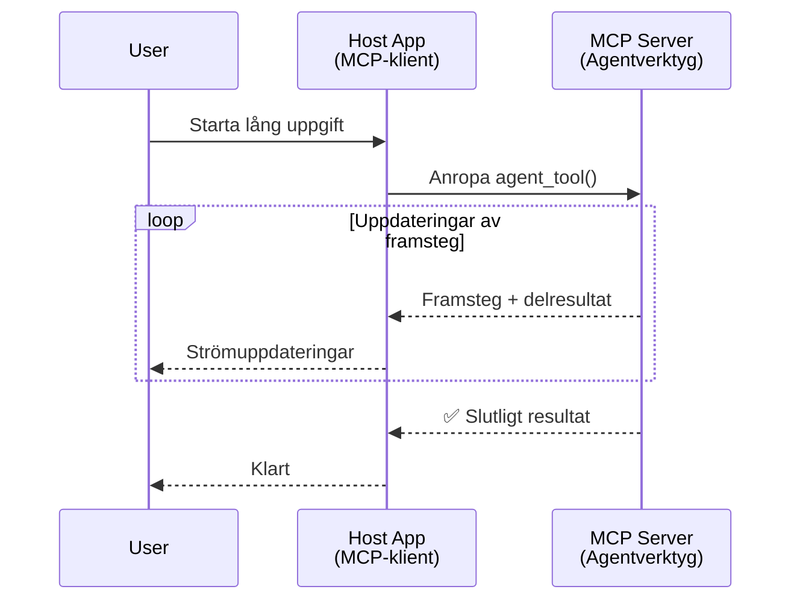
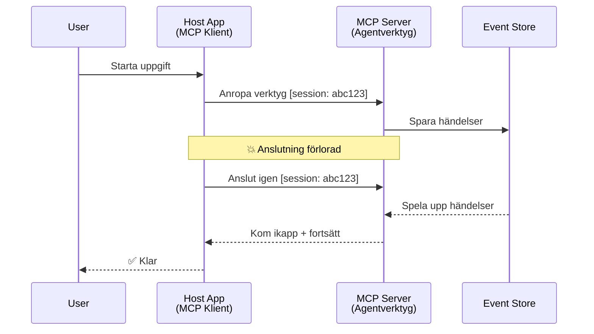
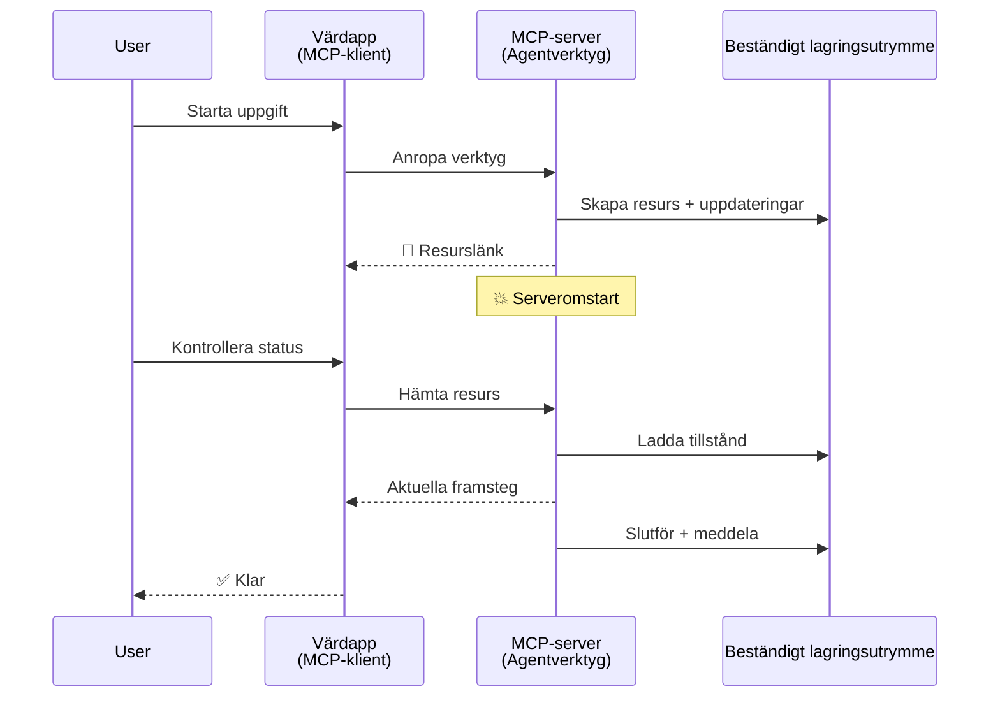
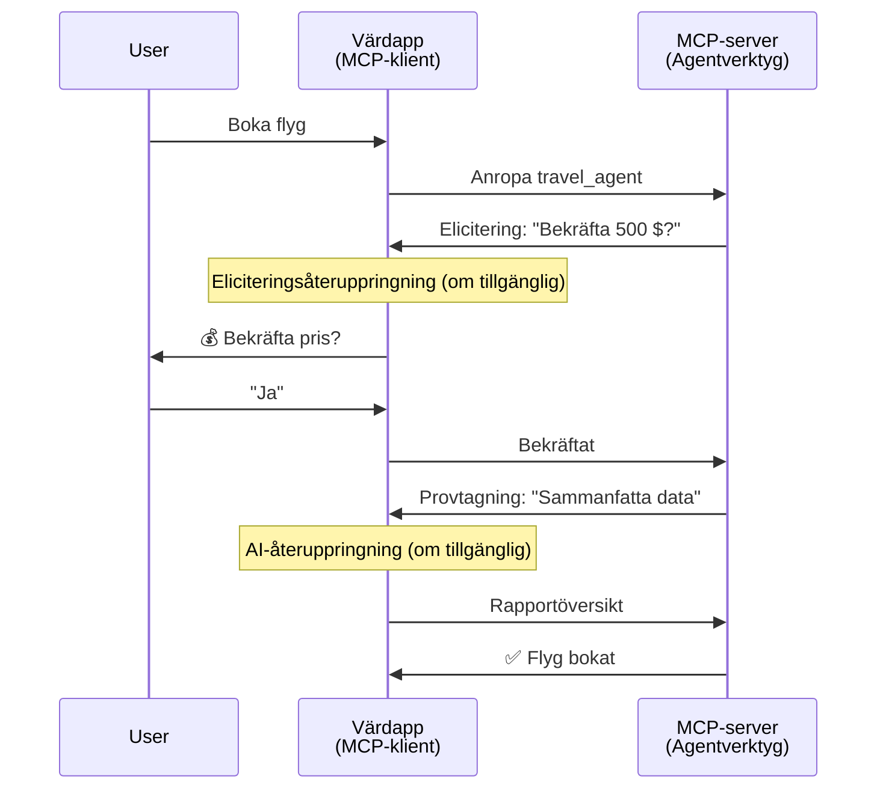
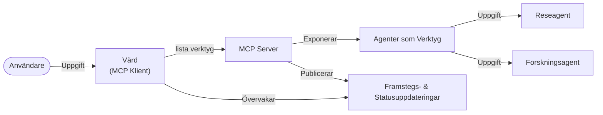

# Bygga agent-till-agent-kommunikationssystem med MCP

> TL;DR – Kan du bygga Agent2Agent-kommunikation på MCP? Ja!

MCP har utvecklats betydligt bortom sitt ursprungliga mål att "förse LLM med kontext". Med senaste förbättringar som inkluderar [återupptagbara strömmar](https://modelcontextprotocol.io/docs/concepts/transports#resumability-and-redelivery), [elicitation](https://modelcontextprotocol.io/specification/2025-06-18/client/elicitation), [sampling](https://modelcontextprotocol.io/specification/2025-06-18/client/sampling) och notifikationer ([progress](https://modelcontextprotocol.io/specification/2025-06-18/basic/utilities/progress) och [resources](https://modelcontextprotocol.io/specification/2025-06-18/schema#resourceupdatednotification)) erbjuder MCP nu en robust grund för att bygga komplexa agent-till-agent kommunikationssystem.

## Missuppfattningen kring Agent/Verktyg

När fler utvecklare utforskar verktyg med agentlika beteenden (kör under långa perioder, kan kräva ytterligare indata mitt under körning osv.) är en vanlig missuppfattning att MCP inte är lämpligt, främst för att tidiga exempel på dess verktygsprimitiver fokuserade på enkla förfrågan-svar-mönster.

Denna uppfattning är föråldrad. MCP-specifikationen har förstärkts betydligt de senaste månaderna med kapabiliteter som överbryggar gapet för att bygga långvariga agentlika beteenden:

- **Streaming & Delresultat**: Realtidsuppdateringar under körning
- **Återupptagningsbarhet**: Klienter kan återansluta och fortsätta efter frånkoppling
- **Beständighet**: Resultat överlever serveromstarter (t.ex. via resurslänkar)
- **Flera vändor**: Interaktiv inmatning mitt under körning via elicitation och sampling

Dessa funktioner kan kombineras för att möjliggöra komplexa agentlika och multi-agent-applikationer, alla distribuerade på MCP-protokollet.

För referens kommer vi att använda "agent" för ett ”verktyg” som finns tillgängligt på en MCP-server. Det innebär förekomst av en värdapplikation som implementerar en MCP-klient som etablerar en session med MCP-servern och kan kalla agenten.

## Vad gör ett MCP-verktyg "agentlikt"?

Innan vi går in i implementation, låt oss fastställa vilka infrastrukturfunktioner som krävs för att stödja långvariga agenter.

> Vi definierar en agent som en entitet som kan verka autonomt över längre perioder, kapabel att hantera komplexa uppgifter som kan kräva flera interaktioner eller anpassningar baserat på feedback i realtid.

### 1. Streaming & Delresultat

Traditionella förfrågan-svar-mönster fungerar inte för långvariga uppgifter. Agenter behöver tillhandahålla:

- Realtidsuppdateringar av framsteg
- Mellanresultat

**MCP-stöd**: Resursuppdateringsnotifikationer möjliggör strömning av delresultat, men detta kräver noggrann design för att undvika konflikter med JSON-RPC:s 1:1-förfrågan/svar-modell.

| Funktion                   | Användningsfall                                                                                                                                                        | MCP-stöd                                                                                |
| ------------------------- | --------------------------------------------------------------------------------------------------------------------------------------------------------------------- | -------------------------------------------------------------------------------------- |
| Realtidsuppdateringar     | Användaren begär en migreringsuppgift för kodbas. Agenten strömmar framsteg: "10% - Analyserar beroenden... 25% - Konverterar TypeScript-filer... 50% - Uppdaterar imports..." | ✅ Progress-notifikationer                                                              |
| Delresultat               | "Skapa en bok"-uppgift strömmar delresultat, t.ex. 1) Story outline, 2) Kapitel-lista, 3) Varje kapitel när klar. Värden kan inspektera, avbryta eller omdirigera när som helst. | ✅ Notifikationer kan "utökas" för att inkludera delresultat, se förslag i PR 383, 776  |

<div align="center" style="font-style: italic; font-size: 0.95em; margin-bottom: 0.5em;">
<strong>Figur 1:</strong> Denna diagram visar hur en MCP-agent strömmar realtidsuppdateringar och delresultat till värdapplikationen under en långvarig uppgift, vilket gör det möjligt för användaren att övervaka körningen i realtid.
</div>



### 2. Återupptagningsbarhet

Agenter måste hantera nätverksavbrott på ett smidigt sätt:

- Återansluta efter (klient) frånkoppling
- Fortsätta där de slutade (med meddelandeåterleverans)

**MCP-stöd**: MCP StreamableHTTP-transport stödjer idag sessionåterupptagning och meddelandeåterleverans med sessions-ID:n och senaste händelse-ID:n. Viktigt är att servern måste implementera ett EventStore som möjliggör eventåteruppspelning vid klientåteranslutning.  
Det finns också ett community-förslag (PR #975) som utforskar transport-agnostiska återupptagningsbara strömmar.

| Funktion        | Användningsfall                                                                                                                                                   | MCP-stöd                                                                 |
| -------------- | ---------------------------------------------------------------------------------------------------------------------------------------------------------------- | ----------------------------------------------------------------------- |
| Återupptagningsbarhet | Klient kopplas från under långvarig uppgift. Vid återanslutning återupptas session med uppspelning av missade event, och fortsätter sömlöst där den slutade. | ✅ StreamableHTTP-transport med sessions-ID, eventuppspelning och EventStore |

<div align="center" style="font-style: italic; font-size: 0.95em; margin-bottom: 0.5em;">
<strong>Figur 2:</strong> Detta diagram visar hur MCP:s StreamableHTTP-transport och event store möjliggör smidig sessionåterupptagning: om klienten kopplas bort kan den återansluta och spela upp missade event för att fortsätta uppgiften utan förlorade framsteg.
</div>



### 3. Beständighet

Långvariga agenter behöver beständigt tillstånd:

- Resultat överlever serveromstarter
- Status kan hämtas utanför bandet
- Framsteg kan följas över sessioner

**MCP-stöd**: MCP stödjer nu resurslänk som returtyp för verktygsanrop. En vanlig design idag är att skapa ett verktyg som skapar en resurs och omedelbart returnerar en resurslänk. Verktyget kan fortsätta hantera uppgiften i bakgrunden och uppdatera resursen. Klienten kan sedan välja att poll:a tillståndet för denna resurs för att få del- eller fullständiga resultat (beroende på vilka resursuppdateringar servern tillhandahåller) eller prenumerera på resursen för uppdateringsnotifikationer.

En begränsning är att polling eller prenumeration kan konsumera resurser med påverkan vid stor skala. Det finns ett öppet community-förslag (inklusive #992) som utforskar möjligheten att inkludera webhooks eller triggers som servern kan kalla för att notifiera klient/värdapplikation om uppdateringar.

| Funktion    | Användningsfall                                                                                                                                | MCP-stöd                                                         |
| ---------- | ---------------------------------------------------------------------------------------------------------------------------------------------- | ---------------------------------------------------------------- |
| Beständighet | Servercrash under data-migrering. Resultat och framsteg överlever omstart, klient kan kontrollera status och fortsätta från beständig resurs. | ✅ Resurslänkar med beständig lagring och statusnotifikationer    |

En vanlig design idag är att skapa ett verktyg som initierar en resurs och omedelbart returnerar en resurslänk. Verktyget kan i bakgrunden hantera uppgiften, skicka resursnotifikationer som fungerar som progressuppdateringar eller inkluderar delresultat, och uppdatera innehållet i resursen vid behov.

<div align="center" style="font-style: italic; font-size: 0.95em; margin-bottom: 0.5em;">
<strong>Figur 3:</strong> Diagrammet illustrerar hur MCP-agenter använder beständiga resurser och statusnotifikationer för att säkerställa att långvariga uppgifter överlever serveromstarter, vilket tillåter klienter att kontrollera framsteg och hämta resultat även efter fel.
</div>



### 4. Flera Vändor - Interaktiv Inmatning

Agenter behöver ofta ytterligare input mitt under körning:

- Mänsklig förtydligande eller godkännande
- AI-hjälp för komplexa beslut
- Dynamisk justering av parametrar

**MCP-stöd**: Fullständigt stöd via sampling (för AI-indata) och elicitation (för mänsklig indata).

| Funktion                   | Användningsfall                                                                                                                                | MCP-stöd                                             |
| ------------------------- | -------------------------------------------------------------------------------------------------------------------------------------------- | ---------------------------------------------------- |
| Flera vändor-interaktioner | Resebokningsagent frågar användaren om prisbekräftelse, sedan ber AI sammanfatta reseinformationen innan bokningen slutförs.                   | ✅ Elicitation för mänsklig indata, sampling för AI |

<div align="center" style="font-style: italic; font-size: 0.95em; margin-bottom: 0.5em;">
<strong>Figur 4:</strong> Diagrammet visar hur MCP-agenter interaktivt kan begära mänsklig indata eller AI-hjälp mitt under körning, och stödjer komplexa, flervändors-flöden såsom bekräftelser och dynamiskt beslutsfattande.
</div>



## Implementera långvariga agenter på MCP – kodöversikt

Som en del av denna artikel tillhandahåller vi ett [kodförråd](https://github.com/victordibia/ai-tutorials/tree/main/MCP%20Agents) som innehåller en komplett implementation av långvariga agenter med MCP Python SDK och StreamableHTTP-transport för sessionåterupptagning och meddelandeåterleverans. Implementationen visar hur MCP-kapabiliteter kan kombineras för att möjliggöra sofistikerade agentlika beteenden.

Specifikt implementerar vi en server med två huvudsakliga agentverktyg:

- **Travel Agent** – Simulerar en resbokningstjänst med prisbekräftelse via elicitation
- **Research Agent** – Utför forskningsuppgifter med AI-assisterade sammanfattningar via sampling

Båda agenter demonstrerar realtidsframsteg, interaktiva bekräftelser och full sessionåterupptagningsförmåga.

### Viktiga koncept i implementationen

Följande sektioner visar server-sidans agentimplementation och klient-sidans hantering av värden för varje kapabilitet:

#### Streaming & Framstegsuppdateringar – Realtidsstatus för uppgift

Streaming gör det möjligt för agenter att skicka realtidsuppdateringar under långvariga uppgifter, vilket håller användare informerade om status och mellanresultat.

**Serverimplementation (agent skickar progress-notifikationer):**

```python
# Från server/server.py - Resebyrå som skickar statusuppdateringar
for i, step in enumerate(steps):
    await ctx.session.send_progress_notification(
        progress_token=ctx.request_id,
        progress=i * 25,
        total=100,
        message=step,
        related_request_id=str(ctx.request_id)
    )
    await anyio.sleep(2)  # Simulera arbete

# Alternativ: Logga meddelanden för detaljerade steg-för-steg-uppdateringar
await ctx.session.send_log_message(
    level="info",
    data=f"Processing step {current_step}/{steps} ({progress_percent}%)",
    logger="long_running_agent",
    related_request_id=ctx.request_id,
)
```

**Klientimplementation (värd tar emot progress-uppdateringar):**

```python
# Från client/client.py - Klient som hanterar realtidsnotiser
async def message_handler(message) -> None:
    if isinstance(message, types.ServerNotification):
        if isinstance(message.root, types.LoggingMessageNotification):
            console.print(f"📡 [dim]{message.root.params.data}[/dim]")
        elif isinstance(message.root, types.ProgressNotification):
            progress = message.root.params
            console.print(f"🔄 [yellow]{progress.message} ({progress.progress}/{progress.total})[/yellow]")

# Registrera meddelandehanterare vid skapande av session
async with ClientSession(
    read_stream, write_stream,
    message_handler=message_handler
) as session:
```

#### Elicitation – Begära användarinput

Elicitation gör det möjligt för agenter att begära användarindata mitt under körning, viktigt för bekräftelser, förtydliganden eller godkännanden under långvariga uppgifter.

**Serverimplementation (agent begär bekräftelse):**

```python
# Från server/server.py - Resebyrå som begär prisbekräftelse
elicit_result = await ctx.session.elicit(
    message=f"Please confirm the estimated price of $1200 for your trip to {destination}",
    requestedSchema=PriceConfirmationSchema.model_json_schema(),
    related_request_id=ctx.request_id,
)

if elicit_result and elicit_result.action == "accept":
    # Fortsätt med bokningen
    logger.info(f"User confirmed price: {elicit_result.content}")
elif elicit_result and elicit_result.action == "decline":
    # Avbryt bokningen
    booking_cancelled = True
```

**Klientimplementation (värd tillhandahåller elicitation-callback):**

```python
# Från client/client.py - Klienthantering av eliciteringsförfrågningar
async def elicitation_callback(context, params):
    console.print(f"💬 Server is asking for confirmation:")
    console.print(f"   {params.message}")

    response = console.input("Do you accept? (y/n): ").strip().lower()

    if response in ['y', 'yes']:
        return types.ElicitResult(
            action="accept",
            content={"confirm": True, "notes": "Confirmed by user"}
        )
    else:
        return types.ElicitResult(
            action="decline",
            content={"confirm": False, "notes": "Declined by user"}
        )

# Registrera callback när sessionen skapas
async with ClientSession(
    read_stream, write_stream,
    elicitation_callback=elicitation_callback
) as session:
```

#### Sampling – Begära AI-assistans

Sampling tillåter agenter att be LLM om hjälp för komplexa beslut eller innehållsgenerering under körning. Detta möjliggör hybrida människa-AI-flöden.

**Serverimplementation (agent ber om AI-hjälp):**

```python
# Från server/server.py - Forskningsagent som begär AI-sammanfattning
sampling_result = await ctx.session.create_message(
    messages=[
        SamplingMessage(
            role="user",
            content=TextContent(type="text", text=f"Please summarize the key findings for research on: {topic}")
        )
    ],
    max_tokens=100,
    related_request_id=ctx.request_id,
)

if sampling_result and sampling_result.content:
    if sampling_result.content.type == "text":
        sampling_summary = sampling_result.content.text
        logger.info(f"Received sampling summary: {sampling_summary}")
```

**Klientimplementation (värd tillhandahåller sampling-callback):**

```python
# Från client/client.py - Klienthantering av samplingsförfrågningar
async def sampling_callback(context, params):
    message_text = params.messages[0].content.text if params.messages else 'No message'
    console.print(f"🧠 Server requested sampling: {message_text}")

    # I en riktig applikation kan detta anropa en LLM API
    # För demonstrationsändamål tillhandahåller vi ett mock-svar
    mock_response = "Based on current research, MCP has evolved significantly..."

    return types.CreateMessageResult(
        role="assistant",
        content=types.TextContent(type="text", text=mock_response),
        model="interactive-client",
        stopReason="endTurn"
    )

# Registrera callbacken när sessionen skapas
async with ClientSession(
    read_stream, write_stream,
    sampling_callback=sampling_callback,
    elicitation_callback=elicitation_callback
) as session:
```

#### Återupptagningsbarhet – Sessionskontinuitet vid frånkopplingar

Återupptagningsbarhet säkerställer att långvariga agentuppgifter överlever klientfrånkopplingar och fortsätter utan avbrott vid återanslutning. Implementeras via event stores och återupptagningstokens.

**Eventstore-implementering (server håller sessionsstatus):**

```python
# Från server/event_store.py - Enkel händelselagring i minnet
class SimpleEventStore(EventStore):
    def __init__(self):
        self._events: list[tuple[StreamId, EventId, JSONRPCMessage]] = []
        self._event_id_counter = 0

    async def store_event(self, stream_id: StreamId, message: JSONRPCMessage) -> EventId:
        """Store an event and return its ID."""
        self._event_id_counter += 1
        event_id = str(self._event_id_counter)
        self._events.append((stream_id, event_id, message))
        return event_id

    async def replay_events_after(self, last_event_id: EventId, send_callback: EventCallback) -> StreamId | None:
        """Replay events after the specified ID for resumption."""
        # Hitta händelser efter den senaste kända händelsen och spela upp dem
        for _, event_id, message in self._events[start_index:]:
            await send_callback(EventMessage(message, event_id))

# Från server/server.py - Skicka händelselagring till sessionshanterare
def create_server_app(event_store: Optional[EventStore] = None) -> Starlette:
    server = ResumableServer()

    # Skapa sessionshanterare med händelselagring för återupptagning
    session_manager = StreamableHTTPSessionManager(
        app=server,
        event_store=event_store,  # Händelselagring möjliggör återupptagning av session
        json_response=False,
        security_settings=security_settings,
    )

    return Starlette(routes=[Mount("/mcp", app=session_manager.handle_request)])

# Användning: Initiera med händelselagring
event_store = SimpleEventStore()
app = create_server_app(event_store)
```

**Klientmetadata med återupptagningstoken (klient återansluter med sparat tillstånd):**

```python
# Från client/client.py - Klientåterupptagning med metadata
if existing_tokens and existing_tokens.get("resumption_token"):
    # Använd befintlig återupptagnings-token för att fortsätta där vi slutade
    metadata = ClientMessageMetadata(
        resumption_token=existing_tokens["resumption_token"],
    )
else:
    # Skapa callback för att spara återupptagnings-token när den mottas
    def enhanced_callback(token: str):
        protocol_version = getattr(session, 'protocol_version', None)
        token_manager.save_tokens(session_id, token, protocol_version, command, args)

    metadata = ClientMessageMetadata(
        on_resumption_token_update=enhanced_callback,
    )

# Skicka förfrågan med återupptagningsmetadata
result = await session.send_request(
    types.ClientRequest(
        types.CallToolRequest(
            method="tools/call",
            params=types.CallToolRequestParams(name=command, arguments=args)
        )
    ),
    types.CallToolResult,
    metadata=metadata,
)
```

Värdapplikationen hanterar sessions-ID:n och återupptagningstoken lokalt, vilket gör att den kan återansluta till befintliga sessioner utan förlorade framsteg eller status.

### Kodorganisation

<div align="center" style="font-style: italic; font-size: 0.95em; margin-bottom: 0.5em;">
<strong>Figur 5:</strong> MCP-baserad agent-systemarkitektur
</div>



**Nyckelfiler:**

- **`server/server.py`** – Återupptagningsbar MCP-server med travel- och research-agenter som demonstrerar elicitation, sampling och progress-uppdateringar
- **`client/client.py`** – Interaktiv värdapplikation med stöd för återupptagning, callback-hanterare och tokenhantering
- **`server/event_store.py`** – Eventstore-implementation som möjliggör sessionåterupptagning och meddelandeåterleverans

## Utöka till multi-agent-kommunikation på MCP

Implementationen ovan kan utökas till multi-agent-system genom att förbättra värdapplikationens intelligens och omfattning:

- **Intelligent uppgiftsnedbrytning**: Värden analyserar komplexa användarförfrågningar och delar upp dem i deluppgifter för olika specialiserade agenter
- **Multi-serverkoordinering**: Värden upprätthåller anslutningar till flera MCP-servrar, var och en med olika agentfunktioner
- **Uppgiftstillståndshantering**: Värden spårar framsteg över flera samtidiga agentuppgifter med hantering av beroenden och sekvensering
- **Robusthet & återförsök**: Värden hanterar fel, implementerar återförsökslogik och omdirigerar uppgifter när agenter blir otillgängliga
- **Resultatsyntes**: Värden kombinerar output från flera agenter till sammanhängande slutresultat

Värden utvecklas från en enkel klient till en intelligent orkestrator som koordinerar distribuerade agentfunktioner samtidigt som den behåller MCP-protokollets grund.

## Slutsats

MCP:s förbättrade kapabiliteter – resursnotifikationer, elicitation/sampling, återupptagningsbara strömmar och beständiga resurser – möjliggör komplexa agent-till-agent-interaktioner samtidigt som protokollets enkelhet bevaras.

## Kom igång

Redo att bygga ditt eget agent2agent-system? Följ dessa steg:

### 1. Kör demon

```bash
# Starta servern med event store för återupptagning
python -m server.server --port 8006

# I ett annat terminalfönster, kör den interaktiva klienten
python -m client.client --url http://127.0.0.1:8006/mcp
```

**Tillgängliga kommandon i interaktivt läge:**

- `travel_agent` – Boka resa med prisbekräftelse via elicitation
- `research_agent` – Forska ämnen med AI-assisterade sammanfattningar via sampling
- `list` – Visa alla tillgängliga verktyg
- `clean-tokens` – Rensa återupptagningstokens
- `help` – Visa detaljerad hjälpinformation
- `quit` – Avsluta klienten

### 2. Testa återupptagningsmöjligheter

- Starta en långvarig agent (t.ex. `travel_agent`)
- Avbryt klienten under körning (Ctrl+C)
- Starta om klienten – den återupptar automatiskt där den slutade

### 3. Utforska och utöka

- **Utforska exemplen**: Kolla in detta [mcp-agents](https://github.com/victordibia/ai-tutorials/tree/main/MCP%20Agents)
- **Gå med i communityn**: Delta i MCP-diskussioner på GitHub
- **Experimentera**: Börja med en enkel långvarig uppgift och lägg successivt till streaming, återupptagningsbarhet och multi-agent-koordinering

Detta demonstrerar hur MCP möjliggör intelligenta agentbeteenden samtidigt som verktygsbaserad enkelhet bibehålls.

Sammanfattningsvis utvecklas MCP-protokollspecifikationen snabbt; läsaren uppmuntras att regelbundet granska den officiella dokumentationssajten för de senaste uppdateringarna – https://modelcontextprotocol.io/introduction

---

<!-- CO-OP TRANSLATOR DISCLAIMER START -->
**Ansvarsfriskrivning**:
Detta dokument har översatts med hjälp av AI-översättningstjänsten [Co-op Translator](https://github.com/Azure/co-op-translator). Även om vi strävar efter noggrannhet, var vänlig notera att automatiska översättningar kan innehålla fel eller brister. Det ursprungliga dokumentet på dess modersmål bör betraktas som den auktoritativa källan. För kritisk information rekommenderas professionell mänsklig översättning. Vi ansvarar inte för några missförstånd eller feltolkningar som uppstår till följd av användningen av denna översättning.
<!-- CO-OP TRANSLATOR DISCLAIMER END -->