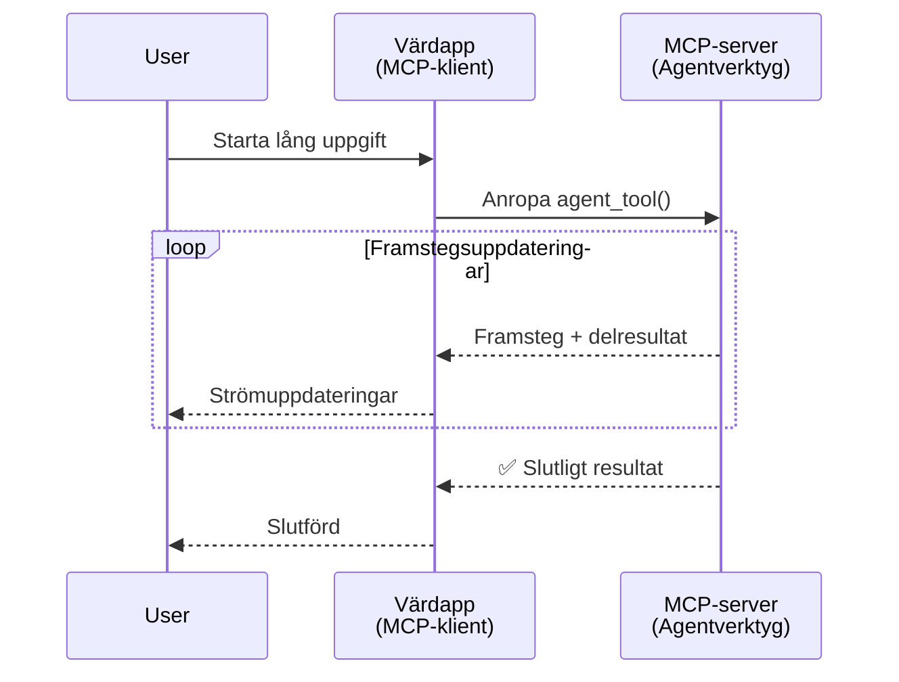
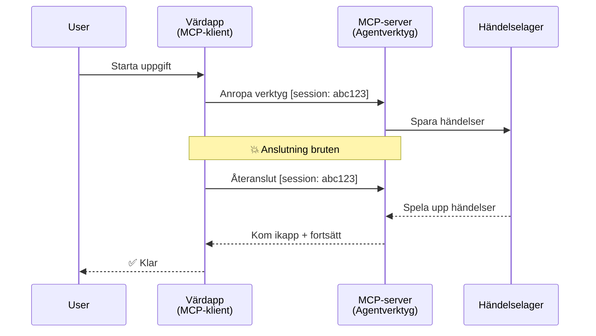
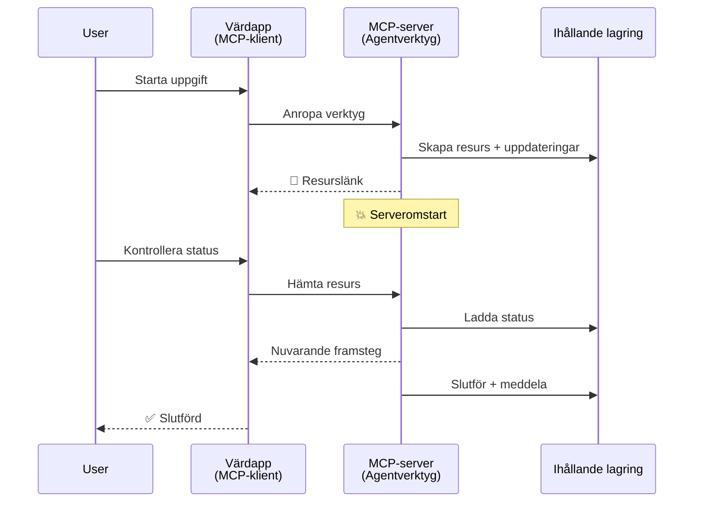
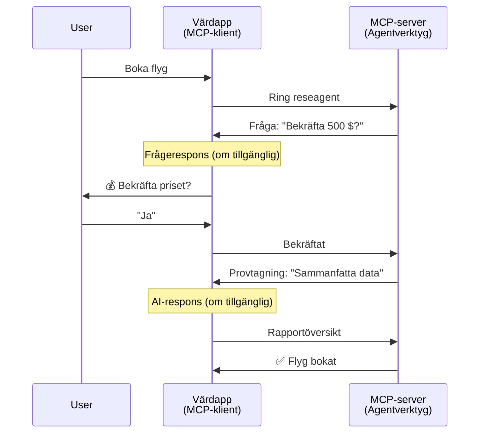
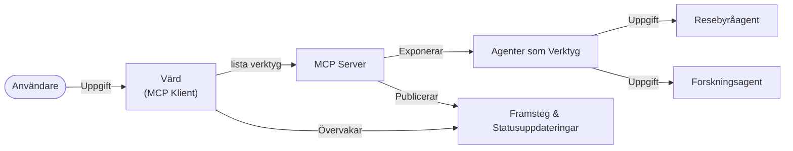

# Bygga system för agent-till-agent-kommunikation med MCP

> TL;DR - Kan du bygga Agent2Agent-kommunikation på MCP? Ja!

MCP har utvecklats avsevärt bortom sitt ursprungliga mål att "ge kontext till LLMs". Med de senaste förbättringarna inklusive [återupptagningsbara strömmar](https://modelcontextprotocol.io/docs/concepts/transports#resumability-and-redelivery), [elicitation](https://modelcontextprotocol.io/specification/2025-06-18/client/elicitation), [sampling](https://modelcontextprotocol.io/specification/2025-06-18/client/sampling), och notiser ([progress](https://modelcontextprotocol.io/specification/2025-06-18/basic/utilities/progress) och [resources](https://modelcontextprotocol.io/specification/2025-06-18/schema#resourceupdatednotification)), erbjuder MCP nu en robust grund för att bygga komplexa system för agent-till-agent-kommunikation.

## Missuppfattningen om Agent/Verktyg

När fler utvecklare utforskar verktyg med agentliknande beteenden (körs under långa perioder, kan kräva ytterligare input mitt i körningen osv.) är en vanlig missuppfattning att MCP är olämpligt eftersom tidiga exempel på dess verktygsprimitiv fokuserade på enkla begäran-svar-mönster.

Denna uppfattning är föråldrad. MCP-specifikationen har förbättrats avsevärt under de senaste månaderna med funktioner som överbrygger gapet för att bygga långvariga agentliknande beteenden:

- **Strömning & Delresultat**: Realtidsuppdateringar om framsteg under körning
- **Återupptagningsbarhet**: Klienter kan återansluta och fortsätta efter frånkoppling
- **Hållbarhet**: Resultat överlever serveromstarter (t.ex. via resurslänkar)
- **Flera steg**: Interaktiv input mitt i körningen via elicitation och sampling

Dessa funktioner kan kombineras för att möjliggöra komplexa agent- och multi-agent-applikationer, allt distribuerat på MCP-protokollet.

För referens kommer vi att referera till en agent som ett "verktyg" som finns på en MCP-server. Detta innebär att det finns en värdapplikation som implementerar en MCP-klient som etablerar en session med MCP-servern och kan anropa agenten.

## Vad Gör ett MCP-verktyg "Agentlikt"?

Innan vi dyker in i implementation, låt oss definiera vilka infrastrukturförmågor som behövs för att stödja långvariga agenter.

> Vi definierar en agent som en enhet som kan agera autonomt över längre perioder, kapabel att hantera komplexa uppgifter som kan kräva flera interaktioner eller justeringar baserade på realtidsåterkoppling.

### 1. Strömning & Delresultat

Traditionella begäran-svar-mönster fungerar inte för långvariga uppgifter. Agenter behöver tillhandahålla:

- Realtidsuppdateringar om framsteg
- Mellanresultat

**MCP-stöd**: Resursuppdateringsnotiser möjliggör strömning av delresultat, även om detta kräver noggrann design för att undvika konflikter med JSON-RPC:s 1:1 begäran/svar-modell.

| Funktion                  | Användningsfall                                                                                                                                                             | MCP-stöd                                                                                  |
| ------------------------- | -------------------------------------------------------------------------------------------------------------------------------------------------------------------------- | ---------------------------------------------------------------------------------------- |
| Realtidsuppdateringar     | Användare begär en kodbasmigrationsuppgift. Agenten strömmar framsteg: "10% - Analyserar beroenden... 25% - Konverterar TypeScript-filer... 50% - Uppdaterar importer..."      | ✅ Framstegsnotiser                                                                       |
| Delresultat              | "Generera en bok"-uppgift strömmar delresultat, t.ex. 1) Storybågeöversikt, 2) Kapitel-lista, 3) Varje kapitel när det blir klart. Värden kan inspektera, avbryta eller styra om.| ✅ Notiser kan "utökas" för att inkludera delresultat se förslag på PR 383, 776           |

<div align="center" style="font-style: italic; font-size: 0.95em; margin-bottom: 0.5em;">
<strong>Figur 1:</strong> Detta diagram illustrerar hur en MCP-agent strömmar realtidsuppdateringar om framsteg och delresultat till värdapplikationen under en långvarig uppgift, vilket möjliggör för användaren att övervaka körningen i realtid.
</div>



### 2. Återupptagningsbarhet

Agenter måste hantera nätverksavbrott på ett smidigt sätt:

- Återansluta efter (klient) frånkoppling
- Fortsätta från där de slutade (meddelande-återleverans)

**MCP-stöd**: MCP:s StreamableHTTP-transport stödjer idag sessionsåterupptagning och meddelande-återleverans med sessions-ID:n och senaste händelse-ID:n. Viktigt är att servern måste implementera ett EventStore som möjliggör uppspelning av händelser vid klientåteranslutning.  
Notera att det finns ett communityförslag (PR #975) som utforskar transport-agnostiska återupptagningsbara strömmar.

| Funktion         | Användningsfall                                                                                                                                                 | MCP-stöd                                                               |
| --------------- | -------------------------------------------------------------------------------------------------------------------------------------------------------------- | --------------------------------------------------------------------- |
| Återupptagningsbarhet | Klient kopplas från under långvarig uppgift. Vid återanslutning återupptas sessionen med uppspelade missade händelser, och fortsätter sömlöst där den slutade. | ✅ StreamableHTTP-transport med sessions-ID, händelseuppspelning och EventStore |

<div align="center" style="font-style: italic; font-size: 0.95em; margin-bottom: 0.5em;">
<strong>Figur 2:</strong> Detta diagram visar hur MCP:s StreamableHTTP-transport och eventstore möjliggör sömlös sessionsåterupptagning: om klienten kopplas från kan den återansluta och spela upp missade händelser, och fortsätta uppgiften utan förlorad framgång.
</div>



### 3. Hållbarhet

Långvariga agenter behöver persistent tillstånd:

- Resultat överlever serveromstarter
- Status kan hämtas utanför bandet
- Framstegs-spårning över sessioner

**MCP-stöd**: MCP stödjer nu en returtyp av Resource-länk för verktygsanrop. Idag är ett möjligt mönster att designa ett verktyg som skapar en resurs och omedelbart returnerar en resurslänk. Verktyget kan fortsätta att hantera uppgiften i bakgrunden och uppdatera resursen. Klienten kan i sin tur välja att poll:a tillståndet för denna resurs för att få del- eller fullständiga resultat (baserat på de resursuppdateringar servern tillhandahåller) eller prenumerera på resursen för uppdateringsnotiser.

En begränsning här är att pollning av resurser eller prenumeration på uppdateringar kan konsumera resurser med konsekvenser vid större skala. Det finns ett öppet communityförslag (inklusive #992) som utforskar möjligheten att inkludera webhooks eller triggers som servern kan anropa för att notifiera klienten/värdapplikationen om uppdateringar.

| Funktion    | Användningsfall                                                                                                                                     | MCP-stöd                                                        |
| ---------- | -------------------------------------------------------------------------------------------------------------------------------------------------- | ---------------------------------------------------------------- |
| Hållbarhet | Serverkrasch under data-migreringsuppgift. Resultat och framsteg överlever omstart, klient kan kontrollera status och fortsätta från persistent resurs. | ✅ Resurslänkar med persistenta lagring och statusnotiser         |

Idag är ett vanligt mönster att designa ett verktyg som skapar en resurs och omedelbart returnerar en resurslänk. Verktyget kan i bakgrunden hantera uppgiften, sända resursnotiser som tjänar som framstegsuppdateringar eller inkluderar delresultat, och uppdatera innehållet i resursen vid behov.

<div align="center" style="font-style: italic; font-size: 0.95em; margin-bottom: 0.5em;">
<strong>Figur 3:</strong> Detta diagram demonstrerar hur MCP-agenter använder persistenta resurser och statusnotiser för att säkerställa att långvariga uppgifter överlever serveromstarter, vilket tillåter klienter att kontrollera framsteg och hämta resultat även efter fel.
</div>



### 4. Flera Stegs Interaktioner

Agenter behöver ofta ytterligare input mitt i körningen:

- Mänsklig förtydligande eller godkännande
- AI-hjälp för komplexa beslut
- Dynamisk parameterjustering

**MCP-stöd**: Fullständigt stöd genom sampling (för AI-input) och elicitation (för mänsklig input).

| Funktion               | Användningsfall                                                                                                                                    | MCP-stöd                                            |
| --------------------- | ------------------------------------------------------------------------------------------------------------------------------------------------- | --------------------------------------------------- |
| Flera Stegs Interaktioner | Resebokningsagent begär prisbekräftelse från användaren, sedan ber AI att sammanfatta rese-data innan bokningen slutförs.                         | ✅ Elicitation för mänsklig input, sampling för AI-input |

<div align="center" style="font-style: italic; font-size: 0.95em; margin-bottom: 0.5em;">
<strong>Figur 4:</strong> Detta diagram visar hur MCP-agenter interaktivt kan elicita mänsklig input eller be om AI-hjälp mitt i körning, vilket stödjer komplexa, flera-stegs arbetsflöden som bekräftelser och dynamiskt beslutsfattande.
</div>



## Implementera Långvariga Agenter på MCP - Kodöversikt

Som del av denna artikel tillhandahåller vi ett [kodförråd](https://github.com/victordibia/ai-tutorials/tree/main/MCP%20Agents) som innehåller en komplett implementation av långvariga agenter med MCP Python SDK med StreamableHTTP-transport för sessionsåterupptagning och meddelande-återleverans. Implementationen demonstrerar hur MCP-funktioner kan kombineras för att möjliggöra sofistikerade agentliknande beteenden.

Specifikt implementerar vi en server med två huvudsakliga agentverktyg:

- **Reseagent** - Simulerar en resebokningstjänst med prisbekräftelse via elicitation
- **Forskningsagent** - Utför forskningsuppgifter med AI-assisterade sammanfattningar via sampling

Båda agenter demonstrerar realtidsuppdateringar, interaktiva bekräftelser och full sessionsåterupptagningskapacitet.

### Viktiga Implementationskoncept

Följande avsnitt visar server-sidans agentimplementation och klient-sidans värdhanttering för varje funktion:

#### Strömning & Framstegsuppdateringar - Realtidsstatus för uppgift

Strömning möjliggör för agenter att ge realtidsuppdateringar om framsteg under långvariga uppgifter, vilket håller användare informerade om uppgiftsstatus och mellanresultat.

**Serverimplementation (agent skickar framstegsnotiser):**

```python
# Från server/server.py - Resebyrå som skickar statusuppdateringar
for i, step in enumerate(steps):
    await ctx.session.send_progress_notification(
        progress_token=ctx.request_id,
        progress=i * 25,
        total=100,
        message=step,
        related_request_id=str(ctx.request_id)
    )
    await anyio.sleep(2)  # Simulera arbete

# Alternativ: Logga meddelanden för detaljerade steg-för-steg uppdateringar
await ctx.session.send_log_message(
    level="info",
    data=f"Processing step {current_step}/{steps} ({progress_percent}%)",
    logger="long_running_agent",
    related_request_id=ctx.request_id,
)
```

**Klientimplementation (värd tar emot framstegsuppdateringar):**

```python
# Från client/client.py - Klient som hanterar realtidsaviseringar
async def message_handler(message) -> None:
    if isinstance(message, types.ServerNotification):
        if isinstance(message.root, types.LoggingMessageNotification):
            console.print(f"📡 [dim]{message.root.params.data}[/dim]")
        elif isinstance(message.root, types.ProgressNotification):
            progress = message.root.params
            console.print(f"🔄 [yellow]{progress.message} ({progress.progress}/{progress.total})[/yellow]")

# Registrera meddelandehanterare vid sessionsskapande
async with ClientSession(
    read_stream, write_stream,
    message_handler=message_handler
) as session:
```

#### Elicitation - Begära användarinput

Elicitation gör att agenter kan begära användarinput mitt i körningen. Detta är nödvändigt för bekräftelser, förtydliganden eller godkännanden under långvariga uppgifter.

**Serverimplementation (agent begär bekräftelse):**

```python
# Från server/server.py - Resebyrå som begär prisbekräftelse
elicit_result = await ctx.session.elicit(
    message=f"Please confirm the estimated price of $1200 for your trip to {destination}",
    requestedSchema=PriceConfirmationSchema.model_json_schema(),
    related_request_id=ctx.request_id,
)

if elicit_result and elicit_result.action == "accept":
    # Fortsätt med bokningen
    logger.info(f"User confirmed price: {elicit_result.content}")
elif elicit_result and elicit_result.action == "decline":
    # Avbryt bokningen
    booking_cancelled = True
```

**Klientimplementation (värd tillhandahåller elicitation callback):**

```python
# Från client/client.py - Hantering av klientens eliciteringsförfrågningar
async def elicitation_callback(context, params):
    console.print(f"💬 Server is asking for confirmation:")
    console.print(f"   {params.message}")

    response = console.input("Do you accept? (y/n): ").strip().lower()

    if response in ['y', 'yes']:
        return types.ElicitResult(
            action="accept",
            content={"confirm": True, "notes": "Confirmed by user"}
        )
    else:
        return types.ElicitResult(
            action="decline",
            content={"confirm": False, "notes": "Declined by user"}
        )

# Registrera callback när sessionen skapas
async with ClientSession(
    read_stream, write_stream,
    elicitation_callback=elicitation_callback
) as session:
```

#### Sampling - Begära AI-hjälp

Sampling tillåter agenter att begära LLM-hjälp för komplexa beslut eller innehållsgenerering under körningen. Detta möjliggör hybrida mänskliga-AI arbetsflöden.

**Serverimplementation (agent begär AI-hjälp):**

```python
# Från server/server.py - Forskningsagent som begär AI-sammanfattning
sampling_result = await ctx.session.create_message(
    messages=[
        SamplingMessage(
            role="user",
            content=TextContent(type="text", text=f"Please summarize the key findings for research on: {topic}")
        )
    ],
    max_tokens=100,
    related_request_id=ctx.request_id,
)

if sampling_result and sampling_result.content:
    if sampling_result.content.type == "text":
        sampling_summary = sampling_result.content.text
        logger.info(f"Received sampling summary: {sampling_summary}")
```

**Klientimplementation (värd tillhandahåller sampling callback):**

```python
# Från client/client.py - Klienthantering av samplingsförfrågningar
async def sampling_callback(context, params):
    message_text = params.messages[0].content.text if params.messages else 'No message'
    console.print(f"🧠 Server requested sampling: {message_text}")

    # I en verklig applikation kan detta anropa ett LLM API
    # För demonstrationsändamål tillhandahåller vi ett mock-svar
    mock_response = "Based on current research, MCP has evolved significantly..."

    return types.CreateMessageResult(
        role="assistant",
        content=types.TextContent(type="text", text=mock_response),
        model="interactive-client",
        stopReason="endTurn"
    )

# Registrera callbacken när sessionen skapas
async with ClientSession(
    read_stream, write_stream,
    sampling_callback=sampling_callback,
    elicitation_callback=elicitation_callback
) as session:
```

#### Återupptagningsbarhet - Sessionskontinuitet över frånkopplingar

Återupptagningsbarhet säkerställer att långvariga agentuppgifter kan överleva klientfrånkopplingar och fortsätta sömlöst vid återanslutning. Detta implementeras genom eventstore och återupptagningstoken.

**Event Store-implementation (server håller sessionsstatus):**

```python
# Från server/event_store.py - Enkel in-memory händelselagring
class SimpleEventStore(EventStore):
    def __init__(self):
        self._events: list[tuple[StreamId, EventId, JSONRPCMessage]] = []
        self._event_id_counter = 0

    async def store_event(self, stream_id: StreamId, message: JSONRPCMessage) -> EventId:
        """Store an event and return its ID."""
        self._event_id_counter += 1
        event_id = str(self._event_id_counter)
        self._events.append((stream_id, event_id, message))
        return event_id

    async def replay_events_after(self, last_event_id: EventId, send_callback: EventCallback) -> StreamId | None:
        """Replay events after the specified ID for resumption."""
        start_index = None
        stream_id = None
        for index, (event_stream_id, event_id, _) in enumerate(self._events):
            if event_id == last_event_id:
                start_index = index + 1
                stream_id = event_stream_id
                break

        if start_index is None:
            return None

        # Spela bara upp senare händelser från sessionens ursprungliga ström.
        for event_stream_id, event_id, message in self._events[start_index:]:
            if event_stream_id != stream_id:
                continue
            await send_callback(EventMessage(message, event_id))

        return stream_id

# Från server/server.py - Skicka händelselager till sessionshanterare
def create_server_app(event_store: Optional[EventStore] = None) -> Starlette:
    server = ResumableServer()

    # Skapa sessionshanterare med händelselager för återupptagning
    session_manager = StreamableHTTPSessionManager(
        app=server,
        event_store=event_store,  # Händelselager möjliggör återupptagning av session
        json_response=False,
        security_settings=security_settings,
    )

    return Starlette(routes=[Mount("/mcp", app=session_manager.handle_request)])

# Användning: Initiera med händelselager
event_store = SimpleEventStore()
app = create_server_app(event_store)
```

**Klientmetadata med återupptagningstoken (klient återansluter med lagrat tillstånd):**

```python
# Från client/client.py - Klientåterupptagning med metadata
if existing_tokens and existing_tokens.get("resumption_token"):
    # Använd befintlig återupptagnings-token för att fortsätta där vi slutade
    metadata = ClientMessageMetadata(
        resumption_token=existing_tokens["resumption_token"],
    )
else:
    # Skapa callback för att spara återupptagnings-token när den tas emot
    def enhanced_callback(token: str):
        protocol_version = getattr(session, 'protocol_version', None)
        token_manager.save_tokens(session_id, token, protocol_version, command, args)

    metadata = ClientMessageMetadata(
        on_resumption_token_update=enhanced_callback,
    )

# Skicka förfrågan med återupptagningsmetadata
result = await session.send_request(
    types.ClientRequest(
        types.CallToolRequest(
            method="tools/call",
            params=types.CallToolRequestParams(name=command, arguments=args)
        )
    ),
    types.CallToolResult,
    metadata=metadata,
)
```

Värdapplikationen håller lokalt sessions-ID:n och återupptagningstoken, vilket gör det möjligt att återansluta till befintliga sessioner utan att förlora framsteg eller tillstånd.

### Kodorganisation

<div align="center" style="font-style: italic; font-size: 0.95em; margin-bottom: 0.5em;">
<strong>Figur 5:</strong> MCP-baserad agentsystemarkitektur
</div>



**Viktiga filer:**

- **`server/server.py`** - Återupptagningsbar MCP-server med rese- och forskningsagenter som demonstrerar elicitation, sampling och framstegsuppdateringar
- **`client/client.py`** - Interaktiv värdapplikation med återupptagningsstöd, callback-handler och tokenhantering
- **`server/event_store.py`** - Eventstore-implementation som möjliggör sessionsåterupptagning och meddelande-återleverans

## Utvidga till Multi-Agent-Kommunikation på MCP

Implementationen ovan kan utökas till multi-agent-system genom att förbättra värdapplikationens intelligens och omfattning:

- **Intelligent uppgiftsnedbrytning**: Värden analyserar komplexa användarförfrågningar och delar upp dem i deluppgifter för olika specialiserade agenter
- **Multi-Server-samordning**: Värden underhåller anslutningar till flera MCP-servrar, var och en med olika agentkapaciteter
- **Uppgiftstillståndshantering**: Värden spårar framsteg över flera samtidiga agentuppgifter, hanterar beroenden och sekvensering
- **Robusthet & Omläggningar**: Värden hanterar fel, implementerar återförsökslogik och omdirigerar uppgifter när agenter blir otillgängliga
- **Resultatsyntes**: Värden kombinerar output från flera agenter till sammanhängande slutgiltiga resultat

Värden utvecklas från en enkel klient till en intelligent orkestrator, som koordinerar distribuerade agentkapaciteter samtidigt som samma MCP-protokollgrund bibehålls.

## Slutsats

MCP:s förbättrade kapabiliteter - resursnotiser, elicitation/sampling, återupptagningsbara strömmar och persistenta resurser - möjliggör komplexa agent-till-agent-interaktioner samtidigt som protokollens enkelhet bibehålls.

## Komma Igång

Redo att bygga ditt eget agent2agent-system? Följ dessa steg:

### 1. Kör Demon

```bash
# Starta servern med händelselagring för återupptagning
python -m server.server --port 8006

# I ett annat terminalfönster, kör den interaktiva klienten
python -m client.client --url http://127.0.0.1:8006/mcp
```

**Tillgängliga kommandon i interaktivt läge:**

- `travel_agent` - Boka resa med prisbekräftelse via elicitation
- `research_agent` - Forska om ämnen med AI-assisterade sammanfattningar via sampling
- `list` - Visa alla tillgängliga verktyg
- `clean-tokens` - Rensa återupptagningstoken
- `help` - Visa detaljerad kommandohjälp
- `quit` - Avsluta klienten

### 2. Testa Återupptagningsfunktioner

- Starta en långvarig agent (t.ex. `travel_agent`)
- Avbryt klienten under körning (Ctrl+C)
- Starta om klienten - den återupptar automatiskt från där den slutade

### 3. Utforska och Utöka

- **Utforska exemplen**: Kolla in detta [mcp-agents](https://github.com/victordibia/ai-tutorials/tree/main/MCP%20Agents)
- **Gå med i communityn**: Delta i MCP-diskussioner på GitHub
- **Experimentera**: Börja med en enkel långvarig uppgift och lägg gradvis till strömning, återupptagningsbarhet och multi-agent samordning

Detta demonstrerar hur MCP möjliggör intelligenta agentbeteenden samtidigt som verktygsbaserad enkelhet bibehålls.

Sammantaget utvecklas MCP-protokollspecifikationen snabbt; läsaren uppmanas att granska den officiella dokumentationswebbplatsen för de senaste uppdateringarna - https://modelcontextprotocol.io/introduction

---

<!-- CO-OP TRANSLATOR DISCLAIMER START -->
**Ansvarsfriskrivning**:
Detta dokument har översatts med hjälp av AI-översättningstjänsten [Co-op Translator](https://github.com/Azure/co-op-translator). Även om vi strävar efter noggrannhet, var vänlig notera att automatiska översättningar kan innehålla fel eller brister. Det ursprungliga dokumentet på dess modersmål bör betraktas som den auktoritativa källan. För kritisk information rekommenderas professionell mänsklig översättning. Vi ansvarar inte för några missförstånd eller feltolkningar som uppstår till följd av användningen av denna översättning.
<!-- CO-OP TRANSLATOR DISCLAIMER END -->