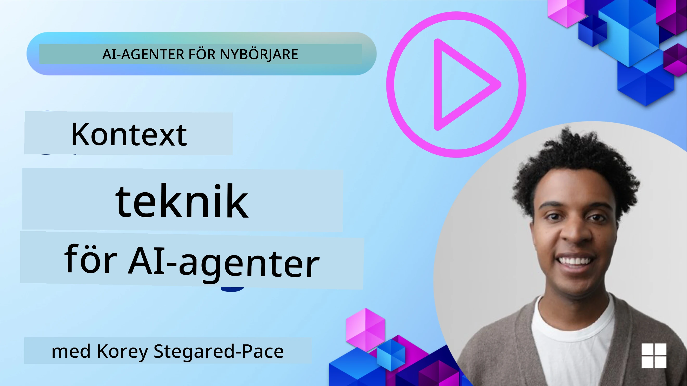
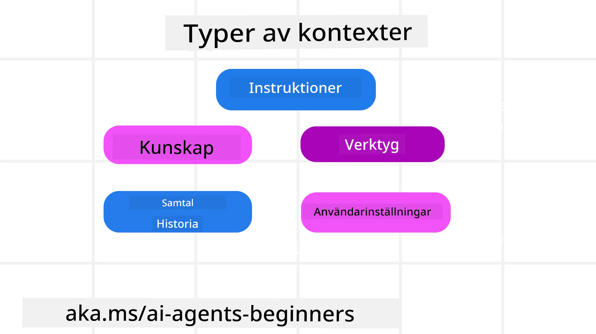
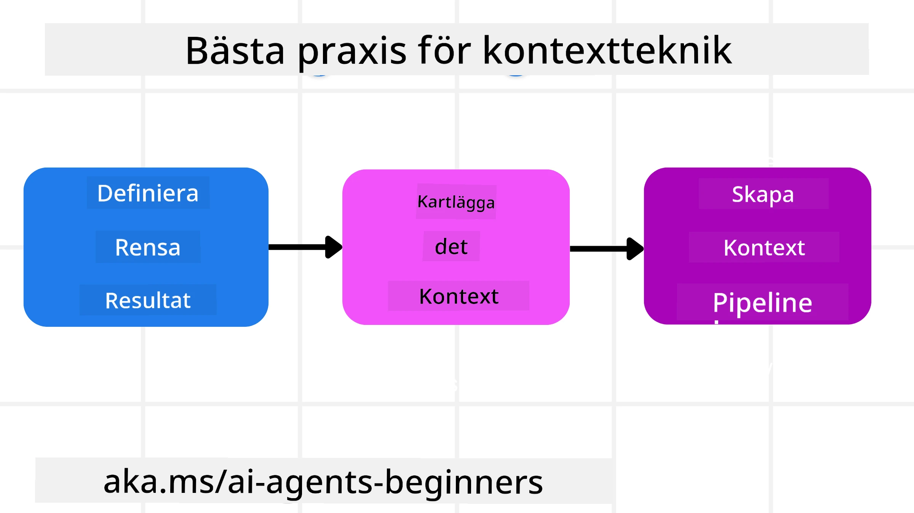

# Context Engineering för AI-agenter

> _(Klicka på bilden ovan för att se videon för denna lektion)_

Att förstå komplexiteten i applikationen du bygger en AI-agent för är viktigt för att skapa en pålitlig sådan. Vi behöver bygga AI-agenter som effektivt hanterar information för att möta komplexa behov bortom prompt engineering.

I denna lektion kommer vi att titta på vad context engineering är och dess roll i att bygga AI-agenter.

## Introduktion

Denna lektion kommer att täcka:

• **Vad Context Engineering är** och varför det skiljer sig från prompt engineering.

• **Strategier för effektiv Context Engineering**, inklusive hur man skriver, väljer, komprimerar och isolerar information.

• **Vanliga kontextfel** som kan spåra ur din AI-agent och hur man åtgärdar dem.

## Lärandemål

Efter att ha slutfört denna lektion kommer du att förstå hur man:

• **Definierar context engineering** och skiljer det från prompt engineering.

• **Identifierar de viktigaste komponenterna i kontext** i Large Language Model (LLM)-applikationer.

• **Tillämpa strategier för att skriva, välja, komprimera och isolera kontext** för att förbättra agentens prestanda.

• **Känna igen vanliga kontextfel** som förgiftning, distraktion, förvirring och konflikt, samt implementera åtgärder för att mildra dem.

## Vad är Context Engineering?

För AI-agenter är kontext det som driver planeringen för en AI-agent att utföra vissa åtgärder. Context Engineering är praktiken att se till att AI-agenten har rätt information för att slutföra nästa steg i uppgiften. Kontextfönstret är begränsat i storlek, så som agentbyggare behöver vi skapa system och processer för att hantera tillägg, borttagning och kondensering av informationen i kontextfönstret.

### Prompt Engineering vs Context Engineering

Prompt engineering fokuserar på en enda uppsättning statiska instruktioner för att effektivt vägleda AI-agenter med en uppsättning regler. Context engineering handlar om hur man hanterar en dynamisk informationsmängd, inklusive initial prompt, för att säkerställa att AI-agenten har vad den behöver över tid. Huvudidén med context engineering är att göra denna process upprepningsbar och pålitlig.

### Typer av Kontext

Det är viktigt att komma ihåg att kontext inte bara är en sak. Informationen som AI-agenten behöver kan komma från flera olika källor och det är upp till oss att säkerställa att agenten har tillgång till dessa källor:

De typer av kontext som en AI-agent kan behöva hantera inkluderar:

• **Instruktioner:** Dessa är som agentens "regler" – prompts, systemmeddelanden, få-shot-exempel (som visar AI hur man gör något) och beskrivningar av verktyg den kan använda. Här kombineras fokus från prompt engineering med context engineering.

• **Kunskap:** Detta täcker fakta, information hämtad från databaser eller långsiktiga minnen som agenten har samlat på sig. Detta inkluderar att integrera ett Retrieval Augmented Generation (RAG)-system om en agent behöver tillgång till olika kunskapslager och databaser.

• **Verktyg:** Dessa är definitioner av externa funktioner, API:er och MCP-servrar som agenten kan anropa, tillsammans med feedback (resultat) den får från att använda dem.

• **Konversationshistorik:** Den pågående dialogen med en användare. Med tiden blir dessa konversationer längre och mer komplexa, vilket innebär att de tar utrymme i kontextfönstret.

• **Användarpreferenser:** Information som lärts in om en användares gillanden eller ogillanden över tid. Dessa kan lagras och användas när viktiga beslut ska fattas för att hjälpa användaren.

## Strategier för Effektiv Context Engineering

### Planeringsstrategier

Bra context engineering börjar med bra planering. Här är en metod som hjälper dig att börja tänka på hur du kan tillämpa konceptet context engineering:

1. **Definiera Tydliga Resultat** - Resultaten av de uppgifter som AI-agenter kommer att tilldelas bör vara klart definierade. Svara på frågan – "Hur kommer världen att se ut när AI-agenten är klar med sin uppgift?" Med andra ord, vilken förändring, information eller respons bör användaren ha efter att ha interagerat med AI-agenten.
2. **Kartlägg Kontexten** – När du har definierat AI-agentens resultat behöver du svara på frågan "Vilken information behöver AI-agenten för att slutföra denna uppgift?". På så sätt kan du börja kartlägga var den informationen kan finnas.
3. **Skapa Kontextpipelines** – Nu när du vet var informationen finns måste du svara på frågan "Hur kommer agenten att få denna information?". Detta kan göras på olika sätt, inklusive RAG, användning av MCP-servrar och andra verktyg.

### Praktiska Strategier

Planering är viktigt, men när informationen börjar flöda in i agentens kontextfönster behöver vi ha praktiska strategier för att hantera den:

#### Hantera Kontext

Medan viss information automatiskt läggs till i kontextfönstret, handlar context engineering om att ta en mer aktiv roll i denna information, vilket kan göras med några strategier:

 1. **Agentens Anteckningsblock**
 Detta möjliggör för en AI-agent att ta anteckningar om relevant information om aktuella uppgifter och användarinteraktioner under en enskild session. Detta bör finnas utanför kontextfönstret i en fil eller runtime-objekt som agenten senare kan hämta under denna session vid behov.

 2. **Minnen**
 Anteckningsblock är bra för att hantera information utanför kontextfönstret för en enskild session. Minnen gör det möjligt för agenter att lagra och hämta relevant information över flera sessioner. Detta kan inkludera sammanfattningar, användarpreferenser och feedback för förbättringar i framtiden.

 3. **Komprimera Kontext**
  När kontextfönstret växer och närmar sig sin gräns kan tekniker som sammanfattning och trimning användas. Detta inkluderar att antingen behålla endast den mest relevanta informationen eller ta bort äldre meddelanden.
  
 4. **Multi-Agent System**
  Att utveckla multi-agent-system är en form av context engineering eftersom varje agent har sitt eget kontextfönster. Hur den kontexten delas och skickas till olika agenter är något annat att planera när man bygger dessa system.
  
 5. **Sandlådemiljöer**
  Om en agent behöver köra kod eller bearbeta stora mängder information i ett dokument kan detta ta många tokens att bearbeta resultaten. Istället för att ha allt detta lagrat i kontextfönstret kan agenten använda en sandlådemiljö som kan köra koden och bara läsa resultat och annan relevant information.
  
 6. **Runtime State-objekt**
   Detta sker genom att skapa informationsbehållare för att hantera situationer när agenten behöver ha tillgång till viss information. För en komplex uppgift möjliggör detta för agenten att lagra resultatet av varje deluppgift steg för steg, vilket låter kontexten förbli kopplad bara till den specifika deluppgiften.

#### Inspektera Kontext

Efter att du tillämpat en av dessa strategier är det värt att kontrollera vad nästa modellanrop faktiskt mottog. En användbar felsökningsfråga är:

> Lade agenten in för mycket kontext, fel kontext eller saknades kontext som behövdes?

Du behöver inte logga råa prompts, verktygsutdata eller minnesinnehåll för att svara på den frågan. I produktion, föredra små kontextinspektionsposter som fångar antal, id:n, hashvärden och policymärkning:

- **Urval:** Spåra hur många kandidatdelar, verktyg eller minnen som övervägdes, hur många som valdes och vilken regel eller poäng som orsakade att de andra filtrerades bort.
- **Komprimering:** Registrera källintervallet eller spårnings-id, sammanfattnings-id, en uppskattad tokenräkning före och efter komprimering samt om råinnehållet exkluderades från nästa anrop.
- **Isolation:** Notera vilken deluppgift som kördes i en separat agent, session eller sandbox, vilken avgränsad sammanfattning som återlämnades och om stor verktygsutdata hölls utanför huvudagentens kontext.
- **Minne och RAG:** Spara hämtade dokument-id:n, minnes-id:n, poäng, valda id:n och redigeringsstatus istället för fullständig hämtad text.
- **Säkerhet och sekretess:** Föredra hashvärden, id:n, tokenhinkar och policymärkningar framför känsliga prompttexter, verktygargument, verktygsresultat eller användarminnesinnehåll.

Målet är inte att behålla mer kontext. Det är att lämna tillräckliga bevis så att en utvecklare kan avgöra vilken kontextstrategi som kördes och om den förändrade nästa modellanrop på avsett sätt.

### Exempel på Context Engineering

Låt oss säga att vi vill att en AI-agent ska **"Boka en resa till Paris åt mig."**

• En enkel agent som bara använder prompt engineering skulle kanske bara svara: **"Okej, när vill du åka till Paris?**" Den behandlade bara din direkta fråga vid den tidpunkt då användaren frågade.

• En agent som använder de context engineering-strategier som täckts här skulle göra mycket mer. Innan den ens svarar kan dess system:

  ◦ **Kontrollera din kalender** för tillgängliga datum (hämta realtidsdata).

 ◦ **Minnas tidigare resepreferenser** (från långtidsminnet) som ditt föredragna flygbolag, budget eller om du föredrar direktflyg.

 ◦ **Identifiera tillgängliga verktyg** för flyg- och hotellbokning.

- Sedan kan ett exempel på svar vara:  "Hej [Ditt Namn]! Jag ser att du är ledig den första veckan i oktober. Ska jag leta efter direktflyg till Paris med [Föredraget Flygbolag] inom din vanliga budget på [Budget]?" Detta rikare, kontextmedvetna svar visar kraften i context engineering.

## Vanliga kontextfel

### Kontextförgiftning

**Vad det är:** När en hallucination (falsk information som genereras av LLM) eller ett fel kommer in i kontexten och refereras till upprepade gånger, vilket får agenten att driva mot omöjliga mål eller utveckla nonsensstrategier.

**Vad man ska göra:** Implementera **kontextvalidering** och **karantän**. Validera information innan den läggs till i långtidsminnet. Om potentiell förgiftning upptäcks, starta nya kontexttrådar för att förhindra att felaktig information sprids.

**Exempel på resebokning:** Din agent hallucinera ett **direktflyg från en liten lokal flygplats till en avlägsen internationell stad** som egentligen inte erbjuder internationella flyg. Denna icke-existerande flygdetalj sparas i kontexten. Senare, när du ber agenten boka, fortsätter den försöka hitta biljetter för denna omöjliga rutt, vilket leder till upprepade fel.

**Lösning:** Genomför ett steg som **validerar flygets existens och rutter med ett realtids-API** _innan_ flygdetaljen läggs till i agentens arbetskontext. Om valideringen misslyckas, "karantän" läggs felaktig information och den används inte vidare.

### Kontextdistraktion

**Vad det är:** När kontexten blir så stor att modellen fokuserar för mycket på den ackumulerade historiken istället för vad den lärde sig under träningen, vilket leder till repetitiva eller ohelpiga handlingar. Modeller kan börja göra misstag innan kontextfönstret är fullt.

**Vad man ska göra:** Använd **kontextsammanslagning**. Komprimera regelbundet ackumulerad information till kortare sammanfattningar, behåll viktiga detaljer samtidigt som överflödig historik tas bort. Detta hjälper till att "nollställa" fokus.

**Exempel på resebokning:** Du har pratat om olika drömresmål länge, inklusive en detaljerad återberättelse av din backpackingresa för två år sedan. När du slutligen ber agenten att **"hitta en billig flygning för nästa månad"** blir agenten fast i gamla, irrelevanta detaljer och fortsätter fråga om din backpackingutrustning eller tidigare resplaner och försummar din nuvarande förfrågan.

**Lösning:** Efter ett visst antal samtal eller när kontexten blir för stor bör agenten **sammanfatta de senaste och mest relevanta delarna av konversationen** – med fokus på dina nuvarande rese-datum och destination – och använda denna kondenserade sammanfattning för nästa LLM-anrop, samtidigt som mindre relevanta chattdelar slängs.

### Kontextförvirring

**Vad det är:** När onödig kontext, ofta i form av för många tillgängliga verktyg, får modellen att generera dåliga svar eller anropa irrelevanta verktyg. Mindre modeller är särskilt utsatta för detta.

**Vad man ska göra:** Implementera **verktygsladdningshantering** med hjälp av RAG-tekniker. Lagra verktygsbeskrivningar i en vektordatabas och välj _endast_ de mest relevanta verktygen för varje specifik uppgift. Forskning visar att begränsa verktygsval till färre än 30 är bäst.

**Exempel på resebokning:** Din agent har tillgång till dussintals verktyg: `book_flight`, `book_hotel`, `rent_car`, `find_tours`, `currency_converter`, `weather_forecast`, `restaurant_reservations` etc. Du frågar, **"Vad är det bästa sättet att ta sig runt i Paris?"** På grund av det stora antalet verktyg blir agenten förvirrad och försöker anropa `book_flight` _inom_ Paris, eller `rent_car` trots att du föredrar kollektivtrafik, eftersom verktygsbeskrivningarna kan överlappa eller för att den helt enkelt inte kan avgöra vilket som är bäst.

**Lösning:** Använd **RAG över verktygsbeskrivningar**. När du frågar om hur man tar sig runt i Paris hämtar systemet dynamiskt _endast_ de mest relevanta verktygen som `rent_car` eller `public_transport_info` baserat på din fråga och presenterar en fokuserad verktygs-"loadout" till LLM.

### Kontekstkonflikt

**Vad det är:** När motsägelsefull information finns inom kontexten, vilket leder till inkonsekvent resonemang eller dåliga slutliga svar. Detta händer ofta när information anländer i etapper och tidiga, felaktiga antaganden finns kvar i kontexten.

**Vad man ska göra:** Använd **kontextbeskärning** och **avlastning**. Beskärning innebär att ta bort föråldrad eller motsägelsefull information när nya detaljer anländer. Avlastning ger modellen ett separat "anteckningsblock" där den kan bearbeta information utan att störa huvudkontexten.
**Exempel på resebokning:** Du berättar först för din agent, **"Jag vill flyga ekonomiklass."** Senare i samtalet ändrar du dig och säger, **"Egentligen, för den här resan, låt oss åka business class."** Om båda instruktionerna finns kvar i sammanhanget kan agenten få motstridiga sökresultat eller bli förvirrad om vilken preferens som ska prioriteras.

**Lösning:** Implementera **sammanhangsbeskärning**. När en ny instruktion motsäger en gammal tas den äldre instruktionen bort eller överskrivs uttryckligen i sammanhanget. Alternativt kan agenten använda en **skissblock** för att förena motstridiga preferenser innan beslut fattas, vilket säkerställer att endast den slutgiltiga, konsekventa instruktionen styr dess åtgärder.

## Fler frågor om kontextteknik?

Gå med i [Microsoft Foundry Discord](https://aka.ms/ai-agents/discord) för att träffa andra elever, delta i rådgivningstimmar och få svar på dina frågor om AI-agenter.

---

<!-- CO-OP TRANSLATOR DISCLAIMER START -->
**Ansvarsfriskrivning**:
Detta dokument har översatts med hjälp av AI-översättningstjänsten [Co-op Translator](https://github.com/Azure/co-op-translator). Även om vi strävar efter noggrannhet, var vänlig notera att automatiska översättningar kan innehålla fel eller brister. Det ursprungliga dokumentet på dess modersmål bör betraktas som den auktoritativa källan. För kritisk information rekommenderas professionell mänsklig översättning. Vi ansvarar inte för några missförstånd eller feltolkningar som uppstår till följd av användningen av denna översättning.
<!-- CO-OP TRANSLATOR DISCLAIMER END -->