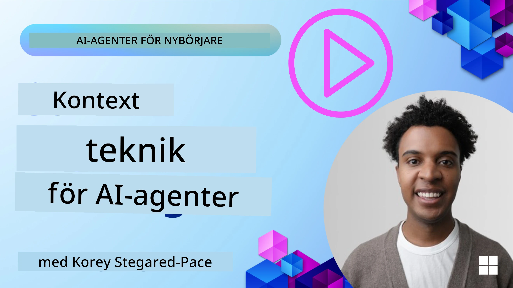
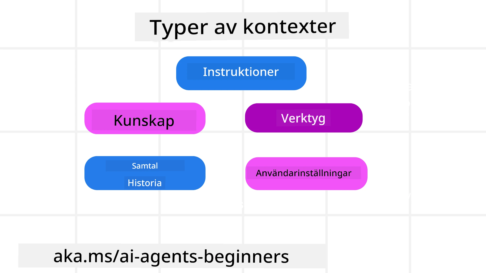
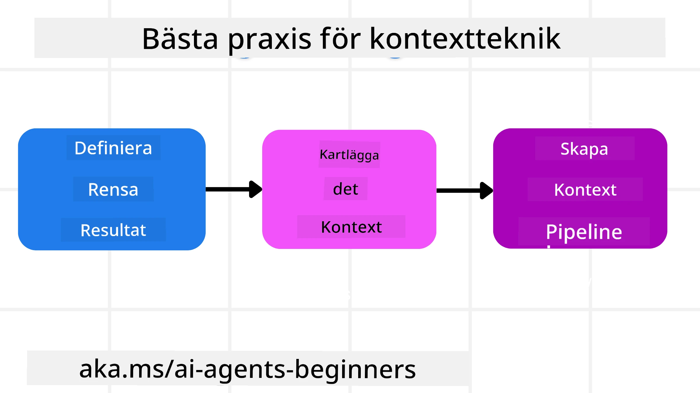

# Kontextteknik för AI-agenter

> _(Klicka på bilden ovan för att se videon för denna lektion)_

Att förstå komplexiteten i applikationen du bygger en AI-agent för är viktigt för att skapa en pålitlig sådan. Vi behöver bygga AI-agenter som effektivt hanterar information för att tillgodose komplexa behov bortom promptteknik.

I denna lektion ska vi titta på vad kontextteknik är och dess roll i att bygga AI-agenter.

## Introduktion

Denna lektion täcker:

• **Vad kontextteknik är** och varför det skiljer sig från promptteknik.

• **Strategier för effektiv kontextteknik**, inklusive hur man skriver, väljer ut, komprimerar och isolerar information.

• **Vanliga kontextmisslyckanden** som kan spåra ur din AI-agent och hur man åtgärdar dem.

## Lärandemål

Efter att ha slutfört denna lektion kommer du att förstå hur du:

• **Definierar kontextteknik** och skiljer det från promptteknik.

• **Identifierar de viktigaste komponenterna av kontext** i applikationer med stora språkmodeller (LLM).

• **Tillämpa strategier för att skriva, välja, komprimera och isolera kontext** för att förbättra agentens prestanda.

• **Känner igen vanliga kontextmisslyckanden** såsom förgiftning, distraktion, förvirring och krock, och implementerar åtgärder.

## Vad är Kontextteknik?

För AI-agenter är kontext det som driver planeringen för att AI-agenten ska vidta vissa åtgärder. Kontextteknik är praxis att säkerställa att AI-agenten har rätt information för att slutföra nästa steg i uppgiften. Kontextfönstret är begränsat i storlek, så som agentbyggare måste vi skapa system och processer för att hantera tillägg, borttagning och kondensering av information i kontextfönstret.

### Promptteknik vs Kontextteknik

Promptteknik fokuserar på ett enda statiskt instruktsats för att effektivt vägleda AI-agenter med ett regelsystem. Kontextteknik handlar om hur man hanterar en dynamisk informationsmängd, inklusive den initiala prompten, för att säkerställa att AI-agenten har det den behöver över tid. Huvudidén kring kontextteknik är att göra denna process upprepningsbar och pålitlig.

### Typer av Kontext

Det är viktigt att komma ihåg att kontext inte bara är en sak. Informationen som AI-agenten behöver kan komma från en mängd olika källor och det är upp till oss att säkerställa att agenten har tillgång till dessa källor:

De typer av kontext som en AI-agent kan behöva hantera inkluderar:

• **Instruktioner:** Dessa är som agentens "regler" – prompts, systemmeddelanden, få-skott-exempel (som visar AI hur man gör något), och beskrivningar av verktyg som den kan använda. Här kombineras fokus i promptteknik med kontextteknik.

• **Kunskap:** Detta täcker fakta, information som hämtats från databaser eller långtidsminnen som agenten har samlat. Detta inkluderar att integrera ett Retrieval Augmented Generation (RAG) system om agenten behöver tillgång till olika kunskapsförråd och databaser.

• **Verktyg:** Dessa är definitioner av externa funktioner, API:er och MCP-servrar som agenten kan anropa, tillsammans med feedback (resultat) som den får från att använda dem.

• **Samtalshistorik:** Den pågående dialogen med en användare. Med tiden blir dessa samtal längre och mer komplexa, vilket tar plats i kontextfönstret.

• **Användarpreferenser:** Information som lärs in om en användares tycken och ogillanden över tid. Dessa kan lagras och användas vid viktiga beslut för att hjälpa användaren.

## Strategier för Effektiv Kontextteknik

### Planeringsstrategier

Bra kontextteknik börjar med god planering. Här är ett tillvägagångssätt som hjälper dig att börja fundera på hur man tillämpar konceptet kontextteknik:

1. **Definiera Klara Resultat** - Resultaten av de uppgifter som AI-agenter ska tilldelas bör vara tydligt definierade. Besvara frågan – "Hur kommer världen att se ut när AI-agenten har slutfört sin uppgift?" Med andra ord, vilken förändring, information eller svar bör användaren ha efter att ha interagerat med AI-agenten.
2. **Kartlägg Kontexten** - När du har definierat resultatet av AI-agenten behöver du besvara frågan "Vilken information behöver AI-agenten för att kunna slutföra denna uppgift?". På så sätt kan du börja kartlägga var informationen finns.
3. **Skapa Kontextpipelines** - Nu när du vet var informationen finns behöver du svara på frågan "Hur kommer agenten att få denna information?". Detta kan göras på olika sätt inklusive RAG, användning av MCP-servrar och andra verktyg.

### Praktiska Strategier

Planering är viktigt, men när informationen börjar strömma in i agentens kontextfönster behöver vi praktiska strategier för att hantera den:

#### Hantera Kontext

Medan viss information läggs till i kontextfönstret automatiskt, handlar kontextteknik om att ta en mer aktiv roll i denna information, vilket kan göras med några strategier:

 1. **Agentens Skrivblock**
 Detta tillåter en AI-agent att anteckna relevant information om nuvarande uppgifter och användarinteraktioner under en enskild session. Detta ska existera utanför kontextfönstret i en fil eller ett runtime-objekt som agenten senare kan hämta under denna session vid behov.

 2. **Minnen**
 Skrivblock är bra för att hantera information utanför kontextfönstret för en enskild session. Minnen möjliggör för agenter att lagra och hämta relevant information över flera sessioner. Detta kan inkludera sammanfattningar, användarpreferenser och feedback för förbättringar i framtiden.

 3. **Komprimering av Kontext**
 När kontextfönstret växer och närmar sig sin gräns kan tekniker som sammanfattning och beskärning användas. Detta innefattar antingen att behålla endast den mest relevanta informationen eller ta bort äldre meddelanden.
  
 4. **Multi-Agent System**
 Att utveckla multi-agent system är en form av kontextteknik eftersom varje agent har sitt eget kontextfönster. Hur kontexten delas och överförs till olika agenter är något som måste planeras när man bygger dessa system.
  
 5. **Sandlådemiljöer**
 Om en agent behöver köra någon kod eller bearbeta stora mängder information i ett dokument kan detta ta många tokens att bearbeta resultaten. Istället för att ha all denna information lagrad i kontextfönstret kan agenten använda en sandlådemiljö som kan köra denna kod och endast läsa resultaten och annan relevant information.
  
 6. **Runtime State-objekt**
   Detta görs genom att skapa informationsbehållare för att hantera situationer när agenten behöver ha tillgång till viss information. För en komplex uppgift möjliggör detta att en agent kan lagra resultaten från varje undermoment steg för steg, vilket gör att kontexten förblir kopplad endast till det specifika undermomentet.

#### Inspektera Kontext

Efter att du tillämpar en av dessa strategier är det värt att kontrollera vad nästa modellanrop faktiskt fick. En användbar felsökningsfråga är:

> Laddade agenten för mycket kontext, fel kontext, eller saknade den kontext som behövdes?

Du behöver inte logga råa prompts, verktygsutgångar eller minnesinnehåll för att besvara den frågan. I produktion bör du föredra små kontextinspektionsposter som fångar antal, id:n, hashvärden och policymärkningar:

- **Urval:** Följ hur många kandidatbitar, verktyg eller minnen som övervägdes, hur många som valdes, och vilken regel eller poäng som gjorde att övriga filtrerades bort.
- **Komprimering:** Registrera källans räckvidd eller spårnings-id, sammanfattnings-id, en uppskattad tokenräkning före och efter komprimering, samt om råinnehållet uteslöts från nästa anrop.
- **Isolering:** Notera vilken undermoment som kördes i en separat agent, session eller sandlåda, vilken begränsad sammanfattning som återlämnades och om stora verktygsutgångar hölls utanför föräldraagentens kontext.
- **Minne och RAG:** Spara id:n för hämtade dokument, minnes-id:n, poäng, valda id:n och status för censur i stället för fullständig hämtad text.
- **Säkerhet och integritet:** Föredra hash, id, tokenhinkar och policymärkningar framför känslig prompttext, verktygsargument, verktygsresultat eller användarens minnesinnehåll.

Målet är inte att behålla mer kontext. Det är att lämna tillräckligt med bevis för att en utvecklare ska kunna säga vilken kontextstrategi som användes och om den förändrade nästa modellanrop på avsedd sätt.

### Exempel på Kontextteknik

Låt oss säga att vi vill att en AI-agent ska **"Boka en resa till Paris åt mig."**

• En enkel agent som bara använder promptteknik kanske bara svarar: **"Okej, när skulle du vilja åka till Paris?**". Den bearbetade bara din direkta fråga vid tillfället du ställde den.

• En agent som använder kontextteknikstrategierna ovan skulle göra mycket mer. Innan den ens svarar kan dess system:

  ◦ **Kontrollera din kalender** för tillgängliga datum (hämta realtidsdata).

 ◦ **Återkalla tidigare resepreferenser** (från långtidsminnet) som ditt föredragna flygbolag, budget, eller om du föredrar direktflyg.

 ◦ **Identifiera tillgängliga verktyg** för bokning av flyg och hotell.

- Ett exempel på svar kan vara:  "Hej [Ditt Namn]! Jag ser att du är ledig första veckan i oktober. Ska jag leta efter direktflyg till Paris med [Föredraget Flygbolag] inom din vanliga budget på [Budget]?". Detta rikare, kontextmedvetna svar visar kraften i kontextteknik.

## Vanliga Kontextmisslyckanden

### Kontextförgiftning

**Vad det är:** När en hallucination (falsk information genererad av LLM) eller ett fel hamnar i kontexten och refereras till upprepade gånger, vilket gör att agenten jagar omöjliga mål eller utvecklar nonsensstrategier.

**Vad man gör:** Implementera **kontextvalidering** och **karantän**. Validera information innan den läggs till i långtidsminnet. Om potentiell förgiftning upptäcks, börja nya kontexttrådar för att förhindra att den dåliga informationen sprids.

**Exempel på resebokning:** Din agent hallucinerar en **direktflygning från en liten lokal flygplats till en avlägsen internationell stad** som egentligen inte erbjuder internationella flyg. Denna icke-existerande flygdetalj sparas i kontexten. Senare, när du ber agenten boka, fortsätter den att leta biljetter för denna omöjliga rutt, vilket leder till upprepade fel.

**Lösning:** Implementera ett steg som **validerar flygets existens och rutter med ett realtids-API** _innan_ flygdetaljen läggs till i agentens arbetskontext. Om valideringen misslyckas placeras den felaktiga informationen i "karantän" och används inte vidare.

### Kontextdistraktion

**Vad det är:** När kontexten blir så stor att modellen fokuserar för mycket på den ackumulerade historiken istället för på det den lärde sig under träningen, vilket leder till repetitiva eller onödiga handlingar. Modeller kan börja göra misstag även innan kontextfönstret är fullt.

**Vad man gör:** Använd **kontextsammansättning**. Komprimera periodiskt ackumulerad information till kortare sammanfattningar, behåll viktiga detaljer och ta bort överflödig historik. Detta hjälper till att "nollställa" fokus.

**Exempel på resebokning:** Du har diskuterat olika drömresmål under lång tid, inklusive en detaljerad återgivning av din backpackingresa för två år sedan. När du slutligen ber om att **"hitta en billig flygresa för nästa månad"**, är agenten fast i gamla, irrelevanta detaljer och fortsätter fråga om din backpackingutrustning eller gamla resplaner, men bortser från din nuvarande förfrågan.

**Lösning:** Efter ett visst antal turer eller när kontexten blir för stor bör agenten **sammanfatta de mest aktuella och relevanta delarna av konversationen** – med fokus på dina nuvarande resdatum och destination – och använda den kondenserade sammanfattningen för nästa LLM-anrop, samtidigt som den mindre relevanta historiken kastas bort.

### Kontextförvirring

**Vad det är:** När onödig kontext, ofta i form av för många tillgängliga verktyg, får modellen att generera dåliga svar eller anropa irrelevanta verktyg. Mindre modeller är särskilt känsliga för detta.

**Vad man gör:** Implementera **verktygslastningshantering** med hjälp av RAG-tekniker. Spara verktygsbeskrivningar i en vektordatabas och välj _endast_ de mest relevanta verktygen för varje specifik uppgift. Forskning visar att begränsa verktygsval till färre än 30.

**Exempel på resebokning:** Din agent har tillgång till dussintals verktyg: `book_flight`, `book_hotel`, `rent_car`, `find_tours`, `currency_converter`, `weather_forecast`, `restaurant_reservations` etc. Du frågar, **"Vad är det bästa sättet att ta sig runt i Paris?"** På grund av det stora antalet verktyg blir agenten förvirrad och försöker anropa `book_flight` _inom_ Paris, eller `rent_car` trots att du föredrar kollektivtrafik, eftersom verktygsbeskrivningarna kan överlappa eller för att den helt enkelt inte kan avgöra vilket som är bäst.

**Lösning:** Använd **RAG över verktygsbeskrivningar**. När du frågar om hur man tar sig runt i Paris hämtar systemet dynamiskt _bara_ de mest relevanta verktygen som `rent_car` eller `public_transport_info` baserat på din fråga, och presenterar en fokuserad "last" av verktyg till LLM.

### Kontextkrock

**Vad det är:** När motstridig information finns i kontexten, vilket leder till inkonsekvent resonemang eller dåliga slutgiltiga svar. Detta händer ofta när information anländer i etapper och tidiga, felaktiga antaganden finns kvar i kontexten.

**Vad man gör:** Använd **kontextbeskärning** och **avlastning**. Beskärning innebär att ta bort föråldrad eller motsägelsefull information när nya detaljer anländer. Avlastning ger modellen en separat "skrivbordsyta" för att bearbeta information utan att skräpa ner i huvudkontexten.
**Resebokningsexempel:** Du säger först till din agent, **"Jag vill flyga ekonomiklass."** Senare i konversationen ändrar du dig och säger, **"Egentligen, för den här resan, låt oss åka business class."** Om båda instruktionerna finns kvar i kontexten kan agenten få motstridiga sökresultat eller bli förvirrad om vilken preferens som ska prioriteras.

**Lösning:** Implementera **kontextbeskärning**. När en ny instruktion motsäger en äldre tas den äldre instruktionen bort eller skrivs tydligt över i kontexten. Alternativt kan agenten använda en **anteckningsyta** för att förena motstridiga preferenser innan beslut fattas, så att endast den slutliga, konsekventa instruktionen styr dess handlingar.

## Har du fler frågor om kontextteknik?

Gå med i [Microsoft Foundry Discord](https://discord.com/invite/ATgtXmAS5D) för att träffa andra lärande, delta i kontorstid och få svar på dina frågor om AI-agenter.

---

<!-- CO-OP TRANSLATOR DISCLAIMER START -->
**Ansvarsfriskrivning**:
Detta dokument har översatts med hjälp av AI-översättningstjänsten [Co-op Translator](https://github.com/Azure/co-op-translator). Även om vi strävar efter noggrannhet, var vänlig notera att automatiska översättningar kan innehålla fel eller brister. Det ursprungliga dokumentet på dess modersmål bör betraktas som den auktoritativa källan. För kritisk information rekommenderas professionell mänsklig översättning. Vi ansvarar inte för några missförstånd eller feltolkningar som uppstår till följd av användningen av denna översättning.
<!-- CO-OP TRANSLATOR DISCLAIMER END -->