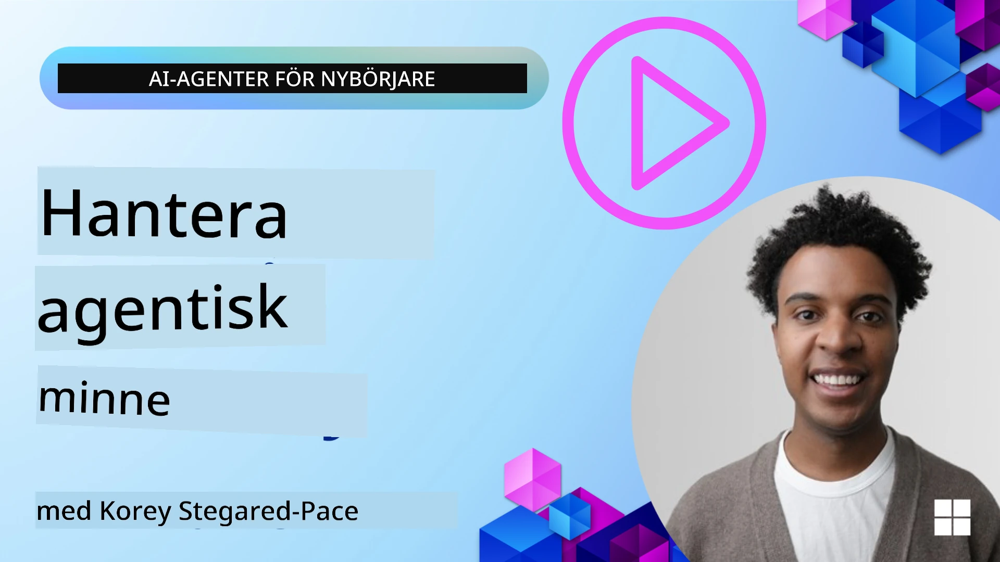

# Minne för AI‑agenter 

När man diskuterar de unika fördelarna med att skapa AI‑agenter diskuteras främst två saker: förmågan att anropa verktyg för att slutföra uppgifter och förmågan att förbättras över tid. Minne ligger i grunden för att skapa självförbättrande agenter som kan skapa bättre upplevelser för våra användare.

I den här lektionen kommer vi att titta på vad minne är för AI‑agenter och hur vi kan hantera det och använda det till fördel för våra applikationer.

## Introduktion

Den här lektionen tar upp:

• **Förstå AI‑agenters minne**: Vad minne är och varför det är viktigt för agenter.

• **Implementera och lagra minne**: Praktiska metoder för att lägga till minneskapacitet till dina AI‑agenter, med fokus på korttids- och långtidsminne.

• **Göra AI‑agenter självförbättrande**: Hur minne möjliggör att agenter lär sig från tidigare interaktioner och förbättras över tid.

## Tillgängliga implementationer

Den här lektionen innehåller två omfattande notebook‑handledningar:

• **[13-agent-memory.ipynb](./13-agent-memory.ipynb)**: Implementerar minne med Mem0 och Azure AI Search med Microsoft Agent Framework

• **[13-agent-memory-cognee.ipynb](./13-agent-memory-cognee.ipynb)**: Implementerar strukturerat minne med Cognee, bygger automatiskt en kunskapsgraf baserad på embeddings, visualiserar grafen och intelligent hämtning

## Lärandemål

Efter att ha slutfört den här lektionen kommer du att veta hur du:

• **Ska särskilja mellan olika typer av AI‑agentminne**, inklusive arbetsminne, korttidsminne och långtidsminne, såväl som specialiserade former som persona‑ och episodminne.

• **Implementerar och hanterar korttids‑ och långtidsminne för AI‑agenter** med Microsoft Agent Framework, genom att använda verktyg som Mem0, Cognee, Whiteboard‑minne och integrera med Azure AI Search.

• **Förstår principerna bakom självförbättrande AI‑agenter** och hur robusta system för minneshantering bidrar till kontinuerligt lärande och anpassning.

## Förstå AI‑agenters minne

I grunden syftar **minne för AI‑agenter på de mekanismer som gör att de kan behålla och återkalla information**. Denna information kan vara specifika detaljer om en konversation, användarpreferenser, tidigare handlingar eller till och med inlärda mönster.

Utan minne är AI‑applikationer ofta statslösa, vilket innebär att varje interaktion börjar från början. Detta leder till en repetitiv och frustrerande användarupplevelse där agenten "glömmer" tidigare kontext eller preferenser.

### Varför är minne viktigt?

en agents intelligens är djupt kopplad till dess förmåga att återkalla och använda tidigare information. Minne gör att agenter kan vara:

• **Reflekterande**: Lära sig av tidigare handlingar och resultat.

• **Interaktiva**: Behålla kontext över en pågående konversation.

• **Proaktiva och reaktiva**: Förutse behov eller svara lämpligt baserat på historiska data.

• **Autonoma**: Fungere mer självständigt genom att dra nytta av lagrad kunskap.

Målet med att implementera minne är att göra agenter mer **pålitägna och kapabla**.

### Typer av minne

#### Arbetsminne

Tänk på detta som ett kladdpapper en agent använder under en enskild, pågående uppgift eller tankeprocess. Det håller omedelbar information som behövs för att beräkna nästa steg.

För AI‑agenter fångar arbetsminnet ofta den mest relevanta informationen från en konversation, även om hela chattloggen är lång eller trunkerad. Det fokuserar på att extrahera nyckelelement som krav, förslag, beslut och handlingar.

**Exempel på arbetsminne**

I en resebokningsagent kan arbetsminnet fånga användarens aktuella önskemål, till exempel "Jag vill boka en resa till Paris". Detta specifika krav hålls i agentens omedelbara kontext för att styra den nuvarande interaktionen.

#### Korttidsminne

Denna typ av minne bevarar information under en enskild konversation eller session. Det är kontexten för den aktuella chatten, vilket gör att agenten kan hänvisa tillbaka till tidigare turer i dialogen.

**Exempel på korttidsminne**

Om en användare frågar, "Hur mycket skulle en flygning till Paris kosta?" och sedan följer upp med "Vad sägs om boende där?", ser korttidsminnet till att agenten vet att "där" avser "Paris" inom samma konversation.

#### Långtidsminne

Detta är information som kvarstår över flera konversationer eller sessioner. Det gör att agenter kan komma ihåg användarpreferenser, historiska interaktioner eller generell kunskap över längre tidsperioder. Detta är viktigt för personalisering.

**Exempel på långtidsminne**

Ett långtidsminne kan lagra att "Ben tycker om skidåkning och utomhusaktiviteter, gillar kaffe med utsikt över bergen, och vill undvika avancerade skidbackar på grund av en tidigare skada". Denna information, inlärd från tidigare interaktioner, påverkar rekommendationer i framtida reseplaneringssessioner och gör dem mycket personliga.

#### Personaminne

Denna specialiserade minnestyp hjälper en agent att utveckla en konsekvent "personlighet" eller "persona". Det gör att agenten kan komma ihåg detaljer om sig själv eller sin avsedda roll, vilket gör interaktioner mer flytande och fokuserade.

**Exempel på personaminne**
Om reseagenten är designad för att vara en "expert på skidplanering" kan personaminnet förstärka denna roll och påverka dess svar så att de stämmer överens med en experts ton och kunskap.

#### Arbetsflöde/Episodiskt minne

Detta minne lagrar sekvensen av steg en agent tar under en komplex uppgift, inklusive framgångar och misslyckanden. Det är som att minnas specifika "episoder" eller tidigare erfarenheter för att lära sig av dem.

**Exempel på episodiskt minne**

Om agenten försökte boka ett specifikt flyg men det misslyckades på grund av bristande tillgänglighet, kan episodiskt minne registrera detta misslyckande, vilket gör att agenten kan försöka alternativa flyg eller informera användaren om problemet på ett mer informerat sätt vid ett senare tillfälle.

#### Entitetsminne

Detta innebär att extrahera och komma ihåg specifika entiteter (som personer, platser eller saker) och händelser från konversationer. Det gör att agenten kan bygga en strukturerad förståelse av nyckelelement som diskuterats.

**Exempel på entitetsminne**

Från en konversation om en tidigare resa kan agenten extrahera "Paris", "Eiffeltornet" och "middag på Le Chat Noir‑restaurangen" som entiteter. Vid en framtida interaktion kan agenten komma ihåg "Le Chat Noir" och erbjuda att göra en ny reservation där.

#### Strukturerad RAG (Retrieval Augmented Generation)

Medan RAG är en bredare teknik, framhävs "Strukturerad RAG" som en kraftfull minnesteknologi. Den extraherar tät, strukturerad information från olika källor (konversationer, e‑post, bilder) och använder den för att förbättra precision, återkallelse och hastighet i svar. Till skillnad från klassisk RAG som enbart förlitar sig på semantisk likhet, arbetar Strukturerad RAG med informationens inneboende struktur.

**Exempel på Strukturerad RAG**

Istället för att bara matcha nyckelord, kan Strukturerad RAG parsa flygdetaljer (destination, datum, tid, flygbolag) från ett e‑postmeddelande och lagra dem på ett strukturerat sätt. Detta möjliggör precisa frågor som "Vilket flyg bokade jag till Paris på tisdagen?"

## Implementera och lagra minne

Att implementera minne för AI‑agenter innebär en systematisk process av **minneshantering**, som inkluderar att generera, lagra, hämta, integrera, uppdatera och till och med "glömma" (eller ta bort) information. Hämtning är en särskilt avgörande aspekt.

### Specialiserade minnesverktyg

#### Mem0

Ett sätt att lagra och hantera agentminne är att använda specialiserade verktyg som Mem0. Mem0 fungerar som ett persistent minneslager, vilket gör det möjligt för agenter att återkalla relevanta interaktioner, lagra användarpreferenser och faktuell kontext, och lära sig av framgångar och misslyckanden över tid. Idén här är att statslösa agenter förvandlas till tillståndsbevarande ("stateful") agenter.

Det fungerar genom en **tvåfasked minnespipeline: extraktion och uppdatering**. Först skickas meddelanden som läggs till i en agents tråd till Mem0‑tjänsten, som använder en Large Language Model (LLM) för att sammanfatta konversationshistorik och extrahera nya minnen. Därefter avgör en LLM‑driven uppdateringsfas om dessa minnen ska läggas till, modifieras eller raderas, och lagrar dem i en hybrid datalagring som kan inkludera vektor-, graf‑ och nyckel‑värde‑databaser. Systemet stöder också olika minnestyper och kan integrera grafminne för att hantera relationer mellan entiteter.

#### Cognee

En annan kraftfull approach är att använda **Cognee**, ett open source-semantiskt minne för AI‑agenter som transformerar strukturerad och ostrukturerad data till frågebara kunskapsgrafer backade av embeddings. Cognee erbjuder en **dual‑store‑arkitektur** som kombinerar vektorsökning för likhet med grafrelationer, vilket gör det möjligt för agenter att förstå inte bara vilken information som är lik, utan hur begrepp relaterar till varandra.

Det utmärker sig i **hybridhämtning** som blandar vektorsimilaritet, grafstruktur och LLM‑resonemang – från rå chunk‑uppslagning till grafmedveten frågerespons. Systemet upprätthåller ett **levande minne** som utvecklas och växer samtidigt som det förblir frågebart som en sammanhängande graf, och stödjer både kortsiktig sessionskontext och långsiktig persistent minne.

Cognee‑notebooken ([13-agent-memory-cognee.ipynb](./13-agent-memory-cognee.ipynb)) demonstrerar uppbyggnaden av detta enade minneslager, med praktiska exempel på att ingestera olika datakällor, visualisera kunskapsgrafen och göra förfrågningar med olika sökstrategier anpassade till specifika agentbehov.

### Lagra minne med RAG

Utöver specialiserade minnesverktyg som mem0 , kan du dra nytta av robusta söktjänster som **Azure AI Search som backend för att lagra och hämta minnen**, särskilt för strukturerad RAG.

Detta gör att du kan förankra agentens svar i dina egna data, vilket säkerställer mer relevanta och korrekta svar. Azure AI Search kan användas för att lagra användarspecifika reseminnen, produktkataloger eller annan domänspecifik kunskap.

Azure AI Search stöder funktioner som **Strukturerad RAG**, vilket utmärker sig i att extrahera och hämta tät, strukturerad information från stora dataset som konversationshistorik, e‑post eller till och med bilder. Detta ger "övermänsklig precision och återkallelse" jämfört med traditionella metoder för textchunking och embedding‑baserade tillvägagångssätt.

## Få AI‑agenter att förbättra sig själva

Ett vanligt mönster för självförbättrande agenter innebär att införa en **"kunskapsagent"**. Denna separata agent observerar huvudsamtalet mellan användaren och primära agenten. Dess roll är att:

1. **Identifiera värdefull information**: Avgöra om någon del av konversationen är värd att spara som generell kunskap eller en specifik användarpreferens.

2. **Extrahera och sammanfatta**: Destillera den väsentliga inlärningen eller preferensen från konversationen.

3. **Lagra i en kunskapsbas**: Persistenta denna extraherade information, ofta i en vektordatabas, så att den kan hämtas senare.

4. **Förstärka framtida frågor**: När användaren initierar en ny fråga hämtar kunskapsagenten relevant lagrad information och bifogar den till användarens prompt, vilket ger viktig kontext till primära agenten (likt RAG).

### Optimeringar för minne

• **Latenshantering**: För att undvika att bromsa användarinteraktioner kan en billigare, snabbare modell användas initialt för att snabbt kontrollera om information är värd att lagra eller hämta, och endast anropa den mer komplexa extraktions-/hämtprocessen när det är nödvändigt.

• **Underhåll av kunskapsbasen**: För en växande kunskapsbas kan mindre frekvent använd information flyttas till "kall lagring" för att hantera kostnader.

## Har du fler frågor om agentminne?

Gå med i [Microsoft Foundry Discord](https://aka.ms/ai-agents/discord) för att träffa andra elever, delta i office hours och få dina frågor om AI‑agenter besvarade.

---

<!-- CO-OP TRANSLATOR DISCLAIMER START -->
Ansvarsfriskrivning:
Detta dokument har översatts med hjälp av AI-översättningstjänsten Co-op Translator (https://github.com/Azure/co-op-translator). Även om vi strävar efter noggrannhet, vänligen observera att automatiska översättningar kan innehålla fel eller felaktigheter. Det ursprungliga dokumentet på originalspråket bör betraktas som den auktoritativa källan. För kritisk information rekommenderas en professionell översättning av en mänsklig översättare. Vi ansvarar inte för eventuella missförstånd eller feltolkningar som uppstår genom användningen av denna översättning.
<!-- CO-OP TRANSLATOR DISCLAIMER END -->