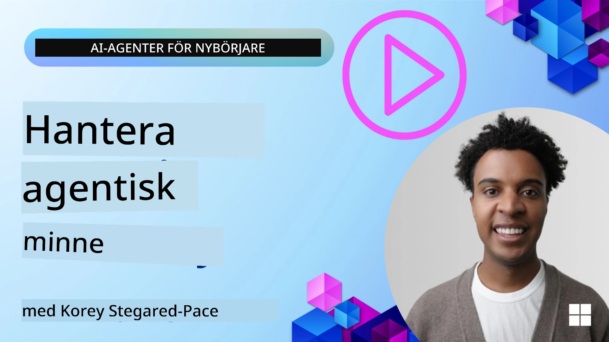

# Minne för AI-agenter  

När man diskuterar de unika fördelarna med att skapa AI-agenter diskuteras främst två saker: förmågan att använda verktyg för att slutföra uppgifter och förmågan att förbättras över tid. Minne ligger till grund för att skapa självförbättrande agenter som kan skapa bättre upplevelser för våra användare.

I den här lektionen kommer vi att titta på vad minne är för AI-agenter och hur vi kan hantera det och använda det till fördel för våra applikationer.

## Introduktion

Denna lektion kommer att täcka:

• **Att förstå AI-agenters minne**: Vad minne är och varför det är viktigt för agenter.

• **Implementera och lagra minne**: Praktiska metoder för att lägga till minnesfunktioner till dina AI-agenter, med fokus på korttids- och långtidsminne.

• **Att göra AI-agenter självförbättrande**: Hur minne möjliggör att agenter kan lära sig från tidigare interaktioner och förbättras över tid.

## Tillgängliga implementationer

Denna lektion innehåller två omfattande notebook-handledningar:

• **[13-agent-memory.ipynb](./13-agent-memory.ipynb)**: Implementerar minne med Mem0 och Azure AI Search med Microsoft Agent Framework

• **[13-agent-memory-cognee.ipynb](./13-agent-memory-cognee.ipynb)**: Implementerar strukturerat minne med Cognee, som automatiskt bygger en kunskapsgraf stödd av embeddings, visualiserar grafen och gör intelligent hämtning

## Lärandemål

Efter att ha genomfört denna lektion kommer du att veta hur du:

• **Skiljer mellan olika typer av AI-agenters minne**, inklusive arbetsminne, korttidsminne och långtidsminne, samt specialiserade former som persona- och episodiskt minne.

• **Implementerar och hanterar korttids- och långtidsminne för AI-agenter** med Microsoft Agent Framework, med hjälp av verktyg som Mem0, Cognee, Whiteboard-minne och integrering med Azure AI Search.

• **Förstår principerna bakom självförbättrande AI-agenter** och hur robusta minneshanteringssystem bidrar till kontinuerligt lärande och anpassning.

## Att förstå AI-agenters minne

I kärnan av detta avser **minne för AI-agenter de mekanismer som gör att de kan behålla och återkalla information**. Denna information kan vara specifika detaljer om en konversation, användarpreferenser, tidigare handlingar eller till och med inlärda mönster.

Utan minne är AI-applikationer ofta statslösa, vilket betyder att varje interaktion startar från början. Detta leder till en repetitiv och frustrerande användarupplevelse där agenten "glömmer" tidigare kontext eller preferenser.

### Varför är minne viktigt?

En agents intelligens är djupt kopplad till dess förmåga att återkalla och använda tidigare information. Minne gör att agenter kan vara:

• **Reflekterande**: Lära sig från tidigare handlingar och resultat.

• **Interaktiva**: Bibehålla kontext under en pågående konversation.

• **Proaktiva och reaktiva**: Förutse behov eller svara lämpligt baserat på historiska data.

• **Autonoma**: Fungere mer självständigt genom att dra nytta av lagrad kunskap.

Målet med att implementera minne är att göra agenter mer **pålitliga och kapabla**.

### Minnenas typer

#### Arbetsminne

Tänk på det som ett anteckningspapper som en agent använder under en enda pågående uppgift eller tankegång. Det håller den omedelbara information som behövs för att beräkna nästa steg.

För AI-agenter fångar arbetsminnet ofta den mest relevanta informationen från en konversation, även om hela chattloggen är lång eller trunkerad. Det fokuserar på att extrahera nyckelelement som krav, förslag, beslut och åtgärder.

**Exempel på arbetsminne**

I en resebokningsagent kan arbetsminnet fånga användarens aktuella förfrågan, såsom "Jag vill boka en resa till Paris". Detta specifika krav hålls i agentens omedelbara kontext för att vägleda den pågående interaktionen.

#### Korttidsminne

Denna typ av minne behåller information under en enskild konversation eller session. Det är kontexten för den aktuella chatten, vilket gör att agenten kan referera tillbaka till tidigare turer i dialogen.

I [Microsoft Agent Framework](https://github.com/microsoft/agent-framework) Python SDK-exemplen motsvarar detta `AgentSession`, som skapas med `agent.create_session()`. Sessionen är ramverkets inbyggda korttidsminne: det håller kontexten för samtalet tillgängligt så länge samma session återanvänds, men den kontexten sparas inte när sessionen slutar eller applikationen startas om. Använd långtidsminne för fakta och preferenser som behöver bevaras över sessioner, vanligtvis via en databas, vektorindex eller ett annat permanent lagringsmedium.

**Exempel på korttidsminne**

Om en användare frågar "Hur mycket kostar en flygning till Paris?" och sedan följer upp med "Hur är det med boende där?", ser korttidsminnet till att agenten vet att "där" refererar till "Paris" inom samma konversation.

#### Långtidsminne

Detta är information som persisterar över flera konversationer eller sessioner. Det gör det möjligt för agenter att minnas användarpreferenser, historiska interaktioner eller generell kunskap över längre perioder. Detta är viktigt för personalisering.

**Exempel på långtidsminne**

Ett långtidsminne kan lagra att "Ben tycker om skidåkning och utomhusaktiviteter, gillar kaffe med utsikt över bergen och vill undvika avancerade skidbackar på grund av en tidigare skada". Denna information, inlärd från tidigare interaktioner, påverkar rekommendationer vid framtida reseplanering, vilket gör dem mycket personliga.

#### Personaminne

Denna specialiserade minnestyp hjälper en agent att utveckla en konsekvent "personlighet" eller "persona". Det gör att agenten kan minnas detaljer om sig själv eller sin avsedda roll, vilket gör interaktionerna mer flytande och fokuserade.

**Exempel på personaminne**

Om reseagenten är designad för att vara en "expert på skidplanering" kan personaminne förstärka denna roll, och påverka svaren att överensstämma med en experts ton och kunskap.

#### Arbetsflöde/Episodiskt minne

Detta minne lagrar sekvensen av steg en agent tar under en komplex uppgift, inklusive framgångar och misslyckanden. Det är som att komma ihåg specifika "episoder" eller tidigare erfarenheter för att lära av dem.

**Exempel på episodiskt minne**

Om agenten försökte boka ett specifikt flyg men det misslyckades på grund av otillgänglighet, kan episodiskt minne registrera detta misslyckande, så att agenten kan försöka alternativ eller informera användaren om problemet på ett mer informerat sätt vid ett senare försök.

#### Entitetsminne

Detta innebär att extrahera och minnas specifika entiteter (som personer, platser eller saker) och händelser från konversationer. Det gör att agenten kan bygga en strukturerad förståelse för nyckelelement som diskuterats.

**Exempel på entitetsminne**

Från en konversation om en tidigare resa kan agenten till exempel extrahera "Paris", "Eiffeltornet" och "middag på restaurang Le Chat Noir" som entiteter. Vid en framtida interaktion kan agenten komma ihåg "Le Chat Noir" och erbjuda att göra en ny reservation där.

#### Strukturerad RAG (Retrieval Augmented Generation)

Medan RAG är en bredare teknik, framhålls "Strukturerad RAG" som en kraftfull minnesteknologi. Den extraherar tät, strukturerad information från olika källor (konversationer, e-post, bilder) och använder den för att förbättra precision, återkallande och snabbhet i svaren. Till skillnad från klassisk RAG som enbart förlitar sig på semantisk likhet, arbetar Strukturerad RAG med den inneboende strukturen i informationen.

**Exempel på strukturerad RAG**

Istället för att bara matcha nyckelord kan Strukturerad RAG tolka flygdetaljer (destination, datum, tid, flygbolag) från ett e-postmeddelande och lagra dem på ett strukturerat sätt. Detta möjliggör precisa frågor som "Vilket flyg bokade jag till Paris på tisdag?"

## Implementera och lagra minne

Att implementera minne för AI-agenter innebär en systematisk process för **minneshantering**, som inkluderar generering, lagring, hämtning, integrering, uppdatering och till och med "glömmande" (eller borttagning) av information. Hämtning är en särskilt viktig aspekt.

### Specialiserade minnesverktyg

#### Mem0

Ett sätt att lagra och hantera agenters minne är att använda specialiserade verktyg som Mem0. Mem0 fungerar som ett persistenslager för minne, vilket gör det möjligt för agenter att återkalla relevanta interaktioner, lagra användarpreferenser och faktakapital samt lära sig av framgångar och misslyckanden över tid. Idén är att statslösa agenter blir till tillståndsbaserade.

Det fungerar genom en **tvåfasig minnespipeline: extraktion och uppdatering**. Först skickas meddelanden som läggs till i en agents tråd till Mem0-tjänsten, som använder en Large Language Model (LLM) för att summera konversationshistoriken och extrahera nya minnen. Därefter bestämmer en LLM-driven uppdateringsfas om dessa minnen ska läggas till, ändras eller tas bort, och lagrar dem i en hybriddatabas som kan inkludera vektor-, graf- och nyckel-värdedatabaser. Systemet stödjer även olika minnestyper och kan inkludera grafminne för att hantera relationer mellan entiteter.

#### Cognee

Ett annat kraftfullt tillvägagångssätt är att använda **Cognee**, ett open-source semantiskt minne för AI-agenter som omvandlar strukturerad och ostrukturerad data till sökbara kunskapsgrafer stödda av embeddings. Cognee erbjuder en **dubbel-lager arkitektur** som kombinerar vektorsökningslikhet med grafrelationer, vilket gör att agenter kan förstå inte bara vilken information som är liknande, utan även hur begrepp är relaterade till varandra.

Det är särskilt bra på **hybridhämtning** som blandar vektorsimilaritet, grafstruktur och LLM-resonemang – från rå sökning i delar till grafmedveten frågesvar. Systemet upprätthåller ett **levande minne** som utvecklas och växer samtidigt som det förblir sökbart som en sammanlänkad graf, och stöder både korttids sessionskontext och långtids permanenta minne.

Cognee-notebook-handledningen ([13-agent-memory-cognee.ipynb](./13-agent-memory-cognee.ipynb)) visar hur man bygger detta enhetliga minneslager, med praktiska exempel på hur man importerar olika datakällor, visualiserar kunskapsgrafen och frågar med olika sökstrategier anpassade till specifika agentbehov.

### Lagra minne med RAG

Utöver specialiserade minnesverktyg som Mem0 kan du använda robusta söktjänster som **Azure AI Search som en backend för att lagra och hämta minnen**, särskilt för strukturerad RAG.

Detta gör att du kan förankra agentens svar med dina egna data, vilket säkerställer mer relevanta och korrekta svar. Azure AI Search kan användas för att lagra användarspecifika reseminnen, produktkataloger eller annan domänspecifik kunskap.

Azure AI Search stödjer funktioner som **Strukturerad RAG**, som utmärker sig på att extrahera och hämta tät, strukturerad information från stora datamängder som konversationshistorik, e-post eller till och med bilder. Detta ger en "övermänsklig precision och återkallning" jämfört med traditionella metoder med textdelning och embedding.

## Att göra AI-agenter självförbättrande

Ett vanligt mönster för självförbättrande agenter innebär att introducera en **"kunskapagent"**. Denna separata agent observerar huvudkonversationen mellan användaren och primäragenten. Dess roll är att:

1. **Identifiera värdefull information**: Avgöra om någon del av konversationen är värd att spara som generell kunskap eller en specifik användarpreferens.

2. **Extrahera och sammanfatta**: Destillera den väsentliga lärdomen eller preferensen från konversationen.

3. **Lagra i en kunskapsdatabas**: Spara denna extraherade information, ofta i en vektordatabas, så att den kan hämtas senare.

4. **Förstärka framtida frågor**: När användaren initierar en ny fråga hämtar kunskapagenten relevant lagrad information och lägger till den till användarens prompt, och ger avgörande kontext till primäragenten (liknande RAG).

### Optimeringar för minnet

• **Latenshantering**: För att undvika att sakta ner användarinteraktioner kan en billigare, snabbare modell användas initialt för att snabbt kontrollera om information är värdefull att lagra eller hämta, och endast anropa den mer komplexa extraktions-/hämtningsprocessen när det är nödvändigt.

• **Underhåll av kunskapsbasen**: För en växande kunskapsbas kan mindre frekvent använd information flyttas till "kallförvaring" för att hantera kostnader.

## Har du fler frågor om agentminne?

Gå med i [Microsoft Foundry Discord](https://discord.com/invite/ATgtXmAS5D) för att träffa andra elever, delta i öppen hjälp och få dina frågor om AI-agenter besvarade.

---

<!-- CO-OP TRANSLATOR DISCLAIMER START -->
**Ansvarsfriskrivning**:
Detta dokument har översatts med hjälp av AI-översättningstjänsten [Co-op Translator](https://github.com/Azure/co-op-translator). Även om vi strävar efter noggrannhet, var vänlig notera att automatiska översättningar kan innehålla fel eller brister. Det ursprungliga dokumentet på dess modersmål bör betraktas som den auktoritativa källan. För kritisk information rekommenderas professionell mänsklig översättning. Vi ansvarar inte för några missförstånd eller feltolkningar som uppstår till följd av användningen av denna översättning.
<!-- CO-OP TRANSLATOR DISCLAIMER END -->