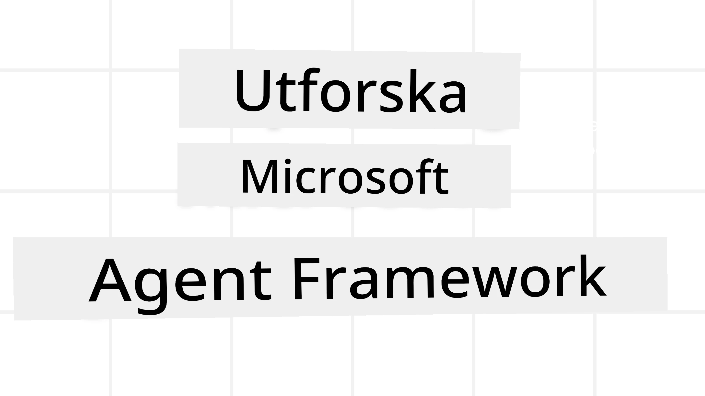
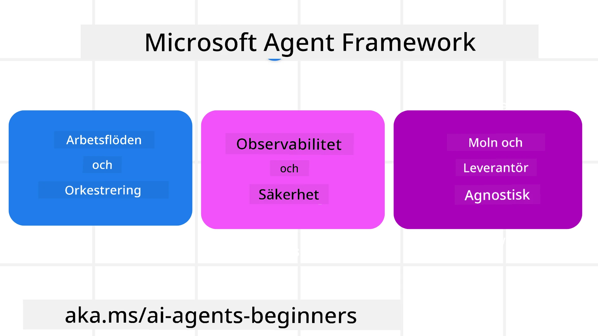
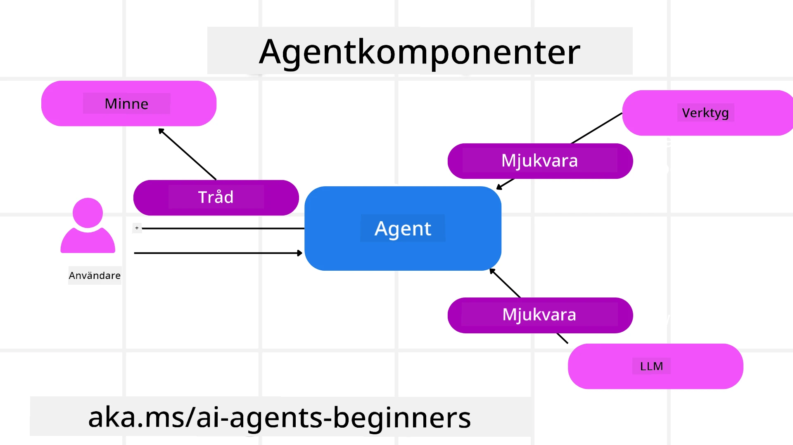

# Utforska Microsoft Agent Framework



### Introduktion

Den här lektionen kommer att täcka:

- Förstå Microsoft Agent Framework: Nyckelfunktioner och värde  
- Utforska nyckelkoncepten i Microsoft Agent Framework
- Avancerade MAF-mönster: Arbetsflöden, Middleware och Minne

## Lärandemål

Efter att ha slutfört denna lektion kommer du att veta hur man:

- Bygger produktionsklara AI-agenter med Microsoft Agent Framework
- Använder kärnfunktionerna i Microsoft Agent Framework för dina agentiska användningsfall
- Använder avancerade mönster inklusive arbetsflöden, middleware och observabilitet

## Kodexempel 

Kodexempel för [Microsoft Agent Framework (MAF)](https://aka.ms/ai-agents-beginners/agent-framewrok) finns i detta repository under filerna `xx-python-agent-framework` och `xx-dotnet-agent-framework`.

## Förstå Microsoft Agent Framework



[Microsoft Agent Framework (MAF)](https://aka.ms/ai-agents-beginners/agent-framewrok) är Microsofts enhetliga ramverk för att bygga AI-agenter. Det erbjuder flexibiliteten att hantera den breda variationen av agentiska användningsfall som ses både i produktions- och forskningsmiljöer, inklusive:

- **Sekventiell agentorkestrering** i scenarier där steg-för-steg arbetsflöden behövs.
- **Parallell orkestrering** i scenarier där agenter behöver slutföra uppgifter samtidigt.
- **Gruppchattorkestrering** i scenarier där agenter kan samarbeta kring en uppgift.
- **Överlämningsorkestrering** i scenarier där agenter lämnar över uppgiften till varandra när underuppgifter är slutförda.
- **Magnetisk orkestrering** i scenarier där en chefagent skapar och modifierar en uppgiftslista och hanterar samordningen av underagenter för att slutföra uppgiften.

För att leverera AI-agenter i produktion har MAF även funktioner för:

- **Observabilitet** via användningen av OpenTelemetry där varje handling av AI-agenten, inklusive verktygsanrop, orkestreringssteg, resoneringsflöden och prestandaövervakning sker genom Microsoft Foundrys instrumentpaneler.
- **Säkerhet** genom att hosta agenter nativt på Microsoft Foundry som inkluderar säkerhetskontroller som rollbaserad åtkomst, hantering av privata data och inbyggd innehållssäkerhet.
- **Hållbarhet** eftersom agenttrådar och arbetsflöden kan pausas, återupptas och återhämtas från fel vilket möjliggör långvariga processer.
- **Kontroll** eftersom arbetsflöden med mänsklig inblandning stöds där uppgifter markeras som kräver mänskligt godkännande.

Microsoft Agent Framework fokuserar också på interoperabilitet genom att:

- **Vara molnoberoende** - Agenter kan köras i containrar, lokalt och över flera olika moln.
- **Vara leverantörsoberoende** - Agenter kan skapas via ditt föredragna SDK inklusive Azure OpenAI och OpenAI
- **Integrera öppna standarder** - Agenter kan använda protokoll såsom Agent-to-Agent (A2A) och Model Context Protocol (MCP) för att upptäcka och använda andra agenter och verktyg.
- **Plugins och anslutningar** - Anslutningar kan göras till data- och minnestjänster som Microsoft Fabric, SharePoint, Pinecone och Qdrant.

Låt oss titta på hur dessa funktioner tillämpas på några av kärnkoncepten i Microsoft Agent Framework.

## Nyckelkoncept i Microsoft Agent Framework

### Agenter



**Skapa agenter**

Agentskapande görs genom att definiera inferenstjänsten (LLM-leverantör), en  
uppsättning instruktioner som AI-agenten ska följa och ett tilldelat `name`:

```python
agent = AzureOpenAIChatClient(credential=AzureCliCredential()).create_agent( instructions="You are good at recommending trips to customers based on their preferences.", name="TripRecommender" )
```
  
Ovan använder `Azure OpenAI` men agenter kan skapas med en mängd olika tjänster inklusive `Microsoft Foundry Agent Service`:

```python
AzureAIAgentClient(async_credential=credential).create_agent( name="HelperAgent", instructions="You are a helpful assistant." ) as agent
```
  
OpenAI `Responses`, `ChatCompletion` API:er

```python
agent = OpenAIResponsesClient().create_agent( name="WeatherBot", instructions="You are a helpful weather assistant.", )
```
  
```python
agent = OpenAIChatClient().create_agent( name="HelpfulAssistant", instructions="You are a helpful assistant.", )
```
  
eller fjärragenter med A2A-protokollet:

```python
agent = A2AAgent( name=agent_card.name, description=agent_card.description, agent_card=agent_card, url="https://your-a2a-agent-host" )
```
  
**Köra agenter**

Agenter körs med `.run` eller `.run_stream` metoderna för icke-strömmande eller strömmande svar.

```python
result = await agent.run("What are good places to visit in Amsterdam?")
print(result.text)
```
  
```python
async for update in agent.run_stream("What are the good places to visit in Amsterdam?"):
    if update.text:
        print(update.text, end="", flush=True)

```
  
Varje agentkörning kan också ha alternativ för att anpassa parametrar som `max_tokens` som används av agenten, `tools` som agenten kan anropa, och till och med själva `model` som används av agenten.

Detta är användbart i fall där specifika modeller eller verktyg krävs för att slutföra en användares uppgift.

**Verktyg**

Verktyg kan definieras både vid definition av agenten:

```python
def get_attractions( location: Annotated[str, Field(description="The location to get the top tourist attractions for")], ) -> str: """Get the top tourist attractions for a given location.""" return f"The top attractions for {location} are." 


# När du skapar en ChatAgent direkt

agent = ChatAgent( chat_client=OpenAIChatClient(), instructions="You are a helpful assistant", tools=[get_attractions]

```
  
och även vid körning av agenten:

```python

result1 = await agent.run( "What's the best place to visit in Seattle?", tools=[get_attractions] # Verktyg tillhandahållet endast för denna körning )
```
  
**Agenttrådar**

Agenttrådar används för att hantera konversationer med flera vändor. Trådar kan skapas genom antingen:

- Att använda `get_new_thread()` som gör att tråden kan sparas över tid
- Att automatiskt skapa en tråd vid körning av en agent där tråden endast varar under den aktuella körningen.

För att skapa en tråd ser koden ut så här:

```python
# Skapa en ny tråd.
thread = agent.get_new_thread() # Kör agenten med tråden.
response = await agent.run("Hello, I am here to help you book travel. Where would you like to go?", thread=thread)

```
  
Du kan sedan serialisera tråden för att lagras för senare användning:

```python
# Skapa en ny tråd.
thread = agent.get_new_thread() 

# Kör agenten med tråden.

response = await agent.run("Hello, how are you?", thread=thread) 

# Serialisera tråden för lagring.

serialized_thread = await thread.serialize() 

# Avserialisera trådens tillstånd efter inläsning från lagring.

resumed_thread = await agent.deserialize_thread(serialized_thread)
```
  
**Agent Middleware**

Agenter interagerar med verktyg och LLM:er för att slutföra användarens uppgifter. I vissa scenarier vill vi utföra eller spåra mellan dessa interaktioner. Agentmiddleware möjliggör detta genom:

*Funktionsmiddleware*

Denna middleware tillåter oss att utföra en åtgärd mellan agenten och en funktion/verktyg som den kommer att anropa. Ett exempel på när detta används är när du vill göra någon loggning av funktionsanropet.

I koden nedan definierar `next` om nästa middleware eller den faktiska funktionen ska anropas.

```python
async def logging_function_middleware(
    context: FunctionInvocationContext,
    next: Callable[[FunctionInvocationContext], Awaitable[None]],
) -> None:
    """Function middleware that logs function execution."""
    # Förbehandling: Logga innan funktionskörning
    print(f"[Function] Calling {context.function.name}")

    # Fortsätt till nästa middleware eller funktionskörning
    await next(context)

    # Efterbehandling: Logga efter funktionskörning
    print(f"[Function] {context.function.name} completed")
```
  
*Chatmiddleware*

Denna middleware tillåter oss att utföra eller logga en åtgärd mellan agenten och förfrågningarna till LLM.

Detta innehåller viktig information som de `messages` som skickas till AI-tjänsten.

```python
async def logging_chat_middleware(
    context: ChatContext,
    next: Callable[[ChatContext], Awaitable[None]],
) -> None:
    """Chat middleware that logs AI interactions."""
    # Förbehandling: Logga före AI-anrop
    print(f"[Chat] Sending {len(context.messages)} messages to AI")

    # Fortsätt till nästa middleware eller AI-tjänst
    await next(context)

    # Efterbehandling: Logga efter AI-svar
    print("[Chat] AI response received")

```
  
**Agentminne**

Som täcktes i lektionen `Agentic Memory` är minne ett viktigt element för att möjliggöra att agenten kan arbeta över olika kontexter. MAF erbjuder flera olika typer av minnen:

*In-Memory Storage*

Detta är minnet som lagras i trådar under applikationens körning.

```python
# Skapa en ny tråd.
thread = agent.get_new_thread() # Kör agenten med tråden.
response = await agent.run("Hello, I am here to help you book travel. Where would you like to go?", thread=thread)
```
  
*PERSISTENTA meddelanden*

Detta minne används när samtalshistorik lagras över olika sessioner. Det definieras med `chat_message_store_factory`:

```python
from agent_framework import ChatMessageStore

# Skapa en anpassad meddelandelagring
def create_message_store():
    return ChatMessageStore()

agent = ChatAgent(
    chat_client=OpenAIChatClient(),
    instructions="You are a Travel assistant.",
    chat_message_store_factory=create_message_store
)

```
  
*Dynamiskt minne*

Detta minne läggs till i kontexten innan agenter körs. Dessa minnen kan lagras i externa tjänster såsom mem0:

```python
from agent_framework.mem0 import Mem0Provider

# Använder Mem0 för avancerade minnesfunktioner
memory_provider = Mem0Provider(
    api_key="your-mem0-api-key",
    user_id="user_123",
    application_id="my_app"
)

agent = ChatAgent(
    chat_client=OpenAIChatClient(),
    instructions="You are a helpful assistant with memory.",
    context_providers=memory_provider
)

```
  
**Agentobservabilitet**

Observabilitet är viktig för att bygga tillförlitliga och underhållbara agentiska system. MAF integreras med OpenTelemetry för att tillhandahålla spårning och mätare för bättre observabilitet.

```python
from agent_framework.observability import get_tracer, get_meter

tracer = get_tracer()
meter = get_meter()
with tracer.start_as_current_span("my_custom_span"):
    # gör något
    pass
counter = meter.create_counter("my_custom_counter")
counter.add(1, {"key": "value"})
```
  
### Arbetsflöden

MAF erbjuder arbetsflöden som är fördefinierade steg för att slutföra en uppgift och inkluderar AI-agenter som komponenter i dessa steg.

Arbetsflöden består av olika komponenter som möjliggör bättre styrflöde. Arbetsflöden möjliggör också **multi-agent orkestrering** och **checkpointing** för att spara arbetsflödets tillstånd.

Kärnkomponenterna i ett arbetsflöde är:

**Utförare**

Utförare tar emot indata-meddelanden, utför sina tilldelade uppgifter och producerar sedan ett utdata-meddelande. Detta för arbetsflödet framåt mot att slutföra den övergripande uppgiften. Utförare kan vara antingen AI-agent eller egen logik.

**Kanter**

Kanter används för att definiera flödet av meddelanden i ett arbetsflöde. Dessa kan vara:

*Direkta kanter* - Enkla en-till-en anslutningar mellan utförare:

```python
from agent_framework import WorkflowBuilder

builder = WorkflowBuilder()
builder.add_edge(source_executor, target_executor)
builder.set_start_executor(source_executor)
workflow = builder.build()
```
  
*Villkorliga kanter* - Aktiveras efter att ett visst villkor uppfyllts. Till exempel när hotellrum inte är tillgängliga kan en utförare föreslå andra alternativ.

*Switch-case kanter* - Rutar meddelanden till olika utförare baserat på definierade villkor. Till exempel om en reskonsument har prioriterad åtkomst och deras uppgifter hanteras via ett annat arbetsflöde.

*Fan-out kanter* - Skickar ett meddelande till flera mål.

*Fan-in kanter* - Samlar in flera meddelanden från olika utförare och skickar till ett mål.

**Händelser**

För att tillhandahålla bättre observabilitet i arbetsflöden erbjuder MAF inbyggda händelser för exekvering inklusive:

- `WorkflowStartedEvent`  - Arbetsflödes exekvering startar
- `WorkflowOutputEvent` - Arbetsflödet producerar ett utdata
- `WorkflowErrorEvent` - Arbetsflödet stöter på ett fel
- `ExecutorInvokeEvent`  - Utföraren börjar bearbeta
- `ExecutorCompleteEvent`  -  Utföraren avslutar bearbetning
- `RequestInfoEvent` - En förfrågan görs

## Avancerade MAF-mönster

Sektionerna ovan täcker nyckelkoncepten i Microsoft Agent Framework. När du bygger mer komplexa agenter finns här några avancerade mönster att överväga:

- **Middlewarekomposition**: Kjedja flera middleware-hanterare (loggning, autentisering, hastighetsbegränsning) med funktions- och chatmiddleware för finjusterad kontroll över agentens beteende.
- **Arbetsflödescheckpointing**: Använd arbetsflödesevenemang och serialisering för att spara och återuppta långvariga agentprocesser.
- **Dynamiskt verktygsval**: Kombinera RAG över verktygsbeskrivningar med MAF:s verktygsregistrering för att bara visa relevanta verktyg per fråga.
- **Multi-agent överlämning**: Använd arbetsflödeskantar och villkorlig routing för att orkestrera överlämningar mellan specialiserade agenter.

## Kodexempel 

Kodexempel för Microsoft Agent Framework finns i detta repository under filerna `xx-python-agent-framework` och `xx-dotnet-agent-framework`.

## Fler frågor om Microsoft Agent Framework?

Gå med i [Microsoft Foundry Discord](https://aka.ms/ai-agents/discord) för att träffa andra studerande, delta i kontorstider och få svar på dina frågor om AI-agenter.

---

<!-- CO-OP TRANSLATOR DISCLAIMER START -->
**Ansvarsfriskrivning**:  
Detta dokument har översatts med hjälp av AI-översättningstjänsten [Co-op Translator](https://github.com/Azure/co-op-translator). Även om vi strävar efter noggrannhet, bör du vara medveten om att automatiska översättningar kan innehålla fel eller brister. Det ursprungliga dokumentet på dess modersmål ska betraktas som den auktoritativa källan. För kritisk information rekommenderas professionell mänsklig översättning. Vi ansvarar inte för eventuella missförstånd eller feltolkningar som uppstår vid användning av denna översättning.
<!-- CO-OP TRANSLATOR DISCLAIMER END -->