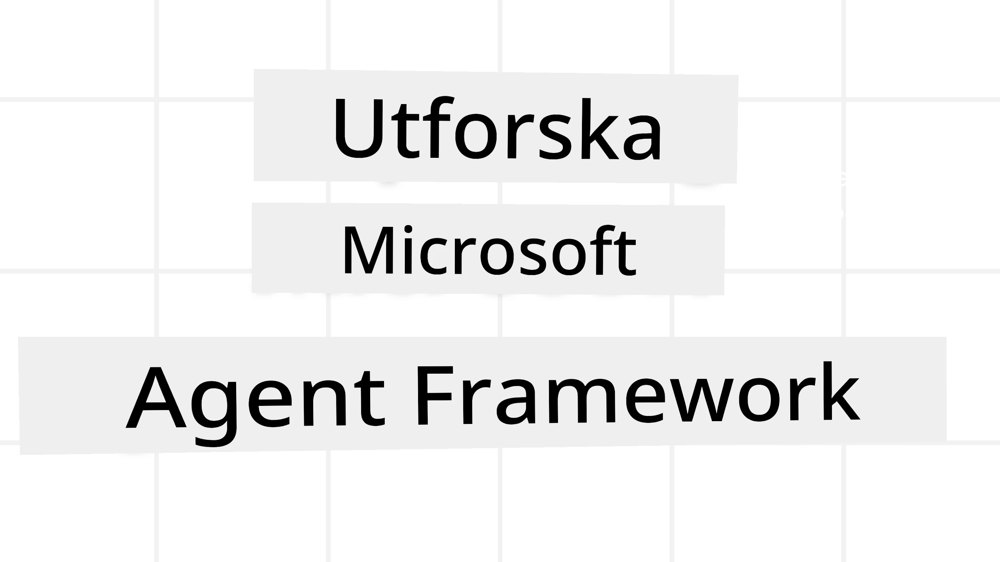
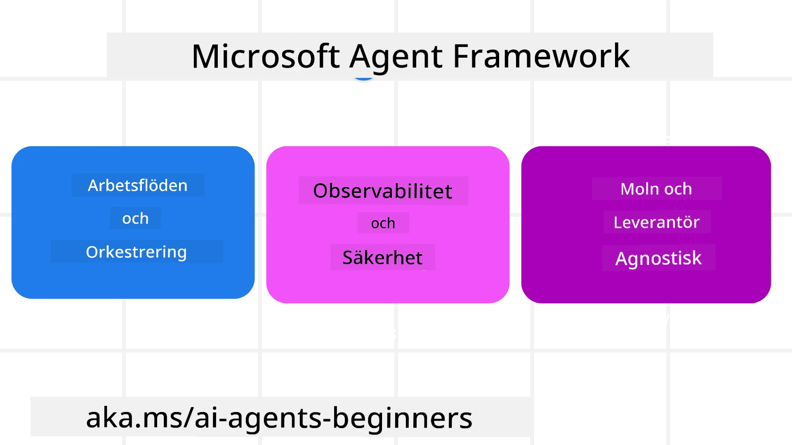
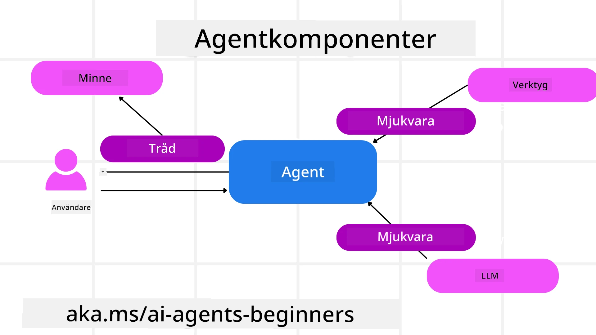

# Utforska Microsoft Agent Framework



### Introduktion

Den här lektionen täcker:

- Förstå Microsoft Agent Framework: Viktiga egenskaper och värde  
- Utforska nyckelkoncepten i Microsoft Agent Framework
- Avancerade MAF-mönster: Arbetsflöden, middleware och minne

## Lärandemål

Efter att ha slutfört denna lektion kommer du att kunna:

- Bygga produktionsfärdiga AI-agenter med Microsoft Agent Framework
- Använda kärnfunktionerna i Microsoft Agent Framework för dina agentiska användningsfall
- Använda avancerade mönster inklusive arbetsflöden, middleware och observabilitet

## Kodexempel 

Kodexempel för [Microsoft Agent Framework (MAF)](https://learn.microsoft.com/en-us/agent-framework/overview/?wt.mc_id=youtube_26688_organicsocial_reactor&pivots=programming-language-python) finns i detta repo under filerna `xx-python-agent-framework` och `xx-dotnet-agent-framework`.

## Förstå Microsoft Agent Framework



[Microsoft Agent Framework (MAF)](https://learn.microsoft.com/en-us/agent-framework/overview/?wt.mc_id=youtube_26688_organicsocial_reactor&pivots=programming-language-python) är Microsofts enhetliga ramverk för att bygga AI-agenter. Det erbjuder flexibiliteten att hantera den stora variationen av agentiska användningsfall som ses i både produktions- och forskningsmiljöer, inklusive:

- **Sekventiell agentorkestrering** i scenarier där steg-för-steg arbetsflöden krävs.
- **Samtidig orkestrering** i scenarier där agenter behöver utföra uppgifter samtidigt.
- **Gruppchattorkestrering** i scenarier där agenter kan samarbeta om en uppgift.
- **Överlämningsorkestrering** i scenarier där agenter överlämnar uppgifter till varandra efter att deluppgifter slutförts.
- **Magnetisk orkestrering** i scenarier där en chefagent skapar och modifierar en uppgiftslista och hanterar koordineringen av underagenter för att slutföra uppgiften.

För att leverera AI-agenter i produktion har MAF också inkluderat funktioner för:

- **Observabilitet** genom användning av OpenTelemetry där varje handling från AI-agenten, inklusive verktygsanrop, orkestreringssteg, resonemangsflöden och prestandaövervakning via Microsoft Foundry-instrumentpaneler, täcks.
- **Säkerhet** genom att hosta agenter nativt på Microsoft Foundry, vilket inkluderar säkerhetskontroller som rollbaserad åtkomst, hantering av privata data och inbyggd innehållssäkerhet.
- **Hållbarhet** då agenttrådar och arbetsflöden kan pausas, återupptas och återhämta sig från fel, vilket möjliggör längre körprocesser.
- **Kontroll** eftersom arbetsflöden med mänsklig inblandning stöds där uppgifter markeras som kräver mänskligt godkännande.

Microsoft Agent Framework fokuserar också på interoperabilitet genom att:

- **Vara molnagnostiskt** - Agenter kan köras i containrar, lokalt och över flera olika moln.
- **Vara leverantörsagnostiskt** - Agenter kan skapas genom ditt föredragna SDK inklusive Azure OpenAI och OpenAI
- **Integrera öppna standarder** - Agenter kan använda protokoll som Agent-to-Agent (A2A) och Model Context Protocol (MCP) för att upptäcka och använda andra agenter och verktyg.
- **Plugins och anslutningar** - Anslutningar kan göras till data- och minnestjänster som Microsoft Fabric, SharePoint, Pinecone och Qdrant.

Låt oss titta på hur dessa funktioner tillämpas på några av Microsoft Agent Frameworks kärnkoncept.

## Nyckelkoncept i Microsoft Agent Framework

### Agenter



**Skapa agenter**

Agent-skapande görs genom att definiera inferenstjänsten (LLM-leverantör), en
uppsättning instruktioner som AI-agenten ska följa, och ett tilldelat `namn`:

```python
agent = AzureOpenAIChatClient(credential=AzureCliCredential()).create_agent( instructions="You are good at recommending trips to customers based on their preferences.", name="TripRecommender" )
```

Ovan används `Azure OpenAI` men agenter kan skapas med olika tjänster inklusive `Microsoft Foundry Agent Service`:

```python
AzureAIAgentClient(async_credential=credential).create_agent( name="HelperAgent", instructions="You are a helpful assistant." ) as agent
```

OpenAI `Responses`, `ChatCompletion`-API:er

```python
agent = OpenAIResponsesClient().create_agent( name="WeatherBot", instructions="You are a helpful weather assistant.", )
```

```python
agent = OpenAIChatClient().create_agent( name="HelpfulAssistant", instructions="You are a helpful assistant.", )
```

eller [MiniMax](https://platform.minimaxi.com/), som erbjuder ett OpenAI-kompatibelt API med stora kontextfönster (upp till 204K tokens):

```python
agent = OpenAIChatClient(base_url="https://api.minimax.io/v1", api_key=os.environ["MINIMAX_API_KEY"], model_id="MiniMax-M3").create_agent( name="HelpfulAssistant", instructions="You are a helpful assistant.", )
```

eller fjärragenter med A2A-protokollet:

```python
agent = A2AAgent( name=agent_card.name, description=agent_card.description, agent_card=agent_card, url="https://your-a2a-agent-host" )
```

**Köra agenter**

Agenter körs med metoderna `.run` eller `.run_stream` för icke-strömmande respektive strömmande svar.

```python
result = await agent.run("What are good places to visit in Amsterdam?")
print(result.text)
```

```python
async for update in agent.run_stream("What are the good places to visit in Amsterdam?"):
    if update.text:
        print(update.text, end="", flush=True)

```

Varje agentkörning kan också ha alternativ för att anpassa parametrar som `max_tokens` som agenten använder, `tools` som agenten kan anropa, och även själva `modellen` som används för agenten.

Detta är användbart i fall där specifika modeller eller verktyg krävs för att slutföra en användares uppgift.

**Verktyg**

Verktyg kan definieras både vid agentdefinitionen:

```python
def get_attractions( location: Annotated[str, Field(description="The location to get the top tourist attractions for")], ) -> str: """Get the top tourist attractions for a given location.""" return f"The top attractions for {location} are." 


# När du skapar en ChatAgent direkt

agent = ChatAgent( chat_client=OpenAIChatClient(), instructions="You are a helpful assistant", tools=[get_attractions]

```

och även när agenten körs:

```python

result1 = await agent.run( "What's the best place to visit in Seattle?", tools=[get_attractions] # Verktyg tillhandahållet endast för denna körning )
```

**Agenttrådar**

Agenttrådar används för att hantera öppna, flerstegs-konversationer. Trådar kan skapas antingen genom:

- Att använda `get_new_thread()` vilket möjliggör att tråden sparas över tid
- Att automatiskt skapa en tråd när agenten körs och att tråden endast varar under den aktuella körningen.

För att skapa en tråd ser koden ut så här:

```python
# Skapa en ny tråd.
thread = agent.get_new_thread() # Kör agenten med tråden.
response = await agent.run("Hello, I am here to help you book travel. Where would you like to go?", thread=thread)

```

Du kan sedan serialisera tråden för att lagras för senare användning:

```python
# Skapa en ny tråd.
thread = agent.get_new_thread() 

# Kör agenten med tråden.

response = await agent.run("Hello, how are you?", thread=thread) 

# Serialisera tråden för lagring.

serialized_thread = await thread.serialize() 

# Avserialisera trådstatus efter inläsning från lagring.

resumed_thread = await agent.deserialize_thread(serialized_thread)
```

**Agentmiddleware**

Agenter interagerar med verktyg och LLMs för att slutföra användarens uppgifter. I vissa scenarier vill vi köra eller spåra mellan dessa interaktioner. Agentmiddleware gör detta möjligt genom:

*Funktion-middleware*

Denna middleware låter oss köra en åtgärd mellan agenten och en funktion/verktyg som den kommer att anropa. Ett exempel är när man vill logga funktionsanropet.

Koden nedan definierar `next` som bestämmer om nästa middleware eller den faktiska funktionen ska anropas.

```python
async def logging_function_middleware(
    context: FunctionInvocationContext,
    next: Callable[[FunctionInvocationContext], Awaitable[None]],
) -> None:
    """Function middleware that logs function execution."""
    # Förbehandling: Logga före funktionskörning
    print(f"[Function] Calling {context.function.name}")

    # Fortsätt till nästa middleware eller funktionskörning
    await next(context)

    # Efterbehandling: Logga efter funktionskörning
    print(f"[Function] {context.function.name} completed")
```

*Chattmiddleware*

Denna middleware tillåter oss att köra eller logga en åtgärd mellan agenten och förfrågningarna till LLM.

Detta innehåller viktig information såsom `messages` som skickas till AI-tjänsten.

```python
async def logging_chat_middleware(
    context: ChatContext,
    next: Callable[[ChatContext], Awaitable[None]],
) -> None:
    """Chat middleware that logs AI interactions."""
    # Förbehandling: Logga innan AI-anrop
    print(f"[Chat] Sending {len(context.messages)} messages to AI")

    # Fortsätt till nästa mellanprogram eller AI-tjänst
    await next(context)

    # Efterbearbetning: Logga efter AI-svar
    print("[Chat] AI response received")

```

**Agentminne**

Som täckts i lektionen `Agentic Memory`, är minne en viktig del för att möjliggöra att agenten kan operera över olika kontexter. MAF erbjuder flera olika typer av minnen:

*I-minnet-lagring*

Detta är minnet som lagras i trådar under applikationens körning.

```python
# Skapa en ny tråd.
thread = agent.get_new_thread() # Kör agenten med tråden.
response = await agent.run("Hello, I am here to help you book travel. Where would you like to go?", thread=thread)
```

*Persistenta meddelanden*

Detta minne används för att lagra konversationshistorik över olika sessioner. Det definieras med hjälp av `chat_message_store_factory` :

```python
from agent_framework import ChatMessageStore

# Skapa en anpassad meddelandelagring
def create_message_store():
    return ChatMessageStore()

agent = ChatAgent(
    chat_client=OpenAIChatClient(),
    instructions="You are a Travel assistant.",
    chat_message_store_factory=create_message_store
)

```

*Dynamiskt minne*

Detta minne läggs till i kontexten innan agenter körs. Dessa minnen kan lagras i externa tjänster som mem0:

```python
from agent_framework.mem0 import Mem0Provider

# Använder Mem0 för avancerade minnesfunktioner
memory_provider = Mem0Provider(
    api_key="your-mem0-api-key",
    user_id="user_123",
    application_id="my_app"
)

agent = ChatAgent(
    chat_client=OpenAIChatClient(),
    instructions="You are a helpful assistant with memory.",
    context_providers=memory_provider
)

```

**Agentobservabilitet**

Observabilitet är viktigt för att bygga pålitliga och underhållbara agentiska system. MAF integrerar med OpenTelemetry för att erbjuda spårning och mätare för bättre observabilitet.

```python
from agent_framework.observability import get_tracer, get_meter

tracer = get_tracer()
meter = get_meter()
with tracer.start_as_current_span("my_custom_span"):
    # gör något
    pass
counter = meter.create_counter("my_custom_counter")
counter.add(1, {"key": "value"})
```

### Arbetsflöden

MAF erbjuder arbetsflöden som är fördefinierade steg för att slutföra en uppgift och inkluderar AI-agenter som komponenter i dessa steg.

Arbetsflöden består av olika komponenter som möjliggör bättre kontrollflöde. Arbetsflöden möjliggör också **multi-agent orkestrering** och **checkpointing** för att spara arbetsflödets tillstånd.

De centrala komponenterna i ett arbetsflöde är:

**Utförare**

Utförare tar emot indata-meddelanden, utför sina tilldelade uppgifter och producerar sedan ett utdata-meddelande. Detta för arbetsflödet framåt mot att slutföra den större uppgiften. Utförare kan vara antingen AI-agent eller anpassad logik.

**Kanter**

Kanter används för att definiera flödet av meddelanden i ett arbetsflöde. Dessa kan vara:

*Direkta kanter* - Enkla en-till-en-anslutningar mellan utförare:

```python
from agent_framework import WorkflowBuilder

builder = WorkflowBuilder()
builder.add_edge(source_executor, target_executor)
builder.set_start_executor(source_executor)
workflow = builder.build()
```

*Villkorsbaserade kanter* - Aktiveras efter att ett visst villkor är uppfyllt. Till exempel kan en utförare föreslå andra alternativ när hotellrum inte finns tillgängliga.

*Switch-case-kanter* - Rutar meddelanden till olika utförare baserat på definierade villkor. Till exempel om en resenär har prioriterad åtkomst hanteras deras uppgifter genom ett annat arbetsflöde.

*Fan-out-kanter* - Skickar ett meddelande till flera mottagare.

*Fan-in-kanter* - Samlar flera meddelanden från olika utförare och skickar till en mottagare.

**Händelser**

För att ge bättre observabilitet i arbetsflöden erbjuder MAF inbyggda körningshändelser, inklusive:

- `WorkflowStartedEvent`  - Arbetsflödet startar
- `WorkflowOutputEvent` - Arbetsflödet producerar ett resultat
- `WorkflowErrorEvent` - Arbetsflödet stöter på ett fel
- `ExecutorInvokeEvent`  - Utföraren börjar bearbeta
- `ExecutorCompleteEvent`  -  Utföraren är färdig med bearbetningen
- `RequestInfoEvent` - En förfrågan görs

## Avancerade MAF-mönster

Sektionerna ovan täcker de viktigaste koncepten i Microsoft Agent Framework. När du bygger mer komplexa agenter finns här några avancerade mönster att överväga:

- **Middleware-komposition**: Kedja flera middleware-hanterare (loggning, autentisering, hastighetsbegränsning) med hjälp av funktions- och chattmiddleware för finstyrd kontroll över agentens beteende.
- **Checkpointing i arbetsflöden**: Använd arbetsflödesevenemang och serialisering för att spara och återuppta långvariga agentprocesser.
- **Dynamiskt verktygsval**: Kombinera RAG över verktygsbeskrivningar med MAF:s verktygsregistrering för att endast visa relevanta verktyg per förfrågan.
- **Multi-agent överlämning**: Använd arbetsflödets kanter och villkorsstyrd routing för att orkestrera överlämningar mellan specialiserade agenter.

## Hostning av LangChain / LangGraph Agenter på Microsoft Foundry

Microsoft Agent Framework är **ramverks-interoperabelt** — du är inte begränsad till agenter skrivna med MAF. Om du redan har en agent byggd med **LangChain** eller **LangGraph** kan du köra den som en **Microsoft Foundry-hostad agent** så att Foundry hanterar körning, sessioner, skalning, identitet och protokollendpunkter åt dig, medan din agentlogik förblir i LangGraph.

Detta görs med paketet `langchain_azure_ai.agents.hosting`, som exponerar en kompilerad LangGraph-graf över samma protokoll som Foundry-hostade agenter använder.

**1. Installera hosting-extra:**

```bash
pip install -U "langchain-azure-ai[hosting]>=1.2.4" azure-identity
```

Extra-paketet `hosting` installerar Foundry-protokollsbiblioteken: `azure-ai-agentserver-responses` (den OpenAI-kompatibla `/responses`-endpunkten) och `azure-ai-agentserver-invocations` (den generiska `/invocations`-endpunkten).

**2. Välj ett hostingprotokoll:**

| Protokoll | Host-klass | Endpunkt | Använd när |
|----------|-----------|----------|----------|
| **Responses** | `ResponsesHostServer` | `/responses` | Du vill ha OpenAI-kompatibel chatt, streaming, svarshistorik och konversationstrådning — rekommenderad standard för konverserande agenter. |
| **Invocations** | `InvocationsHostServer` | `/invocations` | Du behöver en anpassad JSON-form, en webhook-liknande endpunkt eller icke-konverserande bearbetning. |

Eftersom **Responses API är primärt API för agentstilutveckling i Foundry**, börja med `ResponsesHostServer` för de flesta agenter.

**3. Konfigurera miljövariabler** (`az login` först så att `DefaultAzureCredential` kan autentisera):

```bash
export FOUNDRY_PROJECT_ENDPOINT="https://<resource>.services.ai.azure.com/api/projects/<project>"
export FOUNDRY_MODEL_NAME="gpt-5-mini"
```

När agenten senare körs som hostad agent i Foundry injicerar plattformen automatiskt `FOUNDRY_PROJECT_ENDPOINT`.

**4. Exponera en LangGraph-agent över Responses-protokollet:**

```python
import os

from azure.ai.projects import AIProjectClient
from azure.identity import DefaultAzureCredential, get_bearer_token_provider
from langchain.agents import create_agent
from langchain_openai import ChatOpenAI
from langchain_azure_ai.agents.hosting import ResponsesHostServer

_AZURE_AI_SCOPE = "https://ai.azure.com/.default"


def build_chat_model() -> ChatOpenAI:
    project_endpoint = os.environ["FOUNDRY_PROJECT_ENDPOINT"].rstrip("/")
    deployment = os.environ.get("FOUNDRY_MODEL_NAME", "gpt-5-mini")
    credential = DefaultAzureCredential()
    project = AIProjectClient(endpoint=project_endpoint, credential=credential)
    openai_client = project.get_openai_client()
    token_provider = get_bearer_token_provider(credential, _AZURE_AI_SCOPE)

    # ChatOpenAI här riktar sig till Foundry-projektets OpenAI-kompatibla (Responses) slutpunkt.
    return ChatOpenAI(
        model=deployment,
        base_url=str(openai_client.base_url),
        api_key=token_provider,
    )


def main() -> None:
    graph = create_agent(build_chat_model(), tools=[])
    port = int(os.environ.get("PORT", "8088"))
    ResponsesHostServer(graph).run(port=port)


if __name__ == "__main__":
    main()
```

Kör den lokalt med `python main.py`, skicka sedan en Responses-förfrågan till `http://localhost:8088/responses`.

**Viktiga beteenden:**

- **Konversationer**: Klienter fortsätter en konversation genom att skicka `previous_response_id` eller ett `conversation`-ID. Om din graf är komplierad med en LangGraph-checkpointer knyter Foundry konversationstillståndet till checkpointen (använd en hållbar checkpointer i produktion; `MemorySaver` fungerar bra för lokal testning).
- **Människa-i-loopen**: Om din graf använder LangGraph `interrupt()`, visar `ResponsesHostServer` den väntande avbrottspunkten som en Responses `function_call` / `mcp_approval_request`-post, och klienter fortsätter med en matchande `function_call_output` / `mcp_approval_response`.
- **Distribuera till Foundry**: Använd Azure Developer CLI — `azd ext install azure.ai.agents`, `azd ai agent init -m <manifest>`, `azd ai agent run` (lokalt, kräver Docker), sedan `azd provision` och `azd deploy`. Deployment av hostad agent kräver rollen **Foundry Project Manager**.

En körbar version av detta exempel finns i [code-samples/14-langchain-hosted-agent.py](../../../14-microsoft-agent-framework/code-samples/14-langchain-hosted-agent.py). För komplett genomgång (Invocations-protokoll, anpassade förfrågningsscheman och felsökning), se [Host LangGraph agents as Foundry hosted agents](https://learn.microsoft.com/azure/foundry/how-to/develop/langchain-hosted-agents).

## Kodexempel 

Kodexempel för Microsoft Agent Framework finns i detta repo under filerna `xx-python-agent-framework` och `xx-dotnet-agent-framework`.

## Fler frågor om Microsoft Agent Framework?

Gå med i [Microsoft Foundry Discord](https://discord.com/invite/ATgtXmAS5D) för att träffa andra lärande, delta i kontorstider och få svar på dina frågor om AI-agenter.
## Föregående lektion

[Minne för AI-agenter](../13-agent-memory/README.md)

## Nästa lektion

[Bygga datoranvändningsagenter (CUA)](../15-browser-use/README.md)

---

<!-- CO-OP TRANSLATOR DISCLAIMER START -->
**Ansvarsfriskrivning**:
Detta dokument har översatts med hjälp av AI-översättningstjänsten [Co-op Translator](https://github.com/Azure/co-op-translator). Även om vi strävar efter noggrannhet, var vänlig notera att automatiska översättningar kan innehålla fel eller brister. Det ursprungliga dokumentet på dess modersmål bör betraktas som den auktoritativa källan. För kritisk information rekommenderas professionell mänsklig översättning. Vi ansvarar inte för några missförstånd eller feltolkningar som uppstår till följd av användningen av denna översättning.
<!-- CO-OP TRANSLATOR DISCLAIMER END -->