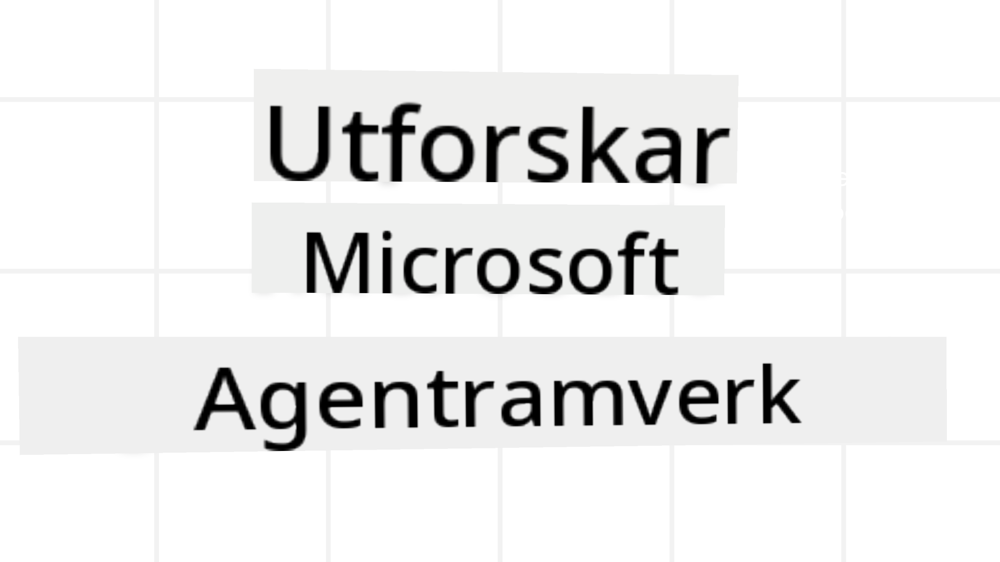
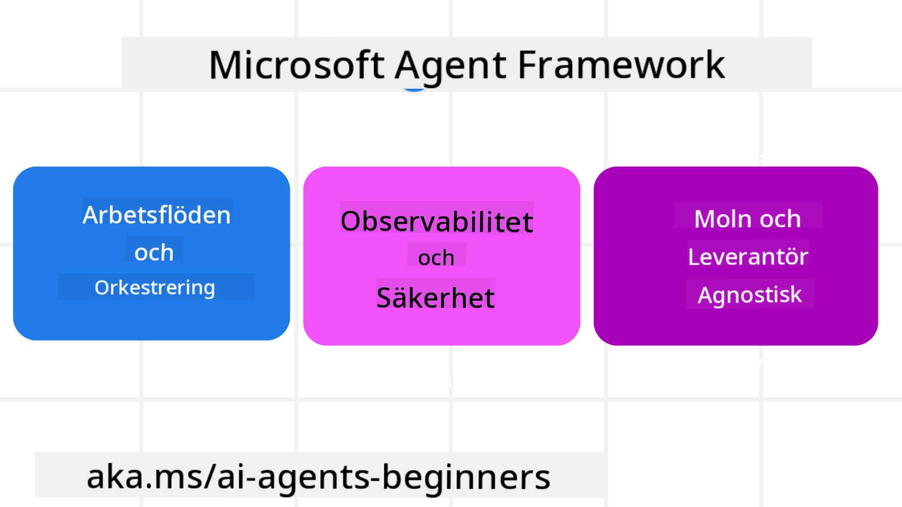

<!--
CO_OP_TRANSLATOR_METADATA:
{
  "original_hash": "19c4dab375acbc733855cc7f2f04edbc",
  "translation_date": "2025-10-02T15:43:30+00:00",
  "source_file": "14-microsoft-agent-framework/README.md",
  "language_code": "sv"
}
-->
# Utforska Microsoft Agent Framework



### Introduktion

Den här lektionen kommer att täcka:

- Förstå Microsoft Agent Framework: Nyckelfunktioner och värde  
- Utforska nyckelkoncepten i Microsoft Agent Framework
- Jämförelse mellan MAF, Semantic Kernel och AutoGen: Migreringsguide

## Lärandemål

Efter att ha slutfört denna lektion kommer du att kunna:

- Bygga produktionsklara AI-agenter med Microsoft Agent Framework
- Använda kärnfunktionerna i Microsoft Agent Framework för dina agentbaserade användningsfall
- Migrera och integrera befintliga agentbaserade ramverk och verktyg  

## Kodexempel 

Kodexempel för [Microsoft Agent Framework (MAF)](https://aka.ms/ai-agents-beginners/agent-framewrok) finns i detta repository under filerna `xx-python-agent-framework` och `xx-dotnet-agent-framework`.

## Förstå Microsoft Agent Framework



[Microsoft Agent Framework (MAF)](https://aka.ms/ai-agents-beginners/agent-framewrok) bygger på erfarenheter och lärdomar från Semantic Kernel och AutoGen. Det erbjuder flexibilitet för att hantera en mängd olika agentbaserade användningsfall som förekommer både i produktions- och forskningsmiljöer, inklusive:

- **Sekventiell agentorkestrering** i scenarier där steg-för-steg-arbetsflöden behövs.
- **Samtidig orkestrering** i scenarier där agenter behöver slutföra uppgifter samtidigt.
- **Gruppchattorkestrering** i scenarier där agenter kan samarbeta kring en uppgift.
- **Överlämningsorkestrering** i scenarier där agenter överlämnar uppgifter till varandra när deluppgifter är slutförda.
- **Magnetisk orkestrering** i scenarier där en manager-agent skapar och modifierar en uppgiftslista och hanterar koordineringen av underagenter för att slutföra uppgiften.

För att leverera AI-agenter i produktion har MAF också inkluderat funktioner för:

- **Observabilitet** genom användning av OpenTelemetry där varje åtgärd av AI-agenten, inklusive verktygsanrop, orkestreringssteg, resonemangsflöden och prestandaövervakning, kan spåras via Azure AI Foundry-dashboards.
- **Säkerhet** genom att agenter hostas nativt på Azure AI Foundry, vilket inkluderar säkerhetskontroller som rollbaserad åtkomst, hantering av privat data och inbyggd innehållssäkerhet.
- **Hållbarhet** eftersom agenttrådar och arbetsflöden kan pausas, återupptas och återhämta sig från fel, vilket möjliggör längre processer.
- **Kontroll** eftersom arbetsflöden med mänsklig inblandning stöds där uppgifter markeras som kräver mänskligt godkännande.

Microsoft Agent Framework fokuserar också på att vara interoperabel genom att:

- **Vara molnoberoende** - Agenter kan köras i containrar, lokalt och över flera olika moln.
- **Vara leverantörsoberoende** - Agenter kan skapas via din föredragna SDK, inklusive Azure OpenAI och OpenAI.
- **Integrera öppna standarder** - Agenter kan använda protokoll som Agent-to-Agent (A2A) och Model Context Protocol (MCP) för att upptäcka och använda andra agenter och verktyg.
- **Plugins och anslutningar** - Anslutningar kan göras till data- och minnestjänster som Microsoft Fabric, SharePoint, Pinecone och Qdrant.

Låt oss titta på hur dessa funktioner tillämpas på några av kärnkoncepten i Microsoft Agent Framework.

## Nyckelkoncept i Microsoft Agent Framework

### Agenter


**Skapa agenter**

Agenten skapas genom att definiera inferenstjänsten (LLM-leverantör), en uppsättning instruktioner för AI-agenten att följa och ett tilldelat `namn`:

```python
agent = AzureOpenAIChatClient(credential=AzureCliCredential()).create_agent( instructions="You are good at recommending trips to customers based on their preferences.", name="TripRecommender" )
```

Ovanstående använder `Azure OpenAI`, men agenter kan skapas med en mängd olika tjänster, inklusive `Azure AI Foundry Agent Service`:

```python
AzureAIAgentClient(async_credential=credential).create_agent( name="HelperAgent", instructions="You are a helpful assistant." ) as agent
```

OpenAI `Responses`, `ChatCompletion` APIs

```python
agent = OpenAIResponsesClient().create_agent( name="WeatherBot", instructions="You are a helpful weather assistant.", )
```

```python
agent = OpenAIChatClient().create_agent( name="HelpfulAssistant", instructions="You are a helpful assistant.", )
```

eller fjärragenter med hjälp av A2A-protokollet:

```python
agent = A2AAgent( name=agent_card.name, description=agent_card.description, agent_card=agent_card, url="https://your-a2a-agent-host" )
```

**Köra agenter**

Agenter körs med metoderna `.run` eller `.run_stream` för antingen icke-strömmande eller strömmande svar.

```python
result = await agent.run("What are good places to visit in Amsterdam?")
print(result.text)
```

```python
async for update in agent.run_stream("What are the good places to visit in Amsterdam?"):
    if update.text:
        print(update.text, end="", flush=True)

```

Varje agentkörning kan också ha alternativ för att anpassa parametrar som `max_tokens` som används av agenten, `tools` som agenten kan kalla och till och med själva `model` som används för agenten.

Detta är användbart i fall där specifika modeller eller verktyg krävs för att slutföra en användares uppgift.

**Verktyg**

Verktyg kan definieras både när agenten definieras:

```python
def get_attractions( location: Annotated[str, Field(description="The location to get the top tourist attractions for")], ) -> str: """Get the top tourist attractions for a given location.""" return f"The top attractions for {location} are." 


# When creating a ChatAgent directly 

agent = ChatAgent( chat_client=OpenAIChatClient(), instructions="You are a helpful assistant", tools=[get_attractions]

```

och även när agenten körs:

```python

result1 = await agent.run( "What's the best place to visit in Seattle?", tools=[get_attractions] # Tool provided for this run only )
```

**Agenttrådar**

Agenttrådar används för att hantera samtal med flera turer. Trådar kan skapas antingen genom:

- Att använda `get_new_thread()` som gör det möjligt att spara tråden över tid.
- Att skapa en tråd automatiskt när agenten körs och endast ha tråden kvar under den aktuella körningen.

För att skapa en tråd ser koden ut så här:

```python
# Create a new thread. 
thread = agent.get_new_thread() # Run the agent with the thread. 
response = await agent.run("Hello, I am here to help you book travel. Where would you like to go?", thread=thread)

```

Du kan sedan serialisera tråden för att lagra den för senare användning:

```python
# Create a new thread. 
thread = agent.get_new_thread() 

# Run the agent with the thread. 

response = await agent.run("Hello, how are you?", thread=thread) 

# Serialize the thread for storage. 

serialized_thread = await thread.serialize() 

# Deserialize the thread state after loading from storage. 

resumed_thread = await agent.deserialize_thread(serialized_thread)
```

**Agent Middleware**

Agenter interagerar med verktyg och LLMs för att slutföra användarens uppgifter. I vissa scenarier vill vi utföra eller spåra mellan dessa interaktioner. Agent-middleware gör det möjligt för oss att göra detta genom:

*Funktionsmiddleware*

Denna middleware gör det möjligt att utföra en åtgärd mellan agenten och ett verktyg/funktion som den kommer att kalla. Ett exempel på när detta skulle användas är när du kanske vill logga funktionens anrop.

I koden nedan definierar `next` om nästa middleware eller själva funktionen ska kallas.

```python
async def logging_function_middleware(
    context: FunctionInvocationContext,
    next: Callable[[FunctionInvocationContext], Awaitable[None]],
) -> None:
    """Function middleware that logs function execution."""
    # Pre-processing: Log before function execution
    print(f"[Function] Calling {context.function.name}")

    # Continue to next middleware or function execution
    await next(context)

    # Post-processing: Log after function execution
    print(f"[Function] {context.function.name} completed")
```

*Chattmiddleware*

Denna middleware gör det möjligt att utföra eller logga en åtgärd mellan agenten och begäranden mellan LLM.

Detta innehåller viktig information såsom `messages` som skickas till AI-tjänsten.

```python
async def logging_chat_middleware(
    context: ChatContext,
    next: Callable[[ChatContext], Awaitable[None]],
) -> None:
    """Chat middleware that logs AI interactions."""
    # Pre-processing: Log before AI call
    print(f"[Chat] Sending {len(context.messages)} messages to AI")

    # Continue to next middleware or AI service
    await next(context)

    # Post-processing: Log after AI response
    print("[Chat] AI response received")

```

**Agentminne**

Som täcks i lektionen `Agentic Memory` är minne en viktig del för att göra det möjligt för agenten att arbeta över olika kontexter. MAF erbjuder flera olika typer av minnen:

*Minneslagring*

Detta är minnet som lagras i trådar under applikationens körning.

```python
# Create a new thread. 
thread = agent.get_new_thread() # Run the agent with the thread. 
response = await agent.run("Hello, I am here to help you book travel. Where would you like to go?", thread=thread)
```

*Persistenta meddelanden*

Detta minne används när konversationshistorik lagras över olika sessioner. Det definieras med `chat_message_store_factory`:

```python
from agent_framework import ChatMessageStore

# Create a custom message store
def create_message_store():
    return ChatMessageStore()

agent = ChatAgent(
    chat_client=OpenAIChatClient(),
    instructions="You are a Travel assistant.",
    chat_message_store_factory=create_message_store
)

```

*Dynamiskt minne*

Detta minne läggs till i kontexten innan agenter körs. Dessa minnen kan lagras i externa tjänster som mem0:

```python
from agent_framework.mem0 import Mem0Provider

# Using Mem0 for advanced memory capabilities
memory_provider = Mem0Provider(
    api_key="your-mem0-api-key",
    user_id="user_123",
    application_id="my_app"
)

agent = ChatAgent(
    chat_client=OpenAIChatClient(),
    instructions="You are a helpful assistant with memory.",
    context_providers=memory_provider
)

```

**Agentobservabilitet**

Observabilitet är viktigt för att bygga pålitliga och underhållbara agentbaserade system. MAF integreras med OpenTelemetry för att tillhandahålla spårning och mätare för bättre observabilitet.

```python
from agent_framework.observability import get_tracer, get_meter

tracer = get_tracer()
meter = get_meter()
with tracer.start_as_current_span("my_custom_span"):
    # do something
    pass
counter = meter.create_counter("my_custom_counter")
counter.add(1, {"key": "value"})
```

### Arbetsflöden

MAF erbjuder arbetsflöden som är fördefinierade steg för att slutföra en uppgift och inkluderar AI-agenter som komponenter i dessa steg.

Arbetsflöden består av olika komponenter som möjliggör bättre kontrollflöde. Arbetsflöden möjliggör också **multi-agent orkestrering** och **checkpointing** för att spara arbetsflödesstatus.

De centrala komponenterna i ett arbetsflöde är:

**Exekutorer**

Exekutorer tar emot inmatningsmeddelanden, utför sina tilldelade uppgifter och producerar sedan ett utmatningsmeddelande. Detta för arbetsflödet framåt mot att slutföra den större uppgiften. Exekutorer kan vara antingen AI-agenter eller anpassad logik.

**Kanter**

Kanter används för att definiera flödet av meddelanden i ett arbetsflöde. Dessa kan vara:

*Direkta kanter* - Enkla en-till-en-anslutningar mellan exekutorer:

```python
from agent_framework import WorkflowBuilder

builder = WorkflowBuilder()
builder.add_edge(source_executor, target_executor)
builder.set_start_executor(source_executor)
workflow = builder.build()
```

*Villkorliga kanter* - Aktiveras efter att ett visst villkor är uppfyllt. Till exempel, när hotellrum är otillgängliga kan en exekutor föreslå andra alternativ.

*Switch-case kanter* - Riktar meddelanden till olika exekutorer baserat på definierade villkor. Till exempel, om en resenär har prioriterad åtkomst och deras uppgifter hanteras genom ett annat arbetsflöde.

*Fan-out kanter* - Skickar ett meddelande till flera mål.

*Fan-in kanter* - Samlar flera meddelanden från olika exekutorer och skickar till ett mål.

**Händelser**

För att ge bättre observabilitet i arbetsflöden erbjuder MAF inbyggda händelser för exekvering, inklusive:

- `WorkflowStartedEvent`  - Arbetsflödet börjar exekveras
- `WorkflowOutputEvent` - Arbetsflödet producerar ett utmatningsmeddelande
- `WorkflowErrorEvent` - Arbetsflödet stöter på ett fel
- `ExecutorInvokeEvent`  - Exekutorn börjar bearbeta
- `ExecutorCompleteEvent`  - Exekutorn avslutar bearbetningen
- `RequestInfoEvent` - En begäran utfärdas

## Migrering från andra ramverk (Semantic Kernel och AutoGen)

### Skillnader mellan MAF och Semantic Kernel

**Förenklad agentskapande**

Semantic Kernel kräver att en Kernel-instans skapas för varje agent. MAF använder en förenklad metod genom att använda extensioner för de huvudsakliga leverantörerna.

```python
agent = AzureOpenAIChatClient(credential=AzureCliCredential()).create_agent( instructions="You are good at reccomending trips to customers based on their preferences.", name="TripRecommender" )
```

**Agenttrådskapande**

Semantic Kernel kräver att trådar skapas manuellt. I MAF tilldelas agenten direkt en tråd.

```python
thread = agent.get_new_thread() # Run the agent with the thread. 
```

**Verktygsregistrering**

I Semantic Kernel registreras verktyg till Kernel och Kernel skickas sedan till agenten. I MAF registreras verktyg direkt under agentens skapandeprocess.

```python
agent = ChatAgent( chat_client=OpenAIChatClient(), instructions="You are a helpful assistant", tools=[get_attractions]
```

### Skillnader mellan MAF och AutoGen

**Teams vs Arbetsflöden**

`Teams` är strukturen för händelsedriven aktivitet med agenter i AutoGen. MAF använder `Workflows` som dirigerar data till exekutorer genom en grafbaserad arkitektur.

**Verktygsskapande**

AutoGen använder `FunctionTool` för att kapsla in funktioner som agenter kan kalla. MAF använder @ai_function som fungerar på liknande sätt men också automatiskt tolkar scheman för varje funktion.

**Agentbeteende**

Agenter är som standard en-turs agenter i AutoGen om inte `max_tool_iterations` ställs in på ett högre värde. Inom MAF är `ChatAgent` som standard en multi-turs agent, vilket innebär att den fortsätter att kalla verktyg tills användarens uppgift är slutförd.

## Kodexempel 

Kodexempel för Microsoft Agent Framework finns i detta repository under filerna `xx-python-agent-framework` och `xx-dotnet-agent-framework`.

## Har du fler frågor om Microsoft Agent Framework?

Gå med i [Azure AI Foundry Discord](https://aka.ms/ai-agents/discord) för att träffa andra elever, delta i öppet hus och få svar på dina frågor om AI-agenter.

---

**Ansvarsfriskrivning**:  
Detta dokument har översatts med hjälp av AI-översättningstjänsten [Co-op Translator](https://github.com/Azure/co-op-translator). Även om vi strävar efter noggrannhet, bör det noteras att automatiska översättningar kan innehålla fel eller felaktigheter. Det ursprungliga dokumentet på dess originalspråk bör betraktas som den auktoritativa källan. För kritisk information rekommenderas professionell mänsklig översättning. Vi ansvarar inte för eventuella missförstånd eller feltolkningar som uppstår vid användning av denna översättning.