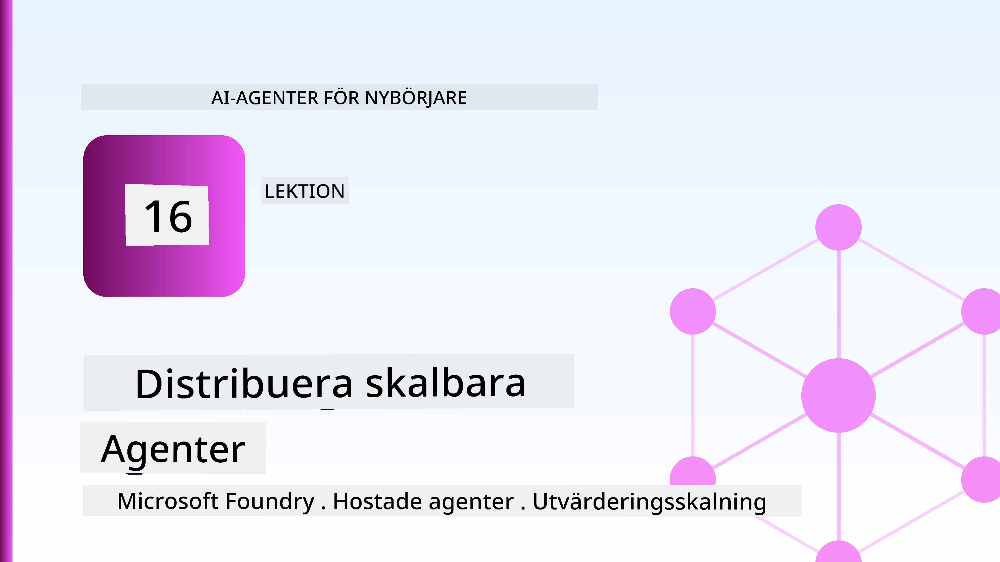
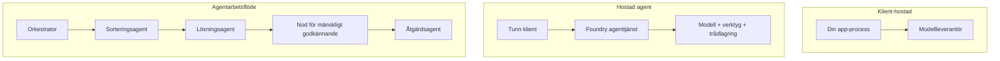
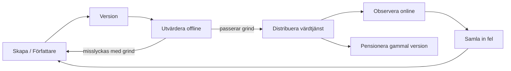
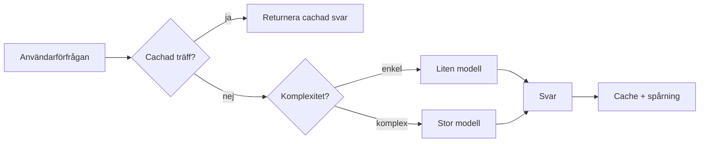
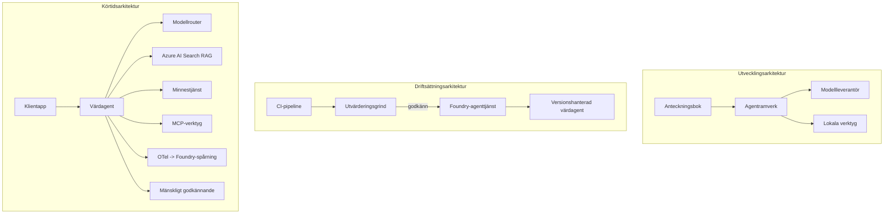

# Distribuera skalbara agenter med Microsoft Foundry



Hittills i kursen har du byggt agenter som körs på din bärbara dator, inuti en notebook, styrda av `az login` och några miljövariabler. Det är precis rätt sätt att lära sig. Det är inte rätt sätt att köra en agent som tusentals kunder är beroende av klockan 3 på morgonen.

Den här lektionen handlar om klyftan mellan "det fungerar på min maskin" och "det fungerar, pålitligt och prisvärt, i produktion." Vi stänger den klyftan med **Microsoft Foundry** och **Microsoft Foundry Agent Service**, och gör det genom att bygga en riktig kundsupportagent som har verktyg, hämtning, minne, utvärdering och övervakning.

## Introduktion

Den här lektionen kommer att täcka:

- Skillnaden mellan en **prototypagent** och en **distribuerad agent**, och varför övergången främst handlar om allt *runt* modellen.
- **Distributionsmönster** för agenter: klient-hostad, tjänste-hostad (Hosted Agents) och arbetsflödesorkestrerad.
- **Agentens livscykel** på Microsoft Foundry — skapa, versionera, distribuera, utvärdera, observera, ta ur bruk.
- **Skaleringsstrategier**: modellriktning, caching, samtidighet och stateless design.
- **Observerbarhet** med OpenTelemetry och Foundry-spårning.
- **Kostnadsoptimering** genom modellval, riktning och utvärderingsgrindar.
- **Företagsöverväganden**: styrning, mänskligt godkännande och att köra MCP-servrar säkert i produktion.

## Lärandemål

Efter att ha slutfört denna lektion kommer du att kunna:

- Välja rätt distributionsmönster för en given agentbelastning.
- Distribuera en agent till Microsoft Foundry Agent Service så att den är versionerad, styrd och observerbar.
- Instrumentera en agent för spårning och koppla in en utvärderingspipeliner som körs före varje release.
- Tillämpa modellriktning och caching för att hålla latens och kostnad under kontroll i skala.
- Lägg till en grind för mänskligt godkännande för högriskåtgärder och integrera en MCP-server på ett produktionssäkert sätt.

## Förkunskaper

Den här lektionen förutsätter att du har slutfört tidigare lektioner och är bekväm med:

- Att bygga agenter med [Microsoft Agent Framework](../14-microsoft-agent-framework/README.md) (Lektion 14).
- [Verktygsanvändning](../04-tool-use/README.md) (Lektion 4) och [Agentic RAG](../05-agentic-rag/README.md) (Lektion 5).
- [Agentminne](../13-agent-memory/README.md) (Lektion 13) och [Agentic Protocols / MCP](../11-agentic-protocols/README.md) (Lektion 11).
- [Observerbarhet och utvärdering](../10-ai-agents-production/README.md) (Lektion 10) — den här lektionen bygger direkt på den.

Du behöver också:

- En **Azure-prenumeration** och ett **Microsoft Foundry-projekt** med minst en distribuerad chattmodell.
- Den **Azure CLI** autentiserad (`az login`).
- Python 3.12+ och paketen i repositoryt [`requirements.txt`](../../../requirements.txt).

## Från prototyp till produktion: Vad som egentligen ändras

En prototypagent och en produktionsagent delar samma kärnloop — resonera, anropa verktyg, svara. Det som ändras är allt runt omkring loopen. Modellen är kanske 20 % av en produktionsagent; de andra 80 % är det operativa skelettet.

| Fråga | Prototyp | Produktion |
| --- | --- | --- |
| **Hosting** | Körs i din notebook | Körs som en hostad tjänst, versionerad och utrullad |
| **Identitet** | Din `az login`-token | Hanterad identitet med scoped RBAC |
| **Tillstånd** | I minnet, går förlorat vid omstart | Externiserat (thread store, minnestjänst) |
| **Fel** | Du ser stacktrace | Försök igen, fallback, dead-letter, varningar |
| **Kostnad** | "Det är några cent" | Spåras per förfrågan, dirigeras, cachas, budgeteras |
| **Kvalitet** | Du granskar själv utdata | Utvärderas automatiskt före varje release |
| **Förtroende** | Du godkänner varje åtgärd | Policy + människa-i-loop för riskabla åtgärder |

Håll denna tabell i minnet. Varje avsnitt nedan motsvarar en av dessa rader.

## Distributionsmönster för agent

Det finns tre mönster du kommer använda, ofta i kombination.

### 1. Klient-hostade agenter

Agent-objektet lever inuti *din* applikationsprocess. Din kod anropar modellleverantören direkt; resonansloopen körs i din tjänst. Detta är vad varje tidigare lektion har gjort.

- **Använd det när** du behöver full kontroll över loopen, anpassad middleware eller när du bäddar in agenten i en befintlig backend.
- **Avvägning**: du ansvarar själv för skalning, tillstånd och motståndskraft.

### 2. Hostade agenter (Foundry Agent Service)

Agenten är *registrerad som en resurs* i Microsoft Foundry. Foundry hostar resonansloopen, lagrar trådar, upprätthåller innehållssäkerhet och RBAC, och gör agenten synlig i Foundry-portalen. Din app blir en tunn klient som skapar trådar och läser svar.

- **Använd det när** du vill ha uthållighet, inbyggd observerbarhet, styrning och mindre operativ yta.
- **Avvägning**: mindre låg-nivå kontroll i utbyte mot en hanterad runtime.

### 3. Agent-arbetsflöden

Flera agenter (och verktyg) komponeras till en graf med explicit kontrollflöde — sekventiella steg, förgreningar, mänskliga godkännandenoder och uthålliga checkpointar som kan pausa och återupptas. Detta är Microsoft Agent Frameworks **Workflows**-funktionalitet tillämpad i distributionsskala.

- **Använd det när** en enda uppgift omfattar flera specialiserade agenter eller kräver ett godkännandesteg i mitten.
- **Avvägning**: fler rörliga delar; kräver observerbarhet på orkestreringsnivå.



## Agentens livscykel på Microsoft Foundry

Att distribuera en agent är inte en engångs-`push`. Det är en loop som liknar en mjukvarureleasecykel eftersom det är precis vad det är.



Huvudidén, vidareförd från [Lektion 10](../10-ai-agents-production/README.md): **offline-utvärdering är en grind, inte en eftertanke.** En ny agentversion skickas inte ut om den inte klarar dina utvärderingströsklar. Online-observerbarhet matar sedan verkliga fel tillbaka till din offline-testuppsättning. Det är hela loopen.

## Skaleringsstrategier

Att skala en agent skiljer sig från att skala ett stateless webb-API, eftersom varje förfrågan kan trigga flera kostsamma modell- och verktygsanrop. Fyra tekniker bär mest av belastningen.

**Stateless förfråghantering.** Behåll inget per-användar-tillstånd i din processminne. Spara samtalstrådar i Foundrys thread store eller en minnestjänst så vilken instans som helst kan hantera vilken förfrågan som helst. Detta gör att du kan skala horisontellt — lägg till instanser, inga sticky sessions.

**Modellriktning.** Inte varje förfrågan behöver din mest kapabla (och dyraste) modell. Rikta enkla förfrågningar — avsiktsklassificering, korta faktabaserade svar — till en liten, snabb modell, och reservera den stora modellen för verkligt resonemang. Foundrys **Model Router** kan göra detta åt dig, eller så kan du implementera en lätt klassificerare själv. Du kommer att bygga DIY-versionen i labbet.

**Svarscaching.** Många supportfrågor är nästan lika ("hur återställer jag mitt lösenord?"). Cachelagra svar på vanliga frågor och leverera dem utan att anropa modellen alls. Även en modest cachning minskar kostnader och latens avsevärt.

**Samtidighet och backpressure.** Modellleverantörer har frekvensbegränsningar. Begränsa samtidig arbete, använd omförsök med exponentiell backoff och misslyckas elegant (ett köat "vi jobbar på det"-svar är bättre än en 500).



## Observerbarhet i produktion

Du kan inte styra vad du inte kan se. Som täcks i Lektion 10, sänder Microsoft Agent Framework **OpenTelemetry**-spårningar nativt — varje modellanrop, verktygsanrop och orkestreringssteg blir ett span. I produktion exporterar du dessa span till Microsoft Foundry (eller vilken OTel-kompatibel backend som helst) så att du kan:

- Spåra ett enskilt kundklagomål från början till slut över varje modell- och verktygsanrop.
- Följa p50/p95-latens och kostnad per förfrågan över tid.
- Larma vid felspikar och kostnadsavvikelser innan dina användare (eller din ekonomiavdelning) märker det.

```python
from agent_framework.observability import get_tracer

tracer = get_tracer()

with tracer.start_as_current_span("support_request") as span:
    span.set_attribute("customer.tier", "enterprise")
    span.set_attribute("routed.model", "gpt-5-nano")
    # agentens körning spåras automatiskt inom detta spann
```

Attribut som `customer.tier` och `routed.model` är vad som förvandlar en vägg av spårningar till besvarbara frågor ("blir företagskunder för ofta skickade till den lilla modellen?").

## Kostnadsoptimering

Kostnaden i produktionsagenter domineras av tokens. Tre spakar, i ordning efter påverkan:

1. **Rätt storlek på modellen.** En liten modell som passerar din utvärderingsgrind är nästan alltid billigare än en stor som också passerar. Använd utvärdering för att *bevisa* att den lilla modellen är tillräcklig istället för att av försiktighet standardmässigt välja den största modellen.
2. **Rikta efter komplexitet.** Som ovan — betala stor-modell-priser bara för förfrågningar som behöver stor-modell-resonemang.
3. **Aggressiv caching.** Det billigaste modellanropet är det du aldrig gör.

Utvärderingsgrindar och kostnadskontroll är samma disciplin ur två vinklar: utvärdering säger dig *kvalitetsgolvet*, riktning och caching håller dig så nära det golvets *kostnad* som möjligt.

## Företagsdistribution Överväganden

**Styrning.** Hosted Agents ärver Foundrys RBAC, innehållssäkerhet och revisionsloggning. Ge varje agent en hanterad identitet med minsta privilegier som behövs — endast läsbehörighet till kunskapsbasen, begränsad åtkomst till ärende-API:et, inget mer.

**Människa-i-loop.** Vissa åtgärder är för viktiga för att automatisera helt — utfärda återbetalning, radera konto, eskalera till juridiskt team. Microsoft Agent Framework stöder **godkännande-krävande** verktyg: agenten föreslår åtgärden, utförandet pausas, en människa godkänner eller avvisar, och arbetsflödet fortsätter. Du såg primitivet i [Lektion 6](../06-building-trustworthy-agents/README.md); här distribuerar du det.

**MCP i produktion.** [MCP](../11-agentic-protocols/README.md) låter din agent konsumera externa verktyg via en standardgränssnitt. I produktion, behandla varje MCP-server som en opålitlig gräns: lås serverversionen, kör den med begränsad identitet, validera dess utdata och exponera aldrig hemligheter för den. En MCP-server är ett beroende, och beroenden patchas, granskas och frekvensbegränsas.



De tre diagrammen — utveckling, distribution, runtime — är samma agent i tre stadier av dess liv. Labbet som följer går igenom att bygga den.

## Praktiskt labb: En produktionsklar kundsupportagent

Öppna [`code_samples/16-python-agent-framework.ipynb`](./code_samples/16-python-agent-framework.ipynb) och arbeta igenom den från början till slut. Du kommer att montera en **Contoso kundsupportagent** med varje produktionsaspekt inbäddad:

1. **Verktygsanrop** — slå upp orderstatus och öppna supportsärenden.
2. **RAG** — besvara policyfrågor från en kunskapsbas (Azure AI Search, med en minnesbaserad fallback så notebooken kan köras utan en Search-resurs).
3. **Minne** — kom ihåg kunden över konversationsvändningar.
4. **Modellriktning** — en komplexitetsklassificerare dirigerar varje förfrågan till liten eller stor modell.
5. **Svarscaching** — upprepade frågor serveras från cache.
6. **Mänskligt godkännande** — återbetalningar över en tröskel pausas för människogodkännande.
7. **Utvärderingspipeline** — en liten offline-testuppsättning poängsätter agenten och fungerar som en releasegrind.
8. **Observerbarhet** — OpenTelemetry-spårning kring varje förfrågan.

### Genomgång

Notebooken är organiserad så varje produktionsaspekt är en självständig, körbar sektion. Hjärtat är begäran-hanteraren med routing plus caching:

```python
async def handle_support_request(query: str, customer_id: str) -> str:
    # 1. Leverera från cache när vi kan.
    cached = response_cache.get(normalize(query))
    if cached:
        return cached

    # 2. Rutt efter komplexitet för att kontrollera kostnad.
    model = "gpt-5-nano" if is_simple(query) else "gpt-5-mini"

    # 3. Kör agenten inom ett spårspann för observerbarhet.
    with tracer.start_as_current_span("support_request") as span:
        span.set_attribute("routed.model", model)
        span.set_attribute("customer.id", customer_id)
        response = await support_agent.run(query, model=model)

    # 4. Cachera och returnera.
    response_cache.set(normalize(query), response.text)
    return response.text
```

Utvärderingsgrinden som skyddar en release ser ut så här:

```python
async def evaluation_gate(agent, test_cases, threshold: float = 0.8) -> bool:
    passed = 0
    for case in test_cases:
        result = await agent.run(case["input"])
        if score_response(result.text, case["expected"]) >= 0.8:
            passed += 1
    pass_rate = passed / len(test_cases)
    print(f"Evaluation pass rate: {pass_rate:.0%} (gate: {threshold:.0%})")
    return pass_rate >= threshold  # distribuera endast om grindpasseringen lyckas
```

Läs varje rad — notebooken håller primitivt småt så inget är dolt bakom ramverksanrop.

## Validera en distribuerad agent med Smoke Tests

Utvärderingsgrinden ovan körs *offline* mot ditt agentobjekt. När agenten distribueras som en Hosted Agent behöver du en till, ännu billigare kontroll: **svarar den distribuerade slutpunkten egentligen?**

Att distribuera "framgångsrikt" bevisar bara att kontrollplanet accepterade definitionen — det bevisar inte att agenten svarar. Ett saknat beroende, en dålig modellriktning eller en utgången anslutning kan lämna en grön distribution som inte returnerar något. Ett **smoke-test** fångar det på sekunder, vid varje distribution, utan kostnaden av en full utvärdering.

Detta repository levererar en färdig att använda smoke-test pipeline byggd på [AI Smoke Test](https://github.com/marketplace/actions/ai-smoke-test) GitHub Action:

- **Katalog** — [`tests/lesson-16-smoke-tests.json`](../../../tests/lesson-16-smoke-tests.json) innehåller promptar och påståenden för Contoso:s supportagent (grundade policy-svar, en orderuppslagning, att hålla sig ämnesfokuserad och flervändnings-trådkontinuitet). Kataloger för andra lektioners agenter finns parallellt — se [`tests/README.md`](../tests/README.md).
- **Arbetsflöde** — [`.github/workflows/smoke-test.yml`](../../../.github/workflows/smoke-test.yml) loggar in med Azure OIDC och POSTar varje prompt till agentens Responses-endpoint, och misslyckas med jobbet vid någon påståendefel.

```yaml
- name: Smoke-test hosted agent
  uses: JFolberth/ai-smoketest@v1
  with:
    project_endpoint: ${{ inputs.project_endpoint }}
    agent_name: ContosoSupportAgent
    tests_file: tests/lesson-16-smoke-tests.json
```


Kör det från fliken **Actions** när din agent är distribuerad, och ange din Foundry-projektendpoint och agentnamn. Den federerade identiteten behöver rollen **Azure AI User** på Foundry-projektsnivå. Tänk på lagren som en pyramid: röktester (åtkomliga och svarar?) körs vid varje distribution, offlineutvärdering (tillräckligt bra för leverans?) körs innan befordran, och onlineutvärdering (hur går det i verkligheten?) körs kontinuerligt.

## Kunskapskontroll

Testa din förståelse innan du går vidare till uppgiften.

**1. Ungefär hur stor del av en produktionsagent är "modellen" och vad består resten av?**

<details>
<summary>Svar</summary>

Modellen är en minoritet i systemet – ofta angiven som cirka 20%. Resten är det operationella skelettet: hosting och versionshantering, identitet och RBAC, externlagrad status, felhantering, kostnadsspårning, utvärdering och mänsklig-in-the-loop-kontroller. Att gå till produktion handlar mest om att bygga allt *runt* resonemangsloopen.
</details>

**2. När skulle du välja en Hostad Agent framför en klienthostad agent?**

<details>
<summary>Svar</summary>

När du vill ha en hanterad runtime med inbyggd hållbarhet (trådar som bevaras och kan återupptas), möjligheter till observabilitet, innehållssäkerhet och RBAC, och du är villig att byta lite låg-nivå kontroll över resonemangsloopen mot mindre operativ yta. Klienthostad är att föredra när du behöver full kontroll över loopen eller inbäddar agenten i en befintlig backend.
</details>

**3. Varför måste en skalbar agent vara stateless i sin egen processminne?**

<details>
<summary>Svar</summary>

Så att vilken instans som helst kan hantera vilken förfrågan som helst, vilket möjliggör horisontell skalning utan "sticky sessions". Per-användarsamtalets status externlagras till en trådlagrings- eller minnestjänst. Om status fanns i processminnet skulle du förlora den vid omstart och inte kunna fördela belastning fritt.
</details>

**4. Vilket problem löser modell-routing och hur relaterar det till utvärdering?**

<details>
<summary>Svar</summary>

Routing skickar enkla förfrågningar till en liten, billig, snabb modell och reserverar den stora modellen för äkta resonemang, vilket styr både latens och kostnad. Det relaterar till utvärdering eftersom utvärdering är vad som *bevisar* att den lilla modellen är tillräckligt bra för en viss kategori förfrågningar — routing utan utvärdering är gissning.
</details>

**5. Vad är en "utvärderingsgrind" och var sitter den i livscykeln?**

<details>
<summary>Svar</summary>

En utvärderingsgrind kör ett offline-testset mot en ny agentversion och blockerar distributionen om inte godkännandefrekvensen överstiger en tröskel. Den sitter mellan "version" och "distribution" i livscykeln och gör kvalitet till en förutsättning för release snarare än något du kollar efter leverans.
</details>

**6. Varför bör en MCP-server behandlas som en opålitlig gräns i produktion?**

<details>
<summary>Svar</summary>

För att det är ett externt beroende som din agent anropar. Du bör spika dess version, köra den med en avgränsad identitet, validera dess utdata, sätta tak på anrop, och aldrig exponera hemligheter för den – samma disciplin som du tillämpar på alla tredjepartsberoenden. Dess utdata påverkar din agents resonemang, så icke-validerat förtroende är en säkerhetsrisk.
</details>

**7. Vilken enskild förändring brukar ha störst påverkan på produktionsagentens kostnad och varför?**

<details>
<summary>Svar</summary>

Rättdimensionering av modellen — använda den minsta modellen som ändå klarar din utvärderingsgrind. Kostnaden domineras av tokens, och en mindre modell som möter kvalitetskravet är nästan alltid billigare än en större. Cachning och routing minskar kostnaden ytterligare, men valet av rätt basmodell har störst grundläggande effekt.
</details>

**8. Vilken roll spelar spännviddsattribut som `customer.tier` och `routed.model` i observabilitet?**

<details>
<summary>Svar</summary>

De förvandlar råa spår till möjliga affärsfrågor att besvara. Utan attribut har du en vägg av spans; med dem kan du till exempel fråga "skickas företagskunder till den lilla modellen för ofta?" eller "vilken modell hanterar våra långsammaste förfrågningar?" Attribut är hur du segmenterar telemetrin efter de dimensioner som är viktiga för din verksamhet.
</details>

## Uppgift

Ta kundsupportagenten från labbet och förstärk den för ett specifikt scenario: **en prenumerationsfaktureringsagent för ett SaaS-företag.**

Din inlämning ska:

1. **Byt ut verktygen** mot faktureringsrelevanta: `get_subscription_status`, `get_invoice` och `issue_credit` (krediter över 50$ kräver mänskligt godkännande).
2. **Lägg till tre RAG-dokument** som täcker företagets återbetalningspolicy, faktureringscykel och avbokningspolicy.
3. **Utöka utvärderingssetet** till minst åtta fall, inklusive minst två som *bör* trigga vägen för mänskligt godkännande, och verifiera att din utvärderingsgrind korrekt godkänner eller misslyckas.
4. **Lägg till en kostnadsrapport**: efter att ha kört tio blandade frågor genom agenten, skriv ut hur många som gick till den lilla modellen, hur många till den stora modellen och hur många som serverades från cache.

Skriv en kort paragraf (i en markdowncell) som förklarar vilken modell-routingregel du valde och hur du skulle validera den med verklig trafik. Det finns inget enda rätt svar – du bedöms på om produktionsaspekterna är kopplade samman sammanhängande.

## Sammanfattning

I den här lektionen tog du en agent från prototyp till produktion med Microsoft Foundry:

- Steget till produktion handlar mest om **det operationella skelettet** runt modellen – hosting, identitet, status, felhantering, kostnad, kvalitet och förtroende.
- Du lärde dig de tre **distributionsmönstren** – klienthostad, Hostade Agenter och Agentarbetsflöden – och när varje passar.
- Du gick igenom **agentens livscykel**, där offline **utvärdering fungerar som en releasegrind** och online-observabilitet matar tillbaka fel till testsetet.
- Du tillämpade **skalningsstrategier** – stateless design, modell-routing, cachning och begränsad samtidighet – och kopplade dem till **kostnadsoptimering**.
- Du kopplade in **företagskontroller**: RBAC, mänsklig-in-the-loop-godkännande och produktionssäker MCP-integration.
- Du byggde en **produktionsklar kundsupportagent** som binder samman alla dessa aspekter i körbar kod.

Nästa lektion tar motsatt väg: istället för att skala upp agenter i molnet kommer du att flytta ner dem till en enda utvecklarmaskin och köra dem helt lokalt.

## Ytterligare resurser

- <a href="https://learn.microsoft.com/azure/ai-foundry/what-is-azure-ai-foundry" target="_blank">Microsoft Foundry-dokumentation</a>
- <a href="https://learn.microsoft.com/azure/ai-foundry/agents/overview" target="_blank">Översikt över Microsoft Foundry Agent Service</a>
- <a href="https://learn.microsoft.com/en-us/agent-framework/overview/?wt.mc_id=youtube_26688_organicsocial_reactor&pivots=programming-language-python" target="_blank">Microsoft Agent Framework</a>
- <a href="https://learn.microsoft.com/azure/ai-foundry/concepts/model-router" target="_blank">Model Router i Microsoft Foundry</a>
- <a href="https://learn.microsoft.com/azure/search/search-what-is-azure-search" target="_blank">Azure AI Search</a>
- <a href="https://opentelemetry.io/" target="_blank">OpenTelemetry</a>
- <a href="https://github.com/marketplace/actions/ai-smoke-test" target="_blank">AI Smoke Test GitHub Action</a>
- <a href="https://modelcontextprotocol.io/" target="_blank">Model Context Protocol (MCP)</a>

## Föregående lektion

[Bygga datoranvändaragenter (CUA)](../15-browser-use/README.md)

## Nästa lektion

[Skapa lokala AI-agenter](../17-creating-local-ai-agents/README.md)

---

<!-- CO-OP TRANSLATOR DISCLAIMER START -->
**Ansvarsfriskrivning**:
Detta dokument har översatts med hjälp av AI-översättningstjänsten [Co-op Translator](https://github.com/Azure/co-op-translator). Även om vi strävar efter noggrannhet, var vänlig notera att automatiska översättningar kan innehålla fel eller brister. Det ursprungliga dokumentet på dess modersmål bör betraktas som den auktoritativa källan. För kritisk information rekommenderas professionell mänsklig översättning. Vi ansvarar inte för några missförstånd eller feltolkningar som uppstår till följd av användningen av denna översättning.
<!-- CO-OP TRANSLATOR DISCLAIMER END -->