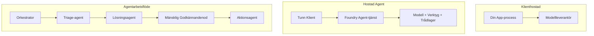
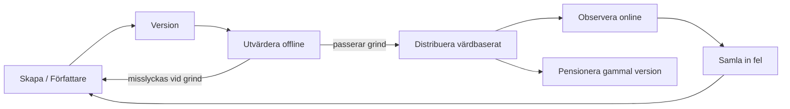
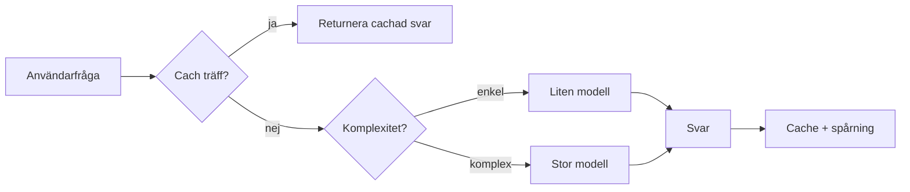
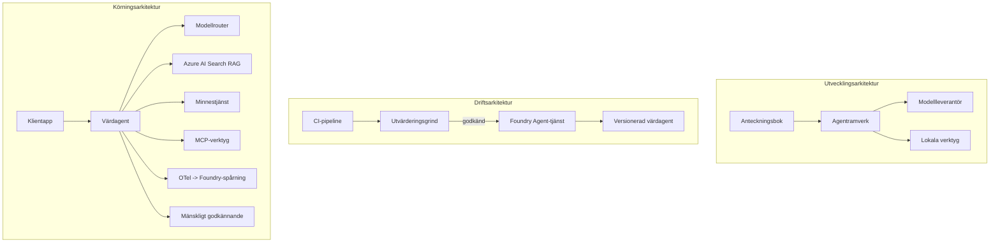

# Distribuera skalbara agenter med Microsoft Foundry


Fram till denna punkt i kursen har du byggt agenter som körs på din bärbara dator, inuti en notebook, drivna av `az login` och ett par miljövariabler. Det är precis rätt sätt att lära sig på. Det är inte rätt sätt att köra en agent som tusentals kunder är beroende av klockan 3 på morgonen.

Denna lektion handlar om gapet mellan "det fungerar på min maskin" och "det fungerar, pålitligt och prisvärt, i produktion." Vi stänger det gapet med hjälp av **Microsoft Foundry** och **Microsoft Foundry Agent Service**, och vi gör det genom att bygga en riktig kundsupportagent som har verktyg, hämtning, minne, utvärdering och övervakning.

## Introduktion

Den här lektionen kommer att täcka:

- Skillnaden mellan en **prototype-agent** och en **distribuerad agent**, och varför övergången mest handlar om allt *runtomkring* modellen.
- **Distribueringsmönster** för agenter: klienthostad, tjänstehostad (Hosted Agents) och arbetsflödesorkestrerad.
- **Agentens livscykel** på Microsoft Foundry — skapa, versionera, distribuera, utvärdera, observera, pensionera.
- **Skalningsstrategier**: modellruttning, caching, samtidighet och stateless design.
- **Observerbarhet** med OpenTelemetry och Foundry-spårning.
- **Kostnadsoptimering** genom modellval, ruttning och utvärderingsgrindar.
- **Företagsöverväganden**: styrning, mänskligt godkännande och att köra MCP-servrar säkert i produktion.

## Lärandemål

Efter att ha genomfört denna lektion kommer du att veta hur man:

- Väljer rätt distribueringsmönster för en given agentbelastning.
- Distribuerar en agent till Microsoft Foundry Agent Service så att den versioneras, styrs och är observerbar.
- Instrumenterar en agent för spårning och kopplar ihop en utvärderingspipeline som körs före varje release.
- Använder modellruttning och caching för att hålla latens och kostnad under kontroll i skala.
- Lägger till en grind för mänskligt godkännande för högriskåtgärder och integrerar en MCP-server på ett produktionssäkert sätt.

## Förkunskaper

Denna lektion förutsätter att du har slutfört tidigare lektioner och är bekväm med:

- Att bygga agenter med [Microsoft Agent Framework](../14-microsoft-agent-framework/README.md) (Lektion 14).
- [Verktygsanvändning](../04-tool-use/README.md) (Lektion 4) och [Agentic RAG](../05-agentic-rag/README.md) (Lektion 5).
- [Agentminne](../13-agent-memory/README.md) (Lektion 13) och [Agentic Protocols / MCP](../11-agentic-protocols/README.md) (Lektion 11).
- [Observerbarhet och utvärdering](../10-ai-agents-production/README.md) (Lektion 10) — denna lektion bygger direkt vidare på den.

Du kommer också behöva:

- Ett **Azure-prenumeration** och ett **Microsoft Foundry-projekt** med minst en distribuerad chattmodell.
- Autentiserat **Azure CLI** (`az login`).
- Python 3.12+ och paketen i repositoryn [`requirements.txt`](../../../requirements.txt).

## Från prototyp till produktion: vad förändras egentligen

En prototype-agent och en produktionsagent delar samma kärnloop — resonera, anropa verktyg, svara. Vad som förändras är allt runt omkring den loopen. Modellen är kanske 20 % av en produktionsagent; de andra 80 % är den operativa skeletten.

| Aspekt | Prototyp | Produktion |
| --- | --- | --- |
| **Hosting** | Körs i din notebook | Körs som en hostad tjänst, versioneras och rullas ut |
| **Identitet** | Din `az login`-token | Hanterad identitet med scoped RBAC |
| **State** | I minnet, förloras vid omstart | Extern lagring (trådstore, minnestjänst) |
| **Felhantering** | Du ser tracebaken | Omgångsförsök, fallback, dead-letter, larm |
| **Kostnad** | "Det är några cent" | Spåras per förfrågan, ruttas, cachelagras, budgeteras |
| **Kvalitet** | Du granskar resultaten | Utvärderas automatiskt före varje release |
| **Förtroende** | Du godkänner varje åtgärd | Policy + människa i loopen för riskfyllda åtgärder |

Ha denna tabell i åtanke. Varje sektion nedan motsvarar en av dessa rader.

## Agent-distribueringsmönster

Det finns tre mönster du kommer använda, ofta i kombination.

### 1. Klienthostade agenter

Agentobjektet lever inuti *din* applikationsprocess. Din kod anropar modellleverantören direkt; resonemangsloopen körs i din tjänst. Det här är vad varje tidigare lektion har gjort.

- **Använd när** du behöver full kontroll över loopen, specialanpassad middleware eller att bädda in agenten i en befintlig backend.
- **Nackdel**: du ansvarar själv för skalning, state och motståndskraft.

### 2. Hostade agenter (Foundry Agent Service)

Agenten är *registrerad som en resurs* i Microsoft Foundry. Foundry hostar resonemangsloopen, lagrar trådar, upprätthåller innehållssäkerhet och RBAC, och gör agenten synlig i Foundry-portalen. Din app blir en tunn klient som skapar trådar och läser svar.

- **Använd när** du vill ha uthållighet, inbyggd observerbarhet, styrning och mindre operativ yta.
- **Nackdel**: mindre låg-nivå kontroll i utbyte mot en hanterad runtime.

### 3. Agentarbetsflöden

Flera agenter (och verktyg) är sammansatta i en graf med explicit kontrollflöde — sekventiella steg, förgrening, mänskliga godkännandenoder och hållbara checkpoints som kan pausas och återupptas. Detta är Microsoft Agent Frameworks **Workflows**-funktion tillämpad i distributionsskala.

- **Använd när** en enskild uppgift spänner över flera specialiserade agenter eller kräver ett godkännande mitt i.
- **Nackdel**: fler rörliga delar; kräver orkestreringsnivå observerbarhet.



## Agentens livscykel på Microsoft Foundry

Att distribuera en agent är inte ett engångs-`push`. Det är en loop, och det liknar mycket en mjukvarurelasecykel eftersom det är precis vad det är.



Kärnidén, hämtad från [Lektion 10](../10-ai-agents-production/README.md): **offline-utvärdering är en grind, inte en eftertanke.** En ny agentversion skickas inte ut om den inte klarar dina utvärderingströsklar. Online-observerbarhet matar sedan tillbaka verkliga fel till ditt offline-testset. Det är hela loopen.

## Skalningsstrategier

Att skala en agent skiljer sig från att skala ett stateless webb-API, eftersom varje förfrågan kan utlösa flera dyra modell- och verktygsanrop. Fyra tekniker bär större delen av belastningen.

**Stateless förfrågningshantering.** Behåll inget användar-specifikt tillstånd i din processminne. Spara samtalstrådar i Foundrys trådstore eller en minnestjänst så att vilken instans som helst kan hantera vilken förfrågan som helst. Detta är vad som låter dig skala horisontellt — lägg till instanser, inga klibbiga sessioner.

**Modellruttning.** Inte varje förfrågan kräver din mest kapabla (och dyraste) modell. Rutta enkla förfrågningar — avsiktsklassificering, korta faktabaserade svar — till en liten, snabb modell och reservera den stora modellen för äkta resonemang. Foundrys **Model Router** kan göra detta åt dig, eller så kan du implementera en lättviktsklassificerare själv. Du kommer att bygga en gör-det-själv-version i labbet.

**Caching av svar.** Många supportfrågor är nästan dubbletter ("hur återställer jag mitt lösenord?"). Cachea svar på vanliga frågor och leverera dem utan att alls anropa modellen. Även en måttlig cacheträffrate skär avsevärt kostnad och latens.

**Samtidighet och backpressure.** Modellleverantörer har hastighetsbegränsningar. Begränsa din samtidighet, använd omförsök med exponentiell backoff och faila snyggt (ett köat "vi arbetar på det"-svar är bättre än en 500).



## Observerbarhet i produktion

Du kan inte styra det du inte kan se. Som täcktes i Lektion 10, emitterar Microsoft Agent Framework **OpenTelemetry**-spårningar nativt — varje modellanrop, verktygsanrop och orkestreringssteg blir en span. I produktion exporterar du dessa spans till Microsoft Foundry (eller någon OTel-kompatibel backend) så att du kan:

- Spåra ett enskilt kundklagomål från början till slut över varje modell- och verktygsanrop.
- Övervaka p50/p95 latens och kostnad per förfrågan över tid.
- Larma vid felratetoppar och kostnadsavvikelser innan dina användare (eller din ekonomiavdelning) märker det.

```python
from agent_framework.observability import get_tracer

tracer = get_tracer()

with tracer.start_as_current_span("support_request") as span:
    span.set_attribute("customer.tier", "enterprise")
    span.set_attribute("routed.model", "gpt-5-nano")
    # agentens körning spåras automatiskt inom detta spann
```

Attribut som `customer.tier` och `routed.model` är det som förvandlar en vägg av spårningar till besvarbara frågor ("blir företagskunder alltför ofta ruttade till den lilla modellen?").

## Kostnadsoptimering

Kostnaden i produktionsagenter domineras av tokens. Tre spakar, i ordning efter påverkan:

1. **Anpassa modellstorleken rätt.** En liten modell som klarar din utvärderingsgrind är nästan alltid billigare än en stor som också klarar den. Använd utvärdering för att *bevisa* att den lilla modellen är tillräckligt bra i stället för att som standard välja den största modellen av försiktighet.
2. **Rutta efter komplexitet.** Som ovan — betala stora modellpriser endast för förfrågningar som kräver resonemang med stor modell.
3. **Cachea aggressivt.** Det billigaste modellanropet är det du aldrig gör.

Utvärderingsgrindar och kostnadskontroll är samma disciplin sett från två vinklar: utvärdering berättar *kvalitetsgolvet*, medan ruttning och caching håller dig så nära det golvets *kostnad* som möjligt.

## Företagsöverväganden för distribution

**Styrning.** Hostade agenter ärv det Foundrys RBAC, innehållssäkerhet och revisionsloggning. Ge varje agent en hanterad identitet med minsta privilegier den behöver — läsbehörighet till kunskapsbasen, scopad åtkomst till ärende-API:et, inget mer.

**Människa i loopen.** Vissa åtgärder är för betydande för att automatiseras helt — utfärda återbetalning, radera ett konto, eskalera till en juridisk avdelning. Microsoft Agent Framework stödjer **godkännande-krävande** verktyg: agenten föreslår handling, exekveringen pausas, en människa godkänner eller avvisar och arbetsflödet fortsätter. Du såg denna primitiv i [Lektion 6](../06-building-trustworthy-agents/README.md); här distribuerar du den.

**MCP i produktion.** [MCP](../11-agentic-protocols/README.md) låter din agent använda externa verktyg via ett standardgränssnitt. I produktion behandlar du varje MCP-server som en opålitlig gräns: fasttöm serverversion, kör med scopad identitet, validera dess output och exponera aldrig hemligheter till den. En MCP-server är en beroende komponent, och beroenden patchas, granskas och hastighetsbegränsas.



De tre diagrammen — utveckling, distribution, runtime — visar samma agent i tre stadier av dess liv. Labbet som följer går igenom hur du bygger den.

## Praktiskt labb: En produktionsklar kundsupportagent

Öppna [`code_samples/16-python-agent-framework.ipynb`](./code_samples/16-python-agent-framework.ipynb) och arbeta dig igenom den från början till slut. Du kommer att sätta ihop en **Contoso kundsupportagent** med alla produktionsaspekter inkopplade:

1. **Verktygsanrop** — slå upp orderstatus och öppna supportärenden.
2. **RAG** — svara på policyfrågor från kunskapsbasen (Azure AI Search, med en minnesbaserad fallback så att notebooken kan köras utan en Search-resource).
3. **Minne** — kom ihåg kunden över samtalets vändningar.
4. **Modellruttning** — en komplexitetsklassificerare ruttar varje förfrågan till en liten eller stor modell.
5. **Caching av svar** — upprepade frågor levereras från cache.
6. **Mänskligt godkännande** — återbetalningar över en tröskel pausas för mänskligt godkännande.
7. **Utvärderingspipeline** — en liten offline testmängd poängsätter agenten och fungerar som en releasegrind.
8. **Observerbarhet** — OpenTelemetry-spårning runt varje förfrågan.

### Genomgång

Notebooken är organiserad så varje produktionsbekymmer är en självständig, körbar sektion. Kärnan är request-handlern med routning plus caching:

```python
async def handle_support_request(query: str, customer_id: str) -> str:
    # 1. Servera från cache när vi kan.
    cached = response_cache.get(normalize(query))
    if cached:
        return cached

    # 2. Rauta efter komplexitet för att kontrollera kostnad.
    model = "gpt-5-nano" if is_simple(query) else "gpt-5-mini"

    # 3. Kör agenten inom en spårningsspan för observabilitet.
    with tracer.start_as_current_span("support_request") as span:
        span.set_attribute("routed.model", model)
        span.set_attribute("customer.id", customer_id)
        response = await support_agent.run(query, model=model)

    # 4. Cachea och returnera.
    response_cache.set(normalize(query), response.text)
    return response.text
```

Utvärderingsgrinden som skyddar en release ser ut så här:

```python
async def evaluation_gate(agent, test_cases, threshold: float = 0.8) -> bool:
    passed = 0
    for case in test_cases:
        result = await agent.run(case["input"])
        if score_response(result.text, case["expected"]) >= 0.8:
            passed += 1
    pass_rate = passed / len(test_cases)
    print(f"Evaluation pass rate: {pass_rate:.0%} (gate: {threshold:.0%})")
    return pass_rate >= threshold  # distribuera endast om porten godkänns
```

Läs varje rad — notebooken håller primitiva funktioner medvetet små så att inget är dolt bakom ett ramverksanrop.

## Validera en distribuerad agent med smoketester

Utvärderingsgrinden ovan körs *offline* mot ditt agentobjekt. När agenten är distribuerad som en Hostad Agent behöver du en kontroll till, ännu billigare: **svarar den distribuerade endpointen faktiskt?**

Att distribuera "framgångsrikt" bevisar bara att kontrollplanet accepterade definitionen — det bevisar inte att agenten svarar. En saknad beroende, felaktig modellruttning eller en utgången anslutning kan lämna en grön distribution som inte returnerar någonting. Ett **smoketest** fångar detta på sekunder, vid varje distribution, utan kostnaden för en fullständig utvärdering.

Detta repository levereras med en redo-att-använda smoketestpipeline byggd på [AI Smoke Test](https://github.com/marketplace/actions/ai-smoke-test) GitHub Action:

- **Katalog** — [`tests/lesson-16-smoke-tests.json`](../../../tests/lesson-16-smoke-tests.json) innehåller promptar och assertioner för Contoso-supportagenten (grundade policy-svar, en orderuppslagning, ämneshållning och trådkontinuitet över flera vändor). Kataloger för andra lektioners agenter finns parallellt — se [`tests/README.md`](../tests/README.md).
- **Arbetsflöde** — [`.github/workflows/smoke-test.yml`](../../../.github/workflows/smoke-test.yml) loggar in med Azure OIDC och POSTar varje prompt till agentens Responses-endpoint, misslyckar jobbet vid varje assertion miss.

```yaml
- name: Smoke-test hosted agent
  uses: JFolberth/ai-smoketest@v1
  with:
    project_endpoint: ${{ inputs.project_endpoint }}
    agent_name: ContosoSupportAgent
    tests_file: tests/lesson-16-smoke-tests.json
```


Kör det från fliken **Actions** när din agent är distribuerad, och ange din Foundry-projektendpoint och agentnamn. Den federerade identiteten behöver rollen **Azure AI User** på Foundry-projektets nivå. Tänk på lagren som en pyramid: röktester (nåbar och svarar?) körs vid varje distribution, offlineutvärdering (tillräckligt bra för leverans?) körs före promotion, och onlineutvärdering (hur presterar den i verkligheten?) körs kontinuerligt.

## Kunskapskontroll

Testa din förståelse innan du går vidare till uppgiften.

**1. Ungefär hur stor del av en produktionsagent är "modellen", och vad är resten?**

<details>
<summary>Svar</summary>

Modellen är en minoritet av systemet — ofta cirka 20%. Resten är den operativa skelettet: hosting och versionshantering, identitet och RBAC, externt tillstånd, felhantering, kostnadsspårning, utvärdering och mänsklig-in-loop-kontroller. Att gå till produktion handlar mest om att bygga allt *runt* resonemangsloopen.
</details>

**2. När skulle du välja en Hosted Agent framför en klienthostad agent?**

<details>
<summary>Svar</summary>

När du vill ha en hanterad runtime med inbyggd hållbarhet (trådar som kvarstår och kan återupptas), observerbarhet, innehållssäkerhet och RBAC, och du är villig att byta bort lite av den lågnivåkontrollen över resonemangsloopen för mindre operativ komplexitet. Klienthostad är att föredra när du behöver full kontroll över loopen eller ska bädda in agenten i en befintlig backend.
</details>

**3. Varför måste en skalbar agent vara stateless i sin egen processminne?**

<details>
<summary>Svar</summary>

Så att vilken instans som helst kan hantera vilken förfrågan som helst, vilket möjliggör horisontell skalning utan klibbiga sessioner. Per-användarsamtalsstat är externt till en trådlagring eller memoritjänst. Om tillståndet levde i processminnet skulle du förlora det vid omstart och kunde inte distribuera belastningen fritt.
</details>

**4. Vilket problem löser modellroutning, och hur relaterar det till utvärdering?**

<details>
<summary>Svar</summary>

Routning skickar enkla förfrågningar till en liten, billig, snabb modell och reserverar den stora modellen för genuint resonemang, vilket kontrollerar både latens och kostnad. Det relaterar till utvärdering eftersom utvärdering är vad som *bevisar* att den lilla modellen är tillräckligt bra för en viss typ av förfrågningar — routning utan utvärdering är gissningar.
</details>

**5. Vad är en "utvärderingsgrind" och var sitter den i livscykeln?**

<details>
<summary>Svar</summary>

En utvärderingsgrind kör ett offline-testset mot en ny agentversion och blockerar distribution om inte godkännandefrekvensen överstiger en tröskel. Den sitter mellan "version" och "distribuera" i livscykeln, vilket gör kvalitet till en förutsättning för release istället för något du kontrollerar efter leverans.
</details>

**6. Varför bör en MCP-server betraktas som en opålitlig gräns i produktion?**

<details>
<summary>Svar</summary>

Eftersom det är en extern beroende som din agent anropar. Du bör låsa versionen, köra den med en begränsad identitet, validera dess utdata, begränsa dess anropshastighet och aldrig exponera hemligheter för den — samma disciplin som för vilket tredjepartsberoende som helst. Dess utdata påverkar din agents resonemang, så ovägd tillit är en säkerhetsrisk.
</details>

**7. Vilken enskild förändring har oftast störst påverkan på produktionsagentens kostnad, och varför?**

<details>
<summary>Svar</summary>

Rätt dimensionering av modellen — att använda den minsta modellen som fortfarande klarar din utvärderingsgrind. Kostnaden domineras av tokens, och en mindre modell som uppfyller kvalitetskravet är nästan alltid billigare än en större. Cachning och routning minskar sedan kostnaden ytterligare, men valet av rätt basmodell har störst förstahands-effekt.
</details>

**8. Vilken roll spelar span-attribut som `customer.tier` och `routed.model` i observerbarhet?**

<details>
<summary>Svar</summary>

De förvandlar råa spår till besvarbara affärsfrågor. Utan attribut har du en vägg av spans; med dem kan du fråga "routas företagskunder för ofta till den lilla modellen?" eller "vilken modell hanterar våra långsammaste förfrågningar?" Attribut är hur du delar upp telemetri efter de dimensioner som är viktiga för din verksamhet.
</details>

## Uppgift

Ta kundsupportagenten från labbet och förstärk den för ett specifikt scenario: **en prenumerations- och faktureringssupportagent för ett SaaS-företag.**

Din inlämning ska:

1. **Byt ut verktygen** mot faktureringsrelevanta: `get_subscription_status`, `get_invoice` och `issue_credit` (krediter över $50 kräver mänskligt godkännande).
2. **Lägg till tre RAG-dokument** som täcker företagets återbetalningspolicy, faktureringscykel och avbokningspolicy.
3. **Utöka utvärderingssetet** till minst åtta fall, inklusive minst två som *bör* trigga den mänskliga godkännandevägen, och bekräfta att din utvärderingsgrind korrekt godkänner eller underkänner.
4. **Lägg till en kostnadsrapport**: efter att ha kört tio blandade förfrågningar genom agenten, skriv ut hur många som gick till den lilla modellen, hur många till den stora modellen och hur många som serverades från cache.

Skriv ett kort stycke (i en markdown-cell) där du förklarar vilken modellroutningsregel du valde och hur du skulle validera den med verklig trafik. Det finns inget enda rätt svar — du bedöms på hur väl produktionsaspekterna är kopplade samman.

## Sammanfattning

I denna lektion flyttade du en agent från prototyp till produktion med Microsoft Foundry:

- Steget till produktion handlar mest om **det operativa skelettet** runt modellen — hosting, identitet, tillstånd, felhantering, kostnad, kvalitet och förtroende.
- Du lärde dig de tre **distributionsmönstren** — klienthostad, Hosted Agents och Agent Workflows — och när varje passar.
- Du gick igenom **agentlivscykeln**, där offline **utvärdering fungerar som en releasegrind** och online-observerbarhet matar tillbaka fel till testsetet.
- Du tillämpade **skalningsstrategier** — stateless design, modellroutning, cachning och begränsad samtidighet — och kopplade dem till **kostnadsoptimering**.
- Du kopplade in **företagskontroller**: RBAC, mänskligt godkännande och produktionssäker MCP-integration.
- Du byggde en **produktionsklar kundsupportagent** som binder ihop alla dessa aspekter i körbar kod.

Nästa lektion tar motsatt resa: istället för att skala upp agenter i molnet, ska du ta ner dem *till* en enskild utvecklarmaskin och köra dem helt lokalt.

## Ytterligare resurser

- <a href="https://learn.microsoft.com/azure/ai-foundry/what-is-azure-ai-foundry" target="_blank">Microsoft Foundry-dokumentation</a>
- <a href="https://learn.microsoft.com/azure/ai-foundry/agents/overview" target="_blank">Översikt över Microsoft Foundry Agent Service</a>
- <a href="https://learn.microsoft.com/en-us/agent-framework/overview/?wt.mc_id=youtube_26688_organicsocial_reactor&pivots=programming-language-python" target="_blank">Microsoft Agent Framework</a>
- <a href="https://learn.microsoft.com/azure/ai-foundry/concepts/model-router" target="_blank">Model Router i Microsoft Foundry</a>
- <a href="https://learn.microsoft.com/azure/search/search-what-is-azure-search" target="_blank">Azure AI Search</a>
- <a href="https://opentelemetry.io/" target="_blank">OpenTelemetry</a>
- <a href="https://github.com/marketplace/actions/ai-smoke-test" target="_blank">AI Smoke Test GitHub Action</a>
- <a href="https://modelcontextprotocol.io/" target="_blank">Model Context Protocol (MCP)</a>

## Föregående lektion

[Bygga datoranvändaragenter (CUA)](../15-browser-use/README.md)

## Nästa lektion

[Skapa lokala AI-agenter](../17-creating-local-ai-agents/README.md)

---

<!-- CO-OP TRANSLATOR DISCLAIMER START -->
**Ansvarsfriskrivning**:
Detta dokument har översatts med hjälp av AI-översättningstjänsten [Co-op Translator](https://github.com/Azure/co-op-translator). Även om vi strävar efter noggrannhet, var vänlig notera att automatiska översättningar kan innehålla fel eller brister. Det ursprungliga dokumentet på dess modersmål bör betraktas som den auktoritativa källan. För kritisk information rekommenderas professionell mänsklig översättning. Vi ansvarar inte för några missförstånd eller feltolkningar som uppstår till följd av användningen av denna översättning.
<!-- CO-OP TRANSLATOR DISCLAIMER END -->