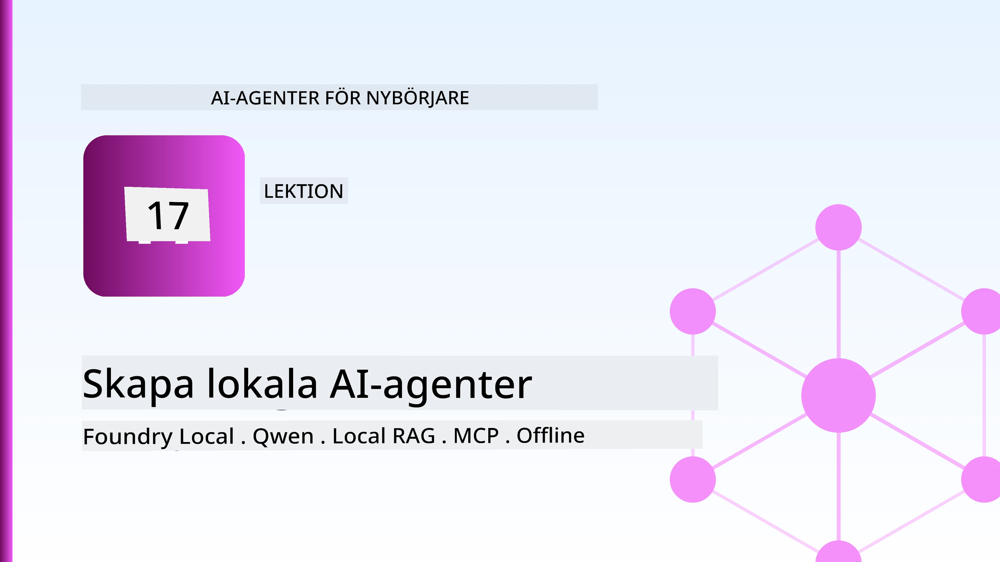
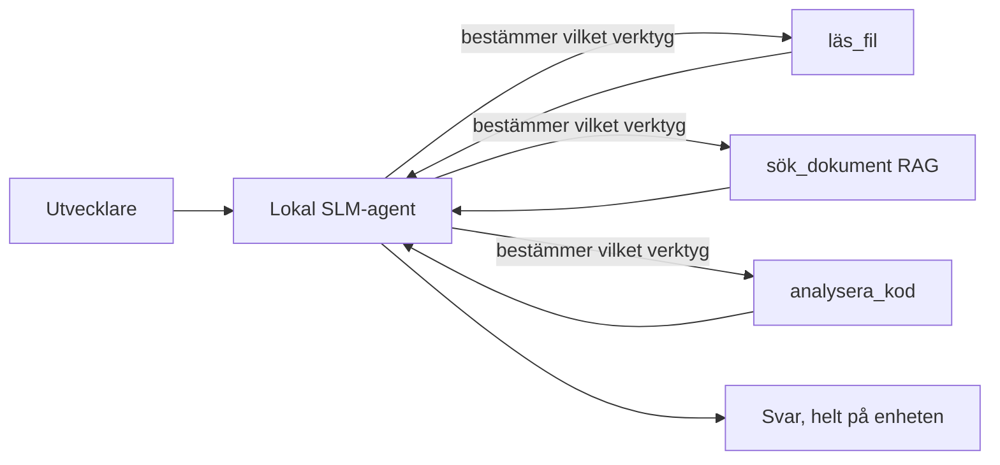
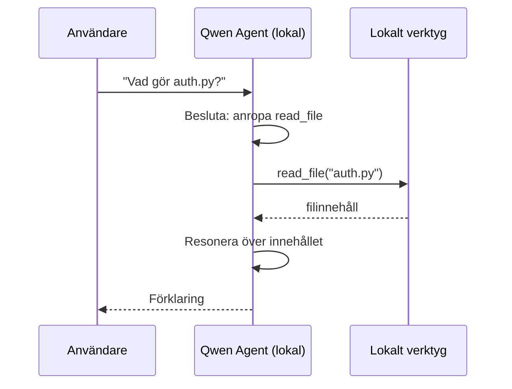
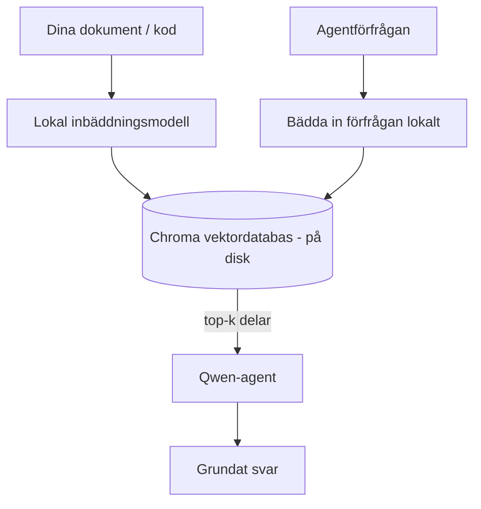
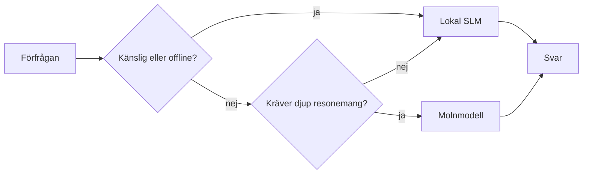

# Skapa Lokala AI-agenter med Microsoft Foundry Local och Qwen



Föregående lektion skalerade agenter *upp* till molnet. Den här tar dem *ner* till en enda maskin. I slutet kommer du att ha en fungerande ingenjörsassistent som resonerar, anropar verktyg, läser dina filer och söker i din dokumentation — **utan en enda molninferensförfrågan.**

Varför skulle du vilja det? Tre anledningar som ständigt återkommer i verkligt ingenjörsarbete:

- **Sekretess.** Koden och dokumenten lämnar aldrig maskinen. Inget prompt, inget utdrag, inga kunddata korsar nätverksgränsen.
- **Kostnad.** Lokal inferens har ingen avgift per token. Du kan iterera hela dagen för priset av elektricitet.
- **Offline.** På ett flygplan, i en säker anläggning eller under ett avbrott fungerar agenten fortfarande.

Fångsten är att du byter ut en avancerad molnmodell mot en **Small Language Model (SLM)** som körs på din CPU, GPU eller NPU. Den här lektionen handlar om att bygga agenter som är *bra* inom den begränsningen snarare än att låtsas att begränsningen inte finns.

## Introduktion

Den här lektionen kommer att täcka:

- **Small Language Models (SLM)** — vad de är, var de är bra, och var de inte är det.
- **Microsoft Foundry Local** — en runtime som laddar ner och serverar modeller lokalt via en **OpenAI-kompatibel API**.
- **Qwen funktionsanropsmodeller** — SLM:er som pålitligt producerar verktygsanrop, vilket är det som gör lokala *agenter* (inte bara lokal chatt) möjliga.
- **Lokala verktyg, lokal RAG och lokal MCP** — som ger agenten kapacitet utan molnet.
- **Hybrida mönster** — när man ska hålla saker lokala och när man ska använda molnet.

## Lärandemål

Efter att ha genomfört denna lektion kommer du att kunna:

- Förklara för- och nackdelar med SLM:er och välja lämpliga användningsfall för lokala agenter.
- Servera en Qwen-modell lokalt med Foundry Local och ansluta till den via den OpenAI-kompatibla slutpunkten.
- Bygga en verktygsanropande agent som körs helt på din arbetsstation.
- Lägga till lokal RAG över dina egna dokument med en lokal vektordatabas (Chroma).
- Ansluta agenten till en lokal MCP-server och resonera kring hybrida lokala/molnmönster.

## Förutsättningar

Denna lektion förutsätter att du har genomfört tidigare lektioner och är bekväm med:

- [Verktygsanvändning](../04-tool-use/README.md) (Lektion 4) och [Agentic RAG](../05-agentic-rag/README.md) (Lektion 5).
- [Agentic Protocols / MCP](../11-agentic-protocols/README.md) (Lektion 11).
- [Microsoft Agent Framework](../14-microsoft-agent-framework/README.md) (Lektion 14).

Du behöver också:

- En utvecklararbetsstation. **8 GB RAM är ett realistiskt minimum**; 16 GB+ är bekvämt. GPU eller NPU hjälper men är inte nödvändigt.
- **Microsoft Foundry Local** installerat (se installationsavsnittet nedan).
- Python 3.12+ och paketen i repositoryts [`requirements.txt`](../../../requirements.txt), plus `foundry-local-sdk`, `openai` och `chromadb` för denna lektion.

## Small Language Models: Det rätta verktyget för lokalt arbete

En avancerad molnmodell har hundratals miljarder parametrar och ett datacenter bakom sig. En SLM har några miljarder parametrar och måste rymmas i din laptops RAM. Den skillnaden sätter tydliga förväntningar.

**SLM:er är bra på:**

- Strukturerade, avgränsade uppgifter — klassificering, extraktion, sammanfattning av ett känt dokument.
- **Verktygsanrop** — att avgöra vilken funktion som ska anropas och med vilka argument.
- Snabb, billig, privat iteration på dina egna data.

**SLM:er är svagare på:**

- Öppna, flerstegsrationella resonemang över stort kontext.
- Bred generell kunskap (de har sett mindre och glömmer mer).

Den vinnande strategin för lokala agenter är därför: **låt SLM:en orkestrera och låt verktygen göra det tunga arbetet.** Modellen behöver inte *kunna* din kodbas — den behöver veta när den ska anropa `read_file` och `search_docs`. Det passar direkt in på en SLMs styrkor.



## Microsoft Foundry Local

**Microsoft Foundry Local** är en lättviktig runtime som laddar ner, hanterar och serverar modeller helt på din maskin. Dess viktigaste funktion för oss är att den exponerar en **OpenAI-kompatibel HTTP-slutpunkt** — vilket betyder att OpenAI SDK och Microsoft Agent Frameworks OpenAI-klient fungerar mot den med bara en ändring av `base_url`. Allt du lärt dig om att bygga agenter överförs direkt; bara slutpunkten flyttas från molnet till `localhost`.

Foundry Local väljer också automatiskt den bästa bygget för din hårdvara — en CPU-version, en CUDA/GPU-version eller en NPU-version — så du behöver inte optimera för varje maskin.

### Installation

Installera Foundry Local (se [dokumentationen](https://learn.microsoft.com/azure/ai-foundry/foundry-local/) för ditt operativsystem) och bekräfta att det fungerar:

```bash
# Installera (exempel; följ dokumentationen för din plattform)
winget install Microsoft.FoundryLocal      # Windows
# brew install microsoft/foundrylocal/foundrylocal   # macOS

# Ladda ner och kör en Qwen-modell, starta sedan den lokala tjänsten
foundry model run qwen2.5-7b-instruct
foundry service status
```

När tjänsten körs har du en lokal, OpenAI-kompatibel slutpunkt (vanligtvis `http://localhost:PORT/v1`). Notebooken använder `foundry-local-sdk` för att automatiskt upptäcka slutpunkten, så du behöver inte hårdkoda porten.

## Qwen Funktionanrop: Varför det är viktigt

En agent är bara en agent om den kan anropa verktyg. Många SLM:er kan chatta men genererar opålitliga, felaktiga verktygsanrop. **Qwen**-modeller tränas för funktionsanrop och genererar konsekvent välformade verktygsanropsstrukturer — vilket är precis det som förvandlar en lokal chattmodell till en lokal *agent*.

Flödet är den standardiserade loop för verktygsanrop som du redan känner till, men körs på enheten:



## Lokal RAG

Dokumentationssökning är där lokala agenter verkligen gör nytta. Istället för att hoppas att SLM:en har memorerat ditt ramverks dokumentation så bäddar du in dessa dokument i en **lokal vektordatabas** och låter agenten hämta relevanta delar på begäran.

Vi använder **Chroma**, en inbäddad vektorbutik som körs i processen utan server att hantera. Pipen är helt lokal: lokal inbäddningsmodell → lokala vektorer → lokal hämtning → lokal SLM.



Detta är samma Agentic RAG-mönster från Lektion 5 — enda skillnaden är att varje komponent körs på din maskin.

## Lokala MCP-servrar

[MCP](../11-agentic-protocols/README.md) är en transport, inte en molntjänst. En MCP-server kan köras som en lokal process på `stdio` och exponera verktyg för din agent via standardprotokollet. Detta låter dig återanvända det växande ekosystemet av MCP-servrar — filsystemåtkomst, git-operationer, databassökningar — helt offline.

Säkerhetsläget är annorlunda än i molnet, men inte obefintligt: en lokal MCP-server körs fortfarande med dina användarbehörigheter, så begränsa vad den kan nå (en projektmapp, inte hela din hemmakatalog) och behandla dess utdata som inputs att validera.

## Hybrida moln- och lokalmönster

Lokal-först betyder inte bara lokalt. Mogna system styr efter känslighet och svårighet:

| Situation | Var det körs |
| --- | --- |
| Känslig kod/data eller offline | **Lokal SLM** |
| Enkel, avgränsad uppgift | **Lokal SLM** (billig, snabb) |
| Svårt flerstegsresonerande på icke-känslig data | **Molnmodell** |
| Allt vid nätverksavbrott | **Lokal SLM** (smygande degradering) |

Detta speglar idén om **modellroutning** från Lektion 16 — förutom att en av "modellerna" nu är din egen maskin. En robust design faller tillbaka på lokalt vid molnfel, så agenten degraderas i kvalitet istället för att helt misslyckas.



## Praktiskt laboratorium: En lokal ingenjörsassistent

Öppna [`code_samples/17-local-agent-foundry-local.ipynb`](./code_samples/17-local-agent-foundry-local.ipynb) och arbeta igenom den. Du kommer att bygga en **lokal ingenjörsassistent** som körs helt på din arbetsstation och kan:

1. **Anropa verktyg** — via Qwen funktionsanrop genom Foundry Local.
2. **Utföra lokala filoperationer** — lista och läsa filer i en projektmapp.
3. **Analysera kod** — rapportera grundläggande mått på en källfil.
4. **Söka dokumentation** — lokal RAG över en dokumentskatalog med Chroma.
5. **Använda MCP** — ansluta till en lokal MCP-server (med en smidig hoppa-över-funktion om ingen är konfigurerad).

Ingen molninferens används vid något tillfälle.

### Steg-för-steg

Assistenten ansluter till Foundry Local via den OpenAI-kompatibla slutpunkten, så agentkoden ser nästan identisk ut med molnlektionerna — bara klienten ändras:

```python
from foundry_local import FoundryLocalManager
from openai import OpenAI

# Foundry Local upptäcker/downloader modellen och ger oss en lokal slutpunkt.
manager = FoundryLocalManager(\"qwen2.5-7b-instruct\")
client = OpenAI(base_url=manager.endpoint, api_key=manager.api_key)  # api_key är en lokal platshållare
```

Verktygen är vanliga Python-funktioner som är avgränsade till en projektkatalog:

```python
def read_file(path: str) -> str:
    \"\"\"Read a file, but only inside the sandboxed project directory.\"\"\"
    full = (PROJECT_ROOT / path).resolve()
    if PROJECT_ROOT not in full.parents and full != PROJECT_ROOT:
        return \"Access denied: path is outside the project directory.\"
    return full.read_text(encoding=\"utf-8\")
```

Notera sandlådekontrollen — även lokalt är ett verktyg som läser godtyckliga sökvägar en risk. Notebooken håller varje verktyg begränsat till en enda projektrot.

## Kunskapskontroll

Testa din förståelse innan du går vidare till uppgiften.

**1. Ge två konkreta anledningar att köra en agent lokalt istället för i molnet.**

<details>
<summary>Svar</summary>

Vilka två som helst av: **sekretess** (kod och data lämnar aldrig maskinen), **kostnad** (ingen avgift per token för inferens), och **offline-förmåga** (fungerar utan nätverk — på ett flygplan, i en säker anläggning eller vid strömavbrott). Regulatoriska efterlevnadskrav som förbjuder att skicka data utanför enheten är en vanlig drivkraft bakom sekretessskälet.
</details>

**2. Vad är den rekommenderade arbetsfördelningen mellan en SLM och dess verktyg i en lokal agent, och varför?**

<details>
<summary>Svar</summary>

Låt SLM:en **orkestrera** (bestämma vilket verktyg som ska anropas och med vilka argument) och låt **verktygen göra det tunga arbetet** (läsa filer, hämta dokument, beräkna resultat). SLM:er är starka på avgränsade beslut som verktygsval men svagare på bred kunskap och långt flerstegsresonerande, så att luta sig mot verktyg spelar på deras styrkor.
</details>

**3. Vad gör det möjligt att återanvända molnagentkod med Foundry Local?**

<details>
<summary>Svar</summary>

Foundry Local exponerar en **OpenAI-kompatibel HTTP-slutpunkt**. OpenAI SDK och Agent Frameworks OpenAI-klient fungerar mot den genom att bara ändra `base_url` (och använda en lokal platshållar-API-nyckel). Allt annat i agentkoden förblir samma.
</details>

**4. Varför använder vi specifikt en Qwen funktionsanropsmodell istället för vilken SLM som helst?**

<details>
<summary>Svar</summary>

För att en agent måste producera pålitliga, välformade **verktygsanrop**. Många SLM:er kan chatta men avger felaktiga eller inkonsekventa verktygsanropsstrukturer. Qwen-modeller är tränade för funktionsanrop och producerar konsekventa verktygsanrop, vilket är det som förvandlar en lokal chattmodell till en fungerande lokal agent.
</details>

**5. Vilka komponenter i den lokala RAG-pipelinen körs på maskinen?**

<details>
<summary>Svar</summary>

Alla: inbäddningsmodellen, vektordatabasen (Chroma, på disk), hämtningsteget och SLM:en. Dokument bäddas in lokalt, lagras lokalt, hämtas lokalt och resoneras över av en lokal modell — ingen komponent når molnet.
</details>

**6. En lokal MCP-server körs på din maskin. Gör det den automatiskt säker? Vilka försiktighetsåtgärder bör du fortfarande vidta?**

<details>
<summary>Svar</summary>

Nej. En lokal MCP-server körs med dina användarbehörigheter, så den kan nå allt du kan. Begränsa den till vad den behöver (till exempel en enda projektmapp istället för hela hemmamappen) och behandla dess utdata som input som måste valideras innan du agerar på dem.
</details>

**7. Beskriv en rimlig hybrid routningsregel som inkluderar en lokal modell.**

<details>
<summary>Svar</summary>

Routa känsliga eller offline-förfrågningar till den lokala SLM; routa enkla avgränsade uppgifter till den lokala SLM för snabbhet och kostnad; routa svåra flerstegsresonerande på icke-känslig data till en molnmodell; och falla tillbaka på den lokala SLM om molnet inte är tillgängligt så att agenten degraderas mjukt istället för att helt misslyckas. Detta är modellroutning (Lektion 16) med den lokala maskinen som en av modellerna.
</details>

**8. Vad är en realistisk minnesminiminivå för att köra den lokala agenten i denna lektion, och vad får du fördel av med mer minne?**

<details>
<summary>Svar</summary>

Omkring **8 GB** är en realistisk miniminivå; 16 GB+ är bekvämt. Mer RAM låter dig köra större, mer kapabla modeller och behålla mer kontext i minnet. En GPU eller NPU påskyndar inferens men är inte nödvändigt — Foundry Local väljer en CPU-version när ingen accelerator finns.
</details>

## Uppgift

Utöka den lokala ingenjörsassistenten till en **lokal dokumentationsgranskare** för ett litet projekt efter eget val (använd gärna någon av detta repo:s lektionsmappar).

Din inlämning bör:

1. **Indexera en riktig dokument-/kodmapp** i Chroma (minst fem filer).
2. **Lägga till ett `find_todos`-verktyg** som skannar projektet efter `TODO`/`FIXME`-kommentarer och returnerar dem med fil och radnummer — med samma sandlådekontroll som `read_file`.

3. **Ställ agenten tre frågor** som tvingar den att kombinera verktyg: en ren RAG-fråga, en som kräver att läsa en specifik fil och en som kräver att hitta TODOs.
4. **Mät den**: tidsmät varje av de tre svaren och notera dem i en markdown-cell. Kommentera om latenstiden är acceptabel för din avsedda arbetsflöde.

Skriv sedan ett kort stycke om **vad du skulle flytta till molnet och vad du skulle behålla lokalt** för denna granskare, och varför. Du bedöms utifrån om de lokala komponenterna är korrekt sammankopplade och om din hybrida resonemang är sund — inte utifrån modellkvalitet.

## Sammanfattning

I denna lektion byggde du en agent som körs helt på din egen dator:

- **SLMs** byter bredd mot integritet, kostnad och offline-funktion — och är särskilt effektiva när de **orkestrerar verktyg** istället för att bära all kunskap själva.
- **Foundry Local** levererar modeller på enheten bakom en **OpenAI-kompatibel endpoint**, så din agentkod för molnet överförs med en ändring på en rad.
- **Qwen funktionsanropsmodeller** möjliggör tillförlitliga lokala verktygsanrop — och därmed lokala *agenter*.
- **Lokal RAG** (Chroma) och **lokal MCP** ger agenten kapacitet utan att lämna maskinen.
- **Hybrida mönster** låter dig dirigera efter känslighet och svårighetsgrad, med lokal som ett elegant fallback-alternativ.

Detta slutför distributionsbågen: Lektion 16 skalade upp agenter till Microsoft Foundry, och denna lektion skalade ner dem till en enda arbetsstation. Nästa lektion handlar om att hålla distribuerade agenter säkra.

## Ytterligare resurser

- <a href="https://learn.microsoft.com/azure/ai-foundry/foundry-local/" target="_blank">Microsoft Foundry Local dokumentation</a>
- <a href="https://learn.microsoft.com/azure/ai-foundry/what-is-azure-ai-foundry" target="_blank">Microsoft Foundry dokumentation</a>
- <a href="https://learn.microsoft.com/en-us/agent-framework/overview/?wt.mc_id=youtube_26688_organicsocial_reactor&pivots=programming-language-python" target="_blank">Microsoft Agent Framework</a>
- <a href="https://qwen.readthedocs.io/en/latest/framework/function_call.html" target="_blank">Qwen funktionsanropsdokumentation</a>
- <a href="https://modelcontextprotocol.io/" target="_blank">Model Context Protocol (MCP)</a>
- <a href="https://docs.trychroma.com/" target="_blank">Chroma vektordatabas</a>

## Föregående lektion

[Distribuera skalbara agenter](../16-deploying-scalable-agents/README.md)

## Nästa lektion

[Säkra AI-agenter](../18-securing-ai-agents/README.md)

---

<!-- CO-OP TRANSLATOR DISCLAIMER START -->
**Ansvarsfriskrivning**:
Detta dokument har översatts med hjälp av AI-översättningstjänsten [Co-op Translator](https://github.com/Azure/co-op-translator). Även om vi strävar efter noggrannhet, var vänlig notera att automatiska översättningar kan innehålla fel eller brister. Det ursprungliga dokumentet på dess modersmål bör betraktas som den auktoritativa källan. För kritisk information rekommenderas professionell mänsklig översättning. Vi ansvarar inte för några missförstånd eller feltolkningar som uppstår till följd av användningen av denna översättning.
<!-- CO-OP TRANSLATOR DISCLAIMER END -->